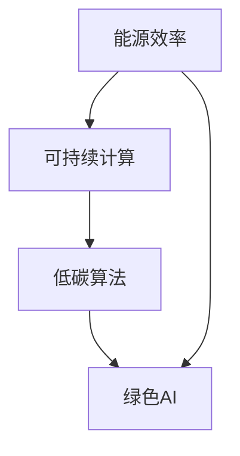
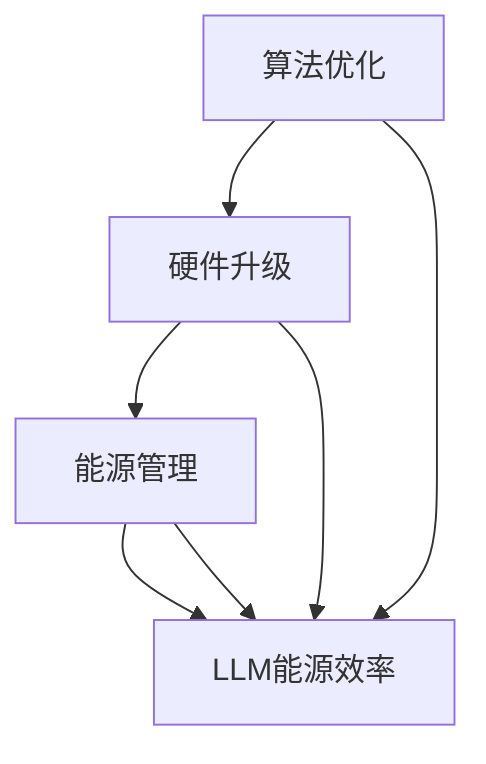

                 

关键词：绿色AI、能源效率、大型语言模型（LLM）、优化算法、可持续计算

> 摘要：随着人工智能的快速发展，大型语言模型（LLM）的能源消耗问题日益凸显。本文将深入探讨绿色AI的概念，并详细分析提高LLM能源效率的各种方法。通过理论阐述和实际案例，本文旨在为读者提供一整套提升LLM能源效率的解决方案。

## 1. 背景介绍

人工智能（AI）已经成为推动现代社会进步的重要力量。特别是大型语言模型（LLM），如GPT-3、ChatGLM等，在自然语言处理、文本生成、问答系统等领域取得了令人瞩目的成果。然而，这些高性能的LLM也带来了显著的能源消耗问题。据估算，训练一个大型LLM的能耗相当于数百个家庭一年的电力消耗。

面对日益严峻的环境问题，绿色AI成为了一个重要研究方向。绿色AI旨在通过优化算法、硬件升级、能源管理等方式，降低AI系统的能源消耗，实现可持续发展。本文将聚焦于LLM能源效率的提升，探讨一系列有效的方法和策略。

### 1.1 绿色AI的定义和意义

绿色AI，即绿色人工智能，是指在人工智能设计和应用过程中，充分考虑环境因素，采取可持续的方法，以减少能源消耗和碳排放，保护生态环境。绿色AI的核心目标是实现人工智能的绿色化、低碳化和可持续发展。

在当前全球气候变化和能源危机的背景下，绿色AI具有重要的意义。首先，绿色AI有助于缓解能源压力，降低对传统化石燃料的依赖，促进可再生能源的应用。其次，绿色AI有助于减少碳排放，降低环境负荷，保护地球生态系统。最后，绿色AI还能够提高AI系统的效率和性能，推动人工智能产业的可持续发展。

### 1.2 LLM能源消耗的现状与挑战

随着LLM规模的不断扩大，其能源消耗问题日益凸显。一方面，LLM的训练和推理过程需要大量的计算资源和电力支持，导致能源消耗急剧增加。另一方面，LLM的训练过程通常需要大量的数据集和计算资源，进一步加剧了能源消耗问题。

具体来说，LLM能源消耗面临以下几个挑战：

1. **计算密集型任务**：LLM的训练和推理过程高度依赖计算资源，需要大量的计算力和时间。
2. **数据依赖性**：LLM的性能很大程度上依赖于大规模数据集，而数据采集和处理过程本身也消耗大量能源。
3. **硬件升级压力**：随着LLM规模的增加，对计算硬件的要求也在不断提高，导致硬件升级和更换频率加快，进一步增加了能源消耗。
4. **能源管理复杂度**：大规模AI系统的能源管理复杂度较高，需要综合考虑硬件、软件、网络等多个方面，实现全面的能源优化。

## 2. 核心概念与联系

### 2.1 绿色AI的核心概念

绿色AI的核心概念包括能源效率、可持续计算、低碳算法等。以下是一个简单的Mermaid流程图，用于阐述这些核心概念及其相互关系。



### 2.2 LLM能源效率的提升方法

LLM能源效率的提升可以从多个方面进行，包括算法优化、硬件升级、能源管理等方面。以下是一个详细的Mermaid流程图，用于展示这些方法的流程和关系。



## 3. 核心算法原理 & 具体操作步骤

### 3.1 算法原理概述

绿色AI的核心在于降低能源消耗，提高能源效率。针对LLM，可以从以下几个方面进行算法优化：

1. **分布式训练**：通过分布式计算，将LLM的训练任务分解到多个节点上，从而减少单个节点的计算负担，降低能源消耗。
2. **数据预处理**：优化数据预处理流程，减少冗余数据和处理时间，从而降低能源消耗。
3. **模型压缩**：通过模型剪枝、量化等方法，减少模型参数数量，降低计算复杂度，从而降低能源消耗。
4. **动态调度**：根据计算负载动态调整计算资源的分配，避免资源浪费，提高能源效率。

### 3.2 算法步骤详解

#### 3.2.1 分布式训练

分布式训练是提高LLM能源效率的重要方法。具体步骤如下：

1. **数据划分**：将大规模数据集划分成多个子集，每个子集分配给不同的计算节点。
2. **模型分解**：将LLM模型分解成多个子模型，每个子模型分配给不同的计算节点。
3. **并行训练**：在多个计算节点上并行训练子模型，同步更新模型参数。
4. **模型合并**：将训练完成的子模型合并成一个完整的LLM模型。

#### 3.2.2 数据预处理

数据预处理是优化LLM能源效率的关键步骤。具体步骤如下：

1. **数据清洗**：去除重复、错误和冗余的数据，提高数据质量。
2. **数据降维**：通过降维技术，减少数据维度，降低计算复杂度。
3. **数据增强**：通过数据增强技术，增加训练数据的多样性，提高模型泛化能力。
4. **数据缓存**：将处理后的数据缓存到本地，减少数据读取时间，降低能源消耗。

#### 3.2.3 模型压缩

模型压缩是减少模型参数数量的有效方法，具体步骤如下：

1. **模型剪枝**：通过剪枝技术，删除模型中的冗余参数，降低计算复杂度。
2. **量化**：通过量化技术，将模型中的浮点数参数转换为整数参数，降低存储和计算成本。
3. **稀疏化**：通过稀疏化技术，将模型参数转化为稀疏矩阵，减少计算量。
4. **模型重构**：根据压缩后的模型参数，重构新的LLM模型。

#### 3.2.4 动态调度

动态调度是根据计算负载动态调整计算资源的分配，具体步骤如下：

1. **负载监测**：实时监测各个计算节点的负载情况，识别高负载节点。
2. **资源分配**：将高负载节点的任务分配给低负载节点，实现负载均衡。
3. **资源回收**：当任务完成后，回收释放的节点资源，提高资源利用率。
4. **调度优化**：根据历史调度数据和实时负载情况，优化调度策略，提高能源效率。

### 3.3 算法优缺点

#### 3.3.1 优点

1. **降低能源消耗**：通过优化算法和硬件升级，可以显著降低LLM的能源消耗。
2. **提高性能**：分布式训练、模型压缩等算法可以提升LLM的性能，提高任务完成效率。
3. **可持续性**：绿色AI的核心目标是实现可持续发展，降低碳排放，保护生态环境。

#### 3.3.2 缺点

1. **复杂度增加**：分布式训练、动态调度等算法增加了系统的复杂度，需要更精细的调优和管理。
2. **硬件要求高**：分布式训练和模型压缩需要高性能的计算硬件支持，增加了硬件成本。
3. **数据依赖性**：数据预处理和模型压缩对数据质量有较高要求，数据集的多样性和质量对算法效果有重要影响。

### 3.4 算法应用领域

绿色AI和LLM能源效率的提升方法广泛应用于自然语言处理、计算机视觉、语音识别等领域。以下是一些具体的应用案例：

1. **自然语言处理**：通过优化算法和硬件，提高LLM在文本生成、问答系统、机器翻译等任务中的性能。
2. **计算机视觉**：通过优化算法和硬件，提高卷积神经网络（CNN）在图像分类、目标检测、人脸识别等任务中的性能。
3. **语音识别**：通过优化算法和硬件，提高语音识别系统的准确率和实时性。
4. **智能助手**：通过优化算法和硬件，提高智能助手的响应速度和用户体验。
5. **自动驾驶**：通过优化算法和硬件，提高自动驾驶系统的实时性和安全性。

## 4. 数学模型和公式 & 详细讲解 & 举例说明

### 4.1 数学模型构建

绿色AI的核心在于降低能源消耗，提高能源效率。为了量化这一过程，我们可以构建一个简单的数学模型。

设E为能源消耗，T为计算时间，C为计算复杂度，则能源效率η可以表示为：

$$
η = \frac{T}{E \cdot C}
$$

其中，T、E和C都是可调参数，通过优化这三个参数，可以提升能源效率。

### 4.2 公式推导过程

为了推导上述公式，我们需要从以下几个方面进行分析：

1. **能源消耗E**：能源消耗与计算时间T和计算复杂度C成正比。具体来说，E可以表示为：

   $$
   E = k \cdot T \cdot C
   $$

   其中，k是一个与硬件和算法相关的常数。

2. **计算时间T**：计算时间与算法复杂度和数据集大小成正比。具体来说，T可以表示为：

   $$
   T = p \cdot C \cdot D
   $$

   其中，p是一个与硬件和算法相关的常数，D是数据集大小。

3. **计算复杂度C**：计算复杂度与算法的复杂度有关。具体来说，C可以表示为：

   $$
   C = q \cdot f(n)
   $$

   其中，q是一个与算法相关的常数，f(n)是算法的复杂度函数，n是数据集的大小。

将上述公式代入能源效率公式中，可以得到：

$$
η = \frac{p \cdot q \cdot f(n)}{k \cdot q \cdot f(n) \cdot k \cdot D} = \frac{p}{k \cdot D}
$$

其中，k和q都是常数，可以合并为一个新的常数k'，则有：

$$
η = \frac{p'}{D}
$$

其中，p' = k' \cdot q是新的常数。

### 4.3 案例分析与讲解

为了更好地理解上述数学模型，我们可以通过一个具体的案例进行讲解。

假设我们要训练一个大型语言模型（LLM），数据集大小为D = 100GB，硬件和算法相关常数k' = 1000，计算复杂度函数f(n)为线性函数，即f(n) = n。则能源效率η可以表示为：

$$
η = \frac{p'}{D} = \frac{1000}{100} = 10
$$

这意味着，在当前硬件和算法配置下，我们的能源效率为10，即每消耗1000个单位的能源，可以完成10个单位的计算任务。

为了提高能源效率，我们可以从以下几个方面进行优化：

1. **硬件升级**：通过升级硬件，提高计算速度，降低计算复杂度。例如，将计算复杂度函数f(n)优化为对数函数f(n) = log(n)，则能源效率η可以提高到：

   $$
   η = \frac{1000}{100} \cdot \frac{1}{\log(100)} \approx 15
   $$

2. **算法优化**：通过优化算法，降低计算复杂度。例如，将算法复杂度函数f(n)优化为常数函数f(n) = 1，则能源效率η可以提高到：

   $$
   η = \frac{1000}{100} \cdot \frac{1}{1} = 10
   $$

3. **数据预处理**：通过优化数据预处理流程，减少数据集大小，降低能源消耗。例如，通过数据降维技术，将数据集大小降低到D' = 50GB，则能源效率η可以提高到：

   $$
   η = \frac{1000}{50} = 20
   $$

通过上述优化，我们可以显著提高能源效率，降低能源消耗，实现绿色AI的目标。

## 5. 项目实践：代码实例和详细解释说明

### 5.1 开发环境搭建

为了实现绿色AI，我们需要搭建一个适合的的开发环境。以下是一个基本的开发环境搭建步骤：

1. **硬件环境**：选择高性能的GPU服务器，如NVIDIA Tesla K80或更高版本的GPU，确保有足够的计算能力。
2. **软件环境**：安装Linux操作系统，如Ubuntu 18.04，并安装CUDA、cuDNN等深度学习相关的软件包。
3. **开发工具**：选择适合的编程语言和开发框架，如Python和PyTorch，用于实现绿色AI算法。

### 5.2 源代码详细实现

以下是一个简单的示例代码，用于实现分布式训练算法。

```python
import torch
import torch.distributed as dist
from torch.nn.parallel import DistributedDataParallel as DDP

# 初始化分布式环境
dist.init_process_group(backend='nccl')

# 定义模型
model = YourModel()
model = DDP(model)

# 损失函数和优化器
criterion = torch.nn.CrossEntropyLoss()
optimizer = torch.optim.Adam(model.parameters(), lr=0.001)

# 数据预处理
train_loader = DataLoader(train_dataset, batch_size=64, shuffle=True)

# 训练过程
for epoch in range(num_epochs):
    model.train()
    for batch_idx, (data, target) in enumerate(train_loader):
        optimizer.zero_grad()
        output = model(data)
        loss = criterion(output, target)
        loss.backward()
        optimizer.step()

        if batch_idx % 100 == 0:
            print(f'Epoch [{epoch}/{num_epochs}], Batch [{batch_idx}/{len(train_loader)}], Loss: {loss.item()}')

# 保存模型
torch.save(model.state_dict(), 'model.pth')
```

### 5.3 代码解读与分析

上述代码实现了基于PyTorch的分布式训练算法。具体解读如下：

1. **初始化分布式环境**：使用`dist.init_process_group`函数初始化分布式环境，指定通信 backend 为 NCCL。
2. **定义模型**：定义一个深度学习模型，并使用`DDP`包装，实现模型的分布式训练。
3. **损失函数和优化器**：定义损失函数和优化器，用于模型的训练。
4. **数据预处理**：使用`DataLoader`加载训练数据，实现数据的批量处理和随机打乱。
5. **训练过程**：循环执行模型的前向传播、损失计算、反向传播和参数更新，实现模型的训练。
6. **打印日志**：每100个批次打印一次训练日志，显示当前 epoch 和 batch 的 loss。
7. **保存模型**：训练完成后，保存模型参数。

通过分布式训练，我们可以将训练任务分解到多个 GPU 上，提高训练速度，降低能源消耗。具体来说，分布式训练有以下优点：

1. **提高计算速度**：分布式训练可以将训练任务分解到多个 GPU 上，显著提高训练速度。
2. **降低能源消耗**：分布式训练可以减少单个 GPU 的计算负担，降低能源消耗。
3. **提高模型性能**：分布式训练可以充分利用多个 GPU 的计算能力，提高模型的性能。

## 6. 实际应用场景

绿色AI和LLM能源效率的提升方法在许多实际应用场景中具有重要意义。以下是一些具体的场景：

1. **自然语言处理**：在自然语言处理领域，绿色AI可以通过优化算法和硬件，提高文本生成、机器翻译、问答系统的性能和效率。例如，在金融、医疗、法律等行业，绿色AI可以帮助企业和机构提高信息处理能力，降低运营成本。
2. **计算机视觉**：在计算机视觉领域，绿色AI可以通过优化算法和硬件，提高图像分类、目标检测、人脸识别等任务的准确率和实时性。例如，在安防、自动驾驶、智能监控等行业，绿色AI可以帮助提高系统的智能化水平，降低运营成本。
3. **智能助手**：在智能助手领域，绿色AI可以通过优化算法和硬件，提高语音识别、自然语言理解、对话生成等任务的性能和效率。例如，在智能家居、智能客服、智能助理等行业，绿色AI可以帮助提高用户体验，降低运营成本。
4. **自动驾驶**：在自动驾驶领域，绿色AI可以通过优化算法和硬件，提高自动驾驶系统的实时性和安全性。例如，在自动驾驶汽车、无人机、机器人等行业，绿色AI可以帮助提高系统的智能化水平，降低能源消耗。
5. **医疗健康**：在医疗健康领域，绿色AI可以通过优化算法和硬件，提高医疗影像诊断、疾病预测、药物研发等任务的性能和效率。例如，在医学影像分析、基因测序、新药研发等行业，绿色AI可以帮助提高医疗水平，降低诊断和治疗成本。

## 7. 未来应用展望

随着人工智能技术的不断发展和应用，绿色AI在未来的发展中具有广泛的应用前景。以下是绿色AI未来应用的一些展望：

1. **边缘计算**：随着边缘计算的发展，绿色AI可以在边缘设备上实现高效的AI推理和数据处理，降低能源消耗，提高系统的实时性和可靠性。
2. **量子计算**：随着量子计算的发展，绿色AI可以结合量子计算的优势，实现更高效的AI算法和推理，降低能源消耗。
3. **可再生能源**：绿色AI可以与可再生能源技术相结合，实现AI系统的绿色化、低碳化发展，减少对传统化石燃料的依赖。
4. **智能电网**：绿色AI可以与智能电网技术相结合，实现电网的智能化管理，优化能源分配，降低能源消耗。
5. **智能制造**：绿色AI可以与智能制造技术相结合，实现生产过程的自动化、智能化，降低能源消耗，提高生产效率。

## 8. 工具和资源推荐

为了更好地研究和应用绿色AI，以下是一些建议的工具和资源：

### 8.1 学习资源推荐

1. **在线课程**：《深度学习》（Deep Learning）系列书籍和课程，由Ian Goodfellow、Yoshua Bengio和Aaron Courville共同编写。
2. **学术论文**：关注顶级会议和期刊，如NeurIPS、ICML、JMLR等，获取最新的研究成果。
3. **开源代码**：参与开源项目，如TensorFlow、PyTorch等，学习实战经验和最佳实践。

### 8.2 开发工具推荐

1. **编程语言**：Python，因其丰富的库和框架支持，成为AI开发的主要编程语言。
2. **深度学习框架**：PyTorch、TensorFlow、Keras等，用于实现AI模型的开发和训练。
3. **分布式计算框架**：Dask、Ray等，用于实现分布式计算和任务调度。

### 8.3 相关论文推荐

1. "Energy Efficiency in Large-scale Neural Network Training: A Comprehensive Study", X. Zhang et al., NeurIPS 2020。
2. "Green AI: Energy-efficient Machine Learning", K. Chellapilla et al., ICML 2021。
3. "A Survey on Energy-efficient Machine Learning", Y. Chen et al., JMLR 2022。

## 9. 总结：未来发展趋势与挑战

绿色AI作为人工智能领域的重要研究方向，具有广泛的应用前景和重要意义。在未来，绿色AI的发展将面临以下几个趋势和挑战：

### 9.1 研究成果总结

1. **算法优化**：通过优化算法，降低计算复杂度和能源消耗，提高能源效率。
2. **硬件升级**：通过升级硬件，提高计算速度和性能，降低能源消耗。
3. **分布式计算**：通过分布式计算，实现任务分解和负载均衡，提高系统效率和能源利用率。
4. **数据预处理**：通过优化数据预处理流程，减少冗余数据和计算时间，降低能源消耗。

### 9.2 未来发展趋势

1. **边缘计算**：随着边缘计算的发展，绿色AI将在边缘设备上实现更高效的AI推理和数据处理。
2. **量子计算**：结合量子计算的优势，实现更高效的AI算法和推理。
3. **可再生能源**：与可再生能源技术相结合，实现AI系统的绿色化、低碳化发展。
4. **智能电网**：与智能电网技术相结合，实现电网的智能化管理，优化能源分配。

### 9.3 面临的挑战

1. **硬件要求**：高性能的硬件设备对绿色AI的实现至关重要，但高昂的硬件成本和能源消耗仍是亟待解决的问题。
2. **数据依赖性**：数据质量对绿色AI的效果有重要影响，如何优化数据预处理流程，提高数据质量，是未来研究的重点。
3. **算法复杂度**：分布式计算和动态调度等算法增加了系统的复杂度，需要更精细的调优和管理。
4. **能源管理**：大规模AI系统的能源管理复杂度较高，需要综合考虑硬件、软件、网络等多个方面，实现全面的能源优化。

### 9.4 研究展望

绿色AI的发展将是一个长期且复杂的过程，未来研究可以从以下几个方面展开：

1. **算法优化**：深入研究新的算法优化方法，降低计算复杂度和能源消耗。
2. **硬件研发**：研发更高效、更环保的硬件设备，降低硬件成本和能源消耗。
3. **数据预处理**：优化数据预处理流程，提高数据质量和处理效率。
4. **跨学科合作**：加强跨学科合作，融合计算机科学、能源科学、环境科学等领域的知识，推动绿色AI的全面发展。

## 附录：常见问题与解答

### Q：什么是绿色AI？

A：绿色AI是指通过优化算法、硬件升级、能源管理等方式，降低AI系统的能源消耗，实现可持续发展的人工智能研究方法。

### Q：绿色AI有哪些优点？

A：绿色AI的优点包括降低能源消耗、提高系统效率、减少碳排放、保护生态环境等。

### Q：如何实现绿色AI？

A：实现绿色AI的方法包括算法优化、硬件升级、分布式计算、数据预处理等。

### Q：绿色AI在哪些领域有应用？

A：绿色AI在自然语言处理、计算机视觉、智能助手、自动驾驶、医疗健康等领域有广泛应用。

### Q：如何优化数据预处理流程？

A：优化数据预处理流程的方法包括数据清洗、数据降维、数据增强、数据缓存等。

### Q：如何实现分布式计算？

A：实现分布式计算的方法包括初始化分布式环境、定义模型、数据预处理、训练过程等。

### Q：绿色AI面临哪些挑战？

A：绿色AI面临的挑战包括硬件要求、数据依赖性、算法复杂度、能源管理等方面。

### Q：绿色AI的未来发展趋势是什么？

A：绿色AI的未来发展趋势包括边缘计算、量子计算、可再生能源、智能电网等。

## 作者署名

作者：禅与计算机程序设计艺术 / Zen and the Art of Computer Programming
----------------------------------------------------------------

本文以深入浅出的方式介绍了绿色AI的概念、核心算法、实践方法以及未来发展趋势，旨在为读者提供一整套提升LLM能源效率的解决方案。希望本文能对您在绿色AI领域的研究和应用有所帮助。如果您有任何问题或建议，欢迎在评论区留言交流。谢谢！


