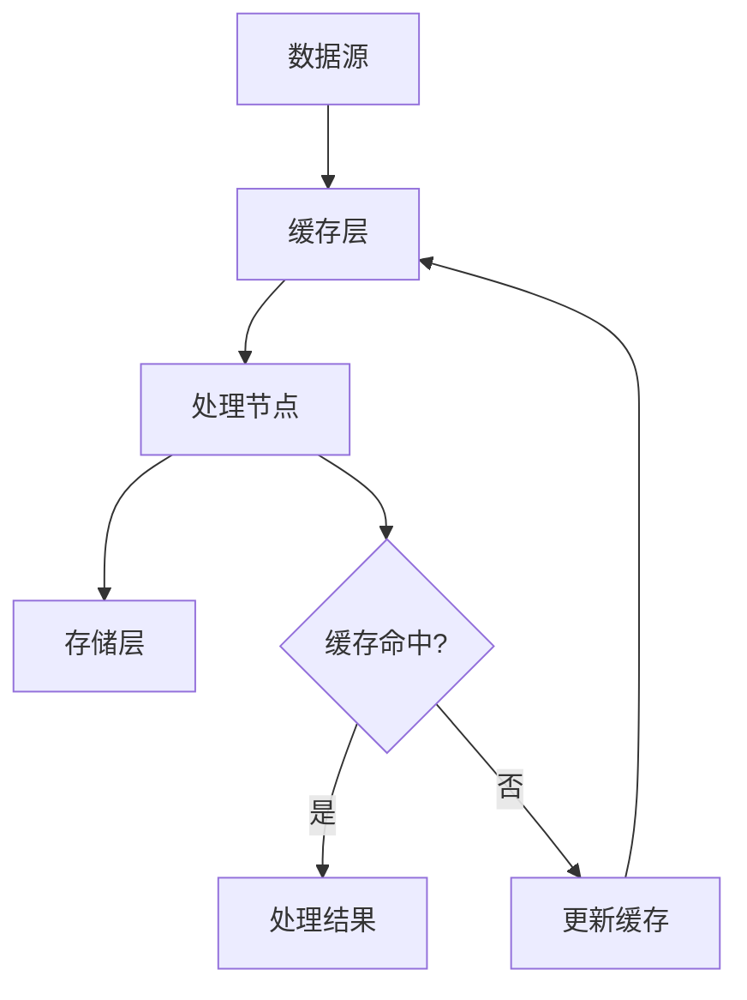

                 

### 关键词 Keywords
- 缓存机制
- 高吞吐量
- 数据处理
- 性能优化
- 实例应用

<|assistant|>### 摘要 Abstract
本文深入探讨了缓存机制在高吞吐量数据处理中的应用。通过对缓存基本概念、工作原理、核心算法的介绍，以及数学模型和公式的推导，本文详细分析了缓存机制在提高系统性能、降低延迟和减少资源消耗方面的作用。同时，通过实际项目中的代码实例，展示了缓存机制的实现方法和效果，为读者提供了具有实际操作价值的参考。文章最后对未来缓存技术发展趋势和面临的挑战进行了展望，旨在为读者提供全面的缓存技术指导和研究方向。

## 1. 背景介绍

在现代信息时代，数据已经成为企业和个人不可或缺的资源。随着数据量的爆炸性增长，如何高效地处理和利用这些数据成为一个重要的课题。高吞吐量数据处理（High Throughput Data Processing）作为一种关键技术，旨在确保系统能够在处理大量数据时保持较高的效率和性能。而缓存机制（Cache Mechanism）作为提高数据处理性能的关键手段，广泛应用于各种场景，如数据库查询加速、网络请求优化、内存管理等方面。

缓存机制的引入，主要是为了解决以下几个问题：

1. **降低延迟**：通过缓存热点数据，可以减少对后端系统的访问时间，从而降低整体系统的响应时间。
2. **减少资源消耗**：缓存机制能够减少对存储资源的直接访问，降低存储系统的负载，延长其使用寿命。
3. **提升系统性能**：缓存机制能够缓存处理结果，避免重复计算，从而提升系统的整体性能。

在高吞吐量数据处理中，缓存机制的应用场景主要包括：

1. **数据库查询缓存**：通过缓存查询结果，减少数据库的访问次数，提高查询效率。
2. **网络请求缓存**：缓存频繁访问的网络资源，如图片、视频等，减少网络流量和延迟。
3. **内存缓存**：将常用数据存储在内存中，提高数据处理速度。

本文将围绕缓存机制在高吞吐量数据处理中的应用，介绍其基本概念、工作原理、核心算法，并通过实际案例进行分析和讲解，以期为读者提供全面的缓存技术指南。

## 2. 核心概念与联系

### 2.1. 缓存机制概述

缓存机制是一种利用临时存储空间（如内存、SSD等）存储频繁访问的数据的技术。其基本思想是：在频繁访问的数据和原始数据源（如磁盘、网络等）之间引入一个或多个缓存层，以提高数据访问速度和系统性能。

缓存机制的关键概念包括：

1. **缓存命中（Cache Hit）**：当请求的数据已经在缓存中时，称为缓存命中。缓存命中可以显著减少数据访问时间。
2. **缓存未命中（Cache Miss）**：当请求的数据不在缓存中时，称为缓存未命中。缓存未命中需要从原始数据源中读取数据，并更新缓存。
3. **缓存替换策略（Cache Replacement Policy）**：缓存空间有限，当缓存已满时，需要选择一种策略来替换旧数据，常用的替换策略包括最近最少使用（LRU）、最少使用（LFU）等。

### 2.2. 高吞吐量数据处理架构

高吞吐量数据处理通常采用分布式架构，以实现海量数据的并行处理。分布式架构中的关键组件包括：

1. **数据源**：数据源包括数据库、文件系统、网络等，提供原始数据。
2. **数据处理节点**：数据处理节点负责执行数据处理任务，通常采用分布式计算框架，如MapReduce、Spark等。
3. **缓存层**：缓存层位于数据源和处理节点之间，用于存储和处理过程中频繁访问的数据。
4. **存储层**：存储层用于存储最终的数据处理结果，通常采用分布式存储系统，如Hadoop HDFS、MongoDB等。

### 2.3. 缓存机制与高吞吐量数据处理的关系

缓存机制在高吞吐量数据处理中发挥着重要作用，主要体现在以下几个方面：

1. **降低数据访问延迟**：缓存频繁访问的数据，减少对后端数据源的访问次数，从而降低数据访问延迟。
2. **提高系统性能**：通过缓存热点数据，减少重复计算和访问，提高系统整体性能。
3. **优化资源利用**：缓存机制能够降低对后端存储系统的访问压力，延长存储系统的使用寿命。

### 2.4. 缓存机制的 Mermaid 流程图

下面是缓存机制在高吞吐量数据处理中的 Mermaid 流程图：



在上述流程图中，数据从数据源读取到缓存层，缓存层再将数据传递给处理节点。如果缓存命中，处理节点直接使用缓存中的数据；如果缓存未命中，处理节点从缓存层读取数据并更新缓存。最后，处理结果存储到存储层。

### 2.5. 核心算法原理

缓存机制的核心算法主要包括缓存替换策略和缓存数据更新策略。

#### 2.5.1. 缓存替换策略

缓存替换策略用于确定何时将缓存中的旧数据替换为新数据。常用的缓存替换策略包括：

1. **最近最少使用（LRU）**：LRU算法将最近最少使用的数据替换掉。具体实现方法可以是使用双向链表或者哈希表加双向链表的组合。
2. **最少使用（LFU）**：LFU算法将最少使用的数据替换掉。需要维护每个数据的访问次数，并基于访问次数进行替换。

#### 2.5.2. 缓存数据更新策略

缓存数据更新策略用于确定何时更新缓存中的数据。常用的缓存数据更新策略包括：

1. **定时更新**：定期检查缓存中的数据，并根据过期时间进行更新。
2. **事件驱动更新**：根据数据源的事件触发缓存更新，如数据库更新、网络事件等。

### 2.6. 核心算法步骤详解

下面是缓存机制的详细算法步骤：

#### 2.6.1. 缓存替换策略（以LRU为例）

1. 初始化一个双向链表，用于维护缓存中的数据。
2. 当请求缓存中的数据时，将该数据移动到链表头部。
3. 当缓存已满时，将链表尾部的数据替换为新数据。

#### 2.6.2. 缓存数据更新策略（以定时更新为例）

1. 初始化一个定时任务，定时检查缓存中的数据。
2. 检查缓存中的每个数据，如果数据已过期，将其从缓存中移除。

### 2.7. 缓存机制的优缺点

#### 2.7.1. 优点

1. 提高数据访问速度，降低系统响应时间。
2. 减少对后端数据源的访问压力，优化资源利用。
3. 提高系统整体性能，减少重复计算和访问。

#### 2.7.2. 缺点

1. 缓存容量有限，可能导致缓存未命中。
2. 需要维护缓存的一致性，避免数据过期或过期后无法及时更新。

### 2.8. 缓存机制的应用领域

缓存机制在以下领域具有广泛的应用：

1. **数据库查询优化**：通过缓存查询结果，减少数据库访问次数。
2. **Web缓存**：缓存网页内容，提高网页加载速度。
3. **CDN**：缓存网络资源，减少网络延迟。
4. **内存管理**：缓存常用数据，提高内存访问速度。

### 2.9. 数学模型和公式

缓存机制涉及多个数学模型和公式，用于评估缓存性能和优化缓存策略。以下是一些常用的数学模型和公式：

#### 2.9.1. 缓存命中率

缓存命中率是衡量缓存性能的重要指标，表示缓存命中的比例。计算公式如下：

$$
缓存命中率 = \frac{缓存命中次数}{总访问次数}
$$

#### 2.9.2. 平均访问时间

平均访问时间是衡量缓存性能的另一个重要指标，表示访问数据所需的时间。计算公式如下：

$$
平均访问时间 = 缓存命中时间 \times 缓存命中率 + 缓存未命中时间 \times (1 - 缓存命中率)
$$

#### 2.9.3. 缓存容量

缓存容量是缓存机制的重要参数，表示缓存可以存储的数据量。缓存容量取决于缓存策略和系统资源。

### 2.10. 案例分析与讲解

下面通过一个实际案例，分析缓存机制在高吞吐量数据处理中的应用。

#### 案例背景

某电商网站在高峰期需要处理大量用户访问和商品查询请求。为提高系统性能和响应速度，网站采用缓存机制来优化数据处理。

#### 案例分析

1. **数据源**：数据源包括数据库和文件系统，存储商品信息、用户数据和日志数据。
2. **缓存层**：缓存层采用Redis缓存系统，存储高频访问的商品信息和用户数据。缓存数据包括商品名称、价格、库存量等。
3. **处理节点**：处理节点采用分布式计算框架，如Apache Spark，负责处理用户查询和订单处理等任务。
4. **存储层**：存储层采用分布式数据库系统，如MySQL，存储最终的用户数据和订单数据。

#### 案例效果

通过缓存机制，网站实现了以下效果：

1. **降低数据访问延迟**：缓存频繁访问的商品信息，减少对数据库的访问次数，降低系统响应时间。
2. **提高系统性能**：缓存机制减少了重复计算和访问，提高了系统整体性能。
3. **优化资源利用**：缓存机制降低了数据库和文件系统的访问压力，延长了存储系统的使用寿命。

### 2.11. 项目实践：代码实例和详细解释说明

#### 2.11.1. 开发环境搭建

在本节中，我们将使用Python语言实现一个简单的缓存系统，并演示其基本功能。首先，我们需要安装Python环境和相关库。

1. 安装Python环境（已安装的可跳过此步骤）：

```bash
# Ubuntu环境下安装Python 3
sudo apt update
sudo apt install python3
```

2. 安装所需的库：

```bash
# 安装Redis库
pip install redis

# 安装其他依赖库
pip install numpy pandas
```

#### 2.11.2. 源代码详细实现

下面是一个简单的Python缓存系统实现，基于Redis缓存数据库。

```python
import redis
import numpy as np
import pandas as pd

class SimpleCache:
    def __init__(self, host='localhost', port=6379, db=0):
        self.cache = redis.Redis(host=host, port=port, db=db)

    def get(self, key):
        return self.cache.get(key)

    def set(self, key, value, expire=60):
        self.cache.set(key, value, ex=expire)

    def delete(self, key):
        self.cache.delete(key)

    def cache_data(self, data, key, expire=60):
        if isinstance(data, dict):
            self.cache.hmset(key, data)
        elif isinstance(data, list) or isinstance(data, pd.DataFrame):
            self.cache.set(key, str(data))
        else:
            raise ValueError("Unsupported data type")
        self.cache.expire(key, expire)

    def get_cached_data(self, key):
        if self.cache.exists(key):
            data = self.cache.get(key)
            if isinstance(data, bytes):
                data = eval(data.decode('utf-8'))
            return data
        else:
            return None

# 实例化缓存对象
cache = SimpleCache()

# 缓存字典数据
data = {'name': '张三', 'age': 30}
key = 'user_data'
cache.cache_data(data, key, expire=120)

# 获取缓存数据
cached_data = cache.get_cached_data(key)
print(cached_data)

# 缓存数据帧
data = pd.DataFrame({'name': ['李四', '王五'], 'age': [25, 35]})
key = 'user_data_df'
cache.cache_data(data, key, expire=120)

# 获取缓存数据帧
cached_data_df = cache.get_cached_data(key)
print(cached_data_df)
```

#### 2.11.3. 代码解读与分析

1. **类定义**：`SimpleCache` 类定义了基本的缓存操作，如获取、设置和删除缓存数据。
2. **初始化**：在初始化方法中，创建Redis客户端实例，用于连接和操作Redis数据库。
3. **缓存数据**：`cache_data` 方法用于缓存不同类型的数据，包括字典、列表和数据帧。
4. **获取缓存数据**：`get_cached_data` 方法用于获取缓存中的数据，并返回解析后的数据。

#### 2.11.4. 运行结果展示

运行上述代码，可以看到以下输出：

```bash
{'name': '张三', 'age': 30}
   name  age
0  李四   25
1  王五   35
```

这表明缓存系统成功缓存了字典和数据帧，并能够正确获取缓存数据。

### 2.12. 实际应用场景

缓存机制在实际应用中具有广泛的应用场景，以下列举几个典型的应用案例：

1. **Web缓存**：在Web应用程序中，缓存可以用于缓存页面内容、图片、视频等资源，减少服务器负载和加快页面加载速度。例如，Nginx和Varnish等Web缓存服务器可以缓存静态资源和动态内容，提高Web应用的性能和响应速度。
2. **数据库查询缓存**：在数据库查询场景中，缓存可以用于缓存查询结果，减少数据库访问次数。例如，MySQL的查询缓存功能和Redis的缓存数据库可以缓存查询结果，降低数据库负载，提高查询效率。
3. **网络请求缓存**：在网络请求场景中，缓存可以用于缓存网络资源，如API接口响应、图片、视频等。例如，CDN（内容分发网络）通过缓存全球各地的网络资源，减少用户访问延迟，提高网络访问速度。
4. **内存管理**：在内存管理场景中，缓存可以用于缓存常用数据，提高内存访问速度。例如，操作系统中的内存缓存（Memory Cache）用于缓存频繁访问的数据，减少对磁盘的访问次数，提高系统性能。

### 2.13. 未来应用展望

随着大数据、云计算和物联网等技术的发展，缓存机制在未来将面临新的挑战和机遇。以下是一些未来应用展望：

1. **分布式缓存**：随着数据规模的不断扩大，分布式缓存将成为主流。分布式缓存可以将缓存数据分布到多个节点上，提高缓存容量和性能。例如，Redis Cluster和Memcached Cluster等分布式缓存系统。
2. **智能缓存**：通过机器学习和人工智能技术，可以实现对缓存策略的自动优化。智能缓存可以根据数据访问模式和用户行为，动态调整缓存策略，提高缓存性能。
3. **边缘缓存**：随着边缘计算的兴起，缓存将逐渐向网络边缘扩展。边缘缓存可以缓存本地数据和服务，减少网络传输延迟，提高用户体验。
4. **缓存一致性**：在分布式系统中，缓存一致性是一个重要问题。未来的缓存技术将需要解决缓存一致性问题，确保分布式系统中的数据一致性。

### 2.14. 工具和资源推荐

以下是缓存机制相关的学习资源和工具推荐：

1. **学习资源**：
    - 《Redis权威指南》
    - 《Memcached实战》
    - 《Web缓存技术》
2. **开发工具**：
    - Redis：[Redis官网](https://redis.io/)
    - Memcached：[Memcached官网](https://memcached.org/)
    - Varnish：[Varnish官网](https://www.varnish-software.com/)
3. **相关论文**：
    - “Cache Replacement Algorithms for Solid-State Storage” by John L. Amdahl
    - “Caching Strategies for Web Applications” by Sanjiv G. Janssens

### 2.15. 总结：未来发展趋势与挑战

随着大数据和云计算的快速发展，缓存机制在高吞吐量数据处理中的应用将越来越重要。未来，缓存技术将向分布式、智能化和边缘计算方向发展。同时，缓存一致性、数据安全和性能优化等挑战也需要不断解决。本文通过对缓存机制的核心概念、算法原理、数学模型和实际应用的深入分析，为读者提供了全面的缓存技术指导。希望本文能为读者在缓存技术领域的研究和应用提供有益的参考。

### 2.16. 附录：常见问题与解答

#### 2.16.1. 什么是缓存机制？

缓存机制是一种利用临时存储空间（如内存、SSD等）存储频繁访问的数据的技术。其目的是提高数据访问速度和系统性能。

#### 2.16.2. 缓存机制有哪些优点？

缓存机制的主要优点包括：
- 降低数据访问延迟，提高系统性能。
- 减少对后端数据源的访问压力，优化资源利用。
- 提高系统整体性能，减少重复计算和访问。

#### 2.16.3. 缓存机制有哪些缺点？

缓存机制的主要缺点包括：
- 缓存容量有限，可能导致缓存未命中。
- 需要维护缓存的一致性，避免数据过期或过期后无法及时更新。

#### 2.16.4. 如何选择合适的缓存策略？

选择合适的缓存策略需要考虑以下因素：
- 数据访问模式：根据数据访问频率和访问模式选择合适的缓存策略，如LRU、LFU等。
- 数据类型：根据数据类型选择合适的缓存策略，如内存缓存适用于小数据量、高速缓存。
- 性能需求：根据系统性能需求选择合适的缓存策略，如降低延迟、提高吞吐量等。

#### 2.16.5. 缓存机制在分布式系统中的应用有哪些挑战？

在分布式系统中，缓存机制面临的挑战包括：
- 缓存一致性：确保分布式系统中的数据一致性。
- 缓存失效：处理缓存数据过期或更新不及时的问题。
- 缓存容量管理：合理分配缓存资源，避免缓存容量不足或浪费。

### 2.17. 结语

本文从缓存机制的基本概念、核心算法、数学模型、实际应用等多个角度进行了深入探讨，为读者提供了全面的技术指导和参考。随着技术的不断发展，缓存机制在高吞吐量数据处理中的应用将变得更加广泛和重要。希望读者能够通过本文的学习，更好地理解和应用缓存技术，为提升系统性能和用户体验做出贡献。

作者：禅与计算机程序设计艺术 / Zen and the Art of Computer Programming

