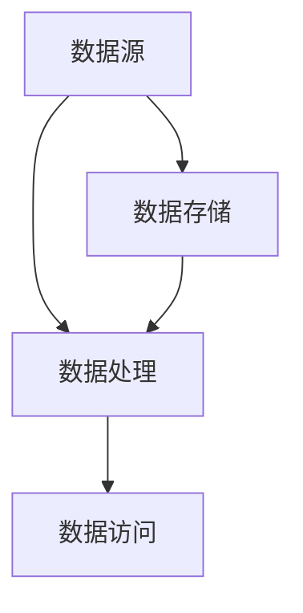

                 

关键词：网易校招、数据湖、架构师面试、技术面试题、大数据处理、数据存储、数据处理流程、架构设计、面试准备、面试技巧

摘要：本文旨在为准备参加网易2024校招数据湖架构师面试的候选人提供一个全面的面试题集锦。文章将从数据湖的基本概念、核心技术、架构设计、数据处理流程、性能优化等多个方面，提供一系列深入的问题和答案，帮助读者更好地准备面试，提升面试成功率。

## 1. 背景介绍

数据湖作为一种新兴的数据处理架构，近年来在企业和组织中得到了广泛应用。它是一种大规模数据存储和处理平台，能够处理各种类型的数据，包括结构化、半结构化和非结构化数据。数据湖架构师在面试中通常需要展示对数据湖架构的深入理解，以及解决实际问题的能力。

### 1.1 数据湖的定义

数据湖是一个分布式数据存储平台，它能够存储海量不同类型的数据，并支持数据的高效存储、处理和分析。与传统的数据仓库相比，数据湖不需要对数据进行预处理，可以直接存储原始数据，以原始格式进行存储和查询。

### 1.2 数据湖的优势

- **灵活性**：数据湖能够存储各种类型的数据，包括结构化、半结构化和非结构化数据，为用户提供更加灵活的数据存储方案。
- **高性能**：数据湖通常基于分布式存储和计算框架，如Hadoop、Spark等，能够提供高性能的数据处理能力。
- **易扩展性**：数据湖具有很好的扩展性，可以轻松支持大规模数据存储和处理需求。

### 1.3 数据湖的架构

数据湖的架构通常包括以下几个主要组件：

- **数据源**：包括各种结构化和非结构化的数据源，如数据库、文件系统、消息队列等。
- **数据存储**：通常使用分布式文件系统，如HDFS、Alluxio等，进行海量数据的存储。
- **数据处理**：利用分布式计算框架，如Spark、Flink等，对数据进行处理和分析。
- **数据访问**：提供多种数据访问接口，如REST API、SQL查询等，方便用户进行数据访问。

## 2. 核心概念与联系

为了更好地理解数据湖的架构和核心概念，我们可以通过以下Mermaid流程图展示数据湖的基本架构和主要组件之间的联系。



### 2.1 数据源

数据源是数据湖的输入端，它可以是结构化数据源（如关系型数据库），也可以是非结构化数据源（如日志文件、社交媒体数据等）。数据源通过ETL（Extract, Transform, Load）过程将数据加载到数据存储中。

### 2.2 数据存储

数据存储是数据湖的核心组件，负责存储和管理海量数据。数据存储通常采用分布式文件系统，如HDFS（Hadoop Distributed File System），它能够提供高可靠性和高性能的数据存储能力。

### 2.3 数据处理

数据处理组件负责对数据进行加工和处理，以支持数据分析和业务应用。数据处理通常使用分布式计算框架，如Spark、Flink等。这些框架能够处理大规模数据，并提供高效的数据处理能力。

### 2.4 数据访问

数据访问组件提供多种数据访问接口，如REST API、SQL查询等。用户可以通过这些接口对数据进行查询、分析和可视化。

## 3. 核心算法原理 & 具体操作步骤

### 3.1 算法原理概述

数据湖架构中的核心算法主要包括数据采集、数据清洗、数据转换和数据加载等过程。这些算法共同构成了数据湖数据处理的核心。

- **数据采集**：从各种数据源中获取数据，并将其传输到数据存储中。
- **数据清洗**：对采集到的数据进行去重、修复、填充等操作，以确保数据的准确性和完整性。
- **数据转换**：将清洗后的数据进行转换，以满足不同业务场景的需求。
- **数据加载**：将转换后的数据加载到数据仓库或数据报表系统中，以供进一步分析和应用。

### 3.2 算法步骤详解

以下是数据湖架构中的核心算法步骤：

1. **数据采集**：

   - 从各种数据源（如关系型数据库、日志文件、社交媒体等）中读取数据。
   - 使用ETL工具（如Apache NiFi、Apache Airflow等）将数据传输到数据存储中。

2. **数据清洗**：

   - 对数据进行去重，去除重复记录。
   - 对缺失数据进行填充，确保数据完整性。
   - 对数据进行格式转换，使其符合数据存储的要求。

3. **数据转换**：

   - 根据不同的业务场景，对数据进行清洗、汇总、分类等操作。
   - 使用数据处理框架（如Spark、Flink等）对数据进行批处理或流处理。

4. **数据加载**：

   - 将处理后的数据加载到数据仓库或数据报表系统中。
   - 使用SQL查询或其他数据访问接口，对数据进行查询和分析。

### 3.3 算法优缺点

- **优点**：

  - **灵活性**：数据湖能够存储各种类型的数据，包括结构化、半结构化和非结构化数据，满足不同业务场景的需求。
  - **高性能**：数据湖通常基于分布式存储和计算框架，能够提供高性能的数据处理能力。
  - **易扩展性**：数据湖具有很好的扩展性，可以轻松支持大规模数据存储和处理需求。

- **缺点**：

  - **复杂性**：数据湖架构较为复杂，需要较高的技术水平和经验来设计和维护。
  - **数据质量**：由于数据湖存储的是原始数据，需要用户自行处理数据质量问题。

### 3.4 算法应用领域

数据湖算法广泛应用于企业、金融、医疗、电商等多个领域，以下是一些典型应用场景：

- **企业数据分析**：利用数据湖存储和管理企业内部各种类型的数据，支持企业级数据分析和应用。
- **金融风控**：通过数据湖存储和处理金融交易数据、客户信息等，支持金融风控模型的构建和应用。
- **医疗数据管理**：利用数据湖存储和管理医疗数据，支持医疗数据分析和研究。
- **电商数据分析**：通过数据湖存储和处理电商交易数据，支持电商数据分析、用户画像等应用。

## 4. 数学模型和公式 & 详细讲解 & 举例说明

在数据湖架构中，数学模型和公式广泛应用于数据清洗、数据转换和数据分析等环节。以下是一些常见的数学模型和公式及其应用场景。

### 4.1 数学模型构建

在数据湖中，常见的数学模型包括统计模型、机器学习模型和优化模型等。以下是一个简单的统计模型示例：

$$
\text{概率分布} P(X) = \frac{1}{Z} \sum_{i=1}^{n} x_i \cdot e^{-\lambda \cdot x_i}
$$

其中，$X$表示随机变量，$Z$表示归一化常数，$x_i$表示随机变量的取值，$\lambda$表示参数。

### 4.2 公式推导过程

以下是一个简单的线性回归模型的推导过程：

$$
y = \beta_0 + \beta_1 \cdot x + \epsilon
$$

其中，$y$表示因变量，$x$表示自变量，$\beta_0$和$\beta_1$分别表示截距和斜率，$\epsilon$表示误差项。

### 4.3 案例分析与讲解

假设我们有一个电商平台的用户购买行为数据，包括用户ID、购买时间、商品ID和购买金额等字段。现在我们需要根据这些数据构建一个用户行为分析模型，预测用户的购买概率。

1. **数据预处理**：

   - 对数据进行清洗，去除缺失值和异常值。
   - 对数值型字段进行归一化处理。

2. **特征工程**：

   - 构建时间特征，如小时、星期、月份等。
   - 构建用户行为特征，如用户购买次数、购买金额等。

3. **模型构建**：

   - 使用逻辑回归模型预测用户购买概率。
   - 使用交叉验证方法选择最优参数。

4. **模型评估**：

   - 使用AUC（Area Under the Curve）评估模型效果。
   - 使用混淆矩阵分析模型预测结果。

## 5. 项目实践：代码实例和详细解释说明

为了更好地展示数据湖架构在项目实践中的应用，我们以下使用一个简单的案例，介绍数据湖架构中的数据处理流程和代码实现。

### 5.1 开发环境搭建

- **环境要求**：需要安装Hadoop、Spark等分布式计算框架，以及数据采集、处理和加载的相关工具。
- **硬件配置**：建议使用多台服务器组成分布式集群，以提高数据处理能力。

### 5.2 源代码详细实现

以下是数据湖项目中一个简单的数据采集、清洗和加载的代码示例：

```python
# 导入相关库
import findspark
findspark.init()
import pyspark.sql as sql
import pyspark.sql.functions as fns

# 数据采集
def data_collection():
    # 从关系型数据库中读取数据
    db_url = "jdbc:mysql://localhost:3306/ecommerce"
    db_user = "root"
    db_password = "password"
    db_table = "user_purchase"
    df = sql.read.format("jdbc").option("url", db_url).option("dbtable", db_table).option("user", db_user).option("password", db_password).load()
    return df

# 数据清洗
def data_cleaning(df):
    # 去除缺失值和异常值
    df = df.dropna()
    df = df.filter((df["purchase_amount"] > 0) & (df["purchase_amount"] < 10000))
    return df

# 数据转换
def data_transformation(df):
    # 构建时间特征
    df = df.withColumn("hour", fns.hour("purchase_time"))
    df = df.withColumn("weekday", fns.weekday("purchase_time"))
    df = df.withColumn("month", fns.month("purchase_time"))
    return df

# 数据加载
def data_loading(df):
    # 将数据加载到数据仓库
    df.write.format("parquet").mode("overwrite").save("/user/root/ecommerce_data")

# 主函数
def main():
    # 数据采集
    df = data_collection()
    # 数据清洗
    df = data_cleaning(df)
    # 数据转换
    df = data_transformation(df)
    # 数据加载
    data_loading(df)

if __name__ == "__main__":
    main()
```

### 5.3 代码解读与分析

上述代码展示了数据湖项目中的一个基本数据处理流程，包括数据采集、清洗、转换和加载等步骤。

- **数据采集**：从关系型数据库中读取用户购买数据，使用JDBC（Java Database Connectivity）进行数据连接和读取。
- **数据清洗**：去除缺失值和异常值，确保数据质量。
- **数据转换**：构建时间特征，如小时、星期、月份等，以支持后续的数据分析。
- **数据加载**：将处理后的数据加载到数据仓库中，使用Parquet格式存储，以提高数据读取性能。

## 6. 实际应用场景

数据湖架构在各个行业领域有着广泛的应用，以下是一些典型的实际应用场景：

### 6.1 电商行业

- **用户行为分析**：通过数据湖存储和分析用户购买数据，构建用户画像和推荐系统。
- **供应链管理**：利用数据湖存储和处理供应链数据，优化供应链管理流程。

### 6.2 银行业

- **客户行为分析**：通过数据湖存储和分析客户交易数据，预测客户行为和风险。
- **金融风控**：利用数据湖存储和处理金融交易数据，构建金融风控模型。

### 6.3 医疗行业

- **医疗数据管理**：通过数据湖存储和管理医疗数据，支持医疗数据分析和研究。
- **健康数据分析**：利用数据湖存储和分析健康数据，提供个性化健康建议。

### 6.4 互联网行业

- **日志数据管理**：通过数据湖存储和分析日志数据，优化系统性能和用户体验。
- **大数据分析**：利用数据湖存储和分析互联网数据，支持业务决策和产品优化。

## 7. 工具和资源推荐

为了更好地准备网易2024校招数据湖架构师面试，以下推荐一些学习资源和开发工具：

### 7.1 学习资源推荐

- **《大数据技术原理与应用》**：一本全面介绍大数据技术原理和应用的书，适合入门读者。
- **《数据湖技术实践》**：一本详细介绍数据湖架构和技术的书籍，适合有一定大数据基础的学习者。
- **大数据技术社区**：如CSDN、博客园等，可以获取大量的大数据技术文章和分享。

### 7.2 开发工具推荐

- **Hadoop**：一个开源的分布式计算框架，用于大数据存储和处理。
- **Spark**：一个开源的分布式计算引擎，提供高效的数据处理能力。
- **Docker**：一个开源的容器化技术，用于构建和运行分布式应用。

### 7.3 相关论文推荐

- **"Data Lakes: A Game-Changing Approach to Enterprise Data Management"**：一篇关于数据湖技术的重要论文，详细介绍了数据湖的定义、架构和应用。
- **"Hadoop: The Definitive Guide"**：一篇关于Hadoop技术的重要论文，介绍了Hadoop的架构、原理和应用。

## 8. 总结：未来发展趋势与挑战

随着大数据技术的不断发展，数据湖架构在企业和组织中得到了广泛应用。未来，数据湖架构将继续发展，并在以下几个方面面临挑战：

### 8.1 研究成果总结

- **数据湖架构的优化**：研究和优化数据湖架构，提高数据处理性能和可扩展性。
- **数据质量提升**：研究数据质量管理技术，提高数据湖中数据的质量和准确性。
- **自动化与智能化**：研究自动化和智能化技术，降低数据湖架构的维护成本和复杂性。

### 8.2 未来发展趋势

- **数据湖与数据仓库的结合**：研究和实现数据湖与数据仓库的融合，提高数据处理和分析能力。
- **数据湖平台的生态建设**：建设完善的数据湖平台生态，包括工具、组件、文档等。
- **数据湖在边缘计算中的应用**：研究数据湖在边缘计算场景中的应用，提高数据处理效率。

### 8.3 面临的挑战

- **数据隐私和安全**：确保数据湖中的数据安全和隐私，避免数据泄露和滥用。
- **数据治理与合规**：制定和完善数据治理策略，确保数据湖中的数据符合相关法律法规和标准。
- **跨行业和跨领域的应用**：研究和实现数据湖在跨行业和跨领域的应用，提高数据湖的适用性和灵活性。

### 8.4 研究展望

- **数据湖技术的创新**：探索新的数据湖技术和架构，提高数据处理能力和性能。
- **数据湖与人工智能的结合**：研究数据湖与人工智能技术的结合，实现数据驱动的智能决策。
- **数据湖生态的完善**：建设和完善数据湖生态，包括工具、组件、文档、培训等，提高数据湖的应用效果。

## 9. 附录：常见问题与解答

### 9.1 数据湖与传统数据仓库的区别是什么？

数据湖与传统数据仓库的主要区别在于数据存储和处理方式。数据湖以原始数据形式存储，不需要进行数据预处理，而传统数据仓库则需要将数据进行清洗、转换后才能进行存储和处理。

### 9.2 数据湖的优势有哪些？

数据湖的优势包括：

- **灵活性**：可以存储各种类型的数据，包括结构化、半结构化和非结构化数据。
- **高性能**：基于分布式存储和计算框架，提供高性能的数据处理能力。
- **易扩展性**：可以轻松支持大规模数据存储和处理需求。

### 9.3 数据湖的缺点有哪些？

数据湖的缺点包括：

- **复杂性**：数据湖架构较为复杂，需要较高的技术水平和经验来设计和维护。
- **数据质量**：由于数据湖存储的是原始数据，需要用户自行处理数据质量问题。

### 9.4 数据湖适合哪些应用场景？

数据湖适合以下应用场景：

- **企业级数据分析**：支持企业内部各种类型的数据分析和应用。
- **金融风控**：处理金融交易数据、客户信息等，支持金融风控模型的构建和应用。
- **医疗数据管理**：支持医疗数据分析和研究。
- **电商数据分析**：支持电商数据分析、用户画像等应用。

----------------------------------------------------------------

文章撰写完毕，请检查是否符合要求。如果您有任何修改意见，请随时提出。期待您的宝贵意见！作者：禅与计算机程序设计艺术 / Zen and the Art of Computer Programming。

