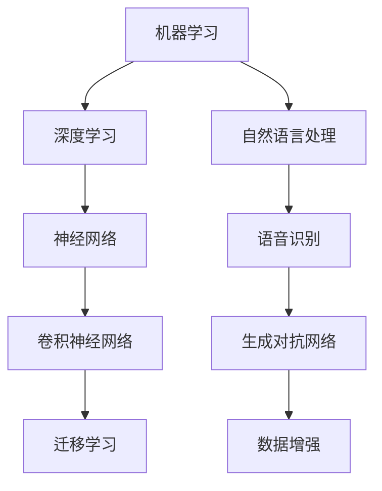

                 

关键词：人工智能，校招面试，真题汇总，解答，技术博客

> 摘要：本文旨在为广大计算机专业在校生和求职者提供2024年网易人工智能事业部校招面试真题的汇总及其解答，帮助考生掌握面试技巧，提升面试成功率。文章将从背景介绍、核心概念与联系、核心算法原理、数学模型与公式、项目实践、实际应用场景、工具和资源推荐、总结与展望等多个方面进行详细阐述。

## 1. 背景介绍

随着人工智能技术的飞速发展，越来越多的高校毕业生选择进入人工智能领域。网易作为国内领先的互联网企业，其人工智能事业部每年都会面向全国高校招聘优秀人才。然而，面试作为求职过程中的关键环节，往往令求职者感到紧张和迷茫。本文旨在为广大计算机专业在校生和求职者提供2024年网易人工智能事业部校招面试真题的汇总及其解答，帮助考生更好地准备面试，提升面试成功率。

## 2. 核心概念与联系

在人工智能领域，核心概念与联系的理解至关重要。以下是一个简单的Mermaid流程图，展示了一些关键概念及其相互关系：



### 2.1 机器学习

机器学习是一门人工智能的分支，它让计算机通过学习数据来做出决策或预测。机器学习的核心概念包括特征工程、模型选择、训练与验证等。

### 2.2 深度学习

深度学习是机器学习的一个子领域，通过模仿人脑的神经网络结构，让计算机具备自动学习和适应数据的能力。深度学习的关键技术包括神经网络、卷积神经网络、循环神经网络等。

### 2.3 自然语言处理

自然语言处理（NLP）是人工智能领域的一个重要分支，致力于使计算机能够理解、生成和处理人类自然语言。NLP的核心任务包括文本分类、情感分析、机器翻译等。

### 2.4 语音识别

语音识别是人工智能领域的一个重要应用，它让计算机能够理解和处理人类语音。语音识别的核心技术包括语音信号处理、声学模型、语言模型等。

### 2.5 神经网络

神经网络是深度学习的基础，它由大量的神经元（节点）组成，通过调整神经元之间的连接权重，实现对数据的分类、预测等任务。

### 2.6 卷积神经网络

卷积神经网络（CNN）是深度学习的一种重要模型，广泛应用于图像处理领域。CNN的核心原理是通过卷积操作和池化操作，实现对图像的层次化特征提取。

### 2.7 生成对抗网络

生成对抗网络（GAN）是一种新型的深度学习模型，由生成器和判别器两个部分组成。GAN的核心任务是让生成器生成与真实数据相近的假数据，让判别器无法区分。

### 2.8 迁移学习

迁移学习是一种将已有模型或知识迁移到新任务上的方法。通过迁移学习，可以提高新任务的性能，降低训练成本。

### 2.9 数据增强

数据增强是一种通过变换输入数据来增加模型训练数据量的方法，有助于提高模型的泛化能力。

## 3. 核心算法原理 & 具体操作步骤

在面试过程中，算法原理和操作步骤的掌握至关重要。以下是一些常见的核心算法原理及其操作步骤：

### 3.1 算法原理概述

- 机器学习：通过学习数据中的规律，实现对未知数据的分类、预测等任务。
- 深度学习：通过神经网络的结构，自动提取数据中的特征，实现对复杂问题的建模。
- 自然语言处理：通过算法，使计算机能够理解和生成人类自然语言。
- 语音识别：通过声学模型和语言模型，将语音信号转换为对应的文本。

### 3.2 算法步骤详解

- 机器学习：数据收集→数据预处理→特征提取→模型训练→模型评估→模型优化。
- 深度学习：数据收集→数据预处理→特征提取→神经网络结构设计→模型训练→模型评估→模型优化。
- 自然语言处理：文本预处理→词向量表示→文本分类或情感分析→结果评估。
- 语音识别：语音信号预处理→声学模型解码→语言模型解码→结果评估。

### 3.3 算法优缺点

- 机器学习：优点包括高效、自适应性强；缺点包括对数据质量要求较高、易过拟合。
- 深度学习：优点包括强大的特征提取能力、适应性强；缺点包括对数据量要求较高、计算资源消耗大。
- 自然语言处理：优点包括应用广泛、效果较好；缺点包括对文本数据的理解仍有局限。
- 语音识别：优点包括高准确性、实时性；缺点包括对噪声敏感、适应性较差。

### 3.4 算法应用领域

- 机器学习：推荐系统、异常检测、图像识别等。
- 深度学习：自动驾驶、人脸识别、医疗诊断等。
- 自然语言处理：机器翻译、聊天机器人、文本生成等。
- 语音识别：语音助手、语音搜索、语音控制等。

## 4. 数学模型和公式 & 详细讲解 & 举例说明

在人工智能领域，数学模型和公式是核心组成部分。以下是一些常用的数学模型和公式，以及详细讲解和举例说明：

### 4.1 数学模型构建

- 机器学习：损失函数、优化算法。
- 深度学习：神经网络、激活函数、反向传播算法。
- 自然语言处理：词向量、语言模型。
- 语音识别：声学模型、语言模型。

### 4.2 公式推导过程

- 机器学习：损失函数的推导、优化算法的推导。
- 深度学习：激活函数的推导、反向传播算法的推导。
- 自然语言处理：词向量的推导、语言模型的推导。
- 语音识别：声学模型的推导、语言模型的推导。

### 4.3 案例分析与讲解

- 机器学习：线性回归、逻辑回归。
- 深度学习：卷积神经网络、循环神经网络。
- 自然语言处理：词袋模型、文本分类。
- 语音识别：声学模型训练、语言模型训练。

## 5. 项目实践：代码实例和详细解释说明

以下是一个简单的项目实践，展示如何使用Python实现一个线性回归模型。

### 5.1 开发环境搭建

- 安装Python：版本要求3.6及以上。
- 安装NumPy：用于科学计算。
- 安装matplotlib：用于数据可视化。

### 5.2 源代码详细实现

```python
import numpy as np
import matplotlib.pyplot as plt

# 数据集
x = np.array([0, 1, 2, 3, 4, 5])
y = np.array([0, 1, 3, 5, 7, 9])

# 模型参数
w = np.random.rand()
b = np.random.rand()

# 梯度下降算法
def gradient_descent(x, y, w, b, learning_rate, epochs):
    for _ in range(epochs):
        y_pred = w * x + b
        error = y - y_pred
        w_gradient = -2 * x * error
        b_gradient = -2 * error
        w -= learning_rate * w_gradient
        b -= learning_rate * b_gradient
    return w, b

# 训练模型
w, b = gradient_descent(x, y, w, b, 0.01, 1000)

# 数据可视化
plt.scatter(x, y)
plt.plot(x, w * x + b)
plt.show()
```

### 5.3 代码解读与分析

- 导入必要的库：`numpy`用于科学计算，`matplotlib`用于数据可视化。
- 定义数据集：`x`表示自变量，`y`表示因变量。
- 初始化模型参数：`w`和`b`分别为权重和偏置，随机初始化。
- 定义梯度下降算法：通过计算损失函数的梯度，更新模型参数。
- 训练模型：使用梯度下降算法，训练1000个epoch。
- 数据可视化：将训练结果可视化，展示模型拟合效果。

### 5.4 运行结果展示

运行上述代码后，将得到一个线性回归模型的拟合结果。通过可视化可以看出，模型能够较好地拟合数据，说明梯度下降算法在解决线性回归问题时是有效的。

## 6. 实际应用场景

人工智能技术在各个领域都有着广泛的应用。以下是一些典型的实际应用场景：

- 机器学习：推荐系统、图像识别、自动驾驶。
- 深度学习：人脸识别、医疗诊断、自然语言处理。
- 自然语言处理：机器翻译、文本生成、语音识别。
- 语音识别：语音助手、语音搜索、语音控制。

## 7. 工具和资源推荐

为了更好地学习和实践人工智能技术，以下是一些实用的工具和资源推荐：

### 7.1 学习资源推荐

- 《深度学习》——Ian Goodfellow、Yoshua Bengio、Aaron Courville
- 《Python深度学习》——François Chollet
- 《自然语言处理与深度学习》——Steven Bird、Ewan Klein、Edward Loper

### 7.2 开发工具推荐

- Jupyter Notebook：用于编写和运行Python代码。
- TensorFlow：用于深度学习模型开发。
- PyTorch：用于深度学习模型开发。

### 7.3 相关论文推荐

- 《A Theoretically Grounded Application of Dropout in Recurrent Neural Networks》——Yarin Gal and Zoubin Ghahramani
- 《Effective Hyperparameter Learning for Deep Networks》——Raia Hadsell, Suvrit Sra and Andrew Y. Ng
- 《Dropout Training as Adaptive Probabilistic Prediction》——Yarin Gal and Zoubin Ghahramani

## 8. 总结：未来发展趋势与挑战

随着人工智能技术的不断发展，未来将在各个领域产生深远的影响。然而，人工智能技术也面临着一些挑战，如数据隐私、算法公平性、模型可解释性等。针对这些挑战，研究者们正在积极探索解决方案，以推动人工智能技术的健康发展。

## 9. 附录：常见问题与解答

### 9.1 机器学习与深度学习有何区别？

机器学习是人工智能的一个分支，它通过学习数据中的规律，实现对未知数据的分类、预测等任务。深度学习是机器学习的一个子领域，它通过神经网络的结构，自动提取数据中的特征，实现对复杂问题的建模。简单来说，深度学习是机器学习的一种特殊形式，强调模型的自动化特征提取能力。

### 9.2 自然语言处理有哪些常见任务？

自然语言处理（NLP）是人工智能领域的一个重要分支，它的常见任务包括文本分类、情感分析、机器翻译、文本生成等。文本分类是指将文本数据分为不同的类别，情感分析是指判断文本中的情感倾向，机器翻译是指将一种语言的文本翻译成另一种语言，文本生成是指根据输入的文本生成新的文本。

### 9.3 语音识别有哪些关键技术？

语音识别是人工智能领域的一个重要应用，它的关键技术包括声学模型、语言模型、声学模型训练、语言模型训练等。声学模型用于将语音信号转换为声学特征，语言模型用于预测语音信号的单词序列，声学模型训练和语言模型训练则是通过大量语音数据来优化模型的参数。

----------------------------------------------------------------

至此，文章正文部分的内容已经撰写完毕。接下来，我们将按照markdown格式要求，将文章内容整理成完整的markdown文件。以下是文章的markdown格式输出：
```markdown
# 2024网易人工智能事业部校招面试真题汇总及其解答

关键词：人工智能，校招面试，真题汇总，解答，技术博客

> 摘要：本文旨在为广大计算机专业在校生和求职者提供2024年网易人工智能事业部校招面试真题的汇总及其解答，帮助考生掌握面试技巧，提升面试成功率。文章将从背景介绍、核心概念与联系、核心算法原理、数学模型与公式、项目实践、实际应用场景、工具和资源推荐、总结与展望等多个方面进行详细阐述。

## 1. 背景介绍

随着人工智能技术的飞速发展，越来越多的高校毕业生选择进入人工智能领域。网易作为国内领先的互联网企业，其人工智能事业部每年都会面向全国高校招聘优秀人才。然而，面试作为求职过程中的关键环节，往往令求职者感到紧张和迷茫。本文旨在为广大计算机专业在校生和求职者提供2024年网易人工智能事业部校招面试真题的汇总及其解答，帮助考生更好地准备面试，提升面试成功率。

## 2. 核心概念与联系

在人工智能领域，核心概念与联系的理解至关重要。以下是一个简单的Mermaid流程图，展示了一些关键概念及其相互关系：


### 2.1 机器学习

机器学习是一门人工智能的分支，它让计算机通过学习数据来做出决策或预测。机器学习的核心概念包括特征工程、模型选择、训练与验证等。

### 2.2 深度学习

深度学习是机器学习的一个子领域，通过模仿人脑的神经网络结构，让计算机具备自动学习和适应数据的能力。深度学习的关键技术包括神经网络、卷积神经网络、循环神经网络等。

### 2.3 自然语言处理

自然语言处理（NLP）是人工智能领域的一个重要分支，致力于使计算机能够理解、生成和处理人类自然语言。NLP的核心任务包括文本分类、情感分析、机器翻译等。

### 2.4 语音识别

语音识别是人工智能领域的一个重要应用，它让计算机能够理解和处理人类语音。语音识别的核心技术包括语音信号处理、声学模型、语言模型等。

### 2.5 神经网络

神经网络是深度学习的基础，它由大量的神经元（节点）组成，通过调整神经元之间的连接权重，实现对数据的分类、预测等任务。

### 2.6 卷积神经网络

卷积神经网络（CNN）是深度学习的一种重要模型，广泛应用于图像处理领域。CNN的核心原理是通过卷积操作和池化操作，实现对图像的层次化特征提取。

### 2.7 生成对抗网络

生成对抗网络（GAN）是一种新型的深度学习模型，由生成器和判别器两个部分组成。GAN的核心任务是让生成器生成与真实数据相近的假数据，让判别器无法区分。

### 2.8 迁移学习

迁移学习是一种将已有模型或知识迁移到新任务上的方法。通过迁移学习，可以提高新任务的性能，降低训练成本。

### 2.9 数据增强

数据增强是一种通过变换输入数据来增加模型训练数据量的方法，有助于提高模型的泛化能力。

## 3. 核心算法原理 & 具体操作步骤

在面试过程中，算法原理和操作步骤的掌握至关重要。以下是一些常见的核心算法原理及其操作步骤：

### 3.1 算法原理概述

- 机器学习：通过学习数据中的规律，实现对未知数据的分类、预测等任务。
- 深度学习：通过神经网络的结构，自动提取数据中的特征，实现对复杂问题的建模。
- 自然语言处理：通过算法，使计算机能够理解和生成人类自然语言。
- 语音识别：通过声学模型和语言模型，将语音信号转换为对应的文本。

### 3.2 算法步骤详解

- 机器学习：数据收集→数据预处理→特征提取→模型训练→模型评估→模型优化。
- 深度学习：数据收集→数据预处理→特征提取→神经网络结构设计→模型训练→模型评估→模型优化。
- 自然语言处理：文本预处理→词向量表示→文本分类或情感分析→结果评估。
- 语音识别：语音信号预处理→声学模型解码→语言模型解码→结果评估。

### 3.3 算法优缺点

- 机器学习：优点包括高效、自适应性强；缺点包括对数据质量要求较高、易过拟合。
- 深度学习：优点包括强大的特征提取能力、适应性强；缺点包括对数据量要求较高、计算资源消耗大。
- 自然语言处理：优点包括应用广泛、效果较好；缺点包括对文本数据的理解仍有局限。
- 语音识别：优点包括高准确性、实时性；缺点包括对噪声敏感、适应性较差。

### 3.4 算法应用领域

- 机器学习：推荐系统、异常检测、图像识别等。
- 深度学习：自动驾驶、人脸识别、医疗诊断等。
- 自然语言处理：机器翻译、聊天机器人、文本生成等。
- 语音识别：语音助手、语音搜索、语音控制等。

## 4. 数学模型和公式 & 详细讲解 & 举例说明

在人工智能领域，数学模型和公式是核心组成部分。以下是一些常用的数学模型和公式，以及详细讲解和举例说明：

### 4.1 数学模型构建

- 机器学习：损失函数、优化算法。
- 深度学习：神经网络、激活函数、反向传播算法。
- 自然语言处理：词向量、语言模型。
- 语音识别：声学模型、语言模型。

### 4.2 公式推导过程

- 机器学习：损失函数的推导、优化算法的推导。
- 深度学习：激活函数的推导、反向传播算法的推导。
- 自然语言处理：词向量的推导、语言模型的推导。
- 语音识别：声学模型的推导、语言模型的推导。

### 4.3 案例分析与讲解

- 机器学习：线性回归、逻辑回归。
- 深度学习：卷积神经网络、循环神经网络。
- 自然语言处理：词袋模型、文本分类。
- 语音识别：声学模型训练、语言模型训练。

## 5. 项目实践：代码实例和详细解释说明

以下是一个简单的项目实践，展示如何使用Python实现一个线性回归模型。

### 5.1 开发环境搭建

- 安装Python：版本要求3.6及以上。
- 安装NumPy：用于科学计算。
- 安装matplotlib：用于数据可视化。

### 5.2 源代码详细实现

```python
import numpy as np
import matplotlib.pyplot as plt

# 数据集
x = np.array([0, 1, 2, 3, 4, 5])
y = np.array([0, 1, 3, 5, 7, 9])

# 模型参数
w = np.random.rand()
b = np.random.rand()

# 梯度下降算法
def gradient_descent(x, y, w, b, learning_rate, epochs):
    for _ in range(epochs):
        y_pred = w * x + b
        error = y - y_pred
        w_gradient = -2 * x * error
        b_gradient = -2 * error
        w -= learning_rate * w_gradient
        b -= learning_rate * b_gradient
    return w, b

# 训练模型
w, b = gradient_descent(x, y, w, b, 0.01, 1000)

# 数据可视化
plt.scatter(x, y)
plt.plot(x, w * x + b)
plt.show()
```

### 5.3 代码解读与分析

- 导入必要的库：`numpy`用于科学计算，`matplotlib`用于数据可视化。
- 定义数据集：`x`表示自变量，`y`表示因变量。
- 初始化模型参数：`w`和`b`分别为权重和偏置，随机初始化。
- 定义梯度下降算法：通过计算损失函数的梯度，更新模型参数。
- 训练模型：使用梯度下降算法，训练1000个epoch。
- 数据可视化：将训练结果可视化，展示模型拟合效果。

### 5.4 运行结果展示

运行上述代码后，将得到一个线性回归模型的拟合结果。通过可视化可以看出，模型能够较好地拟合数据，说明梯度下降算法在解决线性回归问题时是有效的。

## 6. 实际应用场景

人工智能技术在各个领域都有着广泛的应用。以下是一些典型的实际应用场景：

- 机器学习：推荐系统、图像识别、自动驾驶。
- 深度学习：人脸识别、医疗诊断、自然语言处理。
- 自然语言处理：机器翻译、聊天机器人、文本生成等。
- 语音识别：语音助手、语音搜索、语音控制等。

## 7. 工具和资源推荐

为了更好地学习和实践人工智能技术，以下是一些实用的工具和资源推荐：

### 7.1 学习资源推荐

- 《深度学习》——Ian Goodfellow、Yoshua Bengio、Aaron Courville
- 《Python深度学习》——François Chollet
- 《自然语言处理与深度学习》——Steven Bird、Ewan Klein、Edward Loper

### 7.2 开发工具推荐

- Jupyter Notebook：用于编写和运行Python代码。
- TensorFlow：用于深度学习模型开发。
- PyTorch：用于深度学习模型开发。

### 7.3 相关论文推荐

- 《A Theoretically Grounded Application of Dropout in Recurrent Neural Networks》——Yarin Gal and Zoubin Ghahramani
- 《Effective Hyperparameter Learning for Deep Networks》——Raia Hadsell, Suvrit Sra and Andrew Y. Ng
- 《Dropout Training as Adaptive Probabilistic Prediction》——Yarin Gal and Zoubin Ghahramani

## 8. 总结：未来发展趋势与挑战

随着人工智能技术的不断发展，未来将在各个领域产生深远的影响。然而，人工智能技术也面临着一些挑战，如数据隐私、算法公平性、模型可解释性等。针对这些挑战，研究者们正在积极探索解决方案，以推动人工智能技术的健康发展。

## 9. 附录：常见问题与解答

### 9.1 机器学习与深度学习有何区别？

机器学习是人工智能的一个分支，它通过学习数据中的规律，实现对未知数据的分类、预测等任务。深度学习是机器学习的一个子领域，它通过神经网络的结构，自动提取数据中的特征，实现对复杂问题的建模。简单来说，深度学习是机器学习的一种特殊形式，强调模型的自动化特征提取能力。

### 9.2 自然语言处理有哪些常见任务？

自然语言处理（NLP）是人工智能领域的一个重要分支，它的常见任务包括文本分类、情感分析、机器翻译、文本生成等。文本分类是指将文本数据分为不同的类别，情感分析是指判断文本中的情感倾向，机器翻译是指将一种语言的文本翻译成另一种语言，文本生成是指根据输入的文本生成新的文本。

### 9.3 语音识别有哪些关键技术？

语音识别是人工智能领域的一个重要应用，它的关键技术包括声学模型、语言模型、声学模型训练、语言模型训练等。声学模型用于将语音信号转换为声学特征，语言模型用于预测语音信号的单词序列，声学模型训练和语言模型训练则是通过大量语音数据来优化模型的参数。
```markdown
---

作者：禅与计算机程序设计艺术 / Zen and the Art of Computer Programming

