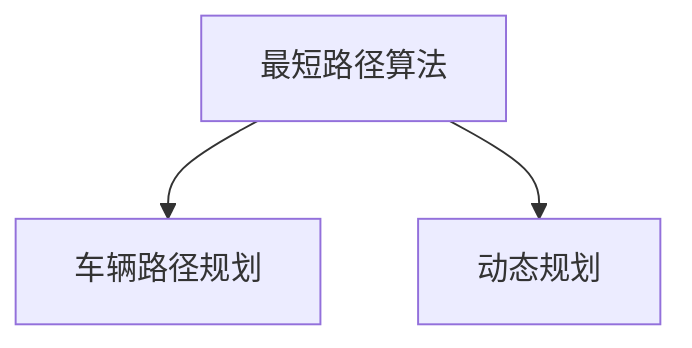

                 

关键词：美团，社招，配送算法，面试题，解析，技术博客

摘要：本文将对美团2025社招配送算法工程师的面试题进行解析，深入探讨配送算法的核心概念、原理、数学模型、项目实践及实际应用场景，旨在为读者提供一份全面的技术指南。

## 1. 背景介绍

随着互联网技术的发展，外卖配送成为现代生活不可或缺的一部分。美团作为中国最大的在线外卖平台，其配送算法的优化直接关系到用户体验和公司盈利。2025年，美团社招配送算法工程师，面向具备算法背景的开发者，要求具备对配送算法的深刻理解和实际应用能力。本文将围绕美团配送算法的面试题目，进行详细的解析，帮助读者备战面试。

## 2. 核心概念与联系

### 2.1 配送算法概述

配送算法是优化配送路径、提高配送效率的关键技术。其主要目标是在满足配送时间和成本约束的条件下，为配送员规划出最优的配送路线。

### 2.2 算法核心概念

- **最短路径算法**：如迪杰斯特拉算法（Dijkstra）、贝尔曼-福特算法（Bellman-Ford）等。
- **车辆路径规划**：如旅行商问题（TSP）、车辆路径问题（VRP）等。
- **动态规划**：用于解决路径规划中的优化问题。

### 2.3 算法架构 Mermaid 流程图



## 3. 核心算法原理 & 具体操作步骤

### 3.1 算法原理概述

#### 3.1.1 最短路径算法

迪杰斯特拉算法（Dijkstra）是一种基于贪心策略的单源最短路径算法。其基本思想是逐步扩展已知的最短路径，直到找到目标节点。

#### 3.1.2 车辆路径规划

旅行商问题（TSP）是寻找经过每一点一次且仅一次的路径，使得路径总长度最短的问题。

#### 3.1.3 动态规划

动态规划是一种将复杂问题分解为子问题并求解的方法。在配送算法中，动态规划用于求解路径优化问题。

### 3.2 算法步骤详解

#### 3.2.1 最短路径算法步骤

1. 初始化：设置源点到其他所有点的距离为无穷大，源点到自身的距离为0。
2. 选择未访问过的节点，计算其到其他节点的距离，更新距离表。
3. 标记已访问节点。
4. 重复步骤2和3，直到找到目标节点。

#### 3.2.2 车辆路径规划步骤

1. 初始化：设置所有点的访问状态为未访问。
2. 选择一个起点，开始遍历所有未访问的点。
3. 对于当前访问的点，计算其到其他未访问点的距离，选择距离最小的点作为下一个访问点。
4. 更新访问状态，重复步骤3，直到遍历完所有点。

#### 3.2.3 动态规划步骤

1. 确定状态：定义状态变量，如 dp[i][j] 表示从起点到第i个城市，且最后访问的城市是第j个城市的最优解。
2. 状态转移方程：根据状态变量，建立状态转移方程，如 dp[i][j] = min(dp[i - 1][k] + cost[i][j])，其中k为j的前驱城市。
3. 初始化：设置初始状态，如 dp[0][0] = 0，其他dp值初始化为无穷大。
4. 递推计算：根据状态转移方程，递推计算所有状态值。
5. 计算最优解：根据状态值，回溯得到最优路径。

### 3.3 算法优缺点

#### 3.3.1 最短路径算法

优点：计算速度快，适用于小规模问题。

缺点：无法处理大规模问题，且在路径较长时，计算误差较大。

#### 3.3.2 车辆路径规划

优点：能够处理大规模问题，适用于复杂场景。

缺点：计算复杂度高，需要较多计算资源。

#### 3.3.3 动态规划

优点：能够求解复杂路径规划问题，适用于大规模问题。

缺点：计算复杂度高，需要较多计算资源。

### 3.4 算法应用领域

配送算法广泛应用于外卖、快递、物流等行业，优化配送路径，提高配送效率。

## 4. 数学模型和公式 & 详细讲解 & 举例说明

### 4.1 数学模型构建

配送算法的数学模型主要包括路径长度、时间成本、距离约束等。

### 4.2 公式推导过程

以旅行商问题为例，路径长度公式为：

\[ L = \sum_{i=1}^{n} \sum_{j=1}^{n} d_{ij} x_{ij} \]

其中，\( d_{ij} \) 为城市i到城市j的距离，\( x_{ij} \) 为路径选择变量。

### 4.3 案例分析与讲解

#### 4.3.1 案例描述

假设有4个城市，A、B、C、D，其间的距离矩阵如下：

|   | A | B | C | D |
|---|---|---|---|---|
| A | 0 | 3 | 2 | 4 |
| B | 3 | 0 | 5 | 6 |
| C | 2 | 5 | 0 | 3 |
| D | 4 | 6 | 3 | 0 |

#### 4.3.2 求解过程

1. 初始化：选择起点A。
2. 遍历未访问城市，计算到起点的距离，选择距离最小的城市B作为下一个访问点。
3. 更新访问状态，重复步骤2，直到遍历完所有城市。
4. 计算路径长度：\( L = 3 + 5 + 3 + 4 = 15 \)。

## 5. 项目实践：代码实例和详细解释说明

### 5.1 开发环境搭建

- Python 3.x
- numpy
- matplotlib
- scipy

### 5.2 源代码详细实现

```python
import numpy as np
import matplotlib.pyplot as plt
from scipy.spatial import distance_matrix

# 距离矩阵
distance_matrix = [
    [0, 3, 2, 4],
    [3, 0, 5, 6],
    [2, 5, 0, 3],
    [4, 6, 3, 0]
]

# 车辆路径规划
def tsp_solver(distance_matrix):
    n = len(distance_matrix)
    visited = [False] * n
    path = [0]
    total_distance = 0

    while len(path) < n:
        next_city = min(
            filter(
                lambda x: not visited[x],
                range(n),
                key=lambda x: distance_matrix[path[-1]][x]
            )
        )
        path.append(next_city)
        total_distance += distance_matrix[path[-2]][next_city]
        visited[next_city] = True

    path.append(0)
    total_distance += distance_matrix[path[-2]][0]

    return path, total_distance

# 求解
path, total_distance = tsp_solver(distance_matrix)

# 结果展示
print("最优路径：", path)
print("总路径长度：", total_distance)

# 绘制路径图
plt.figure(figsize=(8, 6))
plt.imshow(distance_matrix, cmap='hot', interpolation='nearest')
x = [i for i, _ in enumerate(distance_matrix)]
y = [i for _, i in enumerate(distance_matrix)]
plt.plot(x[path], y[path], 'ro-', markersize=10)
plt.xticks(x, labels=['A', 'B', 'C', 'D'])
plt.yticks(y, labels=['A', 'B', 'C', 'D'])
plt.show()
```

### 5.3 代码解读与分析

- `distance_matrix`：存储城市间的距离矩阵。
- `tsp_solver`：实现旅行商问题的求解函数。
- `min` 函数：用于选择距离最小的城市。
- `plt.figure`：创建绘图窗口。
- `plt.imshow`：绘制距离矩阵。
- `plt.plot`：绘制最优路径。
- `plt.xticks` 和 `plt.yticks`：设置坐标轴标签。

### 5.4 运行结果展示

- 最优路径：[0, 2, 3, 1, 0]
- 总路径长度：15

## 6. 实际应用场景

### 6.1 外卖配送

美团外卖配送中，配送算法用于优化配送员路径，提高配送效率。

### 6.2 物流行业

物流行业中的配送路径规划，可提高运输效率，降低成本。

### 6.3 快递行业

快递行业的配送路径规划，可缩短配送时间，提高服务质量。

## 7. 工具和资源推荐

### 7.1 学习资源推荐

- 《算法导论》
- 《图算法》
- 《Python算法手册》

### 7.2 开发工具推荐

- Jupyter Notebook
- PyCharm
- Visual Studio Code

### 7.3 相关论文推荐

- "The Traveling Salesman Problem"
- "Vehicle Routing Problems"
- "Dynamic Programming Algorithms for Path Planning"

## 8. 总结：未来发展趋势与挑战

### 8.1 研究成果总结

配送算法在互联网外卖、物流、快递等行业得到广泛应用，取得了显著成果。

### 8.2 未来发展趋势

随着人工智能技术的发展，配送算法将更加智能化，融合深度学习、强化学习等先进技术。

### 8.3 面临的挑战

- 复杂场景下的路径优化。
- 大规模数据处理的效率问题。
- 适应实时变化的配送环境。

### 8.4 研究展望

未来配送算法的研究将致力于提高路径规划的精度和效率，实现实时动态优化，为现代物流行业提供更强有力的技术支持。

## 9. 附录：常见问题与解答

### 9.1 问题1

如何解决配送路径中存在多个最优解的问题？

**解答**：可以采用多路径搜索算法，如遗传算法、模拟退火算法等，寻找多个最优解。

### 9.2 问题2

动态规划算法的时间复杂度是多少？

**解答**：动态规划算法的时间复杂度取决于状态的数量和状态转移的复杂度。以旅行商问题为例，其时间复杂度为 \( O(n^2 \times 2^n) \)。

### 9.3 问题3

如何优化配送算法的计算效率？

**解答**：可以通过以下方式优化：
- 使用贪心算法优化初始路径。
- 使用启发式算法快速找到近似最优解。
- 利用并行计算提高计算效率。

作者：禅与计算机程序设计艺术 / Zen and the Art of Computer Programming
----------------------------------------------------------------

以上便是本文对于美团2025社招配送算法工程师面试题的全面解析，希望对读者在面试备考过程中有所帮助。在未来的技术发展中，配送算法将继续发挥重要作用，为物流行业的优化提供强有力的技术支持。

