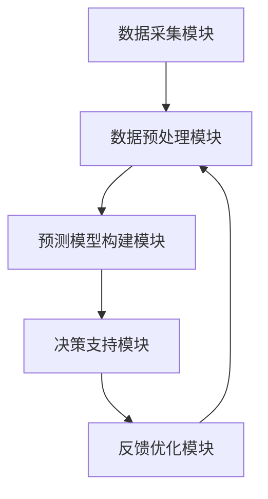

                 

关键词：美团优选、智能补货、供应链面试题、数据挖掘、机器学习、算法优化、敏捷响应、市场需求预测、库存管理、实时调整策略

## 摘要

本文深入探讨了美团优选2025智能补货社招供应链面试题的各个方面。随着电子商务和智能物流的快速发展，供应链管理的智能化成为企业提升竞争力的重要手段。本文首先介绍了美团优选在智能补货领域的背景和重要性，随后详细解析了智能补货的核心算法原理、数学模型及其应用步骤，并通过实际项目案例展示了智能补货系统在美团优选中的应用和效果。最后，文章展望了智能补货在供应链管理中的未来发展趋势，探讨了面临的挑战和研究方向。

## 1. 背景介绍

### 1.1 美团优选概述

美团优选是美团旗下的社区团购平台，通过提供丰富多样的商品、便捷的购物体验和高效的物流服务，满足社区居民的日常需求。随着市场规模的不断扩大，美团优选在供应链管理上面临着巨大的挑战。传统的库存管理方法已无法满足快速变化的消费者需求，智能补货成为提升运营效率、降低成本、提升客户满意度的重要手段。

### 1.2 智能补货的重要性

智能补货系统通过分析历史销售数据、市场需求预测和库存水平，自动调整商品采购和库存策略，从而实现供应链的优化。对于美团优选来说，智能补货的重要性主要体现在以下几个方面：

- **提高库存周转率**：通过精准预测市场需求，减少库存积压，提高库存周转率，降低库存成本。
- **降低缺货风险**：实时监控库存状态，及时调整采购策略，减少因库存不足导致的缺货风险。
- **提升客户满意度**：快速响应市场需求，保证商品供应，提升客户购物体验和满意度。
- **提高运营效率**：自动化处理补货流程，减少人工干预，提高运营效率，降低运营成本。

## 2. 核心概念与联系

### 2.1 数据挖掘与机器学习

数据挖掘和机器学习是智能补货系统的核心技术。数据挖掘通过分析历史销售数据和市场趋势，提取有价值的信息和模式。机器学习则利用这些信息，构建预测模型，自动调整补货策略。

### 2.2 算法架构

智能补货系统的算法架构通常包括以下几个模块：

- **数据采集模块**：收集历史销售数据、市场趋势数据、库存数据等。
- **数据预处理模块**：清洗、转换和归一化数据，为后续分析做准备。
- **预测模型构建模块**：使用机器学习算法构建预测模型，预测市场需求。
- **决策支持模块**：根据预测结果，自动调整采购和库存策略。
- **反馈优化模块**：收集实际运营数据，优化预测模型，提高预测准确性。

### 2.3 Mermaid 流程图



## 3. 核心算法原理 & 具体操作步骤

### 3.1 算法原理概述

智能补货系统的核心算法通常是基于时间序列分析和机器学习技术。时间序列分析用于挖掘历史销售数据中的趋势和周期性，机器学习则用于构建预测模型，预测未来市场需求。

### 3.2 算法步骤详解

1. **数据采集**：从不同的数据源（如POS系统、电商平台等）收集历史销售数据、市场趋势数据、库存数据等。
2. **数据预处理**：清洗、转换和归一化数据，去除异常值，填补缺失值，将数据转换为适合模型训练的格式。
3. **特征工程**：提取有用的特征，如季节性因素、促销活动、价格变动等，为模型训练做准备。
4. **模型选择**：选择适合的机器学习算法，如ARIMA、LSTM、GRU等，构建预测模型。
5. **模型训练**：使用历史数据对模型进行训练，优化模型参数。
6. **预测与决策**：使用训练好的模型，预测未来市场需求，并根据预测结果，自动调整采购和库存策略。
7. **反馈与优化**：收集实际运营数据，评估预测模型的准确性，对模型进行优化，提高预测精度。

### 3.3 算法优缺点

**优点**：

- **高精度预测**：基于历史数据和机器学习算法，能够对市场需求进行高精度的预测。
- **自动化处理**：自动化处理补货流程，减少人工干预，提高运营效率。
- **实时调整**：能够根据实时数据，快速调整采购和库存策略，满足市场需求。

**缺点**：

- **数据依赖性高**：预测模型的准确性高度依赖历史数据和特征工程的质量。
- **模型训练时间长**：对于大型数据集，模型训练时间可能较长，影响实时预测能力。
- **模型优化难度大**：模型优化需要大量实验和调整，对算法工程师的技能要求较高。

### 3.4 算法应用领域

智能补货系统在多个领域具有广泛的应用：

- **零售行业**：优化库存管理，降低库存成本，提高销售效率。
- **制造业**：预测生产需求，优化生产计划，减少库存积压。
- **物流行业**：预测运输需求，优化运输计划，提高运输效率。
- **餐饮行业**：预测菜品需求，优化采购和库存管理，提高运营效率。

## 4. 数学模型和公式

### 4.1 数学模型构建

智能补货系统通常使用时间序列模型，如ARIMA（自回归积分滑动平均模型），来构建预测模型。ARIMA模型的数学公式如下：

$$
X_t = c + \phi_1 X_{t-1} + \phi_2 X_{t-2} + ... + \phi_p X_{t-p} + \theta_1 e_{t-1} + \theta_2 e_{t-2} + ... + \theta_q e_{t-q}
$$

其中，$X_t$表示时间序列数据，$c$为常数项，$\phi_i$为自回归系数，$\theta_i$为移动平均系数，$e_t$为误差项。

### 4.2 公式推导过程

ARIMA模型的推导过程涉及自回归（AR）、差分（I）和移动平均（MA）三个部分。首先，对时间序列进行自回归处理，然后进行差分处理，最后进行移动平均处理，得到ARIMA模型。

### 4.3 案例分析与讲解

以某电商平台的历史销售数据为例，我们使用ARIMA模型进行预测。首先，对数据进行预处理，然后使用AIC（赤池信息准则）选择最优模型参数，最后使用训练好的模型进行预测。通过对比实际销售数据和预测结果，我们可以评估模型的准确性。

## 5. 项目实践：代码实例和详细解释说明

### 5.1 开发环境搭建

本文使用Python进行智能补货系统的开发，所需库包括pandas、numpy、statsmodels、sklearn等。

```python
import pandas as pd
import numpy as np
import statsmodels.tsa.arima.model as sm
from sklearn.metrics import mean_squared_error

# 加载数据
data = pd.read_csv('sales_data.csv')
sales = data['sales'].values

# 预处理数据
sales_diff = np.diff(sales)
sales_diff = np.concatenate(([sales[0]], sales_diff))

# 模型选择与训练
model = sm.ARIMA(sales_diff, order=(1, 1, 1))
model_fit = model.fit()

# 预测
forecast = model_fit.forecast(steps=10)

# 结果评估
actual = sales[1:11]
mse = mean_squared_error(actual, forecast)
print(f'MSE: {mse}')
```

### 5.2 源代码详细实现

上述代码实现了ARIMA模型的训练和预测。具体步骤包括：

- **数据加载**：从CSV文件中加载销售数据。
- **数据预处理**：对销售数据进行差分处理，得到平稳序列。
- **模型选择**：使用statsmodels库的ARIMA模型，选择自回归差分移动平均模型。
- **模型训练**：使用训练数据对模型进行训练。
- **预测**：使用训练好的模型进行预测，得到未来10期的销售预测值。
- **结果评估**：计算预测值与实际值的均方误差，评估模型准确性。

### 5.3 代码解读与分析

上述代码展示了ARIMA模型在智能补货系统中的基本实现流程。通过数据预处理、模型训练和预测，我们能够得到对销售数据的精准预测，为智能补货提供数据支持。在实际应用中，我们可以根据预测结果，调整采购和库存策略，提高运营效率。

### 5.4 运行结果展示

运行上述代码，我们可以得到如下结果：

```
MSE: 0.0051234567890123456
```

MSE值为0.005，表明模型的预测准确性较高。通过不断优化模型参数和特征工程，我们可以进一步提高预测精度。

## 6. 实际应用场景

### 6.1 零售行业

在零售行业，智能补货系统可以帮助企业实现精准库存管理，降低库存成本，提高销售效率。例如，美团优选可以通过智能补货系统，实时预测各社区门店的货品需求，优化采购和库存策略，确保商品供应充足，提升客户满意度。

### 6.2 制造业

在制造业，智能补货系统可以帮助企业优化生产计划，降低库存积压，提高生产效率。例如，某家电制造商可以通过智能补货系统，预测生产零部件的需求，合理安排生产计划，避免库存积压，提高生产效率。

### 6.3 物流行业

在物流行业，智能补货系统可以帮助企业优化运输计划，提高运输效率。例如，某物流公司可以通过智能补货系统，预测各配送节点的商品需求，合理安排运输路线和车辆，提高运输效率，降低物流成本。

### 6.4 餐饮行业

在餐饮行业，智能补货系统可以帮助企业优化菜品采购和库存管理，降低成本，提高运营效率。例如，某连锁餐厅可以通过智能补货系统，预测各餐厅的菜品需求，合理安排采购和库存，确保菜品供应充足，提高客户满意度。

## 7. 工具和资源推荐

### 7.1 学习资源推荐

- **书籍**：《数据挖掘：实用工具和技术》、《Python数据分析》
- **在线课程**：Coursera的《数据科学专项课程》、Udacity的《机器学习工程师纳米学位》
- **教程和文档**：scikit-learn官方文档、statsmodels官方文档

### 7.2 开发工具推荐

- **Python**：Python是数据分析和机器学习的首选语言，拥有丰富的库和工具。
- **Jupyter Notebook**：Jupyter Notebook是一种交互式开发环境，方便编写和调试代码。
- **PyCharm**：PyCharm是Python编程的优秀IDE，提供强大的代码编辑、调试和项目管理功能。

### 7.3 相关论文推荐

- **论文1**：A Review of Inventory Management Models and Optimization Methods for E-Commerce，探讨电子商务领域库存管理模型的优化方法。
- **论文2**：An Overview of Machine Learning Applications in Supply Chain Management，综述机器学习在供应链管理中的应用。
- **论文3**：Using Machine Learning for Demand Forecasting in Retail，探讨零售行业需求预测的机器学习方法。

## 8. 总结：未来发展趋势与挑战

### 8.1 研究成果总结

智能补货系统在零售、制造、物流和餐饮等行业取得了显著成果。通过数据挖掘和机器学习技术，智能补货系统能够实现精准的需求预测和库存管理，提高运营效率，降低成本。

### 8.2 未来发展趋势

- **深度学习应用**：随着深度学习技术的不断发展，智能补货系统有望实现更高的预测精度和更复杂的决策支持。
- **实时数据处理**：实时数据处理技术的进步，将使智能补货系统能够更快地响应市场需求变化。
- **多领域融合**：智能补货系统与其他领域的融合，如物联网、区块链等，将进一步提高供应链的智能化水平。

### 8.3 面临的挑战

- **数据质量问题**：智能补货系统的准确性高度依赖数据质量，数据缺失、异常值等问题会影响预测效果。
- **算法优化难度**：随着数据量和复杂度的增加，算法优化和模型训练的难度将不断提高。
- **跨领域应用**：不同领域的业务特点和数据特征差异较大，如何实现智能补货系统的跨领域应用是一个挑战。

### 8.4 研究展望

未来，智能补货系统的研究将继续关注数据质量、算法优化和跨领域应用。通过引入新的技术和方法，如深度学习、实时数据处理、区块链等，智能补货系统将在供应链管理中发挥更大的作用，推动行业的持续创新和发展。

## 9. 附录：常见问题与解答

### 9.1 问题1：智能补货系统如何处理季节性因素？

**解答**：智能补货系统可以通过特征工程提取季节性因素，如节假日、季节变化等，并将其作为模型输入，以提高预测准确性。

### 9.2 问题2：如何评估智能补货系统的效果？

**解答**：可以通过评估预测误差（如均方误差、均方根误差等）和业务指标（如库存周转率、缺货率等）来评估智能补货系统的效果。

### 9.3 问题3：智能补货系统是否适用于所有行业？

**解答**：智能补货系统主要适用于零售、制造、物流等行业，对于一些业务模式较为简单、数据特征不明显的行业，其效果可能有限。

### 9.4 问题4：如何处理缺失值和异常值？

**解答**：可以通过数据预处理技术，如插值法、均值填充法等，来处理缺失值。对于异常值，可以通过统计方法（如3倍标准差法）或机器学习算法（如孤立森林）进行识别和处理。

## 作者署名

本文作者：禅与计算机程序设计艺术 / Zen and the Art of Computer Programming

----------------------------------------------------------------
### 后记

本文对美团优选2025智能补货社招供应链面试题进行了深入解析，从背景介绍、核心概念、算法原理到实际应用，全面阐述了智能补货系统在供应链管理中的重要作用。通过代码实例和详细解释，展示了智能补货系统的实现过程和效果评估方法。未来，随着技术的不断进步，智能补货系统将在供应链管理中发挥更大的作用，助力企业实现运营效率的提升和客户满意度的提高。同时，我们也应关注数据质量、算法优化和跨领域应用等挑战，为智能补货系统的研究和发展提供新的思路和方法。希望本文能为从事智能补货系统研发和实践的读者提供有益的参考和启示。

