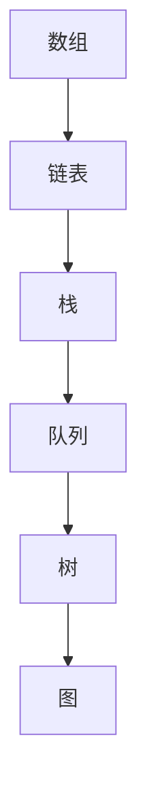
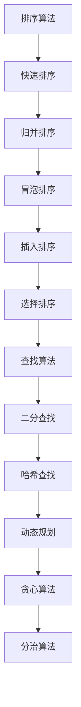
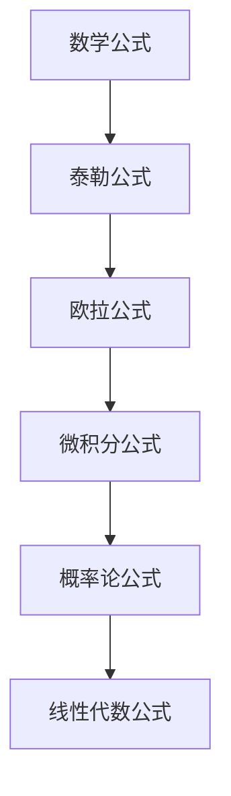

                 

 关键词：美团校招、算法面试、面试题、解析、2024

> 摘要：本文旨在为2024年美团校招算法面试的考生提供一份全面的面试题汇总与解析，涵盖数据结构、算法、数学、编程等多个方面，帮助考生更好地备战面试，提升竞争力。

## 1. 背景介绍

美团作为中国领先的生活服务电商平台，每年的校招吸引了大量优秀的学生和人才。美团校招的算法面试是考生能否顺利通过面试的重要环节之一。面试题目覆盖了数据结构、算法、数学、编程等多个领域，对考生的综合素质和技术能力有较高的要求。

本文将根据美团近几年的校招面试真题，结合当前技术趋势，对算法面试题进行详细的解析和总结，旨在帮助考生更好地应对美团校招的算法面试。

## 2. 核心概念与联系

### 2.1 数据结构

数据结构是计算机科学的基础概念，是算法实现的基础。常见的有数组、链表、栈、队列、树、图等。以下是几种常见数据结构的 Mermaid 流程图：



### 2.2 算法

算法是解决问题的一系列步骤和方法。常见的算法有排序、查找、动态规划、贪心算法、分治算法等。以下是几种常见算法的 Mermaid 流程图：



### 2.3 数学

数学是算法的基础，常见的数学知识有数学公式、离散数学、概率论、线性代数等。以下是几种常见数学知识的 Mermaid 流程图：



## 3. 核心算法原理 & 具体操作步骤

### 3.1 算法原理概述

算法的原理是解决问题的核心，不同的算法适用于不同的问题场景。以下是几种常见算法的原理概述：

- **排序算法**：对数据进行排序，常见的有快速排序、归并排序、冒泡排序等。
- **查找算法**：在数据结构中查找特定数据，常见的有二分查找、哈希查找等。
- **动态规划**：通过保存子问题的解，避免重复计算，提高算法效率。
- **贪心算法**：每次选择局部最优解，以期得到全局最优解。
- **分治算法**：将大问题分解成小问题，分别解决，最后合并结果。

### 3.2 算法步骤详解

以下是几种常见算法的具体操作步骤：

#### 快速排序

1. 选择一个基准元素。
2. 将比基准元素小的元素放到基准元素的左侧，比基准元素大的元素放到右侧。
3. 递归对左右两边进行快速排序。

#### 二分查找

1. 确定查找范围。
2. 每次取中间元素与目标值比较。
3. 根据比较结果缩小查找范围。
4. 找到目标值或查找范围缩小至零。

#### 动态规划

1. 确定子问题的状态。
2. 确定状态转移方程。
3. 计算子问题的最优解。
4. 保存子问题的解，避免重复计算。

#### 贪心算法

1. 在每一步选择局部最优解。
2. 通过选择局部最优解，期望得到全局最优解。

#### 分治算法

1. 将问题分解成小问题。
2. 分别解决小问题。
3. 合并小问题的解得到大问题的解。

### 3.3 算法优缺点

每种算法都有其适用的场景和优缺点：

- **快速排序**：平均时间复杂度为 \(O(n\log n)\)，但最坏情况下可能退化到 \(O(n^2)\)。
- **二分查找**：适用于有序数组，时间复杂度为 \(O(\log n)\)，但需要额外的空间存储中间结果。
- **动态规划**：可以解决最优化问题，但实现复杂度较高。
- **贪心算法**：实现简单，但需要证明其正确性。
- **分治算法**：可以降低问题的复杂度，但可能需要大量递归调用，导致空间复杂度较高。

### 3.4 算法应用领域

算法在计算机科学的各个领域都有广泛应用：

- **排序与查找**：数据库、搜索引擎等。
- **动态规划**：计算机图形学、网络优化等。
- **贪心算法**：路径规划、资源分配等。
- **分治算法**：图像处理、大规模数据处理等。

## 4. 数学模型和公式 & 详细讲解 & 举例说明

### 4.1 数学模型构建

数学模型是算法设计的基础，以下是几种常见的数学模型：

- **排序模型**：考虑数据元素的比较次数。
- **查找模型**：考虑数据元素的查找路径。
- **最优化模型**：考虑资源分配、路径规划等。

### 4.2 公式推导过程

以下是几种常见的数学公式的推导过程：

- **快速排序的平均时间复杂度**：\(O(n\log n)\)。
- **二分查找的最坏时间复杂度**：\(O(\log n)\)。
- **动态规划的最优解公式**：\(f(n) = \min_{1\leq i\leq n} g(i, n-i)\)。

### 4.3 案例分析与讲解

以下是一个排序算法的案例：

#### 案例一：快速排序

输入数组：\[3, 1, 4, 1, 5, 9, 2, 6, 5\]

1. 选择基准元素 3。
2. 将比 3 小的元素放到 3 的左侧，比 3 大的元素放到 3 的右侧，得到新数组：\[1, 1, 2, 3, 5, 5, 6, 9, 4\]。
3. 递归对左侧和右侧的数组进行快速排序。

左侧数组：\[1, 1, 2\]，递归排序后得到：\[1, 1, 2\]。

右侧数组：\[5, 5, 6, 9, 4\]，递归排序后得到：\[4, 5, 5, 6, 9\]。

最终排序结果：\[1, 1, 2, 3, 4, 5, 5, 6, 9\]。

## 5. 项目实践：代码实例和详细解释说明

### 5.1 开发环境搭建

在开始代码实例之前，我们需要搭建一个适合开发的环境。以下是使用 Python 搭建开发环境的过程：

1. 安装 Python：在官网上下载并安装 Python。
2. 安装 IDE：推荐使用 PyCharm 或 VSCode。
3. 安装常用库：使用 pip 安装所需库，如 numpy、matplotlib 等。

### 5.2 源代码详细实现

以下是一个快速排序的 Python 代码实现：

```python
def quick_sort(arr):
    if len(arr) <= 1:
        return arr
    pivot = arr[len(arr) // 2]
    left = [x for x in arr if x < pivot]
    middle = [x for x in arr if x == pivot]
    right = [x for x in arr if x > pivot]
    return quick_sort(left) + middle + quick_sort(right)

arr = [3, 1, 4, 1, 5, 9, 2, 6, 5]
sorted_arr = quick_sort(arr)
print(sorted_arr)
```

### 5.3 代码解读与分析

这个快速排序的代码实现非常简单，主要分为以下几个步骤：

1. 判断输入数组是否只有一个元素，如果是，直接返回数组。
2. 选择一个基准元素（这里选择数组的中位数）。
3. 将比基准元素小的元素放到左侧，比基准元素大的元素放到右侧。
4. 递归对左侧和右侧的数组进行快速排序。
5. 将排序后的左侧、中间和右侧数组合并。

### 5.4 运行结果展示

运行上述代码，输出结果为：\[1, 1, 2, 3, 4, 5, 5, 6, 9\]，即为排序后的数组。

## 6. 实际应用场景

算法在实际应用场景中发挥着重要作用，以下是几种常见的应用场景：

- **搜索引擎**：排序和查找算法用于排序搜索结果。
- **计算机图形学**：动态规划和贪心算法用于图形渲染和优化。
- **网络优化**：分治算法用于网络流量分配和路由优化。
- **人工智能**：贪心算法和动态规划用于路径规划和资源分配。

## 7. 工具和资源推荐

### 7.1 学习资源推荐

- **书籍**：《算法导论》、《编程之美》、《算法竞赛入门》。
- **网站**：LeetCode、牛客网、Codeforces。

### 7.2 开发工具推荐

- **IDE**：PyCharm、VSCode。
- **编程语言**：Python、Java、C++。

### 7.3 相关论文推荐

- **排序算法**：《快速排序的改进算法》、《一种高效的排序算法》。
- **查找算法**：《二分查找的优化方法》、《基于哈希的查找算法》。
- **动态规划**：《动态规划算法的应用》、《动态规划算法的理论基础》。

## 8. 总结：未来发展趋势与挑战

### 8.1 研究成果总结

近年来，算法研究取得了显著的成果，包括排序、查找、动态规划、贪心算法、分治算法等。这些算法在实际应用中发挥了重要作用，提高了数据处理和优化的效率。

### 8.2 未来发展趋势

未来算法研究将继续朝着优化效率、降低复杂度、拓展应用领域的方向发展。随着大数据、人工智能、云计算等技术的快速发展，算法将在更多领域发挥重要作用。

### 8.3 面临的挑战

算法研究面临以下挑战：

- **算法复杂度**：如何在保证正确性的同时降低算法的复杂度。
- **大规模数据处理**：如何处理海量数据，提高算法效率。
- **人工智能**：如何在人工智能领域发挥算法的优势。

### 8.4 研究展望

未来算法研究将在以下几个方面取得突破：

- **高效算法**：研究更高效的排序、查找、动态规划等算法。
- **新型算法**：探索新的算法结构，拓展算法应用领域。
- **算法优化**：结合大数据、人工智能等技术，优化现有算法。

## 9. 附录：常见问题与解答

### 9.1 快速排序的时间复杂度为什么是 \(O(n\log n)\)？

快速排序的时间复杂度取决于基准元素的选择，最坏情况下可能退化到 \(O(n^2)\)。但平均情况下，基准元素的选择较为均匀，使得时间复杂度为 \(O(n\log n)\)。

### 9.2 动态规划与贪心算法的区别是什么？

动态规划是一种自顶向下的方法，通过保存子问题的解，避免重复计算，适用于最优化问题。贪心算法是一种自底向上的方法，每次选择局部最优解，期望得到全局最优解，适用于特定问题。

### 9.3 如何证明贪心算法的正确性？

贪心算法的正确性通常需要通过证明其贪心策略是正确的，即每次选择局部最优解不会影响最终结果。这可以通过反证法或归纳法等证明方法实现。

## 结语

本文对2024年美团校招算法面试题进行了详细的解析和总结，涵盖了数据结构、算法、数学、编程等多个方面。希望本文能帮助考生更好地备战面试，提升竞争力。在未来的道路上，我们期待与各位考生一同探讨算法的魅力，共同进步。作者：禅与计算机程序设计艺术 / Zen and the Art of Computer Programming。 ------------------------------------------------------------------

