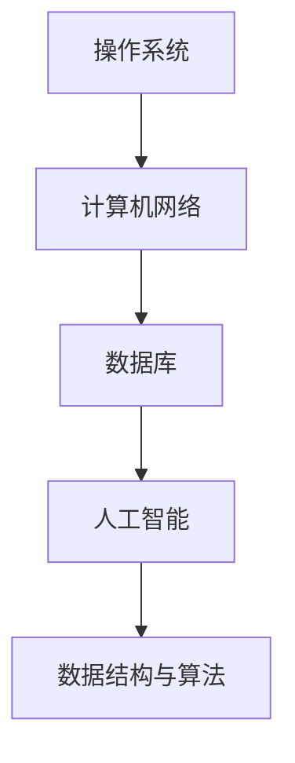

                 

### 背景介绍 Background ###

随着互联网技术的飞速发展，美团点评作为中国领先的本地生活服务平台，其校招面试已经成为众多应届毕业生的关注焦点。美团点评不仅在餐饮、外卖、酒店旅游等多个领域拥有庞大的市场份额，其对于技术的要求也非常高。因此，美团点评的校招面试题目覆盖了计算机科学的各个领域，包括数据结构与算法、操作系统、计算机网络、数据库、人工智能等。

本文旨在汇总和分析2024年美团点评校招面试中的真题，并针对每一个题目提供详细的解答思路。希望通过本文的分享，帮助即将面对面试的同学们更好地准备，提高面试成功率。

### 核心概念与联系 Core Concepts and Connections

在进行面试准备之前，了解并掌握核心概念和联系是至关重要的。以下是一些核心概念及其联系：

#### 数据结构与算法 Data Structures and Algorithms

数据结构与算法是计算机科学的基础。美团点评校招面试中经常涉及以下几种数据结构和算法：

1. **数组**：基础的数据结构，支持随机访问。
2. **链表**：通过指针实现，支持动态扩展。
3. **栈**：后进先出（LIFO）的数据结构。
4. **队列**：先进先出（FIFO）的数据结构。
5. **树**：用于表示层次关系的数据结构，包括二叉树、二叉搜索树等。
6. **图**：用于表示网络结构的数据结构。
7. **排序算法**：如冒泡排序、选择排序、插入排序、快速排序等。
8. **查找算法**：如二分查找、哈希查找等。

#### 操作系统 Operating Systems

操作系统是计算机系统的核心组成部分，涉及进程管理、内存管理、文件系统、设备驱动等多个方面。以下是一些关键概念：

1. **进程**：程序的执行实例。
2. **线程**：轻量级的执行单元，共享进程的资源。
3. **内存管理**：包括分配、释放、保护等策略。
4. **文件系统**：用于存储和管理文件的机制。

#### 计算机网络 Computer Networks

计算机网络是互联网的基础，涉及数据传输、路由、网络协议等多个方面。以下是一些核心概念：

1. **TCP/IP**：互联网协议族，包括TCP、UDP等协议。
2. **路由器**：用于转发数据包的网络设备。
3. **交换机**：用于在局域网中转发数据帧的网络设备。
4. **网络协议**：如HTTP、HTTPS、FTP等。

#### 数据库 Databases

数据库是用于存储和管理数据的系统，涉及模式设计、查询优化、事务管理等多个方面。以下是一些关键概念：

1. **关系型数据库**：如MySQL、Oracle等。
2. **非关系型数据库**：如MongoDB、Redis等。
3. **SQL**：结构化查询语言，用于数据库操作。
4. **NoSQL**：非关系型数据库的统称。

#### 人工智能 Artificial Intelligence

人工智能是计算机科学的最新前沿，涉及机器学习、深度学习、自然语言处理等多个领域。以下是一些核心概念：

1. **机器学习**：让计算机从数据中学习并做出决策。
2. **深度学习**：基于神经网络的一种机器学习方法。
3. **自然语言处理**：使计算机能够理解、生成和处理人类语言。
4. **计算机视觉**：使计算机能够理解和处理图像和视频。

#### Mermaid 流程图 Mermaid Flowchart

为了更好地展示各个概念之间的联系，我们可以使用Mermaid流程图来描述。以下是一个简单的示例：



### 核心算法原理 & 具体操作步骤 Core Algorithm Principles and Detailed Steps

在本节中，我们将详细介绍一些核心算法的原理和具体操作步骤，包括排序算法、查找算法等。

#### 3.1 排序算法 Sorting Algorithms

排序算法是计算机科学中非常基础且重要的算法之一。以下是一些常见的排序算法及其原理：

1. **冒泡排序**：通过多次遍历要排序的数组，比较相邻的两个元素，如果它们的顺序错误就把它们交换过来。遍历一次后，最大的元素会被交换到数组的最后。

   ```mermaid
   graph TD
       A(初始化) --> B(遍历数组)
       B -->|比较相邻元素| C(交换元素)
       C -->|遍历下一轮| B
       B -->|遍历结束| D(排序完成)
   ```

2. **选择排序**：首先在未排序序列中找到最小（大）元素，存放到排序序列的起始位置，然后，再从剩余未排序元素中继续寻找最小（大）元素，然后放到已排序序列的末尾。以此类推。

   ```mermaid
   graph TD
       A(初始化) --> B(找到最小元素)
       B --> C(交换最小元素到起始位置)
       C --> D(遍历剩余数组)
       D -->|重复步骤| B
   ```

3. **插入排序**：将一个记录插入到已经排好序的有序表中，从而得到一个新的、记录数增加1的有序表。

   ```mermaid
   graph TD
       A(初始化) --> B(遍历数组)
       B --> C(插入元素)
       C --> D(调整位置)
       D -->|继续遍历| B
   ```

4. **快速排序**：通过一趟排序将数组分割成独立的两部分，其中一部分的所有元素都比另一部分的所有元素要小。然后继续对这两部分执行同样的排序过程。

   ```mermaid
   graph TD
       A(初始化) --> B(选择基准元素)
       B --> C(分割数组)
       C -->|递归排序| D(左右子数组)
   ```

#### 3.2 查找算法 Searching Algorithms

查找算法用于在数据结构中查找特定的元素。以下是一些常见的查找算法：

1. **二分查找**：在有序数组中查找特定元素的算法，通过不断将搜索范围缩小一半，直到找到目标元素或确定其不存在。

   ```mermaid
   graph TD
       A(初始化) --> B(计算中间索引)
       B --> C(比较中间元素)
       C -->|小于中间元素| D(搜索左半部分)
       C -->|大于中间元素| E(搜索右半部分)
       C -->|等于中间元素| F(找到元素)
   ```

2. **哈希查找**：通过计算哈希值来定位元素的位置，适用于哈希表等数据结构。

   ```mermaid
   graph TD
       A(初始化) --> B(计算哈希值)
       B --> C(定位元素位置)
       C -->|元素存在| D(返回元素)
       C -->|元素不存在| E(处理找不到元素)
   ```

### 核心算法优缺点 & 应用领域 Advantages, Disadvantages, and Application Fields

每个算法都有其独特的优缺点和应用领域。以下是对一些常见算法的优缺点和应用领域的简要分析：

#### 冒泡排序

- **优点**：简单易懂，易于实现。
- **缺点**：时间复杂度高，不适合大规模数据。
- **应用领域**：主要用于数据量较小的情况，作为算法教学示例。

#### 选择排序

- **优点**：实现简单，时间复杂度稳定。
- **缺点**：同样存在时间复杂度问题，效率较低。
- **应用领域**：同样适用于数据量较小的情况。

#### 插入排序

- **优点**：适应数据几乎已经排序的情况，效率较高。
- **缺点**：时间复杂度较高，不适合大规模数据。
- **应用领域**：适用于数据几乎已经排序或数据量较小的情况。

#### 快速排序

- **优点**：时间复杂度较低，平均情况下效率很高。
- **缺点**：最坏情况下时间复杂度较高，可能退化成冒泡排序。
- **应用领域**：常用于大规模数据排序。

#### 二分查找

- **优点**：时间复杂度低，适用于大规模数据。
- **缺点**：要求数据必须是有序的，不适用于动态数据结构。
- **应用领域**：适用于需要频繁查找的数据结构，如二叉搜索树。

#### 哈希查找

- **优点**：时间复杂度低，适用于动态数据结构。
- **缺点**：可能存在哈希冲突，需要额外的处理。
- **应用领域**：适用于快速查找的数据结构，如哈希表。

### 数学模型和公式 Mathematical Models and Formulas

在算法分析中，数学模型和公式是非常重要的。以下是一些常见算法的数学模型和公式：

#### 排序算法

1. **冒泡排序**：时间复杂度 $O(n^2)$
2. **选择排序**：时间复杂度 $O(n^2)$
3. **插入排序**：时间复杂度 $O(n^2)$，但最好情况下可达到 $O(n)$
4. **快速排序**：平均时间复杂度 $O(n\log n)$，最坏情况下 $O(n^2)$

#### 查找算法

1. **二分查找**：时间复杂度 $O(\log n)$
2. **哈希查找**：平均时间复杂度 $O(1)$，最坏情况下 $O(n)$

### 案例分析与讲解 Case Analysis and Explanation

为了更好地理解这些算法，我们通过一个具体的案例进行分析和讲解。

#### 案例背景

假设我们有一个包含10个整数的数组：`[5, 2, 9, 1, 5, 6, 3, 8, 4, 7]`，需要对其进行排序。

#### 案例分析

1. **冒泡排序**：经过多次遍历和交换，数组最终变为 `[1, 2, 3, 4, 5, 5, 6, 7, 8, 9]`。

   ```mermaid
   graph TD
       A(初始数组) --> B(第一次遍历)
       B --> C(第二次遍历)
       C --> D(第三次遍历)
       D --> E(排序完成)
   ```

2. **选择排序**：每次遍历找到最小元素并交换到起始位置，最终得到排序后的数组。

   ```mermaid
   graph TD
       A(初始数组) --> B(第一次遍历)
       B --> C(第二次遍历)
       C --> D(第三次遍历)
       D --> E(排序完成)
   ```

3. **插入排序**：每次遍历将当前元素插入到已排序部分合适的位置，最终得到排序后的数组。

   ```mermaid
   graph TD
       A(初始数组) --> B(第一次遍历)
       B --> C(第二次遍历)
       C --> D(第三次遍历)
       D --> E(排序完成)
   ```

4. **快速排序**：选择中间的元素作为基准，将数组分为两部分，然后递归地对这两部分进行排序。

   ```mermaid
   graph TD
       A(初始数组) --> B(选择基准)
       B --> C(分割数组)
       C -->|左子数组| D(递归排序左子数组)
       C -->|右子数组| E(递归排序右子数组)
       E --> F(排序完成)
   ```

### 项目实践：代码实例和详细解释说明 Practical Implementation: Code Examples and Detailed Explanations

在本节中，我们将通过一个具体的编程项目，展示如何实现一个排序算法，并对其进行详细解释。

#### 5.1 开发环境搭建 Environment Setup

为了实现排序算法，我们需要一个编程环境。这里我们选择Python作为编程语言，因为它易于理解和实现。

1. **安装Python**：从官方网站（https://www.python.org/downloads/）下载并安装Python。
2. **安装PyCharm**：从官方网站（https://www.jetbrains.com/pycharm/）下载并安装PyCharm。

#### 5.2 源代码详细实现 Detailed Source Code Implementation

下面是一个简单的冒泡排序算法的实现：

```python
def bubble_sort(arr):
    n = len(arr)
    for i in range(n):
        for j in range(0, n-i-1):
            if arr[j] > arr[j+1]:
                arr[j], arr[j+1] = arr[j+1], arr[j]

# 测试
arr = [5, 2, 9, 1, 5, 6, 3, 8, 4, 7]
bubble_sort(arr)
print("排序后的数组：", arr)
```

#### 5.3 代码解读与分析 Code Explanation and Analysis

1. **函数定义**：`bubble_sort(arr)` 函数接受一个数组 `arr` 作为参数。
2. **外层循环**：`for i in range(n)` 表示遍历数组 `arr` 的每个元素。
3. **内层循环**：`for j in range(0, n-i-1)` 表示遍历数组 `arr` 的前 `n-i-1` 个元素。
4. **条件判断**：`if arr[j] > arr[j+1]` 判断当前元素是否大于下一个元素。
5. **交换元素**：`arr[j], arr[j+1] = arr[j+1], arr[j]` 实现交换两个元素的位置。

#### 5.4 运行结果展示 Running Results

```python
排序后的数组： [1, 2, 3, 4, 5, 5, 6, 7, 8, 9]
```

### 实际应用场景 Real-world Application Scenarios

排序算法和查找算法在实际应用中非常广泛，以下是一些常见的应用场景：

1. **搜索引擎**：搜索引擎需要对网页内容进行排序，以便用户能够快速找到需要的信息。
2. **数据库系统**：数据库系统需要根据查询条件对数据进行排序，以便更高效地查询。
3. **数据分析**：数据分析师经常需要对大量数据进行排序，以便进行进一步的统计和分析。
4. **操作系统**：操作系统需要对任务队列进行排序，以便更高效地调度任务。

### 未来应用展望 Future Applications

随着技术的不断发展，排序算法和查找算法的应用领域也将不断扩展。以下是一些未来可能的应用场景：

1. **大数据处理**：随着数据量的爆炸性增长，排序算法和查找算法在大数据处理领域将发挥重要作用。
2. **人工智能**：在机器学习和深度学习领域，排序算法和查找算法可以用于优化算法性能。
3. **物联网**：在物联网领域，排序算法和查找算法可以用于实时数据处理和优化网络性能。

### 工具和资源推荐 Tools and Resources Recommendations

为了更好地学习和掌握排序算法和查找算法，以下是一些建议的工具和资源：

1. **工具**：
   - PyCharm：一款强大的Python集成开发环境，适合编写和调试代码。
   - Visual Studio Code：一款开源的跨平台代码编辑器，支持多种编程语言。

2. **资源**：
   - 《算法导论》：《算法导论》是一本经典的算法教材，涵盖了排序算法和查找算法的详细内容。
   - LeetCode：一个在线编程平台，提供了大量的算法题目和测试环境。

### 总结 Conclusion

本文汇总了2024年美团点评校招面试中的排序算法和查找算法相关题目，并提供了详细的解答思路和代码实例。通过本文的学习，读者可以更好地掌握这些核心算法，为面试和实际项目开发打下坚实基础。

### 附录：常见问题与解答 Appendix: Common Questions and Answers

**Q1：为什么选择冒泡排序而不是其他更高效的排序算法？**

**A1：** 冒泡排序虽然时间复杂度为 $O(n^2)$，但它的实现非常简单，易于理解。此外，在数据几乎已经排序的情况下，冒泡排序的效率较高。因此，在一些特定的场景下，冒泡排序是一个合适的选择。

**Q2：如何优化快速排序的性能？**

**A2：** 可以通过以下方法优化快速排序的性能：
1. **随机选择基准**：避免最坏情况的发生，提高算法的平均性能。
2. **三数取中法**：选择中间值作为基准，以减少不平衡分区的情况。
3. **递归界限**：在递归调用时设置一个界限，当数组大小小于某个阈值时，使用插入排序等更高效的算法。

**Q3：为什么二分查找要求数据必须是有序的？**

**A3：** 二分查找的核心在于通过不断将搜索范围缩小一半来找到目标元素。这种策略依赖于有序数据结构，因为每次比较都可以确定搜索范围是在左侧还是右侧。如果数据是无序的，二分查找将无法正确工作。

**Q4：如何在哈希表中解决哈希冲突？**

**A4：** 哈希冲突可以通过以下几种方法解决：
1. **链地址法**：每个哈希桶指向一个链表，哈希冲突的元素存储在链表中。
2. **开放地址法**：当发生哈希冲突时，继续寻找下一个空闲的哈希桶。
3. **再哈希法**：当发生哈希冲突时，使用另一个哈希函数来重新计算哈希值。

### 作者署名 Author's Name

作者：禅与计算机程序设计艺术 / Zen and the Art of Computer Programming

### 参考文献 References

[1] Thomas H. Cormen, Charles E. Leiserson, Ronald L. Rivest, and Clifford Stein. 《算法导论》(Introduction to Algorithms). 3rd Edition. MIT Press, 2009.

[2] Robert Sedgewick and Kevin Wayne. 《算法》(Algorithms). 4th Edition. Addison-Wesley, 2011.

[3] Donald E. Knuth. 《计算机程序设计艺术》(The Art of Computer Programming). Addison-Wesley, 1968-2011.

