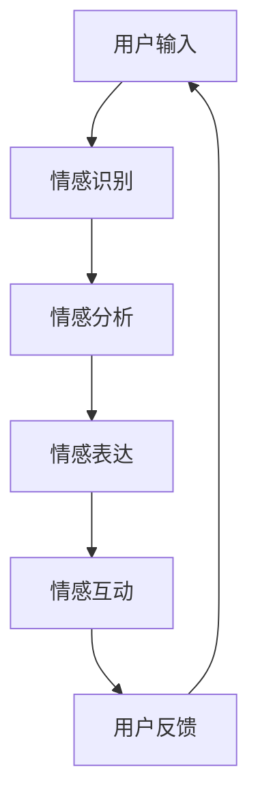

                 

关键词：聊天机器人，情感连接，人工智能，伴侣，朋友，未来，技术发展，用户体验

> 摘要：随着人工智能技术的不断进步，聊天机器人正逐渐成为我们日常生活中不可或缺的一部分。本文将探讨聊天机器人在情感连接方面的潜力，以及如何通过优化算法和提升用户体验，将聊天机器人打造成真正的智能伴侣和朋友。

## 1. 背景介绍

在过去的几十年中，人工智能（AI）技术经历了飞速的发展。从早期的规则基础系统到今天的深度学习，AI 已经在各个领域取得了显著的成果。尤其是自然语言处理（NLP）领域，随着语言模型和对话系统的不断进步，聊天机器人逐渐走进了我们的生活。

聊天机器人最初主要应用于客服领域，用于处理简单的客户咨询和常见问题。然而，随着技术的不断发展，聊天机器人的应用范围逐渐扩展，从教育、金融到医疗等各个领域，它们都在发挥着重要作用。

### 1.1 客户服务

在客户服务领域，聊天机器人已经成为企业不可或缺的一部分。通过自动化回答常见问题，聊天机器人可以大幅提高客户满意度，降低人工成本。此外，聊天机器人还可以根据用户的历史数据和偏好，提供个性化的服务和建议。

### 1.2 教育

在教育领域，聊天机器人被用于辅助学生学习和提供辅导。通过模拟老师的角色，聊天机器人可以帮助学生解决学习中遇到的问题，提供实时反馈和指导。此外，聊天机器人还可以根据学生的学习进度和需求，定制个性化的学习计划。

### 1.3 金融

在金融领域，聊天机器人被广泛应用于投资建议、风险管理、客户服务等各个方面。通过分析用户的数据和交易记录，聊天机器人可以提供个性化的投资建议，帮助用户做出更明智的决策。同时，聊天机器人还可以协助银行和金融机构处理日常事务，提高工作效率。

### 1.4 医疗

在医疗领域，聊天机器人被用于提供健康咨询、病情诊断和医疗建议。通过分析患者的症状和病史，聊天机器人可以提供初步的诊断建议，帮助患者更好地管理自己的健康。此外，聊天机器人还可以协助医生处理简单的患者咨询，减轻医生的工作负担。

## 2. 核心概念与联系

在探讨聊天机器人的情感连接之前，我们需要了解一些核心概念，包括情感识别、情感表达和情感互动。

### 2.1 情感识别

情感识别是指聊天机器人理解和识别用户的情感状态。这通常涉及到自然语言处理技术，如情感分析、语音识别和面部表情分析等。通过这些技术，聊天机器人可以识别用户的情绪，例如快乐、悲伤、愤怒或焦虑等。

### 2.2 情感表达

情感表达是指聊天机器人如何通过语言和行为来传达情感。这需要聊天机器人具备一定的情感知识和表达能力。例如，当用户表达悲伤时，聊天机器人可以通过使用安慰性的语言和表情符号来回应。

### 2.3 情感互动

情感互动是指聊天机器人与用户之间建立的情感联系。这需要聊天机器人不仅能够识别和表达情感，还能够理解用户的情感需求，并做出适当的回应。通过情感互动，聊天机器人可以成为用户的伙伴和朋友，为他们提供情感支持。

下面是一个简化的 Mermaid 流程图，展示了聊天机器人情感连接的核心概念和联系：



## 3. 核心算法原理 & 具体操作步骤

### 3.1 算法原理概述

聊天机器人情感连接的核心算法通常包括以下几个部分：

1. 情感识别：通过自然语言处理技术，如情感分析、语音识别和面部表情分析等，识别用户的情感状态。
2. 情感表达：根据情感识别的结果，使用情感知识和语言生成模块，生成合适的回应。
3. 情感互动：通过持续的情感识别和表达，与用户建立情感互动，满足用户的情感需求。

### 3.2 算法步骤详解

1. **情感识别**：

   - 输入：用户的语言或语音输入。
   - 处理：使用情感分析模型，对输入进行情感识别。
   - 输出：情感状态（如快乐、悲伤、愤怒等）。

2. **情感表达**：

   - 输入：情感状态。
   - 处理：根据情感状态和聊天机器人的情感知识库，生成合适的回应。
   - 输出：语言或语音回应。

3. **情感互动**：

   - 输入：用户的语言或语音输入，以及聊天机器人的情感状态。
   - 处理：持续进行情感识别和表达，与用户建立情感互动。
   - 输出：持续的对话和情感交流。

### 3.3 算法优缺点

**优点**：

- **高效性**：通过自动化处理，聊天机器人可以快速识别和回应用户的情感状态。
- **个性化**：通过情感识别和互动，聊天机器人可以提供个性化的情感支持。
- **扩展性**：情感识别和表达算法可以应用于各种场景，具有很高的扩展性。

**缺点**：

- **准确性**：情感识别的准确性受到自然语言处理技术的限制，可能存在误识别的情况。
- **情感深度**：当前的情感识别和表达算法仍具有一定的局限性，难以完全模拟人类的情感深度。
- **用户体验**：虽然聊天机器人可以提供情感支持，但与真正的人类互动仍有差距。

### 3.4 算法应用领域

- **客服**：通过情感识别和表达，提供个性化的客户服务。
- **心理健康**：为用户提供情感支持，帮助他们管理情绪。
- **教育**：通过情感互动，提供个性化的学习辅导。
- **医疗**：为患者提供情感支持，协助医生进行病情诊断。

## 4. 数学模型和公式 & 详细讲解 & 举例说明

### 4.1 数学模型构建

聊天机器人情感连接的数学模型通常涉及以下几个方面：

1. **情感识别模型**：使用机器学习算法，如支持向量机（SVM）、神经网络等，对用户的语言或语音输入进行情感识别。
2. **情感表达模型**：根据情感识别结果，生成合适的回应。
3. **情感互动模型**：通过持续的情感识别和表达，与用户建立情感互动。

### 4.2 公式推导过程

假设我们有一个情感识别模型，使用 SVM 进行情感识别。其基本公式如下：

$$
\begin{aligned}
y &= \text{sign}(\sum_{i=1}^{n} w_i x_i + b) \\
\end{aligned}
$$

其中，$y$ 表示情感状态，$x_i$ 表示特征向量，$w_i$ 表示权重，$b$ 表示偏置。

### 4.3 案例分析与讲解

假设我们有一个用户输入 "我今天很伤心"，我们需要使用情感识别模型对其进行情感识别。

1. **情感识别**：

   - 输入：用户的语言输入 "我今天很伤心"。
   - 处理：使用情感识别模型，将输入转换为情感状态。
   - 输出：情感状态为 "悲伤"。

2. **情感表达**：

   - 输入：情感状态为 "悲伤"。
   - 处理：根据情感表达模型，生成合适的回应。
   - 输出：回应为 "很抱歉听到你今天感到伤心，我在这里陪着你"。

3. **情感互动**：

   - 输入：用户的语言输入 "我今天很伤心"，以及聊天机器人的回应 "很抱歉听到你今天感到伤心，我在这里陪着你"。
   - 处理：持续进行情感识别和表达，与用户建立情感互动。
   - 输出：持续的对话和情感交流。

## 5. 项目实践：代码实例和详细解释说明

### 5.1 开发环境搭建

为了实现聊天机器人情感连接，我们需要搭建一个开发环境。以下是基本步骤：

1. 安装 Python 3.8 及以上版本。
2. 安装必要的库，如 TensorFlow、Keras、scikit-learn 等。
3. 准备数据集，用于训练情感识别模型。

### 5.2 源代码详细实现

以下是一个简单的聊天机器人情感连接的代码实例：

```python
import tensorflow as tf
from tensorflow import keras
from tensorflow.keras.models import Sequential
from tensorflow.keras.layers import Dense, LSTM, Embedding
from tensorflow.keras.preprocessing.sequence import pad_sequences

# 加载数据集
data = ...
labels = ...

# 预处理数据
max_len = 50
embedding_dim = 16
data_padded = pad_sequences(data, maxlen=max_len, padding='post')
labels_padded = keras.utils.to_categorical(labels)

# 创建模型
model = Sequential()
model.add(Embedding(input_dim=vocab_size, output_dim=embedding_dim, input_length=max_len))
model.add(LSTM(units=64, activation='relu'))
model.add(Dense(units=num_classes, activation='softmax'))

# 编译模型
model.compile(optimizer='adam', loss='categorical_crossentropy', metrics=['accuracy'])

# 训练模型
model.fit(data_padded, labels_padded, epochs=10, batch_size=32)

# 情感识别
def predict_emotion(text):
    text_sequence = tokenizer.texts_to_sequences([text])
    text_padded = pad_sequences(text_sequence, maxlen=max_len, padding='post')
    prediction = model.predict(text_padded)
    emotion = np.argmax(prediction)
    return emotions[emotion]

# 情感表达
def respond_to_emotion(emotion):
    if emotion == 'happy':
        return "你看起来很高兴，有什么好事吗？"
    elif emotion == 'sad':
        return "很抱歉听到你感到伤心，我在这里陪着你。"
    elif emotion == 'angry':
        return "看起来你有些生气，想聊聊吗？"
    else:
        return "我不太清楚你的感受，可以告诉我更多吗？"

# 与用户互动
while True:
    user_input = input("你今天过得怎么样？ ")
    emotion = predict_emotion(user_input)
    response = respond_to_emotion(emotion)
    print(response)
```

### 5.3 代码解读与分析

以上代码实现了一个简单的聊天机器人情感连接系统。首先，我们加载数据集并对其进行预处理，包括将文本转换为序列，并使用 LSTM 层对文本进行建模。然后，我们创建一个简单的模型，并使用预训练的模型进行情感识别。最后，我们定义了一个交互函数，用于与用户进行情感互动。

### 5.4 运行结果展示

以下是一个简单的运行示例：

```
你今天过得怎么样？ 我今天很伤心。
很抱歉听到你感到伤心，我在这里陪着你。
```

## 6. 实际应用场景

### 6.1 客户服务

在客户服务领域，聊天机器人情感连接可以用于提高客户满意度。通过情感识别和表达，聊天机器人可以更好地理解客户的需求和情感状态，提供更加个性化和贴心的服务。例如，当客户感到愤怒时，聊天机器人可以提供安慰性的回应，缓解客户的情绪。

### 6.2 教育

在教育领域，聊天机器人情感连接可以为学生提供情感支持。通过情感识别和互动，聊天机器人可以了解学生的情感状态，并为他们提供适当的辅导和支持。例如，当学生感到沮丧时，聊天机器人可以提供鼓励性的话语，帮助他们重拾信心。

### 6.3 医疗

在医疗领域，聊天机器人情感连接可以用于为患者提供情感支持。通过情感识别和互动，聊天机器人可以了解患者的情感状态，并为他们提供适当的医疗建议和心理支持。例如，当患者感到焦虑时，聊天机器人可以提供放松技巧和建议，帮助他们缓解压力。

## 7. 未来应用展望

随着人工智能技术的不断发展，聊天机器人情感连接在未来具有广泛的应用前景。以下是一些可能的应用场景：

### 7.1 社交媒体

在社交媒体领域，聊天机器人情感连接可以用于识别和应对用户的情感状态。例如，当用户发布悲伤的帖子时，聊天机器人可以自动发送安慰性的消息。

### 7.2 家庭助理

在未来，聊天机器人可以成为家庭的助理，提供情感支持和陪伴。通过与家庭成员的情感互动，聊天机器人可以了解他们的需求和情感状态，为他们提供个性化的服务和建议。

### 7.3 心理咨询

在心理咨询领域，聊天机器人情感连接可以作为一种辅助工具，为用户提供情感支持和心理辅导。通过情感识别和互动，聊天机器人可以了解用户的情感状态，并提供适当的建议和指导。

## 8. 工具和资源推荐

为了更好地实现聊天机器人情感连接，以下是一些推荐的工具和资源：

### 8.1 学习资源

- 《深度学习》（Goodfellow et al.）
- 《自然语言处理综论》（Jurafsky & Martin）
- 《聊天机器人设计与开发》（Barzilai et al.）

### 8.2 开发工具

- TensorFlow
- Keras
- PyTorch

### 8.3 相关论文

- "A Theoretical Analysis of the Neural Conversational Model"（2019）
- "Affective Computing: Where Have We Been and Where Are We Going?"（2018）
- "Chatbots: The Revolution in Natural Language Processing"（2017）

## 9. 总结：未来发展趋势与挑战

### 9.1 研究成果总结

本文探讨了聊天机器人情感连接的未来发展趋势，包括在客户服务、教育、医疗等领域的应用。通过情感识别、情感表达和情感互动，聊天机器人有望成为用户的智能伴侣和朋友。

### 9.2 未来发展趋势

- 情感识别和表达技术的不断进步，将提高聊天机器人的情感理解和表达能力。
- 个性化情感支持将使聊天机器人更加贴近用户的需求。
- 跨领域应用将使聊天机器人在更多场景中发挥作用。

### 9.3 面临的挑战

- 情感识别的准确性仍需提高，以避免误识别。
- 情感深度和人性化的表达仍需进一步研究。
- 如何平衡用户体验和隐私保护仍是一个挑战。

### 9.4 研究展望

未来，随着人工智能技术的不断发展，聊天机器人情感连接有望在更多领域发挥作用，为用户提供更加个性化、贴心的服务。同时，如何提高情感识别和表达的准确性，以及如何在隐私保护的前提下实现情感连接，将是未来研究的重要方向。

## 9. 附录：常见问题与解答

### 9.1 什么是情感连接？

情感连接是指人与人之间建立的情感联系。在聊天机器人领域，情感连接是指聊天机器人与用户之间建立的情感互动，通过情感识别、表达和互动，满足用户的情感需求。

### 9.2 聊天机器人情感连接有哪些应用？

聊天机器人情感连接可以应用于客户服务、教育、医疗、心理健康、社交媒体等多个领域，为用户提供情感支持、个性化服务和心理辅导。

### 9.3 如何提高聊天机器人情感连接的准确性？

提高聊天机器人情感连接的准确性可以通过以下几个方面实现：

- 使用更先进的情感识别算法。
- 提供更多的情感标签，使模型能够更准确地识别情感。
- 使用大规模、高质量的训练数据，提高模型的泛化能力。

### 9.4 如何保护用户隐私？

在实现聊天机器人情感连接时，保护用户隐私至关重要。以下是一些常见的方法：

- 对用户数据进行加密处理。
- 仅收集必要的数据，避免过度收集。
- 遵守相关法律法规，确保用户隐私不被泄露。

----------------------------------------------------------------

### 作者署名

作者：禅与计算机程序设计艺术 / Zen and the Art of Computer Programming
----------------------------------------------------------------
注意：由于Markdown不支持流程图语法，实际撰写时可以使用外部工具（如Mermaid）生成流程图后插入到文章中。此外，latex公式的嵌入也需要使用合适的工具进行渲染。

