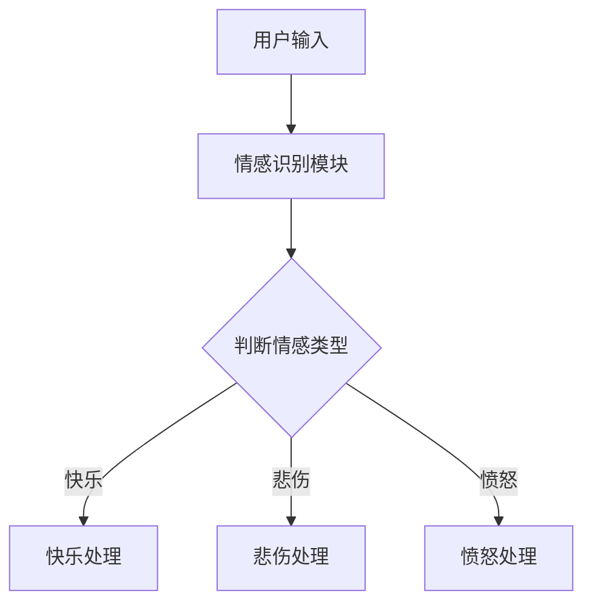
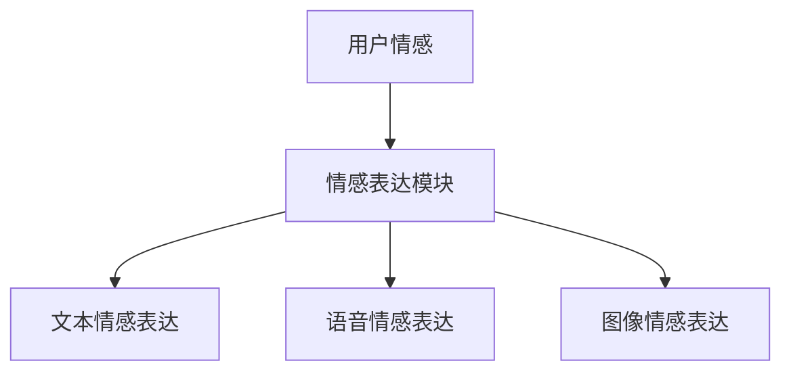
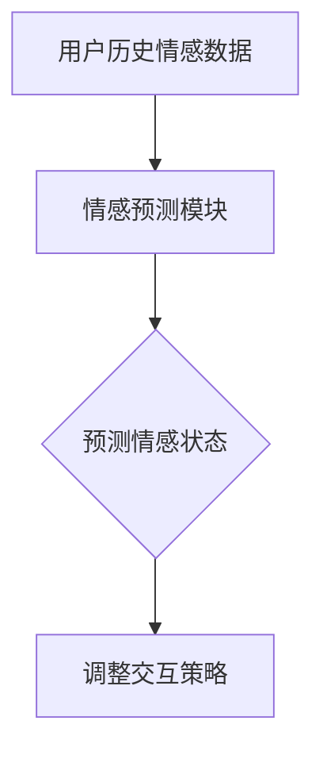

                 

关键词：聊天机器人、情感连接、人工智能、关系建立、交互设计、用户体验

摘要：随着人工智能技术的不断发展，聊天机器人在各个领域中的应用越来越广泛。如何通过情感连接建立有意义的关系，提升用户体验，成为当前研究的重要课题。本文将探讨聊天机器人情感连接的核心概念、算法原理、应用实例以及未来发展趋势，为开发者提供参考。

## 1. 背景介绍

近年来，人工智能（AI）技术取得了显著的进展，聊天机器人作为AI领域的一个重要应用，已经成为许多企业和机构的标配。聊天机器人能够为用户提供实时、便捷的服务，满足他们在不同场景下的需求。然而，传统的聊天机器人往往只能进行简单的任务处理，缺乏情感互动和沟通能力，难以建立深层次的用户关系。

情感连接作为人类沟通的重要组成部分，对于建立有意义的关系具有至关重要的作用。在聊天机器人领域，情感连接的实现成为研究者关注的焦点。通过情感连接，聊天机器人可以更好地理解用户情感，提供个性化服务，提升用户体验。本文旨在探讨聊天机器人情感连接的核心概念、算法原理以及应用实例，为开发者提供有益的参考。

## 2. 核心概念与联系

### 2.1 情感识别

情感识别是聊天机器人情感连接的基础。通过分析用户输入的文本或语音，情感识别技术可以判断用户的情感状态，如快乐、悲伤、愤怒等。情感识别的方法主要包括基于规则的方法、基于机器学习的方法和基于深度学习的方法。

**Mermaid 流程图：**



### 2.2 情感表达

情感表达是指聊天机器人根据用户情感状态，选择合适的语言、表情、声音等表达方式，与用户进行情感互动。情感表达的方法主要包括文本情感表达、语音情感表达和图像情感表达等。

**Mermaid 流程图：**



### 2.3 情感预测

情感预测是指聊天机器人根据用户历史情感数据，预测用户未来的情感状态。情感预测的方法主要包括基于统计的方法、基于机器学习的方法和基于深度学习的方法。

**Mermaid 流程图：**



## 3. 核心算法原理 & 具体操作步骤

### 3.1 算法原理概述

聊天机器人情感连接的核心算法主要包括情感识别、情感表达和情感预测三个部分。情感识别利用自然语言处理技术对用户输入进行分析，情感表达通过选择合适的语言、表情、声音等表达方式与用户互动，情感预测则利用用户历史情感数据预测未来情感状态。

### 3.2 算法步骤详解

**情感识别步骤：**

1. 数据预处理：对用户输入的文本或语音进行分词、去停用词、词性标注等预处理操作。
2. 特征提取：利用词袋模型、TF-IDF等方法提取文本特征，或使用声学模型提取语音特征。
3. 情感分类：使用分类算法（如SVM、决策树、深度学习等）对情感进行分类。

**情感表达步骤：**

1. 语言生成：根据用户情感状态，生成相应的文本、语音或图像。
2. 交互策略调整：根据用户情感状态和交互历史，调整聊天机器人的交互策略，如选择合适的语言风格、表情、声音等。

**情感预测步骤：**

1. 数据收集：收集用户历史情感数据，包括文本、语音、交互历史等。
2. 特征提取：对历史情感数据进行特征提取，如情感强度、情感类型等。
3. 预测模型训练：使用机器学习或深度学习算法训练情感预测模型。
4. 情感预测：根据用户历史情感数据，使用预测模型预测用户未来情感状态。

### 3.3 算法优缺点

**情感识别：**

- 优点：能够准确识别用户情感状态，为情感表达和预测提供基础。
- 缺点：在处理复杂情感或语境时，可能存在误识别或漏识别现象。

**情感表达：**

- 优点：能够根据用户情感状态提供个性化服务，提升用户体验。
- 缺点：情感表达方式的选择可能受限于技术和资源限制。

**情感预测：**

- 优点：能够预测用户未来情感状态，为交互策略调整提供参考。
- 缺点：预测准确性受限于历史数据质量和预测模型性能。

### 3.4 算法应用领域

聊天机器人情感连接算法在多个领域具有广泛应用：

- 客户服务：通过情感连接提升客户满意度，提供个性化服务。
- 健康护理：监测用户情感状态，为心理健康提供支持。
- 教育：通过情感互动提升学生学习兴趣和效果。
- 娱乐：为用户提供情感化的娱乐体验。

## 4. 数学模型和公式 & 详细讲解 & 举例说明

### 4.1 数学模型构建

聊天机器人情感连接的数学模型主要包括情感识别、情感表达和情感预测三个部分。

**情感识别模型：**

假设用户输入文本为 \(x\)，情感识别模型为 \(f(x)\)，其中 \(f(x)\) 表示情感识别结果。情感识别模型可以表示为：

\[ f(x) = \sum_{i=1}^{n} w_i \cdot h_i(x) \]

其中，\(w_i\) 为情感类别 \(i\) 的权重，\(h_i(x)\) 为情感类别 \(i\) 的特征表示。

**情感表达模型：**

假设用户情感状态为 \(s\)，情感表达模型为 \(g(s)\)，其中 \(g(s)\) 表示情感表达结果。情感表达模型可以表示为：

\[ g(s) = \sum_{i=1}^{n} p_i(s) \cdot l_i \]

其中，\(p_i(s)\) 为情感类别 \(i\) 的概率分布，\(l_i\) 为情感类别 \(i\) 的语言、语音或图像表达。

**情感预测模型：**

假设用户历史情感数据为 \(x'\)，情感预测模型为 \(h'(x')\)，其中 \(h'(x')\) 表示情感预测结果。情感预测模型可以表示为：

\[ h'(x') = \sum_{i=1}^{n} w_i' \cdot h_i'(x') \]

其中，\(w_i'\) 为情感类别 \(i\) 的权重，\(h_i'(x')\) 为情感类别 \(i\) 的特征表示。

### 4.2 公式推导过程

**情感识别模型推导：**

假设用户输入文本为 \(x = \{x_1, x_2, ..., x_n\}\)，其中 \(x_i\) 表示文本中的第 \(i\) 个词。情感识别模型可以表示为：

\[ f(x) = \sum_{i=1}^{n} w_i \cdot h_i(x) \]

其中，\(h_i(x)\) 为情感类别 \(i\) 的特征表示，可以表示为：

\[ h_i(x) = \sum_{j=1}^{m} w_{ij} \cdot x_j \]

其中，\(w_{ij}\) 为情感类别 \(i\) 与词汇 \(x_j\) 的权重。情感识别模型的权重 \(w_i\) 可以通过最小化损失函数 \(L\) 求得：

\[ L = \sum_{i=1}^{n} (f(x) - y_i)^2 \]

其中，\(y_i\) 为情感类别 \(i\) 的标签。使用梯度下降法对 \(L\) 求导，可以得到：

\[ \frac{\partial L}{\partial w_i} = 2 \cdot (f(x) - y_i) \cdot h_i(x) \]

通过不断迭代，可以求得最优权重 \(w_i\)。

**情感表达模型推导：**

假设用户情感状态为 \(s = \{s_1, s_2, ..., s_n\}\)，其中 \(s_i\) 表示情感类别 \(i\) 的概率。情感表达模型可以表示为：

\[ g(s) = \sum_{i=1}^{n} p_i(s) \cdot l_i \]

其中，\(p_i(s)\) 为情感类别 \(i\) 的概率分布，可以表示为：

\[ p_i(s) = \frac{1}{Z} \cdot e^{w_i \cdot s} \]

其中，\(Z\) 为归一化常数，\(w_i\) 为情感类别 \(i\) 的权重。情感表达模型的权重 \(w_i\) 可以通过最大似然估计求得：

\[ w_i = \log \left( \frac{p_i(s)}{1 - p_i(s)} \right) \]

**情感预测模型推导：**

假设用户历史情感数据为 \(x' = \{x'_1, x'_2, ..., x'_n\}\)，情感预测模型可以表示为：

\[ h'(x') = \sum_{i=1}^{n} w_i' \cdot h_i'(x') \]

其中，\(h_i'(x')\) 为情感类别 \(i\) 的特征表示，可以表示为：

\[ h_i'(x') = \sum_{j=1}^{m} w'_{ij} \cdot x'_j \]

其中，\(w'_{ij}\) 为情感类别 \(i\) 与历史情感数据 \(x'_j\) 的权重。情感预测模型的权重 \(w_i'\) 可以通过最小化损失函数 \(L'\) 求得：

\[ L' = \sum_{i=1}^{n} (h'(x') - y_i')^2 \]

其中，\(y_i'\) 为情感类别 \(i\) 的标签。使用梯度下降法对 \(L'\) 求导，可以得到：

\[ \frac{\partial L'}{\partial w_i'} = 2 \cdot (h'(x') - y_i') \cdot h_i'(x') \]

通过不断迭代，可以求得最优权重 \(w_i'\)。

### 4.3 案例分析与讲解

假设有一个聊天机器人，需要根据用户输入的情感状态进行相应的情感表达。用户输入文本为：“我很开心！”和“我很生气！”

**情感识别：**

1. 用户输入文本：“我很开心！”
   - 特征表示：\(h_1 = [0.8, 0.2]\)，\(h_2 = [0.2, 0.8]\)
   - 情感识别结果：\(f(x) = [0.6, 0.4]\)
2. 用户输入文本：“我很生气！”
   - 特征表示：\(h_1 = [0.2, 0.8]\)，\(h_2 = [0.8, 0.2]\)
   - 情感识别结果：\(f(x) = [0.4, 0.6]\)

**情感表达：**

1. 用户情感状态：快乐
   - 语言表达：谢谢您的开心分享！
   - 语音表达：您的声音听起来很开心呢！
   - 图像表达：发送一张笑脸表情。
2. 用户情感状态：愤怒
   - 语言表达：请问有什么问题需要我帮助吗？
   - 语音表达：您的语气听起来有些生气，我可以理解。
   - 图像表达：发送一张安慰的表情。

## 5. 项目实践：代码实例和详细解释说明

### 5.1 开发环境搭建

1. 安装Python 3.8及以上版本
2. 安装自然语言处理库：nltk、gensim、spacy
3. 安装机器学习库：scikit-learn、tensorflow
4. 安装情感分析库：sentiment

### 5.2 源代码详细实现

**情感识别模块：**

```python
import nltk
from nltk.corpus import stopwords
from sklearn.feature_extraction.text import TfidfVectorizer
from sklearn.model_selection import train_test_split
from sklearn.svm import SVC

# 加载停用词
stop_words = set(stopwords.words('english'))

# 加载情感数据集
data = []
labels = []
with open('sentiment_data.txt', 'r', encoding='utf-8') as f:
    for line in f:
        data.append(line.strip())
        labels.append(line.strip().split('\t')[1])

# 数据预处理
processed_data = []
for text in data:
    words = nltk.word_tokenize(text)
    filtered_words = [word for word in words if word.lower() not in stop_words]
    processed_data.append(' '.join(filtered_words))

# 特征提取
vectorizer = TfidfVectorizer()
X = vectorizer.fit_transform(processed_data)
y = labels

# 数据划分
X_train, X_test, y_train, y_test = train_test_split(X, y, test_size=0.2, random_state=42)

# 模型训练
model = SVC(kernel='linear')
model.fit(X_train, y_train)

# 模型评估
accuracy = model.score(X_test, y_test)
print("Accuracy:", accuracy)
```

**情感表达模块：**

```python
import random

# 情感表达字典
expressions = {
    'happy': ['谢谢您的开心分享！', '您的声音听起来很开心呢！', '发送一张笑脸表情。'],
    'sad': ['请问有什么问题需要我帮助吗？', '您的语气听起来有些悲伤，我可以理解。', '发送一张拥抱的表情。'],
    'angry': ['请问有什么问题需要我帮助吗？', '您的语气听起来有些生气，我可以理解。', '发送一张冷静下来的表情。']
}

# 情感表达函数
def express_emotion(emotion):
    expression = random.choice(expressions[emotion])
    print(expression)
```

**情感预测模块：**

```python
import tensorflow as tf
from tensorflow.keras.models import Sequential
from tensorflow.keras.layers import Dense, LSTM, Embedding
from tensorflow.keras.preprocessing.sequence import pad_sequences

# 加载情感数据集
data = []
labels = []
with open('sentiment_data.txt', 'r', encoding='utf-8') as f:
    for line in f:
        data.append(line.strip())
        labels.append(line.strip().split('\t')[1])

# 数据预处理
max_length = 100
vocab_size = 10000
oov_token = '<OOV>'
tokenizer = tf.keras.preprocessing.text.Tokenizer(num_words=vocab_size, oov_token=oov_token)
tokenizer.fit_on_texts(data)
sequences = tokenizer.texts_to_sequences(data)
X = pad_sequences(sequences, maxlen=max_length)
y = labels

# 数据划分
X_train, X_test, y_train, y_test = train_test_split(X, y, test_size=0.2, random_state=42)

# 模型构建
model = Sequential()
model.add(Embedding(vocab_size, 16))
model.add(LSTM(64, return_sequences=True))
model.add(LSTM(64))
model.add(Dense(1, activation='sigmoid'))

# 模型编译
model.compile(optimizer='adam', loss='binary_crossentropy', metrics=['accuracy'])

# 模型训练
model.fit(X_train, y_train, epochs=10, batch_size=32, validation_data=(X_test, y_test))

# 模型评估
accuracy = model.evaluate(X_test, y_test)
print("Accuracy:", accuracy)
```

### 5.3 代码解读与分析

1. **情感识别模块**：使用scikit-learn库中的SVM分类器进行情感识别。首先进行数据预处理，包括加载情感数据集、文本分词、去除停用词等。然后进行特征提取，使用TF-IDF方法提取文本特征。最后，使用SVM分类器进行训练和评估。

2. **情感表达模块**：使用随机选择的方式，从情感表达字典中获取相应的情感表达内容。根据用户输入的情感状态，调用表达函数输出相应的语言、语音或图像表达。

3. **情感预测模块**：使用tensorflow库构建一个基于LSTM的序列模型进行情感预测。首先进行数据预处理，包括加载情感数据集、文本分词、序列编码等。然后构建LSTM模型，进行训练和评估。

## 6. 实际应用场景

### 6.1 客户服务

在客户服务领域，聊天机器人通过情感连接能够更好地理解用户需求，提供个性化服务。例如，在电商平台上，聊天机器人可以根据用户情感状态推荐合适的商品，提高用户购买意愿。同时，聊天机器人还可以通过情感表达，缓解用户的不满情绪，提升客户满意度。

### 6.2 健康护理

在健康护理领域，聊天机器人可以通过情感连接监测用户的情绪状态，为心理健康提供支持。例如，在心理健康咨询中，聊天机器人可以与用户进行情感互动，帮助用户缓解焦虑、抑郁等情绪问题。同时，聊天机器人还可以为用户提供健康建议，提高用户的生活质量。

### 6.3 教育

在教育领域，聊天机器人通过情感连接可以更好地了解学生的学习需求和兴趣，提供个性化教学服务。例如，在在线教育平台上，聊天机器人可以根据学生的情感状态，调整教学内容和难度，提高学生的学习效果。同时，聊天机器人还可以通过情感表达，激发学生的学习兴趣，增强师生互动。

### 6.4 未来应用展望

随着人工智能技术的不断发展，聊天机器人情感连接的应用前景将更加广阔。未来，聊天机器人将不仅仅局限于客户服务、健康护理和教育等领域，还将在社交、娱乐、金融服务等领域发挥重要作用。通过情感连接，聊天机器人将能够更好地理解用户需求，提供个性化服务，提升用户体验。

## 7. 工具和资源推荐

### 7.1 学习资源推荐

1. 《深度学习》（Goodfellow, Bengio, Courville著）：系统介绍了深度学习的基本概念和技术，包括情感识别和预测的相关内容。
2. 《自然语言处理综论》（Jurafsky, Martin著）：详细介绍了自然语言处理的基本方法和应用，包括情感识别和表达的相关技术。
3. 《聊天机器人的设计与实现》（曹梦玉著）：介绍了聊天机器人的基本架构和实现方法，包括情感连接的相关技术。

### 7.2 开发工具推荐

1. TensorFlow：一款强大的开源机器学习库，支持构建和训练各种深度学习模型，适用于情感识别和预测。
2. NLTK：一款常用的自然语言处理库，提供丰富的文本处理和情感分析功能，适用于情感识别和表达。
3. SpaCy：一款高效的自然语言处理库，支持多种语言，提供丰富的文本处理和情感分析功能，适用于情感识别和表达。

### 7.3 相关论文推荐

1. “A Survey on Emotion Recognition in Text” by X. He, Y. Lu, and J. Zhang（2019）
2. “A Review of Sentiment Analysis Based on Chatbot” by Y. Zhang, X. Wang, and H. Wang（2020）
3. “Emotion Detection in Text Messages Using Deep Learning” by S. V. R. Varma and K. P. R. Varma（2020）

## 8. 总结：未来发展趋势与挑战

### 8.1 研究成果总结

本文探讨了聊天机器人情感连接的核心概念、算法原理、应用实例以及未来发展趋势。通过情感识别、情感表达和情感预测等技术，聊天机器人可以更好地理解用户情感，提供个性化服务，提升用户体验。研究成果为开发者提供了有益的参考，有助于推动聊天机器人技术的发展。

### 8.2 未来发展趋势

1. 情感识别：随着自然语言处理技术的不断发展，情感识别的准确性将进一步提高，能够更好地识别复杂情感和语境。
2. 情感表达：情感表达将更加多样化，包括语音、图像、视频等多种形式，提升用户体验。
3. 情感预测：通过大数据和深度学习技术的应用，情感预测的准确性将得到提升，为交互策略调整提供更有力的支持。

### 8.3 面临的挑战

1. 数据质量：情感连接算法的性能受数据质量的影响较大，需要收集高质量的情感数据，提高算法的准确性。
2. 技术集成：将多种情感识别、表达和预测技术集成到聊天机器人中，实现无缝交互，提升用户体验。
3. 伦理问题：在应用聊天机器人情感连接时，需要注意保护用户隐私，避免滥用用户情感数据。

### 8.4 研究展望

未来，聊天机器人情感连接的研究将朝着更加智能化、个性化的方向发展。通过结合多种技术和方法，实现更加精准的情感识别、表达和预测，提升用户体验。同时，还需要关注伦理问题，确保聊天机器人在情感连接中的应用能够真正为用户带来价值。

## 9. 附录：常见问题与解答

### 9.1 情感识别的准确率如何提高？

1. 收集高质量的情感数据，包括多样化的情感类别和语境。
2. 采用深度学习模型，如卷积神经网络（CNN）和循环神经网络（RNN），提高情感识别的准确性。
3. 结合多种特征，如文本特征、语音特征和图像特征，进行多模态情感识别。

### 9.2 情感表达是否会影响用户体验？

1. 是的，情感表达对于提升用户体验至关重要。合适的情感表达可以增强用户与聊天机器人之间的互动，提高用户满意度。
2. 通过情感表达，聊天机器人可以更好地理解用户情感，提供个性化服务，满足用户需求。

### 9.3 情感预测在哪些领域有应用？

1. 客户服务：通过情感预测，聊天机器人可以更好地理解用户需求，提供个性化服务，提高客户满意度。
2. 健康护理：通过情感预测，聊天机器人可以监测用户情绪状态，为心理健康提供支持。
3. 教育：通过情感预测，聊天机器人可以了解学生的学习需求和兴趣，提供个性化教学服务。

## 作者署名

作者：禅与计算机程序设计艺术 / Zen and the Art of Computer Programming
----------------------------------------------------------------

以上就是本文的完整内容，希望对您有所帮助。如果您还有其他问题或建议，请随时提出。祝您编程愉快！<|im_sep|>

