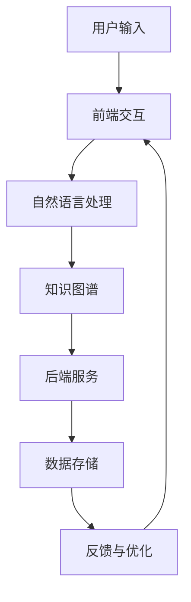

                 

关键词：聊天机器人、用户体验、技术架构、核心算法、数学模型、代码实例、应用场景、未来展望。

## 摘要

随着人工智能技术的快速发展，聊天机器人已经成为提高用户体验的重要工具。本文旨在探讨如何通过优化聊天机器人的技术架构、核心算法、数学模型以及代码实例，来全面提升用户的互动体验。我们将从背景介绍、核心概念与联系、核心算法原理、数学模型与公式、项目实践、实际应用场景、工具和资源推荐以及未来发展趋势与挑战等多个方面，深入分析并总结聊天机器人的应用与创新。

## 1. 背景介绍

在互联网时代，用户体验（User Experience, UX）成为产品成功与否的关键因素。聊天机器人的出现，不仅能够24小时不间断地提供服务，还能根据用户的反馈进行自我学习和优化，从而极大地提升用户满意度。从早期的规则引擎到现代的深度学习模型，聊天机器人的技术不断发展，使得它们在客服、教育、电商等多个领域得到广泛应用。

然而，虽然聊天机器人具备许多优点，但在用户体验方面仍存在许多不足。例如，响应速度慢、理解能力有限、交互体验差等问题。这些问题不仅影响了用户的使用体验，还限制了聊天机器人的应用范围。因此，如何通过技术手段提升聊天机器人的用户体验，成为当前研究的热点。

## 2. 核心概念与联系

### 2.1 聊天机器人技术架构

一个高效的聊天机器人技术架构应包括以下几个关键部分：

- **前端交互**：负责与用户进行交互，包括文本输入、语音输入、语音输出等。
- **后端服务**：负责处理用户的请求，包括自然语言处理、知识图谱、推荐系统等。
- **数据存储**：负责存储用户数据、聊天记录、模型参数等。

下面是一个简化的聊天机器人技术架构的 Mermaid 流程图：



### 2.2 核心概念

- **自然语言处理（NLP）**：用于理解用户输入的文本，并生成合理的响应。
- **知识图谱**：用于存储和检索与特定主题相关的信息，以便更好地理解用户的意图。
- **推荐系统**：根据用户的历史行为和偏好，为用户提供个性化的推荐。

### 2.3 聊天机器人与用户体验的联系

用户体验是聊天机器人的核心价值所在。一个优秀的聊天机器人应具备以下几个特点：

- **响应速度**：快速响应用户的输入，减少用户的等待时间。
- **理解能力**：能够正确理解用户的意图，并提供相关帮助。
- **交互体验**：能够模拟人类对话，让用户感觉舒适和愉悦。
- **自我优化**：能够根据用户的反馈进行自我学习和优化，不断提升用户体验。

## 3. 核心算法原理 & 具体操作步骤

### 3.1 算法原理概述

聊天机器人的核心算法主要包括自然语言处理（NLP）算法、机器学习算法和深度学习算法。以下是这些算法的基本原理：

- **自然语言处理（NLP）算法**：包括分词、词性标注、句法分析等，用于理解用户输入的文本。
- **机器学习算法**：包括决策树、支持向量机、随机森林等，用于生成合理的响应。
- **深度学习算法**：包括卷积神经网络（CNN）、循环神经网络（RNN）、长短时记忆网络（LSTM）等，用于模拟人类对话。

### 3.2 算法步骤详解

1. **用户输入处理**：接收用户的输入，并进行预处理，如去除标点符号、转换为小写等。
2. **自然语言处理**：对用户输入进行分词、词性标注、句法分析等，以理解用户意图。
3. **意图识别**：根据用户输入和预定义的意图模型，识别用户的意图。
4. **知识图谱查询**：根据用户的意图，查询知识图谱，获取相关信息。
5. **生成响应**：根据用户意图和知识图谱信息，生成合理的响应。
6. **自然语言生成**：将生成的响应转换为自然语言文本，如中文、英文等。
7. **语音合成**：如果需要，将文本转换为语音输出。

### 3.3 算法优缺点

- **自然语言处理（NLP）算法**：优点在于能够处理多种语言和文本形式，缺点在于对复杂语义的理解能力有限。
- **机器学习算法**：优点在于能够自动学习并优化模型，缺点在于对数据依赖性较高，且难以解释。
- **深度学习算法**：优点在于能够处理复杂的非线性问题，缺点在于训练时间较长，且对数据质量要求较高。

### 3.4 算法应用领域

- **客服**：用于自动化处理客户咨询，提高客服效率。
- **教育**：用于提供个性化学习建议和辅导，提高学习效果。
- **电商**：用于推荐商品、解答购物问题，提高用户体验。

## 4. 数学模型和公式 & 详细讲解 & 举例说明

### 4.1 数学模型构建

聊天机器人的数学模型主要包括以下两个方面：

1. **意图识别模型**：用于识别用户的意图，通常采用分类模型，如朴素贝叶斯、支持向量机等。
2. **响应生成模型**：用于生成合理的响应，通常采用生成模型，如循环神经网络（RNN）、长短时记忆网络（LSTM）等。

### 4.2 公式推导过程

以循环神经网络（RNN）为例，其基本公式如下：

$$
h_t = \sigma(W_h \cdot [h_{t-1}, x_t] + b_h)
$$

其中，$h_t$ 表示当前时刻的隐藏状态，$x_t$ 表示当前时刻的输入，$W_h$ 和 $b_h$ 分别为权重和偏置。

### 4.3 案例分析与讲解

以一个简单的聊天机器人为例，说明如何构建和训练一个意图识别模型。

1. **数据准备**：收集用户聊天记录，并进行预处理，如分词、去停用词等。
2. **特征提取**：将预处理后的文本转换为向量表示，如词袋模型、词嵌入等。
3. **模型构建**：采用循环神经网络（RNN）构建意图识别模型，如下所示：

```python
from tensorflow.keras.models import Sequential
from tensorflow.keras.layers import Embedding, SimpleRNN, Dense

model = Sequential()
model.add(Embedding(vocab_size, embedding_dim))
model.add(SimpleRNN(units))
model.add(Dense(num_classes, activation='softmax'))

model.compile(optimizer='adam', loss='categorical_crossentropy', metrics=['accuracy'])
```

4. **模型训练**：使用预处理后的数据训练模型，如下所示：

```python
model.fit(X_train, y_train, epochs=10, batch_size=64)
```

5. **模型评估**：使用测试数据评估模型性能，如下所示：

```python
test_loss, test_acc = model.evaluate(X_test, y_test)
print('Test accuracy:', test_acc)
```

6. **模型应用**：使用训练好的模型对用户输入进行意图识别，如下所示：

```python
input_text = "你好，我想咨询一下产品的售后服务。"
input_vector = preprocess(input_text)
predicted_intent = model.predict(input_vector)
print('Predicted intent:', predicted_intent)
```

## 5. 项目实践：代码实例和详细解释说明

### 5.1 开发环境搭建

1. 安装 Python 环境（推荐版本 3.8 以上）。
2. 安装 TensorFlow 和 Keras 库，可以使用以下命令：

```shell
pip install tensorflow
pip install keras
```

### 5.2 源代码详细实现

以下是一个简单的聊天机器人源代码示例：

```python
import tensorflow as tf
from tensorflow.keras.models import Sequential
from tensorflow.keras.layers import Embedding, SimpleRNN, Dense

# 数据准备
X_train = ... # 用户聊天记录
y_train = ... # 用户意图标签
vocab_size = 10000
embedding_dim = 64
num_classes = 10
units = 128

# 模型构建
model = Sequential()
model.add(Embedding(vocab_size, embedding_dim))
model.add(SimpleRNN(units))
model.add(Dense(num_classes, activation='softmax'))

# 模型编译
model.compile(optimizer='adam', loss='categorical_crossentropy', metrics=['accuracy'])

# 模型训练
model.fit(X_train, y_train, epochs=10, batch_size=64)

# 模型评估
test_loss, test_acc = model.evaluate(X_test, y_test)
print('Test accuracy:', test_acc)

# 模型应用
input_text = "你好，我想咨询一下产品的售后服务。"
input_vector = preprocess(input_text)
predicted_intent = model.predict(input_vector)
print('Predicted intent:', predicted_intent)
```

### 5.3 代码解读与分析

1. **数据准备**：首先需要收集用户聊天记录，并进行预处理，如分词、去停用词等，将其转换为向量表示。
2. **模型构建**：使用循环神经网络（RNN）构建意图识别模型，包括嵌入层、循环层和输出层。
3. **模型编译**：配置模型优化器、损失函数和评价指标。
4. **模型训练**：使用训练数据对模型进行训练，调整模型参数。
5. **模型评估**：使用测试数据评估模型性能。
6. **模型应用**：使用训练好的模型对用户输入进行意图识别，并输出预测结果。

## 6. 实际应用场景

聊天机器人在实际应用中具有广泛的应用场景，以下是一些典型的应用案例：

- **客服**：用于自动化处理客户咨询，提高客服效率，如电商、银行、酒店等行业。
- **教育**：用于提供个性化学习建议和辅导，提高学习效果，如在线教育平台、学习辅导应用等。
- **电商**：用于推荐商品、解答购物问题，提高用户体验，如电商平台、购物应用等。
- **医疗**：用于提供在线咨询、健康评估等服务，提高医疗服务的便捷性和效率。

### 6.1. 客服应用场景

在客服领域，聊天机器人可以自动处理大量的客户咨询，如订单查询、售后服务、产品咨询等。通过优化聊天机器人的算法和交互体验，可以大大提高客服效率，降低企业运营成本。

### 6.2. 教育应用场景

在教育领域，聊天机器人可以为学生提供个性化的学习建议和辅导，如课程推荐、学习进度跟踪、疑难解答等。通过模拟人类教师的交互方式，可以提高学生的学习兴趣和效果。

### 6.3. 电商应用场景

在电商领域，聊天机器人可以实时回答用户关于商品的疑问，提供购物建议，提高用户购物体验。同时，通过分析用户的购买行为和偏好，可以提供个性化的商品推荐，增加销售额。

### 6.4. 未来应用展望

随着人工智能技术的不断发展，聊天机器人的应用场景将更加广泛。未来，聊天机器人可能会在以下几个方面得到进一步的发展：

- **智能化**：通过深度学习和强化学习等技术，聊天机器人将具备更高的智能水平，能够更好地理解用户意图，提供个性化的服务。
- **跨界融合**：聊天机器人将与其他领域的技术（如虚拟现实、增强现实等）进行融合，提供更加丰富的互动体验。
- **情感交互**：通过情感计算和情感识别技术，聊天机器人将能够更好地理解用户的情感状态，提供情感化的交互服务。
- **跨平台应用**：聊天机器人将能够在不同的平台（如手机、电脑、智能家居等）上广泛应用，为用户提供便捷的服务。

## 7. 工具和资源推荐

### 7.1 学习资源推荐

- **《聊天机器人设计与实现》**：一本全面介绍聊天机器人设计和实现的经典教材。
- **《自然语言处理入门》**：一本适合初学者的自然语言处理入门书籍。
- **《深度学习》**：一本系统介绍深度学习理论和实践的权威著作。

### 7.2 开发工具推荐

- **TensorFlow**：一款广泛应用于自然语言处理和深度学习的开源工具。
- **Keras**：一款基于 TensorFlow 的简洁高效的深度学习框架。
- **NLTK**：一款用于自然语言处理的 Python 库。

### 7.3 相关论文推荐

- **《Deep Learning for Chatbots》**：一篇关于深度学习在聊天机器人应用中的经典论文。
- **《A Theoretical Analysis of Recurrent Neural Networks for Sequence Modeli

