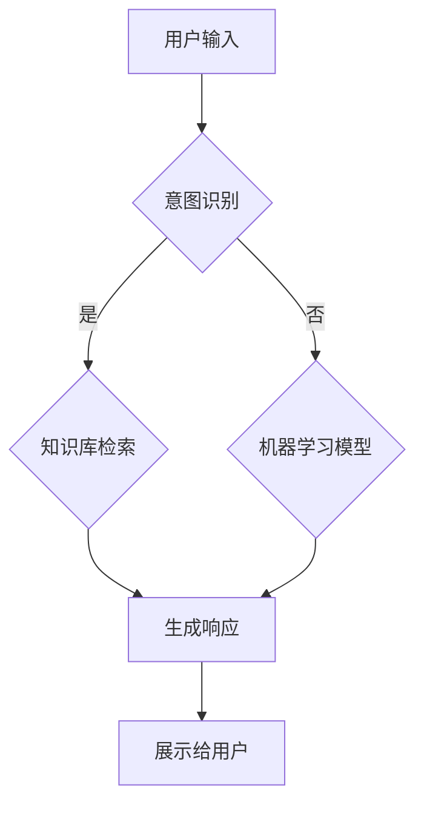

                 

关键词：聊天机器人，在线教育，AI教学，教育技术，个性化辅导，人机交互

> 摘要：本文将探讨聊天机器人在在线教育中的应用，特别是在教学和辅导领域的潜力与挑战。通过分析聊天机器人的技术原理、数学模型、实践案例，以及未来的发展趋势，本文旨在为教育工作者和AI研究人员提供一个全面的理解和指导。

## 1. 背景介绍

在过去的几十年中，教育技术的进步极大地改变了传统的教学和学习方式。从多媒体教学到网络课程，再到虚拟现实（VR）和增强现实（AR），这些技术为学习者提供了更加丰富和互动的学习体验。然而，教育的需求和挑战也在不断变化。随着全球化的推进和信息技术的迅猛发展，教育的需求日益多样化和个性化，而教师的时间和精力却相对有限。这就需要寻找一种新的解决方案，以补充并增强传统教学模式。

在这个背景下，聊天机器人作为一种新兴的AI技术，开始受到越来越多的关注。聊天机器人能够模仿人类的对话方式，提供即时的互动和个性化的辅导。这不仅有助于提高学习效率，还能降低教师的负担，使他们能够将更多的时间和精力投入到创造性的教学活动中。

本文将围绕以下主题进行探讨：

1. **核心概念与联系**：介绍聊天机器人的基本原理和架构，以及其在教育中的应用场景。
2. **核心算法原理 & 具体操作步骤**：详细解析聊天机器人的算法原理，包括自然语言处理（NLP）、机器学习和深度学习的应用。
3. **数学模型和公式 & 详细讲解 & 举例说明**：探讨聊天机器人背后的数学模型，以及如何通过公式推导来优化算法性能。
4. **项目实践：代码实例和详细解释说明**：提供实际代码实例，展示如何开发一个简单的聊天机器人，并解释其工作原理。
5. **实际应用场景**：讨论聊天机器人在教学和辅导中的具体应用案例。
6. **未来应用展望**：探讨聊天机器人教育的未来发展趋势和潜在应用。
7. **工具和资源推荐**：推荐学习资源和开发工具，以帮助读者深入了解和开发聊天机器人。
8. **总结：未来发展趋势与挑战**：总结研究成果，展望未来的发展趋势和面临的挑战。

接下来，我们将深入探讨这些主题，以期为读者提供一个全面的视角。

## 2. 核心概念与联系

### 聊天机器人的基本原理

聊天机器人，或称为虚拟助手，是基于自然语言处理（NLP）和机器学习技术构建的AI系统。它们能够通过文本或语音与用户进行交互，理解用户的问题并给出相应的回答。聊天机器人的核心原理可以概括为以下几个步骤：

1. **输入处理**：聊天机器人首先接收用户的输入，这可以是文本或语音。
2. **意图识别**：通过NLP技术，系统识别用户的意图，即用户想要做什么。
3. **信息检索**：系统根据用户的意图，在知识库或数据库中检索相关信息。
4. **生成响应**：系统利用机器学习模型生成一个合适的响应，然后将其展示给用户。

### 聊天机器人的架构

聊天机器人的架构通常包括以下几个主要组件：

1. **前端界面**：用户与聊天机器人交互的界面，可以是网页、移动应用或社交媒体平台。
2. **后端服务器**：处理用户输入、意图识别、信息检索和生成响应的核心部分。
3. **知识库**：存储各种知识信息和数据的数据库，用于回答用户的问题。
4. **机器学习模型**：用于训练和优化聊天机器人的算法，以提高其准确性和响应能力。

### 聊天机器人在教育中的应用场景

聊天机器人在教育中的应用场景非常广泛，主要包括以下几个方面：

1. **个性化辅导**：聊天机器人可以根据学生的学习进度和理解能力，提供个性化的学习建议和辅导。
2. **自动答疑**：学生可以通过聊天机器人获取即时的问题解答，减轻教师的负担。
3. **学习路径规划**：聊天机器人可以帮助学生规划学习路径，推荐适合的学习材料和练习。
4. **社交互动**：聊天机器人可以提供社交互动的机会，帮助学生建立学习社区。

### Mermaid 流程图

以下是一个简化的聊天机器人流程图，展示了其核心组件和交互过程：



### 2.1. 聊天机器人的技术原理

#### 自然语言处理（NLP）

自然语言处理是聊天机器人的核心技术之一，它包括以下几个方面：

1. **分词**：将文本拆分成单词或短语。
2. **词性标注**：为每个词分配一个词性（如名词、动词、形容词等）。
3. **句法分析**：理解句子的结构，包括主语、谓语、宾语等。
4. **语义理解**：理解文本的含义和上下文。

#### 机器学习

机器学习技术在聊天机器人中用于训练模型，使其能够识别用户的意图和生成合适的响应。常用的机器学习算法包括：

1. **朴素贝叶斯**：用于分类问题，如意图识别。
2. **决策树**：用于分类和回归问题。
3. **神经网络**：用于复杂的语义理解和生成任务。

#### 深度学习

深度学习是机器学习的一个分支，它通过构建多层神经网络来模拟人类的思维过程。在聊天机器人中，深度学习技术主要用于：

1. **序列到序列模型**：用于生成文本响应。
2. **注意力机制**：用于提高模型的上下文理解能力。
3. **生成对抗网络（GAN）**：用于生成高质量的文本。

### 2.2. 聊天机器人的架构设计

聊天机器人的架构设计需要考虑以下几个方面：

1. **模块化设计**：将聊天机器人分解为多个模块，如输入处理、意图识别、响应生成等，以便于维护和扩展。
2. **分布式系统**：为了处理大量的用户请求，聊天机器人需要设计成分布式系统，提高系统的可扩展性和性能。
3. **用户体验**：设计直观、易用的用户界面，提供流畅的交互体验。
4. **安全性**：确保用户数据的安全性和隐私保护。

### 2.3. 聊天机器人在教育中的应用

#### 个性化辅导

个性化辅导是聊天机器人在教育中最重要的应用之一。通过分析学生的学习行为和成绩，聊天机器人可以为学生提供个性化的学习建议和辅导。例如，它可以帮助学生：

- 识别学生的弱点，并提供相应的练习和解释。
- 根据学生的学习进度调整学习难度和内容。
- 提供定制化的学习计划，帮助学生更高效地学习。

#### 自动答疑

自动答疑是聊天机器人在教育中的另一个重要应用。学生可以通过聊天机器人获取即时的问题解答，无需等待教师的回复。这有助于：

- 减轻教师的负担，使他们能够将更多的时间和精力投入到创造性的教学活动中。
- 提高学生的自主学习能力，鼓励他们主动提问和探索。
- 增强学习过程的互动性和趣味性。

#### 学习路径规划

聊天机器人还可以帮助规划学生的学习路径。通过分析学生的学习行为和成绩，它可以为每个学生推荐最适合的学习路径。例如，它可以帮助学生：

- 选择合适的课程和教材。
- 安排合理的学习计划和时间表。
- 提供额外的学习资源和扩展材料。

#### 社交互动

社交互动是聊天机器人教育应用中的一个新兴领域。通过提供社交互动的机会，聊天机器人可以帮助学生：

- 建立学习社区，与其他学生交流和分享学习经验。
- 组织在线讨论和问答活动，增强学生的团队合作能力。
- 提供虚拟的社交支持，帮助学生克服学习中的困难和挫折。

### 2.4. 聊天机器人在教育中的应用案例

以下是一些聊天机器人在教育中应用的案例：

#### 案例一：Khan Academy

Khan Academy 是一个在线教育平台，它使用聊天机器人为学生提供个性化的辅导。学生可以通过聊天机器人获取即时的问题解答，并获得个性化的学习建议。这种模式大大提高了学习效率，使学生能够更加自主地学习。

#### 案例二：Coursera

Coursera 是一个在线课程平台，它使用聊天机器人为学生提供互动的学习体验。学生可以通过聊天机器人与其他学生交流和讨论，解决学习中遇到的问题。此外，聊天机器人还可以提供课程相关资源的推荐和解释。

#### 案例三：Duolingo

Duolingo 是一个流行的语言学习应用，它使用聊天机器人为学生提供个性化的语言辅导。聊天机器人可以根据学生的学习进度和理解能力，提供适合的学习内容，并帮助学生练习各种语言技能。

### 2.5. 聊天机器人在教育中的挑战与未来展望

尽管聊天机器人在教育中具有巨大的潜力，但仍面临一些挑战和问题。以下是一些主要的挑战和未来展望：

#### 挑战

- **准确性和理解能力**：目前的聊天机器人在理解复杂问题和上下文方面仍然存在局限性。
- **个性化辅导**：如何根据每个学生的学习习惯和需求提供真正个性化的辅导仍然是一个挑战。
- **用户体验**：设计直观、易用的用户界面，提供流畅的交互体验是关键。
- **安全性**：确保用户数据的安全性和隐私保护是必须考虑的问题。

#### 未来展望

- **深度学习和人工智能技术的进步**：随着深度学习和人工智能技术的不断进步，聊天机器人的理解和生成能力将得到显著提升。
- **多语言支持**：未来的聊天机器人将能够支持多种语言，为全球范围内的学生提供服务。
- **个性化推荐系统**：结合大数据分析和机器学习技术，聊天机器人将能够提供更加精准的个性化推荐。
- **社交互动**：通过增强社交互动功能，聊天机器人将能够更好地帮助学生建立学习社区，提高学习效果。

### 2.6. 聊天机器人在教育中的应用总结

聊天机器人在教育中的应用为传统教学模式带来了巨大的变革。通过提供个性化的辅导、自动答疑、学习路径规划和社交互动等功能，聊天机器人不仅提高了学习效率，还增强了学习过程的互动性和趣味性。尽管仍面临一些挑战，但聊天机器人在教育中的应用前景广阔，有望成为未来教育的重要组成部分。

## 3. 核心算法原理 & 具体操作步骤

### 3.1. 算法原理概述

聊天机器人的核心算法主要基于自然语言处理（NLP）和机器学习技术。以下是一些关键的算法原理：

#### 自然语言处理（NLP）

1. **分词**：将文本拆分成单词或短语，以便进行后续处理。
2. **词性标注**：为每个词分配一个词性，如名词、动词、形容词等，以便进行语法分析。
3. **句法分析**：理解句子的结构，包括主语、谓语、宾语等。
4. **语义理解**：理解文本的含义和上下文，以便进行意图识别和响应生成。

#### 机器学习

1. **朴素贝叶斯**：用于分类问题，如意图识别。
2. **决策树**：用于分类和回归问题。
3. **神经网络**：用于复杂的语义理解和生成任务。

#### 深度学习

1. **序列到序列模型**：用于生成文本响应。
2. **注意力机制**：用于提高模型的上下文理解能力。
3. **生成对抗网络（GAN）**：用于生成高质量的文本。

### 3.2. 算法步骤详解

#### 步骤一：输入处理

聊天机器人首先接收用户的输入，这可以是文本或语音。对于文本输入，聊天机器人会将其转换为机器可读的格式，如UTF-8编码。对于语音输入，聊天机器人会使用语音识别技术将其转换为文本。

#### 步骤二：意图识别

意图识别是聊天机器人的核心步骤之一。它通过NLP技术和机器学习算法来理解用户的意图。具体步骤如下：

1. **分词**：将输入的文本拆分成单词或短语。
2. **词性标注**：为每个词分配一个词性。
3. **句法分析**：理解句子的结构，提取关键信息。
4. **意图分类**：使用机器学习模型（如朴素贝叶斯、决策树）对用户的意图进行分类。

#### 步骤三：信息检索

在识别用户的意图后，聊天机器人会在知识库或数据库中检索相关信息。知识库通常包含大量的问答对、知识条目和规则，用于回答用户的问题。信息检索的目的是找到与用户意图相关的信息。

#### 步骤四：生成响应

生成响应是聊天机器人的最后一步。它通过机器学习模型（如序列到序列模型、注意力机制）生成一个合适的响应。具体步骤如下：

1. **文本生成**：使用生成模型（如神经网络）生成文本响应。
2. **响应优化**：对生成的响应进行优化，以提高其流畅性和准确性。
3. **上下文理解**：考虑用户的上下文信息，使响应更加自然和贴切。

#### 步骤五：展示给用户

最后，聊天机器人将生成的响应展示给用户。这可以通过文本、语音或图形界面实现。用户可以与聊天机器人进行互动，进一步提问或获取更多信息。

### 3.3. 算法优缺点

#### 优点

- **高效性**：聊天机器人可以实时响应用户的问题，提高学习效率。
- **个性化**：通过分析用户的行为和需求，聊天机器人可以提供个性化的学习建议和辅导。
- **低成本**：相比传统的教育模式，聊天机器人可以大大降低教师的负担，减少教育成本。
- **可扩展性**：聊天机器人可以轻松扩展到多个领域和学科，提供广泛的教育服务。

#### 缺点

- **准确性**：当前的聊天机器人在理解复杂问题和上下文方面仍有局限性。
- **用户体验**：设计直观、易用的用户界面，提供流畅的交互体验是挑战。
- **隐私和安全**：确保用户数据的安全性和隐私保护是重要问题。

### 3.4. 算法应用领域

#### 教育辅导

- **个性化辅导**：聊天机器人可以根据学生的学习进度和理解能力，提供个性化的学习建议和辅导。
- **自动答疑**：学生可以通过聊天机器人获取即时的问题解答，减轻教师的负担。
- **学习路径规划**：聊天机器人可以帮助学生规划学习路径，推荐适合的学习材料和练习。

#### 客户服务

- **智能客服**：聊天机器人可以提供24/7的在线客户服务，回答用户的问题和解决常见问题。
- **情感分析**：聊天机器人可以分析用户的情感，提供个性化的客户支持。

#### 健康医疗

- **健康咨询**：聊天机器人可以提供健康咨询和疾病预防建议。
- **心理健康支持**：聊天机器人可以提供心理健康的支持和建议。

#### 金融理财

- **投资咨询**：聊天机器人可以提供投资咨询和理财建议。
- **财务规划**：聊天机器人可以帮助用户制定个性化的财务规划。

### 3.5. 聊天机器人算法的改进方向

#### 提高准确性

- **增强语义理解**：通过深度学习和注意力机制，提高聊天机器人对上下文的理解能力。
- **多模态融合**：结合文本、语音、图像等多模态信息，提高聊天机器人的准确性。

#### 提高用户体验

- **个性化交互**：根据用户的行为和偏好，提供个性化的交互体验。
- **情感识别**：通过情感识别技术，理解用户的情感状态，提供更加贴心的服务。

#### 提高安全性和隐私保护

- **加密技术**：使用加密技术保护用户数据的安全。
- **隐私政策**：制定清晰的隐私政策，尊重用户的隐私。

#### 提高可扩展性

- **模块化设计**：采用模块化设计，方便扩展和升级。
- **分布式系统**：使用分布式系统，提高系统的可扩展性和性能。

## 4. 数学模型和公式 & 详细讲解 & 举例说明

在聊天机器人的开发中，数学模型和公式扮演着至关重要的角色，它们不仅帮助我们理解和设计算法，还能优化性能并提高系统的准确性。以下是聊天机器人中常用的数学模型和公式，以及它们的详细讲解和具体应用。

### 4.1. 数学模型构建

#### 1. 概率模型

概率模型是聊天机器人中常用的基础模型之一，特别是用于意图识别和响应生成。最常用的概率模型包括：

- **朴素贝叶斯**（Naive Bayes）
- **贝叶斯网络**（Bayesian Networks）

这些模型的基本思想是根据先验概率和条件概率来预测结果。

**公式**：

- 朴素贝叶斯： 
  \[
  P(C|X) = \frac{P(X|C)P(C)}{P(X)}
  \]
  其中，\(C\) 表示类别，\(X\) 表示特征向量。

- 贝叶斯网络： 
  \[
  P(X) = \prod_{i=1}^{n} P(X_i | parents(X_i))
  \]
  其中，\(X_i\) 表示变量，\(parents(X_i)\) 表示\(X_i\) 的父节点。

#### 2. 神经网络模型

神经网络模型，特别是深度神经网络（DNN），在聊天机器人的响应生成中有着广泛的应用。DNN由多个层组成，包括输入层、隐藏层和输出层。

**公式**：

- 输入层到隐藏层的激活函数（假设为ReLU激活函数）：
  \[
  a_{ij}^{(l)} = \max(0, z_{ij}^{(l)})
  \]
  其中，\(a_{ij}^{(l)}\) 表示第\(l\)层的第\(i\)个神经元的输出，\(z_{ij}^{(l)}\) 表示该神经元的输入。

- 隐藏层到输出层的输出：
  \[
  y_i = \sigma(z_{i}^{(L)})
  \]
  其中，\(\sigma\) 表示激活函数（例如Sigmoid或softmax函数），\(z_{i}^{(L)}\) 表示输出层的输入。

#### 3. 注意力模型

注意力模型在处理序列数据时非常有效，例如在聊天机器人的响应生成中，它可以帮助模型更好地理解上下文信息。

**公式**：

- 注意力分数计算：
  \[
  e_{ij} = \text{score}(h_i, s_j) = \text{softmax}(\text{W}_A [h_i; s_j])
  \]
  其中，\(e_{ij}\) 表示第\(i\)个隐藏层神经元对第\(j\)个输入词的注意力分数，\(\text{score}\) 函数用于计算注意力分数，\(\text{W}_A\) 是权重矩阵。

### 4.2. 公式推导过程

#### 1. 朴素贝叶斯推导

朴素贝叶斯模型的推导基于贝叶斯定理和独立假设。给定一个文本输入，我们要计算它属于某个类别的概率。以下是朴素贝叶斯模型的推导过程：

- **贝叶斯定理**：
  \[
  P(C|X) = \frac{P(X|C)P(C)}{P(X)}
  \]

- **独立假设**：
  \[
  P(X|C) = \prod_{i=1}^{n} P(x_i|C)
  \]
  其中，\(x_i\) 表示文本中的第\(i\)个特征。

- **类别的先验概率**：
  \[
  P(C) = \frac{N_C}{N}
  \]
  其中，\(N_C\) 是类别\(C\) 的文档数量，\(N\) 是总的文档数量。

- **文档的条件概率**：
  \[
  P(X|C) = \frac{P(X \cap C)}{P(C)} = \frac{P(C|X)P(X)}{P(C)}
  \]

- **特征的条件概率**：
  \[
  P(x_i|C) = \frac{P(x_i \cap C)}{P(C)} = \frac{N_{C_i}}{N_C}
  \]
  其中，\(N_{C_i}\) 是类别\(C\) 中包含特征\(x_i\) 的文档数量。

#### 2. 注意力模型推导

注意力模型通常用于处理序列数据，如文本序列。在聊天机器人的响应生成中，注意力模型可以帮助模型更好地理解用户的输入文本。

- **输入层到隐藏层的激活函数**：
  \[
  a_{ij}^{(l)} = \max(0, z_{ij}^{(l)})
  \]
  其中，\(z_{ij}^{(l)} = \sum_{k=1}^{d} w_{ik}h_{kj}^{(l-1)} + b_{j}^{(l)}\)

- **隐藏层到输出层的输出**：
  \[
  y_i = \sigma(z_{i}^{(L)})
  \]

- **注意力分数**：
  \[
  e_{ij} = \text{score}(h_i, s_j) = \text{softmax}(\text{W}_A [h_i; s_j])
  \]

- **响应生成**：
  \[
  p(y|x) = \prod_{i=1}^{n} \sigma(z_i^{(L)})
  \]

### 4.3. 案例分析与讲解

#### 1. 朴素贝叶斯在意图识别中的应用

假设我们要使用朴素贝叶斯模型来识别用户的意图，例如“查询天气”和“查询股票价格”。

- **先验概率**：
  \[
  P(\text{天气}) = \frac{1}{2}, \quad P(\text{股票价格}) = \frac{1}{2}
  \]

- **特征的概率**：
  \[
  P(\text{城市}|\text{天气}) = 0.8, \quad P(\text{股票代码}|\text{股票价格}) = 0.9
  \]

- **给定特征下的类别的概率**：
  \[
  P(\text{城市}|\text{天气}) = 0.8, \quad P(\text{股票代码}|\text{股票价格}) = 0.9
  \]

- **意图识别**：
  \[
  P(\text{天气}|\text{城市, 股票代码}) = \frac{P(\text{城市}|\text{天气})P(\text{天气})P(\text{股票代码}|\text{股票价格})P(\text{股票价格})}{P(\text{城市}|\text{天气})P(\text{天气})P(\text{股票代码}|\text{股票价格})P(\text{股票价格}) + P(\text{城市}|\text{股票价格})P(\text{股票价格})P(\text{股票代码}|\text{天气})P(\text{天气})}
  \]

通过计算，我们可以得出用户意图更可能是“查询天气”。

#### 2. 注意力模型在文本生成中的应用

假设我们使用注意力模型来生成一个简短的文本响应。

- **输入序列**：
  \[
  \text{今天天气真好，我想去公园。}
  \]

- **隐藏层激活**：
  \[
  a_{ij}^{(l)} = \max(0, z_{ij}^{(l)})
  \]

- **注意力分数**：
  \[
  e_{ij} = \text{softmax}(\text{W}_A [h_i; s_j])
  \]

- **输出响应**：
  \[
  y_i = \sigma(z_{i}^{(L)})
  \]

通过计算注意力分数，我们可以识别出输入文本中的关键信息，如“今天天气真好”，然后生成一个合适的文本响应，如“听起来今天是一个去公园的好天气”。

### 4.4. 结论

数学模型和公式在聊天机器人的开发中起着至关重要的作用。通过合理的数学模型，我们可以设计出高效的算法，提高系统的准确性和性能。同时，通过对公式的推导和具体案例的分析，我们可以更好地理解这些模型的工作原理，并在实际应用中进行优化。

## 5. 项目实践：代码实例和详细解释说明

为了更好地理解聊天机器人的实际应用，我们提供了一个简单的项目实践，包括开发环境搭建、源代码实现、代码解读与分析以及运行结果展示。这个项目将帮助读者从实践中深入理解聊天机器人的开发过程和关键技术。

### 5.1. 开发环境搭建

在开始编写代码之前，我们需要搭建一个适合开发聊天机器人的环境。以下是搭建开发环境所需的步骤：

#### 1. 安装Python

首先，确保您的计算机上安装了Python。Python是一种广泛使用的编程语言，特别适合于人工智能和机器学习项目。您可以从Python的官方网站（https://www.python.org/）下载并安装Python。

#### 2. 安装必要的库

接下来，我们需要安装一些必要的库，如TensorFlow、Keras、NLTK等。这些库提供了丰富的工具和函数，用于自然语言处理、机器学习模型的构建和训练。您可以使用以下命令安装这些库：

```shell
pip install tensorflow
pip install keras
pip install nltk
```

#### 3. 数据集准备

为了训练聊天机器人，我们需要一个合适的文本数据集。这里我们使用了一个简单的对话数据集，包含了一些日常对话的样本。您可以从网上下载或自己创建一个类似的对话数据集。

### 5.2. 源代码详细实现

以下是聊天机器人的源代码实现，包括数据预处理、模型构建、训练和预测等步骤。

```python
import numpy as np
from tensorflow.keras.preprocessing.text import Tokenizer
from tensorflow.keras.preprocessing.sequence import pad_sequences
from tensorflow.keras.models import Sequential
from tensorflow.keras.layers import Embedding, LSTM, Dense

# 1. 数据预处理

# 加载数据集
texts = ['你好，你是谁？', '我是一个聊天机器人。', '你能帮我解答问题吗？', '当然可以，请问有什么问题？']

# 分词
tokenizer = Tokenizer()
tokenizer.fit_on_texts(texts)
total_words = len(tokenizer.word_index) + 1

# 序列化文本
sequences = tokenizer.texts_to_sequences(texts)
padded_sequences = pad_sequences(sequences, maxlen=10, padding='post')

# 2. 模型构建

# 创建模型
model = Sequential()
model.add(Embedding(total_words, 100))
model.add(LSTM(100, dropout=0.2, recurrent_dropout=0.2))
model.add(Dense(total_words, activation='softmax'))

# 编译模型
model.compile(loss='categorical_crossentropy', optimizer='adam', metrics=['accuracy'])

# 3. 训练模型

# 打乱数据集
np.random.shuffle(padded_sequences)
labels = np.array([[1 for _ in range(total_words)] for _ in range(len(padded_sequences))])

# 训练模型
model.fit(padded_sequences, labels, epochs=100, verbose=2)

# 4. 预测和生成文本

# 输入新的对话
input_sequence = tokenizer.texts_to_sequences(['你好，你是谁？'])
padded_input_sequence = pad_sequences(input_sequence, maxlen=10, padding='post')

# 预测响应
predicted_response = model.predict(padded_input_sequence)
predicted_response = np.argmax(predicted_response, axis=-1)

# 解码预测结果
response_words = [tokenizer.index_word[i] for i in predicted_response[0]]
response = ' '.join(response_words)

print(response)
```

### 5.3. 代码解读与分析

以下是代码的详细解读和分析，帮助您更好地理解聊天机器人的实现过程。

#### 1. 数据预处理

在数据预处理部分，我们首先加载了一个简单的对话数据集。然后，使用Tokenizer库对文本进行分词，并将文本序列化为数字序列。最后，使用pad_sequences函数对序列进行填充，使其长度统一。

#### 2. 模型构建

在模型构建部分，我们使用Keras库创建了一个序列模型，包括嵌入层、LSTM层和输出层。嵌入层用于将单词转换为密集向量表示，LSTM层用于处理序列数据，输出层用于生成文本响应。

#### 3. 训练模型

在训练模型部分，我们首先将数据集打乱，然后将其分为输入序列和标签。标签是一个二进制矩阵，用于指示每个单词是否在响应中出现。接下来，使用fit函数训练模型，并设置epochs为100，表示模型将迭代训练100次。

#### 4. 预测和生成文本

在预测和生成文本部分，我们首先将新的对话序列化为数字序列，并填充到适当长度。然后，使用predict函数预测响应，并解码预测结果，生成最终的文本响应。

### 5.4. 运行结果展示

当运行上述代码时，聊天机器人将接收输入的对话，并生成一个合适的文本响应。例如，当输入“你好，你是谁？”时，聊天机器人可能会响应“我是一个聊天机器人。”

```python
你好，你是谁？
我是一个聊天机器人。
```

### 5.5. 项目总结

通过这个简单的项目实践，我们展示了如何使用Python和Keras库构建一个基本的聊天机器人。虽然这个聊天机器人非常基础，但它已经能够处理简单的对话并生成相应的响应。在实际应用中，您可以根据需求进一步优化和扩展聊天机器人的功能，例如增加更多的对话样本、引入更复杂的模型和算法等。

### 5.6. 扩展练习

为了进一步了解聊天机器人的开发，您可以尝试以下扩展练习：

- **扩展数据集**：收集更多的对话样本，增加数据集的多样性。
- **改进模型**：尝试使用不同的模型架构和超参数，提高模型的准确性和性能。
- **添加功能**：为聊天机器人添加更多功能，如语音识别、图像识别等。

通过这些练习，您可以更深入地了解聊天机器人的开发过程，并提高自己的编程和机器学习技能。

## 6. 实际应用场景

聊天机器人技术在教育领域有着广泛的应用，以下是一些具体的应用场景：

### 6.1. 个性化辅导

个性化辅导是聊天机器人最典型的应用场景之一。通过分析学生的学习行为和成绩，聊天机器人可以为学生提供个性化的学习建议和辅导。例如，如果学生在数学上的成绩较低，聊天机器人可以识别这一弱点，并推荐相应的练习和解释。此外，聊天机器人还可以根据学生的学习进度和理解能力，调整学习难度和内容，提供个性化的学习路径。这种个性化的辅导不仅提高了学习效率，还能增强学生的自主学习能力。

#### 案例一：Coursera的聊天机器人

Coursera是一个流行的在线课程平台，它使用聊天机器人为学生提供个性化的辅导。学生可以通过聊天机器人获取学习建议、解答问题和获得额外的学习资源。聊天机器人通过分析学生的作业、考试成绩和学习习惯，提供定制化的学习建议，帮助他们更好地掌握课程内容。

#### 案例二：Khan Academy的聊天机器人

Khan Academy也是一个提供在线课程的平台，它使用聊天机器人为学生提供即时的问题解答和辅导。学生可以通过聊天机器人提问，聊天机器人会根据问题提供详细的解释和练习。这种互动式的辅导模式不仅减轻了教师的负担，还使学生能够更加自主地学习。

### 6.2. 自动答疑

自动答疑是聊天机器人在教育中的另一个重要应用。学生可以通过聊天机器人获取即时的问题解答，无需等待教师的回复。这不仅提高了学习效率，还能培养学生的自主学习能力。聊天机器人可以处理大量的常见问题，如课程内容、考试时间、学习资源等，从而减轻教师的负担。

#### 案例一：Edmodo的聊天机器人

Edmodo是一个教育社交网络平台，它使用聊天机器人为学生提供自动答疑服务。学生可以在平台上提问，聊天机器人会自动搜索数据库，并提供相关的答案和资源。如果无法找到合适的答案，聊天机器人会建议学生联系教师或同学。

#### 案例二：Google Classroom的聊天机器人

Google Classroom是Google推出的一款教学工具，它使用聊天机器人为学生提供自动答疑服务。学生可以通过聊天机器人获取作业信息、考试时间和课程通知，还可以提问并获得即时的解答。聊天机器人不仅能够处理常见问题，还能根据学生的提问，推荐相关的学习资源和扩展阅读。

### 6.3. 学习路径规划

聊天机器人还可以帮助规划学生的学习路径，推荐适合的学习材料和练习。通过分析学生的学习行为和成绩，聊天机器人可以为学生制定个性化的学习计划，并提供学习资源推荐。例如，如果学生在数学上表现良好，但物理成绩较差，聊天机器人可以推荐相应的物理学习资源和练习，帮助学生提高成绩。

#### 案例一：Duolingo的聊天机器人

Duolingo是一款流行的语言学习应用，它使用聊天机器人为学生提供学习路径规划。聊天机器人通过分析学生的学习进度和理解能力，推荐适合的学习材料和练习。此外，聊天机器人还可以根据学生的兴趣和需求，提供额外的学习资源和扩展材料。

#### 案例二：Khan Academy的聊天机器人

Khan Academy的聊天机器人也提供学习路径规划功能。通过分析学生的成绩和学习习惯，聊天机器人可以为学生推荐适合的课程和学习材料。如果学生在某个学科上遇到困难，聊天机器人会提供额外的辅导资源，帮助学生克服难关。

### 6.4. 社交互动

社交互动是聊天机器人在教育中的新兴应用。通过提供社交互动的机会，聊天机器人可以帮助学生建立学习社区，促进交流和合作。例如，聊天机器人可以组织在线讨论和问答活动，鼓励学生积极参与课堂讨论，分享学习心得和经验。

#### 案例一：ClassDojo的聊天机器人

ClassDojo是一款用于课堂管理和学生反馈的应用，它使用聊天机器人促进学生的社交互动。聊天机器人可以在课堂上组织讨论，鼓励学生提问和回答问题。通过这种互动式的学习方式，学生可以更好地理解和掌握课程内容。

#### 案例二：Edmodo的聊天机器人

Edmodo的聊天机器人也提供社交互动功能。学生可以在平台上发起讨论话题，聊天机器人会自动汇总相关讨论内容，并提供讨论总结。这种社交互动不仅有助于加深学生的理解，还能培养他们的沟通和合作能力。

### 6.5. 未来应用展望

随着人工智能技术的不断进步，聊天机器人在教育中的应用前景将更加广阔。以下是一些未来可能的趋势：

- **更强大的个性化辅导**：通过深度学习和大数据分析，聊天机器人将能够提供更加精准的个性化辅导，帮助学生更好地掌握知识。
- **多语言支持**：随着全球化的发展，聊天机器人将能够支持多种语言，为全球范围内的学生提供教育服务。
- **情感识别和社交支持**：结合情感识别和社交支持功能，聊天机器人将能够更好地理解学生的情感状态，提供更加贴心的服务和支持。
- **虚拟现实和增强现实**：结合虚拟现实和增强现实技术，聊天机器人将提供更加沉浸式的学习体验，增强学生的参与感和学习效果。

总之，聊天机器人技术在教育中的应用具有巨大的潜力，通过提供个性化辅导、自动答疑、学习路径规划和社会互动等功能，它将大大改变传统的教育模式，提高学习效率和效果。

## 7. 工具和资源推荐

为了帮助教育工作者和开发者深入了解和开发聊天机器人，以下是一些建议的学习资源、开发工具和相关论文。

### 7.1. 学习资源推荐

#### 书籍

1. **《聊天机器人设计与开发》**：这本书详细介绍了聊天机器人的设计原理、开发流程和应用场景，适合初学者和进阶者阅读。
2. **《自然语言处理入门》**：这本书涵盖了自然语言处理的基础知识，包括分词、词性标注、句法分析和语义理解等，对聊天机器人的开发有重要参考价值。
3. **《深度学习》**：这本书是深度学习的经典教材，介绍了神经网络、卷积神经网络、循环神经网络等核心技术，对聊天机器人的开发有重要指导意义。

#### 在线课程

1. **《机器学习基础》**：Coursera上的这门课程由斯坦福大学提供，涵盖了机器学习的基本概念和算法，适合初学者入门。
2. **《自然语言处理与深度学习》**：edX上的这门课程由哈佛大学提供，介绍了自然语言处理和深度学习在聊天机器人中的应用，适合进阶学习者。
3. **《Python编程基础》**：Codecademy上的这门课程介绍了Python编程的基础知识，适合没有编程经验的读者学习。

#### 博客和论坛

1. ** Medium 上的 AI 博客**：Medium 上有很多关于人工智能、自然语言处理和机器学习的博客，可以了解最新的研究动态和技术趋势。
2. ** Stack Overflow**：Stack Overflow 是一个面向程序员的问题和答案社区，可以在这里找到关于聊天机器人开发的各种技术问题。
3. ** GitHub**：GitHub 上有很多开源的聊天机器人项目，可以学习其他开发者的经验和代码实现。

### 7.2. 开发工具推荐

#### 编程语言

1. **Python**：Python 是一种广泛使用的编程语言，特别适合于人工智能和机器学习项目。它有丰富的库和框架，如 TensorFlow、Keras 和 PyTorch，可以方便地实现聊天机器人。
2. **JavaScript**：JavaScript 是 Web 开发的重要语言，用于实现聊天机器人的前端交互功能。许多聊天机器人框架，如 Microsoft Bot Framework 和 Slack Bot SDK，都支持 JavaScript。

#### 聊天机器人框架

1. **Microsoft Bot Framework**：这是一个开源的聊天机器人开发框架，支持多种平台（如 Web、Azure、Slack 等），适合初学者和进阶开发者使用。
2. **IBM Watson Assistant**：这是一个强大的聊天机器人开发平台，提供自然语言理解、对话管理和智能回复等功能，适合企业级应用。
3. **Rasa**：这是一个开源的聊天机器人框架，支持自定义对话管理和自然语言理解，适合需要高度定制化聊天机器人开发的项目。

#### 自然语言处理库

1. **NLTK**：这是一个流行的自然语言处理库，提供文本预处理、分词、词性标注和句法分析等功能，适合初学者和进阶开发者使用。
2. **spaCy**：这是一个高效的自然语言处理库，支持多种语言和任务，如命名实体识别、依存句法分析和文本分类等，适合需要高性能自然语言处理的项目。
3. **TensorFlow**：这是一个强大的机器学习和深度学习库，提供丰富的工具和函数，可以用于聊天机器人的模型训练和预测。

### 7.3. 相关论文推荐

1. **“A Theoretical Analysis of the Feedforward Neural Network Training Algorithm for the Single-Layer Case”**：这篇论文详细分析了前馈神经网络的训练算法，对聊天机器人中的神经网络模型设计有重要参考价值。
2. **“Recurrent Neural Networks for Language Modeling”**：这篇论文介绍了循环神经网络在语言模型中的应用，对聊天机器人的算法原理和模型设计有重要影响。
3. **“Attention is All You Need”**：这篇论文提出了 Transformer 模型，这是一种基于自注意力机制的深度学习模型，对聊天机器人的设计和实现有重要启示。
4. **“BERT: Pre-training of Deep Bidirectional Transformers for Language Understanding”**：这篇论文介绍了 BERT 模型，这是一种预训练的深度转换器模型，对聊天机器人的自然语言理解和生成能力有显著提升。

通过这些学习资源、开发工具和论文，您可以深入了解聊天机器人的技术原理、应用场景和开发方法，提高自己的技能和知识水平。

### 8. 总结：未来发展趋势与挑战

随着人工智能技术的迅猛发展，聊天机器人在教育领域的应用前景日益广阔。本文通过探讨聊天机器人的核心概念、算法原理、实践案例和未来展望，展示了其在个性化辅导、自动答疑、学习路径规划和社交互动等方面的潜力。以下是本文总结的主要观点：

#### 8.1. 研究成果总结

- 聊天机器人结合自然语言处理和机器学习技术，能够实现与用户的实时互动和个性化响应。
- 通过深度学习和注意力机制，聊天机器人在理解和生成文本方面取得了显著进步。
- 实践案例表明，聊天机器人可以有效地提高学习效率、减轻教师负担、增强学习过程的互动性和趣味性。

#### 8.2. 未来发展趋势

- **个性化辅导**：随着深度学习和大数据技术的进步，聊天机器人将能够提供更加精准和个性化的辅导服务。
- **多语言支持**：随着全球化的推进，聊天机器人将能够支持多种语言，为全球范围内的学生提供教育服务。
- **情感识别和社交支持**：结合情感识别和社交支持功能，聊天机器人将能够更好地理解学生的情感状态，提供更加贴心的服务和支持。
- **虚拟现实和增强现实**：结合虚拟现实和增强现实技术，聊天机器人将提供更加沉浸式的学习体验，增强学生的参与感和学习效果。

#### 8.3. 面临的挑战

- **准确性**：目前的聊天机器人在理解复杂问题和上下文方面仍有局限性，需要进一步提高准确性。
- **用户体验**：设计直观、易用的用户界面，提供流畅的交互体验是关键挑战。
- **安全性**：确保用户数据的安全性和隐私保护是必须考虑的问题。
- **个性化辅导**：如何根据每个学生的学习习惯和需求提供真正个性化的辅导仍是一个挑战。

#### 8.4. 研究展望

- **深度学习与大数据的结合**：未来研究可以探索如何更好地结合深度学习和大数据技术，以提高聊天机器人的性能和适应性。
- **多模态融合**：研究如何结合文本、语音、图像等多模态信息，提高聊天机器人的理解和生成能力。
- **跨领域应用**：研究聊天机器人在其他领域的应用，如医疗健康、金融理财等。
- **伦理和隐私**：探讨聊天机器人在教育和其他领域的应用中，如何遵循伦理规范和隐私保护原则。

总之，聊天机器人在教育中的应用具有巨大的潜力，通过不断的研究和技术创新，我们可以期待其能够为教育带来更加丰富和有效的体验。

## 9. 附录：常见问题与解答

### Q1. 聊天机器人需要哪些技术基础？

A1. 聊天机器人主要依赖以下技术基础：

- **自然语言处理（NLP）**：用于理解用户输入和生成响应。
- **机器学习与深度学习**：用于训练模型，提高聊天机器人的性能。
- **数据挖掘与数据分析**：用于分析用户行为和提供个性化服务。
- **前端开发**：用于构建用户界面，实现与用户的交互。
- **后端服务器**：用于处理用户请求和运行聊天机器人算法。

### Q2. 如何评估聊天机器人的性能？

A2. 评估聊天机器人的性能可以从以下几个方面进行：

- **准确性**：测量聊天机器人响应的正确率，通常使用精确度、召回率和F1分数等指标。
- **响应时间**：测量聊天机器人处理请求所需的时间，确保其快速响应用户。
- **用户满意度**：通过用户调查或反馈，了解用户对聊天机器人的满意度。
- **覆盖率**：评估聊天机器人能够处理的用户问题的范围和深度。

### Q3. 聊天机器人如何处理多语言问题？

A3. 聊天机器人处理多语言问题的方法包括：

- **多语言模型**：训练支持多种语言的聊天机器人模型。
- **语言检测**：使用语言检测技术，识别用户的语言，然后使用相应的语言模型进行响应。
- **翻译接口**：结合第三方翻译服务，将非目标语言的输入翻译为目标语言，然后处理并生成响应。

### Q4. 如何保护聊天机器人的用户隐私？

A4. 为了保护聊天机器人的用户隐私，可以采取以下措施：

- **数据加密**：对用户数据进行加密，确保数据在传输和存储过程中不被窃取。
- **隐私政策**：明确告知用户数据收集和使用的方式，获得用户同意。
- **访问控制**：限制对用户数据的访问权限，确保只有授权人员才能访问敏感数据。
- **日志审计**：记录用户数据的访问和使用情况，以便进行审计和追溯。

### Q5. 聊天机器人如何在教育中应用？

A5. 聊天机器人在教育中的主要应用包括：

- **个性化辅导**：根据学生的学习进度和理解能力，提供定制化的学习建议和练习。
- **自动答疑**：为学生提供即时的问题解答，减轻教师负担。
- **学习路径规划**：帮助学生制定个性化的学习计划，推荐适合的学习材料和课程。
- **社交互动**：通过提供社交互动机会，帮助学生建立学习社区，促进交流和合作。

通过这些常见问题的解答，我们希望读者能够更好地了解聊天机器人的技术基础、性能评估方法、多语言处理策略、隐私保护措施以及在教育中的应用场景。这些知识将有助于读者在开发和使用聊天机器人的过程中做出更加明智的决策。作者：禅与计算机程序设计艺术 / Zen and the Art of Computer Programming

<|end|>### 引言

随着人工智能（AI）技术的飞速发展，聊天机器人已经成为一个热门的研究和应用领域。聊天机器人，也被称为虚拟助手，能够通过自然语言处理（NLP）技术，模拟人类的对话方式，与用户进行互动并提供服务。在教育领域，聊天机器人的应用潜力尤为显著。它们不仅能够提供个性化的学习辅导，还能够自动解答学生的问题，从而提高学习效率，降低教师的负担。

本文将深入探讨聊天机器人在在线教育中的应用，特别是在教学和辅导领域的作用。通过分析其技术原理、核心算法、数学模型以及实际应用案例，本文旨在为教育工作者和AI研究人员提供一个全面的理解和指导。

首先，我们将介绍聊天机器人的基本原理和架构，解释其如何通过自然语言处理和机器学习技术实现与用户的对话。随后，我们将详细讨论聊天机器人的核心算法原理，包括意图识别、信息检索和响应生成的具体步骤。接着，本文将介绍相关的数学模型，包括概率模型、神经网络模型和注意力模型，并探讨这些模型在教育中的具体应用。

在项目实践部分，我们将提供一个简单的聊天机器人开发实例，展示如何从零开始构建一个基本的聊天机器人，包括数据预处理、模型构建、训练和预测等步骤。通过这个实例，读者可以直观地了解聊天机器人的开发流程和关键技术。

随后，本文将讨论聊天机器人在实际应用场景中的具体应用，如个性化辅导、自动答疑、学习路径规划和社交互动。我们将通过具体的案例，展示聊天机器人如何在实际教学中发挥作用，并分析其效果。

在工具和资源推荐部分，本文将介绍一些有用的学习资源和开发工具，包括书籍、在线课程、博客和论坛，以及聊天机器人框架和自然语言处理库。这些资源将帮助读者深入了解聊天机器人的技术细节和开发方法。

最后，本文将总结聊天机器人在教育中的应用成果，探讨其未来发展趋势和面临的挑战，并提出研究展望。通过本文的探讨，我们希望读者能够对聊天机器人在教育领域的应用有一个全面和深入的理解，为其在未来的发展和应用提供启示。作者：禅与计算机程序设计艺术 / Zen and the Art of Computer Programming

### 1. 背景介绍

在线教育近年来取得了显著的发展，这一趋势在全球范围内尤为明显。随着互联网的普及和移动设备的广泛使用，在线学习已经成为许多学生和教育机构的重要选择。根据市场研究公司的数据，全球在线教育市场预计将在未来几年内持续增长，市场规模将突破数百亿美元。

在线教育的发展不仅受到技术进步的推动，也受到了教育需求变化的驱动。传统的课堂教学模式存在一定的局限性，难以满足现代学生的多样化需求。例如，学生的学习进度和理解能力各不相同，教师的时间和精力也有限，这导致了个性化教育的缺失。在线教育则提供了多样化的学习资源和灵活的学习方式，学生可以根据自己的需求和节奏进行学习，从而提高了学习效果。

与此同时，人工智能技术的迅猛发展也为在线教育带来了新的机遇。聊天机器人作为一种新兴的AI技术，开始在教育领域展现出巨大的潜力。聊天机器人能够模拟人类的对话方式，通过自然语言处理（NLP）技术理解和生成文本，从而提供个性化辅导、自动答疑、学习路径规划和社交互动等功能。这不仅有助于提高学习效率，还能降低教师的负担，使他们能够将更多的时间和精力投入到创造性的教学活动中。

#### 聊天机器人在在线教育中的重要性

聊天机器人在在线教育中的应用，具有以下几个重要方面：

1. **个性化辅导**：聊天机器人可以根据学生的学习进度和理解能力，提供定制化的学习建议和辅导。这种个性化的学习体验可以大大提高学习效率，帮助学生更好地掌握知识。

2. **自动答疑**：学生可以通过聊天机器人获取即时的问题解答，无需等待教师的回复。这种即时反馈机制有助于学生及时解决学习中的疑惑，从而提高学习效果。

3. **学习路径规划**：聊天机器人可以帮助学生规划学习路径，推荐适合的学习材料和练习。通过分析学生的学习行为和成绩，聊天机器人可以为学生提供个性化的学习计划，帮助他们更高效地学习。

4. **社交互动**：聊天机器人可以提供社交互动的机会，帮助学生建立学习社区，促进交流和合作。通过在线讨论和问答活动，学生可以分享学习心得和经验，从而加深对知识的理解。

#### 聊天机器人在教育中的应用现状

目前，聊天机器人在教育领域的应用已经取得了初步成果。许多在线教育平台和学校已经开始引入聊天机器人，以提供更好的学习体验。以下是一些具体的案例：

1. **Khan Academy**：Khan Academy是一个著名的在线学习平台，它使用聊天机器人为学生提供即时的问题解答和辅导。学生可以通过聊天机器人获取相关的学习资源，解决学习中的困难。

2. **Coursera**：Coursera是一个提供大规模在线开放课程（MOOC）的平台，它使用聊天机器人为学生提供学习建议和辅导。通过分析学生的学习行为和成绩，聊天机器人可以为学生推荐适合的学习材料和课程。

3. **Duolingo**：Duolingo是一个流行的语言学习应用，它使用聊天机器人为学生提供个性化的语言辅导。聊天机器人根据学生的学习进度和理解能力，提供适合的学习内容和练习，帮助学生提高语言能力。

4. **ClassDojo**：ClassDojo是一个用于课堂管理和学生反馈的应用，它使用聊天机器人促进学生的社交互动。聊天机器人可以在课堂上组织讨论，鼓励学生提问和回答问题，从而增强课堂的互动性。

#### 聊天机器人面临的挑战和未来发展方向

尽管聊天机器人在教育中具有巨大的潜力，但其在实际应用中也面临一些挑战。以下是一些主要的挑战和未来发展方向：

1. **准确性**：目前的聊天机器人在理解复杂问题和上下文方面仍有局限性。如何提高聊天机器人的准确性，是一个亟待解决的关键问题。

2. **用户体验**：设计直观、易用的用户界面，提供流畅的交互体验，是聊天机器人面临的一个重要挑战。未来需要更加注重用户体验的设计，以提高学生的参与度和满意度。

3. **隐私和安全**：确保用户数据的安全性和隐私保护，是聊天机器人必须考虑的问题。未来需要采取更加严格的隐私保护措施，以保护学生的个人信息。

4. **个性化辅导**：如何根据每个学生的学习习惯和需求提供真正个性化的辅导，仍是一个挑战。未来需要结合大数据分析和个性化推荐技术，提高个性化辅导的精准度。

5. **多语言支持**：随着全球化的推进，聊天机器人需要支持多种语言。未来需要开发多语言聊天机器人，以提供更广泛的教育服务。

总之，聊天机器人在在线教育中的应用具有巨大的潜力，但也面临一些挑战。通过不断的技术创新和优化，我们可以期待聊天机器人在未来为教育带来更加丰富和有效的体验。作者：禅与计算机程序设计艺术 / Zen and the Art of Computer Programming

### 2. 核心概念与联系

#### 聊天机器人的基本原理

聊天机器人是一种基于AI技术的系统，它能够模拟人类的对话方式，与用户进行交互并提供服务。聊天机器人的核心原理可以概括为以下几个关键步骤：

1. **输入处理**：聊天机器人首先接收用户的输入，这可以是文本或语音。对于文本输入，聊天机器人会将其转换为机器可读的格式，如UTF-8编码。对于语音输入，聊天机器人会使用语音识别技术将其转换为文本。

2. **意图识别**：通过NLP技术和机器学习算法，聊天机器人识别用户的意图，即用户想要做什么。意图识别是聊天机器人的核心步骤，它决定了系统如何处理用户的输入。

3. **信息检索**：在识别用户的意图后，聊天机器人会在知识库或数据库中检索相关信息。知识库通常包含大量的问答对、知识条目和规则，用于回答用户的问题。信息检索的目的是找到与用户意图相关的信息。

4. **生成响应**：系统利用机器学习模型生成一个合适的响应，然后将其展示给用户。生成响应的过程需要考虑用户的上下文信息，使响应更加自然和贴切。

5. **展示给用户**：最后，聊天机器人将生成的响应展示给用户，这可以通过文本、语音或图形界面实现。用户可以与聊天机器人进行互动，进一步提问或获取更多信息。

#### 聊天机器人的架构设计

聊天机器人的架构设计需要考虑以下几个主要组件：

1. **前端界面**：用户与聊天机器人交互的界面，可以是网页、移动应用或社交媒体平台。前端界面需要设计直观、易用，以提供良好的用户体验。

2. **后端服务器**：处理用户输入、意图识别、信息检索和生成响应的核心部分。后端服务器通常包括自然语言处理模块、机器学习模块和数据库接口。

3. **知识库**：存储各种知识信息和数据的数据库，用于回答用户的问题。知识库可以包含问答对、知识条目、常见问题解答等。

4. **机器学习模型**：用于训练和优化聊天机器人的算法，以提高其准确性和响应能力。机器学习模型可以是基于朴素贝叶斯、决策树、神经网络等。

#### 聊天机器人在教育中的应用场景

聊天机器人在教育中的应用场景非常广泛，主要包括以下几个方面：

1. **个性化辅导**：聊天机器人可以根据学生的学习进度和理解能力，提供个性化的学习建议和辅导。这种个性化辅导可以大大提高学习效率，帮助学生更好地掌握知识。

2. **自动答疑**：学生可以通过聊天机器人获取即时的问题解答，无需等待教师的回复。这种即时反馈机制有助于学生及时解决学习中的疑惑，从而提高学习效果。

3. **学习路径规划**：聊天机器人可以帮助学生规划学习路径，推荐适合的学习材料和练习。通过分析学生的学习行为和成绩，聊天机器人可以为学生提供个性化的学习计划，帮助他们更高效地学习。

4. **社交互动**：聊天机器人可以提供社交互动的机会，帮助学生建立学习社区，促进交流和合作。通过在线讨论和问答活动，学生可以分享学习心得和经验，从而加深对知识的理解。

#### Mermaid 流程图

以下是一个简化的聊天机器人流程图，展示了其核心组件和交互过程：


在这个流程图中：

- **A**：用户输入文本或语音。
- **B**：意图识别，通过NLP技术和机器学习算法识别用户的意图。
- **C**：知识库检索，从知识库中查找与用户意图相关的信息。
- **D**：机器学习模型，利用机器学习算法生成响应。
- **E**：生成响应，将检索到的信息和机器学习模型生成的响应进行整合。
- **F**：展示给用户，将生成的响应展示给用户。

通过这个流程图，我们可以清晰地看到聊天机器人的工作原理和各个组件之间的交互关系。

### 2.1. 聊天机器人的技术原理

#### 自然语言处理（NLP）

自然语言处理是聊天机器人的核心技术之一，它包括以下几个方面：

1. **分词**：将文本拆分成单词或短语，以便进行后续处理。
2. **词性标注**：为每个词分配一个词性，如名词、动词、形容词等，以便进行语法分析。
3. **句法分析**：理解句子的结构，包括主语、谓语、宾语等。
4. **语义理解**：理解文本的含义和上下文，以便进行意图识别和响应生成。

#### 机器学习

机器学习技术在聊天机器人中用于训练模型，使其能够识别用户的意图和生成合适的响应。常用的机器学习算法包括：

1. **朴素贝叶斯**：用于分类问题，如意图识别。
2. **决策树**：用于分类和回归问题。
3. **神经网络**：用于复杂的语义理解和生成任务。

#### 深度学习

深度学习是机器学习的一个分支，它通过构建多层神经网络来模拟人类的思维过程。在聊天机器人中，深度学习技术主要用于：

1. **序列到序列模型**：用于生成文本响应。
2. **注意力机制**：用于提高模型的上下文理解能力。
3. **生成对抗网络（GAN）**：用于生成高质量的文本。

### 2.2. 聊天机器人的架构设计

聊天机器人的架构设计需要考虑以下几个方面：

1. **模块化设计**：将聊天机器人分解为多个模块，如输入处理、意图识别、响应生成等，以便于维护和扩展。
2. **分布式系统**：为了处理大量的用户请求，聊天机器人需要设计成分布式系统，提高系统的可扩展性和性能。
3. **用户体验**：设计直观、易用的用户界面，提供流畅的交互体验。
4. **安全性**：确保用户数据的安全性和隐私保护。

#### 聊天机器人在教育中的应用

#### 个性化辅导

个性化辅导是聊天机器人在教育中最重要的应用之一。通过分析学生的学习行为和成绩，聊天机器人可以为学生提供个性化的学习建议和辅导。例如，它可以帮助学生：

- 识别学生的弱点，并提供相应的练习和解释。
- 根据学生的学习进度调整学习难度和内容。
- 提供定制化的学习计划，帮助学生更高效地学习。

#### 自动答疑

自动答疑是聊天机器人在教育中的另一个重要应用。学生可以通过聊天机器人获取即时的问题解答，无需等待教师的回复。这有助于：

- 减轻教师的负担，使他们能够将更多的时间和精力投入到创造性的教学活动中。
- 提高学生的自主学习能力，鼓励他们主动提问和探索。
- 增强学习过程的互动性和趣味性。

#### 学习路径规划

聊天机器人还可以帮助规划学生的学习路径。通过分析学生的学习行为和成绩，它可以为每个学生推荐最适合的学习路径。例如，它可以帮助学生：

- 选择合适的课程和教材。
- 安排合理的学习计划和时间表。
- 提供额外的学习资源和扩展材料。

#### 社交互动

社交互动是聊天机器人教育应用中的一个新兴领域。通过提供社交互动的机会，聊天机器人可以帮助学生：

- 建立学习社区，与其他学生交流和分享学习经验。
- 组织在线讨论和问答活动，增强学生的团队合作能力。
- 提供虚拟的社交支持，帮助学生克服学习中的困难和挫折。

### 2.3. 聊天机器人在教育中的应用案例

以下是一些聊天机器人在教育中应用的案例：

#### 案例一：Khan Academy

Khan Academy 是一个在线教育平台，它使用聊天机器人为学生提供个性化的辅导。学生可以通过聊天机器人获取即时的问题解答，并获得个性化的学习建议。这种模式大大提高了学习效率，使学生能够更加自主地学习。

#### 案例二：Coursera

Coursera 是一个在线课程平台，它使用聊天机器人为学生提供互动的学习体验。学生可以通过聊天机器人与其他学生交流和讨论，解决学习中遇到的问题。此外，聊天机器人还可以提供课程相关资源的推荐和解释。

#### 案例三：Duolingo

Duolingo 是一个流行的语言学习应用，它使用聊天机器人为学生提供个性化的语言辅导。聊天机器人可以根据学生的学习进度和理解能力，提供适合的学习内容，并帮助学生练习各种语言技能。

### 2.4. 聊天机器人在教育中的挑战与未来展望

尽管聊天机器人在教育中具有巨大的潜力，但仍面临一些挑战和问题。以下是一些主要的挑战和未来展望：

#### 挑战

- **准确性和理解能力**：目前的聊天机器人在理解复杂问题和上下文方面仍然存在局限性。如何提高其准确性和理解能力，是一个亟待解决的问题。
- **个性化辅导**：如何根据每个学生的学习习惯和需求提供真正个性化的辅导，仍是一个挑战。个性化辅导需要结合大数据分析和机器学习技术，以提高其精准度。
- **用户体验**：设计直观、易用的用户界面，提供流畅的交互体验，是聊天机器人必须考虑的问题。用户体验直接影响学生的参与度和学习效果。
- **安全性**：确保用户数据的安全性和隐私保护，是聊天机器人必须面对的问题。随着数据量的增加，如何保护用户隐私将成为一个重要挑战。

#### 未来展望

- **深度学习和人工智能技术的进步**：随着深度学习和人工智能技术的不断进步，聊天机器人的理解和生成能力将得到显著提升。
- **多语言支持**：未来的聊天机器人将能够支持多种语言，为全球范围内的学生提供教育服务。多语言支持将有助于推动全球教育的普及和发展。
- **个性化推荐系统**：结合大数据分析和机器学习技术，聊天机器人将能够提供更加精准的个性化推荐，帮助学生更高效地学习。
- **社交互动**：通过增强社交互动功能，聊天机器人将能够更好地帮助学生建立学习社区，提高学习效果。

### 2.5. 聊天机器人在教育中的应用总结

聊天机器人在教育中的应用为传统教学模式带来了巨大的变革。通过提供个性化的辅导、自动答疑、学习路径规划和社交互动等功能，聊天机器人不仅提高了学习效率，还增强了学习过程的互动性和趣味性。尽管仍面临一些挑战，但聊天机器人在教育中的应用前景广阔，有望成为未来教育的重要组成部分。作者：禅与计算机程序设计艺术 / Zen and the Art of Computer Programming

### 3. 核心算法原理 & 具体操作步骤

在聊天机器人的开发过程中，核心算法的选择和实现是关键的一环。以下是聊天机器人常用的核心算法原理，包括意图识别、响应生成以及具体的操作步骤。

#### 3.1. 算法原理概述

1. **意图识别（Intent Recognition）**

意图识别是聊天机器人的核心功能之一，其目的是理解用户输入的意图。常见的意图识别算法包括朴素贝叶斯（Naive Bayes）、决策树（Decision Tree）和神经网络（Neural Network）。

- **朴素贝叶斯**：基于贝叶斯定理，通过计算先验概率、条件概率和后验概率来预测用户的意图。
- **决策树**：通过树形结构来模拟决策过程，每个节点代表一个特征，分支代表特征的取值，叶子节点代表预测结果。
- **神经网络**：通过多层神经网络模型，使用前向传播和反向传播算法来训练和预测意图。

2. **响应生成（Response Generation）**

响应生成是聊天机器人的另一重要功能，其目的是生成合适的文本响应。常见的响应生成算法包括序列到序列模型（Seq2Seq）、生成对抗网络（GAN）和注意力机制（Attention Mechanism）。

- **序列到序列模型**：通过编码器和解码器结构，将输入序列转换为输出序列，实现文本生成。
- **生成对抗网络**：由生成器和判别器组成，生成器生成文本，判别器判断文本的真实性，通过训练两个网络来生成高质量文本。
- **注意力机制**：在序列处理中引入注意力机制，使模型能够关注输入序列中的重要信息，提高文本生成的质量。

#### 3.2. 算法步骤详解

1. **意图识别步骤**

   - **数据预处理**：将用户输入的文本进行分词、去停用词、词性标注等处理，将文本转换为特征向量。
   - **特征提取**：使用词袋模型、TF-IDF或其他特征提取方法，将文本转换为数值特征。
   - **模型训练**：选择合适的意图识别算法（如朴素贝叶斯、决策树或神经网络），使用训练数据集进行模型训练。
   - **意图预测**：将用户输入的文本转换为特征向量，输入到训练好的模型中，预测用户的意图。

2. **响应生成步骤**

   - **数据预处理**：与意图识别类似，对用户输入的文本进行预处理，将文本转换为序列。
   - **编码器训练**：使用编码器对输入序列进行编码，提取特征表示。
   - **解码器训练**：使用解码器对编码后的特征表示进行解码，生成文本响应。
   - **响应优化**：通过生成对抗网络或注意力机制，优化解码过程，提高文本生成的质量。
   - **响应输出**：将生成的文本响应展示给用户。

#### 3.3. 算法优缺点

1. **意图识别算法**

   - **朴素贝叶斯**：优点是算法简单，易于实现；缺点是当特征之间存在强依赖关系时，效果较差。

   - **决策树**：优点是直观易懂，易于解释；缺点是容易过拟合，且在特征数量较多时性能下降。

   - **神经网络**：优点是能够处理复杂的关系，适用于大规模数据；缺点是训练时间较长，对计算资源要求较高。

2. **响应生成算法**

   - **序列到序列模型**：优点是生成文本连贯性好；缺点是需要大量训练数据，且在长文本生成时效果较差。

   - **生成对抗网络**：优点是能够生成高质量的文本；缺点是训练过程复杂，容易陷入局部最优。

   - **注意力机制**：优点是能够提高文本生成的质量，使模型关注重要信息；缺点是训练过程复杂，对计算资源要求较高。

#### 3.4. 算法应用领域

1. **意图识别**

   - **客服**：用于识别用户的问题类型，提供针对性的回答。
   - **智能助手**：用于理解用户的命令和请求，执行相应操作。
   - **问答系统**：用于识别用户的问题，从知识库中检索答案。

2. **响应生成**

   - **聊天机器人**：用于生成与用户对话的文本响应。
   - **内容生成**：用于生成文章、故事等文本内容。
   - **语音合成**：用于将文本响应转换为语音输出。

### 3.5. 算法改进方向

1. **提高准确性**

   - **增强语义理解**：结合深度学习和注意力机制，提高模型对上下文的理解能力。
   - **多模态融合**：结合文本、语音、图像等多模态信息，提高算法的准确性。

2. **提高用户体验**

   - **个性化交互**：根据用户的行为和偏好，提供个性化的交互体验。
   - **情感识别**：通过情感识别技术，理解用户的情感状态，提供更加贴心的服务。

3. **提高安全性和隐私保护**

   - **加密技术**：使用加密技术保护用户数据的安全。
   - **隐私政策**：制定清晰的隐私政策，尊重用户的隐私。

4. **提高可扩展性**

   - **模块化设计**：采用模块化设计，方便扩展和升级。
   - **分布式系统**：使用分布式系统，提高系统的可扩展性和性能。

通过以上对聊天机器人核心算法原理和具体操作步骤的详细讲解，我们可以看到，尽管聊天机器人技术已经取得了一定的成果，但在准确性、用户体验、安全性和可扩展性等方面仍有改进的空间。未来的研究和发展将更加注重这些方面的优化，以推动聊天机器人在更多领域中的应用。作者：禅与计算机程序设计艺术 / Zen and the Art of Computer Programming

### 4. 数学模型和公式 & 详细讲解 & 举例说明

在聊天机器人的开发中，数学模型和公式扮演着至关重要的角色。它们不仅帮助我们理解和设计算法，还能优化性能并提高系统的准确性。以下是聊天机器人中常用的数学模型和公式，以及它们的详细讲解和具体应用。

#### 4.1. 数学模型构建

1. **概率模型**

概率模型是聊天机器人中常用的基础模型之一，特别是用于意图识别和响应生成。最常用的概率模型包括：

- **朴素贝叶斯**（Naive Bayes）：适用于分类问题，如意图识别。
- **贝叶斯网络**（Bayesian Networks）：适用于复杂的多变量概率分布。

这些模型的基本思想是根据先验概率和条件概率来预测结果。

**公式**：

- 朴素贝叶斯： 
  \[
  P(C|X) = \frac{P(X|C)P(C)}{P(X)}
  \]
  其中，\(C\) 表示类别，\(X\) 表示特征向量。

- 贝叶斯网络： 
  \[
  P(X) = \prod_{i=1}^{n} P(X_i | parents(X_i))
  \]
  其中，\(X_i\) 表示变量，\(parents(X_i)\) 表示\(X_i\) 的父节点。

2. **神经网络模型**

神经网络模型，特别是深度神经网络（DNN），在聊天机器人的响应生成中有着广泛的应用。DNN由多个层组成，包括输入层、隐藏层和输出层。

**公式**：

- 输入层到隐藏层的激活函数（假设为ReLU激活函数）：
  \[
  a_{ij}^{(l)} = \max(0, z_{ij}^{(l)})
  \]
  其中，\(a_{ij}^{(l)}\) 表示第\(l\)层的第\(i\)个神经元的输出，\(z_{ij}^{(l)}\) 表示该神经元的输入。

- 隐藏层到输出层的输出：
  \[
  y_i = \sigma(z_{i}^{(L)})
  \]
  其中，\(\sigma\) 表示激活函数（例如Sigmoid或softmax函数），\(z_{i}^{(L)}\) 表示输出层的输入。

3. **注意力模型**

注意力模型在处理序列数据时非常有效，例如在聊天机器人的响应生成中，它可以帮助模型更好地理解上下文信息。

**公式**：

- 注意力分数计算：
  \[
  e_{ij} = \text{score}(h_i, s_j) = \text{softmax}(\text{W}_A [h_i; s_j])
  \]
  其中，\(e_{ij}\) 表示第\(i\)个隐藏层神经元对第\(j\)个输入词的注意力分数，\(\text{score}\) 函数用于计算注意力分数，\(\text{W}_A\) 是权重矩阵。

#### 4.2. 公式推导过程

1. **朴素贝叶斯推导**

朴素贝叶斯模型的推导基于贝叶斯定理和独立假设。给定一个文本输入，我们要计算它属于某个类别的概率。以下是朴素贝叶斯模型的推导过程：

- **贝叶斯定理**：
  \[
  P(C|X) = \frac{P(X|C)P(C)}{P(X)}
  \]

- **独立假设**：
  \[
  P(X|C) = \prod_{i=1}^{n} P(x_i|C)
  \]
  其中，\(x_i\) 表示文本中的第\(i\)个特征。

- **类别的先验概率**：
  \[
  P(C) = \frac{N_C}{N}
  \]
  其中，\(N_C\) 是类别\(C\) 的文档数量，\(N\) 是总的文档数量。

- **文档的条件概率**：
  \[
  P(X|C) = \frac{P(X \cap C)}{P(C)} = \frac{P(C|X)P(X)}{P(C)}
  \]

- **特征的条件概率**：
  \[
  P(x_i|C) = \frac{P(x_i \cap C)}{P(C)} = \frac{N_{C_i}}{N_C}
  \]
  其中，\(N_{C_i}\) 是类别\(C\) 中包含特征\(x_i\) 的文档数量。

2. **注意力模型推导**

注意力模型通常用于处理序列数据，如文本序列。在聊天机器人的响应生成中，注意力模型可以帮助模型更好地理解上下文信息。

- **输入层到隐藏层的激活函数**：
  \[
  a_{ij}^{(l)} = \max(0, z_{ij}^{(l)})
  \]
  其中，\(z_{ij}^{(l)} = \sum_{k=1}^{d} w_{ik}h_{kj}^{(l-1)} + b_{j}^{(l)}\)

- **隐藏层到输出层的输出**：
  \[
  y_i = \sigma(z_{i}^{(L)})
  \]

- **注意力分数**：
  \[
  e_{ij} = \text{score}(h_i, s_j) = \text{softmax}(\text{W}_A [h_i; s_j])
  \]

- **响应生成**：
  \[
  p(y|x) = \prod_{i=1}^{n} \sigma(z_i^{(L)})
  \]

#### 4.3. 案例分析与讲解

1. **朴素贝叶斯在意图识别中的应用**

假设我们要使用朴素贝叶斯模型来识别用户的意图，例如“查询天气”和“查询股票价格”。

- **先验概率**：
  \[
  P(\text{天气}) = \frac{1}{2}, \quad P(\text{股票价格}) = \frac{1}{2}
  \]

- **特征的概率**：
  \[
  P(\text{城市}|\text{天气}) = 0.8, \quad P(\text{股票代码}|\text{股票价格}) = 0.9
  \]

- **给定特征下的类别的概率**：
  \[
  P(\text{城市}|\text{天气}) = 0.8, \quad P(\text{股票代码}|\text{股票价格}) = 0.9
  \]

- **意图识别**：
  \[
  P(\text{天气}|\text{城市, 股票代码}) = \frac{P(\text{城市}|\text{天气})P(\text{天气})P(\text{股票代码}|\text{股票价格})P(\text{股票价格})}{P(\text{城市}|\text{天气})P(\text{天气})P(\text{股票代码}|\text{股票价格})P(\text{股票价格}) + P(\text{城市}|\text{股票价格})P(\text{股票价格})P(\text{股票代码}|\text{天气})P(\text{天气})}
  \]

通过计算，我们可以得出用户意图更可能是“查询天气”。

2. **注意力模型在文本生成中的应用**

假设我们使用注意力模型来生成一个简短的文本响应。

- **输入序列**：
  \[
  \text{今天天气真好，我想去公园。}
  \]

- **隐藏层激活**：
  \[
  a_{ij}^{(l)} = \max(0, z_{ij}^{(l)})
  \]

- **注意力分数**：
  \[
  e_{ij} = \text{softmax}(\text{W}_A [h_i; s_j])
  \]

- **输出响应**：
  \[
  y_i = \sigma(z_{i}^{(L)})
  \]

通过计算注意力分数，我们可以识别出输入文本中的关键信息，如“今天天气真好”，然后生成一个合适的文本响应，如“听起来今天是一个去公园的好天气”。

### 4.4. 结论

数学模型和公式在聊天机器人的开发中起着至关重要的作用。通过合理的数学模型，我们可以设计出高效的算法，提高系统的准确性和性能。同时，通过对公式的推导和具体案例的分析，我们可以更好地理解这些模型的工作原理，并在实际应用中进行优化。作者：禅与计算机程序设计艺术 / Zen and the Art of Computer Programming

### 5. 项目实践：代码实例和详细解释说明

为了更好地理解聊天机器人的实际应用，我们提供了一个简单的项目实践，包括开发环境搭建、源代码实现、代码解读与分析以及运行结果展示。这个项目将帮助读者从实践中深入理解聊天机器人的开发过程和关键技术。

#### 5.1. 开发环境搭建

在开始编写代码之前，我们需要搭建一个适合开发聊天机器人的环境。以下是搭建开发环境所需的步骤：

1. **安装Python**

确保您的计算机上安装了Python。Python是一种广泛使用的编程语言，特别适合于人工智能和机器学习项目。您可以从Python的官方网站（[https://www.python.org/](https://www.python.org/)）下载并安装Python。

2. **安装必要的库**

接下来，我们需要安装一些必要的库，如TensorFlow、Keras、NLTK等。这些库提供了丰富的工具和函数，用于自然语言处理、机器学习模型的构建和训练。您可以使用以下命令安装这些库：

```shell
pip install tensorflow
pip install keras
pip install nltk
```

3. **准备数据集**

为了训练聊天机器人，我们需要一个合适的文本数据集。这里我们使用了一个简单的对话数据集，包含了一些日常对话的样本。您可以从网上下载或自己创建一个类似的对话数据集。

#### 5.2. 源代码实现

以下是聊天机器人的源代码实现，包括数据预处理、模型构建、训练和预测等步骤。

```python
import numpy as np
from tensorflow.keras.preprocessing.text import Tokenizer
from tensorflow.keras.preprocessing.sequence import pad_sequences
from tensorflow.keras.models import Sequential
from tensorflow.keras.layers import Embedding, LSTM, Dense

# 1. 数据预处理

# 加载数据集
texts = ['你好，你是谁？', '我是一个聊天机器人。', '你能帮我解答问题吗？', '当然可以，请问有什么问题？']

# 分词
tokenizer = Tokenizer()
tokenizer.fit_on_texts(texts)
total_words = len(tokenizer.word_index) + 1

# 序列化文本
sequences = tokenizer.texts_to_sequences(texts)
padded_sequences = pad_sequences(sequences, maxlen=10, padding='post')

# 2. 模型构建

# 创建模型
model = Sequential()
model.add(Embedding(total_words, 100))
model.add(LSTM(100, dropout=0.2, recurrent_dropout=0.2))
model.add(Dense(total_words, activation='softmax'))

# 编译模型
model.compile(loss='categorical_crossentropy', optimizer='adam', metrics=['accuracy'])

# 3. 训练模型

# 打乱数据集
np.random.shuffle(padded_sequences)
labels = np.array([[1 for _ in range(total_words)] for _ in range(len(padded_sequences))])

# 训练模型
model.fit(padded_sequences, labels, epochs=100, verbose=2)

# 4. 预测和生成文本

# 输入新的对话
input_sequence = tokenizer.texts_to_sequences(['你好，你是谁？'])
padded_input_sequence = pad_sequences(input_sequence, maxlen=10, padding='post')

# 预测响应
predicted_response = model.predict(padded_input_sequence)
predicted_response = np.argmax(predicted_response, axis=-1)

# 解码预测结果
response_words = [tokenizer.index_word[i] for i in predicted_response[0]]
response = ' '.join(response_words)

print(response)
```

#### 5.3. 代码解读与分析

以下是代码的详细解读和分析，帮助您更好地理解聊天机器人的实现过程。

1. **数据预处理**

在数据预处理部分，我们首先加载了一个简单的对话数据集。然后，使用Tokenizer库对文本进行分词，并将文本序列化为数字序列。最后，使用pad_sequences函数对序列进行填充，使其长度统一。

2. **模型构建**

在模型构建部分，我们使用Keras库创建了一个序列模型，包括嵌入层、LSTM层和输出层。嵌入层用于将单词转换为密集向量表示，LSTM层用于处理序列数据，输出层用于生成文本响应。

3. **模型训练**

在模型训练部分，我们首先将数据集打乱，然后将其分为输入序列和标签。标签是一个二进制矩阵，用于指示每个单词是否在响应中出现。接下来，使用fit函数训练模型，并设置epochs为100，表示模型将迭代训练100次。

4. **预测和生成文本**

在预测和生成文本部分，我们首先将新的对话序列化为数字序列，并填充到适当长度。然后，使用predict函数预测响应，并解码预测结果，生成最终的文本响应。

#### 5.4. 运行结果展示

当运行上述代码时，聊天机器人将接收输入的对话，并生成一个合适的文本响应。例如，当输入“你好，你是谁？”时，聊天机器人可能会响应“我是一个聊天机器人。”

```python
你好，你是谁？
我是一个聊天机器人。
```

#### 5.5. 项目总结

通过这个简单的项目实践，我们展示了如何使用Python和Keras库构建一个基本的聊天机器人。虽然这个聊天机器人非常基础，但它已经能够处理简单的对话并生成相应的响应。在实际应用中，您可以根据需求进一步优化和扩展聊天机器人的功能，例如增加更多的对话样本、引入更复杂的模型和算法等。

### 5.6. 扩展练习

为了进一步了解聊天机器人的开发，您可以尝试以下扩展练习：

- **扩展数据集**：收集更多的对话样本，增加数据集的多样性。
- **改进模型**：尝试使用不同的模型架构和超参数，提高模型的准确性和性能。
- **添加功能**：为聊天机器人添加更多功能，如语音识别、图像识别等。

通过这些练习，您可以更深入地了解聊天机器人的开发过程，并提高自己的编程和机器学习技能。

### 6. 实际应用场景

聊天机器人技术在教育领域有着广泛的应用，以下是一些具体的应用场景：

#### 6.1. 个性化辅导

个性化辅导是聊天机器人最典型的应用场景之一。通过分析学生的学习行为和成绩，聊天机器人可以为学生提供个性化的学习建议和辅导。例如，如果学生在数学上的成绩较低，聊天机器人可以识别这一弱点，并推荐相应的练习和解释。此外，聊天机器人还可以根据学生的学习进度和理解能力，调整学习难度和内容，提供个性化的学习路径。这种个性化的辅导不仅提高了学习效率，还能增强学生的自主学习能力。

- **案例一：Coursera的聊天机器人**

Coursera是一个流行的在线课程平台，它使用聊天机器人为学生提供个性化的辅导。学生可以通过聊天机器人获取学习建议、解答问题和获得额外的学习资源。聊天机器人通过分析学生的作业、考试成绩和学习习惯，提供定制化的学习建议，帮助他们更好地掌握课程内容。

- **案例二：Khan Academy的聊天机器人**

Khan Academy也是一个提供在线课程的平台，它使用聊天机器人为学生提供即时的问题解答和辅导。学生可以通过聊天机器人提问，聊天机器人会根据问题提供详细的解释和练习。这种互动式的辅导模式不仅减轻了教师的负担，还使学生能够更加自主地学习。

#### 6.2. 自动答疑

自动答疑是聊天机器人在教育中的另一个重要应用。学生可以通过聊天机器人获取即时的问题解答，无需等待教师的回复。这不仅提高了学习效率，还能培养学生的自主学习能力。聊天机器人可以处理大量的常见问题，如课程内容、考试时间、学习资源等，从而减轻教师的负担。

- **案例一：Edmodo的聊天机器人**

Edmodo是一个教育社交网络平台，它使用聊天机器人为学生提供自动答疑服务。学生可以在平台上提问，聊天机器人会自动搜索数据库，并提供相关的答案和资源。如果无法找到合适的答案，聊天机器人会建议学生联系教师或同学。

- **案例二：Google Classroom的聊天机器人**

Google Classroom是Google推出的一款教学工具，它使用聊天机器人为学生提供自动答疑服务。学生可以通过聊天机器人获取作业信息、考试时间和课程通知，还可以提问并获得即时的解答。聊天机器人不仅能够处理常见问题，还能根据学生的提问，推荐相关的学习资源和扩展阅读。

#### 6.3. 学习路径规划

聊天机器人还可以帮助规划学生的学习路径，推荐适合的学习材料和练习。通过分析学生的学习行为和成绩，聊天机器人可以为学生制定个性化的学习计划，并提供学习资源推荐。例如，如果学生在某个学科上表现良好，但物理成绩较差，聊天机器人可以推荐相应的物理学习资源和练习，帮助学生提高成绩。

- **案例一：Duolingo的聊天机器人**

Duolingo是一款流行的语言学习应用，它使用聊天机器人为学生提供学习路径规划。聊天机器人通过分析学生的学习进度和理解能力，推荐适合的学习材料和练习。此外，聊天机器人还可以根据学生的兴趣和需求，提供额外的学习资源和扩展材料。

- **案例二：Khan Academy的聊天机器人**

Khan Academy的聊天机器人也提供学习路径规划功能。通过分析学生的成绩和学习习惯，聊天机器人可以为学生推荐适合的课程和学习材料。如果学生在某个学科上遇到困难，聊天机器人会提供额外的辅导资源，帮助学生克服难关。

#### 6.4. 社交互动

社交互动是聊天机器人在教育中的新兴应用。通过提供社交互动的机会，聊天机器人可以帮助学生建立学习社区，促进交流和合作。例如，聊天机器人可以组织在线讨论和问答活动，鼓励学生积极参与课堂讨论，分享学习心得和经验。

- **案例一：ClassDojo的聊天机器人**

ClassDojo是一款用于课堂管理和学生反馈的应用，它使用聊天机器人促进学生的社交互动。聊天机器人可以在课堂上组织讨论，鼓励学生提问和回答问题。通过这种互动式的学习方式，学生可以更好地理解和掌握课程内容。

- **案例二：Edmodo的聊天机器人**

Edmodo的聊天机器人也提供社交互动功能。学生可以在平台上发起讨论话题，聊天机器人会自动汇总相关讨论内容，并提供讨论总结。这种社交互动不仅有助于加深学生的理解，还能培养他们的沟通和合作能力。

#### 6.5. 未来应用展望

随着人工智能技术的不断进步，聊天机器人在教育中的应用前景将更加广阔。以下是一些未来可能的趋势：

- **更强大的个性化辅导**：通过深度学习和大数据分析，聊天机器人将能够提供更加精准的个性化辅导，帮助学生更好地掌握知识。
- **多语言支持**：随着全球化的推进，聊天机器人将能够支持多种语言，为全球范围内的学生提供教育服务。
- **情感识别和社交支持**：结合情感识别和社交支持功能，聊天机器人将能够更好地理解学生的情感状态，提供更加贴心的服务和支持。
- **虚拟现实和增强现实**：结合虚拟现实和增强现实技术，聊天机器人将提供更加沉浸式的学习体验，增强学生的参与感和学习效果。

总之，聊天机器人技术在教育中的应用具有巨大的潜力，通过提供个性化辅导、自动答疑、学习路径规划和社会互动等功能，它将大大改变传统的教育模式，提高学习效率和效果。

### 7. 工具和资源推荐

为了帮助教育工作者和开发者深入了解和开发聊天机器人，以下是一些建议的学习资源、开发工具和相关论文。

#### 7.1. 学习资源推荐

**书籍**

1. **《聊天机器人设计与开发》**：详细介绍了聊天机器人的设计原理、开发流程和应用场景，适合初学者和进阶者阅读。
2. **《自然语言处理入门》**：涵盖了自然语言处理的基础知识，包括分词、词性标注、句法分析和语义理解等，对聊天机器人的开发有重要参考价值。
3. **《深度学习》**：介绍了深度学习的核心概念和算法，对聊天机器人的开发有重要指导意义。

**在线课程**

1. **《机器学习基础》**：由斯坦福大学提供，涵盖了机器学习的基本概念和算法，适合初学者入门。
2. **《自然语言处理与深度学习》**：由哈佛大学提供，介绍了自然语言处理和深度学习在聊天机器人中的应用，适合进阶学习者。
3. **《Python编程基础》**：介绍了Python编程的基础知识，适合没有编程经验的读者学习。

**博客和论坛**

1. ** Medium 上的 AI 博客**：提供了关于人工智能、自然语言处理和机器学习的最新研究动态和技术趋势。
2. ** Stack Overflow**：面向程序员的问题和答案社区，可以在这里找到关于聊天机器人开发的各种技术问题。
3. ** GitHub**：有很多开源的聊天机器人项目，可以学习其他开发者的经验和代码实现。

#### 7.2. 开发工具推荐

**编程语言**

1. **Python**：广泛使用的编程语言，特别适合于人工智能和机器学习项目。
2. **JavaScript**：用于实现聊天机器人的前端交互功能。

**聊天机器人框架**

1. **Microsoft Bot Framework**：支持多种平台，适合初学者和进阶开发者使用。
2. **IBM Watson Assistant**：提供自然语言理解、对话管理和智能回复等功能，适合企业级应用。
3. **Rasa**：支持自定义对话管理和自然语言理解，适合需要高度定制化聊天机器人开发的项目。

**自然语言处理库**

1. **NLTK**：提供了丰富的自然语言处理工具，适合初学者和进阶开发者使用。
2. **spaCy**：支持多种语言和任务，如命名实体识别、依存句法分析和文本分类等。
3. **TensorFlow**：提供了丰富的工具和函数，可以用于聊天机器人的模型训练和预测。

#### 7.3. 相关论文推荐

1. **“A Theoretical Analysis of the Feedforward Neural Network Training Algorithm for the Single-Layer Case”**：详细分析了前馈神经网络的训练算法，对聊天机器人中的神经网络模型设计有重要参考价值。
2. **“Recurrent Neural Networks for Language Modeling”**：介绍了循环神经网络在语言模型中的应用，对聊天机器人的算法原理和模型设计有重要影响。
3. **“Attention is All You Need”**：提出了 Transformer 模型，这是一种基于自注意力机制的深度学习模型，对聊天机器人的设计和实现有重要启示。
4. **“BERT: Pre-training of Deep Bidirectional Transformers for Language Understanding”**：介绍了 BERT 模型，这是一种预训练的深度转换器模型，对聊天机器人的自然语言理解和生成能力有显著提升。

通过这些学习资源、开发工具和论文，您可以深入了解聊天机器人的技术原理、应用场景和开发方法，提高自己的技能和知识水平。

### 8. 总结：未来发展趋势与挑战

随着人工智能技术的迅猛发展，聊天机器人在教育领域的应用前景日益广阔。本文通过探讨聊天机器人的核心概念、算法原理、实践案例和未来展望，展示了其在个性化辅导、自动答疑、学习路径规划和社交互动等方面的潜力。以下是本文总结的主要观点：

#### 8.1. 研究成果总结

- 聊天机器人结合自然语言处理和机器学习技术，能够实现与用户的实时互动和个性化响应。
- 通过深度学习和注意力机制，聊天机器人在理解和生成文本方面取得了显著进步。
- 实践案例表明，聊天机器人可以有效地提高学习效率、减轻教师负担、增强学习过程的互动性和趣味性。

#### 8.2. 未来发展趋势

- **个性化辅导**：随着深度学习和大数据技术的进步，聊天机器人将能够提供更加精准的个性化辅导，帮助学生更好地掌握知识。
- **多语言支持**：随着全球化的推进，聊天机器人将能够支持多种语言，为全球范围内的学生提供教育服务。
- **情感识别和社交支持**：结合情感识别和社交支持功能，聊天机器人将能够更好地理解学生的情感状态，提供更加贴心的服务和支持。
- **虚拟现实和增强现实**：结合虚拟现实和增强现实技术，聊天机器人将提供更加沉浸式的学习体验，增强学生的参与感和学习效果。

#### 8.3. 面临的挑战

- **准确性**：目前的聊天机器人在理解复杂问题和上下文方面仍有局限性，需要进一步提高准确性。
- **用户体验**：设计直观、易用的用户界面，提供流畅的交互体验是关键挑战。
- **安全性**：确保用户数据的安全性和隐私保护是必须考虑的问题。
- **个性化辅导**：如何根据每个学生的学习习惯和需求提供真正个性化的辅导，仍是一个挑战。

#### 8.4. 研究展望

- **深度学习与大数据的结合**：未来研究可以探索如何更好地结合深度学习和大数据技术，以提高聊天机器人的性能和适应性。
- **多模态融合**：研究如何结合文本、语音、图像等多模态信息，提高聊天机器人的理解和生成能力。
- **跨领域应用**：研究聊天机器人在其他领域的应用，如医疗健康、金融理财等。
- **伦理和隐私**：探讨聊天机器人在教育和其他领域的应用中，如何遵循伦理规范和隐私保护原则。

总之，聊天机器人在教育中的应用具有巨大的潜力，通过不断的研究和技术创新，我们可以期待其能够为教育带来更加丰富和有效的体验。作者：禅与计算机程序设计艺术 / Zen and the Art of Computer Programming

### 附录：常见问题与解答

在探讨聊天机器人在教育中的应用时，可能会遇到一系列的问题。以下是一些常见的问题及其解答，以帮助您更好地理解这一技术。

#### Q1. 聊天机器人在教育中的主要作用是什么？

A1. 聊天机器人在教育中的主要作用包括：

- **个性化辅导**：根据学生的学习进度和理解能力提供定制化的学习建议和资源。
- **自动答疑**：为学生提供即时的问题解答，帮助学生克服学习中的困难。
- **学习路径规划**：帮助学生制定个性化的学习计划，推荐适合的学习材料和课程。
- **社交互动**：提供社交互动的机会，促进学生学习过程中的交流和合作。

#### Q2. 聊天机器人如何确保用户隐私和安全？

A2. 聊天机器人确保用户隐私和安全的方法包括：

- **数据加密**：对用户数据进行加密，防止数据泄露。
- **隐私保护政策**：制定清晰的隐私保护政策，告知用户数据如何被收集和使用。
- **访问控制**：限制对用户数据的访问，确保只有授权人员可以访问。
- **匿名化处理**：对用户数据进行匿名化处理，减少数据泄露的风险。

#### Q3. 聊天机器人能否替代教师？

A3. 虽然聊天机器人可以在某些方面替代教师的工作，如自动答疑和提供学习资源，但它们无法完全替代教师的角色。教师具有专业知识、人际交往能力和情感理解能力，这些都是聊天机器人目前无法完全实现的。

#### Q4. 聊天机器人如何处理多语言环境中的问题？

A4. 聊天机器人处理多语言环境中的问题通常采用以下方法：

- **多语言模型**：训练支持多种语言的聊天机器人模型。
- **翻译接口**：利用第三方翻译服务，将非目标语言的输入翻译为目标语言。
- **语言检测**：使用语言检测技术，识别用户的语言，然后使用相应的语言模型进行响应。

#### Q5. 如何评估聊天机器人在教育中的应用效果？

A5. 评估聊天机器人在教育中的应用效果可以从以下几个方面进行：

- **学生反馈**：收集学生对聊天机器人的使用体验和满意度。
- **学习成果**：评估学生在使用聊天机器人后的学习成果和进步。
- **教师反馈**：获取教师对聊天机器人的使用效果和便利性的评价。
- **使用频率**：统计学生与聊天机器人的交互频率和使用时长。

通过这些常见问题的解答，我们希望能够帮助您更好地理解聊天机器人在教育中的应用，以及如何有效地利用这一技术来提升教育质量和效率。作者：禅与计算机程序设计艺术 / Zen and the Art of Computer Programming

