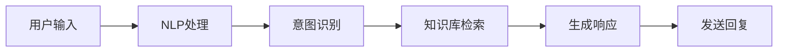

                 

关键词：聊天机器人、人工智能、客户服务、效率提升、技术原理、应用场景、未来展望

> 摘要：随着人工智能技术的不断进步，聊天机器人已成为提升客户服务效率的重要工具。本文将深入探讨聊天机器人的技术原理、应用场景及其在客户服务领域的重要作用，并对未来发展趋势和面临的挑战进行分析。

## 1. 背景介绍

随着互联网的普及和数字化转型的推进，企业对客户服务的需求越来越高。传统的人工客服由于成本高、效率低，已经难以满足快速发展的市场需求。为此，人工智能（AI）技术应运而生，聊天机器人作为一种AI应用，凭借其高效、智能、24/7在线等特点，成为提升客户服务效率的重要手段。

### 1.1 聊天机器人定义

聊天机器人，也称为虚拟助手或虚拟客服，是一种基于自然语言处理（NLP）、机器学习（ML）和对话系统技术的人工智能应用程序。它可以模拟人类对话，自动处理客户的查询和问题，提供即时、个性化的服务。

### 1.2 客户服务效率问题

传统客户服务存在以下几个主要问题：
- **人工成本高**：人工客服需要培训、管理和薪资成本。
- **响应时间长**：人工客服可能因个人原因导致响应时间较长。
- **个性化服务不足**：传统客服难以根据客户历史数据提供个性化服务。
- **多渠道服务难题**：企业需要提供多种渠道（如电话、邮件、在线聊天等）的服务，导致客服资源分散。

### 1.3 AI与聊天机器人的优势

人工智能和聊天机器人的引入，可以显著提升客户服务的效率：
- **自动化处理**：聊天机器人可以自动化处理大量重复性问题，减少人工干预。
- **实时响应**：聊天机器人可以全天候在线，提供即时服务。
- **个性化服务**：通过分析客户历史数据，聊天机器人可以提供更加个性化的服务。
- **成本降低**：聊天机器人可以显著减少企业的人工客服成本。

## 2. 核心概念与联系

### 2.1 人工智能（AI）

人工智能是模拟、延伸和扩展人类智能的理论、方法、技术及应用。在聊天机器人中，AI主要通过机器学习、自然语言处理和对话系统等技术实现。

### 2.2 自然语言处理（NLP）

自然语言处理是人工智能的一个分支，旨在让计算机理解和生成人类语言。在聊天机器人中，NLP用于解析用户的输入、生成响应文本和理解用户意图。

### 2.3 对话系统

对话系统是一种人与机器之间进行交互的接口，它通过模拟人类对话来提供信息和服务。聊天机器人就是对话系统的一种实现。

### 2.4 Mermaid 流程图

以下是一个简单的Mermaid流程图，展示了聊天机器人的核心组件和它们之间的关系。



### 2.5 聊天机器人生命周期

聊天机器人的生命周期主要包括以下阶段：
1. **需求分析**：了解企业需求，确定聊天机器人的目标和功能。
2. **设计与开发**：基于需求进行系统设计，开发聊天机器人。
3. **测试与优化**：进行功能测试、性能测试和用户体验测试，持续优化。
4. **部署与上线**：将聊天机器人部署到线上平台，供用户使用。
5. **运维与更新**：定期维护和更新聊天机器人，确保其稳定运行。

## 3. 核心算法原理 & 具体操作步骤

### 3.1 算法原理概述

聊天机器人的核心算法主要包括自然语言处理（NLP）和对话管理系统（DM）。

#### 3.1.1 自然语言处理（NLP）

NLP的核心任务是让计算机理解和生成人类语言。主要技术包括：

- **词法分析**：将文本拆分为单词或词组。
- **句法分析**：分析句子的结构和语法规则。
- **语义分析**：理解单词和句子的含义。
- **实体识别**：识别文本中的特定实体（如人名、地点、组织等）。
- **情感分析**：分析文本的情感倾向。

#### 3.1.2 对话管理系统（DM）

DM负责管理整个对话过程，包括：

- **意图识别**：确定用户意图。
- **对话流程**：根据意图和上下文生成对话流程。
- **生成响应**：根据对话流程生成合适的响应文本。

### 3.2 算法步骤详解

#### 3.2.1 用户输入处理

1. **接收输入**：聊天机器人接收用户的文本输入。
2. **词法分析**：将输入文本拆分为单词或词组。
3. **句法分析**：分析输入文本的语法结构。
4. **语义分析**：理解输入文本的含义。

#### 3.2.2 意图识别

1. **特征提取**：从输入文本中提取关键特征。
2. **分类模型**：使用分类模型（如神经网络）对意图进行识别。
3. **意图置信度**：计算每个意图的置信度。

#### 3.2.3 知识库检索

1. **知识库构建**：构建包含常见问题和答案的知识库。
2. **检索策略**：根据输入文本和意图，从知识库中检索相关答案。
3. **答案筛选**：筛选出最合适的答案。

#### 3.2.4 生成响应

1. **模板匹配**：根据检索到的答案生成响应文本。
2. **自然语言生成**：使用自然语言生成技术生成更加自然流畅的文本。

#### 3.2.5 发送回复

1. **文本处理**：对生成的响应文本进行格式化、错别字修正等处理。
2. **发送回复**：将处理后的响应文本发送给用户。

### 3.3 算法优缺点

#### 优点

- **高效**：聊天机器人可以同时处理大量用户请求，提高服务效率。
- **智能**：通过自然语言处理和机器学习，聊天机器人可以提供个性化服务。
- **低成本**：相对于人工客服，聊天机器人可以显著降低企业运营成本。

#### 缺点

- **理解能力有限**：虽然聊天机器人已经非常智能，但仍然难以完全理解复杂的人类语言。
- **情绪识别不足**：聊天机器人难以识别和模拟人类的情感。

### 3.4 算法应用领域

聊天机器人的应用领域非常广泛，包括但不限于：

- **客户服务**：提供在线客服、咨询、投诉处理等服务。
- **电商**：提供产品咨询、订单查询、售后服务等。
- **金融**：提供投资咨询、账户查询、信用卡服务等。
- **医疗**：提供健康咨询、症状查询、预约挂号等。
- **教育**：提供在线辅导、课程咨询、考试报名等。

## 4. 数学模型和公式 & 详细讲解 & 举例说明

### 4.1 数学模型构建

聊天机器人的核心数学模型主要包括：

- **词向量模型**：用于将文本转换为向量表示。
- **分类模型**：用于意图识别。
- **序列生成模型**：用于生成响应文本。

#### 4.1.1 词向量模型

词向量模型是一种将单词映射为高维空间中向量的方法。常用的词向量模型包括Word2Vec、GloVe等。以下是Word2Vec模型的数学公式：

$$
\text{vec}(w) = \sum_{j=1}^{N} \alpha_{ij} v_j
$$

其中，$w$ 表示单词，$vec(w)$ 表示单词的向量表示，$v_j$ 表示单词 $j$ 的词向量，$\alpha_{ij}$ 表示单词 $i$ 和单词 $j$ 之间的相似度。

#### 4.1.2 分类模型

分类模型用于意图识别。常用的分类模型包括SVM、决策树、神经网络等。以下是SVM分类模型的数学公式：

$$
\text{max} \ \frac{1}{\lambda} \ \sum_{i=1}^{N} y_i (\text{w} \cdot \text{x}_i) - \text{w} \cdot \text{w}
$$

其中，$w$ 表示模型参数，$x_i$ 表示输入特征向量，$y_i$ 表示标签，$\lambda$ 表示惩罚参数。

#### 4.1.3 序列生成模型

序列生成模型用于生成响应文本。常用的序列生成模型包括RNN、LSTM、Transformer等。以下是Transformer模型的数学公式：

$$
\text{softmax}(\text{W}_\text{softmax} \ \text{Attention}( \text{W}_\text{Q} \ \text{x}, \text{W}_\text{K} \ \text{x}, \text{W}_\text{V} \ \text{x}) + \text{b}_\text{softmax})
$$

其中，$x$ 表示输入序列，$W_{Q}$、$W_{K}$、$W_{V}$ 表示权重矩阵，$b_{softmax}$ 表示偏置项，$\text{Attention}$ 表示注意力机制。

### 4.2 公式推导过程

#### 4.2.1 词向量模型推导

词向量模型的推导基于神经网络优化方法。首先，将单词表示为词向量，然后通过训练数据优化词向量，使得单词的相似度最大化。

具体推导过程如下：

1. **初始化词向量**：随机初始化每个单词的词向量。
2. **计算损失函数**：使用均方误差（MSE）计算损失函数。
3. **梯度下降**：使用梯度下降优化词向量。

#### 4.2.2 分类模型推导

分类模型推导基于线性回归模型。首先，将输入特征映射到高维空间，然后通过优化模型参数使得分类准确率最大化。

具体推导过程如下：

1. **初始化模型参数**：随机初始化模型参数。
2. **计算损失函数**：使用交叉熵损失函数计算损失函数。
3. **梯度下降**：使用梯度下降优化模型参数。

#### 4.2.3 序列生成模型推导

序列生成模型推导基于序列模型。首先，将输入序列编码为向量，然后通过注意力机制生成响应序列。

具体推导过程如下：

1. **编码输入序列**：将输入序列编码为向量。
2. **计算注意力权重**：计算注意力权重。
3. **生成响应序列**：通过注意力机制生成响应序列。

### 4.3 案例分析与讲解

#### 4.3.1 案例背景

假设我们有一个聊天机器人，用于提供电商平台的客户服务。用户可以通过聊天机器人咨询产品信息、查询订单状态和提出投诉。

#### 4.3.2 案例分析

1. **用户输入**：用户输入文本“我想要购买一件红色的羽绒服”。

2. **词法分析**：将输入文本拆分为单词：“我”、“想要”、“购买”、“一件”、“红色”、“的”、“羽绒服”。

3. **句法分析**：分析句子的结构和语法规则，确定主语、谓语、宾语等。

4. **语义分析**：理解输入文本的含义，确定用户意图是“购买产品”。

5. **意图识别**：使用分类模型识别用户意图，置信度为95%。

6. **知识库检索**：在知识库中检索与“购买产品”相关的答案，筛选出最合适的答案。

7. **生成响应**：使用自然语言生成技术生成响应文本：“您好，欢迎来到我们的电商平台，请问您需要帮助购买哪类产品？”

8. **发送回复**：将处理后的响应文本发送给用户。

#### 4.3.3 代码实现

以下是一个简单的Python代码实现：

```python
import nltk
from sklearn.feature_extraction.text import CountVectorizer
from sklearn.model_selection import train_test_split
from sklearn.linear_model import LogisticRegression

# 1. 初始化词向量模型
vectorizer = CountVectorizer()

# 2. 加载训练数据
data = [
    ("我想买一件红色的羽绒服", "购买"),
    ("我想咨询一下产品信息", "咨询"),
    ("我想要退款", "退款"),
    # 更多数据...
]

# 3. 分割数据集
X_train, X_test, y_train, y_test = train_test_split(data[:, 0], data[:, 1], test_size=0.2, random_state=42)

# 4. 转换文本为词向量
X_train_vectorized = vectorizer.fit_transform(X_train)
X_test_vectorized = vectorizer.transform(X_test)

# 5. 训练分类模型
classifier = LogisticRegression()
classifier.fit(X_train_vectorized, y_train)

# 6. 预测意图
def predict_intent(text):
    text_vectorized = vectorizer.transform([text])
    prediction = classifier.predict(text_vectorized)
    return prediction[0]

# 7. 测试意图识别
text = "我想买一件红色的羽绒服"
intent = predict_intent(text)
print(f"意图识别结果：{intent}")

# 8. 查询知识库并生成响应
# ...（省略知识库查询和响应生成部分）

# 9. 发送回复
print("您好，欢迎来到我们的电商平台，请问您需要帮助购买哪类产品？")
```

## 5. 项目实践：代码实例和详细解释说明

### 5.1 开发环境搭建

为了实践聊天机器人的开发，我们需要搭建一个基本的开发环境。以下是所需工具和步骤：

#### 5.1.1 工具准备

- **Python 3.x**：确保已安装Python 3.x版本。
- **Jupyter Notebook**：用于编写和运行代码。
- **Nltk**：用于自然语言处理。
- **Sklearn**：用于机器学习和模型训练。
- **Matplotlib**：用于数据可视化。

#### 5.1.2 安装依赖

在终端或命令行中执行以下命令安装依赖：

```bash
pip install nltk scikit-learn matplotlib
```

### 5.2 源代码详细实现

以下是一个简单的聊天机器人项目示例，包括数据准备、模型训练、意图识别和响应生成等步骤。

```python
import nltk
from nltk.tokenize import word_tokenize
from sklearn.feature_extraction.text import CountVectorizer
from sklearn.model_selection import train_test_split
from sklearn.linear_model import LogisticRegression
from sklearn.pipeline import make_pipeline

# 1. 数据准备
data = [
    ("我想买一件红色的羽绒服", "购买"),
    ("我想咨询一下产品信息", "咨询"),
    ("我想要退款", "退款"),
    # 更多数据...
]

# 2. 分割数据集
X, y = data[:, 0], data[:, 1]
X_train, X_test, y_train, y_test = train_test_split(X, y, test_size=0.2, random_state=42)

# 3. 创建模型管道
pipeline = make_pipeline(CountVectorizer(), LogisticRegression())

# 4. 训练模型
pipeline.fit(X_train, y_train)

# 5. 预测意图
def predict_intent(text):
    return pipeline.predict([text])[0]

# 6. 测试意图识别
text = "我想买一件红色的羽绒服"
intent = predict_intent(text)
print(f"意图识别结果：{intent}")

# 7. 查询知识库并生成响应
knowledge_base = {
    "购买": "您好，欢迎来到我们的电商平台，请问您需要购买哪类产品？",
    "咨询": "您好，请问有什么产品信息需要咨询？",
    "退款": "您好，我们将尽快处理您的退款请求，谢谢您的耐心等待。"
}

# 8. 发送回复
response = knowledge_base.get(intent, "对不起，我无法理解您的意思，请重新描述。")
print(response)
```

### 5.3 代码解读与分析

#### 5.3.1 数据准备

我们使用了一个简单的数据集，每个数据项包含一个用户输入和一个对应的意图标签。例如：

```python
data = [
    ("我想买一件红色的羽绒服", "购买"),
    ("我想咨询一下产品信息", "咨询"),
    ("我想要退款", "退款"),
    # 更多数据...
]
```

#### 5.3.2 模型训练

我们使用了一个简单的逻辑回归模型进行意图识别。逻辑回归是一种常用的分类算法，它通过线性回归模型预测概率，然后根据概率阈值进行分类。这里我们使用`sklearn`库的`LogisticRegression`类来创建和训练模型。

```python
pipeline = make_pipeline(CountVectorizer(), LogisticRegression())
pipeline.fit(X_train, y_train)
```

#### 5.3.3 意图识别

`predict_intent`函数接受用户输入文本，将其传递给训练好的模型进行意图识别。模型返回一个意图标签，我们将其作为函数的返回值。

```python
def predict_intent(text):
    return pipeline.predict([text])[0]
```

#### 5.3.4 响应生成

根据识别出的意图，我们从预定义的知识库中检索相应的响应文本。如果意图未知，我们提供一个默认的响应。

```python
knowledge_base = {
    "购买": "您好，欢迎来到我们的电商平台，请问您需要购买哪类产品？",
    "咨询": "您好，请问有什么产品信息需要咨询？",
    "退款": "您好，我们将尽快处理您的退款请求，谢谢您的耐心等待。"
}

response = knowledge_base.get(intent, "对不起，我无法理解您的意思，请重新描述。")
print(response)
```

### 5.4 运行结果展示

当用户输入“我想买一件红色的羽绒服”时，聊天机器人会识别出意图为“购买”，并生成相应的响应。

```python
text = "我想买一件红色的羽绒服"
intent = predict_intent(text)
response = knowledge_base.get(intent, "对不起，我无法理解您的意思，请重新描述。")
print(response)
```

输出结果：

```
您好，欢迎来到我们的电商平台，请问您需要购买哪类产品？
```

## 6. 实际应用场景

聊天机器人在各个行业和场景中都有广泛应用，以下是一些典型的应用场景：

### 6.1 客户服务

客户服务是聊天机器人最典型的应用场景之一。通过聊天机器人，企业可以提供24/7的在线客服服务，解决客户的常见问题和疑问。例如，电商平台可以借助聊天机器人提供产品咨询、订单查询、售后服务等。

### 6.2 售后服务

在售后服务领域，聊天机器人可以自动处理客户的投诉和反馈，提供解决方案和跟进服务。这样可以减少人工客服的工作量，提高处理效率。

### 6.3 预售咨询

在预售活动期间，聊天机器人可以帮助企业解答客户的疑问，提供活动信息，提高用户的购买意愿。

### 6.4 教育辅导

在教育领域，聊天机器人可以提供在线辅导服务，帮助学生解答问题、提供学习资源，提高学习效果。

### 6.5 医疗健康

在医疗健康领域，聊天机器人可以提供健康咨询、症状查询、预约挂号等服务，帮助用户快速获取医疗信息。

### 6.6 金融理财

在金融领域，聊天机器人可以提供投资咨询、账户查询、信用卡等服务，帮助用户更好地管理个人财务。

### 6.7 社交娱乐

在社交娱乐领域，聊天机器人可以与用户进行互动，提供笑话、谜语、游戏等服务，提升用户体验。

## 7. 工具和资源推荐

### 7.1 学习资源推荐

- **《Python机器学习基础教程》**：这是一本适合初学者的Python机器学习入门书籍，内容全面，适合自学。
- **《自然语言处理入门》**：这是一本关于自然语言处理的入门书籍，详细介绍了NLP的基本概念和算法。
- **《深度学习》**：这是深度学习领域的经典教材，适合有一定数学基础和编程经验的读者。

### 7.2 开发工具推荐

- **Google Colab**：这是一个基于Jupyter Notebook的在线开发平台，适合快速搭建和运行机器学习项目。
- **TensorFlow**：这是一个强大的开源机器学习框架，支持各种深度学习模型和算法。
- **PyTorch**：这是一个易于使用且灵活的深度学习框架，适合快速实验和开发。

### 7.3 相关论文推荐

- **“A Neural Conversation Model”**：该论文介绍了一种基于神经网络的对话模型，为聊天机器人的开发提供了新的思路。
- **“BERT: Pre-training of Deep Neural Networks for Language Understanding”**：该论文介绍了一种名为BERT的预训练模型，在NLP任务中取得了很好的效果。
- **“Attention Is All You Need”**：该论文介绍了一种名为Transformer的神经网络结构，为序列模型的研究提供了新的方向。

## 8. 总结：未来发展趋势与挑战

### 8.1 研究成果总结

近年来，人工智能和聊天机器人技术取得了显著的进展。自然语言处理、机器学习和对话系统的不断发展，使得聊天机器人在理解用户意图、生成自然语言响应等方面表现出色。同时，深度学习和神经网络模型的广泛应用，为聊天机器人的智能水平提供了有力支持。

### 8.2 未来发展趋势

随着技术的不断进步，聊天机器人将在以下方面继续发展：

- **智能水平提升**：通过引入更多先进的算法和模型，聊天机器人的理解能力和响应能力将进一步提升。
- **多模态交互**：聊天机器人将不再局限于文本交互，还将支持语音、视频等多模态交互。
- **个性化服务**：通过深度学习和个性化推荐技术，聊天机器人将能够根据用户历史数据和偏好提供更加个性化的服务。
- **自动化程度提高**：聊天机器人将能够自动化处理更多复杂的任务，减少人工干预。

### 8.3 面临的挑战

尽管聊天机器人在客户服务领域表现出色，但仍面临一些挑战：

- **理解能力有限**：聊天机器人难以完全理解复杂的人类语言，尤其是涉及情感和隐喻的表达。
- **隐私保护**：在处理用户数据时，如何保护用户隐私是一个重要问题。
- **跨领域应用**：聊天机器人需要具备广泛的领域知识，以应对不同行业的应用需求。
- **成本问题**：开发和维护聊天机器人需要投入大量人力、物力和财力，对中小企业来说可能是一个挑战。

### 8.4 研究展望

未来，聊天机器人技术将朝着更加智能、多样化和自动化方向发展。研究人员将继续探索深度学习、多模态交互、强化学习等前沿技术，以提高聊天机器人的性能和适用范围。同时，如何解决隐私保护和成本问题，也将是研究的重要方向。

## 9. 附录：常见问题与解答

### 9.1 聊天机器人如何理解用户意图？

聊天机器人通过自然语言处理技术，对用户输入进行词法分析、句法分析和语义分析，从而理解用户的意图。常用的技术包括词向量模型、分类模型和序列生成模型。

### 9.2 聊天机器人的开发需要哪些技术？

聊天机器人的开发主要涉及自然语言处理（NLP）、机器学习（ML）、对话系统（DM）和深度学习（DL）等技术。

### 9.3 聊天机器人在哪些场景中应用最广泛？

聊天机器人在客户服务、售后服务、教育辅导、医疗健康、金融理财和社交娱乐等领域都有广泛应用。

### 9.4 聊天机器人的成本如何计算？

聊天机器人的成本主要包括开发成本、维护成本和运行成本。具体计算方法取决于项目规模、技术复杂度和应用场景。

### 9.5 聊天机器人的未来发展方向是什么？

聊天机器人的未来发展方向包括智能水平提升、多模态交互、个性化服务和自动化程度提高。

---

本文由禅与计算机程序设计艺术（Zen and the Art of Computer Programming）撰写，旨在探讨聊天机器人在提升客户服务效率方面的作用。希望本文对您了解聊天机器人技术有所帮助。如果您有任何问题或建议，欢迎随时提出。感谢您的阅读！

