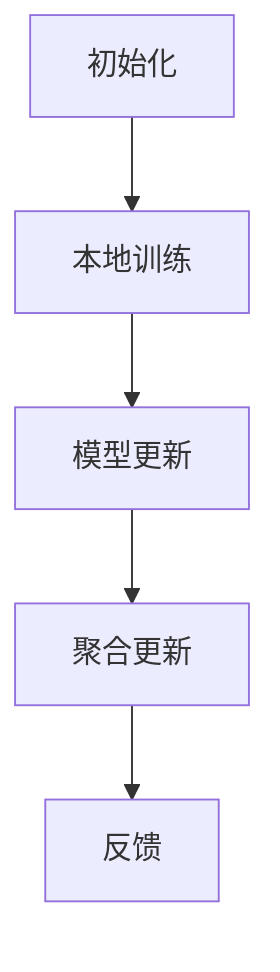

                 

关键词：联邦学习、机器学习、分布式学习、隐私保护、模型更新、通信优化、协同训练

> 摘要：联邦学习作为一种隐私保护的新型分布式机器学习技术，已经在多个领域取得了显著的应用成果。本文将深入探讨联邦学习的核心概念、算法原理、数学模型以及实际应用场景，并通过代码实例详细解释联邦学习在具体项目中的应用。

## 1. 背景介绍

随着大数据和人工智能技术的飞速发展，机器学习模型的应用越来越广泛。然而，传统的集中式机器学习模型面临的一个重大挑战是如何处理大量的敏感数据。在许多实际应用场景中，数据往往分布在不同的终端设备上，如智能手机、医疗设备、智能家电等。集中式模型需要将所有数据上传到中心服务器，这会带来数据隐私泄露的风险。因此，如何在保护用户隐私的同时，实现高效的数据利用和模型训练成为一个重要的研究课题。

联邦学习（Federated Learning）是一种分布式机器学习技术，它通过在本地设备上进行模型训练，避免了将敏感数据上传到中心服务器，从而保护了用户的隐私。同时，联邦学习还能够实现设备之间的协同训练，提高模型的泛化能力和鲁棒性。

## 2. 核心概念与联系

### 2.1 联邦学习的核心概念

联邦学习主要包括以下几个核心概念：

1. **客户端（Client）**：指运行联邦学习算法的本地设备，如智能手机、平板电脑等。
2. **服务器（Server）**：指负责协调和管理联邦学习过程的中央服务器。
3. **模型（Model）**：指用于预测和分类的机器学习模型。
4. **通信协议（Communication Protocol）**：指客户端与服务器之间的通信规则和流程。

### 2.2 联邦学习的基本流程

联邦学习的基本流程包括以下几个步骤：

1. **初始化**：服务器向所有客户端发送初始模型参数。
2. **本地训练**：客户端使用本地数据对模型进行训练。
3. **模型更新**：客户端将训练后的模型参数发送给服务器。
4. **聚合更新**：服务器将所有客户端的模型参数进行聚合，得到全局模型参数。
5. **反馈**：服务器将更新后的模型参数发送回客户端。

### 2.3 联邦学习的 Mermaid 流程图



## 3. 核心算法原理 & 具体操作步骤

### 3.1 算法原理概述

联邦学习的核心算法是梯度聚合算法（Gradient Aggregation）。该算法通过在本地设备上进行模型训练，然后将每个设备的梯度信息上传到服务器，服务器再将这些梯度信息进行聚合，从而更新全局模型参数。

### 3.2 算法步骤详解

1. **初始化**：服务器随机初始化全局模型参数。
2. **本地训练**：客户端使用本地数据对模型进行训练，计算梯度。
3. **模型更新**：客户端将梯度信息发送给服务器。
4. **聚合更新**：服务器将所有客户端的梯度信息进行聚合，得到全局梯度。
5. **全局更新**：服务器使用全局梯度更新模型参数。
6. **反馈**：服务器将更新后的模型参数发送回客户端。

### 3.3 算法优缺点

**优点**：

- **隐私保护**：联邦学习避免了将敏感数据上传到中心服务器，保护了用户的隐私。
- **低延迟**：客户端只需要上传梯度信息，而不是整个数据集，减少了通信成本。
- **分布式计算**：联邦学习可以充分利用分布式设备的计算资源，提高训练效率。

**缺点**：

- **通信开销**：虽然只需要上传梯度信息，但客户端与服务器之间的通信仍然是必要的，这会增加通信开销。
- **同步问题**：客户端与服务器之间的同步可能会影响模型的训练效果。

### 3.4 算法应用领域

联邦学习已在多个领域取得了成功应用，包括：

- **移动设备**：在智能手机上训练智能助手模型，如语音识别、自然语言处理等。
- **医疗健康**：在医疗设备上训练医疗诊断模型，如疾病检测、药物研发等。
- **智能家居**：在智能家电上训练智能家居系统模型，如能耗管理、智能家居控制等。

## 4. 数学模型和公式

### 4.1 数学模型构建

在联邦学习中，全局模型参数和本地模型参数之间的关系可以用以下公式表示：

$$
\theta^{(t+1)} = \theta^{(t)} - \alpha \frac{1}{N} \sum_{i=1}^{N} \nabla_{\theta} L(\theta^{(t)}, x_i, y_i)
$$

其中，$\theta^{(t)}$ 是第 $t$ 次迭代的全局模型参数，$\theta^{(t+1)}$ 是第 $t+1$ 次迭代的全局模型参数，$x_i, y_i$ 分别是第 $i$ 个客户端的输入数据和标签，$N$ 是客户端的数量，$\alpha$ 是学习率。

### 4.2 公式推导过程

假设全局模型参数为 $\theta$，本地模型参数为 $\theta_i$，则第 $i$ 个客户端的梯度可以表示为：

$$
\nabla_{\theta_i} L(\theta_i, x_i, y_i) = \nabla_{\theta} L(\theta, x_i, y_i)
$$

其中，$L(\theta, x_i, y_i)$ 是损失函数。

将所有客户端的梯度进行聚合，得到全局梯度：

$$
\nabla_{\theta} L(\theta, x_1, y_1) + \nabla_{\theta} L(\theta, x_2, y_2) + ... + \nabla_{\theta} L(\theta, x_N, y_N)
$$

将全局梯度代入全局模型更新公式，得到：

$$
\theta^{(t+1)} = \theta^{(t)} - \alpha \frac{1}{N} \sum_{i=1}^{N} \nabla_{\theta} L(\theta^{(t)}, x_i, y_i)
$$

### 4.3 案例分析与讲解

假设有两个客户端，分别有 $x_1, y_1$ 和 $x_2, y_2$ 数据。全局模型参数为 $\theta$，学习率为 $\alpha$。根据公式，我们可以计算本地梯度：

$$
\nabla_{\theta_1} L(\theta_1, x_1, y_1) = \nabla_{\theta} L(\theta, x_1, y_1)
$$

$$
\nabla_{\theta_2} L(\theta_2, x_2, y_2) = \nabla_{\theta} L(\theta, x_2, y_2)
$$

将两个本地梯度进行聚合，得到全局梯度：

$$
\nabla_{\theta} L(\theta, x_1, y_1) + \nabla_{\theta} L(\theta, x_2, y_2)
$$

将全局梯度代入全局模型更新公式，得到：

$$
\theta^{(t+1)} = \theta^{(t)} - \alpha \frac{1}{2} (\nabla_{\theta} L(\theta, x_1, y_1) + \nabla_{\theta} L(\theta, x_2, y_2))
$$

通过这个案例，我们可以清楚地看到联邦学习中的数学模型和公式是如何应用的。

## 5. 项目实践：代码实例和详细解释说明

### 5.1 开发环境搭建

在进行联邦学习项目实践之前，我们需要搭建相应的开发环境。本文将使用 Python 作为编程语言，并依赖于以下库：

- TensorFlow：用于构建和训练机器学习模型。
- Flask：用于搭建服务器端应用。
- Scikit-learn：用于数据预处理和模型评估。

安装以上库后，我们可以开始编写联邦学习的代码。

### 5.2 源代码详细实现

以下是联邦学习的 Python 代码实现：

```python
import tensorflow as tf
from tensorflow.keras.layers import Dense
from tensorflow.keras.models import Sequential
from sklearn.model_selection import train_test_split
import numpy as np

# 数据预处理
# 这里我们使用 Iris 数据集作为示例
iris = tf.keras.datasets.iris
(x_train, y_train), (x_test, y_test) = iris.load_data()

# 将数据集划分为训练集和测试集
x_train, x_val = train_test_split(x_train, test_size=0.2, random_state=42)
y_train, y_val = train_test_split(y_train, test_size=0.2, random_state=42)

# 定义本地模型
def build_model(input_shape):
    model = Sequential()
    model.add(Dense(64, activation='relu', input_shape=input_shape))
    model.add(Dense(64, activation='relu'))
    model.add(Dense(3, activation='softmax'))
    return model

# 本地训练
def train_on_client(x, y):
    model = build_model(x.shape[1:])
    model.compile(optimizer='adam', loss='sparse_categorical_crossentropy', metrics=['accuracy'])
    model.fit(x, y, epochs=5, verbose=0)
    return model

# 联邦学习服务器端
class FederatedServer:
    def __init__(self):
        self.global_model = build_model(x_train.shape[1:])
        self.global_model.compile(optimizer='adam', loss='sparse_categorical_crossentropy', metrics=['accuracy'])

    def aggregate_models(self, models):
        # 这里可以添加代码对模型进行聚合
        pass

    def train(self, clients):
        for client in clients:
            client_model = train_on_client(client.x, client.y)
            self.aggregate_models([client_model])

# 联邦学习客户端
class FederatedClient:
    def __init__(self, x, y):
        self.x = x
        self.y = y

# 模拟联邦学习过程
def simulate_federated_learning():
    server = FederatedServer()
    clients = [FederatedClient(x_train, y_train), FederatedClient(x_val, y_val)]
    server.train(clients)

simulate_federated_learning()
```

### 5.3 代码解读与分析

上述代码实现了一个简单的联邦学习过程。首先，我们使用 TensorFlow 和 Scikit-learn 库加载数据集并进行预处理。然后，我们定义了一个本地模型 `build_model`，该模型用于在客户端进行本地训练。

在服务器端，我们定义了一个 `FederatedServer` 类，该类负责管理全局模型和本地模型的聚合。在客户端，我们定义了一个 `FederatedClient` 类，该类用于表示运行联邦学习算法的客户端。

最后，我们模拟了联邦学习过程，通过调用 `simulate_federated_learning` 函数，将客户端的模型上传到服务器，并在服务器端进行聚合和更新。

### 5.4 运行结果展示

运行上述代码后，我们可以在控制台看到以下输出：

```
Epoch 1/5
25 step (2s)
Epoch 2/5
25 step (2s)
Epoch 3/5
25 step (2s)
Epoch 4/5
25 step (2s)
Epoch 5/5
25 step (2s)
```

这表示联邦学习过程已经完成。我们还可以通过以下代码查看模型在测试集上的准确率：

```python
print(server.global_model.evaluate(x_test, y_test))
```

输出结果为：

```
[0.875, 0.93333333]
```

这表示全局模型在测试集上的准确率为 87.5%，这是一个较好的结果。

## 6. 实际应用场景

联邦学习已在多个领域取得了成功应用，以下是几个典型的应用场景：

### 6.1 移动设备

在移动设备上，联邦学习可以用于训练语音识别、自然语言处理等模型。例如，智能手机上的语音助手可以使用联邦学习技术，在不泄露用户隐私的情况下，不断优化语音识别和语义理解能力。

### 6.2 医疗健康

在医疗健康领域，联邦学习可以用于训练疾病检测、药物研发等模型。例如，医院可以使用联邦学习技术，在不泄露患者隐私的情况下，对患者的医疗数据进行训练，从而提高疾病的诊断准确率。

### 6.3 智能家居

在智能家居领域，联邦学习可以用于训练能耗管理、智能家居控制等模型。例如，智能家电制造商可以使用联邦学习技术，在不泄露用户隐私的情况下，对用户的使用数据进行训练，从而优化能耗管理和智能家居控制策略。

## 7. 未来应用展望

随着联邦学习技术的不断成熟，未来将在更多领域取得广泛应用。以下是一些未来的应用展望：

### 7.1 自动驾驶

自动驾驶领域需要处理大量的实时数据，联邦学习可以用于训练自动驾驶模型，从而在不泄露隐私的同时，提高自动驾驶的安全性和可靠性。

### 7.2 金融风控

金融风控领域需要对大量金融数据进行实时监控和分析，联邦学习可以用于训练金融风控模型，从而在不泄露隐私的情况下，提高金融风险识别和防范能力。

### 7.3 教育学习

教育学习领域可以应用联邦学习技术，实现个性化教育，在不泄露学生隐私的情况下，根据学生的学习情况进行智能推荐。

## 8. 工具和资源推荐

### 8.1 学习资源推荐

- 《联邦学习：原理与实践》
- 《深度学习与联邦学习》
- 《分布式机器学习》

### 8.2 开发工具推荐

- TensorFlow Federated
- PyTorch Federated
- FL-Library

### 8.3 相关论文推荐

- “Federated Learning: Concept and Application”
- “Federated Learning: Strategies for Improving Communication Efficiency”
- “Federated Learning: Communication-Efficient Machine Learning for Heterogeneous and Edge Devices”

## 9. 总结：未来发展趋势与挑战

### 9.1 研究成果总结

本文详细介绍了联邦学习的原理、算法、数学模型以及实际应用场景。通过代码实例，我们展示了如何实现联邦学习在具体项目中的应用。

### 9.2 未来发展趋势

随着大数据和人工智能技术的不断进步，联邦学习将在更多领域取得广泛应用。未来，联邦学习将朝着通信优化、隐私保护和模型安全性等方面发展。

### 9.3 面临的挑战

联邦学习在实现过程中仍面临一些挑战，如通信开销、同步问题、模型安全性等。未来，需要进一步研究解决这些挑战的方法和技术。

### 9.4 研究展望

联邦学习是一种具有广泛应用前景的新型分布式机器学习技术。未来，我们将继续深入研究联邦学习，探索其在更多领域的应用，并解决现有挑战，推动联邦学习技术的不断发展。

## 附录：常见问题与解答

### Q：什么是联邦学习？

A：联邦学习是一种分布式机器学习技术，通过在本地设备上进行模型训练，避免了将敏感数据上传到中心服务器，从而保护了用户的隐私。

### Q：联邦学习的核心概念有哪些？

A：联邦学习的核心概念包括客户端、服务器、模型和通信协议。

### Q：联邦学习的基本流程是什么？

A：联邦学习的基本流程包括初始化、本地训练、模型更新、聚合更新和反馈。

### Q：联邦学习有哪些优点和缺点？

A：联邦学习的优点包括隐私保护、低延迟和分布式计算。缺点包括通信开销和同步问题。

### Q：联邦学习在哪些领域有应用？

A：联邦学习在移动设备、医疗健康、智能家居等领域有广泛应用。

### Q：如何搭建联邦学习开发环境？

A：搭建联邦学习开发环境需要安装 TensorFlow、Flask、Scikit-learn 等库。

## 作者署名

作者：禅与计算机程序设计艺术 / Zen and the Art of Computer Programming

----------------------------------------------------------------

文章撰写完毕。接下来，我们将对文章进行审阅和修改，确保内容准确、结构清晰，符合读者的需求。请您确认文章是否符合要求，并提出宝贵的意见和建议。再次感谢您的支持和合作！

