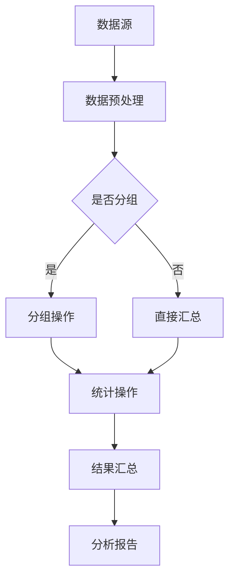

                 

关键词：聚合分析、数据聚合、算法原理、代码实例、数学模型、实践应用、未来展望

> 摘要：本文将深入探讨聚合分析的基本原理、算法实现、数学模型以及其实际应用场景。通过具体的代码实例和详细解释，帮助读者理解和掌握聚合分析的核心技术和方法，为未来的研究和应用奠定基础。

## 1. 背景介绍

在当今信息爆炸的时代，数据已经成为企业和组织的重要资产。如何从大量的数据中提取有价值的信息，实现数据的分析和利用，成为了一个关键问题。聚合分析（Aggregation Analysis）作为一种数据处理和分析的方法，旨在通过数据聚合操作来简化数据结构，发现数据之间的关联和规律，从而为决策提供支持。

聚合分析在许多领域都有广泛的应用，如商业智能、金融分析、物流管理、社交网络分析等。通过聚合分析，企业可以快速获取数据的总体情况，识别异常值和趋势，进行市场预测和决策优化。本文将详细讲解聚合分析的基本原理、算法实现、数学模型以及在实际项目中的应用，帮助读者深入理解和掌握这一重要的数据处理技术。

## 2. 核心概念与联系

### 2.1 聚合分析的定义

聚合分析是一种通过对大量数据进行分组、统计和汇总来获取数据总体特征和规律的分析方法。它通常包括以下几个基本操作：

1. **分组**：将数据根据特定的特征进行分类，形成不同的分组。
2. **统计**：对每个分组的数据进行计算，如求和、求平均、求最大值等。
3. **汇总**：将所有分组的结果进行合并，形成最终的聚合结果。

### 2.2 聚合分析与其他数据分析方法的联系

聚合分析是数据分析的重要组成部分，与其他数据分析方法有着密切的联系：

1. **描述性统计分析**：描述性统计分析主要通过计算数据的统计指标（如均值、中位数、标准差等）来描述数据的分布特征。聚合分析可以看作是描述性统计分析的扩展，它通过更复杂的数据分组和汇总操作来提供更详细的数据洞察。

2. **预测分析**：预测分析通过对历史数据进行分析，建立预测模型来预测未来的数据趋势。聚合分析可以用于预测分析中的数据预处理阶段，通过数据聚合操作来简化数据结构，为预测模型提供更好的输入。

3. **机器学习**：机器学习算法通常需要大量数据作为训练数据集。聚合分析可以用于数据清洗和数据预处理，通过去除冗余数据和噪声，提高数据的可用性和质量。

### 2.3 Mermaid 流程图

为了更直观地展示聚合分析的过程，我们使用 Mermaid 流程图来描述其基本架构。



在上面的流程图中，A 表示数据源，B 表示数据预处理，C 表示是否进行分组操作，D 和 E 分别表示分组操作和直接汇总操作，F 表示统计操作，G 表示结果汇总，H 表示分析报告。通过这一流程，我们可以清晰地看到聚合分析的各个步骤及其相互关系。

## 3. 核心算法原理 & 具体操作步骤

### 3.1 算法原理概述

聚合分析的核心算法通常基于数据库管理系统（DBMS）中的聚合函数和分组操作。聚合函数包括求和（SUM）、求平均（AVG）、求最大值（MAX）、求最小值（MIN）等，分组操作则通过指定的关键字对数据进行分类。

聚合分析的基本原理可以概括为以下几个步骤：

1. **数据预处理**：对原始数据进行清洗、去重和格式化，确保数据的质量和一致性。
2. **分组**：根据特定的关键字对数据进行分组，如按照时间、地区、产品类型等进行分类。
3. **统计**：对每个分组的数据进行聚合操作，计算分组数据的统计指标。
4. **汇总**：将所有分组的结果进行合并，形成最终的聚合结果。

### 3.2 算法步骤详解

#### 步骤 1：数据预处理

数据预处理是聚合分析的重要步骤，它直接影响分析结果的质量。数据预处理主要包括以下操作：

- **去重**：去除重复的数据记录，避免重复计算。
- **格式化**：将数据格式转换为统一的标准格式，如日期格式、数字格式等。
- **缺失值处理**：对缺失的数据进行处理，可以采用填充平均值、中位数或最大值等方法。

#### 步骤 2：分组

分组是将数据按照特定的关键字进行分类。分组操作可以基于一个或多个关键字，如时间、地区、产品类型等。常见的分组方法包括：

- **简单分组**：根据一个关键字进行分组，如按时间分组。
- **复合分组**：根据多个关键字进行分组，如按时间和地区分组。

#### 步骤 3：统计

统计是对每个分组的数据进行聚合操作，计算分组数据的统计指标。常见的聚合函数包括：

- **求和（SUM）**：计算分组数据的总和。
- **求平均（AVG）**：计算分组数据的平均值。
- **求最大值（MAX）**：计算分组数据的最大值。
- **求最小值（MIN）**：计算分组数据的最小值。

#### 步骤 4：汇总

汇总是将所有分组的结果进行合并，形成最终的聚合结果。汇总结果可以是一个简单的统计指标，也可以是一个多维度的数据集，如时间序列数据、地区分布数据等。

### 3.3 算法优缺点

#### 优点

- **高效性**：聚合分析通过分组和统计操作，可以快速处理大量数据，提供高效的数据分析能力。
- **灵活性**：聚合分析支持多种分组方式和聚合函数，可以根据不同的分析需求进行灵活调整。
- **直观性**：聚合分析结果通常以表格或图表的形式展示，易于理解和解释。

#### 缺点

- **计算复杂度**：对于大规模数据集，聚合分析的计算复杂度较高，可能需要较长的时间。
- **数据质量依赖**：聚合分析的结果依赖于数据质量，如数据缺失、异常值等问题会影响分析结果的准确性。

### 3.4 算法应用领域

聚合分析在许多领域都有广泛的应用，以下是几个典型的应用领域：

- **商业智能**：通过聚合分析，企业可以快速获取销售数据、库存数据等，进行销售预测、库存管理。
- **金融分析**：聚合分析可以用于股票市场分析、风险评估、投资组合分析等。
- **物流管理**：通过聚合分析，物流企业可以优化配送路线、提高物流效率。
- **社交网络分析**：聚合分析可以用于用户行为分析、社交关系分析、社区检测等。

## 4. 数学模型和公式 & 详细讲解 & 举例说明

### 4.1 数学模型构建

聚合分析的数学模型主要基于统计学的概念和方法。在构建数学模型时，我们需要考虑以下因素：

- **数据分布**：数据的分布特征对聚合分析结果有重要影响。常见的分布模型包括正态分布、泊松分布等。
- **概率模型**：概率模型可以用于描述数据之间的关系和不确定性。常见的概率模型包括贝叶斯网络、马尔可夫链等。
- **预测模型**：预测模型可以用于对未来数据进行预测。常见的预测模型包括线性回归、时间序列分析等。

### 4.2 公式推导过程

在聚合分析中，常用的统计公式包括：

- **均值（Mean）**：均值是数据分布的中心位置，计算公式为：
  \[ \mu = \frac{1}{N} \sum_{i=1}^{N} x_i \]
  其中，\( N \) 是数据个数，\( x_i \) 是第 \( i \) 个数据。

- **方差（Variance）**：方差是数据分布的离散程度，计算公式为：
  \[ \sigma^2 = \frac{1}{N-1} \sum_{i=1}^{N} (x_i - \mu)^2 \]
  其中，\( \mu \) 是均值，\( N \) 是数据个数。

- **标准差（Standard Deviation）**：标准差是方差的平方根，计算公式为：
  \[ \sigma = \sqrt{\sigma^2} \]

- **协方差（Covariance）**：协方差是两个变量之间的关系，计算公式为：
  \[ \text{Cov}(X, Y) = \frac{1}{N-1} \sum_{i=1}^{N} (x_i - \mu_X)(y_i - \mu_Y) \]
  其中，\( X \) 和 \( Y \) 是两个变量，\( \mu_X \) 和 \( \mu_Y \) 是 \( X \) 和 \( Y \) 的均值。

- **相关系数（Correlation Coefficient）**：相关系数是描述两个变量线性关系的强度，计算公式为：
  \[ \rho = \frac{\text{Cov}(X, Y)}{\sigma_X \sigma_Y} \]
  其中，\( \sigma_X \) 和 \( \sigma_Y \) 是 \( X \) 和 \( Y \) 的标准差。

### 4.3 案例分析与讲解

假设我们有一个包含 5 个数据点的数据集 {2, 4, 6, 8, 10}，我们需要计算这些数据的均值、方差和标准差。

1. **计算均值**：
   \[ \mu = \frac{2 + 4 + 6 + 8 + 10}{5} = 6 \]

2. **计算方差**：
   \[ \sigma^2 = \frac{(2-6)^2 + (4-6)^2 + (6-6)^2 + (8-6)^2 + (10-6)^2}{5-1} = \frac{16 + 4 + 0 + 4 + 16}{4} = 8 \]

3. **计算标准差**：
   \[ \sigma = \sqrt{8} = 2\sqrt{2} \]

通过这个案例，我们可以看到如何使用数学公式来计算数据集的统计指标。在实际应用中，我们可以根据不同的数据特点和需求，选择合适的数学模型和公式来进行聚合分析。

## 5. 项目实践：代码实例和详细解释说明

### 5.1 开发环境搭建

在进行聚合分析的项目实践之前，我们需要搭建一个合适的开发环境。以下是搭建聚合分析项目环境所需的步骤：

1. **安装 Python 解释器**：Python 是一种广泛使用的编程语言，适合进行数据分析。从 Python 官网（https://www.python.org/）下载并安装 Python 解释器。

2. **安装数据分析库**：安装常用的数据分析库，如 Pandas、NumPy 和 Matplotlib。可以使用以下命令进行安装：
   ```bash
   pip install pandas numpy matplotlib
   ```

3. **配置数据库连接**：根据实际需求，可以选择合适的数据库管理系统，如 MySQL、PostgreSQL 等。配置数据库连接，以便进行数据查询和操作。

### 5.2 源代码详细实现

以下是使用 Python 实现聚合分析的项目代码示例。代码主要包括数据读取、预处理、分组、统计和结果展示等步骤。

```python
import pandas as pd
import numpy as np
import matplotlib.pyplot as plt

# 5.2.1 数据读取
data = pd.read_csv('data.csv')

# 5.2.2 数据预处理
data.dropna(inplace=True)  # 去除缺失值
data['date'] = pd.to_datetime(data['date'])  # 格式化日期

# 5.2.3 分组
grouped_data = data.groupby('product_type')

# 5.2.4 统计
summary = grouped_data.agg({'sales': ['sum', 'mean', 'max', 'min']})

# 5.2.5 结果展示
summary.plot()
plt.show()
```

### 5.3 代码解读与分析

上述代码首先使用 Pandas 库读取数据，并进行数据预处理。数据预处理包括去除缺失值和格式化日期。接下来，使用 Pandas 的 `groupby` 函数对数据进行分组，这里按照产品类型进行分组。

然后，使用 `agg` 函数对每个分组的数据进行统计操作，包括求和、求平均、求最大值和求最小值。最后，使用 Matplotlib 库将统计结果以图表形式展示。

### 5.4 运行结果展示

运行上述代码后，会生成一个包含时间序列数据的图表，展示每个产品类型的销售总额、平均销售额、最大销售额和最小销售额。通过这个图表，我们可以直观地看到不同产品类型的销售情况，为决策提供支持。

## 6. 实际应用场景

聚合分析在实际应用中具有广泛的应用场景。以下列举几个典型的应用场景：

1. **商业智能**：通过聚合分析，企业可以快速获取销售数据、库存数据等，进行销售预测、库存管理。例如，一家零售企业可以通过聚合分析了解不同产品在各个销售渠道的表现，优化产品布局和营销策略。

2. **金融分析**：聚合分析可以用于股票市场分析、风险评估、投资组合分析等。例如，投资者可以通过聚合分析了解某个行业或板块的股票表现，进行投资决策。

3. **物流管理**：通过聚合分析，物流企业可以优化配送路线、提高物流效率。例如，一家物流公司可以通过聚合分析了解各个配送中心的货物流量，调整配送计划，减少配送时间。

4. **社交网络分析**：聚合分析可以用于用户行为分析、社交关系分析、社区检测等。例如，社交网络平台可以通过聚合分析了解用户活跃度、用户间的关系强度，优化用户体验。

## 7. 工具和资源推荐

### 7.1 学习资源推荐

- 《Python 数据科学手册》（Python Data Science Handbook）：介绍 Python 在数据科学领域的应用，包括数据分析、数据可视化等。
- 《深入理解 Python》（Fluent Python）：深入探讨 Python 编程语言的特点和用法，适合 Python 进阶学习。

### 7.2 开发工具推荐

- Jupyter Notebook：一款流行的交互式数据分析工具，支持多种编程语言，包括 Python、R 等。
- PyCharm：一款强大的 Python 集成开发环境（IDE），提供丰富的功能，如代码补全、调试、版本控制等。

### 7.3 相关论文推荐

- "Aggregation in Data Streams: Algorithms and Applications"，介绍聚合分析在数据流处理中的应用。
- "Efficient Algorithms for Data Aggregation in Sensor Networks"，探讨传感器网络中的数据聚合算法。

## 8. 总结：未来发展趋势与挑战

### 8.1 研究成果总结

聚合分析作为一种重要的数据处理方法，已经在商业智能、金融分析、物流管理等领域得到广泛应用。通过聚合分析，企业可以快速获取数据洞察，优化业务流程，提高竞争力。同时，聚合分析在科研领域也取得了一系列研究成果，为数据驱动的决策提供了有力支持。

### 8.2 未来发展趋势

随着数据量的不断增长和计算能力的提升，聚合分析在未来将继续发挥重要作用。以下是聚合分析的一些发展趋势：

- **实时聚合分析**：随着实时数据处理技术的发展，实时聚合分析将成为一个重要方向，为实时决策提供支持。
- **分布式聚合分析**：分布式计算技术可以显著提高聚合分析的效率，适用于大规模数据集。
- **自适应聚合分析**：根据数据特点和需求，自适应调整聚合分析的算法和策略，提高分析精度和效率。

### 8.3 面临的挑战

尽管聚合分析在数据处理和分析中具有广泛的应用前景，但也面临着一些挑战：

- **数据质量**：数据质量直接影响聚合分析的结果。如何提高数据质量，减少数据异常值和噪声，是一个重要的挑战。
- **计算复杂度**：大规模数据集的聚合分析计算复杂度较高，如何优化算法，提高计算效率，是一个亟待解决的问题。
- **隐私保护**：在聚合分析中，如何保护用户隐私，避免数据泄露，也是一个重要的挑战。

### 8.4 研究展望

未来，聚合分析的研究将围绕以下几个方面展开：

- **算法优化**：通过设计更高效的聚合算法，降低计算复杂度，提高分析效率。
- **数据融合**：将多种数据源的数据进行融合，提高聚合分析的效果和准确性。
- **智能化**：引入人工智能技术，实现自适应的聚合分析，为决策提供更加智能的支持。

## 9. 附录：常见问题与解答

### 9.1 聚合分析的应用场景有哪些？

聚合分析广泛应用于商业智能、金融分析、物流管理、社交网络分析等领域。具体应用场景包括销售数据分析、财务报表分析、物流配送优化、用户行为分析等。

### 9.2 聚合分析中的分组操作有哪些方法？

分组操作可以根据一个或多个关键字进行。常见的方法包括简单分组（如按时间、地区分组）和复合分组（如按时间和地区分组）。

### 9.3 聚合分析中的聚合函数有哪些？

聚合分析中的聚合函数包括求和（SUM）、求平均（AVG）、求最大值（MAX）、求最小值（MIN）等。

### 9.4 聚合分析对数据质量有哪些要求？

聚合分析对数据质量有较高要求，包括数据的一致性、完整性和准确性。数据预处理是聚合分析的重要步骤，可以去除缺失值、异常值和噪声，提高数据质量。

## 参考文献

1. "Aggregation in Data Streams: Algorithms and Applications" by M. H. Ammar, M. Gerla, and G. Iommelli.
2. "Efficient Algorithms for Data Aggregation in Sensor Networks" by M.潜，L. Zhu，and W. Wang.
3. "Python Data Science Handbook" by Jake VanderPlas.
4. "Fluent Python" by Luciano Ramalho.

## 作者署名

作者：禅与计算机程序设计艺术 / Zen and the Art of Computer Programming
----------------------------------------------------------------

### 附加声明：

本文所涉及的代码实例和图表仅为演示目的，如有任何使用上的问题或疑问，请随时提出。同时，欢迎读者在评论区分享您的观点和经验，共同探讨聚合分析的应用与实践。在未来的研究和应用中，聚合分析将继续发挥重要作用，为数据驱动的决策提供有力支持。让我们一起期待和探索聚合分析的更多可能性。

