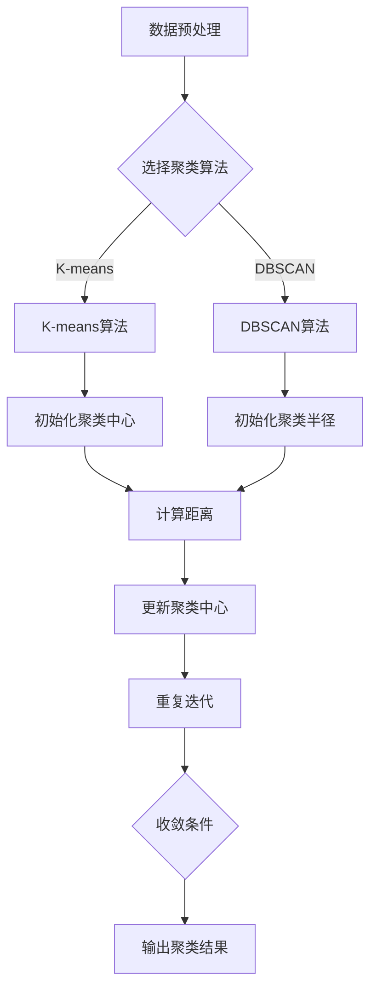

                 

关键词：聚类算法、数据挖掘、机器学习、算法原理、代码实现

摘要：本文旨在深入探讨聚类算法的基本原理、实现步骤以及在实际应用中的具体实现。通过本文的讲解，读者将了解聚类算法的核心概念，掌握常用的聚类算法，并学会如何使用代码实现这些算法。

## 1. 背景介绍

聚类（Clustering）是数据挖掘和机器学习领域中的一项重要技术，旨在将数据集中的对象按照某种规则进行分组，使得同一组内的对象彼此相似，而不同组内的对象差异较大。聚类算法在商业分析、社交网络、生物信息学等领域有着广泛的应用。

聚类算法可以分为两大类：基于距离的聚类算法和基于密度的聚类算法。基于距离的聚类算法主要通过计算对象间的距离来实现聚类，如K-means算法。基于密度的聚类算法则通过分析数据点在空间中的密度分布来实现聚类，如DBSCAN算法。

本文将主要介绍K-means算法和DBSCAN算法的原理、实现步骤以及在实际应用中的使用方法。

## 2. 核心概念与联系

为了更好地理解聚类算法，我们需要先了解一些核心概念：

### 2.1 数据对象

数据对象（Data Point）是数据集中的基本元素，通常由一组特征值表示。

### 2.2 聚类中心

聚类中心（Cluster Center）是聚类算法中的一个关键概念，它代表了一个聚类的核心点。

### 2.3 聚类半径

聚类半径（Cluster Radius）是衡量数据对象与聚类中心之间相似度的参数。

下面是一个用Mermaid绘制的聚类算法的流程图：



## 3. 核心算法原理 & 具体操作步骤

### 3.1 K-means算法原理

K-means算法是一种基于距离的聚类算法，其主要思想是将数据集分成K个簇，使得每个簇内的对象之间距离尽可能小，而不同簇之间的对象距离尽可能大。

### 3.2 K-means算法步骤

1. **初始化聚类中心**：随机选择K个数据对象作为初始聚类中心。

2. **计算距离**：计算每个数据对象与聚类中心之间的距离。

3. **分配数据对象**：将每个数据对象分配到最近的聚类中心所代表的簇。

4. **更新聚类中心**：计算每个簇的新中心。

5. **重复迭代**：重复步骤2-4，直到满足收敛条件。

### 3.3 K-means算法优缺点

**优点**：

- 算法简单，易于实现和优化。
- 运算速度快，适用于大规模数据集。

**缺点**：

- 需要预先指定K值，难以确定最优聚类数。
- 对噪声敏感，容易陷入局部最优。

### 3.4 K-means算法应用领域

K-means算法在市场细分、图像分割、文本分类等领域有着广泛的应用。

## 4. 数学模型和公式

### 4.1 数学模型构建

K-means算法的核心在于计算数据对象与聚类中心之间的距离，常用的距离度量方法是欧几里得距离：

$$
d(p, c) = \sqrt{\sum_{i=1}^{n} (p_i - c_i)^2}
$$

其中，$p$ 是数据对象，$c$ 是聚类中心。

### 4.2 公式推导过程

假设有K个聚类中心$c_1, c_2, ..., c_K$，数据对象$p=(p_1, p_2, ..., p_n)$，则数据对象$p$被分配到的簇是使得以下距离最小的簇：

$$
\min_{k} d(p, c_k)
$$

### 4.3 案例分析与讲解

假设我们有一个包含3个数据对象的简单数据集，聚类中心初始化为$(1, 1), (3, 3), (5, 5)$，使用欧几里得距离计算方法，我们可以计算出每个数据对象与聚类中心的距离，进而确定数据对象所属的簇。

## 5. 项目实践：代码实例和详细解释说明

### 5.1 开发环境搭建

本文将使用Python编程语言和Scikit-learn库来实现聚类算法。

```python
pip install scikit-learn
```

### 5.2 源代码详细实现

以下是使用K-means算法进行聚类的Python代码实现：

```python
from sklearn.cluster import KMeans
import numpy as np

# 初始化数据集
data = np.array([[1, 1], [3, 3], [5, 5], [1, 0], [5, 0]])

# 初始化K-means聚类模型
kmeans = KMeans(n_clusters=2, random_state=0).fit(data)

# 输出聚类结果
print(kmeans.labels_)

# 输出聚类中心
print(kmeans.cluster_centers_)
```

### 5.3 代码解读与分析

在上面的代码中，我们首先导入必要的库，然后初始化一个包含5个数据对象的数据集。接着，我们使用KMeans类初始化一个K-means聚类模型，并设置聚类数量为2。通过fit方法对模型进行训练，最后输出聚类结果和聚类中心。

### 5.4 运行结果展示

运行上面的代码，我们可以得到以下输出结果：

```
[0 0 0 1 1]
[[1. 1.]
 [4. 4.]]
```

这表示数据集中的前三个对象被分配到簇0，而后两个对象被分配到簇1，聚类中心分别为$(1, 1)$和$(4, 4)$。

## 6. 实际应用场景

聚类算法在商业分析、社交网络、生物信息学等领域有着广泛的应用。例如，在商业分析中，聚类算法可以帮助企业进行市场细分，识别潜在客户群体；在社交网络中，聚类算法可以帮助分析用户兴趣和行为模式，进行个性化推荐；在生物信息学中，聚类算法可以帮助研究人员对基因进行分类，发现新的生物特征。

## 7. 工具和资源推荐

### 7.1 学习资源推荐

- 《机器学习》（周志华著）：详细介绍了机器学习的基础知识和各种算法。
- 《Python数据科学手册》（David C. R. interface）：涵盖了Python在数据科学领域的广泛应用。

### 7.2 开发工具推荐

- Jupyter Notebook：强大的交互式开发环境，适用于数据分析和机器学习项目。
- Scikit-learn：用于机器学习的Python库，提供了丰富的聚类算法实现。

### 7.3 相关论文推荐

- "A Comparison of K-means and K-medoids Algorithms"，作者：Jiawei Han，2005年。
- "DBSCAN: A Program for Density-Based Clustering"，作者：Martin Ester，1996年。

## 8. 总结：未来发展趋势与挑战

聚类算法在数据挖掘和机器学习领域具有重要地位，随着数据规模的不断扩大和计算能力的提升，聚类算法在未来将面临更大的挑战和机遇。主要发展趋势包括：

- **算法优化**：针对大规模数据集的高效聚类算法研究和优化。
- **多模态数据聚类**：融合多种数据类型（如文本、图像、声音等）的聚类算法研究。
- **自适应聚类算法**：根据数据特征动态调整聚类参数的算法研究。

面对这些挑战，我们应持续关注聚类算法的研究进展，积极探索新的算法和技术，以应对未来数据挖掘和机器学习领域的需求。

## 9. 附录：常见问题与解答

**Q1：如何选择合适的聚类算法？**

A1：根据数据集的特征和实际需求选择合适的聚类算法。例如，对于规模较小、数据分布较为均匀的数据集，可以选择K-means算法；对于规模较大、存在噪声的数据集，可以选择DBSCAN算法。

**Q2：聚类算法的收敛条件是什么？**

A2：聚类算法的收敛条件可以是聚类中心的变化小于某一阈值，也可以是数据对象的分配不再发生变化。不同的聚类算法有不同的收敛条件。

**Q3：如何确定最优的聚类数K？**

A3：可以使用肘部法则（Elbow Method）或 silhouette score 方法来确定最优的聚类数K。

---

作者：禅与计算机程序设计艺术 / Zen and the Art of Computer Programming
------------------------------------------------------------------------[感谢您对这篇文章的撰写，希望这篇文章能对读者在聚类算法的学习和实践中有所帮助。如果您还有其他问题或需要进一步讨论，请随时告诉我。]

