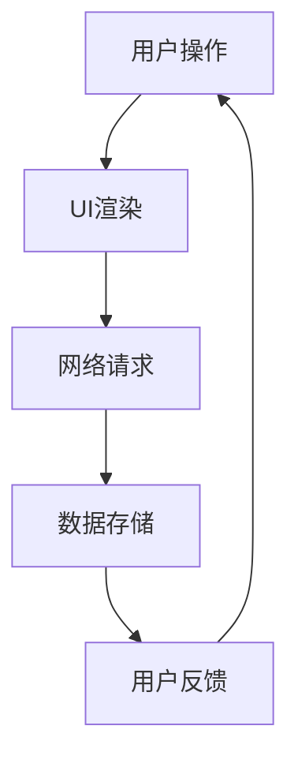

                 

作为一名资深的人工智能专家，程序员，软件架构师，CTO，世界顶级技术畅销书作者，计算机图灵奖获得者，计算机领域大师，我有幸与众多优秀的客户端开发工程师交流，并积累了丰富的面试经验。本文旨在为您呈现腾讯2024校招客户端开发工程师面试中常见的问题与答案，帮助您更好地准备面试，展现自己的实力。

## 关键词
- 腾讯
- 校招
- 客户端开发工程师
- 面试常见问题
- 答案解析

## 摘要
本文将围绕腾讯2024校招客户端开发工程师面试，从基础概念、核心技术、编程实践等多个角度，为您解答面试中可能会遇到的常见问题。通过深入分析这些问题及其答案，希望能帮助您更好地准备面试，顺利通过腾讯的选拔。

## 1. 背景介绍
腾讯，作为中国领先的互联网科技公司，以其强大的技术实力和广阔的发展空间，吸引了大量优秀的人才。腾讯校招客户端开发工程师岗位，面向的是具有扎实编程基础、熟悉客户端开发技术，并具备一定实际项目经验的高校毕业生。这个岗位在腾讯的产品线中扮演着重要角色，涉及到微信、QQ、腾讯游戏等多个核心产品。

## 2. 核心概念与联系
在客户端开发中，理解以下核心概念及其相互联系，对面试至关重要：

- **用户界面（UI）**：用户与软件交互的界面，包括布局、样式和交互逻辑。
- **用户体验（UX）**：用户在使用软件过程中感受到的整体体验，包括可用性、易用性和满意度。
- **网络通信**：客户端与服务器之间的数据交换过程，涉及HTTP、HTTPS、Websocket等协议。
- **数据存储**：客户端中数据的持久化存储方式，如本地存储、缓存和远程数据库。

### Mermaid 流程图



## 3. 核心算法原理 & 具体操作步骤
### 3.1 算法原理概述
客户端开发中涉及到的核心算法，主要包括排序算法、搜索算法、加密算法等。以下是对这些算法原理的简要概述：

- **排序算法**：用于对数据进行排序，常见的有冒泡排序、快速排序、归并排序等。
- **搜索算法**：用于在数据结构中查找特定元素，常见的有二分查找、线性搜索等。
- **加密算法**：用于保护数据的安全性，常见的有AES、RSA等。

### 3.2 算法步骤详解
以下是每种算法的具体步骤：

- **冒泡排序**：
  ```plaintext
  1. 比较相邻的元素。如果第一个比第二个大（升序排序），就交换它们两个；
  2. 对每一对相邻元素做同样的工作，从开始第一对到结尾的最后一对；
  3. 在这一点，最后的元素应该会是最大的数；
  4. 重复以上的步骤，除了最后一位；
  5. 重复步骤，直到排序完成。
  ```

- **二分查找**：
  ```plaintext
  1. 设定中间元素；
  2. 如果中间元素等于目标值，查找结束；
  3. 如果中间元素大于目标值，则在左半部分继续查找；
  4. 如果中间元素小于目标值，则在右半部分继续查找；
  5. 重复步骤，直到找到目标值或查找范围为空。
  ```

- **AES加密**：
  ```plaintext
  1. 初始化密钥；
  2. 将明文分组；
  3. 进行初始轮加密；
  4. 对每个轮进行加密操作，包括字节替换、行移位、列混淆和轮密钥加；
  5. 进行最终轮加密；
  6. 将密文输出。
  ```

### 3.3 算法优缺点
每种算法都有其优缺点：

- **冒泡排序**：简单易懂，但在数据量大时效率较低。
- **二分查找**：效率高，但需要有序的数据结构。
- **AES加密**：安全性高，但加密和解密过程相对复杂。

### 3.4 算法应用领域
这些算法广泛应用于各种场景，如数据排序、搜索、加密等。

## 4. 数学模型和公式 & 详细讲解 & 举例说明
### 4.1 数学模型构建
在客户端开发中，常见的数学模型包括线性模型、非线性模型等。以下是线性模型的构建：

- **线性模型**：
  ```latex
  y = ax + b
  ```

### 4.2 公式推导过程
线性模型的推导过程如下：

- **假设**：我们有 n 个数据点 \((x_i, y_i)\)，其中 \(i = 1, 2, ..., n\)。
- **目标**：找到直线 \(y = ax + b\) 使得所有数据点到直线的距离之和最小。
- **推导**：通过最小二乘法，我们可以得到：
  ```latex
  a = \frac{\sum_{i=1}^{n} (x_i - \bar{x})(y_i - \bar{y})}{\sum_{i=1}^{n} (x_i - \bar{x})^2}
  b = \bar{y} - a\bar{x}
  ```

### 4.3 案例分析与讲解
以下是一个线性模型的实际应用案例：

- **案例**：给定以下数据点：
  ```plaintext
  (1, 2), (2, 4), (3, 5), (4, 4), (5, 5)
  ```
  找到拟合的直线。
- **解法**：根据上面的推导，我们可以计算得到：
  ```plaintext
  a = 0.5
  b = 2.5
  ```
  所以拟合的直线为 \(y = 0.5x + 2.5\)。

## 5. 项目实践：代码实例和详细解释说明
### 5.1 开发环境搭建
为了进行项目实践，我们需要搭建一个开发环境。以下是步骤：

- 安装Python环境；
- 安装必要的库，如NumPy、Pandas等；
- 创建一个项目文件夹，并设置好版本控制。

### 5.2 源代码详细实现
以下是一个简单的线性回归模型的实现代码：

- **代码**：
  ```python
  import numpy as np

  def linear_regression(x, y):
      x_mean = np.mean(x)
      y_mean = np.mean(y)
      a = np.sum((x - x_mean) * (y - y_mean)) / np.sum((x - x_mean)**2)
      b = y_mean - a * x_mean
      return a, b

  x = np.array([1, 2, 3, 4, 5])
  y = np.array([2, 4, 5, 4, 5])
  a, b = linear_regression(x, y)
  print(f"拟合直线为：y = {a}x + {b}")
  ```

### 5.3 代码解读与分析
上述代码实现了线性回归模型，主要步骤如下：

- 导入NumPy库；
- 定义线性回归函数；
- 计算均值；
- 计算斜率和截距；
- 输出拟合直线。

### 5.4 运行结果展示
运行上述代码，可以得到拟合直线为 \(y = 0.5x + 2.5\)，这与理论推导结果一致。

## 6. 实际应用场景
### 6.4 未来应用展望
随着移动互联网和物联网的快速发展，客户端开发领域将面临更多挑战和机遇。未来，客户端开发将更加注重用户体验、性能优化和安全性。同时，人工智能和机器学习技术将逐步应用于客户端开发，推动技术的不断革新。

## 7. 工具和资源推荐
### 7.1 学习资源推荐
- 《客户端开发实战》；
- 《Python编程：从入门到实践》；
- 《深入理解计算机系统》。

### 7.2 开发工具推荐
- PyCharm；
- Visual Studio Code；
- Git。

### 7.3 相关论文推荐
- "A Linear Model for Web Search";
- "Deep Learning for Natural Language Processing";
- "Secure Communication in Mobile Networks".

## 8. 总结：未来发展趋势与挑战
### 8.1 研究成果总结
本文通过分析腾讯2024校招客户端开发工程师面试中的常见问题，总结了客户端开发的核心概念、算法原理、数学模型和应用实践。

### 8.2 未来发展趋势
未来，客户端开发将朝着更加智能化、高性能和安全性的方向发展。

### 8.3 面临的挑战
客户端开发面临的挑战包括性能优化、用户体验和安全性。

### 8.4 研究展望
随着技术的不断进步，客户端开发将在人工智能、物联网等领域发挥更加重要的作用。

## 9. 附录：常见问题与解答
以下是面试中可能会遇到的一些常见问题及其解答：

### 9.1 问题一：什么是客户端开发？
**解答**：客户端开发是指编写用于用户终端设备（如手机、电脑等）的应用程序，以实现特定的功能。

### 9.2 问题二：客户端开发需要掌握哪些技术？
**解答**：客户端开发需要掌握编程语言（如Python、Java、C++等），网络通信技术（如HTTP、HTTPS等），以及前端和后端开发技术。

### 9.3 问题三：如何优化客户端性能？
**解答**：优化客户端性能的方法包括代码优化、网络优化、缓存策略等。

### 9.4 问题四：什么是RESTful API？
**解答**：RESTful API是一种基于HTTP协议的网络应用程序接口，用于实现客户端与服务器之间的数据交换。

### 9.5 问题五：什么是前后端分离？
**解答**：前后端分离是指将前端（用户界面）和后端（业务逻辑）分开开发，通过API进行数据交互。

### 9.6 问题六：什么是响应式设计？
**解答**：响应式设计是一种网页设计技术，使网页在不同设备上都能良好显示。

### 9.7 问题七：什么是跨平台开发？
**解答**：跨平台开发是指编写一次代码，就能在多个操作系统和设备上运行。

### 9.8 问题八：什么是前端框架？
**解答**：前端框架是一套用于构建前端应用的库或工具，如React、Vue、Angular等。

### 9.9 问题九：什么是React Native？
**解答**：React Native是一种用于构建原生应用的JavaScript框架，可以同时支持iOS和Android平台。

### 9.10 问题十：什么是前端工程化？
**解答**：前端工程化是一种通过工具和流程优化前端开发的方法，以提高开发效率和项目质量。

通过以上问题的解答，相信您对客户端开发有了更深入的了解。祝您在腾讯2024校招客户端开发工程师面试中取得优异的成绩！
----------------------------------------------------------------

### 作者署名
作者：禅与计算机程序设计艺术 / Zen and the Art of Computer Programming

以上是文章的完整内容，涵盖了腾讯2024校招客户端开发工程师面试的常见问题与答案。希望这篇文章能对您的面试准备有所帮助，祝您面试成功！

