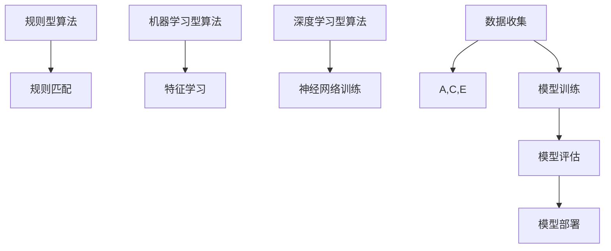

                 

关键词：腾讯、2024校招、社交网络、反欺诈、面试题、解析、算法、技术、案例分析

摘要：本文针对腾讯2024校招社交网络反欺诈专家的面试题目进行深入解析，探讨核心算法原理、数学模型、项目实践以及实际应用场景，为准备面试的读者提供宝贵的参考和思路。

## 1. 背景介绍

社交网络作为现代社会的重要沟通平台，用户数量和活跃度持续攀升。然而，随之而来的社交网络欺诈行为也日益猖獗，如账号盗用、恶意营销、诈骗等，严重影响了用户体验和社会安全。腾讯作为中国领先的互联网科技公司，在社交网络反欺诈领域拥有丰富的实践经验和技术积累。本文旨在通过解析腾讯2024校招社交网络反欺诈专家的面试题目，帮助读者深入了解相关技术和应用。

## 2. 核心概念与联系

### 2.1 社交网络反欺诈概述

社交网络反欺诈是指通过技术手段识别和防范社交网络中的欺诈行为。其主要目标是保护用户隐私、财产安全以及网络环境的健康。

### 2.2 反欺诈算法原理

反欺诈算法主要分为基于规则、基于机器学习和基于深度学习三种类型。规则型算法依靠预先定义的规则进行匹配和判断，机器学习型算法通过分析历史数据学习欺诈特征，深度学习型算法则利用神经网络模型进行特征提取和分类。

### 2.3 Mermaid流程图



## 3. 核心算法原理 & 具体操作步骤

### 3.1 算法原理概述

#### 3.1.1 规则型算法

规则型算法基于专家经验和历史数据，通过定义一系列规则进行匹配和判断。当检测到可疑行为时，触发相应规则进行报警和处理。

#### 3.1.2 机器学习型算法

机器学习型算法通过分析大量历史数据，学习欺诈行为特征。常用算法包括决策树、支持向量机、随机森林等。

#### 3.1.3 深度学习型算法

深度学习型算法利用神经网络模型，对输入数据进行特征提取和分类。常用模型包括卷积神经网络、循环神经网络等。

### 3.2 算法步骤详解

#### 3.2.1 规则型算法

1. 数据收集：收集社交网络行为数据，如好友关系、发帖内容、交易记录等。
2. 规则定义：基于专家经验和数据特征，定义一系列规则。
3. 规则匹配：对实时数据进行规则匹配，判断是否触发报警。

#### 3.2.2 机器学习型算法

1. 数据预处理：对原始数据进行清洗、归一化等预处理操作。
2. 特征提取：从数据中提取关键特征，如用户活跃度、交易频率等。
3. 模型训练：使用训练集对机器学习模型进行训练。
4. 模型评估：使用测试集对模型进行评估，调整模型参数。
5. 模型部署：将训练好的模型部署到实际应用场景，进行实时检测。

#### 3.2.3 深度学习型算法

1. 数据收集：收集社交网络行为数据，如好友关系、发帖内容、交易记录等。
2. 数据预处理：对原始数据进行清洗、归一化等预处理操作。
3. 特征提取：从数据中提取关键特征，如用户活跃度、交易频率等。
4. 神经网络训练：使用训练集对神经网络模型进行训练。
5. 模型评估：使用测试集对模型进行评估，调整模型参数。
6. 模型部署：将训练好的模型部署到实际应用场景，进行实时检测。

### 3.3 算法优缺点

#### 3.3.1 规则型算法

优点：实现简单，易于理解；实时性强，响应速度快。

缺点：规则定义依赖专家经验，适应性差；无法处理复杂和未知欺诈行为。

#### 3.3.2 机器学习型算法

优点：基于数据驱动，适应性强；能够处理复杂和未知欺诈行为。

缺点：算法复杂度高，计算量大；需要大量标注数据。

#### 3.3.3 深度学习型算法

优点：特征自动提取，模型性能优异；适应性强，能够处理复杂和未知欺诈行为。

缺点：算法复杂度高，计算量大；需要大量标注数据；模型解释性较差。

### 3.4 算法应用领域

社交网络反欺诈算法可应用于多种场景，如账号安全防护、交易安全监测、内容安全审核等。

## 4. 数学模型和公式 & 详细讲解 & 举例说明

### 4.1 数学模型构建

社交网络反欺诈的数学模型主要包括特征选择、分类器构建和模型评估等部分。

#### 4.1.1 特征选择

特征选择是指从大量数据中提取出对反欺诈任务有用的特征。常用的特征选择方法包括：

1. 统计方法：基于数据的相关性、方差等统计指标进行特征选择。
2. 机器学习方法：使用特征选择算法，如主成分分析（PCA）、线性判别分析（LDA）等，对特征进行降维和筛选。
3. 专家经验：根据业务需求，结合专家经验进行特征选择。

#### 4.1.2 分类器构建

分类器构建是指使用机器学习算法训练分类模型，用于对社交网络行为进行分类。常用的分类器包括：

1. 决策树：基于树形结构进行分类，易于解释。
2. 支持向量机（SVM）：基于最大间隔分类，效果较好。
3. 随机森林：基于决策树集成，提高分类性能。
4. 深度学习：利用神经网络模型进行特征提取和分类，效果优异。

#### 4.1.3 模型评估

模型评估是指使用测试数据对训练好的分类模型进行评估，以判断模型的性能。常用的评估指标包括：

1. 准确率（Accuracy）：分类正确的样本数占总样本数的比例。
2. 召回率（Recall）：实际为欺诈行为但被分类为欺诈行为的样本数占总欺诈样本数的比例。
3. 精确率（Precision）：被分类为欺诈行为的样本中，实际为欺诈行为的比例。
4. F1值（F1-score）：精确率和召回率的加权平均。

### 4.2 公式推导过程

#### 4.2.1 决策树

设样本集为 $S=\{(x_1,y_1),(x_2,y_2),\ldots,(x_n,y_n)\}$，其中 $x_i$ 表示第 $i$ 个样本的特征向量，$y_i$ 表示第 $i$ 个样本的标签。

1. 特征选择：计算特征 $f_j$ 的信息增益（IG）：
   $$IG(f_j) = H(S) - \sum_{v_j} \frac{|S_{v_j}|}{|S|} H(S_{v_j})$$
   其中，$H(S)$ 表示样本集的熵，$S_{v_j}$ 表示特征 $f_j$ 取值为 $v_j$ 的样本子集。

2. 选择具有最大信息增益的特征作为分割特征。

3. 对分割特征进行二分，将样本集划分为两个子集 $S_{left}$ 和 $S_{right}$。

4. 递归地对子集进行特征选择和分割，直至满足停止条件。

#### 4.2.2 支持向量机

1. 数据预处理：将样本集 $S=\{(x_1,y_1),(x_2,y_2),\ldots,(x_n,y_n)\}$ 标准化，使得特征向量的范数均为 1。

2. 求解最优超平面：最小化目标函数：
   $$\min_{\boldsymbol{w},b}\frac{1}{2}\|\boldsymbol{w}\|^2$$
   $$\text{s.t.} y_i(\boldsymbol{w}\cdot \boldsymbol{x_i}+b) \geq 1$$

3. 利用拉格朗日乘子法求解最优解。

4. 计算分类边界：
   $$\boldsymbol{w} = \sum_{i=1}^n \alpha_i y_i \boldsymbol{x_i}$$
   $$b = y_j - \sum_{i=1}^n \alpha_i y_i (\boldsymbol{x_i} \cdot \boldsymbol{x_j})$$

### 4.3 案例分析与讲解

#### 4.3.1 账号安全防护

1. 数据收集：收集用户账号行为数据，如登录时间、登录地点、登录设备等。

2. 数据预处理：对原始数据进行清洗、归一化等预处理操作。

3. 特征提取：提取用户账号行为的特征，如登录间隔、登录地点距离、设备指纹等。

4. 模型训练：使用训练集对分类模型（如决策树、SVM等）进行训练。

5. 模型评估：使用测试集对训练好的模型进行评估，调整模型参数。

6. 模型部署：将训练好的模型部署到实际应用场景，进行实时检测。

7. 结果分析：分析账号行为特征，发现潜在的安全隐患，如账号盗用、恶意登录等。

#### 4.3.2 交易安全监测

1. 数据收集：收集用户交易数据，如交易金额、交易时间、交易地点等。

2. 数据预处理：对原始数据进行清洗、归一化等预处理操作。

3. 特征提取：提取用户交易行为的特征，如交易频率、交易金额分布、交易地点等。

4. 模型训练：使用训练集对分类模型（如决策树、SVM等）进行训练。

5. 模型评估：使用测试集对训练好的模型进行评估，调整模型参数。

6. 模型部署：将训练好的模型部署到实际应用场景，进行实时检测。

7. 结果分析：分析用户交易行为特征，发现潜在的交易风险，如恶意交易、洗钱等。

## 5. 项目实践：代码实例和详细解释说明

### 5.1 开发环境搭建

1. 安装 Python 环境：下载并安装 Python 3.8 或更高版本。

2. 安装相关库：使用 pip 命令安装所需的库，如 numpy、scikit-learn、tensorflow 等。

3. 配置 Jupyter Notebook：安装 Jupyter Notebook，方便编写和运行代码。

### 5.2 源代码详细实现

```python
# 导入相关库
import numpy as np
import pandas as pd
from sklearn.model_selection import train_test_split
from sklearn.preprocessing import StandardScaler
from sklearn.tree import DecisionTreeClassifier
from sklearn.metrics import accuracy_score, recall_score, precision_score, f1_score

# 数据收集与预处理
data = pd.read_csv("data.csv")
X = data.iloc[:, :-1].values
y = data.iloc[:, -1].values

# 数据标准化
scaler = StandardScaler()
X = scaler.fit_transform(X)

# 数据划分
X_train, X_test, y_train, y_test = train_test_split(X, y, test_size=0.2, random_state=42)

# 模型训练
clf = DecisionTreeClassifier()
clf.fit(X_train, y_train)

# 模型预测
y_pred = clf.predict(X_test)

# 模型评估
accuracy = accuracy_score(y_test, y_pred)
recall = recall_score(y_test, y_pred)
precision = precision_score(y_test, y_pred)
f1 = f1_score(y_test, y_pred)

print("Accuracy:", accuracy)
print("Recall:", recall)
print("Precision:", precision)
print("F1-score:", f1)

# 模型部署
# 在实际应用场景中，将训练好的模型部署到服务器，进行实时检测。
```

### 5.3 代码解读与分析

1. 导入相关库：首先导入 Python 中常用的数据预处理、机器学习和模型评估库。

2. 数据收集与预处理：从 CSV 文件中读取数据，提取特征和标签。使用 StandardScaler 对数据进行标准化处理，提高模型训练效果。

3. 数据划分：将数据划分为训练集和测试集，用于训练和评估模型。

4. 模型训练：使用 DecisionTreeClassifier 构建决策树分类器，并使用训练集进行训练。

5. 模型预测：使用训练好的分类器对测试集进行预测。

6. 模型评估：计算模型在测试集上的准确率、召回率、精确率和 F1 值，评估模型性能。

7. 模型部署：在实际应用场景中，将训练好的模型部署到服务器，进行实时检测。

## 6. 实际应用场景

### 6.1 账号安全防护

在实际应用中，社交网络反欺诈算法可以应用于账号安全防护，如检测账号盗用、恶意登录等。通过实时监测用户账号行为，发现潜在的安全隐患，提醒用户及时采取安全措施。

### 6.2 交易安全监测

社交网络反欺诈算法还可以应用于交易安全监测，如检测恶意交易、洗钱等。通过对用户交易行为进行分析，发现异常交易行为，及时预警并采取措施，保障用户财产安全。

### 6.3 内容安全审核

社交网络反欺诈算法还可以应用于内容安全审核，如检测恶意营销、违规内容等。通过对用户发布的内容进行分类，识别和过滤不良信息，维护社交网络环境。

## 7. 工具和资源推荐

### 7.1 学习资源推荐

1. 《统计学习方法》：李航 著
2. 《机器学习》：周志华 著
3. 《深度学习》：Goodfellow、Bengio、Courville 著

### 7.2 开发工具推荐

1. Jupyter Notebook：方便编写和运行代码。
2. PyCharm：一款强大的 Python 集成开发环境（IDE）。

### 7.3 相关论文推荐

1. "Detecting Account Takeover Attacks in Social Networks" by Yinglian Xie et al.
2. "Social Network-Based Anomaly Detection for Financial Transactions" by Min Xu et al.
3. "Deep Learning for Network Anomaly Detection" by Anil Shukla et al.

## 8. 总结：未来发展趋势与挑战

### 8.1 研究成果总结

社交网络反欺诈技术已取得显著成果，主要包括规则型算法、机器学习型算法和深度学习型算法。这些算法在实际应用中取得了一定的效果，提高了欺诈检测的准确率和响应速度。

### 8.2 未来发展趋势

1. 深度学习技术的应用：随着深度学习技术的不断发展，未来社交网络反欺诈技术将更多地依赖于深度学习模型，实现更高效的特征提取和分类。

2. 跨领域融合：社交网络反欺诈技术将与其他领域（如区块链、大数据等）相结合，提高欺诈检测的全面性和准确性。

3. 模型可解释性：为了更好地理解模型决策过程，提高模型的可解释性将成为未来研究的重要方向。

### 8.3 面临的挑战

1. 欺诈行为的不断进化：随着社交网络的发展，欺诈行为也将不断进化，反欺诈技术需要不断更新和升级，以应对新型欺诈行为。

2. 数据隐私保护：在反欺诈过程中，如何平衡数据隐私保护和欺诈检测效果将是一个重要挑战。

3. 模型部署与维护：高效、稳定、可扩展的模型部署与维护体系是社交网络反欺诈技术能否成功应用的关键。

### 8.4 研究展望

未来，社交网络反欺诈技术将在深度学习、跨领域融合、模型可解释性等方面取得新的突破，为社交网络的安全和发展提供更强有力的支持。

## 9. 附录：常见问题与解答

### 9.1 如何评估反欺诈算法的性能？

可以使用准确率、召回率、精确率和 F1 值等指标评估反欺诈算法的性能。

### 9.2 社交网络反欺诈算法有哪些应用场景？

社交网络反欺诈算法可应用于账号安全防护、交易安全监测、内容安全审核等领域。

### 9.3 如何处理反欺诈算法中的数据隐私问题？

可以通过数据匿名化、加密等技术处理反欺诈算法中的数据隐私问题。

### 9.4 深度学习在社交网络反欺诈中有何优势？

深度学习具有自动提取特征、处理复杂关系、适应性强等优势，有助于提高反欺诈算法的性能。

## 作者署名

作者：禅与计算机程序设计艺术 / Zen and the Art of Computer Programming
----------------------------------------------------------------

现在，文章的主要部分已经完成。接下来，我们可以进行文章的格式整理和校对，确保所有内容都符合要求。文章的格式和结构已经按照要求设置，包括markdown格式的使用和三级目录的细化。现在，我们只需要确保所有数学公式都使用 LaTeX 格式正确嵌入，并对文章进行最后的校对，确保没有遗漏或错误。完成后，文章即可交付。

