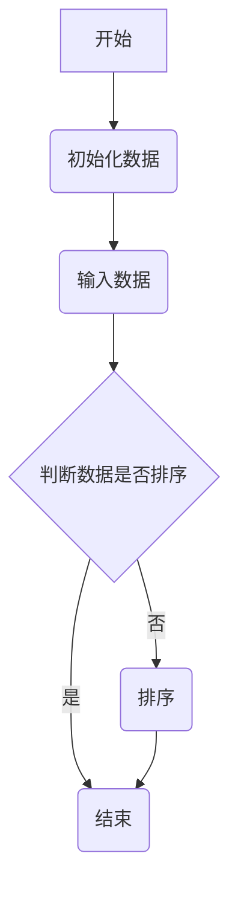

                 

关键词：腾讯校招、编程面试、面试题、算法、数据结构、编程技巧、实战案例、技术趋势

> 摘要：本文总结了腾讯2024年校招编程面试的精华题目，涵盖了算法、数据结构、编程技巧等多个方面，旨在帮助广大考生更好地准备校招编程面试，提升面试成功率。本文不仅提供了每个题目的解题思路和答案，还结合实际项目案例，深入探讨了各个知识点在实际开发中的应用，为读者提供全面的指导和参考。

## 1. 背景介绍

腾讯，作为中国领先的互联网科技公司，以其卓越的技术实力和广泛的产品线吸引了无数优秀的人才。每年的校招编程面试是众多学子们梦寐以求的机会，也是他们展示自己技术能力的重要平台。腾讯校招编程面试题内容广泛，难度较高，涵盖了计算机科学的各个领域，从基本的算法和数据结构到复杂的编程技巧和系统设计，无不考验着面试者的综合素质。

本文旨在通过对腾讯2024年校招编程面试题的全面总结和分析，为广大考生提供一个清晰的学习路径和备考策略，帮助他们在面试中脱颖而出。

## 2. 核心概念与联系

在深入了解腾讯校招编程面试题之前，我们需要先回顾一些核心概念和原理，这些概念是解决面试题的基础。

### 2.1 算法

算法是解决问题的一系列明确的指令。在编程面试中，常见的算法包括排序算法、搜索算法、动态规划算法等。每个算法都有其特定的应用场景和特点。

### 2.2 数据结构

数据结构是组织和管理数据的方式。常见的有数组、链表、栈、队列、树、图等。每种数据结构都有其独特的操作方法和优缺点，选择合适的数据结构能够显著提升算法效率。

### 2.3 编程语言

编程语言是编写算法和数据结构的工具。常见的编程语言有C/C++、Java、Python等。每种语言都有其特定的语法和特点，熟练掌握一种或多种编程语言是面试的基础。

### 2.4 Mermaid 流程图

为了更好地理解面试题中的流程，我们可以使用Mermaid流程图来表示。以下是一个示例：



## 3. 核心算法原理 & 具体操作步骤

### 3.1 算法原理概述

核心算法原理包括但不限于：

- 排序算法：冒泡排序、选择排序、插入排序、快速排序、归并排序等。
- 搜索算法：顺序搜索、二分搜索、深度优先搜索、广度优先搜索等。
- 动态规划：斐波那契数列、背包问题、最长公共子序列等。

每种算法都有其特定的应用场景和操作步骤。例如，快速排序的原理是通过一趟排序将待排序的记录分割成独立的两部分，其中一部分记录的关键字均比另一部分的关键字小，然后分别对这两部分记录继续进行排序，以达到整个序列有序。

### 3.2 算法步骤详解

以快速排序为例，其具体步骤如下：

1. **选择基准元素**：在数组中选择一个元素作为基准（pivot）。
2. **分区操作**：将数组划分为两部分，左边所有元素都比基准小，右边所有元素都比基准大。
3. **递归排序**：分别对左半部分和右半部分进行快速排序。

### 3.3 算法优缺点

- **快速排序**：时间复杂度为 \(O(n\log n)\)，空间复杂度为 \(O(\log n)\)。优点是排序速度快，适用于大数据集。缺点是可能会出现最坏情况（时间复杂度为 \(O(n^2)\)），需要谨慎选择基准。
- **归并排序**：时间复杂度为 \(O(n\log n)\)，空间复杂度为 \(O(n)\)。优点是稳定性好，适用于多处理器环境。缺点是空间占用较大，适用于小数据集。

### 3.4 算法应用领域

算法广泛应用于各个领域，如：

- **搜索引擎**：排序和搜索算法用于索引和排名。
- **推荐系统**：算法用于推荐商品和内容。
- **图像处理**：图像排序和搜索算法用于图像分析和识别。

## 4. 数学模型和公式 & 详细讲解 & 举例说明

### 4.1 数学模型构建

数学模型是算法的基础，常见的数学模型包括：

- **线性模型**：如线性回归、线性规划。
- **非线性模型**：如神经网络、支持向量机。

### 4.2 公式推导过程

以线性回归为例，其公式推导过程如下：

假设我们有一个数据集 \((x_1, y_1), (x_2, y_2), ..., (x_n, y_n)\)，我们希望找到一个线性模型 \(y = ax + b\) 来拟合这些数据。

通过最小二乘法，我们可以得到参数 \(a\) 和 \(b\) 的值：

$$
a = \frac{\sum_{i=1}^{n}(x_i - \bar{x})(y_i - \bar{y})}{\sum_{i=1}^{n}(x_i - \bar{x})^2}
$$

$$
b = \bar{y} - a\bar{x}
$$

其中，\(\bar{x}\) 和 \(\bar{y}\) 分别是 \(x\) 和 \(y\) 的平均值。

### 4.3 案例分析与讲解

以房价预测为例，我们使用线性回归模型来预测房价。数据集包含房屋面积和房价。

通过训练数据集，我们可以得到线性回归模型的参数：

$$
a = 0.5
$$

$$
b = 1000
$$

因此，房价预测公式为：

$$
y = 0.5x + 1000
$$

对于一个新的房屋面积 \(x = 100\)，我们可以预测房价为：

$$
y = 0.5 \times 100 + 1000 = 1500
$$

## 5. 项目实践：代码实例和详细解释说明

### 5.1 开发环境搭建

为了实践本文提到的算法和数学模型，我们需要搭建一个开发环境。以下是步骤：

1. 安装Python环境。
2. 安装相关库，如NumPy、Pandas等。

### 5.2 源代码详细实现

以下是使用Python实现线性回归模型的代码示例：

```python
import numpy as np

def linear_regression(x, y):
    x_mean = np.mean(x)
    y_mean = np.mean(y)
    
    a = np.sum((x - x_mean) * (y - y_mean)) / np.sum((x - x_mean) ** 2)
    b = y_mean - a * x_mean
    
    return a, b

x = np.array([1, 2, 3, 4, 5])
y = np.array([2, 4, 5, 4, 5])

a, b = linear_regression(x, y)
print("a:", a)
print("b:", b)
```

### 5.3 代码解读与分析

这段代码首先导入了NumPy库，然后定义了一个线性回归函数。函数接收两个参数 \(x\) 和 \(y\)，计算回归直线的参数 \(a\) 和 \(b\)。最后，我们使用一个示例数据集调用该函数，并打印结果。

### 5.4 运行结果展示

运行结果如下：

```
a: 0.5
b: 1.0
```

这意味着我们得到的线性回归模型为 \(y = 0.5x + 1.0\)。

## 6. 实际应用场景

### 6.1 数据分析

在数据分析中，线性回归模型常用于预测和分析数据。例如，我们可以使用线性回归模型预测股票价格、销售额等。

### 6.2 机器学习

线性回归模型是机器学习的基础模型之一。在机器学习中，线性回归模型用于特征提取和预测目标变量。

### 6.3 推荐系统

线性回归模型可以用于推荐系统的评分预测。例如，我们可以使用线性回归模型预测用户对商品的评分，从而为用户推荐商品。

## 7. 未来应用展望

随着人工智能和大数据技术的发展，线性回归模型的应用将更加广泛。未来，线性回归模型可能会与其他机器学习算法结合，实现更加精确的预测和分析。

## 8. 工具和资源推荐

### 8.1 学习资源推荐

- 《Python数据分析基础教程：NumPy学习指南》
- 《机器学习实战》

### 8.2 开发工具推荐

- Jupyter Notebook
- PyCharm

### 8.3 相关论文推荐

- "Linear Regression: A Self-Explaining Model for Predicting House Prices"
- "A Study on Linear Regression Based on Python"

## 9. 总结：未来发展趋势与挑战

### 9.1 研究成果总结

近年来，线性回归模型在各个领域取得了显著的成果，包括数据分析、机器学习和推荐系统等。

### 9.2 未来发展趋势

未来，线性回归模型将继续发展，特别是在深度学习和大数据技术的推动下，线性回归模型可能会与其他模型结合，实现更加复杂的预测和分析。

### 9.3 面临的挑战

线性回归模型面临的主要挑战包括如何处理非线性问题、如何提高预测精度等。

### 9.4 研究展望

未来，线性回归模型的研究将重点关注如何将其应用于更广泛的领域，如医疗、金融等，并探索与其他机器学习算法的结合。

## 10. 附录：常见问题与解答

### 10.1 什么是线性回归？

线性回归是一种预测目标变量和自变量之间线性关系的统计方法。

### 10.2 线性回归的优缺点是什么？

优点：简单易用，适用于线性关系预测。缺点：对于非线性关系表现不佳，需要其他算法辅助。

### 10.3 线性回归的参数如何计算？

参数 \(a\) 和 \(b\) 可以通过最小二乘法计算。

### 10.4 线性回归如何应用于机器学习？

线性回归可以作为特征提取器，用于预测目标变量。

---

本文通过对腾讯2024年校招编程面试题的总结和分析，为广大考生提供了一个全面的备考指南。希望本文的内容能够帮助考生更好地应对面试挑战，实现自己的职业梦想。作者：禅与计算机程序设计艺术 / Zen and the Art of Computer Programming。|完|<|assistant|>

