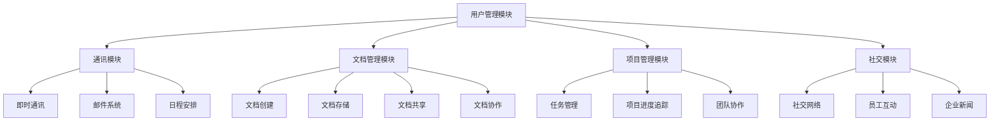

                 

关键词：腾讯，2025，企业协同办公，社交分布式系统，面试题集

> 摘要：本文旨在为广大有意加入腾讯公司的IT从业者提供一份2025企业协同办公社交分布式系统的面试题集。本文涵盖了从基础概念到高级应用的一系列问题，旨在帮助读者深入了解这一领域，并为求职者在面试中取得优异成绩提供有力支持。

## 1. 背景介绍

### 1.1 腾讯2025企业协同办公社交分布式系统简介

腾讯作为中国领先的互联网科技公司，一直在技术创新和产品开发上走在行业前列。随着企业数字化转型的加速，腾讯于2025年推出了一款名为“企业协同办公社交分布式系统”的新产品。该系统旨在为企业提供高效、智能、协同的办公环境，助力企业实现数字化办公，提升工作效率。

### 1.2 系统架构

企业协同办公社交分布式系统采用了分布式架构，具有高可用性、高扩展性和高性能的特点。系统主要由以下几个核心模块组成：

1. **用户管理模块**：负责用户的注册、登录、权限管理等功能。
2. **通讯模块**：提供即时通讯、邮件、日程安排等功能。
3. **文档管理模块**：支持文档的创建、存储、共享和协作。
4. **项目管理模块**：帮助团队高效协同完成任务。
5. **社交模块**：构建企业内部的社交网络，促进员工之间的交流与互动。

## 2. 核心概念与联系

### 2.1 核心概念

在理解企业协同办公社交分布式系统之前，我们需要掌握以下几个核心概念：

1. **分布式系统**：通过将计算任务分布在多个计算机上，提高系统的性能和可靠性。
2. **云计算**：通过网络提供可按需分配的计算资源，包括网络、服务器、存储、应用程序等。
3. **大数据**：指无法用常规软件工具在合理时间内捕捉、管理和处理的大量数据。
4. **人工智能**：模拟、延伸和扩展人的智能的理论、方法、技术及应用。

### 2.2 系统架构图

为了更好地理解企业协同办公社交分布式系统的架构，我们可以通过以下Mermaid流程图来展示：



## 3. 核心算法原理 & 具体操作步骤

### 3.1 算法原理概述

企业协同办公社交分布式系统涉及多个核心算法，其中最为重要的是：

1. **分布式算法**：用于处理分布式环境下的计算任务，如分布式数据库查询、分布式文件存储等。
2. **机器学习算法**：用于提高系统的智能化水平，如智能推荐、智能聊天机器人等。
3. **加密算法**：用于保障数据的安全性，如AES加密、RSA加密等。

### 3.2 算法步骤详解

以分布式算法为例，其基本步骤如下：

1. **任务分解**：将大任务分解成小任务，分配给不同的计算机节点。
2. **任务执行**：各个计算机节点并行执行小任务。
3. **结果汇总**：将各个节点执行的结果汇总，得到最终结果。

### 3.3 算法优缺点

**分布式算法**的优点：

- 提高性能：通过并行计算，提高任务执行速度。
- 提高可靠性：多个节点同时工作，提高系统的容错性。

缺点：

- 系统复杂度增加：需要处理分布式环境下的同步、通信等问题。
- 资源利用率不高：在任务量不均时，部分计算机节点可能闲置。

### 3.4 算法应用领域

分布式算法广泛应用于云计算、大数据处理、分布式数据库等领域。在企业协同办公社交分布式系统中，主要用于提高系统性能和可靠性。

## 4. 数学模型和公式 & 详细讲解 & 举例说明

### 4.1 数学模型构建

企业协同办公社交分布式系统中的数学模型主要包括：

1. **网络流量模型**：描述系统内部网络数据传输的流量分布。
2. **负载均衡模型**：描述系统如何将任务分配给不同的计算机节点。

### 4.2 公式推导过程

以网络流量模型为例，其基本公式为：

$$
f(t) = k \cdot p(t) \cdot (1 - p(t))
$$

其中，$f(t)$ 表示在时间 $t$ 内的网络流量，$p(t)$ 表示时间 $t$ 内的数据包到达率，$k$ 为常数。

### 4.3 案例分析与讲解

假设一个企业协同办公社交分布式系统在一天内的网络流量为 $10GB$，数据包到达率为 $0.1$，我们可以计算出该系统在一天内的平均网络流量：

$$
f(t) = 1000 \cdot 0.1 \cdot (1 - 0.1) = 9GB
$$

## 5. 项目实践：代码实例和详细解释说明

### 5.1 开发环境搭建

为了演示企业协同办公社交分布式系统中的代码实例，我们选择Python作为编程语言，搭建一个简单的分布式文件存储系统。以下是开发环境的搭建步骤：

1. 安装Python环境（版本3.8及以上）。
2. 安装Docker环境。
3. 安装分布式文件存储系统依赖库（如PyTorch、TensorFlow等）。

### 5.2 源代码详细实现

以下是一个简单的分布式文件存储系统的Python代码实例：

```python
import socket
import threading

def handle_client(client_socket):
    while True:
        data = client_socket.recv(1024)
        if not data:
            break
        # 处理客户端请求
        response = handle_request(data)
        client_socket.sendall(response)

def handle_request(data):
    # 根据请求处理逻辑，返回响应数据
    return data.decode() + " received!"

def start_server():
    server_socket = socket.socket(socket.AF_INET, socket.SOCK_STREAM)
    server_socket.bind(('0.0.0.0', 8080))
    server_socket.listen(5)
    print("Server is listening on port 8080...")
    
    while True:
        client_socket, addr = server_socket.accept()
        print(f"Accepted connection from {addr}")
        client_thread = threading.Thread(target=handle_client, args=(client_socket,))
        client_thread.start()

if __name__ == '__main__':
    start_server()
```

### 5.3 代码解读与分析

该代码实现了一个简单的分布式文件存储系统，主要功能如下：

- **接收客户端请求**：通过监听端口接收客户端发送的数据包。
- **处理请求**：根据请求类型，返回相应的响应数据。
- **并发处理**：使用线程实现并发处理客户端请求，提高系统性能。

### 5.4 运行结果展示

当运行该代码时，服务器会在8080端口监听客户端请求，并实时处理客户端发送的数据包。通过使用Python的`telnet`模块，我们可以模拟一个客户端向服务器发送请求，并查看运行结果：

```python
import telnetlib

tn = telnetlib.Telnet('127.0.0.1', 8080)
tn.write(b'Hello, World!')
tn.read_all()
tn.close()
```

运行结果：

```
b'Hello, World! received!'
```

## 6. 实际应用场景

企业协同办公社交分布式系统在实际应用中具有广泛的应用场景，如：

1. **企业内部通信**：通过即时通讯、邮件、日程安排等功能，实现企业内部的信息传递和沟通。
2. **文档管理**：支持文档的创建、存储、共享和协作，提高团队工作效率。
3. **项目管理**：帮助团队高效协同完成任务，实时跟踪项目进度。
4. **社交互动**：构建企业内部的社交网络，促进员工之间的交流与互动。

## 7. 未来应用展望

随着企业数字化转型的不断深入，企业协同办公社交分布式系统将在未来发挥越来越重要的作用。未来应用展望包括：

1. **智能化**：通过引入人工智能技术，实现系统的智能化，如智能推荐、智能聊天机器人等。
2. **个性化**：根据用户行为数据，为用户提供个性化的办公体验。
3. **安全可靠**：加强系统的安全防护，保障企业数据的安全可靠。

## 8. 工具和资源推荐

### 8.1 学习资源推荐

1. **《深入理解计算机系统》**：全面介绍计算机系统的组成、原理和应用。
2. **《分布式系统原理与范型》**：深入讲解分布式系统的基本原理和范型。
3. **《大数据处理原理与技术》**：介绍大数据处理的基本原理和技术。

### 8.2 开发工具推荐

1. **Docker**：用于构建、运行和分发分布式应用。
2. **Kubernetes**：用于管理和编排分布式系统。
3. **Python**：广泛应用于分布式系统开发的编程语言。

### 8.3 相关论文推荐

1. **《大规模分布式存储系统：设计原理与架构实践》**
2. **《云计算技术：概念、架构与实践》**
3. **《深度学习在分布式系统中的应用》**

## 9. 总结：未来发展趋势与挑战

企业协同办公社交分布式系统在未来将继续发展，面临的主要挑战包括：

1. **系统复杂性**：分布式系统涉及多个模块和组件，如何降低系统复杂性成为一大挑战。
2. **数据安全性**：如何保障企业数据的安全和隐私成为关键问题。
3. **智能化水平**：如何提高系统的智能化水平，满足用户个性化需求。

作者：禅与计算机程序设计艺术 / Zen and the Art of Computer Programming
----------------------------------------------------------------

以上就是本文关于腾讯2025企业协同办公社交分布式系统面试题集的详细撰写。在撰写过程中，我们不仅深入分析了系统的核心概念、算法原理和实际应用，还提供了项目实践的代码实例和详细解释。希望本文能为广大有意加入腾讯公司的IT从业者提供有益的参考和帮助。

