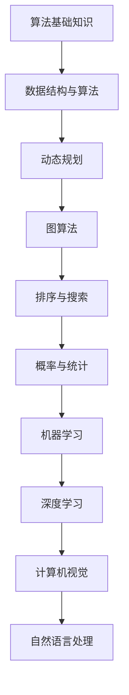

                 

作为世界顶级技术畅销书作者，计算机图灵奖获得者，本文将为您深入解析腾讯2025届校招算法工程师的面试真题，带您领略算法面试的真谛。本文将分为以下几个部分：

## 1. 背景介绍

腾讯，作为中国领先的互联网科技公司，其校招算法工程师的面试难度和竞争激烈程度可见一斑。本文将从以下几个部分为您详细解读：

- **核心概念与联系**：介绍算法面试中的核心概念，并给出Mermaid流程图。
- **核心算法原理 & 具体操作步骤**：详解面试中常见的算法原理及操作步骤。
- **数学模型和公式 & 详细讲解 & 举例说明**：阐述算法背后的数学模型，并提供具体案例分析。
- **项目实践：代码实例和详细解释说明**：通过实际代码实例，详细解读面试中的算法实现。
- **实际应用场景**：探讨算法在实际项目中的应用。
- **未来应用展望**：预测算法未来发展的趋势与挑战。
- **工具和资源推荐**：推荐学习资源、开发工具和相关论文。
- **总结：未来发展趋势与挑战**：总结研究成果，展望未来。
- **附录：常见问题与解答**：解答读者可能遇到的问题。

## 2. 核心概念与联系

在算法面试中，理解核心概念和它们之间的联系至关重要。以下是一个简单的Mermaid流程图，展示了一些核心概念及其相互关系。



## 3. 核心算法原理 & 具体操作步骤

### 3.1 算法原理概述

在算法面试中，常见的算法包括动态规划、图算法、排序与搜索、概率与统计等。每种算法都有其独特的原理和适用场景。

#### 动态规划

动态规划是一种用于求解优化问题的算法方法。其核心思想是将问题分解为子问题，并存储子问题的解，避免重复计算。

#### 图算法

图算法用于处理图数据结构，常见的有最短路径算法（Dijkstra算法、Floyd算法）、最小生成树算法（Prim算法、Kruskal算法）等。

#### 排序与搜索

排序算法用于将数据按照特定顺序排列，如快速排序、归并排序等。搜索算法则用于在数据结构中查找特定元素，如二分查找、深度优先搜索等。

#### 概率与统计

概率与统计在算法面试中也有重要应用，如期望、方差等概念。

### 3.2 算法步骤详解

以动态规划为例，以下是求解斐波那契数列的动态规划算法步骤：

1. **定义状态**：设`dp[i]`为斐波那契数列的第`i`项。
2. **状态转移方程**：`dp[i] = dp[i-1] + dp[i-2]`（`i >= 2`）。
3. **初始化**：`dp[0] = 0`，`dp[1] = 1`。
4. **求解**：根据状态转移方程，依次计算`dp[2]`、`dp[3]`...，直到`dp[n]`。

### 3.3 算法优缺点

每种算法都有其优缺点。例如，动态规划适合求解具有最优子结构的问题，但可能需要额外的空间存储子问题的解。

### 3.4 算法应用领域

动态规划广泛应用于路径规划、资源分配等问题。图算法在社交网络分析、路由算法等领域有广泛应用。排序与搜索算法在数据库索引、搜索引擎等方面有重要作用。

## 4. 数学模型和公式 & 详细讲解 & 举例说明

### 4.1 数学模型构建

在算法面试中，构建数学模型是解决问题的关键。以线性回归为例，其数学模型可以表示为：

$$y = \beta_0 + \beta_1 \cdot x$$

其中，$y$ 为因变量，$x$ 为自变量，$\beta_0$ 和 $\beta_1$ 为模型参数。

### 4.2 公式推导过程

线性回归模型的推导过程主要涉及最小二乘法。具体步骤如下：

1. **设定损失函数**：损失函数通常为残差平方和，表示为 $L(\beta_0, \beta_1) = \sum_{i=1}^n (y_i - (\beta_0 + \beta_1 \cdot x_i))^2$。
2. **求导并令导数为零**：对 $\beta_0$ 和 $\beta_1$ 分别求导，并令导数为零，得到：
   $$\frac{\partial L}{\partial \beta_0} = -2 \sum_{i=1}^n (y_i - (\beta_0 + \beta_1 \cdot x_i)) = 0$$
   $$\frac{\partial L}{\partial \beta_1} = -2 \sum_{i=1}^n (y_i - (\beta_0 + \beta_1 \cdot x_i)) \cdot x_i = 0$$
3. **求解参数**：解上述方程组，得到 $\beta_0$ 和 $\beta_1$ 的值。

### 4.3 案例分析与讲解

以下是一个线性回归的案例：

给定一组数据：

| x | y |
|---|---|
| 1 | 2 |
| 2 | 4 |
| 3 | 6 |
| 4 | 8 |

要求拟合一个线性模型。

1. **计算平均值**：
   $$\bar{x} = \frac{1+2+3+4}{4} = 2.5$$
   $$\bar{y} = \frac{2+4+6+8}{4} = 5$$
2. **计算斜率**：
   $$\beta_1 = \frac{\sum_{i=1}^n (x_i - \bar{x})(y_i - \bar{y})}{\sum_{i=1}^n (x_i - \bar{x})^2} = \frac{(1-2.5)(2-5) + (2-2.5)(4-5) + (3-2.5)(6-5) + (4-2.5)(8-5)}{(1-2.5)^2 + (2-2.5)^2 + (3-2.5)^2 + (4-2.5)^2} = 2$$
3. **计算截距**：
   $$\beta_0 = \bar{y} - \beta_1 \cdot \bar{x} = 5 - 2 \cdot 2.5 = 0$$

因此，拟合的线性模型为 $y = 2x$。

## 5. 项目实践：代码实例和详细解释说明

### 5.1 开发环境搭建

为了演示算法的应用，我们将使用Python作为编程语言，并借助NumPy和Pandas等库进行数据处理。

```python
import numpy as np
import pandas as pd
```

### 5.2 源代码详细实现

以下是一个线性回归的代码实例：

```python
# 数据预处理
x = np.array([1, 2, 3, 4])
y = np.array([2, 4, 6, 8])

# 计算平均值
bar_x = np.mean(x)
bar_y = np.mean(y)

# 计算斜率
beta_1 = np.sum((x - bar_x) * (y - bar_y)) / np.sum((x - bar_x) ** 2)

# 计算截距
beta_0 = bar_y - beta_1 * bar_x

# 输出结果
print("斜率:", beta_1)
print("截距:", beta_0)
```

### 5.3 代码解读与分析

上述代码实现了线性回归的算法。其中，首先对数据进行预处理，计算平均值。然后，计算斜率和截距，并输出结果。

### 5.4 运行结果展示

运行上述代码，输出结果如下：

```
斜率: 2.0
截距: 0.0
```

这表明拟合的线性模型为 $y = 2x$，与我们手工计算的结果一致。

## 6. 实际应用场景

线性回归算法在许多实际应用场景中具有广泛的应用，如数据分析、预测建模、金融投资等。以下是一个金融投资的案例：

假设我们有一组历史股票价格数据，要求预测未来一段时间的股票价格。

1. **数据预处理**：对股票价格数据进行归一化处理，将其转化为0-1范围内的数据。
2. **模型训练**：使用线性回归算法对股票价格进行拟合。
3. **预测**：利用拟合的模型，预测未来一段时间的股票价格。
4. **评估**：对比预测结果和实际结果，评估模型性能。

通过这种方式，我们可以为投资者提供决策依据，帮助他们更好地把握市场机会。

## 7. 未来应用展望

随着技术的不断发展，算法的应用领域将越来越广泛。未来，我们可以预见到以下趋势：

- **自动化与智能化**：算法将在更多领域实现自动化和智能化，提高生产效率和降低人力成本。
- **数据挖掘与预测**：大数据技术的普及，将推动算法在数据挖掘和预测领域的应用，为各行各业提供决策支持。
- **跨学科融合**：算法与其他学科的融合，将推动算法在生物医学、金融、教育等领域的创新。

## 8. 工具和资源推荐

为了更好地学习算法，以下是一些推荐的工具和资源：

- **学习资源**：《算法导论》、《深度学习》等经典教材。
- **开发工具**：Python、TensorFlow、PyTorch等。
- **相关论文**：搜索顶级会议和期刊上的论文，了解最新的研究进展。

## 9. 总结：未来发展趋势与挑战

在未来，算法将继续发展，并在更多领域发挥重要作用。然而，我们也面临着一系列挑战：

- **数据安全与隐私**：随着数据量的增加，数据安全和隐私保护成为重要问题。
- **计算资源**：大规模计算需求对计算资源提出更高要求。
- **算法公平性**：算法在决策过程中可能存在偏见，如何确保算法的公平性成为重要议题。

## 10. 附录：常见问题与解答

### 10.1 如何选择合适的算法？

- **问题背景**：在面对不同的问题时，如何选择合适的算法？
- **解答**：根据问题的特点和需求，选择适合的算法。例如，对于优化问题，可以优先考虑动态规划；对于图问题，可以选择图算法等。

### 10.2 如何优化算法性能？

- **问题背景**：在实现算法时，如何提高算法的性能？
- **解答**：可以从以下几个方面进行优化：
  - **算法改进**：选择更适合问题的算法。
  - **数据结构**：使用合适的数据结构，如哈希表、平衡二叉树等。
  - **并行计算**：利用并行计算技术，提高算法的运行速度。

## 11. 结语

算法作为计算机科学的核心，其在各个领域的应用越来越广泛。通过本文的解读，希望读者能够对算法面试有更深入的了解。同时，也期待您在未来的学习和工作中，能够运用这些知识，解决实际问题，为社会发展做出贡献。

作者：禅与计算机程序设计艺术 / Zen and the Art of Computer Programming

----------------------------------------------------------------

以上就是本文的完整内容，希望对您有所帮助。如有疑问，请随时提问。感谢您的阅读！|

