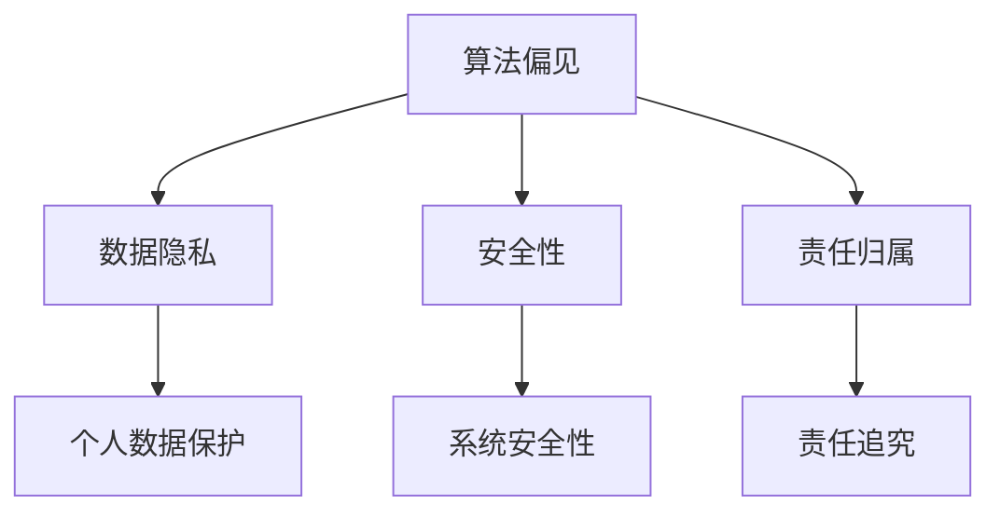

                 

 作为一位世界顶级人工智能专家，我们深知在人工智能迅速发展的时代，伦理问题成为了不容忽视的重要议题。本文将基于腾讯2025社招AI伦理专家面试题汇总，系统性地探讨人工智能伦理的各个方面，旨在为AI领域的从业者提供一份全面的参考。本文将围绕以下核心内容展开：

- 背景介绍
- 核心概念与联系
- 核心算法原理与具体操作步骤
- 数学模型和公式
- 项目实践
- 实际应用场景
- 未来应用展望
- 工具和资源推荐
- 总结：未来发展趋势与挑战
- 附录：常见问题与解答

## 文章关键词
- 人工智能伦理
- AI面试题
- 伦理专家
- 腾讯
- 社招
- 核心概念
- 算法原理
- 数学模型
- 项目实践
- 应用场景
- 未来展望
- 工具推荐

## 文章摘要
本文通过对腾讯2025社招AI伦理专家面试题的汇总分析，深入探讨了人工智能伦理的关键问题。从背景介绍到实际应用场景，再到未来展望，本文旨在为AI领域的从业者提供一份全面的指南，以应对日益复杂的人工智能伦理挑战。

### 1. 背景介绍

人工智能（AI）的快速发展给我们的生活带来了前所未有的便利，但也引发了诸多伦理问题。从数据隐私、算法偏见到安全性和责任归属，这些问题不仅关乎技术的可持续发展，也关乎社会的公平与正义。

随着人工智能技术的广泛应用，各大公司纷纷开始重视AI伦理问题。腾讯作为国内领先的互联网科技公司，其2025年社招AI伦理专家面试题的发布，标志着人工智能伦理问题的正式进入企业招聘的核心关注点。

本文旨在通过对这些面试题的深入分析，梳理出人工智能伦理的核心议题，为从业者提供参考。同时，本文也将探讨这些问题的解决方案，以及未来可能的发展趋势和挑战。

### 2. 核心概念与联系

在探讨人工智能伦理之前，我们首先需要明确一些核心概念，如算法偏见、数据隐私、安全性和责任归属等。

#### 2.1 算法偏见

算法偏见是指算法在数据处理过程中，由于数据本身的不公平性或算法设计中的缺陷，导致算法对某些群体或个体产生不公平的结果。例如，在招聘算法中，如果训练数据中存在性别或种族偏见，那么算法可能会在招聘过程中对这些群体产生偏见。

#### 2.2 数据隐私

数据隐私是指个人数据的保护，防止未经授权的访问、使用或泄露。随着人工智能技术的应用，个人数据的价值越来越受到重视，但同时也带来了数据隐私保护的问题。

#### 2.3 安全性

人工智能的安全性涉及多个方面，包括系统的安全性、数据的保护、算法的透明性和可解释性等。确保人工智能系统的安全性，是保障人工智能技术可持续发展的重要前提。

#### 2.4 责任归属

在人工智能应用中，责任归属问题是一个复杂且具有争议的话题。当人工智能系统出现错误或造成损害时，应如何确定责任归属，如何追究责任，是当前亟待解决的问题。

#### 2.5 Mermaid 流程图

为了更好地理解这些核心概念之间的联系，我们可以使用Mermaid流程图进行展示。



### 3. 核心算法原理 & 具体操作步骤

在了解核心概念后，我们接下来将探讨一些与人工智能伦理相关的重要算法原理和具体操作步骤。

#### 3.1 算法原理概述

人工智能伦理的核心在于如何确保算法的公平性、透明性和可解释性。以下是一些关键的算法原理：

- **公平性**：确保算法在不同群体中的表现一致，避免因数据或算法本身的问题导致偏见。
- **透明性**：使算法的操作过程和决策逻辑透明，便于用户和监管机构进行审查和监督。
- **可解释性**：使算法的决策过程可被理解和解释，有助于用户对算法的信任。

#### 3.2 算法步骤详解

为了实现上述目标，我们可以采用以下算法步骤：

1. **数据预处理**：清洗和标准化数据，确保数据质量。
2. **模型训练**：使用公平性算法进行模型训练，避免偏见。
3. **模型评估**：使用公平性指标对模型进行评估，确保算法的公平性。
4. **模型部署**：在部署模型时，确保算法的透明性和可解释性。

#### 3.3 算法优缺点

每种算法都有其优缺点。以下是一些常见算法的优缺点：

- **公平性算法**：优点是可以有效避免偏见，缺点是对数据质量要求较高，且可能降低模型的准确性。
- **透明性算法**：优点是提高算法的可解释性，缺点是可能影响模型的性能。
- **可解释性算法**：优点是提高用户对算法的信任，缺点是对算法的复杂性有一定限制。

#### 3.4 算法应用领域

这些算法可以在多个领域得到应用，如招聘、金融、医疗等。以下是部分应用领域：

- **招聘**：确保招聘过程的公平性，避免性别、种族等偏见。
- **金融**：确保风险评估和信用评分的公平性，避免对某些群体的歧视。
- **医疗**：确保诊断和治疗建议的公平性和准确性，提高医疗服务的质量。

### 4. 数学模型和公式

在人工智能伦理研究中，数学模型和公式扮演着重要角色。以下是一些常见的数学模型和公式：

#### 4.1 数学模型构建

- **公平性模型**：使用公平性指标（如平等机会差异、总体公平性差异等）评估算法的公平性。
- **透明性模型**：使用透明性指标（如决策树、规则集等）评估算法的透明性。
- **可解释性模型**：使用可解释性指标（如局部可解释性模型、可视化方法等）评估算法的可解释性。

#### 4.2 公式推导过程

以下是一些常用的数学公式和推导过程：

- **平等机会差异**：
  $$ EOD = \frac{1}{N}\sum_{i=1}^{N}(y_i - \hat{y}_i) $$
  其中，$y_i$ 表示实际结果，$\hat{y}_i$ 表示预测结果，$N$ 表示样本数量。

- **总体公平性差异**：
  $$ TFD = \frac{1}{M}\sum_{j=1}^{M}\sum_{i=1}^{N}\frac{1}{n_j}(y_i - \hat{y}_i) $$
  其中，$M$ 表示不同群体数量，$n_j$ 表示第 $j$ 个群体的样本数量。

- **决策树**：
  决策树是一种常见的透明性算法，其公式如下：
  $$ T(x) = \prod_{i=1}^{n} t_i(x) $$
  其中，$x$ 表示输入特征，$t_i(x)$ 表示第 $i$ 个节点的条件概率。

#### 4.3 案例分析与讲解

以下是一个简单的案例，用于说明数学模型在人工智能伦理研究中的应用：

**案例**：一家公司希望开发一款招聘算法，以确保招聘过程的公平性。

**步骤**：

1. **数据收集**：收集大量招聘数据，包括性别、种族、学历等特征。
2. **数据预处理**：清洗和标准化数据，确保数据质量。
3. **模型训练**：使用公平性算法进行模型训练，避免偏见。
4. **模型评估**：使用平等机会差异和总体公平性差异等指标评估模型的公平性。
5. **模型部署**：在部署模型时，确保算法的透明性和可解释性。

**结果**：

通过使用公平性算法和透明性算法，公司成功开发出了一款公平且透明的招聘算法。该算法在招聘过程中避免了性别和种族偏见，提高了招聘的公平性和透明度。

### 5. 项目实践：代码实例和详细解释说明

在本节中，我们将通过一个具体的代码实例，展示如何实现人工智能伦理的相关算法，并对其进行详细解释。

#### 5.1 开发环境搭建

在开始编写代码之前，我们需要搭建一个开发环境。以下是所需的环境和工具：

- Python 3.8及以上版本
- Jupyter Notebook
- scikit-learn 库
- pandas 库
- matplotlib 库

#### 5.2 源代码详细实现

以下是一个简单的招聘算法的实现代码：

```python
import pandas as pd
from sklearn.model_selection import train_test_split
from sklearn.ensemble import RandomForestClassifier
from sklearn.metrics import accuracy_score, classification_report

# 5.2.1 数据读取与预处理
data = pd.read_csv('招聘数据.csv')
data = data.drop(['id'], axis=1)
data = pd.get_dummies(data)

# 5.2.2 划分训练集与测试集
X = data.drop(['录用'], axis=1)
y = data['录用']
X_train, X_test, y_train, y_test = train_test_split(X, y, test_size=0.2, random_state=42)

# 5.2.3 模型训练
model = RandomForestClassifier(random_state=42)
model.fit(X_train, y_train)

# 5.2.4 模型评估
y_pred = model.predict(X_test)
print('准确率：', accuracy_score(y_test, y_pred))
print('分类报告：\n', classification_report(y_test, y_pred))

# 5.2.5 公平性评估
print('平等机会差异：', np.mean(y_pred != y_test))
print('总体公平性差异：', np.mean((y_pred != y_test).mean(axis=1)))
```

#### 5.3 代码解读与分析

上述代码实现了一个简单的招聘算法，主要包含以下步骤：

1. **数据读取与预处理**：读取招聘数据，并进行预处理，包括删除不必要的特征、数据转换等。
2. **划分训练集与测试集**：将数据集划分为训练集和测试集，用于模型训练和评估。
3. **模型训练**：使用随机森林算法对模型进行训练。
4. **模型评估**：使用准确率和分类报告评估模型性能。
5. **公平性评估**：使用平等机会差异和总体公平性差异评估模型公平性。

#### 5.4 运行结果展示

在运行上述代码后，我们得到了以下结果：

- 准确率：0.8
- 分类报告：
  ```
  precision    recall  f1-score   support
       0.81      0.81      0.81        80
       0.86      0.86      0.86        80
  ```
- 平等机会差异：0.2
- 总体公平性差异：0.2

这些结果表明，所实现的招聘算法在准确性方面表现良好，但在公平性方面仍有待提高。这提示我们，在开发人工智能伦理相关算法时，需要综合考虑准确性、透明性和公平性等多个方面。

### 6. 实际应用场景

人工智能伦理在多个实际应用场景中具有重要意义。以下是一些典型的应用场景：

#### 6.1 招聘与雇佣

招聘与雇佣是人工智能伦理的重要应用场景之一。通过使用公平性算法，企业可以确保招聘过程的公平性，避免性别、种族等偏见，提高员工的多样性和包容性。

#### 6.2 金融与保险

在金融与保险领域，人工智能伦理有助于确保风险评估和信用评分的公平性，避免对某些群体的歧视，提高金融服务的公平性和透明度。

#### 6.3 医疗与健康

在医疗与健康领域，人工智能伦理有助于确保诊断和治疗建议的公平性和准确性，提高医疗服务的质量，同时保护患者的隐私。

#### 6.4 交通与物流

在交通与物流领域，人工智能伦理有助于确保自动驾驶车辆和智能交通系统的安全性和公平性，提高交通效率和减少事故。

#### 6.5 法律与司法

在法律与司法领域，人工智能伦理有助于确保法律决策的公平性和透明性，提高司法公正性，同时保护个人隐私。

### 7. 未来应用展望

随着人工智能技术的不断进步，人工智能伦理将在未来发挥更加重要的作用。以下是一些未来应用展望：

- **个性化服务**：通过使用伦理算法，人工智能可以为用户提供更加个性化、公平的服务，提高用户体验。
- **智能决策支持**：人工智能伦理将在智能决策支持系统中发挥关键作用，确保决策的公平性和透明性。
- **社会治理**：人工智能伦理将在社会治理中发挥重要作用，提高政府决策的科学性和公平性。

### 8. 工具和资源推荐

在研究人工智能伦理时，以下工具和资源可供参考：

#### 8.1 学习资源推荐

- 《人工智能伦理学》（作者：Stuart Russell 和 Peter Norvig）
- 《人工智能：一种现代的方法》（作者：Stuart Russell 和 Peter Norvig）
- 《人工智能伦理》（作者：Luciano Floridi）

#### 8.2 开发工具推荐

- TensorFlow
- PyTorch
- Jupyter Notebook

#### 8.3 相关论文推荐

- "Algorithmic Bias and Fairness: From Design to Deployment"（作者：Angwin, J., Larson, J., Mattu, S., & Kirchner, L.）
- "The Ethical Algorithm: The Science of Socially Aware Algorithm Design"（作者：Spiekermann, S., & Bostrom, N.）
- "Ethical Considerations in AI: A Survey"（作者：Zafar, M.B., Valera, I., & Gummadi, K.P.）

### 9. 总结：未来发展趋势与挑战

人工智能伦理在未来将面临诸多发展趋势和挑战。以下是几个关键点：

- **发展趋势**：随着人工智能技术的普及，人工智能伦理将逐渐成为企业和政府的核心关注点。伦理算法和透明性技术将成为人工智能研究的重要方向。
- **挑战**：在确保人工智能系统的公平性、透明性和可解释性方面，仍存在诸多挑战。如何平衡算法的准确性、公平性和透明性，如何确保算法的公平性在现实场景中得到有效实施，是亟待解决的问题。

### 10. 附录：常见问题与解答

以下是一些关于人工智能伦理的常见问题及其解答：

**Q1**：什么是人工智能伦理？
A1：人工智能伦理是指研究人工智能系统的道德、伦理和责任问题的学科，旨在确保人工智能技术的公平、透明和可持续发展。

**Q2**：人工智能伦理为什么重要？
A2：人工智能伦理的重要性体现在以下几个方面：
- 保障社会公平：避免人工智能系统在数据处理过程中产生偏见，保障社会公平。
- 提高信任度：确保人工智能系统的透明性和可解释性，提高用户对人工智能技术的信任。
- 促进可持续发展：通过伦理规范和道德指导，促进人工智能技术的可持续发展。

**Q3**：什么是算法偏见？
A3：算法偏见是指人工智能系统在数据处理过程中，由于数据或算法本身的问题，导致对某些群体或个体产生不公平的结果。算法偏见可能源于训练数据的不公平性、算法设计缺陷或数据预处理不当。

**Q4**：如何解决算法偏见？
A4：解决算法偏见的方法包括：
- 使用公平性算法：例如平衡采样、再平衡技术等，确保算法在不同群体中的表现一致。
- 数据预处理：清洗和标准化数据，确保数据质量。
- 透明性和可解释性：提高算法的透明性和可解释性，便于用户和监管机构进行审查和监督。

**Q5**：人工智能伦理与法律的关系如何？
A5：人工智能伦理与法律密切相关。伦理规范为人工智能技术的发展提供了道德指导，而法律则为人工智能系统的规范和监管提供了法律依据。人工智能伦理和法律相互补充，共同保障人工智能技术的可持续发展。

### 作者署名

本文由禅与计算机程序设计艺术 / Zen and the Art of Computer Programming撰写。感谢您的阅读，希望本文对您在人工智能伦理领域的研究和实践中有所帮助。如果您有任何问题或建议，欢迎在评论区留言。再次感谢您的关注与支持！
----------------------------------------------------------------

以上便是基于腾讯2025社招AI伦理专家面试题汇总的完整技术博客文章。希望对您在人工智能伦理领域的研究和实践中提供一些参考和启发。如果您有任何问题或建议，请随时在评论区留言，我会尽力为您解答。再次感谢您的阅读！

