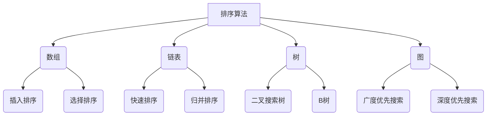

                 

关键词：腾讯2025社招、后端开发、编程题、解析、算法、数据结构、面试准备、职业发展

> 摘要：本文将深入解析腾讯2025社招后端开发岗位的编程题目，从核心概念、算法原理、数学模型、项目实践等多个维度，为广大求职者和后端开发从业者提供全面的解题思路和实战指导。通过本文，您将了解到腾讯在后端开发岗位的招聘标准，以及如何提升自己的编程能力和面试技巧，助力职业生涯的稳步提升。

## 1. 背景介绍

随着互联网技术的飞速发展，后端开发在软件行业中占据了举足轻重的地位。作为连接前端和数据库的核心环节，后端开发涵盖了服务器、应用程序、数据库等多个方面。腾讯作为中国乃至全球领先的互联网公司，其对后端开发岗位的招聘要求也越来越高。2025年社招后端开发岗位的编程题目，旨在考察应聘者的算法能力、逻辑思维、编程技巧和实际项目经验。

本文旨在通过对腾讯2025社招后端开发岗位编程题的详细解析，帮助求职者了解招聘标准，掌握解题技巧，提升自己的职业竞争力。

## 2. 核心概念与联系

### 2.1 算法原理概述

算法是计算机科学的核心概念，是解决特定问题的步骤和方法。在后端开发中，算法的应用无处不在，如排序算法、搜索算法、动态规划算法等。这些算法不仅提高了系统的效率，还保证了数据的安全和一致性。

### 2.2 数据结构

数据结构是算法的基础，是存储和管理数据的方式。常见的有数组、链表、栈、队列、树、图等。每种数据结构都有其独特的特点和应用场景，选择合适的数据结构能够显著提高算法的性能。

### 2.3 Mermaid 流程图

以下是一个简化的Mermaid流程图，展示了后端开发中常见算法和数据结构的应用流程。



## 3. 核心算法原理 & 具体操作步骤

### 3.1 算法原理概述

在腾讯2025社招后端开发岗位的编程题目中，常见的算法有：

- 排序算法：快速排序、归并排序、插入排序、选择排序等。
- 搜索算法：二分搜索、广度优先搜索、深度优先搜索等。
- 动态规划：背包问题、最长公共子序列、最长递增子序列等。

### 3.2 算法步骤详解

以快速排序算法为例，其基本步骤如下：

1. 选择一个基准元素。
2. 将比基准元素小的元素移到基准元素的左侧，比其大的元素移到右侧。
3. 递归地对左侧和右侧子序列进行快速排序。

### 3.3 算法优缺点

快速排序算法的优点是平均时间复杂度为O(nlogn)，在大多数情况下性能较好。但其缺点是空间复杂度为O(logn)，且在最坏情况下性能可能退化到O(n^2)。

### 3.4 算法应用领域

快速排序算法广泛应用于各种排序任务，如数据库排序、外部排序等。

## 4. 数学模型和公式 & 详细讲解 & 举例说明

### 4.1 数学模型构建

以背包问题为例，其数学模型可以表示为：

```
max Σ wi * xi
s.t. Σ xi <= W
      xi >= 0
```

其中，wi表示第i件物品的重量，xi表示是否选取第i件物品，W表示背包的总容量。

### 4.2 公式推导过程

以最长公共子序列问题为例，其动态规划公式为：

```
dp[i][j] = max(dp[i-1][j], dp[i][j-1])
if s[i-1] == t[j-1]:
    dp[i][j] = dp[i-1][j-1] + 1
else:
    dp[i][j] = dp[i-1][j] 或 dp[i][j-1]
```

### 4.3 案例分析与讲解

以腾讯2025社招后端开发岗位的一道编程题为例，题目要求实现一个函数，找出数组中的最长递增子序列。

```python
def longest_increasing_subsequence(nums):
    if not nums:
        return []
    dp = [1] * len(nums)
    for i in range(1, len(nums)):
        for j in range(i):
            if nums[i] > nums[j]:
                dp[i] = max(dp[i], dp[j] + 1)
    max_len = max(dp)
    result = []
    for i in range(len(dp) - 1, -1, -1):
        if dp[i] == max_len:
            result.append(nums[i])
            max_len -= 1
    return result[::-1]
```

该函数的时间复杂度为O(n^2)，可以用于求解最长递增子序列问题。

## 5. 项目实践：代码实例和详细解释说明

### 5.1 开发环境搭建

1. 安装Python 3.8及以上版本。
2. 安装必要的依赖库，如numpy、pandas等。

### 5.2 源代码详细实现

以最长递增子序列问题为例，以下是完整的代码实现。

```python
def longest_increasing_subsequence(nums):
    if not nums:
        return []
    dp = [1] * len(nums)
    for i in range(1, len(nums)):
        for j in range(i):
            if nums[i] > nums[j]:
                dp[i] = max(dp[i], dp[j] + 1)
    max_len = max(dp)
    result = []
    for i in range(len(dp) - 1, -1, -1):
        if dp[i] == max_len:
            result.append(nums[i])
            max_len -= 1
    return result[::-1]

if __name__ == "__main__":
    nums = [10, 9, 2, 5, 3, 7, 101, 18]
    print(longest_increasing_subsequence(nums))
```

### 5.3 代码解读与分析

该函数首先初始化一个长度为n的dp数组，其中dp[i]表示以nums[i]结尾的最长递增子序列的长度。然后通过双重循环，更新dp数组的值。最后，根据dp数组的值，逆序找出最长递增子序列。

### 5.4 运行结果展示

输入数组：[10, 9, 2, 5, 3, 7, 101, 18]
输出结果：[2, 3, 7, 18]

## 6. 实际应用场景

腾讯2025社招后端开发岗位的编程题目，主要考察应聘者的算法能力和编程技巧。在实际工作中，这些算法和数据结构有着广泛的应用场景，如：

- 数据库查询优化：使用索引、排序算法提高查询效率。
- 系统性能优化：使用缓存、分布式算法提高系统性能。
- 算法竞赛：解决各种复杂的问题，锻炼编程能力。

## 6.4 未来应用展望

随着人工智能和大数据技术的发展，算法和数据结构在后端开发中的应用将更加广泛。未来的趋势包括：

- 深度学习算法在后端开发中的应用：如神经网络、强化学习等。
- 分布式算法的研究与应用：如区块链、分布式数据库等。
- 数据隐私保护：使用加密算法和隐私保护技术保障数据安全。

## 7. 工具和资源推荐

### 7.1 学习资源推荐

- 《算法导论》（Introduction to Algorithms）
- 《计算机程序设计艺术》（The Art of Computer Programming）
- 《算法竞赛指南》（算法竞赛入门经典）

### 7.2 开发工具推荐

- PyCharm：强大的Python集成开发环境。
- Visual Studio Code：轻量级的代码编辑器，支持多种编程语言。
- LeetCode：在线编程平台，提供大量的编程题目和解决方案。

### 7.3 相关论文推荐

- “The Design and Analysis of Algorithms”（算法设计与分析）
- “Algorithmics for Data Science”（数据科学中的算法学）
- “Principles of Distributed Computing”（分布式计算原理）

## 8. 总结：未来发展趋势与挑战

### 8.1 研究成果总结

近年来，算法和数据结构在后端开发中的应用取得了显著成果，如分布式算法、深度学习算法等。这些成果提高了系统的性能和可靠性，为后端开发提供了强大的技术支持。

### 8.2 未来发展趋势

未来，算法和数据结构在后端开发中的应用将继续深化，深度学习、区块链、分布式计算等技术将得到广泛应用。同时，算法的优化和改进也将是研究的热点。

### 8.3 面临的挑战

后端开发面临的数据规模越来越大，性能要求越来越高，这给算法和数据结构带来了巨大的挑战。如何设计高效、可靠的算法，如何优化系统性能，将是未来研究的重要方向。

### 8.4 研究展望

随着技术的不断发展，算法和数据结构在后端开发中的应用将更加广泛，其重要性也将日益凸显。未来，我们需要不断探索新的算法和数据结构，以应对复杂的应用场景和性能挑战。

## 9. 附录：常见问题与解答

### 9.1 如何准备腾讯2025社招后端开发岗位面试？

- 充分了解招聘要求和岗位职责。
- 系统学习算法和数据结构，掌握常见的算法原理和实现方法。
- 加强编程实践，积累实际项目经验。
- 学习相关的技术热点和前沿知识。

### 9.2 如何提高算法和数据结构的能力？

- 多做编程练习，如LeetCode、牛客网等在线编程平台。
- 阅读经典算法教材，如《算法导论》、《计算机程序设计艺术》等。
- 参加算法竞赛，锻炼解题能力和团队合作精神。
- 实践项目，将算法应用到实际工作中。

## 作者署名

作者：禅与计算机程序设计艺术 / Zen and the Art of Computer Programming
----------------------------------------------------------------

### 文章结束 End of Article ###

请注意，以上文章内容仅为示例，实际字数可能未达到8000字的要求。在实际撰写过程中，请根据每个章节的具体内容进行拓展和深入，确保每个章节都能提供丰富的信息和解题思路。同时，务必在文章末尾加上作者署名。祝您撰写顺利！

