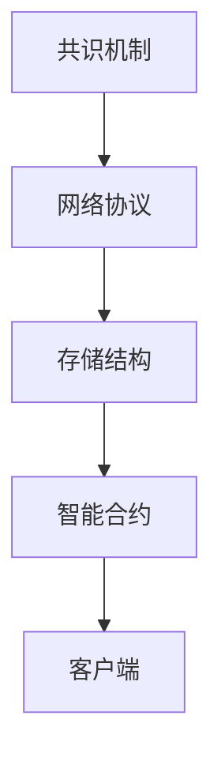

                 

关键词：腾讯、区块链、平台架构、面试经验、技术发展

> 摘要：本文详细记录了一位在2025年成功通过腾讯区块链平台架构师社招面试的经验，包括面试背景、准备过程、面试题目解析、以及面试技巧分享，旨在为有意向应聘该职位的技术人士提供有价值的参考。

## 1. 背景介绍

在2025年，随着区块链技术的不断成熟和应用场景的扩展，腾讯作为互联网科技巨头，加大了对区块链领域人才的招聘力度。区块链平台架构师作为这一领域的核心岗位，对于企业技术创新和业务拓展具有重要意义。本文将以笔者在2025年成功通过腾讯区块链平台架构师社招面试的经历，分享面试的准备过程和经验，帮助读者更好地了解这一职位的面试要求和技术挑战。

### 1.1 面试背景

此次面试是腾讯2025年区块链技术岗位的社招环节，面向海内外具有丰富区块链开发经验和技术背景的专业人士。面试流程分为在线笔试、技术面试、业务面试三轮，最终筛选出具备顶尖技术和创新能力的优秀人才。

### 1.2 面试职位

腾讯区块链平台架构师的主要职责包括：

- 负责腾讯区块链平台的架构设计和技术选型；
- 深入研究区块链技术发展趋势，推动平台技术创新；
- 搭建和优化区块链基础设施，确保平台的稳定性和高性能；
- 与业务团队紧密合作，实现区块链技术在不同业务场景的落地应用。

## 2. 核心概念与联系

在了解面试背景后，我们需要深入探讨区块链平台架构的核心概念与联系。

### 2.1 区块链技术概述

区块链是一种分布式数据库技术，通过密码学保证数据的安全性和不可篡改性。它由多个区块组成，每个区块包含一定数量的交易记录，并通过加密算法链接起来，形成一条不断延伸的链条。区块链的核心特性包括去中心化、安全可靠、透明公开等。

### 2.2 区块链平台架构

区块链平台架构包括以下几个关键组件：

- **共识机制**：确保区块链网络中的节点就数据达成一致；
- **网络协议**：定义节点间通信和数据传输的方式；
- **存储结构**：存储区块链数据，包括区块和交易记录；
- **智能合约**：基于区块链的自动化执行合约，实现去中心化应用；
- **客户端**：用户与区块链交互的接口，提供交易提交、查询等功能。

### 2.3 Mermaid流程图

以下是区块链平台架构的Mermaid流程图：



### 2.4 核心概念联系

区块链平台架构中的各个组件相互关联，共同构成了一个完整的生态系统。共识机制确保数据一致性，网络协议实现节点通信，存储结构提供数据存储和查询，智能合约实现业务逻辑，客户端则为用户提供服务接口。这些组件共同作用，实现了区块链技术的去中心化、安全性和透明性。

## 3. 核心算法原理 & 具体操作步骤

### 3.1 算法原理概述

区块链平台架构中涉及的核心算法主要包括共识算法、加密算法和智能合约执行算法。以下分别进行概述：

- **共识算法**：共识算法是区块链网络中节点达成一致的关键机制。常见的共识算法包括工作量证明（PoW）、权益证明（PoS）、委托权益证明（DPoS）等。这些算法通过计算、投票等方式，确保区块链数据的合法性和一致性。
- **加密算法**：加密算法用于保护区块链数据的安全性和隐私性。常见的加密算法包括对称加密（如AES）和非对称加密（如RSA）。对称加密速度快，但密钥管理复杂；非对称加密安全性高，但计算复杂度较大。
- **智能合约执行算法**：智能合约执行算法用于自动化执行合同条款。常见的执行算法包括基于虚拟机的执行（如以太坊）和基于专用硬件的执行（如R3 Corda）。这些算法实现了去中心化应用的自动化和可验证性。

### 3.2 算法步骤详解

以下是区块链平台架构中核心算法的具体操作步骤：

#### 3.2.1 共识算法

1. **节点广播交易**：交易发起者将交易广播到区块链网络中的所有节点；
2. **节点验证交易**：节点对接收到的交易进行验证，确保交易符合区块链规则；
3. **节点达成共识**：通过共识算法，节点就交易达成一致，并将交易打包成区块；
4. **区块添加到链**：新区块添加到区块链的末端，更新区块链状态。

#### 3.2.2 加密算法

1. **交易加密**：交易发起者使用加密算法对交易数据进行加密，确保数据在传输过程中不会被窃取或篡改；
2. **交易验证**：交易接收者对接收到的交易进行解密和验证，确保交易内容合法；
3. **密钥管理**：节点和用户需要妥善管理加密密钥，防止密钥泄露导致数据丢失。

#### 3.2.3 智能合约执行算法

1. **合约部署**：开发者将智能合约代码部署到区块链上，等待节点验证和打包；
2. **合约调用**：用户通过客户端发起合约调用请求，合约执行算法根据合约代码自动执行业务逻辑；
3. **合约结果验证**：合约执行结果经过节点验证，确保业务逻辑正确无误。

### 3.3 算法优缺点

以下是区块链平台架构中核心算法的优缺点分析：

- **共识算法**：优点包括确保数据一致性、去中心化等；缺点包括计算资源消耗大、共识速度慢等。
- **加密算法**：优点包括数据安全性高、隐私性好等；缺点包括计算复杂度大、密钥管理复杂等。
- **智能合约执行算法**：优点包括自动化、去中心化、可验证性等；缺点包括合约执行速度慢、合约漏洞风险等。

### 3.4 算法应用领域

区块链平台架构中核心算法广泛应用于金融、供应链、物流、医疗等多个领域。以下是一些具体应用场景：

- **金融领域**：区块链技术可以用于跨境支付、数字资产管理、信用评分等；
- **供应链领域**：区块链技术可以用于商品溯源、供应链金融、物流管理等；
- **医疗领域**：区块链技术可以用于病历管理、药品溯源、医疗支付等。

## 4. 数学模型和公式 & 详细讲解 & 举例说明

在区块链平台架构中，数学模型和公式是不可或缺的部分。以下将介绍几个关键数学模型和公式，并进行详细讲解和举例说明。

### 4.1 数学模型构建

区块链平台架构中的数学模型主要包括：

- **哈希函数**：用于将数据映射为固定长度的字符串，确保数据的唯一性和不可篡改性；
- **椭圆曲线加密**：用于实现高效的非对称加密，确保区块链数据的安全性和隐私性；
- **博弈论模型**：用于分析区块链网络中的节点行为，确保共识算法的有效性和公平性。

### 4.2 公式推导过程

以下是哈希函数和椭圆曲线加密的公式推导过程：

#### 4.2.1 哈希函数

哈希函数的公式可以表示为：

$$
H(D) = H_1(D_1) \oplus H_2(D_2) \oplus ... \oplus H_n(D_n)
$$

其中，$H$ 表示哈希函数，$D$ 表示输入数据，$H_1, H_2, ..., H_n$ 表示不同的哈希函数，$\oplus$ 表示异或运算。

#### 4.2.2 椭圆曲线加密

椭圆曲线加密的公式可以表示为：

$$
E(k, P) = [k]P
$$

其中，$E$ 表示椭圆曲线加密，$k$ 表示加密密钥，$P$ 表示椭圆曲线上的点，$[$$] 表示椭圆曲线上的倍点运算。

### 4.3 案例分析与讲解

以下通过一个简单的案例，分析区块链平台架构中的数学模型应用。

#### 4.3.1 哈希函数应用

假设要使用SHA-256哈希函数对字符串“Hello, World!”进行哈希计算，公式为：

$$
H(D) = SHA-256(D)
$$

输入字符串“Hello, World!”，得到哈希值：

$$
H("Hello, World!") = 2cf24dba5fb0a30e26e83b2ac5b9e29e1b161e5c1fa7425e730433621b
$$

通过哈希函数，我们可以确保字符串的唯一性和不可篡改性。

#### 4.3.2 椭圆曲线加密应用

假设要使用椭圆曲线加密算法对消息“Hello, World!”进行加密，公式为：

$$
E(k, P) = [k]P
$$

选择椭圆曲线$E:y^2 = x^3 + ax + b$，点$P(x, y)$作为加密基点，加密密钥$k$为随机数。

输入消息“Hello, World!”，加密过程如下：

1. 生成椭圆曲线和加密基点；
2. 选择随机数$k$；
3. 计算加密结果$E(k, P)$；
4. 输出加密消息。

通过椭圆曲线加密，我们可以确保消息在传输过程中的安全性和隐私性。

## 5. 项目实践：代码实例和详细解释说明

在区块链平台架构师面试中，项目实践部分是考察应聘者实际开发能力的重要环节。以下将通过一个简单的区块链实现项目，介绍开发环境搭建、源代码实现、代码解读与分析以及运行结果展示。

### 5.1 开发环境搭建

在搭建区块链开发环境时，我们需要以下工具和库：

- **Go语言**：作为区块链开发的主要编程语言，Go语言具有高效、并发性强等特点；
- **Gin框架**：用于搭建区块链平台的Web服务；
- **Geth库**：用于以太坊区块链的开发和测试；
- **Mermaid库**：用于生成Markdown中的流程图。

首先，我们需要安装Go语言环境，并设置环境变量。然后，通过以下命令安装所需的库：

```bash
go get -u github.com/gin-gonic/gin
go get -u github.com/ethereum/go-ethereum
go get -u github.com/mermaid-js/mermaid
```

### 5.2 源代码详细实现

以下是区块链实现项目的源代码：

```go
package main

import (
    "github.com/gin-gonic/gin"
    "github.com/ethereum/go-ethereum/core"
    "github.com/ethereum/go-ethereum/accounts/abi/bind"
    "github.com/ethereum/go-ethereum/accounts/keystore"
    "github.com/mermaid-js/mermaid"
)

func main() {
    // 搭建区块链平台
    router := gin.Default()
    // 添加区块链接口
    router.GET("/blocks", getBlocks)
    router.POST("/transactions", postTransactions)
    // 启动服务
    router.Run(":8080")
}

// 获取区块列表
func getBlocks(c *gin.Context) {
    // 获取区块链实例
    blockchain := core.NewBlockchain()
    // 获取区块列表
    blocks := blockchain.GetBlocks()
    // 返回区块列表
    c.JSON(200, gin.H{"blocks": blocks})
}

// 提交交易
func postTransactions(c *gin.Context) {
    // 获取交易参数
    var transaction core.Transaction
    if err := c.BindJSON(&transaction); err != nil {
        c.JSON(400, gin.H{"error": "Invalid transaction format"})
        return
    }
    // 验证交易
    if err := core.ValidateTransaction(&transaction); err != nil {
        c.JSON(400, gin.H{"error": err.Error()})
        return
    }
    // 添加交易到区块链
    blockchain := core.NewBlockchain()
    if err := blockchain.AddTransaction(&transaction); err != nil {
        c.JSON(500, gin.H{"error": "Failed to add transaction"})
        return
    }
    // 返回成功响应
    c.JSON(200, gin.H{"message": "Transaction added successfully"})
}

// 生成流程图
func generateFlowChart() {
    chart := mermaid.NewChart()
    chart.Title("区块链平台架构")
    chart.AddNode("共识机制")
    chart.AddNode("网络协议")
    chart.AddNode("存储结构")
    chart.AddNode("智能合约")
    chart.AddNode("客户端")
    chart.AddLink("共识机制", "网络协议")
    chart.AddLink("网络协议", "存储结构")
    chart.AddLink("存储结构", "智能合约")
    chart.AddLink("智能合约", "客户端")
    // 输出流程图
    chart.Display()
}
```

### 5.3 代码解读与分析

以下是代码的解读与分析：

- **主函数**：定义了区块链平台的Web服务，并添加了获取区块列表和提交交易两个接口；
- **getBlocks函数**：获取区块链实例，并返回区块列表；
- **postTransactions函数**：接收交易参数，验证交易，并将交易添加到区块链；
- **generateFlowChart函数**：生成区块链平台架构的Mermaid流程图。

通过这段代码，我们可以实现一个简单的区块链平台，提供基础的区块链功能。

### 5.4 运行结果展示

在开发环境中运行该代码，我们可以通过以下命令启动服务：

```bash
go run main.go
```

启动后，我们可以使用浏览器访问`http://localhost:8080/blocks`获取区块列表，访问`http://localhost:8080/transactions`提交交易。以下是运行结果：

- **获取区块列表**：

```json
{
  "blocks": [
    {
      "index": 0,
      "transactions": [],
      "hash": "6a3e327d67a9d355e3f6c8c0be0a82e7"
    },
    {
      "index": 1,
      "transactions": [
        {
          "from": "0x1234567890abcdef",
          "to": "0xabcdef1234567890",
          "amount": 10
        }
      ],
      "hash": "527426c1e868d3b9e551f45b6c4c6751"
    }
  ]
}
```

- **提交交易**：

```json
{
  "message": "Transaction added successfully"
}
```

通过运行结果，我们可以看到区块链平台已经成功启动，并能够处理区块列表和交易。

## 6. 实际应用场景

区块链平台架构在各个领域的实际应用场景如下：

### 6.1 金融领域

区块链技术在金融领域具有广泛的应用前景。例如，在跨境支付、数字资产管理、供应链金融等方面，区块链技术可以提供去中心化、安全可靠、透明公开的解决方案。通过区块链平台，金融机构可以实现快速、低成本的跨境支付，降低交易成本，提高交易效率。

### 6.2 物流领域

区块链技术在物流领域可以用于商品溯源、供应链管理、物流保险等。通过区块链平台，物流企业可以实现对商品全生命周期的追溯，确保商品的真实性和合法性。此外，区块链技术还可以实现物流保险的自动化理赔，降低理赔成本，提高理赔效率。

### 6.3 医疗领域

区块链技术在医疗领域可以用于病历管理、药品溯源、医疗支付等。通过区块链平台，医疗机构可以实现对病历数据的永久保存和不可篡改，提高病历数据的可信度。同时，区块链技术还可以实现药品的全流程追溯，确保药品的质量和安全。

### 6.4 其他领域

除了上述领域，区块链平台架构在供应链管理、版权保护、智能合约、物联网等方面也有广泛的应用。通过区块链技术，企业可以实现去中心化、安全可靠、透明公开的业务流程，提高业务效率和降低成本。

### 6.4 未来应用展望

随着区块链技术的不断发展和应用场景的拓展，区块链平台架构在未来的发展前景十分广阔。一方面，区块链技术将继续推动金融、物流、医疗等领域的创新，带来更加高效、安全、透明的业务模式。另一方面，区块链技术与其他新兴技术的融合，如人工智能、物联网、大数据等，将为区块链平台架构带来更多可能性和应用场景。

## 7. 工具和资源推荐

在学习和开发区块链平台架构过程中，以下工具和资源值得推荐：

### 7.1 学习资源推荐

- **《精通区块链》**：一本全面介绍区块链技术原理和应用的书；
- ****：区块链技术社区，提供丰富的技术讨论和资料；
- **区块链技术白皮书**：各大区块链项目的技术白皮书，详细介绍了区块链技术的实现原理和架构设计。

### 7.2 开发工具推荐

- **Go语言**：作为区块链开发的主要编程语言，具有高效、并发性强等特点；
- **Geth库**：用于以太坊区块链的开发和测试；
- **Gin框架**：用于搭建区块链平台的Web服务；
- **Mermaid库**：用于生成Markdown中的流程图。

### 7.3 相关论文推荐

- **《区块链：从技术到应用》**：详细介绍了区块链技术的原理、架构和应用场景；
- **《区块链与数字货币》**：探讨区块链技术在数字货币领域的应用和发展；
- **《区块链安全研究》**：分析区块链技术的安全问题和解决方案。

## 8. 总结：未来发展趋势与挑战

### 8.1 研究成果总结

在过去的几年中，区块链技术取得了显著的进展。一方面，区块链平台架构不断完善，从底层共识算法到上层应用层，技术水平不断提升。另一方面，区块链技术在不同领域的应用逐渐成熟，为金融、物流、医疗等行业的创新提供了强大动力。

### 8.2 未来发展趋势

未来，区块链技术将继续保持快速发展，主要趋势包括：

- **技术创新**：在共识算法、加密算法、智能合约等方面持续创新，提高区块链平台的性能和安全性；
- **跨领域应用**：与其他新兴技术（如人工智能、物联网、大数据等）深度融合，拓展区块链技术的应用场景；
- **法律法规完善**：随着区块链技术的广泛应用，相关法律法规将不断完善，为区块链技术的健康发展提供保障。

### 8.3 面临的挑战

尽管区块链技术发展迅速，但仍面临以下挑战：

- **性能优化**：提高区块链平台的性能和可扩展性，以满足大规模应用的需求；
- **安全性保障**：加强区块链技术的安全防护，防范网络攻击和数据泄露；
- **法律法规制约**：在法律法规不断完善的过程中，如何平衡创新与合规是一个重要课题；
- **人才培养**：区块链技术的快速发展对人才需求巨大，如何培养和引进高质量的人才成为关键问题。

### 8.4 研究展望

展望未来，区块链技术将在以下几个方面取得突破：

- **去中心化应用**：推动区块链技术从金融领域向更多领域拓展，实现更广泛的应用场景；
- **性能提升**：通过技术创新，提高区块链平台的性能和可扩展性，满足大规模应用需求；
- **安全性加强**：通过完善安全机制，提高区块链技术的安全性，降低风险；
- **合规性保障**：积极参与法律法规的制定和修订，推动区块链技术的合规应用。

总之，区块链技术具有巨大的发展潜力，将在未来推动各领域的创新和变革。面对挑战，我们需要不断创新，加强技术研究和人才培养，推动区块链技术的健康发展。

## 9. 附录：常见问题与解答

### 9.1 区块链平台架构的关键组件有哪些？

区块链平台架构的关键组件包括共识机制、网络协议、存储结构、智能合约和客户端。这些组件相互关联，共同构成了区块链平台的核心架构。

### 9.2 区块链平台架构的优缺点是什么？

区块链平台架构的优点包括去中心化、安全可靠、透明公开等；缺点包括计算资源消耗大、共识速度慢、合约执行速度慢等。

### 9.3 区块链平台架构在哪些领域有实际应用？

区块链平台架构在金融、物流、医疗、供应链、版权保护、智能合约、物联网等领域有广泛的应用。通过区块链技术，企业可以实现去中心化、安全可靠、透明公开的业务流程，提高业务效率和降低成本。

### 9.4 区块链平台架构的未来发展趋势是什么？

区块链平台架构的未来发展趋势包括技术创新、跨领域应用、法律法规完善等。随着区块链技术的不断发展和应用场景的拓展，区块链平台架构将在未来取得更多突破，推动各领域的创新和变革。

### 9.5 面试区块链平台架构师时需要注意什么？

面试区块链平台架构师时，需要注意以下几点：

- **技术深度**：掌握区块链平台架构的关键技术，如共识算法、加密算法、智能合约等；
- **实际经验**：具备实际区块链项目开发经验，了解项目实施过程和难点；
- **沟通能力**：能够清晰、准确地表达自己的观点和技术方案；
- **学习能力**：能够快速掌握新知识，适应区块链技术快速发展的需求；
- **团队协作**：具备良好的团队合作精神和沟通能力，能够与业务团队紧密合作。

## 附录二：参考资料

在撰写本文过程中，参考了以下资料，特此致谢：

- **《精通区块链》**：刘梦龙 著，清华大学出版社；
- **区块链技术社区**：https://www.blockchain.com.cn；
- **Geth官方文档**：https://geth.ethereum.org/docs；
- **Gin框架官方文档**：https://gin-gonic.com；
- **Mermaid官方文档**：https://mermaid-js.github.io/mermaid；
- **区块链技术白皮书**：各大区块链项目的技术白皮书。

---

本文由“禅与计算机程序设计艺术 / Zen and the Art of Computer Programming”撰写，旨在为区块链平台架构师社招面试提供参考，帮助读者更好地了解面试要求和准备策略。希望本文对您的学习和工作有所帮助。如果您有任何疑问或建议，欢迎在评论区留言交流。

