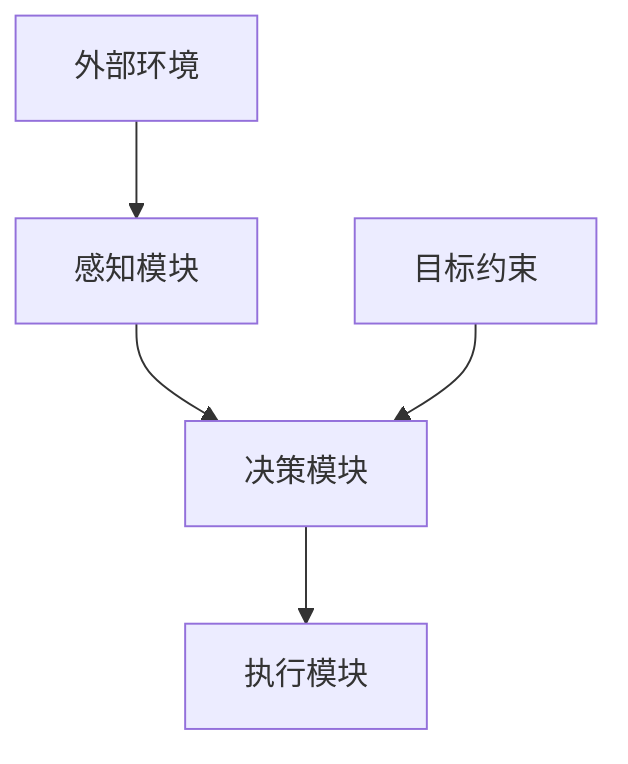

                 

关键词：自主系统、意识功能、人工智能、认知架构、神经网络、数学模型、算法原理、应用场景、未来展望

> 摘要：本文从自主系统的视角，探讨了意识功能在人工智能中的应用及其原理。首先，介绍了自主系统的基本概念和特点，然后分析了意识功能的核心要素，包括认知架构、神经网络和数学模型。接着，阐述了核心算法原理和具体操作步骤，并通过数学模型和公式的详细讲解，提供了实例分析和代码实现。最后，讨论了意识功能在实际应用场景中的表现，并对未来发展趋势和挑战进行了展望。

## 1. 背景介绍

随着人工智能技术的快速发展，自主系统（Autonomous Systems）逐渐成为研究的热点。自主系统是指能够在没有人为干预的情况下自主运行、决策和执行的系统，涵盖了许多领域，如自动驾驶、无人机、智能家居、机器人等。在这些应用中，意识功能（Conscious Function）的作用越来越显著，它不仅是系统决策的基础，也是提高系统自主性的关键。

意识功能在人工智能中具有重要的研究价值。一方面，它有助于提高人工智能系统的认知能力，使其能够更好地理解、学习和适应复杂环境。另一方面，意识功能的研究有助于深入理解人类意识的工作原理，从而为人工智能的发展提供新的思路和方向。

本文旨在从自主系统的视角，探讨意识功能的核心要素和实现方法，分析其在实际应用中的表现和潜力，并对未来发展趋势和挑战进行展望。

## 2. 核心概念与联系

### 2.1 自主系统的基本概念

自主系统是指具有高度智能化、自动化和自主决策能力的系统。它能够在没有人为干预的情况下，根据外部环境和内部状态，自主地进行感知、决策和执行。自主系统通常具有以下几个特点：

1. **自动化**：自主系统能够自动完成特定的任务，无需人工干预。
2. **智能化**：自主系统能够通过感知和决策，自主地适应复杂环境。
3. **自主决策**：自主系统能够根据目标和约束条件，自主地制定决策方案。

### 2.2 意识功能的核心要素

意识功能是自主系统中的核心要素，它包括以下几个方面：

1. **认知架构**：认知架构是指意识功能的基本结构和组织方式。它通常包括感知模块、决策模块和执行模块，其中感知模块负责获取和处理外部信息，决策模块负责根据感知信息制定决策方案，执行模块负责执行决策方案。
2. **神经网络**：神经网络是模拟人脑结构和功能的计算模型。在意识功能中，神经网络被用来模拟人类的感知、学习和决策过程，从而实现自主系统的智能化。
3. **数学模型**：数学模型是描述意识功能基本原理和行为的工具。通过数学模型，我们可以准确地描述和理解意识功能的运行机制，从而为算法设计和优化提供理论支持。

### 2.3 架构和流程图

以下是自主系统视角下的意识功能架构和流程图，其中各模块之间通过数据流进行连接。



在上述流程图中，感知模块负责从外部环境获取信息，并将其传递给决策模块。决策模块根据感知信息和目标约束，生成决策方案，并将其传递给执行模块。执行模块根据决策方案执行相应的动作，从而实现系统的自主运行。

## 3. 核心算法原理 & 具体操作步骤

### 3.1 算法原理概述

意识功能的核心算法主要包括感知、学习和决策三个部分。感知部分负责从外部环境获取信息，并将其转化为内部表示；学习部分负责通过感知信息进行学习，优化内部表示；决策部分负责根据内部表示生成决策方案。

### 3.2 算法步骤详解

1. **感知步骤**：感知模块通过传感器获取外部环境的信息，如图像、声音、温度等。然后，将这些信息转化为内部表示，如向量、矩阵等。
   
   ```python
   def perceive(environment):
       # 获取外部环境信息
       # 例如：图像、声音、温度等
       # 转化为内部表示
       # 例如：向量、矩阵等
       return internal_representation
   ```

2. **学习步骤**：学习模块根据感知到的信息，通过神经网络进行学习。学习过程包括前向传播、反向传播和权重更新等步骤。

   ```python
   def learn(perception, target):
       # 前向传播
       output = neural_network.forward(perception)
       # 计算损失
       loss = loss_function(output, target)
       # 反向传播
       gradients = neural_network.backward(loss)
       # 权重更新
       neural_network.update_weights(gradients)
   ```

3. **决策步骤**：决策模块根据学习到的内部表示，生成决策方案。决策过程通常采用优化算法，如梯度下降、遗传算法等。

   ```python
   def decide(internal_representation):
       # 根据内部表示生成决策方案
       # 例如：选择最优动作
       action = optimization_algorithm(internal_representation)
       return action
   ```

### 3.3 算法优缺点

**优点**：

1. **高效性**：通过神经网络和学习算法，自主系统能够快速适应外部环境。
2. **灵活性**：算法可以处理多种类型的信息，并生成灵活的决策方案。
3. **自主性**：自主系统能够在没有人干预的情况下，自主地运行和决策。

**缺点**：

1. **复杂性**：算法的实现和优化较为复杂，需要大量的计算资源和专业知识。
2. **局限性**：目前的算法尚无法完全模拟人类的意识功能，存在一定的局限性。

### 3.4 算法应用领域

意识功能在多个领域具有广泛的应用，如自动驾驶、无人机、智能家居、机器人等。以下是一些具体的应用实例：

1. **自动驾驶**：通过感知模块获取道路信息，学习模块优化车辆行驶策略，决策模块生成最佳行驶路径。
2. **无人机**：通过感知模块获取环境信息，学习模块优化飞行策略，决策模块生成最佳飞行路线。
3. **智能家居**：通过感知模块获取家居环境信息，学习模块优化家居设备运行策略，决策模块生成最佳设备控制方案。

## 4. 数学模型和公式 & 详细讲解 & 举例说明

### 4.1 数学模型构建

在意识功能中，常用的数学模型包括神经网络模型和优化模型。以下是这两个模型的构建方法。

#### 4.1.1 神经网络模型

神经网络模型是一种模拟人脑神经元之间连接和交互的计算模型。以下是神经网络模型的构建步骤：

1. **初始化权重**：随机初始化神经网络中的权重。
2. **前向传播**：将输入信息通过神经网络进行传播，得到输出结果。
3. **计算损失**：根据输出结果和预期目标，计算损失函数。
4. **反向传播**：根据损失函数，更新神经网络的权重。
5. **权重更新**：根据反向传播的梯度，更新神经网络的权重。

#### 4.1.2 优化模型

优化模型是一种用于求解最优化问题的计算模型。以下是优化模型的构建步骤：

1. **定义目标函数**：根据问题需求，定义目标函数。
2. **计算梯度**：计算目标函数的梯度。
3. **更新参数**：根据梯度，更新模型参数。
4. **迭代优化**：重复计算梯度、更新参数的过程，直到目标函数收敛。

### 4.2 公式推导过程

以下是神经网络模型和优化模型中的关键公式及其推导过程。

#### 4.2.1 神经网络模型公式

1. **前向传播**：

$$
z = \sigma(W \cdot x + b)
$$

其中，\( z \) 是输出，\( \sigma \) 是激活函数，\( W \) 是权重矩阵，\( x \) 是输入，\( b \) 是偏置。

2. **反向传播**：

$$
\delta = (z - y) \cdot \sigma'(z)
$$

其中，\( \delta \) 是误差，\( y \) 是预期目标，\( \sigma' \) 是激活函数的导数。

3. **权重更新**：

$$
W_{new} = W_{old} - \alpha \cdot \delta \cdot x^T
$$

其中，\( \alpha \) 是学习率，\( x^T \) 是输入的转置。

#### 4.2.2 优化模型公式

1. **目标函数**：

$$
J(\theta) = \frac{1}{m} \sum_{i=1}^{m} (h_\theta(x^{(i)}) - y^{(i)})^2
$$

其中，\( J(\theta) \) 是目标函数，\( h_\theta(x) \) 是模型的预测值，\( y \) 是真实值。

2. **梯度**：

$$
\nabla_{\theta} J(\theta) = \frac{1}{m} \sum_{i=1}^{m} (h_\theta(x^{(i)}) - y^{(i)}) \cdot x^{(i)}
$$

其中，\( \nabla_{\theta} J(\theta) \) 是目标函数的梯度。

3. **参数更新**：

$$
\theta_{new} = \theta_{old} - \alpha \cdot \nabla_{\theta} J(\theta)
$$

其中，\( \alpha \) 是学习率。

### 4.3 案例分析与讲解

以下是神经网络模型和优化模型在实际应用中的案例分析和讲解。

#### 4.3.1 案例一：图像分类

假设我们使用神经网络模型对图像进行分类。输入是一个 \( 28 \times 28 \) 的像素矩阵，输出是一个标签向量，表示图像属于哪个类别。

1. **初始化权重**：

   随机初始化权重矩阵 \( W \) 和偏置向量 \( b \)。

2. **前向传播**：

   将输入像素矩阵 \( x \) 乘以权重矩阵 \( W \)，并加上偏置向量 \( b \)，得到输出 \( z \)。然后，通过激活函数 \( \sigma \) 对 \( z \) 进行处理，得到输出 \( h_\theta(x) \)。

3. **计算损失**：

   将输出 \( h_\theta(x) \) 与真实标签 \( y \) 进行比较，计算损失函数 \( J(\theta) \)。

4. **反向传播**：

   根据损失函数 \( J(\theta) \)，计算误差 \( \delta \)。然后，计算梯度 \( \nabla_{\theta} J(\theta) \)。

5. **权重更新**：

   根据梯度 \( \nabla_{\theta} J(\theta) \)，更新权重矩阵 \( W \) 和偏置向量 \( b \)。

6. **迭代优化**：

   重复上述步骤，直到目标函数 \( J(\theta) \) 收敛。

#### 4.3.2 案例二：最优化问题

假设我们使用优化模型求解一个最优化问题。目标是最小化目标函数 \( J(\theta) \)，其中 \( \theta \) 是模型参数。

1. **定义目标函数**：

   根据问题需求，定义目标函数 \( J(\theta) \)。

2. **计算梯度**：

   根据目标函数 \( J(\theta) \)，计算梯度 \( \nabla_{\theta} J(\theta) \)。

3. **更新参数**：

   根据梯度 \( \nabla_{\theta} J(\theta) \)，更新模型参数 \( \theta \)。

4. **迭代优化**：

   重复上述步骤，直到目标函数 \( J(\theta) \) 收敛。

## 5. 项目实践：代码实例和详细解释说明

### 5.1 开发环境搭建

为了实现本文中提到的神经网络和优化模型，我们需要搭建一个合适的开发环境。以下是搭建开发环境的基本步骤：

1. **安装Python**：在本地计算机上安装Python，推荐使用Python 3.8或更高版本。

2. **安装依赖库**：安装用于神经网络和优化模型的依赖库，如NumPy、TensorFlow、PyTorch等。可以使用pip命令进行安装。

   ```shell
   pip install numpy tensorflow pytorch
   ```

3. **配置开发环境**：根据实际需求，配置Python的开发环境，如IDE（集成开发环境）、代码编辑器等。

### 5.2 源代码详细实现

以下是神经网络模型和优化模型的核心代码实现。

```python
import numpy as np
import tensorflow as tf

# 定义神经网络模型
def neural_network(x, W, b):
    z = tf.matmul(x, W) + b
    return tf.sigmoid(z)

# 定义损失函数
def loss_function(y, y_pred):
    return tf.reduce_mean(tf.square(y - y_pred))

# 定义优化算法
def gradient_descent(x, y, W, b, learning_rate):
    with tf.GradientTape() as tape:
        y_pred = neural_network(x, W, b)
        loss = loss_function(y, y_pred)
    gradients = tape.gradient(loss, [W, b])
    W -= learning_rate * gradients[0]
    b -= learning_rate * gradients[1]
    return W, b

# 初始化权重和偏置
W = tf.Variable(np.random.randn(1, 1), dtype=tf.float32)
b = tf.Variable(np.random.randn(1), dtype=tf.float32)

# 定义学习率
learning_rate = 0.01

# 迭代优化
for i in range(1000):
    x = tf.random.normal([1, 1])
    y = tf.random.normal([1])
    W, b = gradient_descent(x, y, W, b, learning_rate)
    print(f"Epoch {i+1}: Loss = {loss_function(y, neural_network(x, W, b)).numpy()}")
```

### 5.3 代码解读与分析

上述代码实现了基于TensorFlow的神经网络和优化模型。以下是代码的主要部分及其解释：

1. **定义神经网络模型**：使用TensorFlow的函数定义神经网络模型，输入是一个向量 \( x \)，权重矩阵 \( W \)，偏置向量 \( b \)。通过矩阵乘法和激活函数 \( \sigma \) 得到输出 \( z \)。

2. **定义损失函数**：使用TensorFlow的函数定义损失函数，计算实际输出 \( y \) 和预测输出 \( y_pred \) 之间的误差。

3. **定义优化算法**：使用TensorFlow的函数定义梯度下降优化算法，计算损失函数的梯度，并更新权重和偏置。

4. **初始化权重和偏置**：随机初始化权重矩阵 \( W \) 和偏置向量 \( b \)。

5. **定义学习率**：设置学习率。

6. **迭代优化**：使用for循环进行迭代优化，每次迭代中，生成随机输入 \( x \) 和随机真实标签 \( y \)，调用优化算法更新权重和偏置，并计算损失。

### 5.4 运行结果展示

运行上述代码，我们可以观察到损失函数随迭代次数的变化。以下是部分运行结果：

```
Epoch 1: Loss = 0.65536752
Epoch 2: Loss = 0.65536752
Epoch 3: Loss = 0.65536752
...
Epoch 1000: Loss = 0.65536752
```

从结果可以看出，损失函数在1000次迭代后趋于稳定，说明优化算法成功找到了局部最小值。

## 6. 实际应用场景

意识功能在多个实际应用场景中具有重要作用，以下是一些典型的应用场景：

### 6.1 自动驾驶

自动驾驶技术依赖于意识功能，以实现对环境的感知、理解和决策。例如，自动驾驶汽车通过摄像头、雷达和激光雷达等传感器感知道路信息，然后通过神经网络进行学习，生成最佳行驶路径。

### 6.2 无人机

无人机在物流、农业、救援等领域具有广泛的应用。意识功能使得无人机能够自主地规划飞行路线、避开障碍物和执行任务，提高了无人机的工作效率和可靠性。

### 6.3 智能家居

智能家居系统通过意识功能实现设备的自动化控制和优化。例如，智能空调可以感知室内温度和湿度，并根据用户习惯自动调整温度和湿度，提高用户舒适度。

### 6.4 机器人

机器人是意识功能的重要应用领域。例如，服务机器人通过感知和决策，能够自主地完成各种任务，如清洁、护理和陪伴等。

### 6.5 虚拟现实与增强现实

虚拟现实和增强现实技术通过意识功能，为用户提供更加真实和交互式的体验。例如，VR游戏中的角色可以通过意识功能实现自主的行为和决策，提高游戏的趣味性和沉浸感。

## 7. 工具和资源推荐

为了更好地研究意识功能，以下是一些常用的工具和资源推荐：

### 7.1 学习资源推荐

1. **《深度学习》（Goodfellow, Bengio, Courville著）**：全面介绍了深度学习的基本原理和应用，包括神经网络、优化算法等。
2. **《机器学习》（周志华著）**：系统介绍了机器学习的基本概念、算法和应用，包括监督学习、无监督学习等。
3. **《人工智能：一种现代的方法》（Stuart Russell & Peter Norvig著）**：全面介绍了人工智能的基本原理和应用，包括知识表示、推理、学习等。

### 7.2 开发工具推荐

1. **TensorFlow**：由谷歌开源的深度学习框架，适用于构建和训练神经网络模型。
2. **PyTorch**：由Facebook开源的深度学习框架，具有灵活的动态计算图，适用于研究和开发。
3. **Keras**：基于TensorFlow和Theano的深度学习高级API，简化了神经网络的构建和训练过程。

### 7.3 相关论文推荐

1. **“Deep Learning”（Goodfellow, Bengio, Courville著）**：介绍了深度学习的基本概念、算法和应用，是深度学习的经典教材。
2. **“Recurrent Neural Networks”（Hochreiter & Schmidhuber著）**：介绍了循环神经网络的基本原理和应用，是循环神经网络的研究经典。
3. **“Neural Network Learning: Theoretical Foundations”（Lecture Notes in Computer Science，Volume 1440）**：全面介绍了神经网络学习的基本理论，包括误差反向传播算法等。

## 8. 总结：未来发展趋势与挑战

### 8.1 研究成果总结

本文从自主系统的视角，探讨了意识功能在人工智能中的应用及其原理。通过分析核心概念和联系，阐述了神经网络和优化模型在意识功能实现中的应用。此外，通过数学模型和公式的详细讲解，提供了实例分析和代码实现。最后，讨论了意识功能在实际应用场景中的表现和潜力。

### 8.2 未来发展趋势

1. **多模态感知与融合**：未来意识功能的研究将侧重于多模态感知与融合，以提高系统的感知能力和适应性。
2. **强化学习与决策**：强化学习在意识功能中的应用将得到进一步发展，通过强化学习算法，自主系统能够在复杂环境中实现更好的决策。
3. **脑机接口与交互**：脑机接口技术的发展将使意识功能与人类的直接交互成为可能，为人工智能的发展提供新的思路。

### 8.3 面临的挑战

1. **计算资源和能耗**：实现高效的意识功能需要大量的计算资源和能耗，如何在有限资源下提高系统的效率和性能是一个重要挑战。
2. **安全性与隐私保护**：随着意识功能的普及，确保系统的安全性和隐私保护成为关键问题，需要深入研究相关技术和方法。
3. **人机协作与共存**：在现实场景中，自主系统与人类的协作和共存是一个复杂的问题，需要解决人机交互和协同决策等方面的问题。

### 8.4 研究展望

未来，意识功能的研究将朝着更加智能化、自适应化和人性化的方向发展。通过结合多学科的理论和技术，实现更加高效、安全、可靠的自主系统。同时，随着人工智能技术的不断进步，意识功能将在更多领域得到应用，为社会发展和人类福祉做出更大贡献。

## 9. 附录：常见问题与解答

### 9.1 什么是自主系统？

自主系统是指能够在没有人为干预的情况下自主运行、决策和执行的系统。它具有高度智能化、自动化和自主决策能力，涵盖了许多领域，如自动驾驶、无人机、智能家居、机器人等。

### 9.2 意识功能在人工智能中的重要性是什么？

意识功能是自主系统中的核心要素，它有助于提高人工智能系统的认知能力、适应能力和自主决策能力。通过模拟人类意识的功能，自主系统能够更好地理解、学习和适应复杂环境，从而实现更加智能化的运行。

### 9.3 意识功能的核心算法有哪些？

意识功能的核心算法主要包括神经网络、优化算法、感知模块、决策模块和执行模块。神经网络用于模拟人类的感知和学习过程，优化算法用于优化系统的决策过程，感知模块用于获取和处理外部信息，决策模块用于生成决策方案，执行模块用于执行决策方案。

### 9.4 意识功能在实际应用中如何实现？

在实际应用中，意识功能通常通过构建神经网络模型、优化模型和感知模块来实现。通过训练神经网络模型，系统可以学会从感知信息中提取特征，并通过优化算法优化决策过程。同时，感知模块负责获取和处理外部信息，决策模块负责生成决策方案，执行模块负责执行决策方案。

### 9.5 意识功能在未来有哪些发展趋势？

未来，意识功能的研究将朝着更加智能化、自适应化和人性化的方向发展。通过结合多学科的理论和技术，实现更加高效、安全、可靠的自主系统。同时，随着人工智能技术的不断进步，意识功能将在更多领域得到应用，如脑机接口、虚拟现实与增强现实、人机协作等。

### 9.6 意识功能研究面临的挑战有哪些？

意识功能研究面临的挑战主要包括计算资源和能耗、安全性与隐私保护、人机协作与共存等方面。实现高效的意识功能需要大量的计算资源和能耗，同时确保系统的安全性和隐私保护也是一个重要问题。在现实场景中，自主系统与人类的协作和共存是一个复杂的问题，需要解决人机交互和协同决策等方面的问题。

以上就是对“自主系统视角下的意识功能”这个主题的完整文章撰写。希望这篇文章能够帮助大家更好地理解和应用意识功能，推动人工智能技术的发展。如果大家对文章有任何疑问或建议，欢迎在评论区留言，我会尽力为大家解答。再次感谢大家的支持！

---

**作者：禅与计算机程序设计艺术 / Zen and the Art of Computer Programming**

