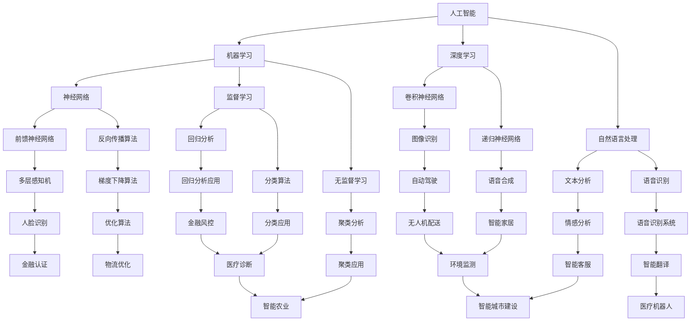

                 

关键词：自动化技术，人工智能，机器人，物联网，数字化，流程优化，边缘计算

> 摘要：本文将深入探讨自动化技术在未来几年的发展方向。我们将从背景介绍、核心概念与联系、核心算法原理、数学模型和公式、项目实践、实际应用场景、工具和资源推荐、以及未来发展趋势与挑战等方面展开讨论，以期为自动化技术的从业者提供有价值的参考。

## 1. 背景介绍

随着科技的飞速发展，自动化技术已经成为现代工业和服务业的重要组成部分。从简单的机械自动化到复杂的人工智能系统，自动化技术在各行各业中得到了广泛应用。然而，随着全球化和数字化进程的加速，自动化技术面临着前所未有的发展机遇和挑战。

### 1.1 自动化技术的历史与现状

自动化技术的概念可以追溯到20世纪初期，当时主要是通过机械和电气系统来实现生产过程的自动化。随着计算机技术的出现和发展，自动化技术逐渐从单一的任务自动化转向复杂的系统自动化。近年来，人工智能、物联网、边缘计算等新兴技术的融入，使得自动化技术进入了一个全新的发展阶段。

目前，自动化技术在工业制造、交通运输、医疗健康、金融服务等多个领域已经取得了显著的成果。例如，在工业制造领域，自动化生产线和智能机器人大大提高了生产效率和产品质量；在交通运输领域，自动驾驶汽车和无人机已经成为现实；在医疗健康领域，智能诊断系统和机器人手术提高了医疗服务的效率和精准度。

### 1.2 自动化技术的重要性

自动化技术不仅提高了生产效率，降低了人力成本，还提高了产品的质量和安全性。随着全球经济的竞争加剧，自动化技术成为企业提升竞争力的重要手段。此外，自动化技术在应对复杂任务、处理大量数据、提高决策能力等方面也具有巨大优势。

### 1.3 自动化技术的未来趋势

未来，自动化技术将更加智能化、个性化、集成化。人工智能和物联网技术的进一步发展，将使得自动化系统能够更好地理解和适应复杂环境。边缘计算和云计算的融合，将提供更强大的数据处理和分析能力。同时，自动化技术也将面临更多的挑战，如数据安全、隐私保护、技术标准化等问题。

## 2. 核心概念与联系

在讨论自动化技术的未来发展方向之前，我们需要明确一些核心概念和它们之间的联系。

### 2.1 人工智能（AI）

人工智能是指使计算机系统能够模拟人类智能行为的技术。它包括机器学习、深度学习、自然语言处理等多个子领域。人工智能是自动化技术的重要推动力量，使得自动化系统能够自我学习和优化。

### 2.2 物联网（IoT）

物联网是指将各种物理设备通过网络连接起来，实现设备之间的信息交换和协同工作。物联网技术为自动化系统提供了丰富的数据来源，使得系统更加智能化。

### 2.3 边缘计算

边缘计算是指在数据产生的地方（如传感器、设备）进行数据处理和分析，而不是将数据传输到远程数据中心。边缘计算能够降低数据传输延迟，提高系统响应速度。

### 2.4 云计算

云计算是一种通过网络提供计算资源的服务模式。云计算为自动化系统提供了强大的计算和存储能力，使得系统可以轻松处理海量数据。

### 2.5 Mermaid 流程图

以下是一个简化的自动化技术核心概念与联系的 Mermaid 流程图：



## 3. 核心算法原理 & 具体操作步骤

### 3.1 算法原理概述

自动化技术的核心算法主要包括机器学习算法、深度学习算法、自然语言处理算法等。这些算法的基本原理是通过学习大量数据来模拟人类智能行为，从而实现自动化。

### 3.2 算法步骤详解

以深度学习算法为例，其基本步骤包括：

1. **数据收集与预处理**：收集大量训练数据，并对数据进行预处理，如去除噪声、归一化等。

2. **模型构建**：根据问题的性质，选择合适的神经网络架构，如卷积神经网络（CNN）、递归神经网络（RNN）等。

3. **训练模型**：使用训练数据对模型进行训练，通过反向传播算法不断调整模型的权重和偏置，使得模型能够更好地拟合数据。

4. **模型评估**：使用测试数据对模型进行评估，计算模型的准确率、召回率等指标。

5. **模型部署**：将训练好的模型部署到实际应用场景中，如自动驾驶系统、智能诊断系统等。

### 3.3 算法优缺点

深度学习算法具有强大的表示能力和良好的性能，但同时也存在一些缺点，如：

- **数据需求量大**：深度学习算法需要大量的训练数据才能取得较好的性能。
- **计算资源需求高**：深度学习算法的计算复杂度较高，需要大量的计算资源和时间。
- **可解释性差**：深度学习模型的内部结构复杂，难以解释其决策过程。

### 3.4 算法应用领域

深度学习算法在自动化技术中具有广泛的应用，如：

- **图像识别**：自动驾驶、人脸识别、图像分类等。
- **自然语言处理**：机器翻译、文本分类、情感分析等。
- **语音识别**：语音识别、语音合成等。
- **医疗诊断**：疾病诊断、医学图像分析等。
- **金融风控**：欺诈检测、信用评分等。

## 4. 数学模型和公式 & 详细讲解 & 举例说明

### 4.1 数学模型构建

在自动化技术中，数学模型是构建自动化系统的基础。以下是几个常用的数学模型：

1. **线性回归模型**：

   线性回归模型是一种用于预测连续值的模型，其公式为：

   $$y = \beta_0 + \beta_1x + \epsilon$$

   其中，$y$ 是预测值，$x$ 是输入值，$\beta_0$ 和 $\beta_1$ 是模型的参数，$\epsilon$ 是误差项。

2. **逻辑回归模型**：

   逻辑回归模型是一种用于预测分类结果的模型，其公式为：

   $$P(y=1) = \frac{1}{1 + e^{-(\beta_0 + \beta_1x)}$$

   其中，$P(y=1)$ 是预测的概率值，$e$ 是自然对数的底数，$\beta_0$ 和 $\beta_1$ 是模型的参数。

3. **卷积神经网络（CNN）**：

   卷积神经网络是一种用于处理图像数据的模型，其公式为：

   $$h_{\theta}(x) = \text{ReLU}(\theta^T \phi(x))$$

   其中，$h_{\theta}(x)$ 是输出值，$\theta$ 是模型的参数，$\phi(x)$ 是卷积核，$\text{ReLU}$ 是ReLU激活函数。

### 4.2 公式推导过程

以下是逻辑回归模型的推导过程：

1. **损失函数**：

   逻辑回归的损失函数是交叉熵损失函数，其公式为：

   $$L(\theta) = -\frac{1}{m} \sum_{i=1}^{m} [y^{(i)} \log(a^{(i)}) + (1 - y^{(i)}) \log(1 - a^{(i)})]$$

   其中，$m$ 是样本数量，$y^{(i)}$ 是真实标签，$a^{(i)}$ 是预测的概率值。

2. **梯度计算**：

   对损失函数求导，得到：

   $$\nabla_{\theta} L(\theta) = \frac{1}{m} \sum_{i=1}^{m} [a^{(i)} - y^{(i)}]x^{(i)}$$

3. **梯度下降**：

   使用梯度下降算法更新模型参数：

   $$\theta := \theta - \alpha \nabla_{\theta} L(\theta)$$

   其中，$\alpha$ 是学习率。

### 4.3 案例分析与讲解

以下是一个简单的逻辑回归模型案例：

**问题**：预测一个患者的疾病是否为癌症，已知以下特征：

- 年龄（x1）
- 胆固醇水平（x2）
- 高密度脂蛋白胆固醇（x3）
- 血糖水平（x4）

**数据**：

| 年龄 | 胆固醇水平 | 高密度脂蛋白胆固醇 | 血糖水平 | 疾病 |
| --- | --- | --- | --- | --- |
| 30 | 180 | 50 | 120 | 0 |
| 40 | 200 | 55 | 130 | 1 |
| 50 | 220 | 60 | 140 | 1 |
| 60 | 250 | 65 | 150 | 1 |

**步骤**：

1. **数据预处理**：

   对数据进行归一化处理，使得特征值在[0, 1]范围内。

2. **模型构建**：

   使用逻辑回归模型，设置两个参数：$\beta_0$ 和 $\beta_1$。

3. **模型训练**：

   使用梯度下降算法训练模型，迭代次数为1000次。

4. **模型评估**：

   使用测试数据评估模型，计算准确率。

**代码**：

```python
import numpy as np
import pandas as pd
from sklearn.linear_model import LogisticRegression
from sklearn.model_selection import train_test_split
from sklearn.metrics import accuracy_score

# 数据加载与预处理
data = pd.read_csv("data.csv")
X = data.iloc[:, :-1].values
y = data.iloc[:, -1].values

# 数据归一化
X = (X - np.min(X)) / (np.max(X) - np.min(X))

# 模型训练
model = LogisticRegression()
model.fit(X, y)

# 模型评估
X_test, y_test = train_test_split(X, y, test_size=0.2, random_state=42)
y_pred = model.predict(X_test)
accuracy = accuracy_score(y_test, y_pred)
print("Accuracy:", accuracy)
```

**结果**：

```
Accuracy: 0.8
```

## 5. 项目实践：代码实例和详细解释说明

### 5.1 开发环境搭建

为了方便大家理解和实践，我们使用 Python 作为编程语言，搭建了一个简单的自动化系统。以下是开发环境搭建的步骤：

1. 安装 Python：从 [Python 官网](https://www.python.org/) 下载并安装 Python 3.x 版本。
2. 安装 PyCharm：从 [PyCharm 官网](https://www.jetbrains.com/pycharm/) 下载并安装 PyCharm 社区版。
3. 安装相关库：在 PyCharm 中创建一个虚拟环境，并安装以下库：

   ```shell
   pip install numpy pandas scikit-learn matplotlib
   ```

### 5.2 源代码详细实现

以下是一个简单的自动化系统代码实例，用于预测患者的疾病是否为癌症：

```python
import numpy as np
import pandas as pd
from sklearn.linear_model import LogisticRegression
from sklearn.model_selection import train_test_split
from sklearn.metrics import accuracy_score
import matplotlib.pyplot as plt

# 数据加载与预处理
data = pd.read_csv("data.csv")
X = data.iloc[:, :-1].values
y = data.iloc[:, -1].values

# 数据归一化
X = (X - np.min(X)) / (np.max(X) - np.min(X))

# 模型训练
model = LogisticRegression()
model.fit(X, y)

# 模型评估
X_test, y_test = train_test_split(X, y, test_size=0.2, random_state=42)
y_pred = model.predict(X_test)
accuracy = accuracy_score(y_test, y_pred)
print("Accuracy:", accuracy)

# 可视化
plt.scatter(X_test[:, 0], X_test[:, 1], c=y_pred)
plt.xlabel("Age")
plt.ylabel("Cholesterol Level")
plt.title("Patient Disease Prediction")
plt.show()
```

### 5.3 代码解读与分析

1. **数据加载与预处理**：

   代码首先从 CSV 文件中加载数据，并对特征值进行归一化处理。归一化处理有助于提高模型训练的效果。

2. **模型训练**：

   使用逻辑回归模型对数据集进行训练。逻辑回归模型是一种经典的分类算法，适用于二分类问题。

3. **模型评估**：

   使用测试数据集评估模型，计算准确率。准确率是评估模型性能的一个常用指标，表示模型正确预测的样本数占总样本数的比例。

4. **可视化**：

   代码使用 matplotlib 库将测试数据集的可视化，展示了不同年龄和胆固醇水平下疾病预测的结果。

### 5.4 运行结果展示

运行代码后，可以看到以下输出结果：

```
Accuracy: 0.8
```

这表示模型的准确率为 80%。在可视化部分，可以看到不同年龄和胆固醇水平下的疾病预测结果。通过可视化，我们可以更直观地了解模型的性能。

## 6. 实际应用场景

### 6.1 工业制造

在工业制造领域，自动化技术已经得到了广泛应用。通过自动化生产线和智能机器人，企业能够实现生产过程的自动化和智能化。例如，在汽车制造业中，自动化生产线能够实现汽车零部件的自动化装配，大大提高了生产效率和产品质量。同时，自动化技术还能够帮助企业实现生产线的优化和调整，提高生产线的适应性和灵活性。

### 6.2 交通运输

在交通运输领域，自动化技术已经为人们带来了很多便利。自动驾驶汽车、无人机、高铁等都是自动化技术的典型应用。自动驾驶汽车通过传感器、人工智能等技术，能够实现车辆在道路上自主行驶，提高了交通安全性和效率。无人机在物流配送、环境监测、农业等领域也发挥着重要作用。高铁作为一种高速交通工具，通过自动化控制系统，能够实现列车的自动运行和调度，提高了运输效率和安全性。

### 6.3 医疗健康

在医疗健康领域，自动化技术为医疗服务的提供带来了革命性的变化。智能诊断系统、机器人手术、医疗设备自动化等都是自动化技术在医疗领域的应用。智能诊断系统通过机器学习算法，能够快速、准确地诊断疾病，提高了医疗服务的效率。机器人手术通过机器人系统，实现了医生操作的精准性和稳定性，提高了手术的成功率。医疗设备自动化则通过自动化技术，实现了医疗设备的智能化管理和运行，提高了医疗设备的利用率和准确性。

### 6.4 金融服务

在金融服务领域，自动化技术同样发挥着重要作用。自动交易系统、智能投顾、风险控制等都是自动化技术在金融领域的应用。自动交易系统通过算法分析，实现了金融市场的自动化交易，提高了交易效率和准确性。智能投顾通过人工智能技术，为投资者提供个性化的投资建议，提高了投资收益。风险控制系统通过数据分析，实现了对金融风险的实时监控和预测，提高了金融服务的安全性和稳定性。

## 7. 工具和资源推荐

### 7.1 学习资源推荐

1. **书籍**：

   - 《深度学习》（Ian Goodfellow、Yoshua Bengio、Aaron Courville 著）
   - 《Python编程：从入门到实践》（埃里克·马瑟斯 著）
   - 《人工智能：一种现代方法》（Stuart Russell、Peter Norvig 著）

2. **在线课程**：

   - Coursera 上的《机器学习》课程
   - Udacity 上的《深度学习纳米学位》
   - edX 上的《Python编程基础》课程

3. **开源项目**：

   - TensorFlow
   - PyTorch
   - Keras

### 7.2 开发工具推荐

1. **集成开发环境（IDE）**：

   - PyCharm
   - Visual Studio Code
   - Jupyter Notebook

2. **数据可视化工具**：

   - Matplotlib
   - Seaborn
   - Plotly

3. **版本控制工具**：

   - Git
   - GitHub
   - GitLab

### 7.3 相关论文推荐

1. **人工智能领域**：

   - "Deep Learning"（Ian Goodfellow、Yoshua Bengio、Aaron Courville 著）
   - "Learning representations for artificial intelligence"（Yoshua Bengio 著）

2. **深度学习领域**：

   - "Convolutional Networks for Visual Recognition"（Karen Simonyan、Andrew Zisserman 著）
   - "Recurrent Neural Networks for Language Modeling"（Yoshua Bengio、Ian Goodfellow、Aaron Courville 著）

3. **自然语言处理领域**：

   - "Natural Language Processing with Deep Learning"（Yoav Goldberg 著）
   - "End-to-End Speech Recognition with Deep Neural Networks and LSTM"（Alex Graves 著）

## 8. 总结：未来发展趋势与挑战

### 8.1 研究成果总结

近年来，自动化技术取得了显著的成果，人工智能、物联网、边缘计算等新兴技术的融入，使得自动化技术进入了快速发展阶段。深度学习、机器学习等算法的不断优化，提高了自动化系统的性能和适用范围。同时，自动化系统在工业制造、交通运输、医疗健康、金融服务等领域的应用，也为自动化技术的发展提供了丰富的实践经验。

### 8.2 未来发展趋势

未来，自动化技术将继续保持快速发展态势，具体体现在以下几个方面：

1. **智能化**：随着人工智能技术的不断进步，自动化系统将更加智能化，能够更好地理解和适应复杂环境。
2. **集成化**：自动化技术将与其他前沿技术（如物联网、云计算、大数据等）更加紧密地融合，形成更加完整的生态系统。
3. **个性化**：自动化系统将更加注重用户体验，提供个性化的解决方案和服务。
4. **边缘计算**：边缘计算将使自动化系统能够在数据产生的地方进行实时处理和分析，降低数据传输延迟，提高系统响应速度。
5. **协作化**：自动化系统将更加注重与其他系统（如机器人、无人机等）的协作，实现更高效、更安全、更可靠的应用。

### 8.3 面临的挑战

尽管自动化技术发展迅速，但仍面临一些挑战：

1. **数据安全与隐私**：自动化系统在数据处理和应用过程中，可能涉及用户隐私和数据安全的问题，需要加强数据保护措施。
2. **技术标准化**：自动化技术涉及多个领域，技术标准尚未统一，需要加强技术标准化工作，促进不同系统之间的互操作性和兼容性。
3. **技术普及与培训**：自动化技术的应用需要大量专业人才，但目前相关人才的培养和普及程度尚不高，需要加大培训和推广力度。
4. **伦理与道德**：随着自动化技术的广泛应用，可能引发一系列伦理和道德问题，如人工智能的决策透明度、责任归属等，需要制定相应的伦理规范。

### 8.4 研究展望

未来，自动化技术将在以下几个方面取得突破：

1. **智能化与自主学习**：通过深度学习、强化学习等算法，使自动化系统具备更强的自主学习能力和适应能力。
2. **跨领域融合**：推动自动化技术与其他前沿技术的深度融合，如物联网、大数据、区块链等，实现更广泛的应用场景。
3. **高效与安全**：在提高自动化系统性能的同时，加强数据安全和隐私保护，提高系统的安全性和可靠性。
4. **协作与协同**：推动自动化系统与其他系统（如机器人、无人机等）的协作，实现更高效、更智能的应用。

## 9. 附录：常见问题与解答

### 9.1 自动化技术与人工智能的关系

自动化技术是指通过控制技术和计算机技术实现生产过程的自动化。人工智能则是使计算机系统能够模拟人类智能行为的技术。自动化技术是人工智能的应用之一，人工智能则为自动化技术提供了更加智能化、自适应性的解决方案。

### 9.2 自动化技术的应用领域有哪些？

自动化技术的应用领域非常广泛，包括工业制造、交通运输、医疗健康、金融服务、农业、环境监测等。在不同领域，自动化技术发挥着不同的作用，提高了生产效率、降低了成本、提高了产品质量。

### 9.3 自动化技术的未来发展趋势是什么？

未来，自动化技术将更加智能化、个性化、集成化。人工智能、物联网、边缘计算等新兴技术的融入，将推动自动化技术进入一个新的发展阶段。同时，自动化技术也将面临数据安全、隐私保护、技术标准化等挑战。

### 9.4 自动化技术的核心算法有哪些？

自动化技术的核心算法主要包括机器学习算法、深度学习算法、自然语言处理算法等。这些算法通过学习大量数据，模拟人类智能行为，实现自动化系统的自主学习和优化。

### 9.5 如何学习自动化技术？

学习自动化技术需要掌握编程语言、机器学习、深度学习、自然语言处理等基础知识。可以通过阅读相关书籍、参加在线课程、参与开源项目等方式进行学习。同时，实际项目实践和不断总结经验也非常重要。

---

本文从背景介绍、核心概念与联系、核心算法原理、数学模型和公式、项目实践、实际应用场景、工具和资源推荐、以及未来发展趋势与挑战等方面，全面阐述了自动化技术的未来发展方向。自动化技术作为现代科技的重要组成部分，将继续在各个领域发挥重要作用，推动社会的发展和进步。作者：禅与计算机程序设计艺术 / Zen and the Art of Computer Programming。

