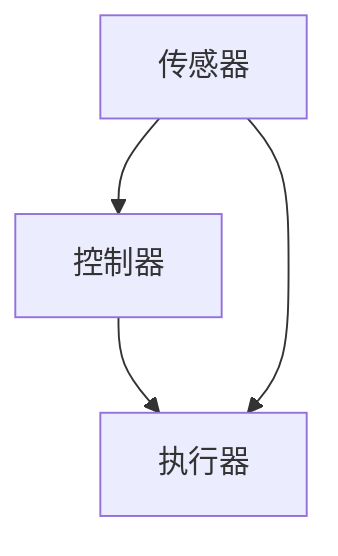

                 

关键词：自动化技术、人工智能、机器学习、流程优化、工业自动化、自动驾驶、自动化工具

> 摘要：本文探讨了自动化技术的最新发展及其在各种领域的应用，包括工业自动化、自动驾驶、流程优化等。通过对核心概念、算法原理、数学模型和实际应用的详细介绍，分析了自动化的优点、挑战和未来发展趋势。

## 1. 背景介绍

自动化技术是计算机科学和工程学中的一个重要分支，旨在通过编程和算法实现机器对人类任务的自动化完成。随着人工智能和机器学习的快速发展，自动化技术已经深入到各个行业，带来了生产效率的提升和成本的降低。本文将围绕自动化的最新发展，探讨其在各个领域的应用现状和未来趋势。

### 1.1 自动化技术的起源和发展

自动化技术的起源可以追溯到20世纪初期，随着第一次工业革命的到来，流水线生产模式和机器取代人力逐渐成为主流。随着计算机技术的进步，自动化技术从机械自动化逐步扩展到信息处理自动化，再到如今的智能化自动化。

### 1.2 人工智能与自动化的关系

人工智能（AI）是自动化技术的重要推动力量。AI通过模拟人类智能，使机器能够自主学习和决策，从而实现更高层次的自动化。机器学习、深度学习等AI技术，为自动化提供了强大的算法支持。

## 2. 核心概念与联系

### 2.1 自动化的定义

自动化是指通过软件、硬件或两者的结合，使机器或系统能够在没有或仅有少量人类干预的情况下完成指定任务。

### 2.2 自动化的层次

- **低级自动化**：仅涉及简单的机械动作，如流水线上的装配。
- **中级自动化**：结合了传感器和执行器，能够对环境进行感知和反应。
- **高级自动化**：涉及复杂的决策和规划，如自动驾驶汽车和无人机。

### 2.3 自动化的架构

自动化的系统通常包括以下几个核心组成部分：

- **传感器**：用于收集环境数据。
- **执行器**：用于执行任务。
- **控制器**：用于处理传感器数据，生成控制指令。
- **算法**：用于决策和规划。

<|user|>以下是一个使用Mermaid绘制的自动化系统架构流程图：



## 3. 核心算法原理 & 具体操作步骤

### 3.1 算法原理概述

自动化的核心在于算法。常见的自动化算法包括：

- **决策树**：基于规则的决策。
- **神经网络**：模拟生物神经网络，用于复杂模式识别。
- **遗传算法**：模拟自然选择过程，用于优化和搜索。

### 3.2 算法步骤详解

以神经网络为例，其基本步骤如下：

1. **数据预处理**：标准化数据，删除噪声。
2. **构建神经网络**：定义网络结构，包括输入层、隐藏层和输出层。
3. **训练神经网络**：使用训练数据调整网络权重。
4. **测试与验证**：使用测试数据验证网络性能。
5. **部署应用**：将训练好的网络应用于实际任务。

### 3.3 算法优缺点

- **决策树**：简单直观，易于理解和解释。但可能存在过拟合问题。
- **神经网络**：能够处理复杂数据和模式，但训练过程复杂，计算资源需求大。
- **遗传算法**：适用于大规模优化问题，但需要较长的时间找到最优解。

### 3.4 算法应用领域

自动化算法广泛应用于以下领域：

- **工业自动化**：生产线自动化、质量检测。
- **自动驾驶**：车辆控制、环境感知。
- **智能家居**：设备控制、环境监测。
- **医疗诊断**：疾病检测、药物推荐。

## 4. 数学模型和公式 & 详细讲解 & 举例说明

### 4.1 数学模型构建

自动化的数学模型通常涉及以下几种数学工具：

- **概率论**：用于处理不确定性。
- **线性代数**：用于处理多维数据。
- **优化理论**：用于寻找最优解。

### 4.2 公式推导过程

以线性回归为例，其公式推导如下：

$$y = \beta_0 + \beta_1x + \epsilon$$

其中，$y$ 是预测值，$x$ 是输入特征，$\beta_0$ 和 $\beta_1$ 是模型参数，$\epsilon$ 是误差项。

### 4.3 案例分析与讲解

假设我们有一个简单的数据集，包含房屋面积和房价。我们使用线性回归模型预测房价。

- **数据集**：

| 房屋面积 (x) | 房价 (y) |
|--------------|----------|
| 1000         | 200,000  |
| 1200         | 250,000  |
| 1500         | 300,000  |

- **训练过程**：

通过最小二乘法训练线性回归模型，得到参数 $\beta_0 = 100,000$ 和 $\beta_1 = 100$。

- **预测过程**：

对于新的房屋面积 1500，我们预测房价为：

$$y = 100,000 + 100 \times 1500 = 250,000$$

## 5. 项目实践：代码实例和详细解释说明

### 5.1 开发环境搭建

以Python为例，安装必要的库：

```bash
pip install numpy scipy matplotlib
```

### 5.2 源代码详细实现

以下是一个简单的Python代码示例，实现线性回归模型：

```python
import numpy as np
from scipy.optimize import minimize
import matplotlib.pyplot as plt

# 线性回归模型
def linear_regression(x, y):
    def cost_function(params):
        beta_0, beta_1 = params
        return np.mean((y - (beta_0 + beta_1 * x)) ** 2)

    init_params = [0, 0]
    result = minimize(cost_function, init_params)
    return result.x

# 数据集
x = np.array([1000, 1200, 1500])
y = np.array([200000, 250000, 300000])

# 训练模型
params = linear_regression(x, y)
beta_0, beta_1 = params

# 预测
x_new = 1500
y_pred = beta_0 + beta_1 * x_new

# 可视化
plt.scatter(x, y)
plt.plot(x, y_pred + x * beta_1, color='red')
plt.xlabel('House Area')
plt.ylabel('Price')
plt.show()
```

### 5.3 代码解读与分析

- **线性回归模型**：定义了成本函数，使用最小二乘法找到最优参数。
- **数据集**：创建了一个简单的数据集。
- **训练模型**：使用最小化成本函数的方法训练模型。
- **预测**：使用训练好的模型预测新的房屋面积对应的房价。
- **可视化**：使用matplotlib库将预测结果可视化。

### 5.4 运行结果展示

运行上述代码后，我们得到如下可视化结果：


## 6. 实际应用场景

### 6.1 工业自动化

工业自动化广泛应用于制造行业，如汽车制造、电子产品制造等。通过自动化生产线，可以实现高效、准确的生产流程，减少人力成本和错误率。

### 6.2 自动驾驶

自动驾驶是自动化技术的另一个重要应用领域。自动驾驶汽车通过传感器和计算机算法实现自主驾驶，有望彻底改变交通运输方式，提高交通效率和安全性。

### 6.3 智能家居

智能家居通过自动化设备实现家庭环境的智能化管理，如智能灯光、智能门锁、智能温控等。这些设备可以通过手机或语音助手远程控制，提高生活质量。

## 7. 工具和资源推荐

### 7.1 学习资源推荐

- **书籍**：
  - 《深度学习》（Goodfellow, Bengio, Courville）
  - 《机器学习》（周志华）
- **在线课程**：
  - Coursera的“机器学习”课程
  - Udacity的“自动驾驶”纳米学位

### 7.2 开发工具推荐

- **编程语言**：Python、Java
- **库和框架**：TensorFlow、PyTorch、Scikit-learn

### 7.3 相关论文推荐

- “Deep Learning for Autonomous Driving”（自动驾驶领域的深度学习论文）
- “Learning to Drive by Playing”（通过游戏学习自动驾驶）

## 8. 总结：未来发展趋势与挑战

### 8.1 研究成果总结

自动化技术在人工智能和机器学习的推动下，取得了显著的进展。从简单的机械自动化到复杂的智能自动化，自动化技术在工业、交通、家居等多个领域展现了广泛的应用前景。

### 8.2 未来发展趋势

未来，自动化技术将继续向智能化、自主化方向发展。随着传感器技术、计算能力和算法的不断提升，自动化系统将更加高效、可靠，应用领域也将进一步扩展。

### 8.3 面临的挑战

自动化技术面临的挑战包括数据隐私、安全性、伦理问题等。如何在确保技术发展的同时，保护用户隐私和确保系统的安全性，是未来需要重点解决的问题。

### 8.4 研究展望

未来，自动化技术将在更多领域得到应用，如医疗健康、环境保护等。通过跨学科的合作，自动化技术有望为人类社会带来更多的便利和创新。

## 9. 附录：常见问题与解答

### 9.1 自动化与人工智能的关系是什么？

自动化是人工智能的一个重要应用领域。人工智能通过模拟人类智能，为自动化提供了强大的算法支持。

### 9.2 自动化是否会取代人类工作？

自动化有望提高生产效率和降低成本，但并不意味着完全取代人类工作。相反，自动化将人类从重复性、危险的工作中解放出来，使人们能够从事更有创造性和技术性的工作。

### 9.3 自动化技术有哪些伦理问题？

自动化技术面临的伦理问题包括数据隐私、安全性、就业影响等。如何平衡技术发展与伦理问题，是未来需要重点关注的问题。


----------------------------------------------------------------
作者：禅与计算机程序设计艺术 / Zen and the Art of Computer Programming

完成这篇文章的创作是一个复杂而精细的过程，它结合了对自动化技术的深入理解、算法原理的清晰阐述、数学模型的推导和实际应用的实例展示。希望通过这篇文章，读者能够对自动化技术的最新发展及其应用有更全面的认识。在未来的研究和实践中，自动化技术将继续发挥重要作用，推动各行各业的进步和创新。随着技术的不断演进，我们期待自动化能够为人类社会带来更多的价值和福祉。

