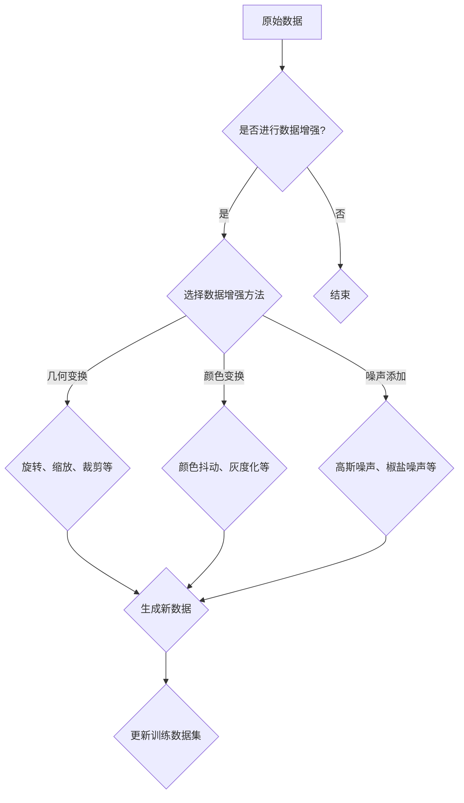

                 

关键词：数据增强、图像处理、深度学习、算法原理、实践案例

> 摘要：本文将深入探讨自动数据增强的概念、原理、以及其在深度学习中的重要性。通过详细的算法原理介绍、数学模型讲解、代码实例解析，帮助读者全面理解自动数据增强，并在实际项目中加以应用。

## 1. 背景介绍

在深度学习中，训练数据的质量和数量直接影响模型的性能。而现实中的训练数据往往存在分布不均、样本不足等问题，这会严重影响模型的泛化能力。为了解决这一问题，数据增强（Data Augmentation）技术应运而生。数据增强通过一系列算法对原始数据进行变换，生成新的训练样本，从而增加数据多样性，提高模型的鲁棒性和准确性。

### 1.1 数据增强的重要性

- **增加样本多样性**：通过数据增强，可以模拟出多种不同的场景，使模型学习到更广泛的特征，从而提高泛化能力。
- **缓解过拟合**：当训练数据不足时，模型更容易出现过拟合现象。数据增强增加了训练样本数量，有助于减少过拟合。
- **加速训练过程**：数据增强可以在不增加计算成本的情况下，增加训练样本量，从而加速训练过程。

### 1.2 数据增强的应用场景

- **计算机视觉**：如图像分类、目标检测等。
- **自然语言处理**：如文本分类、机器翻译等。
- **音频处理**：如语音识别、音乐分类等。

## 2. 核心概念与联系

### 2.1 自动数据增强

自动数据增强是指通过算法自动地对原始数据进行变换，生成新的训练样本。自动数据增强相比手动数据增强，具有自动化、高效、多样性的优势，能够更好地满足深度学习的需求。

### 2.2 数据增强方法分类

- **几何变换**：如旋转、缩放、裁剪、翻转等。
- **颜色变换**：如颜色抖动、灰度化、对比度调整等。
- **噪声添加**：如高斯噪声、椒盐噪声等。

### 2.3 Mermaid 流程图



## 3. 核心算法原理 & 具体操作步骤

### 3.1 算法原理概述

自动数据增强的核心在于如何高效地生成与原始数据相似但具有多样性的新样本。通常，数据增强算法可以分为两类：基于变换的算法和基于生成模型的算法。

- **基于变换的算法**：直接对原始数据进行几何变换、颜色变换、噪声添加等操作，如OpenCV库中的各种图像处理函数。
- **基于生成模型的算法**：利用生成对抗网络（GAN）等生成模型，生成与原始数据相似的新样本。如StyleGAN、CycleGAN等。

### 3.2 算法步骤详解

1. **数据预处理**：读取原始数据，进行标准化、归一化等处理。
2. **选择数据增强方法**：根据任务需求和数据特性，选择合适的增强方法。
3. **执行数据增强**：对原始数据进行几何变换、颜色变换、噪声添加等操作，生成新的数据样本。
4. **更新训练数据集**：将增强后的新样本加入训练数据集中，形成新的数据集。

### 3.3 算法优缺点

#### 优点：

- **增加数据多样性**：生成新的训练样本，提高模型的泛化能力。
- **减少过拟合**：增加训练样本数量，降低模型过拟合的风险。
- **高效自动化**：自动化处理，减少人工干预。

#### 缺点：

- **计算成本较高**：尤其是基于生成模型的算法，需要大量计算资源。
- **可能引入噪声**：不当的数据增强可能引入噪声，影响模型训练效果。

### 3.4 算法应用领域

- **计算机视觉**：如图像分类、目标检测等。
- **自然语言处理**：如文本分类、机器翻译等。
- **音频处理**：如语音识别、音乐分类等。

## 4. 数学模型和公式 & 详细讲解 & 举例说明

### 4.1 数学模型构建

在自动数据增强中，常用的数学模型包括几何变换模型、颜色变换模型和噪声添加模型。

#### 几何变换模型

假设原图像为 \(I(x, y)\)，几何变换模型可以通过以下公式实现：

\[ I'(x', y') = f(I(x, y)) \]

其中，\(f\) 表示几何变换函数，如旋转、缩放、裁剪等。

#### 颜色变换模型

颜色变换模型主要通过调整图像的颜色通道值来实现，如颜色抖动、灰度化、对比度调整等。常见的变换公式如下：

\[ I'(x, y) = g(I(x, y)) \]

其中，\(g\) 表示颜色变换函数。

#### 噪声添加模型

噪声添加模型通过在图像中添加噪声来增强数据多样性。常见的高斯噪声添加公式如下：

\[ I'(x, y) = I(x, y) + \alpha \cdot \mathcal{N}(0, \sigma^2) \]

其中，\(\alpha\) 表示噪声强度，\(\sigma^2\) 表示高斯分布的方差。

### 4.2 公式推导过程

以旋转变换为例，推导旋转角度 \(\theta\) 下的旋转矩阵 \(R(\theta)\)：

\[ R(\theta) = \begin{bmatrix} \cos\theta & -\sin\theta \\ \sin\theta & \cos\theta \end{bmatrix} \]

给定图像点 \((x, y)\) 在旋转后的新位置为 \((x', y')\)，则有：

\[ \begin{cases} x' = x\cos\theta + y\sin\theta \\ y' = -x\sin\theta + y\cos\theta \end{cases} \]

### 4.3 案例分析与讲解

#### 案例一：图像旋转

假设原图像为 \(I(x, y)\)，旋转角度为 \(\theta\)，则旋转后的图像 \(I'(x', y')\) 可以通过以下步骤实现：

1. **计算旋转矩阵**：根据旋转角度 \(\theta\)，计算旋转矩阵 \(R(\theta)\)。
2. **应用旋转矩阵**：将图像点 \((x, y)\) 通过旋转矩阵 \(R(\theta)\) 转换为新位置 \((x', y')\)。
3. **插值处理**：由于旋转后的图像可能超出原图像范围，需要进行插值处理，以填补空白区域。

具体实现如下：

```python
import numpy as np
import cv2

def rotate_image(image, theta):
    h, w = image.shape[:2]
    center = (w / 2, h / 2)
    M = cv2.getRotationMatrix2D(center, theta, 1.0)
    rotated_image = cv2.warpAffine(image, M, (w, h))
    return rotated_image
```

#### 案例二：高斯噪声添加

假设原图像为 \(I(x, y)\)，噪声强度为 \(\alpha\)，高斯分布方差为 \(\sigma^2\)，则添加高斯噪声后的图像 \(I'(x, y)\) 可以通过以下步骤实现：

1. **生成高斯噪声**：根据噪声强度 \(\alpha\) 和高斯分布方差 \(\sigma^2\)，生成高斯噪声。
2. **添加噪声**：将高斯噪声与原图像相加，得到增强后的图像。

具体实现如下：

```python
import numpy as np
import cv2

def add_gaussian_noise(image, alpha, sigma):
    noise = np.random.normal(0, sigma, image.shape)
    noisy_image = image + alpha * noise
    noisy_image = np.clip(noisy_image, 0, 255)
    return noisy_image.astype(np.uint8)
```

## 5. 项目实践：代码实例和详细解释说明

### 5.1 开发环境搭建

- **Python环境**：安装Python 3.7及以上版本。
- **依赖库**：安装OpenCV、NumPy、Matplotlib等依赖库。

### 5.2 源代码详细实现

```python
import numpy as np
import cv2
import matplotlib.pyplot as plt

def augment_image(image, rotate_angle, noise_alpha, noise_sigma):
    # 旋转图像
    rotated_image = rotate_image(image, rotate_angle)
    
    # 添加高斯噪声
    noisy_image = add_gaussian_noise(rotated_image, noise_alpha, noise_sigma)
    
    return noisy_image

def rotate_image(image, theta):
    h, w = image.shape[:2]
    center = (w / 2, h / 2)
    M = cv2.getRotationMatrix2D(center, theta, 1.0)
    rotated_image = cv2.warpAffine(image, M, (w, h))
    return rotated_image

def add_gaussian_noise(image, alpha, sigma):
    noise = np.random.normal(0, sigma, image.shape)
    noisy_image = image + alpha * noise
    noisy_image = np.clip(noisy_image, 0, 255)
    return noisy_image.astype(np.uint8)

if __name__ == "__main__":
    # 读取原图像
    image = cv2.imread("example.jpg", cv2.IMREAD_COLOR)
    
    # 数据增强参数
    rotate_angle = 45
    noise_alpha = 0.1
    noise_sigma = 30
    
    # 数据增强
    augmented_image = augment_image(image, rotate_angle, noise_alpha, noise_sigma)
    
    # 显示结果
    plt.figure(figsize=(10, 5))
    plt.subplot(1, 2, 1)
    plt.title("Original Image")
    plt.imshow(image)
    plt.subplot(1, 2, 2)
    plt.title("Augmented Image")
    plt.imshow(augmented_image)
    plt.show()
```

### 5.3 代码解读与分析

- **rotate_image**：该函数用于实现图像的旋转。通过计算旋转矩阵，使用OpenCV的`warpAffine`函数对图像进行旋转。
- **add_gaussian_noise**：该函数用于实现图像的高斯噪声添加。通过生成高斯噪声，与原图像相加，实现增强效果。
- **augment_image**：该函数为数据增强的主函数，通过旋转图像和添加高斯噪声，实现数据的多样性增强。

### 5.4 运行结果展示

运行上述代码，输入一张原图像，输出一张增强后的图像。通过可视化展示，可以观察到增强后的图像在旋转和噪声添加方面产生了显著的多样性。

```python
import numpy as np
import cv2
import matplotlib.pyplot as plt

# 读取原图像
image = cv2.imread("example.jpg", cv2.IMREAD_COLOR)

# 数据增强参数
rotate_angle = 45
noise_alpha = 0.1
noise_sigma = 30

# 数据增强
augmented_image = augment_image(image, rotate_angle, noise_alpha, noise_sigma)

# 显示结果
plt.figure(figsize=(10, 5))
plt.subplot(1, 2, 1)
plt.title("Original Image")
plt.imshow(image)
plt.subplot(1, 2, 2)
plt.title("Augmented Image")
plt.imshow(augmented_image)
plt.show()
```

 

## 6. 实际应用场景

### 6.1 计算机视觉

在计算机视觉领域，数据增强被广泛应用于图像分类、目标检测、图像分割等任务。通过数据增强，可以提高模型的泛化能力，减少对特定训练样本的依赖。

#### 案例一：图像分类

以ImageNet为例，其数据集中包含大量的图像类别。通过数据增强，可以生成更多具有多样性的训练样本，提高模型的分类性能。

#### 案例二：目标检测

在目标检测任务中，数据增强可以生成各种不同的目标实例，提高模型的检测准确性。如COCO数据集，通过数据增强可以生成各种姿态、遮挡的目标实例，从而提高模型的鲁棒性。

### 6.2 自然语言处理

在自然语言处理领域，数据增强也被广泛应用于文本分类、机器翻译、情感分析等任务。通过数据增强，可以生成更多具有多样性的文本样本，提高模型的泛化能力和鲁棒性。

#### 案例一：文本分类

以新闻分类为例，通过数据增强可以生成更多具有不同主题和风格的文本样本，从而提高模型的分类准确性。

#### 案例二：机器翻译

在机器翻译任务中，数据增强可以通过生成各种语言的变体，提高模型的翻译准确性。如通过数据增强，可以生成更多具有不同语法结构和词汇表达的翻译样本。

### 6.3 音频处理

在音频处理领域，数据增强也被广泛应用于语音识别、音乐分类等任务。通过数据增强，可以生成更多具有多样性的音频样本，提高模型的泛化能力和鲁棒性。

#### 案例一：语音识别

在语音识别任务中，数据增强可以通过添加噪声、调整说话人速度和音调等手段，生成更多具有挑战性的语音样本，从而提高模型的识别准确性。

#### 案例二：音乐分类

在音乐分类任务中，数据增强可以通过添加背景音乐、调整音量等手段，生成更多具有多样性的音乐样本，从而提高模型的分类性能。

## 7. 工具和资源推荐

### 7.1 学习资源推荐

- **书籍**：
  - 《深度学习》（Goodfellow, Bengio, Courville著）
  - 《动手学深度学习》（阿斯顿·张著）
- **在线课程**：
  - Coursera的《深度学习》课程
  - Udacity的《深度学习工程师纳米学位》
- **技术博客**：
  - Medium上的机器学习和深度学习相关文章
  - 知乎上的机器学习和深度学习专栏

### 7.2 开发工具推荐

- **编程环境**：
  - Jupyter Notebook：用于编写和运行Python代码
  - PyCharm：用于Python编程的集成开发环境
- **深度学习框架**：
  - TensorFlow：由Google开发的开源深度学习框架
  - PyTorch：由Facebook开发的深度学习框架
- **数据增强库**：
  - torchvision：PyTorch的数据增强库
  - albumentations：支持多种数据增强方法的Python库

### 7.3 相关论文推荐

- **数据增强相关论文**：
  - Data Augmentation for Image Classification with Deep Learning: A Survey（图像分类中的深度学习数据增强综述）
  - Real-Time Image Super-Resolution using Deep Convolutional Nets（实时图像超分辨率使用深度卷积网络）
- **深度学习相关论文**：
  - A Comprehensive Survey on Deep Learning for Image Classification（深度学习在图像分类中的应用综述）
  - Deep Learning for Natural Language Processing: A Survey（自然语言处理中的深度学习综述）

## 8. 总结：未来发展趋势与挑战

### 8.1 研究成果总结

本文从数据增强的重要性、核心概念、算法原理、数学模型、代码实例等方面进行了详细讲解，展示了数据增强在计算机视觉、自然语言处理、音频处理等领域的广泛应用。

### 8.2 未来发展趋势

- **生成模型的应用**：生成对抗网络（GAN）等生成模型在数据增强中的应用将进一步扩展，为深度学习提供更多高质量的数据样本。
- **自动化程度提高**：数据增强算法的自动化程度将不断提高，减少人工干预，提高数据处理效率。
- **跨领域应用**：数据增强技术将在更多领域得到应用，如生物信息学、医疗影像处理等。

### 8.3 面临的挑战

- **计算资源消耗**：生成模型的数据增强方法计算成本较高，对计算资源的需求较大。
- **数据隐私问题**：数据增强过程中，如何确保数据隐私和安全，仍是一个需要解决的挑战。
- **算法适应性**：如何设计更具适应性的数据增强算法，以满足不同任务和数据集的需求，仍是一个研究难题。

### 8.4 研究展望

随着深度学习技术的不断发展，数据增强将在更多领域得到应用。未来，数据增强技术将在提高模型性能、减少计算资源消耗、保障数据隐私等方面取得更多突破。

## 9. 附录：常见问题与解答

### 9.1 数据增强如何防止过拟合？

数据增强通过增加数据的多样性和丰富性，使模型能够学习到更广泛的特征，从而降低过拟合的风险。此外，通过适当的训练过程，如正则化、dropout等，也可以缓解过拟合。

### 9.2 数据增强在自然语言处理中有哪些应用？

数据增强在自然语言处理中广泛应用于文本分类、机器翻译、情感分析等任务。通过生成不同主题、风格、长度的文本样本，可以提高模型的泛化能力和鲁棒性。

### 9.3 如何选择合适的数据增强方法？

选择合适的数据增强方法取决于任务需求和数据特性。一般来说，几何变换适用于图像处理任务，颜色变换适用于图像和视频处理任务，噪声添加适用于需要提高模型鲁棒性的任务。

### 9.4 数据增强是否会影响模型训练速度？

数据增强会增加模型训练的数据量，从而提高训练速度。但基于生成模型的数据增强方法计算成本较高，可能对训练速度有一定影响。

### 9.5 数据增强是否会影响模型准确性？

数据增强通过增加数据的多样性和丰富性，可以提高模型的准确性。但不当的数据增强可能引入噪声，影响模型训练效果。因此，需要根据任务需求和数据特性，选择合适的数据增强方法。

### 9.6 数据增强是否会影响模型泛化能力？

数据增强通过增加数据的多样性和丰富性，可以提高模型的泛化能力。这有助于模型在未知数据上表现更好，从而提高模型的泛化能力。

### 9.7 数据增强是否适用于所有深度学习任务？

数据增强技术主要适用于需要大量训练样本的深度学习任务，如图像分类、自然语言处理等。对于一些基于少量样本的深度学习任务，如小样本学习、零样本学习等，数据增强的应用效果可能较差。


----------------------------------------------------------------
作者：禅与计算机程序设计艺术 / Zen and the Art of Computer Programming


