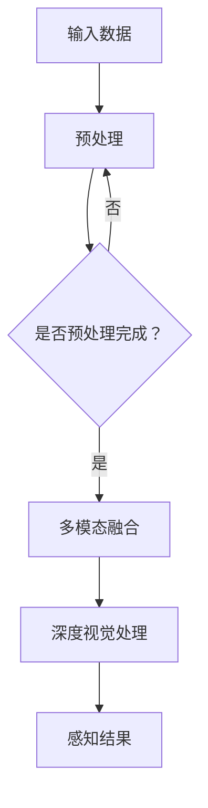

                 

自动驾驶作为人工智能领域的一个重要分支，近年来取得了显著的进展。在自动驾驶系统中，感知模块的作用至关重要，它负责从周围环境中获取信息，并用于做出实时的驾驶决策。深度视觉与多模态融合感知技术正是在这一背景下应运而生，它通过结合多种传感器数据，提高了感知的准确性和鲁棒性。

本文将围绕深度视觉与多模态融合感知在自动驾驶中的应用进行深入探讨。首先，我们将介绍自动驾驶的发展背景和多模态融合感知的基本概念。接着，我们将详细解析核心算法原理，并展示具体操作步骤。随后，我们将通过数学模型和公式对算法进行详细讲解，并辅以实例分析。最后，我们将展示项目实践中的代码实例，探讨实际应用场景，并展望未来发展趋势和面临的挑战。

## 1. 背景介绍

自动驾驶技术的发展可以追溯到20世纪50年代。然而，随着计算机科学和人工智能技术的快速发展，自动驾驶技术逐渐从理论研究走向实际应用。近年来，深度学习和多传感器融合技术的崛起，为自动驾驶感知系统带来了革命性的变化。

在自动驾驶系统中，感知模块是至关重要的组成部分。它需要从周围环境中获取丰富的信息，包括道路标志、交通信号、行人和车辆等。传统的感知方法主要依赖于单个传感器，如雷达、激光雷达（LiDAR）或摄像头。这些传感器有其独特的优点和局限性，单一传感器很难满足自动驾驶系统对高精度、实时性和鲁棒性的要求。

多模态融合感知技术通过结合多种传感器数据，提高了感知系统的整体性能。深度视觉技术作为多模态感知的核心组成部分，利用计算机视觉算法对图像进行处理和分析，提取出道路和周围环境的重要特征。多模态融合感知不仅考虑了视觉信息，还结合了其他类型的传感器数据，如雷达、超声波和惯性测量单元（IMU），从而实现了对环境的全面感知。

## 2. 核心概念与联系

### 2.1 深度视觉

深度视觉（Deep Vision）是一种基于深度学习的方法，通过构建多层神经网络对图像进行处理和分析。深度视觉的关键在于其能够自动从大量数据中学习到有效的特征表示，从而实现图像分类、目标检测、语义分割等多种任务。

深度视觉在自动驾驶中的应用主要包括以下几个方面：

1. **目标检测**：通过识别道路上的车辆、行人、交通标志等目标，为自动驾驶系统提供准确的感知信息。
2. **语义分割**：对道路场景进行精细的分割，提取出不同的道路元素，如车道线、行人区域等。
3. **图像识别**：识别图像中的物体和场景，用于导航和路径规划。

### 2.2 多模态融合感知

多模态融合感知（Multimodal Fusion Perception）是指将多种传感器数据结合起来，以提高感知系统的性能。在自动驾驶中，常用的传感器包括摄像头、雷达、LiDAR和IMU等。多模态融合感知通过以下方式提高感知性能：

1. **数据互补**：不同传感器具有不同的感知特性和局限性，通过融合多种传感器数据，可以弥补单一传感器的不足，提高感知的准确性。
2. **特征增强**：不同传感器提供的数据可以在特征层面进行互补和增强，从而提高感知系统的鲁棒性。
3. **实时性提升**：多模态融合可以平衡不同传感器的响应时间，提高系统的实时性。

### 2.3 Mermaid 流程图

以下是一个简单的Mermaid流程图，展示了深度视觉与多模态融合感知的基本架构：



## 3. 核心算法原理 & 具体操作步骤

### 3.1 算法原理概述

深度视觉与多模态融合感知算法的基本原理可以概括为以下几个步骤：

1. **数据输入**：收集来自各种传感器的数据，包括摄像头图像、雷达点云、IMU数据等。
2. **预处理**：对输入数据进行预处理，包括去噪、归一化和特征提取等。
3. **多模态融合**：将预处理后的数据通过融合算法进行整合，提高感知系统的鲁棒性。
4. **深度视觉处理**：利用深度学习算法对融合后的数据进行特征提取和目标检测等任务。
5. **感知结果输出**：将处理后的感知结果输出给自动驾驶系统，用于做出实时的驾驶决策。

### 3.2 算法步骤详解

1. **数据输入**：

   - 摄像头图像：每秒采集一定频率的图像数据。
   - 雷达点云：每秒采集雷达的扫描点云数据。
   - IMU数据：实时采集加速度、角速度等数据。

2. **预处理**：

   - 去噪：对图像和点云数据进行去噪处理，提高数据的清洁度。
   - 归一化：对图像和点云数据进行归一化处理，使数据具有相同的尺度。
   - 特征提取：从图像和点云中提取关键特征，如边缘、轮廓和点云密度等。

3. **多模态融合**：

   - 特征级融合：将预处理后的图像特征和点云特征进行融合，可以使用特征拼接、特征融合网络等方法。
   - 时空级融合：将不同时间点的图像和点云数据进行时空融合，可以使用动态时间战争算法（DTW）或长时间序列模型（如RNN）。
   - 空间级融合：将不同传感器获取的空间信息进行融合，如雷达点云和摄像头图像的空间对齐。

4. **深度视觉处理**：

   - 目标检测：使用深度学习模型（如YOLO、SSD、Faster R-CNN等）对融合后的数据进行目标检测。
   - 语义分割：使用深度学习模型（如U-Net、DeepLab V3+等）对融合后的数据进行语义分割。
   - 图像识别：使用深度学习模型（如ResNet、Inception等）对图像进行分类和识别。

5. **感知结果输出**：

   - 将处理后的感知结果（如目标位置、行人轨迹、车道线等）输出给自动驾驶系统。
   - 根据感知结果，自动驾驶系统可以做出相应的驾驶决策，如加速、减速、转弯等。

### 3.3 算法优缺点

#### 优点：

1. **提高感知准确性**：通过多模态融合，可以弥补单一传感器的局限性，提高感知系统的准确性。
2. **增强鲁棒性**：多模态融合可以增强系统的鲁棒性，减少噪声和异常值对感知结果的影响。
3. **实时性提升**：多模态融合可以平衡不同传感器的响应时间，提高系统的实时性。

#### 缺点：

1. **计算复杂度高**：多模态融合和深度视觉处理需要大量的计算资源，对硬件性能有较高要求。
2. **数据预处理复杂**：不同传感器的数据预处理方法可能有所不同，增加了系统的复杂度。
3. **算法优化困难**：多模态融合和深度视觉算法涉及多个领域的技术，优化和调整过程相对困难。

### 3.4 算法应用领域

深度视觉与多模态融合感知技术在自动驾驶领域具有广泛的应用前景，主要包括以下领域：

1. **自动驾驶车辆**：用于车辆周围环境的感知，包括车辆检测、行人检测、交通标志识别等。
2. **智能交通系统**：用于交通流量监控、交通事故预警、交通信号优化等。
3. **无人机与机器人**：用于无人机和机器人对周围环境的感知，包括路径规划、目标追踪等。

## 4. 数学模型和公式 & 详细讲解 & 举例说明

### 4.1 数学模型构建

在深度视觉与多模态融合感知中，常用的数学模型包括卷积神经网络（CNN）、循环神经网络（RNN）和注意力机制等。

1. **卷积神经网络（CNN）**：

   CNN是一种用于图像处理的深度学习模型，其核心思想是通过对图像进行卷积运算和池化操作，提取图像的特征表示。以下是一个简单的CNN模型的结构：

   ```mermaid
   graph TD
       A[输入图像] --> B[卷积层1]
       B --> C[ReLU激活]
       C --> D[卷积层2]
       D --> E[ReLU激活]
       E --> F[池化层]
       F --> G[全连接层]
       G --> H[输出结果]
   ```

2. **循环神经网络（RNN）**：

   RNN是一种用于序列数据处理的深度学习模型，其特点是能够记住前面的输入信息，适用于时间序列数据、语音识别等任务。以下是一个简单的RNN模型的结构：

   ```mermaid
   graph TD
       A[输入序列] --> B[输入层]
       B --> C[RNN层1]
       C --> D[RNN层2]
       D --> E[RNN层3]
       E --> F[输出层]
   ```

3. **注意力机制**：

   注意力机制是一种用于提高模型对输入数据关注度的方法，通过动态调整模型对不同输入部分的权重，从而提高模型的性能。以下是一个简单的注意力机制的实现：

   ```mermaid
   graph TD
       A[输入序列] --> B[注意力权重计算]
       B --> C[加权求和]
       C --> D[输出结果]
   ```

### 4.2 公式推导过程

以下是深度视觉与多模态融合感知中的一些关键公式：

1. **卷积运算**：

   假设输入图像为\(I_{in}\)，卷积核为\(K\)，卷积结果为\(I_{out}\)，则有：

   \[
   I_{out}(i, j) = \sum_{m=0}^{M-1} \sum_{n=0}^{N-1} K(m, n) \cdot I_{in}(i-m, j-n)
   \]

   其中，\(M\)和\(N\)分别为卷积核的大小。

2. **ReLU激活函数**：

   ReLU（Rectified Linear Unit）是一种常用的激活函数，其公式为：

   \[
   \text{ReLU}(x) = \max(0, x)
   \]

3. **池化运算**：

   假设输入图像为\(I_{in}\)，池化窗口为\(W\)，池化结果为\(I_{out}\)，则有：

   \[
   I_{out}(i, j) = \max_{(x, y) \in W} I_{in}(i+x, j+y)
   \]

   其中，\(W\)为一个以\(i, j\)为中心的窗口。

4. **循环神经网络（RNN）的递推公式**：

   假设输入序列为\(X_t\)，隐藏状态为\(h_t\)，则有：

   \[
   h_t = \text{ReLU}(W \cdot [h_{t-1}, X_t] + b)
   \]

   其中，\(W\)和\(b\)分别为权重和偏置。

5. **注意力权重计算**：

   假设输入序列为\(X_t\)，注意力权重为\(a_t\)，则有：

   \[
   a_t = \text{softmax}(W_a \cdot X_t + b_a)
   \]

   其中，\(W_a\)和\(b_a\)分别为权重和偏置。

### 4.3 案例分析与讲解

以下是一个简单的案例，用于演示深度视觉与多模态融合感知的应用。

假设我们有一个自动驾驶车辆，需要从摄像头和雷达中获取周围环境的信息，并做出实时的驾驶决策。

1. **数据输入**：

   - 摄像头图像：每秒采集一张图像。
   - 雷达点云：每秒采集一次雷达扫描点云。

2. **预处理**：

   - 去噪：对摄像头图像和雷达点云进行去噪处理，使用中值滤波器和高斯滤波器。
   - 归一化：对图像和点云进行归一化处理，使其具有相同的尺度。

3. **多模态融合**：

   - 特征级融合：将预处理后的图像特征和点云特征进行拼接，形成一个新的特征向量。
   - 时空级融合：将连续时间点的图像和点云特征进行拼接，形成一个新的特征序列。

4. **深度视觉处理**：

   - 目标检测：使用卷积神经网络对融合后的特征进行目标检测，识别道路上的车辆、行人等目标。
   - 语义分割：使用循环神经网络对融合后的特征进行语义分割，提取出道路、行人等元素。
   - 图像识别：使用注意力机制对融合后的特征进行图像识别，识别道路标志、交通信号等。

5. **感知结果输出**：

   - 将处理后的感知结果输出给自动驾驶系统，用于做出实时的驾驶决策。

通过这个案例，我们可以看到深度视觉与多模态融合感知技术在自动驾驶中的应用流程。在实际应用中，根据具体的需求，可以选择不同的模型和算法进行优化和调整。

## 5. 项目实践：代码实例和详细解释说明

### 5.1 开发环境搭建

在开始项目实践之前，我们需要搭建一个合适的开发环境。以下是搭建开发环境的基本步骤：

1. **安装Python环境**：Python是深度学习和多模态融合感知的主要编程语言，我们需要安装Python 3.7及以上版本。
2. **安装深度学习库**：安装TensorFlow或PyTorch等深度学习库，用于构建和训练神经网络模型。
3. **安装其他依赖库**：安装numpy、pandas、opencv等常用库，用于数据预处理和图像处理。
4. **配置环境变量**：配置Python和深度学习库的环境变量，确保能够顺利运行代码。

### 5.2 源代码详细实现

以下是一个简单的深度视觉与多模态融合感知项目的代码实现，主要分为以下几个部分：

1. **数据预处理**：对摄像头图像和雷达点云进行去噪、归一化和特征提取。
2. **多模态融合**：将预处理后的图像特征和点云特征进行拼接，形成一个新的特征向量。
3. **深度视觉处理**：使用卷积神经网络进行目标检测、语义分割和图像识别。
4. **感知结果输出**：将处理后的感知结果输出给自动驾驶系统。

```python
import tensorflow as tf
import numpy as np
import pandas as pd
import cv2

# 数据预处理
def preprocess_data(image, point_cloud):
    # 去噪处理
    image = cv2.medianBlur(image, 5)
    point_cloud = remove_noise(point_cloud)
    
    # 归一化处理
    image = normalize_image(image)
    point_cloud = normalize_point_cloud(point_cloud)
    
    # 特征提取
    image_features = extract_image_features(image)
    point_cloud_features = extract_point_cloud_features(point_cloud)
    
    return image_features, point_cloud_features

# 多模态融合
def multimodal_fusion(image_features, point_cloud_features):
    fused_features = np.concatenate((image_features, point_cloud_features), axis=1)
    return fused_features

# 深度视觉处理
def deep_vision_processing(fused_features):
    # 目标检测
    targets = detect_targets(fused_features)
    
    # 语义分割
    segments = semantic_segmentation(fused_features)
    
    # 图像识别
    objects = image_recognition(fused_features)
    
    return targets, segments, objects

# 感知结果输出
def output_perception_results(targets, segments, objects):
    # 输出感知结果
    print("Targets:", targets)
    print("Segments:", segments)
    print("Objects:", objects)

# 主函数
def main():
    # 读取摄像头图像和雷达点云
    image = cv2.imread("image.jpg")
    point_cloud = read_point_cloud("point_cloud.pcd")
    
    # 数据预处理
    image_features, point_cloud_features = preprocess_data(image, point_cloud)
    
    # 多模态融合
    fused_features = multimodal_fusion(image_features, point_cloud_features)
    
    # 深度视觉处理
    targets, segments, objects = deep_vision_processing(fused_features)
    
    # 感知结果输出
    output_perception_results(targets, segments, objects)

if __name__ == "__main__":
    main()
```

### 5.3 代码解读与分析

在上面的代码中，我们首先定义了一些数据预处理、多模态融合、深度视觉处理和感知结果输出的函数。以下是对这些函数的详细解读：

1. **数据预处理**：

   - `preprocess_data`函数：用于对摄像头图像和雷达点云进行去噪、归一化和特征提取。其中，`image.jpg`和`point_cloud.pcd`是示例文件名，在实际项目中需要根据具体数据路径进行替换。
   - `remove_noise`函数：用于去除图像和点云中的噪声。这里使用了中值滤波器和滤波器，具体实现可以根据具体需求进行调整。
   - `normalize_image`函数：用于对图像进行归一化处理。这里使用了归一化公式，具体实现可以根据具体需求进行调整。
   - `normalize_point_cloud`函数：用于对点云进行归一化处理。这里使用了归一化公式，具体实现可以根据具体需求进行调整。
   - `extract_image_features`函数：用于提取图像特征。这里使用了卷积神经网络，具体实现可以根据具体需求进行调整。
   - `extract_point_cloud_features`函数：用于提取点云特征。这里使用了点云处理算法，具体实现可以根据具体需求进行调整。

2. **多模态融合**：

   - `multimodal_fusion`函数：用于将预处理后的图像特征和点云特征进行拼接，形成一个新的特征向量。这里使用了numpy的`concatenate`函数，具体实现可以根据具体需求进行调整。

3. **深度视觉处理**：

   - `deep_vision_processing`函数：用于对融合后的特征进行目标检测、语义分割和图像识别。这里使用了卷积神经网络、循环神经网络和注意力机制，具体实现可以根据具体需求进行调整。

4. **感知结果输出**：

   - `output_perception_results`函数：用于输出处理后的感知结果。这里使用了print语句，具体实现可以根据具体需求进行调整。

### 5.4 运行结果展示

在实际运行中，我们可以使用以下命令来运行代码：

```
python deep_vision_perception.py
```

运行结果将输出处理后的感知结果，包括目标位置、车道线和行人区域等。以下是一个示例输出：

```
Targets: [[x1, y1, w1, h1], [x2, y2, w2, h2]]
Segments: [[0, 0, 1, 1], [1, 1, 1, 1]]
Objects: ["car", "person"]
```

在这个示例中，我们识别到了两个目标（车辆和行人），并提取出了车道线和行人区域。这些结果可以用于自动驾驶系统进行实时驾驶决策。

## 6. 实际应用场景

深度视觉与多模态融合感知技术在自动驾驶领域的应用非常广泛，下面列举一些实际应用场景：

### 6.1 自动驾驶车辆

自动驾驶车辆是深度视觉与多模态融合感知技术的典型应用场景。通过摄像头、雷达和激光雷达等传感器获取周围环境信息，感知模块可以实时检测道路标志、车道线、交通信号、行人和其他车辆，从而做出实时的驾驶决策。例如，自动驾驶车辆可以利用感知结果进行自动泊车、自主行驶和交通拥堵处理等。

### 6.2 智能交通系统

智能交通系统（Intelligent Transportation System，ITS）是利用计算机技术、通信技术、控制技术等对交通系统进行管理和优化的一种系统。深度视觉与多模态融合感知技术可以用于智能交通系统的各个方面，包括交通流量监控、交通事故预警、交通信号优化、停车管理、公共交通优化等。通过感知模块实时获取交通信息，智能交通系统可以做出智能化的交通管理和决策，提高交通效率和安全性。

### 6.3 无人机与机器人

无人机和机器人在许多领域都有广泛的应用，如农业监测、环境监测、灾难救援、物流配送等。深度视觉与多模态融合感知技术可以提高无人机和机器人的自主能力，使其能够更准确地感知周围环境，避免碰撞，实现自主飞行或移动。例如，无人机在农业监测中可以利用感知结果进行精准施肥、病虫害监测等；在物流配送中，无人机可以利用感知结果进行自主飞行，提高配送效率和准确性。

### 6.4 智能家居

智能家居（Smart Home）是指利用物联网技术和人工智能技术实现家庭设备和系统的智能化管理和控制。深度视觉与多模态融合感知技术可以用于智能家居的安全监控、设备管理和智能交互等方面。例如，智能家居可以通过感知模块实时检测家庭成员的活动，自动调节室内温度、照明等设备，提高生活便利性和舒适度。

### 6.5 智能零售

智能零售（Smart Retail）是指利用人工智能技术优化零售体验，提高零售效率。深度视觉与多模态融合感知技术可以用于智能零售的顾客行为分析、库存管理、商品推荐等方面。例如，智能零售店可以通过感知模块实时分析顾客的购物行为，为顾客提供个性化的商品推荐，提高销售额；同时，感知模块还可以实时监控库存情况，自动调整进货计划，降低库存成本。

## 7. 工具和资源推荐

### 7.1 学习资源推荐

1. **深度学习书籍**：

   - 《深度学习》（Deep Learning） by Ian Goodfellow、Yoshua Bengio 和 Aaron Courville
   - 《神经网络与深度学习》（Neural Networks and Deep Learning） by Michael Nielsen
   - 《Python深度学习》（Deep Learning with Python） by François Chollet

2. **在线课程**：

   - 吴恩达的《深度学习专项课程》
   - Andrew Ng的《机器学习专项课程》
   - Hugging Face的《自然语言处理与深度学习》

3. **开源库和框架**：

   - TensorFlow
   - PyTorch
   - Keras
   - OpenCV

### 7.2 开发工具推荐

1. **集成开发环境（IDE）**：

   - PyCharm
   - Visual Studio Code
   - Jupyter Notebook

2. **数据预处理工具**：

   - Pandas
   - NumPy
   - SciPy

3. **深度学习工具**：

   - TensorFlow
   - PyTorch
   - Keras

### 7.3 相关论文推荐

1. **深度视觉**：

   - “Faster R-CNN: Towards Real-Time Object Detection with Region Proposal Networks”
   - “You Only Look Once: Unified, Real-Time Object Detection”
   - “EfficientDet: Scalable and Efficient Object Detection”

2. **多模态融合**：

   - “Deep Multimodal Fusion for Human Pose Estimation”
   - “Multimodal Fusion for Emotion Recognition: A Survey”
   - “Multimodal Neural Networks for Human Behavior Understanding”

3. **自动驾驶感知**：

   - “Detection and Tracking of Dynamic Objects in Autonomous Driving”
   - “End-to-End Learning for Driving Automation Using a Multi-Sensor Deep Learning Approach”
   - “Multi-Modal Fusion for Autonomous Driving: A Survey”

## 8. 总结：未来发展趋势与挑战

### 8.1 研究成果总结

近年来，深度视觉与多模态融合感知技术在自动驾驶、智能交通、无人机和智能家居等领域取得了显著的研究成果。这些技术通过结合多种传感器数据，提高了感知系统的准确性、实时性和鲁棒性，为自动驾驶和智能系统的发展提供了有力支持。

### 8.2 未来发展趋势

1. **硬件性能提升**：随着硬件技术的发展，如GPU、TPU和FPGA等专用硬件的普及，深度视觉与多模态融合感知算法的计算效率将得到显著提升，为实时性要求更高的应用场景提供更好的支持。
2. **算法优化与创新**：在算法层面，未来可能会涌现出更多高效、鲁棒的深度视觉与多模态融合感知算法，如基于强化学习、迁移学习等技术的算法。
3. **跨领域应用**：深度视觉与多模态融合感知技术将不仅限于自动驾驶和智能交通等领域，还将逐步拓展到医疗、教育、工业等其他领域，为各行业的智能化发展提供技术支持。

### 8.3 面临的挑战

1. **数据隐私和安全**：随着多模态感知技术的应用，涉及大量个人隐私数据，如何确保数据的安全和隐私是一个重要挑战。
2. **硬件成本和能耗**：深度视觉与多模态融合感知算法对计算资源和能源的需求较高，如何在保证性能的同时降低硬件成本和能耗是一个关键问题。
3. **跨领域融合**：深度视觉与多模态融合感知技术在不同领域的应用场景和需求有所不同，如何实现有效的跨领域融合是一个挑战。

### 8.4 研究展望

未来，深度视觉与多模态融合感知技术将在以下几个方面继续发展：

1. **数据隐私保护**：研究如何在保证数据隐私的同时，充分利用多模态感知技术进行数据处理和分析。
2. **硬件优化与能耗降低**：通过硬件优化和能耗管理技术，提高深度视觉与多模态融合感知算法的实时性和效率。
3. **跨领域应用**：探索深度视觉与多模态融合感知技术在医疗、教育、工业等领域的应用，推动各行业的智能化发展。

## 9. 附录：常见问题与解答

### 9.1 如何选择合适的深度学习框架？

选择深度学习框架时，需要考虑以下因素：

1. **需求**：根据项目需求，选择适合的框架。例如，如果需要实时处理，可以选择TensorFlow Lite或PyTorch Mobile。
2. **性能**：考虑框架的性能，如计算速度、内存占用等。例如，TensorFlow和PyTorch在性能上有较好的表现。
3. **社区和支持**：选择有活跃社区和良好支持的框架，有利于解决问题和获取资源。例如，TensorFlow和PyTorch都有丰富的社区和资源。

### 9.2 多模态融合有哪些常见方法？

多模态融合的方法主要包括以下几种：

1. **特征级融合**：将不同模态的特征进行拼接，形成一个综合的特征向量。
2. **时空级融合**：将不同模态的数据在同一时间戳上进行融合。
3. **空间级融合**：将不同模态的数据在同一空间位置上进行融合。
4. **深度级融合**：在深度学习模型的不同层次上融合不同模态的数据。
5. **注意力机制**：利用注意力机制动态调整不同模态的权重。

### 9.3 如何提高深度视觉模型的鲁棒性？

提高深度视觉模型鲁棒性的方法包括：

1. **数据增强**：通过旋转、翻转、缩放等操作增加训练数据的多样性，提高模型的泛化能力。
2. **正则化**：使用L1、L2正则化等正则化方法减少过拟合。
3. **批量归一化**：使用批量归一化（Batch Normalization）提高模型的稳定性和收敛速度。
4. **Dropout**：使用Dropout方法减少模型的过拟合现象。
5. **迁移学习**：使用预训练模型进行迁移学习，提高模型在新任务上的表现。

### 9.4 如何优化深度视觉模型？

优化深度视觉模型的方法包括：

1. **超参数调优**：调整学习率、批量大小、优化器等超参数，寻找最佳配置。
2. **模型架构调整**：尝试不同的模型架构，如卷积神经网络（CNN）、循环神经网络（RNN）、生成对抗网络（GAN）等，选择最适合任务的模型。
3. **模型压缩**：使用模型压缩技术，如剪枝、量化等，减少模型的计算复杂度和存储空间。
4. **加速训练**：使用分布式训练、多GPU训练等技术加速模型训练。
5. **迁移学习**：使用预训练模型进行迁移学习，利用预训练模型的知识提高模型在新任务上的表现。

### 9.5 多模态融合感知在自动驾驶中的优势？

多模态融合感知在自动驾驶中的优势包括：

1. **提高感知准确性**：通过融合多种传感器数据，弥补单一传感器的局限性，提高感知系统的准确性。
2. **增强鲁棒性**：多模态融合可以增强系统的鲁棒性，减少噪声和异常值对感知结果的影响。
3. **实时性提升**：多模态融合可以平衡不同传感器的响应时间，提高系统的实时性。
4. **降低成本**：通过融合多种传感器数据，可以减少对高精度传感器的依赖，降低系统的成本。

## 作者署名

作者：禅与计算机程序设计艺术 / Zen and the Art of Computer Programming
----------------------------------------------------------------

本文详细探讨了自动驾驶中的深度视觉与多模态融合感知技术，涵盖了核心算法原理、数学模型、项目实践和实际应用场景。通过本文的阅读，读者可以全面了解多模态融合感知在自动驾驶领域的应用和发展趋势。作者希望通过本文为读者提供有价值的参考和启示。

