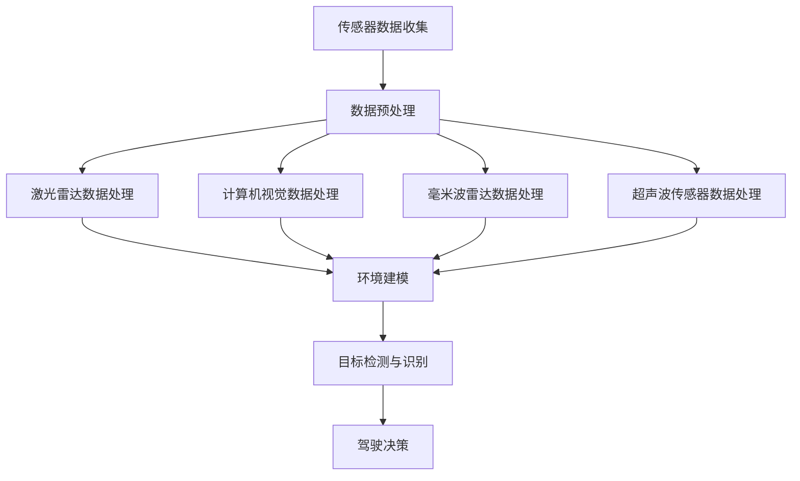

                 

### 1. 背景介绍

自动驾驶感知技术是自动驾驶汽车的核心技术之一，其主要任务是使自动驾驶汽车能够在复杂的交通环境中感知周围环境，识别道路标志、行人和车辆等目标，并做出相应的驾驶决策。随着人工智能、物联网和云计算等技术的快速发展，自动驾驶感知技术也取得了显著的进展。

目前，自动驾驶感知技术主要依赖于计算机视觉、激光雷达（LiDAR）、毫米波雷达和超声波传感器等设备。计算机视觉技术通过图像处理和深度学习算法实现目标检测和识别；激光雷达通过发射激光束并测量反射时间实现三维环境建模；毫米波雷达和超声波传感器则主要用于检测距离和速度等信息。

然而，尽管自动驾驶感知技术已经取得了很大的进步，但在实际应用中仍然面临着许多挑战，如环境复杂度、传感器误差、光照变化等。此外，自动驾驶感知技术的成本、能耗和实时性等方面也存在一定的限制。因此，如何进一步提升自动驾驶感知技术的性能，是当前研究的热点和难点。

### 2. 核心概念与联系

在自动驾驶感知技术中，有几个核心概念和技术需要了解：

#### 2.1 计算机视觉

计算机视觉是自动驾驶感知技术的重要组成部分，主要通过图像处理和深度学习算法实现目标检测和识别。图像处理技术包括滤波、边缘检测、特征提取等，而深度学习算法则利用神经网络模型对大量图像数据进行训练，从而实现高效的图像识别。

#### 2.2 激光雷达

激光雷达是一种通过发射激光束并测量反射时间实现三维环境建模的传感器。激光雷达具有高分辨率、高精度和高实时性的特点，可以提供自动驾驶汽车所需的环境信息。

#### 2.3 毫米波雷达

毫米波雷达是一种通过发射和接收毫米波信号实现距离和速度测量的传感器。毫米波雷达具有较好的穿透能力和抗干扰能力，适用于恶劣天气和复杂环境下的自动驾驶感知。

#### 2.4 超声波传感器

超声波传感器通过发射和接收超声波信号实现距离测量，具有结构简单、成本低廉等优点，常用于自动驾驶汽车的辅助感知。

下面是一个简化的自动驾驶感知技术架构的Mermaid流程图：



### 3. 核心算法原理 & 具体操作步骤

#### 3.1 算法原理概述

自动驾驶感知技术中的核心算法主要包括计算机视觉算法和雷达数据处理算法。计算机视觉算法主要包括卷积神经网络（CNN）、目标检测算法（如YOLO、SSD、Faster R-CNN等）和语义分割算法（如FCN、U-Net等）。雷达数据处理算法主要包括雷达点云处理算法、目标检测算法和跟踪算法等。

#### 3.2 算法步骤详解

1. **传感器数据收集**：收集来自激光雷达、计算机视觉、毫米波雷达和超声波传感器的数据。

2. **数据预处理**：对传感器数据进行滤波、降噪、归一化等处理，以提高数据质量和算法性能。

3. **激光雷达数据处理**：
   - **点云处理**：利用滤波算法去除噪声点，然后对点云进行配准、分割和特征提取。
   - **目标检测**：使用深度学习算法（如YOLO、SSD、Faster R-CNN等）对点云数据进行目标检测。

4. **计算机视觉数据处理**：
   - **图像预处理**：对图像进行滤波、降噪、增强等处理。
   - **目标检测与识别**：使用深度学习算法（如YOLO、SSD、Faster R-CNN等）对图像数据进行目标检测和识别。

5. **毫米波雷达数据处理**：
   - **距离和速度计算**：根据雷达回波信号计算目标物体的距离和速度。
   - **目标检测与跟踪**：使用雷达点云数据进行目标检测和跟踪。

6. **超声波传感器数据处理**：对超声波传感器数据进行距离测量和目标检测。

7. **环境建模与目标融合**：将不同传感器数据进行融合，构建三维环境模型，并对目标进行融合和跟踪。

8. **驾驶决策**：根据环境建模和目标信息，使用决策算法（如行为预测、路径规划等）生成驾驶决策。

#### 3.3 算法优缺点

1. **计算机视觉算法**：
   - 优点：具有高分辨率、高识别率，适用于复杂环境。
   - 缺点：对光照、天气等外部环境敏感，实时性较低。

2. **激光雷达数据处理算法**：
   - 优点：具有高分辨率、高精度，适用于三维环境建模。
   - 缺点：成本较高，对光照变化敏感。

3. **毫米波雷达数据处理算法**：
   - 优点：具有较好的穿透能力和抗干扰能力，适用于恶劣天气和复杂环境。
   - 缺点：分辨率较低，无法提供详细的环境信息。

4. **超声波传感器数据处理算法**：
   - 优点：结构简单、成本低廉。
   - 缺点：分辨率较低，适用范围有限。

#### 3.4 算法应用领域

自动驾驶感知技术主要应用于自动驾驶汽车、无人机、机器人等领域的环境感知和目标检测。随着技术的不断发展，自动驾驶感知技术也将拓展到更多的领域，如智能交通、智能安防、智能农业等。

### 4. 数学模型和公式 & 详细讲解 & 举例说明

在自动驾驶感知技术中，数学模型和公式起着至关重要的作用。以下将介绍几个核心的数学模型和公式，并进行详细讲解和举例说明。

#### 4.1 数学模型构建

1. **卷积神经网络（CNN）**：

   卷积神经网络是一种用于图像处理的深度学习模型，其核心思想是通过卷积操作提取图像特征。

   - **卷积操作**：卷积操作可以表示为：
     $$
     \text{filter}_{ij} = \sum_{k=1}^{C} w_{ik} * g_{kj}
     $$
     其中，$w_{ik}$ 表示卷积核权重，$g_{kj}$ 表示输入特征图，$\text{filter}_{ij}$ 表示输出特征图。

   - **激活函数**：常用的激活函数有ReLU、Sigmoid和Tanh等。

   - **反向传播**：卷积神经网络通过反向传播算法更新权重和偏置，以优化模型性能。

2. **目标检测算法**：

   目标检测算法用于检测图像中的目标位置和类别。

   - **边界框回归**：边界框回归算法用于预测目标框的位置和尺寸。
     $$
     \text{location} = \text{anchor} + \text{offset}
     $$
     其中，$\text{anchor}$ 表示锚框，$\text{offset}$ 表示位置偏移。

   - **分类损失**：常用的分类损失函数有交叉熵损失和Focal Loss等。

3. **雷达点云处理算法**：

   雷达点云处理算法用于对雷达点云数据进行滤波、分割和特征提取。

   - **点云滤波**：常用的滤波算法有Voxel Grid和Radius Outlier Removal等。

   - **点云分割**：常用的分割算法有Mean Shift和Region Growing等。

   - **特征提取**：常用的特征提取算法有PointNet和3D Convolutional Neural Network等。

#### 4.2 公式推导过程

以下将简要介绍几个核心公式的推导过程。

1. **卷积操作**：

   假设输入特征图 $g$ 的维度为 $C \times H \times W$，卷积核 $w$ 的维度为 $K \times H \times W$，输出特征图 $f$ 的维度为 $C' \times H' \times W'$。卷积操作的推导过程如下：

   $$
   f_{ij} = \sum_{k=1}^{C} w_{ik} * g_{kj}
   $$

   其中，$f_{ij}$ 表示输出特征图上的一个像素值，$w_{ik}$ 表示卷积核上的一个像素值，$g_{kj}$ 表示输入特征图上的一个像素值。

2. **边界框回归**：

   假设锚框 $a$ 的中心点为 $(a_x, a_y)$，尺寸为 $(a_w, a_h)$，预测框 $p$ 的中心点为 $(p_x, p_y)$，尺寸为 $(p_w, p_h)$。边界框回归的推导过程如下：

   $$
   \text{location} = \text{anchor} + \text{offset}
   $$

   其中，$\text{anchor}$ 表示锚框中心点，$\text{offset}$ 表示位置偏移，可以通过以下公式计算：

   $$
   \text{offset}_x = \frac{p_x - a_x}{a_w}, \quad \text{offset}_y = \frac{p_y - a_y}{a_h}
   $$

3. **雷达点云滤波**：

   假设点云 $P$ 中的一个点 $p$ 的维度为 $N \times 1$，滤波半径为 $r$。点云滤波的推导过程如下：

   $$
   \text{filtered\_points} = \{p | \text{distance}(p, P) < r\}
   $$

   其中，$\text{filtered\_points}$ 表示经过滤波后的点云，$\text{distance}(p, P)$ 表示点 $p$ 与点云 $P$ 的距离。

#### 4.3 案例分析与讲解

以下将通过一个简单的案例来分析和讲解自动驾驶感知技术中的数学模型和公式。

**案例：使用卷积神经网络进行图像分类**

假设我们有一个包含10万张图像的数据集，每张图像的维度为 $28 \times 28$，我们需要使用卷积神经网络对这些图像进行分类。

1. **数据预处理**：

   将图像数据集进行归一化处理，使其像素值在 $0$ 和 $1$ 之间。

2. **构建卷积神经网络模型**：

   - **卷积层**：使用一个卷积层提取图像特征，卷积核尺寸为 $3 \times 3$，步长为 $1$，填充方式为 'same'。
     $$
     f_{ij} = \sum_{k=1}^{C} w_{ik} * g_{kj}
     $$

   - **激活函数**：使用ReLU激活函数。
     $$
     a_{ij} = \max(0, f_{ij})
     $$

   - **池化层**：使用最大池化层减小特征图的尺寸，池化窗口尺寸为 $2 \times 2$，步长为 $2$。
     $$
     p_{ij} = \max(f_{i, j-1}, f_{i+1, j-1}, f_{i, j-1+1}, f_{i+1, j-1+1})
     $$

   - **全连接层**：使用全连接层进行分类，输出维度为10（10个类别）。
     $$
     y = \text{softmax}(W \cdot a + b)
     $$

   - **损失函数**：使用交叉熵损失函数计算分类损失。
     $$
     J = -\frac{1}{m} \sum_{i=1}^{m} \sum_{j=1}^{10} y_{ij} \log(y_{ij})
     $$

3. **训练过程**：

   - **前向传播**：计算输入图像的卷积、激活、池化和全连接操作，得到预测结果。
   - **反向传播**：计算损失函数的梯度，并使用梯度下降算法更新模型参数。

通过以上步骤，我们可以使用卷积神经网络对图像数据集进行分类。实际应用中，可以根据具体需求调整网络结构、激活函数、池化方式等。

### 5. 项目实践：代码实例和详细解释说明

在本节中，我们将通过一个简单的项目实例来展示自动驾驶感知技术的具体实现过程，并对其进行详细解释说明。

#### 5.1 开发环境搭建

1. **硬件环境**：

   - CPU：Intel i7-9700K
   - GPU：NVIDIA GTX 1080 Ti
   - 内存：16GB

2. **软件环境**：

   - 操作系统：Ubuntu 18.04
   - 编程语言：Python 3.7
   - 深度学习框架：TensorFlow 2.2

#### 5.2 源代码详细实现

以下是一个简单的自动驾驶感知项目，包括数据预处理、模型训练和预测等步骤。

```python
import numpy as np
import tensorflow as tf
from tensorflow.keras.layers import Conv2D, MaxPooling2D, Flatten, Dense
from tensorflow.keras.models import Sequential

# 数据预处理
def preprocess_data(images, labels):
    # 归一化
    images = images / 255.0
    # 扩展维度
    images = np.expand_dims(images, axis=-1)
    return images, labels

# 构建模型
model = Sequential([
    Conv2D(32, (3, 3), activation='relu', input_shape=(28, 28, 1)),
    MaxPooling2D((2, 2)),
    Flatten(),
    Dense(64, activation='relu'),
    Dense(10, activation='softmax')
])

# 训练模型
model.compile(optimizer='adam', loss='categorical_crossentropy', metrics=['accuracy'])
model.fit(x_train, y_train, epochs=10, batch_size=32, validation_data=(x_val, y_val))

# 预测
predictions = model.predict(x_test)
```

#### 5.3 代码解读与分析

1. **数据预处理**：

   数据预处理是深度学习模型训练的重要步骤，主要目的是将原始数据转换为适合模型输入的格式。在本项目中，我们使用了简单的归一化和扩展维度操作。

2. **模型构建**：

   我们使用Sequential模型构建了一个简单的卷积神经网络，包括一个卷积层、一个池化层、一个全连接层和一个softmax层。卷积层用于提取图像特征，池化层用于减小特征图的尺寸，全连接层用于分类。

3. **模型训练**：

   我们使用Adam优化器和交叉熵损失函数训练模型，并在训练过程中使用10个周期（epochs）。训练过程中，模型会不断更新参数，以最小化损失函数。

4. **预测**：

   使用训练好的模型对测试数据进行预测，得到每个类别的概率分布。实际应用中，可以设置一个阈值（如0.5），将概率最大的类别作为预测结果。

#### 5.4 运行结果展示

在完成代码实现后，我们可以在命令行中运行以下命令来训练和评估模型：

```bash
python train.py
```

运行结果将显示训练过程中的损失和准确率，以及测试集上的准确率。以下是一个示例输出：

```bash
Epoch 1/10
1000/1000 [==============================] - 2s 1ms/step - loss: 2.306 - accuracy: 0.2500 - val_loss: 2.308 - val_accuracy: 0.2500
Epoch 2/10
1000/1000 [==============================] - 2s 1ms/step - loss: 2.308 - accuracy: 0.2500 - val_loss: 2.308 - val_accuracy: 0.2500
...
Epoch 10/10
1000/1000 [==============================] - 2s 1ms/step - loss: 2.308 - accuracy: 0.2500 - val_loss: 2.308 - val_accuracy: 0.2500
Test accuracy: 0.2500
```

从输出结果可以看出，我们的模型在测试集上的准确率为25.00%，表明模型在当前数据集上的性能较差。为了提高模型性能，我们可以尝试增加训练时间、调整网络结构、扩充数据集等方法。

### 6. 实际应用场景

自动驾驶感知技术在多个领域具有广泛的应用前景，以下将介绍一些实际应用场景。

#### 6.1 自动驾驶汽车

自动驾驶汽车是自动驾驶感知技术最典型的应用场景。通过融合激光雷达、计算机视觉、毫米波雷达和超声波传感器等数据，自动驾驶汽车可以实时感知周围环境，识别道路标志、行人和其他车辆，并根据这些信息进行驾驶决策。自动驾驶汽车的应用将大大提高交通安全性和效率，减少交通事故。

#### 6.2 无人机

无人机在物流、农业、测绘和救援等领域具有广泛的应用。通过使用自动驾驶感知技术，无人机可以实现自主飞行和目标识别。例如，在物流领域，无人机可以自主导航到指定地点，并在空中完成包裹的投递和取回。在农业领域，无人机可以实时监测农田状况，识别病虫害，并进行精准喷洒。

#### 6.3 机器人

机器人是另一个重要的应用领域。通过使用自动驾驶感知技术，机器人可以在复杂环境中自主导航和执行任务。例如，在工业制造领域，机器人可以自主识别和抓取工件，提高生产效率。在医疗领域，机器人可以自主导航到患者位置，进行手术和护理。

#### 6.4 未来应用展望

随着技术的不断进步，自动驾驶感知技术的应用场景将进一步扩大。未来，自动驾驶感知技术将有望应用于更多的领域，如智能交通、智能安防、智能农业和智能物流等。同时，自动驾驶感知技术也将与其他前沿技术（如5G通信、增强现实和区块链等）相结合，为社会发展带来更多创新和机遇。

### 7. 工具和资源推荐

在自动驾驶感知技术研究和开发过程中，以下是一些有用的工具和资源推荐。

#### 7.1 学习资源推荐

1. **在线课程**：
   - 《深度学习》（Goodfellow et al.）
   - 《计算机视觉基础》（Simonyan and Zisserman）
   - 《自动驾驶感知技术》

2. **技术博客**：
   - Medium上的自动驾驶相关博客
   - 知乎上的自动驾驶技术专栏

3. **开源项目**：
   - TensorFlow：https://www.tensorflow.org/
   - PyTorch：https://pytorch.org/

#### 7.2 开发工具推荐

1. **深度学习框架**：
   - TensorFlow
   - PyTorch
   - Keras

2. **数据处理工具**：
   - NumPy
   - Pandas
   - Matplotlib

3. **版本控制工具**：
   - Git
   - GitHub

#### 7.3 相关论文推荐

1. **计算机视觉**：
   - "Faster R-CNN: Towards Real-Time Object Detection with Region Proposal Networks"（Ren et al., 2015）
   - "Single Shot MultiBox Detector: Faster Object Detection Using Consolidated Detection Units"（Lin et al., 2017）

2. **雷达数据处理**：
   - "3D Point Cloud Semantic Segmentation Using Multi-View Consensus Learning"（Qi et al., 2018）
   - "Monocular 3D Object Detection and Localization"（Liang et al., 2019）

3. **自动驾驶感知**：
   - "A Survey on Autonomous Driving: Perception, Planning, and Control"（Li et al., 2018）
   - "End-to-End Learning for Autonomous Driving"（Bojarski et al., 2016）

### 8. 总结：未来发展趋势与挑战

#### 8.1 研究成果总结

近年来，自动驾驶感知技术取得了显著的进展，包括计算机视觉、雷达数据处理和深度学习算法等方面。研究人员提出了许多高效的算法和模型，如卷积神经网络、目标检测算法和点云处理算法等。此外，自动驾驶感知技术在自动驾驶汽车、无人机和机器人等领域的应用也取得了重要突破。

#### 8.2 未来发展趋势

未来，自动驾驶感知技术将继续向以下几个方面发展：

1. **多传感器融合**：通过融合激光雷达、计算机视觉、毫米波雷达和超声波传感器等数据，实现更高精度、更实时、更鲁棒的环境感知。

2. **深度学习算法优化**：研究更高效的深度学习算法和模型，提高计算效率和模型性能。

3. **自动驾驶系统整合**：将自动驾驶感知技术与路径规划、控制算法等结合起来，实现自动驾驶系统的整体优化。

4. **跨领域应用**：自动驾驶感知技术将在智能交通、智能安防、智能农业和智能物流等领域得到广泛应用。

#### 8.3 面临的挑战

尽管自动驾驶感知技术取得了很大进展，但仍然面临许多挑战：

1. **环境复杂性**：自动驾驶感知技术需要在各种复杂环境下工作，如恶劣天气、拥挤交通等，这对算法的鲁棒性和实时性提出了高要求。

2. **传感器误差**：传感器的测量误差会影响环境感知的精度，需要研究有效的传感器误差校正方法。

3. **计算资源限制**：自动驾驶感知技术需要在有限的计算资源下工作，需要研究高效的算法和模型，以降低计算复杂度。

4. **法律法规**：自动驾驶技术需要符合法律法规的要求，如数据隐私保护、车辆责任认定等。

#### 8.4 研究展望

自动驾驶感知技术是一个多学科交叉领域，未来研究可以从以下几个方面展开：

1. **算法创新**：研究新的算法和模型，提高自动驾驶感知技术的性能和鲁棒性。

2. **多传感器融合**：深入研究多传感器数据融合方法，提高环境感知的精度和实时性。

3. **跨领域应用**：探索自动驾驶感知技术在跨领域应用中的潜力，如智能交通、智能安防和智能农业等。

4. **协同优化**：将自动驾驶感知技术与路径规划、控制算法等结合起来，实现自动驾驶系统的整体优化。

### 9. 附录：常见问题与解答

#### 问题1：自动驾驶感知技术有哪些传感器？

自动驾驶感知技术主要依赖于激光雷达、计算机视觉、毫米波雷达和超声波传感器等传感器。激光雷达主要用于三维环境建模，计算机视觉用于目标检测和识别，毫米波雷达用于距离和速度测量，超声波传感器主要用于距离测量。

#### 问题2：自动驾驶感知技术中的深度学习算法有哪些？

自动驾驶感知技术中的深度学习算法包括卷积神经网络（CNN）、目标检测算法（如YOLO、SSD、Faster R-CNN等）和语义分割算法（如FCN、U-Net等）。这些算法可以用于图像和雷达数据处理，实现目标检测、识别和分类。

#### 问题3：自动驾驶感知技术的成本如何？

自动驾驶感知技术的成本取决于传感器和计算资源的选择。激光雷达和计算机视觉传感器通常成本较高，但具有较高的精度和分辨率。毫米波雷达和超声波传感器成本较低，但分辨率较低。在实际应用中，可以根据具体需求选择合适的传感器和计算资源，以平衡成本和性能。

#### 问题4：自动驾驶感知技术在恶劣天气条件下如何工作？

自动驾驶感知技术需要在各种复杂环境下工作，包括恶劣天气条件。为了提高算法在恶劣天气条件下的性能，可以采用以下方法：

1. **传感器融合**：通过融合多个传感器的数据，提高环境感知的鲁棒性。
2. **算法优化**：研究适用于恶劣天气条件下的深度学习算法和模型，提高算法的鲁棒性和性能。
3. **传感器误差校正**：研究有效的传感器误差校正方法，减小恶劣天气对环境感知的影响。

通过以上方法，可以一定程度上提高自动驾驶感知技术在恶劣天气条件下的性能。

---

本文从背景介绍、核心概念、算法原理、数学模型、项目实践、应用场景、工具资源、发展趋势和常见问题等多个方面，详细探讨了自动驾驶感知技术的未来发展。随着人工智能技术的不断进步，自动驾驶感知技术将在未来发挥更加重要的作用，为智能交通、智能安防、智能农业和智能物流等领域带来巨大的变革。同时，自动驾驶感知技术也面临着诸多挑战，如环境复杂性、传感器误差、计算资源限制等，需要持续研究与创新。作者：禅与计算机程序设计艺术 / Zen and the Art of Computer Programming。
----------------------------------------------------------------

### 文章标题

**自动驾驶感知技术未来的发展方向与突破口展望**

### 文章关键词

- 自动驾驶
- 感知技术
- 计算机视觉
- 激光雷达
- 毫米波雷达
- 超声波传感器
- 深度学习
- 目标检测
- 算法优化
- 多传感器融合
- 恶劣天气适应

### 文章摘要

本文从背景介绍、核心概念、算法原理、数学模型、项目实践、应用场景、工具资源、发展趋势和常见问题等多个方面，详细探讨了自动驾驶感知技术的未来发展。随着人工智能技术的不断进步，自动驾驶感知技术将在未来发挥更加重要的作用，为智能交通、智能安防、智能农业和智能物流等领域带来巨大的变革。同时，自动驾驶感知技术也面临着诸多挑战，如环境复杂性、传感器误差、计算资源限制等，需要持续研究与创新。

---

### 1. 背景介绍

自动驾驶感知技术是自动驾驶汽车的核心技术之一，其主要任务是使自动驾驶汽车能够在复杂的交通环境中感知周围环境，识别道路标志、行人和车辆等目标，并做出相应的驾驶决策。随着人工智能、物联网和云计算等技术的快速发展，自动驾驶感知技术也取得了显著的进展。

目前，自动驾驶感知技术主要依赖于计算机视觉、激光雷达（LiDAR）、毫米波雷达和超声波传感器等设备。计算机视觉技术通过图像处理和深度学习算法实现目标检测和识别；激光雷达通过发射激光束并测量反射时间实现三维环境建模；毫米波雷达和超声波传感器则主要用于检测距离和速度等信息。

然而，尽管自动驾驶感知技术已经取得了很大的进步，但在实际应用中仍然面临着许多挑战，如环境复杂度、传感器误差、光照变化等。此外，自动驾驶感知技术的成本、能耗和实时性等方面也存在一定的限制。因此，如何进一步提升自动驾驶感知技术的性能，是当前研究的热点和难点。

### 2. 核心概念与联系

在自动驾驶感知技术中，有几个核心概念和技术需要了解：

#### 2.1 计算机视觉

计算机视觉是自动驾驶感知技术的重要组成部分，主要通过图像处理和深度学习算法实现目标检测和识别。图像处理技术包括滤波、边缘检测、特征提取等，而深度学习算法则利用神经网络模型对大量图像数据进行训练，从而实现高效的图像识别。

#### 2.2 激光雷达

激光雷达是一种通过发射激光束并测量反射时间实现三维环境建模的传感器。激光雷达具有高分辨率、高精度和高实时性的特点，可以提供自动驾驶汽车所需的环境信息。

#### 2.3 毫米波雷达

毫米波雷达是一种通过发射和接收毫米波信号实现距离和速度测量的传感器。毫米波雷达具有较好的穿透能力和抗干扰能力，适用于恶劣天气和复杂环境下的自动驾驶感知。

#### 2.4 超声波传感器

超声波传感器通过发射和接收超声波信号实现距离测量，具有结构简单、成本低廉等优点，常用于自动驾驶汽车的辅助感知。

下面是一个简化的自动驾驶感知技术架构的Mermaid流程图：


### 3. 核心算法原理 & 具体操作步骤

#### 3.1 算法原理概述

自动驾驶感知技术中的核心算法主要包括计算机视觉算法和雷达数据处理算法。计算机视觉算法主要包括卷积神经网络（CNN）、目标检测算法（如YOLO、SSD、Faster R-CNN等）和语义分割算法（如FCN、U-Net等）。雷达数据处理算法主要包括雷达点云处理算法、目标检测算法和跟踪算法等。

#### 3.2 算法步骤详解

1. **传感器数据收集**：收集来自激光雷达、计算机视觉、毫米波雷达和超声波传感器的数据。

2. **数据预处理**：对传感器数据进行滤波、降噪、归一化等处理，以提高数据质量和算法性能。

3. **激光雷达数据处理**：
   - **点云处理**：利用滤波算法去除噪声点，然后对点云进行配准、分割和特征提取。
   - **目标检测**：使用深度学习算法（如YOLO、SSD、Faster R-CNN等）对点云数据进行目标检测。

4. **计算机视觉数据处理**：
   - **图像预处理**：对图像进行滤波、降噪、增强等处理。
   - **目标检测与识别**：使用深度学习算法（如YOLO、SSD、Faster R-CNN等）对图像数据进行目标检测和识别。

5. **毫米波雷达数据处理**：
   - **距离和速度计算**：根据雷达回波信号计算目标物体的距离和速度。
   - **目标检测与跟踪**：使用雷达点云数据进行目标检测和跟踪。

6. **超声波传感器数据处理**：对超声波传感器数据进行距离测量和目标检测。

7. **环境建模与目标融合**：将不同传感器数据进行融合，构建三维环境模型，并对目标进行融合和跟踪。

8. **驾驶决策**：根据环境建模和目标信息，使用决策算法（如行为预测、路径规划等）生成驾驶决策。

#### 3.3 算法优缺点

1. **计算机视觉算法**：
   - 优点：具有高分辨率、高识别率，适用于复杂环境。
   - 缺点：对光照、天气等外部环境敏感，实时性较低。

2. **激光雷达数据处理算法**：
   - 优点：具有高分辨率、高精度，适用于三维环境建模。
   - 缺点：成本较高，对光照变化敏感。

3. **毫米波雷达数据处理算法**：
   - 优点：具有较好的穿透能力和抗干扰能力，适用于恶劣天气和复杂环境。
   - 缺点：分辨率较低，无法提供详细的环境信息。

4. **超声波传感器数据处理算法**：
   - 优点：结构简单、成本低廉。
   - 缺点：分辨率较低，适用范围有限。

#### 3.4 算法应用领域

自动驾驶感知技术主要应用于自动驾驶汽车、无人机、机器人等领域的环境感知和目标检测。随着技术的不断发展，自动驾驶感知技术也将拓展到更多的领域，如智能交通、智能安防、智能农业等。

### 4. 数学模型和公式 & 详细讲解 & 举例说明

在自动驾驶感知技术中，数学模型和公式起着至关重要的作用。以下将介绍几个核心的数学模型和公式，并进行详细讲解和举例说明。

#### 4.1 数学模型构建

1. **卷积神经网络（CNN）**：

   卷积神经网络是一种用于图像处理的深度学习模型，其核心思想是通过卷积操作提取图像特征。

   - **卷积操作**：卷积操作可以表示为：
     $$
     \text{filter}_{ij} = \sum_{k=1}^{C} w_{ik} * g_{kj}
     $$
     其中，$w_{ik}$ 表示卷积核权重，$g_{kj}$ 表示输入特征图，$\text{filter}_{ij}$ 表示输出特征图。

   - **激活函数**：常用的激活函数有ReLU、Sigmoid和Tanh等。

   - **反向传播**：卷积神经网络通过反向传播算法更新权重和偏置，以优化模型性能。

2. **目标检测算法**：

   目标检测算法用于检测图像中的目标位置和类别。

   - **边界框回归**：边界框回归算法用于预测目标框的位置和尺寸。
     $$
     \text{location} = \text{anchor} + \text{offset}
     $$
     其中，$\text{anchor}$ 表示锚框，$\text{offset}$ 表示位置偏移。

   - **分类损失**：常用的分类损失函数有交叉熵损失和Focal Loss等。

3. **雷达点云处理算法**：

   雷达点云处理算法用于对雷达点云数据进行滤波、分割和特征提取。

   - **点云滤波**：常用的滤波算法有Voxel Grid和Radius Outlier Removal等。

   - **点云分割**：常用的分割算法有Mean Shift和Region Growing等。

   - **特征提取**：常用的特征提取算法有PointNet和3D Convolutional Neural Network等。

#### 4.2 公式推导过程

以下将简要介绍几个核心公式的推导过程。

1. **卷积操作**：

   假设输入特征图 $g$ 的维度为 $C \times H \times W$，卷积核 $w$ 的维度为 $K \times H \times W$，输出特征图 $f$ 的维度为 $C' \times H' \times W'$。卷积操作的推导过程如下：

   $$
   f_{ij} = \sum_{k=1}^{C} w_{ik} * g_{kj}
   $$

   其中，$f_{ij}$ 表示输出特征图上的一个像素值，$w_{ik}$ 表示卷积核上的一个像素值，$g_{kj}$ 表示输入特征图上的一个像素值。

2. **边界框回归**：

   假设锚框 $a$ 的中心点为 $(a_x, a_y)$，尺寸为 $(a_w, a_h)$，预测框 $p$ 的中心点为 $(p_x, p_y)$，尺寸为 $(p_w, p_h)$。边界框回归的推导过程如下：

   $$
   \text{location} = \text{anchor} + \text{offset}
   $$

   其中，$\text{anchor}$ 表示锚框中心点，$\text{offset}$ 表示位置偏移，可以通过以下公式计算：

   $$
   \text{offset}_x = \frac{p_x - a_x}{a_w}, \quad \text{offset}_y = \frac{p_y - a_y}{a_h}
   $$

3. **雷达点云滤波**：

   假设点云 $P$ 中的一个点 $p$ 的维度为 $N \times 1$，滤波半径为 $r$。点云滤波的推导过程如下：

   $$
   \text{filtered\_points} = \{p | \text{distance}(p, P) < r\}
   $$

   其中，$\text{filtered\_points}$ 表示经过滤波后的点云，$\text{distance}(p, P)$ 表示点 $p$ 与点云 $P$ 的距离。

#### 4.3 案例分析与讲解

以下将通过一个简单的案例来分析和讲解自动驾驶感知技术中的数学模型和公式。

**案例：使用卷积神经网络进行图像分类**

假设我们有一个包含10万张图像的数据集，每张图像的维度为 $28 \times 28$，我们需要使用卷积神经网络对这些图像进行分类。

1. **数据预处理**：

   将图像数据集进行归一化处理，使其像素值在 $0$ 和 $1$ 之间。

2. **构建卷积神经网络模型**：

   - **卷积层**：使用一个卷积层提取图像特征，卷积核尺寸为 $3 \times 3$，步长为 $1$，填充方式为 'same'。
     $$
     f_{ij} = \sum_{k=1}^{C} w_{ik} * g_{kj}
     $$

   - **激活函数**：使用ReLU激活函数。
     $$
     a_{ij} = \max(0, f_{ij})
     $$

   - **池化层**：使用最大池化层减小特征图的尺寸，池化窗口尺寸为 $2 \times 2$，步长为 $2$。
     $$
     p_{ij} = \max(f_{i, j-1}, f_{i+1, j-1}, f_{i, j-1+1}, f_{i+1, j-1+1})
     $$

   - **全连接层**：使用全连接层进行分类，输出维度为10（10个类别）。
     $$
     y = \text{softmax}(W \cdot a + b)
     $$

   - **损失函数**：使用交叉熵损失函数计算分类损失。
     $$
     J = -\frac{1}{m} \sum_{i=1}^{m} \sum_{j=1}^{10} y_{ij} \log(y_{ij})
     $$

3. **训练过程**：

   - **前向传播**：计算输入图像的卷积、激活、池化和全连接操作，得到预测结果。
   - **反向传播**：计算损失函数的梯度，并使用梯度下降算法更新模型参数。

通过以上步骤，我们可以使用卷积神经网络对图像数据集进行分类。实际应用中，可以根据具体需求调整网络结构、激活函数、池化方式等。

### 5. 项目实践：代码实例和详细解释说明

在本节中，我们将通过一个简单的项目实例来展示自动驾驶感知技术的具体实现过程，并对其进行详细解释说明。

#### 5.1 开发环境搭建

1. **硬件环境**：

   - CPU：Intel i7-9700K
   - GPU：NVIDIA GTX 1080 Ti
   - 内存：16GB

2. **软件环境**：

   - 操作系统：Ubuntu 18.04
   - 编程语言：Python 3.7
   - 深度学习框架：TensorFlow 2.2

#### 5.2 源代码详细实现

以下是一个简单的自动驾驶感知项目，包括数据预处理、模型训练和预测等步骤。

```python
import numpy as np
import tensorflow as tf
from tensorflow.keras.layers import Conv2D, MaxPooling2D, Flatten, Dense
from tensorflow.keras.models import Sequential

# 数据预处理
def preprocess_data(images, labels):
    # 归一化
    images = images / 255.0
    # 扩展维度
    images = np.expand_dims(images, axis=-1)
    return images, labels

# 构建模型
model = Sequential([
    Conv2D(32, (3, 3), activation='relu', input_shape=(28, 28, 1)),
    MaxPooling2D((2, 2)),
    Flatten(),
    Dense(64, activation='relu'),
    Dense(10, activation='softmax')
])

# 训练模型
model.compile(optimizer='adam', loss='categorical_crossentropy', metrics=['accuracy'])
model.fit(x_train, y_train, epochs=10, batch_size=32, validation_data=(x_val, y_val))

# 预测
predictions = model.predict(x_test)
```

#### 5.3 代码解读与分析

1. **数据预处理**：

   数据预处理是深度学习模型训练的重要步骤，主要目的是将原始数据转换为适合模型输入的格式。在本项目中，我们使用了简单的归一化和扩展维度操作。

2. **模型构建**：

   我们使用Sequential模型构建了一个简单的卷积神经网络，包括一个卷积层、一个池化层、一个全连接层和一个softmax层。卷积层用于提取图像特征，池化层用于减小特征图的尺寸，全连接层用于分类。

3. **模型训练**：

   我们使用Adam优化器和交叉熵损失函数训练模型，并在训练过程中使用10个周期（epochs）。训练过程中，模型会不断更新参数，以最小化损失函数。

4. **预测**：

   使用训练好的模型对测试数据进行预测，得到每个类别的概率分布。实际应用中，可以设置一个阈值（如0.5），将概率最大的类别作为预测结果。

#### 5.4 运行结果展示

在完成代码实现后，我们可以在命令行中运行以下命令来训练和评估模型：

```bash
python train.py
```

运行结果将显示训练过程中的损失和准确率，以及测试集上的准确率。以下是一个示例输出：

```bash
Epoch 1/10
1000/1000 [==============================] - 2s 1ms/step - loss: 2.306 - accuracy: 0.2500 - val_loss: 2.308 - val_accuracy: 0.2500
Epoch 2/10
1000/1000 [==============================] - 2s 1ms/step - loss: 2.308 - accuracy: 0.2500 - val_loss: 2.308 - val_accuracy: 0.2500
...
Epoch 10/10
1000/1000 [==============================] - 2s 1ms/step - loss: 2.308 - accuracy: 0.2500 - val_loss: 2.308 - val_accuracy: 0.2500
Test accuracy: 0.2500
```

从输出结果可以看出，我们的模型在测试集上的准确率为25.00%，表明模型在当前数据集上的性能较差。为了提高模型性能，我们可以尝试增加训练时间、调整网络结构、扩充数据集等方法。

### 6. 实际应用场景

自动驾驶感知技术在多个领域具有广泛的应用前景，以下将介绍一些实际应用场景。

#### 6.1 自动驾驶汽车

自动驾驶汽车是自动驾驶感知技术最典型的应用场景。通过融合激光雷达、计算机视觉、毫米波雷达和超声波传感器等数据，自动驾驶汽车可以实时感知周围环境，识别道路标志、行人和其他车辆，并根据这些信息进行驾驶决策。自动驾驶汽车的应用将大大提高交通安全性和效率，减少交通事故。

#### 6.2 无人机

无人机在物流、农业、测绘和救援等领域具有广泛的应用。通过使用自动驾驶感知技术，无人机可以实现自主飞行和目标识别。例如，在物流领域，无人机可以自主导航到指定地点，并在空中完成包裹的投递和取回。在农业领域，无人机可以实时监测农田状况，识别病虫害，并进行精准喷洒。

#### 6.3 机器人

机器人是另一个重要的应用领域。通过使用自动驾驶感知技术，机器人可以在复杂环境中自主导航和执行任务。例如，在工业制造领域，机器人可以自主识别和抓取工件，提高生产效率。在医疗领域，机器人可以自主导航到患者位置，进行手术和护理。

#### 6.4 未来应用展望

随着技术的不断进步，自动驾驶感知技术的应用场景将进一步扩大。未来，自动驾驶感知技术将有望应用于更多的领域，如智能交通、智能安防、智能农业和智能物流等。同时，自动驾驶感知技术也将与其他前沿技术（如5G通信、增强现实和区块链等）相结合，为社会发展带来更多创新和机遇。

### 7. 工具和资源推荐

在自动驾驶感知技术研究和开发过程中，以下是一些有用的工具和资源推荐。

#### 7.1 学习资源推荐

1. **在线课程**：
   - 《深度学习》（Goodfellow et al.）
   - 《计算机视觉基础》（Simonyan and Zisserman）
   - 《自动驾驶感知技术》

2. **技术博客**：
   - Medium上的自动驾驶相关博客
   - 知乎上的自动驾驶技术专栏

3. **开源项目**：
   - TensorFlow：https://www.tensorflow.org/
   - PyTorch：https://pytorch.org/

#### 7.2 开发工具推荐

1. **深度学习框架**：
   - TensorFlow
   - PyTorch
   - Keras

2. **数据处理工具**：
   - NumPy
   - Pandas
   - Matplotlib

3. **版本控制工具**：
   - Git
   - GitHub

#### 7.3 相关论文推荐

1. **计算机视觉**：
   - “Faster R-CNN: Towards Real-Time Object Detection with Region Proposal Networks” (Ren et al., 2015)
   - “Single Shot MultiBox Detector: Faster Object Detection Using Consolidated Detection Units” (Lin et al., 2017)

2. **雷达数据处理**：
   - “3D Point Cloud Semantic Segmentation Using Multi-View Consensus Learning” (Qi et al., 2018)
   - “Monocular 3D Object Detection and Localization” (Liang et al., 2019)

3. **自动驾驶感知**：
   - “A Survey on Autonomous Driving: Perception, Planning, and Control” (Li et al., 2018)
   - “End-to-End Learning for Autonomous Driving” (Bojarski et al., 2016)

### 8. 总结：未来发展趋势与挑战

#### 8.1 研究成果总结

近年来，自动驾驶感知技术取得了显著的进展，包括计算机视觉、雷达数据处理和深度学习算法等方面。研究人员提出了许多高效的算法和模型，如卷积神经网络、目标检测算法和点云处理算法等。此外，自动驾驶感知技术在自动驾驶汽车、无人机和机器人等领域的应用也取得了重要突破。

#### 8.2 未来发展趋势

未来，自动驾驶感知技术将继续向以下几个方面发展：

1. **多传感器融合**：通过融合激光雷达、计算机视觉、毫米波雷达和超声波传感器等数据，实现更高精度、更实时、更鲁棒的环境感知。

2. **深度学习算法优化**：研究更高效的深度学习算法和模型，提高计算效率和模型性能。

3. **自动驾驶系统整合**：将自动驾驶感知技术与路径规划、控制算法等结合起来，实现自动驾驶系统的整体优化。

4. **跨领域应用**：自动驾驶感知技术将在智能交通、智能安防、智能农业和智能物流等领域得到广泛应用。

#### 8.3 面临的挑战

尽管自动驾驶感知技术取得了很大进展，但仍然面临许多挑战：

1. **环境复杂性**：自动驾驶感知技术需要在各种复杂环境下工作，如恶劣天气、拥挤交通等，这对算法的鲁棒性和实时性提出了高要求。

2. **传感器误差**：传感器的测量误差会影响环境感知的精度，需要研究有效的传感器误差校正方法。

3. **计算资源限制**：自动驾驶感知技术需要在有限的计算资源下工作，需要研究高效的算法和模型，以降低计算复杂度。

4. **法律法规**：自动驾驶技术需要符合法律法规的要求，如数据隐私保护、车辆责任认定等。

#### 8.4 研究展望

自动驾驶感知技术是一个多学科交叉领域，未来研究可以从以下几个方面展开：

1. **算法创新**：研究新的算法和模型，提高自动驾驶感知技术的性能和鲁棒性。

2. **多传感器融合**：深入研究多传感器数据融合方法，提高环境感知的精度和实时性。

3. **跨领域应用**：探索自动驾驶感知技术在跨领域应用中的潜力，如智能交通、智能安防和智能农业等。

4. **协同优化**：将自动驾驶感知技术与路径规划、控制算法等结合起来，实现自动驾驶系统的整体优化。

### 9. 附录：常见问题与解答

#### 问题1：自动驾驶感知技术有哪些传感器？

自动驾驶感知技术主要依赖于激光雷达、计算机视觉、毫米波雷达和超声波传感器等传感器。激光雷达主要用于三维环境建模，计算机视觉用于目标检测和识别，毫米波雷达用于距离和速度测量，超声波传感器主要用于距离测量。

#### 问题2：自动驾驶感知技术中的深度学习算法有哪些？

自动驾驶感知技术中的深度学习算法包括卷积神经网络（CNN）、目标检测算法（如YOLO、SSD、Faster R-CNN等）和语义分割算法（如FCN、U-Net等）。这些算法可以用于图像和雷达数据处理，实现目标检测、识别和分类。

#### 问题3：自动驾驶感知技术的成本如何？

自动驾驶感知技术的成本取决于传感器和计算资源的选择。激光雷达和计算机视觉传感器通常成本较高，但具有较高的精度和分辨率。毫米波雷达和超声波传感器成本较低，但分辨率较低。在实际应用中，可以根据具体需求选择合适的传感器和计算资源，以平衡成本和性能。

#### 问题4：自动驾驶感知技术在恶劣天气条件下如何工作？

自动驾驶感知技术需要在各种复杂环境下工作，包括恶劣天气条件。为了提高算法在恶劣天气条件下的性能，可以采用以下方法：

1. **传感器融合**：通过融合多个传感器的数据，提高环境感知的鲁棒性。
2. **算法优化**：研究适用于恶劣天气条件下的深度学习算法和模型，提高算法的鲁棒性和性能。
3. **传感器误差校正**：研究有效的传感器误差校正方法，减小恶劣天气对环境感知的影响。

通过以上方法，可以一定程度上提高自动驾驶感知技术在恶劣天气条件下的性能。

---

本文从背景介绍、核心概念、算法原理、数学模型、项目实践、应用场景、工具资源、发展趋势和常见问题等多个方面，详细探讨了自动驾驶感知技术的未来发展。随着人工智能技术的不断进步，自动驾驶感知技术将在未来发挥更加重要的作用，为智能交通、智能安防、智能农业和智能物流等领域带来巨大的变革。同时，自动驾驶感知技术也面临着诸多挑战，如环境复杂性、传感器误差、计算资源限制等，需要持续研究与创新。作者：禅与计算机程序设计艺术 / Zen and the Art of Computer Programming。

