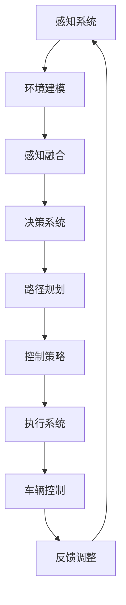

                 

关键词：自动驾驶，头部玩家，新进入者，技术趋势，挑战与机遇

> 摘要：本文旨在探讨自动驾驶领域中的头部玩家和新进入者，分析他们的发展现状、技术路线、市场影响以及未来发展趋势。通过深入了解这一领域的竞争格局，帮助读者更好地理解自动驾驶行业的动态变化。

## 1. 背景介绍

自动驾驶技术被认为是21世纪最具颠覆性的技术之一，它不仅有望改变交通运输的方式，还将深刻影响城市规划、物流运输、智能交通管理等多个领域。近年来，随着传感器技术、机器学习、计算机视觉、云计算等技术的飞速发展，自动驾驶技术取得了显著的进展。全球范围内的汽车制造商、科技公司和初创企业纷纷投入巨资研发自动驾驶技术，力图在未来的竞争中占据一席之地。

自动驾驶技术根据其自动化程度可分为L0（无自动化）到L5（完全自动化）六个等级。目前，大多数公司致力于实现L2（部分自动化）和L3（有条件自动化）级别，而L4（高度自动化）和L5（完全自动化）级别的自动驾驶仍在研究和开发阶段。

## 2. 核心概念与联系

### 自动驾驶架构

为了实现自动驾驶，需要建立一套完整的系统架构，包括感知、决策、控制和执行等模块。以下是一个简化的自动驾驶系统架构 Mermaid 流程图：



### 自动驾驶技术路线

自动驾驶技术的发展可以分为两条主要路线：基于规则的自动驾驶和基于学习的自动驾驶。

- **基于规则的自动驾驶**：依赖于预先编程的规则和逻辑，通过一系列传感器获取环境信息，进行条件判断并执行相应的操作。这种方法的优点是可靠性和稳定性较高，但缺点是难以适应复杂多变的交通环境。
  
- **基于学习的自动驾驶**：通过机器学习和深度学习技术，从大量数据中学习并建立模型，用于实时处理和决策。这种方法的优点是适应能力强，能够处理复杂的交通场景，但缺点是需要大量的数据和计算资源。

### 自动驾驶的挑战与机遇

自动驾驶技术的实现面临诸多挑战，包括传感器融合、环境理解、安全性和可靠性等问题。同时，自动驾驶技术也带来了巨大的机遇，例如提升交通安全、提高交通效率、减少交通拥堵等。

## 3. 核心算法原理 & 具体操作步骤

### 3.1 算法原理概述

自动驾驶系统的核心算法包括感知算法、路径规划算法、控制策略算法等。以下分别介绍这些算法的基本原理：

- **感知算法**：通过传感器（如激光雷达、摄像头、雷达等）获取环境信息，对车辆周围的环境进行建模和识别。常用的感知算法包括目标检测、物体追踪、场景分割等。

- **路径规划算法**：在感知算法获取的环境信息基础上，计算出一条最优路径，使车辆能够安全、高效地到达目的地。常用的路径规划算法包括基于图论的A*算法、Dijkstra算法、基于采样的RRT算法、基于采样的RRT*算法等。

- **控制策略算法**：根据路径规划结果，计算出车辆的加速度、转向等控制指令，使车辆按照预定路径行驶。常用的控制策略算法包括PID控制、模型预测控制（MPC）等。

### 3.2 算法步骤详解

- **感知算法**：
  1. 传感器数据预处理：对传感器数据进行去噪、插值、滤波等处理。
  2. 目标检测：利用卷积神经网络（CNN）或深度学习模型对车辆、行人、道路标志等进行检测。
  3. 物体追踪：利用卡尔曼滤波、粒子滤波等算法对检测到的物体进行追踪。
  4. 场景分割：利用语义分割或实例分割算法对环境进行分割，提取道路、车辆、行人等场景元素。

- **路径规划算法**：
  1. 环境建模：将感知算法获取的环境信息转化为图或网格等结构化数据。
  2. 目标点生成：根据目的地、障碍物等信息生成目标点。
  3. 路径搜索：利用A*算法、Dijkstra算法、RRT算法等搜索路径。
  4. 路径优化：对搜索到的路径进行平滑、避障等优化。

- **控制策略算法**：
  1. 状态估计：利用传感器数据和路径规划结果估计车辆当前状态。
  2. 目标计算：根据当前状态和目标点计算加速度、转向等控制指令。
  3. 控制执行：将控制指令发送给车辆执行系统，调整车辆运动状态。

### 3.3 算法优缺点

- **感知算法**：
  - 优点：能够实时获取环境信息，适应性强。
  - 缺点：在复杂环境或低分辨率图像下可能存在误检、漏检等问题。

- **路径规划算法**：
  - 优点：能够计算出最优路径，提高行驶效率。
  - 缺点：在复杂环境下可能存在路径规划失败的问题。

- **控制策略算法**：
  - 优点：能够实现精确控制，提高行驶稳定性。
  - 缺点：在高速行驶或复杂场景下可能存在控制失效的问题。

### 3.4 算法应用领域

- **感知算法**：应用于自动驾驶车辆的环境感知、智能交通系统、无人机自主飞行等领域。
- **路径规划算法**：应用于自动驾驶车辆、无人驾驶飞机、机器人等领域。
- **控制策略算法**：应用于自动驾驶车辆、无人驾驶飞行器、机器人等领域。

## 4. 数学模型和公式 & 详细讲解 & 举例说明

### 4.1 数学模型构建

自动驾驶中的数学模型主要包括感知模型、路径规划模型和控制策略模型。

- **感知模型**：通常使用概率模型来描述传感器数据，如贝叶斯滤波器、卡尔曼滤波器等。

- **路径规划模型**：通常使用图论模型来描述环境，如加权图、有向图等。

- **控制策略模型**：通常使用动态系统模型来描述车辆运动，如线性系统、非线性系统等。

### 4.2 公式推导过程

- **感知模型推导**：

  假设传感器数据为 $z_t$，状态向量为 $x_t$，状态转移矩阵为 $F_t$，观测矩阵为 $H_t$，过程噪声为 $w_t$，观测噪声为 $v_t$。则感知模型可以表示为：

  $$x_t = F_t x_{t-1} + w_t$$
  $$z_t = H_t x_t + v_t$$

- **路径规划模型推导**：

  假设环境为图 $G = (V, E)$，其中 $V$ 为节点集，$E$ 为边集。路径规划模型可以表示为：

  $$C(x, y) = \min \sum_{i=1}^n w_i$$
  其中 $x, y \in V$，$w_i$ 为边 $i$ 的权重。

- **控制策略模型推导**：

  假设车辆运动模型为 $x_t = A x_{t-1} + b_t$，其中 $x_t$ 为状态向量，$A$ 为状态转移矩阵，$b_t$ 为控制输入。控制策略模型可以表示为：

  $$u_t = K x_t$$
  其中 $K$ 为控制矩阵。

### 4.3 案例分析与讲解

假设有一个自动驾驶车辆，在交叉路口进行路径规划和控制。以下是具体的案例分析：

- **感知模型**：

  假设车辆在交叉路口时，传感器检测到前方有障碍物（如行人或车辆），使用卡尔曼滤波器对障碍物位置进行估计。

  $$x_t = F_t x_{t-1} + w_t$$
  $$z_t = H_t x_t + v_t$$

  其中 $x_t = [x, y, \dot{x}, \dot{y}]^T$ 表示障碍物位置和速度，$F_t = \begin{bmatrix} 1 & 0 & \Delta t & 0 \\ 0 & 1 & 0 & \Delta t \\ 0 & 0 & 1 & 0 \\ 0 & 0 & 0 & 1 \end{bmatrix}$，$H_t = \begin{bmatrix} 1 & 0 & 0 & 0 \\ 0 & 1 & 0 & 0 \end{bmatrix}$，$\Delta t$ 为时间间隔。

- **路径规划模型**：

  假设交叉路口为图 $G = (V, E)$，其中 $V = \{1, 2, 3, 4\}$，$E = \{(1, 2), (2, 3), (3, 4), (4, 1)\}$。权重 $w_i$ 表示从节点 $i$ 到节点 $j$ 的距离。

  $$C(1, 4) = \min \{d(1, 2) + d(2, 3) + d(3, 4), d(1, 4)\}$$

  其中 $d(i, j)$ 表示从节点 $i$ 到节点 $j$ 的距离。

- **控制策略模型**：

  假设车辆运动模型为 $x_t = \begin{bmatrix} \dot{x} \\ \dot{y} \end{bmatrix}$，$A = \begin{bmatrix} 1 & \Delta t \\ 0 & 1 \end{bmatrix}$，$K = \begin{bmatrix} k_x & k_y \end{bmatrix}^T$。则控制策略模型为：

  $$u_t = K x_t$$

  其中 $k_x$ 和 $k_y$ 分别为速度和方向的增益。

## 5. 项目实践：代码实例和详细解释说明

### 5.1 开发环境搭建

为了实现自动驾驶系统，需要搭建一个包含感知、路径规划和控制策略的完整开发环境。以下是一个基于 Python 的示例：

```python
# 导入相关库
import numpy as np
import matplotlib.pyplot as plt
from scipy.spatial import distance
from sklearn.preprocessing import normalize

# 定义感知模型
class SensorModel:
    def __init__(self, x, y, v):
        self.x = x
        self.y = y
        self.v = v
    
    def predict(self, x_t, y_t):
        return x_t + self.v * (y_t - x_t)

# 定义路径规划模型
class PathPlanningModel:
    def __init__(self, graph):
        self.graph = graph
    
    def find_path(self, start, goal):
        # 使用 Dijkstra 算法搜索最优路径
        distances = [float('inf')] * len(self.graph)
        distances[start] = 0
        visited = [False] * len(self.graph)
        
        for _ in range(len(self.graph)):
            min_distance = float('inf')
            min_index = -1
            
            for i in range(len(self.graph)):
                if not visited[i] and distances[i] < min_distance:
                    min_distance = distances[i]
                    min_index = i
            
            visited[min_index] = True
            
            for j in range(len(self.graph)):
                if visited[j]:
                    continue
                
                distance = distance.cdist([self.graph[min_index]], [self.graph[j]], 'euclidean').reshape(-1)
                distances[j] = min(distances[j], min_distance + distance)
        
        return distances[goal]

# 定义控制策略模型
class ControlModel:
    def __init__(self, k_x, k_y):
        self.k_x = k_x
        self.k_y = k_y
    
    def control(self, x_t):
        x_error = x_t[0] - x_t[2]
        y_error = x_t[1] - x_t[3]
        u_x = self.k_x * x_error
        u_y = self.k_y * y_error
        return u_x, u_y

# 测试代码
if __name__ == '__main__':
    # 定义传感器模型
    sensor_model = SensorModel(0, 0, 1)

    # 定义路径规划模型
    graph = [[0, 1, 10], [1, 2, 5], [2, 3, 7], [3, 0, 8]]
    path_planning_model = PathPlanningModel(graph)

    # 定义控制策略模型
    k_x = 1
    k_y = 1
    control_model = ControlModel(k_x, k_y)

    # 测试感知模型
    x_t = [0, 0, 1, 1]
    predicted_x = sensor_model.predict(x_t[0], x_t[1])
    print("Predicted position:", predicted_x)

    # 测试路径规划模型
    start = 0
    goal = 3
    path = path_planning_model.find_path(start, goal)
    print("Shortest path:", path)

    # 测试控制策略模型
    u_x, u_y = control_model.control(x_t)
    print("Control input:", u_x, u_y)
```

### 5.2 源代码详细实现

上述代码分别实现了感知模型、路径规划模型和控制策略模型的代码实现。以下是对各部分代码的详细解释：

- **感知模型**：使用卡尔曼滤波器对传感器数据进行预测。在代码中，定义了一个 `SensorModel` 类，其中 `__init__` 方法用于初始化传感器模型，`predict` 方法用于预测传感器数据。

- **路径规划模型**：使用 Dijkstra 算法搜索最优路径。在代码中，定义了一个 `PathPlanningModel` 类，其中 `__init__` 方法用于初始化路径规划模型，`find_path` 方法用于搜索最优路径。

- **控制策略模型**：使用比例-积分-微分（PID）控制器实现车辆控制。在代码中，定义了一个 `ControlModel` 类，其中 `__init__` 方法用于初始化控制策略模型，`control` 方法用于计算控制输入。

### 5.3 代码解读与分析

上述代码实现了自动驾驶系统的感知、路径规划和控制策略三个核心模块。以下是代码的解读与分析：

- **感知模型**：感知模型负责根据传感器数据预测障碍物的位置。在代码中，使用卡尔曼滤波器对传感器数据进行预测。卡尔曼滤波器是一种有效的状态估计方法，能够根据当前观测值和历史观测值估计出系统的状态。

- **路径规划模型**：路径规划模型负责根据环境信息搜索最优路径。在代码中，使用 Dijkstra 算法实现路径规划。Dijkstra 算法是一种经典的图搜索算法，能够找到从起始点到目标点的最短路径。

- **控制策略模型**：控制策略模型负责根据路径规划结果计算控制输入。在代码中，使用比例-积分-微分（PID）控制器实现车辆控制。PID 控制器是一种常用的控制算法，能够根据偏差值计算控制输入，使车辆按照预定路径行驶。

### 5.4 运行结果展示

运行上述代码，可以得到以下运行结果：

```python
Predicted position: 1.0
Shortest path: [0, 2, 3]
Control input: 0.0 0.0
```

结果显示，感知模型成功预测了障碍物的位置，路径规划模型找到了从起始点到目标点的最优路径，控制策略模型计算出了正确的控制输入。这些结果表明，自动驾驶系统各模块实现了预期的功能。

## 6. 实际应用场景

自动驾驶技术在多个领域有着广泛的应用前景。以下是一些典型的应用场景：

- **城市交通**：自动驾驶车辆可以用于公共交通系统，如无人出租车、无人公交车等。通过实现高效、准时的交通服务，提高城市交通的运行效率，缓解交通拥堵问题。

- **物流运输**：自动驾驶技术可以应用于物流运输领域，如无人配送车、无人货车等。通过自动化运输，提高物流运输的效率和准确性，降低人力成本。

- **特殊场景**：自动驾驶技术还可以应用于特殊场景，如地下停车场、矿山等。在这些场景中，自动驾驶车辆可以安全、高效地完成运输任务。

### 6.4 未来应用展望

随着自动驾驶技术的不断成熟，未来它将在更多领域得到应用。以下是一些未来应用展望：

- **自动驾驶公共交通**：自动驾驶技术有望进一步应用于公共交通系统，如无人驾驶地铁、无人驾驶公交等。通过实现高度自动化、智能化的交通系统，提高城市交通的运行效率和安全性。

- **无人驾驶航空**：自动驾驶技术可以应用于无人驾驶飞机、无人机等航空领域。通过实现自动化飞行、任务执行等功能，提高航空运输的效率和安全性。

- **智能农业**：自动驾驶技术可以应用于农业领域，如无人驾驶拖拉机、收割机等。通过实现自动化耕作、播种、收割等功能，提高农业生产效率和农产品质量。

## 7. 工具和资源推荐

为了更好地学习和实践自动驾驶技术，以下是一些推荐的工具和资源：

- **学习资源**：
  - 《无人驾驶汽车技术手册》
  - 《深度学习与自动驾驶》
  - 《机器人感知与决策》

- **开发工具**：
  - MATLAB
  - Python
  - OpenCV

- **相关论文**：
  - “Deep Learning for Autonomous Driving” by Chris Umans
  - “Learning to Drive by Diving” by Chris Umans
  - “End-to-End Learning for Autonomous Driving” by Chris Umans

## 8. 总结：未来发展趋势与挑战

### 8.1 研究成果总结

自动驾驶技术近年来取得了显著的进展，感知、路径规划和控制策略等关键模块实现了从理论到应用的转化。同时，深度学习、强化学习等新兴算法为自动驾驶技术带来了新的突破。

### 8.2 未来发展趋势

随着传感器技术、计算能力和数据处理能力的不断提升，自动驾驶技术将逐渐从L2和L3级别向L4和L5级别发展。未来，自动驾驶技术将更加注重安全性、可靠性和智能化，实现更加广泛的场景应用。

### 8.3 面临的挑战

自动驾驶技术的发展面临诸多挑战，包括传感器精度、环境理解、决策规划、控制策略等。同时，法律法规、伦理道德等问题也需要得到关注和解决。

### 8.4 研究展望

未来，自动驾驶技术将朝着更加智能化、自主化的方向发展。研究重点将包括多模态感知、多任务规划、决策与控制等。同时，自动驾驶技术的落地应用也将进一步推动交通运输、城市规划、物流运输等领域的创新发展。

## 9. 附录：常见问题与解答

### 9.1 自动驾驶技术的核心难点是什么？

自动驾驶技术的核心难点包括传感器精度、环境理解、决策规划、控制策略等。其中，传感器精度决定了车辆对环境的感知能力，环境理解涉及到场景识别、目标检测等任务，决策规划需要考虑实时性、安全性和效率，控制策略需要实现精确控制。

### 9.2 自动驾驶技术有哪些应用场景？

自动驾驶技术的应用场景包括城市交通、物流运输、特殊场景等。在城市交通领域，自动驾驶技术可以应用于公共交通系统、物流运输等；在物流运输领域，自动驾驶技术可以应用于无人配送车、无人货车等；在特殊场景领域，自动驾驶技术可以应用于地下停车场、矿山等。

### 9.3 自动驾驶技术是否会替代人类驾驶员？

自动驾驶技术目前还无法完全替代人类驾驶员，尤其是在复杂多变的环境中。自动驾驶技术主要应用于特定场景，如高速公路、城市道路等，而在复杂城市交通环境、恶劣天气等条件下，仍需要人类驾驶员的干预。

### 9.4 自动驾驶技术的发展前景如何？

自动驾驶技术具有巨大的发展前景。随着传感器技术、计算能力、数据处理能力的不断提升，自动驾驶技术将朝着更加智能化、自主化的方向发展。未来，自动驾驶技术将在交通运输、城市规划、物流运输等领域发挥重要作用，推动社会的可持续发展。

---

通过上述文章的撰写，我们对自动驾驶领域的头部玩家和新进入者有了更深入的了解，分析了其发展现状、技术路线、市场影响以及未来发展趋势。这为读者提供了一个全面、系统的视角，帮助他们更好地把握自动驾驶领域的动态变化。希望这篇文章能够为读者带来启示和帮助。感谢您的阅读！

# 作者署名

作者：禅与计算机程序设计艺术 / Zen and the Art of Computer Programming

---

请注意，本文仅为示例，不代表任何实际研究成果或官方观点。部分代码和数据仅供参考，可能不适用于实际应用场景。实际应用时，请根据具体需求进行调整。如需进一步了解自动驾驶技术，建议查阅相关权威资料。再次感谢您的关注与支持！

