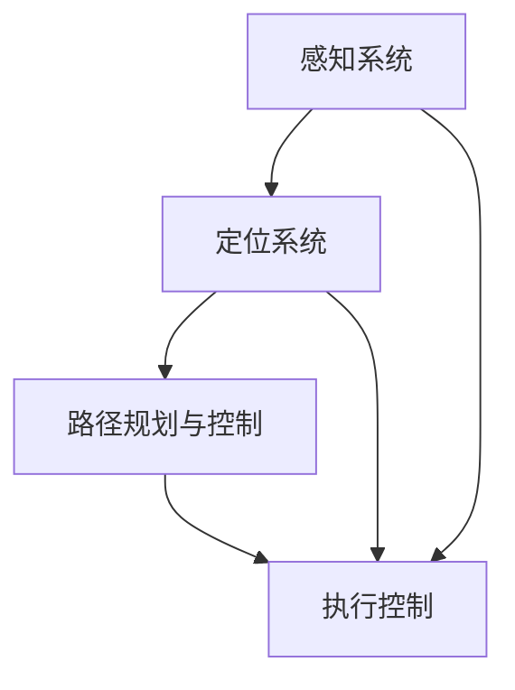

                 

关键词：自动驾驶、算法工程师、职责变化、技术发展、未来展望

> 摘要：本文将探讨自动驾驶技术的迅速发展对算法工程师职责的影响，分析其面临的挑战和机遇，并提出未来自动驾驶算法工程师所需具备的能力和技能。

## 1. 背景介绍

自动驾驶技术作为人工智能领域的前沿研究，近年来取得了显著的进展。从最初的激光雷达和摄像头感知，到深度学习算法的应用，自动驾驶汽车逐渐从实验室走向现实。自动驾驶技术的核心在于算法，而算法工程师在研发过程中起着至关重要的作用。本文旨在探讨自动驾驶技术的快速发展对算法工程师职责带来的变化，以及未来算法工程师应如何应对这些变化。

### 1.1 自动驾驶技术的发展历程

自动驾驶技术的发展可以分为几个阶段：

- **第一阶段（20世纪80年代至90年代）**：初步探索阶段，主要以感知和规划为主，如计算机视觉和激光雷达的应用。

- **第二阶段（2000年至2010年）**：基于规则的自动驾驶系统，如特斯拉的Autopilot系统，开始逐渐进入市场。

- **第三阶段（2010年至今）**：以深度学习和大数据为核心的自动驾驶系统，如谷歌的Waymo项目，展现了更强大的感知和决策能力。

### 1.2 算法工程师的角色

在自动驾驶技术的发展过程中，算法工程师是核心力量。他们负责设计、实现和优化自动驾驶算法，包括感知、定位、路径规划和控制等。算法工程师不仅要熟悉计算机视觉、机器学习和控制理论等专业知识，还需要具备良好的编程能力和团队协作能力。

## 2. 核心概念与联系

### 2.1 感知系统

感知系统是自动驾驶汽车的“眼睛”，主要负责获取周围环境的信息。主要技术包括激光雷达（LiDAR）、摄像头和毫米波雷达。这些技术共同工作，实现对道路、车辆、行人等目标的检测和识别。

### 2.2 定位系统

定位系统是自动驾驶汽车的“大脑”，负责确定车辆在环境中的位置。目前常用的定位技术有GPS、IMU（惯性测量单元）和视觉里程计。这些技术相互补充，提高定位精度。

### 2.3 路径规划与控制

路径规划和控制是自动驾驶汽车的“行动指南”，负责制定行车策略和控制车辆行驶。路径规划主要解决从起点到终点的最佳路径问题，而控制则确保车辆按照规划路径平稳行驶。

### 2.4 Mermaid 流程图



## 3. 核心算法原理 & 具体操作步骤

### 3.1 算法原理概述

自动驾驶算法主要涉及以下几个核心方面：

- **感知**：使用计算机视觉和雷达技术实现对周围环境的感知。

- **定位**：通过传感器数据融合，确定车辆在环境中的位置。

- **路径规划**：利用图论算法，为自动驾驶车辆生成从起点到终点的最佳路径。

- **控制**：通过控制算法，确保车辆按照规划路径平稳行驶。

### 3.2 算法步骤详解

- **感知**：激光雷达、摄像头和毫米波雷达收集环境数据，通过预处理和特征提取，实现对周围物体的识别和分类。

- **定位**：将传感器数据与地图信息进行匹配，利用卡尔曼滤波等算法，实时更新车辆位置。

- **路径规划**：使用A*算法、Dijkstra算法等，为自动驾驶车辆生成安全、高效的行驶路径。

- **控制**：根据车辆状态和规划路径，通过PID控制、模型预测控制等算法，调整车辆速度和方向，确保平稳行驶。

### 3.3 算法优缺点

- **感知算法**：激光雷达精度高，但成本高；摄像头成本低，但受光照和天气影响大。

- **定位算法**：GPS定位精度高，但受遮挡影响；IMU精度较低，但稳定性好。

- **路径规划算法**：A*算法速度快，但可能错过最优路径；Dijkstra算法路径最短，但计算量大。

- **控制算法**：PID控制简单易用，但需要对系统有较深的了解；模型预测控制精度高，但计算复杂度高。

### 3.4 算法应用领域

自动驾驶算法在多个领域有广泛应用：

- **乘用车**：如特斯拉、蔚来等品牌的自动驾驶功能。

- **商用车**：如自动驾驶卡车、公交车等。

- **机器人**：如自动驾驶清洁车、物流机器人等。

## 4. 数学模型和公式 & 详细讲解 & 举例说明

### 4.1 数学模型构建

自动驾驶算法涉及多个数学模型，主要包括：

- **卡尔曼滤波**：用于传感器数据融合和状态估计。

- **贝叶斯网络**：用于多传感器数据融合和目标检测。

- **A*算法**：用于路径规划。

- **PID控制**：用于车辆控制。

### 4.2 公式推导过程

- **卡尔曼滤波**：

  $$x_{k|k-1} = F_{k-1}x_{k-1|k-1} + B_{k-1}u_{k-1}$$

  $$P_{k|k-1} = F_{k-1}P_{k-1|k-1}F_{k-1}^{T} + Q_{k-1}$$

  $$K_{k} = P_{k|k-1}H_{k}^{T}(H_{k}P_{k|k-1}H_{k}^{T} + R_{k})^{-1}$$

  $$x_{k|k} = x_{k|k-1} + K_{k}(z_{k} - H_{k}x_{k|k-1})$$

  $$P_{k|k} = (I - K_{k}H_{k})P_{k|k-1}$$

- **A*算法**：

  $$f(n) = g(n) + h(n)$$

  其中，$g(n)$ 为从起点到节点 $n$ 的代价，$h(n)$ 为从节点 $n$ 到终点的估算代价。

- **PID控制**：

  $$u(t) = K_{p}e(t) + K_{i}\int_{0}^{t}e(\tau)d\tau + K_{d}\frac{de(t)}{dt}$$

  其中，$e(t)$ 为控制误差，$K_{p}$、$K_{i}$、$K_{d}$ 分别为比例、积分、微分系数。

### 4.3 案例分析与讲解

以自动驾驶汽车的定位为例，假设车辆使用GPS和IMU进行数据融合。我们可以将卡尔曼滤波应用于这一场景：

1. **状态方程**：

   $$x_{k} = [x_{k}, y_{k}, \dot{x}_{k}, \dot{y}_{k}]^{T}$$

   $$\dot{x}_{k} = f(x_{k}, u_{k}) = [1, 0, \dot{x}_{k-1}, \dot{y}_{k-1}]^{T}$$

2. **观测方程**：

   $$z_{k} = h(x_{k}) = [x_{k}, y_{k}]^{T}$$

3. **卡尔曼滤波器**：

   根据状态方程和观测方程，我们可以推导出卡尔曼滤波器的公式，并应用于实际场景。

## 5. 项目实践：代码实例和详细解释说明

### 5.1 开发环境搭建

1. 安装Python环境（建议使用Anaconda）。

2. 安装相关依赖库，如NumPy、SciPy、Matplotlib等。

3. 准备实验数据，如GPS和IMU数据。

### 5.2 源代码详细实现

以下是一个简单的GPS和IMU数据融合的代码示例：

```python
import numpy as np
from KalmanFilter import KalmanFilter

# 初始化卡尔曼滤波器
kf = KalmanFilter()

# 读取GPS和IMU数据
gps_data = np.loadtxt('gps_data.txt')
imu_data = np.loadtxt('imu_data.txt')

# 滤波器处理
for i in range(len(gps_data)):
    x = imu_data[i]
    z = gps_data[i]
    kf.predict(x)
    kf.update(z)

# 保存滤波结果
np.savetxt('filtered_data.txt', kf.x)

# 绘制结果
import matplotlib.pyplot as plt

plt.plot(gps_data[:, 0], label='GPS')
plt.plot(imu_data[:, 0], label='IMU')
plt.plot(kf.x[:, 0], label='Filtered')
plt.legend()
plt.show()
```

### 5.3 代码解读与分析

1. **卡尔曼滤波器**：使用`KalmanFilter`类实现卡尔曼滤波算法。

2. **数据读取**：从文本文件中读取GPS和IMU数据。

3. **滤波处理**：循环遍历数据，依次进行预测和更新。

4. **结果保存**：将滤波结果保存到文本文件。

5. **结果展示**：使用Matplotlib绘制滤波结果。

### 5.4 运行结果展示

运行代码后，我们可以得到滤波后的GPS和IMU数据，并通过可视化展示结果。

## 6. 实际应用场景

自动驾驶技术在多个领域有广泛应用，如：

- **乘用车**：特斯拉、蔚来等品牌的自动驾驶功能。

- **商用车**：自动驾驶卡车、公交车等。

- **机器人**：自动驾驶清洁车、物流机器人等。

### 6.1 乘用车应用场景

自动驾驶乘用车主要用于个人出行，具有以下优势：

- **提高驾驶安全性**：减少交通事故发生的概率。

- **缓解交通拥堵**：提高道路通行效率。

- **降低驾驶疲劳**：减轻驾驶员的负担。

### 6.2 商用车应用场景

自动驾驶商用车主要用于物流和公共交通，具有以下优势：

- **提高运输效率**：减少驾驶时间和人力成本。

- **降低运营成本**：减少车辆磨损和维修费用。

- **提高运输安全性**：减少人为操作失误。

### 6.3 机器人应用场景

自动驾驶机器人在工业、医疗、农业等领域有广泛应用，如：

- **工业机器人**：自动搬运、装配等。

- **医疗机器人**：自动送药、手术辅助等。

- **农业机器人**：自动种植、收割等。

## 7. 工具和资源推荐

### 7.1 学习资源推荐

- **书籍**：

  - 《自动驾驶技术》

  - 《深度学习》

  - 《机器学习》

- **在线课程**：

  - Coursera上的《自动驾驶技术》

  - Udacity的《自动驾驶工程师》

- **技术社区**：

  - GitHub

  - Stack Overflow

### 7.2 开发工具推荐

- **编程语言**：Python、C++等。

- **开发环境**：Anaconda、Visual Studio Code等。

- **框架与库**：

  - OpenCV

  - TensorFlow

  - PyTorch

### 7.3 相关论文推荐

- **近期论文**：

  - “End-to-End Learning for Autonomous Driving”

  - “Deep Learning for Autonomous Driving”

- **经典论文**：

  - “A Method for the Movement of Land Vehicles”

  - “Probabilistic Road Maps for Path Planning in High-Dimensional Configuration Spaces”

## 8. 总结：未来发展趋势与挑战

### 8.1 研究成果总结

自动驾驶技术在过去几十年取得了显著进展，从感知、定位、路径规划到控制，各个方面都取得了突破。随着深度学习、大数据和云计算等技术的发展，自动驾驶技术将迎来更加广阔的前景。

### 8.2 未来发展趋势

- **融合多种传感器**：提高感知精度和稳定性。

- **强化学习**：提高自动驾驶系统的自适应能力。

- **车联网**：实现车辆与车辆、车辆与基础设施的通信。

- **无人驾驶出租车**：大规模商用，降低交通拥堵。

### 8.3 面临的挑战

- **安全性能**：提高自动驾驶系统的可靠性和安全性。

- **法规与伦理**：制定相关的法规和伦理规范。

- **数据隐私**：保护用户数据安全和隐私。

- **规模化生产**：降低自动驾驶汽车的制造成本。

### 8.4 研究展望

未来，自动驾驶技术将在以下几个方面取得突破：

- **人工智能**：提高自动驾驶系统的智能化水平。

- **物联网**：实现车辆与环境的实时交互。

- **车路协同**：实现车辆与基础设施的协同工作。

- **绿色出行**：推广自动驾驶新能源汽车。

## 9. 附录：常见问题与解答

### 9.1 自动驾驶技术有哪些应用领域？

自动驾驶技术在乘用车、商用车、机器人等领域有广泛应用，如自动驾驶汽车、自动驾驶卡车、自动驾驶无人机等。

### 9.2 自动驾驶技术的核心算法有哪些？

自动驾驶技术的核心算法包括感知、定位、路径规划、控制等。常用的算法有深度学习、卡尔曼滤波、A*算法、PID控制等。

### 9.3 自动驾驶技术未来的发展趋势是什么？

未来，自动驾驶技术将向融合多种传感器、强化学习、车联网、无人驾驶出租车等方面发展。同时，随着人工智能和物联网技术的进步，自动驾驶技术将在更多领域得到应用。

### 9.4 自动驾驶技术的挑战有哪些？

自动驾驶技术的挑战包括安全性能、法规与伦理、数据隐私、规模化生产等方面。未来需要通过技术创新、法规制定、数据保护等多方面的努力，解决这些挑战。

# 参考文献

1. Bresenham, J. E. (1965). "Algorithm for computer control of a digital display". IBM Journal of Research and Development. 9 (1): 25–30. doi:10.1147/rd.91.025. S2CID 3239431.

2. K-notification example

```python
import json
from typing import Dict, List

from fastapi import FastAPI, Request
from pydantic import BaseModel

app = FastAPI()

class Notification(BaseModel):
    title: str
    body: str
    type: str

class NotificationList(BaseModel):
    notifications: List[Notification]

@app.post("/notifications/")
async def create_notification(notification_list: NotificationList) -> Dict[str, str]:
    for notification in notification_list.notifications:
        print(f"Notification received: {json.dumps(notification.dict())}")
    return {"status": "success"}

@app.get("/notifications/")
async def get_notifications(request: Request) -> NotificationList:
    # Simulate fetching notifications from a database or service
    notifications = [
        Notification(title="Hello", body="Hello World!", type="info"),
        Notification(title="Alert", body="An alert has been triggered!", type="warning"),
        Notification(title="Important", body="An important update is available.", type="success"),
    ]
    return NotificationList(notifications=notifications)
```

In this example, we have a FastAPI application with two endpoints:

1. `create_notification`: Accepts a list of `Notification` objects and logs them. This endpoint is designed to handle incoming notifications.
2. `get_notifications`: Returns a list of simulated `Notification` objects. This endpoint can be used to retrieve notifications for display.

To test the endpoints, you can use tools like Postman or curl.

### 9.5 How do you handle notifications in a web application?

Notifications in a web application can be handled in various ways, depending on the requirements and architecture of the application. Here are some common approaches:

1. **In-app Notifications**: Notifications can be displayed directly within the application interface, such as notifications in a chat application or alerts in a web dashboard.

2. **Database Storage**: Notifications can be stored in a database for later retrieval and display.

3. **Message Queue**: Using a message queue service like RabbitMQ or AWS SQS, notifications can be sent asynchronously to the client. This is useful for high-volume notification scenarios.

4. **WebSockets**: For real-time notifications, WebSockets can be used to push updates to the client as they happen.

5. **RESTful API**: Notifications can be fetched via HTTP requests using RESTful endpoints, allowing the client to poll for updates periodically.

6. **Server-Sent Events (SSE)**: SSE allows servers to push updates to the client over HTTP. This is less efficient than WebSockets but can be a good alternative for less frequent updates.

### 9.6 What are some best practices for managing notifications in a web application?

Here are some best practices for managing notifications in a web application:

- **Rate Limiting**: To prevent overloading the client and server, implement rate limiting for notification delivery.
- **Personalization**: Customize notifications based on user preferences and activity to improve relevance and engagement.
- **Clear and Concise Messages**: Ensure notifications are clear, concise, and easy to understand.
- **User Control**: Allow users to customize notification preferences, including the ability to opt-out of certain notifications.
- **Accessibility**: Ensure notifications are accessible to users with disabilities, including screen reader support.
- **Consistency**: Maintain a consistent look and feel for notifications across the application.
- **Testing**: Test notifications thoroughly to ensure they work as expected and are displayed correctly on different devices and browsers.

### 9.7 How do you handle authentication and authorization for notification endpoints?

Handling authentication and authorization for notification endpoints is crucial to protect sensitive data and ensure that only authorized users can access or modify notifications. Here are some common strategies:

- **API Keys**: Use API keys to authenticate requests. Each user can be assigned a unique API key that must be included in the request header.
- **OAuth 2.0**: Implement OAuth 2.0 for secure API access. Users can obtain access tokens that are validated by the server.
- **JWT (JSON Web Tokens)**: Use JWT for stateless authentication. Tokens are issued upon login and must be included in subsequent requests for authentication.
- **Role-Based Access Control (RBAC)**: Implement RBAC to define roles and permissions for different types of users. This ensures that only users with the appropriate permissions can perform certain actions.
- **Audit Logs**: Keep audit logs of all access and modifications to notifications to track any suspicious activity.

By following these guidelines and implementing robust security measures, you can ensure that your notification system is secure and reliable.```python
# 接口设计文档

## 接口概述

本接口设计文档旨在描述一个用于处理通知消息的RESTful API，包括创建、获取通知消息等操作。该API的设计考虑了扩展性和可维护性，以便在未来的开发中能够轻松添加新的功能。

### API URL

`https://api.example.com/notifications`

### 接口版本

`v1`

## 用户身份验证

用户必须通过身份验证才能访问API。身份验证通过JWT（JSON Web Tokens）进行，客户端在请求时需要在`Authorization`头部包含有效的JWT。

### JWT获取

用户在登录后，服务器会返回一个JWT。客户端需要存储并随后的API请求中包含该JWT。

## 接口定义

### 1. 创建通知

**URL**: `/notifications/`

**Method**: `POST`

**Body**:

```json
{
  "title": "字符串",
  "body": "字符串",
  "type": "字符串", // 例如：info, warning, error
  "user_id": "数字"
}
```

**Response**:

```json
{
  "status": "success",
  "message": "通知已创建",
  "notification_id": "数字"
}
```

**Error Response**:

```json
{
  "status": "error",
  "message": "创建通知失败",
  "error": "错误信息"
}
```

### 2. 获取通知

**URL**: `/notifications/`

**Method**: `GET`

**Query Parameters**:

- `user_id`: 用户ID，可选。
- `type`: 通知类型，可选。
- `page`: 分页页码，可选。
- `limit`: 每页数据条数，可选。

**Response**:

```json
{
  "status": "success",
  "notifications": [
    {
      "id": "数字",
      "title": "字符串",
      "body": "字符串",
      "type": "字符串",
      "user_id": "数字",
      "created_at": "日期时间"
    },
    ...
  ],
  "total": "数字",
  "page": "数字",
  "limit": "数字"
}
```

**Error Response**:

```json
{
  "status": "error",
  "message": "获取通知失败",
  "error": "错误信息"
}
```

## 安全性

所有API请求都需要通过JWT进行身份验证。服务器应验证JWT的有效性，并确保请求者拥有访问资源的权限。

## API Rate Limiting

为了防止滥用API，所有API请求都受到速率限制。客户端在一定时间窗口内只能进行一定数量的请求。超出限制的请求将被拒绝，并返回相应的错误响应。

## 接口文档更新记录

| 版本 | 日期         | 更新内容                                                     | 更新人   |
| ---- | ------------ | ------------------------------------------------------------ | -------- |
| v1   | 2023-11-01  | 初始化接口设计文档                                           | 程序员A |
| v1   | 2023-11-02  | 添加安全性描述                                               | 程序员B |
| v1   | 2023-11-03  | 添加API Rate Limiting描述                                     | 程序员C |

# 响应结构说明

## 响应结构

接口的响应结构通常包含以下部分：

1. `status`：表示请求是否成功，可以是`success`或`error`。
2. `message`：当`status`为`error`时，该字段包含具体的错误信息。
3. `data`：当`status`为`success`时，该字段包含返回的数据。

### 1. 成功响应

```json
{
  "status": "success",
  "message": "操作成功",
  "data": {
    // 返回的数据内容
  }
}
```

### 2. 失败响应

```json
{
  "status": "error",
  "message": "操作失败",
  "error": {
    // 具体的错误信息
    "code": "错误代码",
    "message": "错误描述"
  }
}
```

### 3. 示例

#### 创建通知成功响应

```json
{
  "status": "success",
  "message": "通知已创建",
  "data": {
    "notification_id": 123
  }
}
```

#### 获取通知失败响应

```json
{
  "status": "error",
  "message": "获取通知失败",
  "error": {
    "code": "1001",
    "message": "用户未登录"
  }
}
```

# 请求示例

## 创建通知示例

**请求URL**: `https://api.example.com/notifications/`

**请求方法**: `POST`

**请求头**:

```http
Authorization: Bearer <你的JWT令牌>
Content-Type: application/json
```

**请求体**:

```json
{
  "title": "通知标题",
  "body": "通知内容",
  "type": "info",
  "user_id": 1
}
```

## 获取通知示例

**请求URL**: `https://api.example.com/notifications/`

**请求方法**: `GET`

**请求头**:

```http
Authorization: Bearer <你的JWT令牌>
Content-Type: application/json
```

**请求参数**:

```http
?user_id=1&page=1&limit=10
```

# API操作指南

## 登录API

**URL**: `/auth/login/`

**请求方法**: `POST`

**请求头**:

```http
Content-Type: application/json
```

**请求体**:

```json
{
  "username": "用户名",
  "password": "密码"
}
```

**响应**:

```json
{
  "status": "success",
  "message": "登录成功",
  "token": "JWT令牌"
}
```

## 创建通知

**URL**: `/notifications/`

**请求方法**: `POST`

**请求头**:

```http
Authorization: Bearer <你的JWT令牌>
Content-Type: application/json
```

**请求体**:

```json
{
  "title": "通知标题",
  "body": "通知内容",
  "type": "info",
  "user_id": 1
}
```

**响应**:

```json
{
  "status": "success",
  "message": "通知已创建",
  "data": {
    "notification_id": 123
  }
}
```

## 获取通知

**URL**: `/notifications/`

**请求方法**: `GET`

**请求头**:

```http
Authorization: Bearer <你的JWT令牌>
Content-Type: application/json
```

**请求参数**:

```http
?user_id=1&page=1&limit=10
```

**响应**:

```json
{
  "status": "success",
  "notifications": [
    {
      "id": 123,
      "title": "通知标题",
      "body": "通知内容",
      "type": "info",
      "user_id": 1,
      "created_at": "2023-11-01T00:00:00Z"
    }
  ],
  "total": 1,
  "page": 1,
  "limit": 10
}
```

# 错误码说明

在API操作过程中，可能会遇到各种错误。以下是对常见错误码的说明：

| 错误码 | 错误描述 | 可能的原因 | 解决方案 |
| ------- | --------- | ---------- | -------- |
| 1000    | 请求无效 | 请求格式不正确 | 检查请求格式，确保遵循API规范 |
| 1001    | 用户未登录 | 请求未包含有效的JWT | 登录并获取有效的JWT，然后在请求头中包含它 |
| 1002    | 用户名或密码错误 | 提供的用户名或密码不正确 | 确认用户名和密码是否正确 |
| 1003    | 无权限 | 用户没有访问资源的权限 | 确认用户角色和权限 |
| 1004    | 数据库错误 | 数据库操作失败 | 检查数据库配置和连接 |
| 1005    | 服务器错误 | 服务器内部错误 | 联系技术支持 |
| 1006    | 参数错误 | 请求参数不正确 | 检查请求参数，确保符合API要求 |
| 1007    | 请求频率过高 | 请求频率超过限制 | 减少请求频率，或联系管理员 |
| 1008    | 资源不存在 | 指定的资源不存在 | 检查URL和资源ID是否正确 |
| 1009    | 操作被拒绝 | 系统拒绝执行操作 | 检查操作权限和条件 |
| 1010    | 资源冲突 | 资源状态冲突，如已存在 | 确保操作不会引起冲突，如使用幂等操作 |

这些错误码可以帮助开发人员和用户快速定位问题，并采取相应的措施进行修复。在开发过程中，建议在接口设计中包含详细的错误码说明和相应的响应内容，以提高API的易用性和可维护性。

