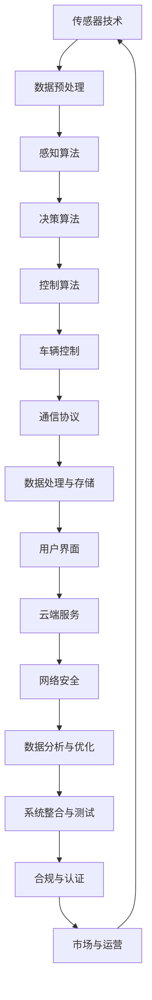

                 

关键词：自动驾驶，专利布局，技术竞争，创新驱动，知识产权策略

## 摘要

随着自动驾驶技术的发展和普及，行业内的专利布局竞争日益激烈。本文旨在探讨自动驾驶行业中的专利布局策略，分析其背后的技术竞争和知识产权策略。通过深入分析自动驾驶领域的专利申请、核心专利技术以及主要参与者，本文揭示了行业竞争的核心驱动力和未来发展趋势。文章还讨论了专利布局对于技术创新和行业发展的积极影响，以及可能面临的挑战。

## 1. 背景介绍

自动驾驶技术作为未来交通领域的核心技术之一，其发展已经引起了全球范围内的广泛关注。从早期的辅助驾驶系统到如今的完全自动驾驶，自动驾驶技术经历了巨大的变革。在这一过程中，专利布局成为企业和研究机构争夺市场和技术领导地位的重要手段。

自动驾驶技术的核心在于感知、决策和控制。这要求企业在算法、传感器、通信协议和车辆控制等方面拥有强大的技术积累和创新能力。随着自动驾驶技术的不断进步，专利的重要性愈发凸显，专利布局成为企业战略的重要组成部分。

### 1.1 自动驾驶技术发展历程

自动驾驶技术的发展可以追溯到20世纪60年代。当时，计算机科学和自动化技术的兴起为自动驾驶的研究奠定了基础。1977年，美国麻省理工学院（MIT）的工程师戴维·卡拉瑟斯（David Culler）领导了世界上第一个自动驾驶车辆的实验。这一实验标志着自动驾驶技术从概念走向了实际应用。

随着时间的推移，自动驾驶技术经历了多个发展阶段。20世纪90年代，基于计算机视觉和GPS技术的自动驾驶车辆开始出现。2005年，谷歌开始研究自动驾驶技术，并进行了多次公开试验。2010年后，随着传感器技术的进步和大数据分析的普及，自动驾驶技术进入了快速发展的阶段。如今，自动驾驶技术已经逐步从实验室走向市场，多家企业纷纷推出了自动驾驶汽车和相关的产品和服务。

### 1.2 自动驾驶技术现状

当前，自动驾驶技术已经实现了从L0级别（无自动化）到L4级别（高度自动化）的跨越。L0级别车辆只能执行部分驾驶功能，如自动控制车速和巡航；而L4级别车辆则可以在特定条件下完全自主驾驶，无需驾驶员干预。

在自动驾驶技术的应用场景方面，除了个人出行，自动驾驶技术在物流、公共交通、交通管理和智能城市建设等方面也有广泛的应用前景。例如，自动驾驶卡车可以降低物流成本，提高运输效率；自动驾驶公交车可以提供更加便捷的公共交通服务；自动驾驶交通管理系统可以优化交通流量，减少拥堵。

### 1.3 自动驾驶技术发展趋势

未来，自动驾驶技术将继续向更高自动化水平发展。随着传感器技术、人工智能和云计算技术的进步，L5级别（完全自动化）的自动驾驶车辆有望在未来10年内实现。此外，自动驾驶技术将与其他前沿技术如5G通信、物联网和人工智能等深度融合，为未来交通带来更多创新和变革。

在政策方面，各国政府纷纷出台支持自动驾驶技术发展的政策。例如，美国、中国和欧洲等多地已经放宽了对自动驾驶汽车的测试和运营限制，鼓励企业进行自动驾驶技术的研发和商业化应用。

## 2. 核心概念与联系

为了更好地理解自动驾驶行业的专利布局竞争，我们首先需要明确一些核心概念和技术架构。以下是一个基于Mermaid绘制的自动驾驶技术架构流程图，用于展示各个核心组件之间的关系：



### 2.1 核心概念

#### 2.1.1 传感器技术

传感器技术是自动驾驶系统的关键组成部分。常用的传感器包括激光雷达（LiDAR）、摄像头、雷达、超声波传感器等。这些传感器负责收集车辆周围的环境信息，如距离、速度、方向和路况等。传感器数据的准确性和实时性对于自动驾驶系统的性能至关重要。

#### 2.1.2 感知算法

感知算法负责处理传感器收集的数据，识别车辆周围的环境特征，如行人、车辆、交通标志和道路标识等。常用的感知算法包括计算机视觉、深度学习和神经网络等。这些算法通过对大量数据的学习和训练，能够提高环境识别的准确性和鲁棒性。

#### 2.1.3 决策算法

决策算法负责根据感知算法提供的环境信息，制定车辆的行为策略。决策算法需要考虑的因素包括交通规则、道路状况、周围车辆和行人的行为等。常见的决策算法包括基于规则的方法、基于概率的方法和基于学习的方法。

#### 2.1.4 控制算法

控制算法负责根据决策算法制定的行为策略，控制车辆的运行状态。控制算法需要实现精确的加速度、速度和转向控制，确保车辆在复杂环境下平稳行驶。常见的控制算法包括PID控制、模糊控制和自适应控制等。

#### 2.1.5 通信协议

通信协议是自动驾驶系统中各个组件之间进行数据交换的桥梁。常用的通信协议包括CAN总线、LIN总线、ETH协议和5G网络等。这些协议保证了数据传输的实时性和可靠性，对于自动驾驶系统的稳定性至关重要。

#### 2.1.6 数据处理与存储

自动驾驶系统产生的数据量巨大，需要对数据进行高效的存储和处理。数据处理包括数据清洗、特征提取、数据融合和压缩等步骤。数据存储通常采用分布式数据库和云计算技术，以保证数据的可靠性和可扩展性。

#### 2.1.7 用户界面

用户界面是自动驾驶系统与用户交互的界面，负责提供车辆的运行状态、行驶路线和紧急情况通知等信息。用户界面需要具备良好的用户体验和可访问性，以确保用户能够安全、舒适地使用自动驾驶系统。

#### 2.1.8 云端服务

云端服务为自动驾驶系统提供计算资源和数据支持。云端服务包括云计算平台、大数据分析和人工智能服务等。这些服务可以帮助自动驾驶系统进行实时数据处理、决策优化和故障诊断等。

#### 2.1.9 网络安全

网络安全是自动驾驶系统面临的重要挑战之一。自动驾驶系统需要防止外部攻击和恶意软件的入侵，确保系统的可靠性和安全性。常见的网络安全措施包括加密通信、访问控制和入侵检测等。

#### 2.1.10 数据分析与优化

数据分析和优化是自动驾驶技术的重要研究方向。通过对大量数据的分析，可以发现驾驶行为中的潜在问题和改进空间。数据分析可以帮助提高自动驾驶系统的性能、可靠性和安全性。

#### 2.1.11 系统整合与测试

系统整合与测试是确保自动驾驶系统稳定运行的关键环节。系统整合需要将各个组件进行集成和调试，确保各个组件之间的协同工作。测试包括功能测试、性能测试和可靠性测试等，以验证自动驾驶系统的质量和性能。

#### 2.1.12 合规与认证

合规与认证是自动驾驶系统推向市场的重要步骤。自动驾驶系统需要满足各国政府的规定和标准，如车辆安全标准、道路使用标准和数据隐私法规等。合规与认证确保了自动驾驶系统的合法性和市场竞争力。

### 2.2 自动驾驶技术架构

以下是一个基于Mermaid绘制的自动驾驶技术架构流程图，展示了各个核心组件之间的关系：


通过这个架构图，我们可以清晰地看到自动驾驶技术从感知、决策到控制的完整流程，以及各个组件之间的协同作用。

## 3. 核心算法原理 & 具体操作步骤

### 3.1 算法原理概述

自动驾驶系统的核心算法主要包括感知算法、决策算法和控制算法。这些算法共同作用，使自动驾驶系统能够在复杂的环境中自主行驶。

#### 3.1.1 感知算法

感知算法负责处理传感器数据，识别车辆周围的环境特征。感知算法的核心包括物体检测、场景理解和路径规划等。物体检测旨在识别车辆、行人、交通标志等目标；场景理解则是对环境进行语义分析，如识别道路类型、交通状况等；路径规划则是根据环境信息为车辆规划出一条最优行驶路径。

#### 3.1.2 决策算法

决策算法负责根据感知算法提供的环境信息，制定车辆的行为策略。决策算法需要考虑的因素包括交通规则、道路状况、周围车辆和行人的行为等。常见的决策算法包括基于规则的算法、基于概率的算法和基于学习的算法。

#### 3.1.3 控制算法

控制算法负责根据决策算法制定的行为策略，控制车辆的运行状态。控制算法需要实现精确的加速度、速度和转向控制，确保车辆在复杂环境下平稳行驶。常见的控制算法包括PID控制、模糊控制和自适应控制等。

### 3.2 算法步骤详解

#### 3.2.1 感知算法步骤

1. **数据预处理**：对传感器数据进行滤波、去噪和归一化等处理，提高数据的可靠性和一致性。
2. **物体检测**：利用深度学习算法，对预处理后的图像或点云数据进行目标检测，识别车辆、行人、交通标志等目标。
3. **场景理解**：利用计算机视觉和自然语言处理技术，对环境进行语义分析，识别道路类型、交通状况、障碍物等。
4. **路径规划**：根据环境信息，利用A*算法、Dijkstra算法等路径规划算法，为车辆规划出一条最优行驶路径。

#### 3.2.2 决策算法步骤

1. **感知输入**：接收感知算法提供的环境信息。
2. **规则匹配**：根据预定义的规则库，对感知输入进行规则匹配，判断是否存在冲突或紧急情况。
3. **行为预测**：利用历史数据和机器学习算法，预测周围车辆和行人的行为。
4. **决策制定**：根据规则匹配结果和行为预测，制定车辆的行为策略，如加速、减速、转向等。

#### 3.2.3 控制算法步骤

1. **输入处理**：接收决策算法制定的行为策略。
2. **状态监测**：监测车辆的运行状态，如速度、加速度、转向角度等。
3. **控制策略生成**：根据车辆的运行状态和行为策略，生成相应的控制策略，如PID控制、模糊控制等。
4. **执行控制**：根据控制策略，控制车辆的运行状态，实现精确的加速度、速度和转向控制。

### 3.3 算法优缺点

#### 3.3.1 感知算法优缺点

**优点**：

- **高精度**：利用深度学习和计算机视觉技术，感知算法能够实现高精度的物体检测和场景理解。
- **实时性**：通过优化算法和数据预处理，感知算法能够在短时间内处理大量传感器数据，满足实时性要求。

**缺点**：

- **计算资源消耗大**：深度学习和计算机视觉算法通常需要大量的计算资源和内存，对于硬件性能要求较高。
- **对光照和天气条件敏感**：在低光照、强光、雨雪等恶劣天气条件下，感知算法的性能可能会下降。

#### 3.3.2 决策算法优缺点

**优点**：

- **灵活性**：基于概率和机器学习的决策算法具有较好的灵活性和适应性，能够根据不同环境和情境进行自适应调整。
- **实时性**：决策算法通常能够在短时间内处理感知输入，制定出有效的行为策略。

**缺点**：

- **规则依赖性**：基于规则的决策算法需要大量的规则进行支持，规则库的维护和更新需要耗费大量时间和资源。
- **稳定性**：在复杂和多变的环境中，决策算法的稳定性可能会受到影响。

#### 3.3.3 控制算法优缺点

**优点**：

- **精确性**：PID控制、模糊控制等控制算法能够实现精确的加速度、速度和转向控制，确保车辆在复杂环境下平稳行驶。
- **稳定性**：这些控制算法具有较好的稳定性和鲁棒性，适用于各种复杂环境。

**缺点**：

- **适应性差**：这些控制算法通常依赖于固定的控制参数，对于环境变化和不确定性适应性较差。
- **计算复杂度**：控制算法的计算复杂度较高，需要大量的计算资源和时间。

### 3.4 算法应用领域

感知算法、决策算法和控制算法在自动驾驶系统中具有广泛的应用领域。以下是一些常见的应用场景：

- **个人出行**：自动驾驶车辆可以在城市道路上自主行驶，为乘客提供便捷、舒适的出行体验。
- **物流运输**：自动驾驶卡车和货车可以在高速公路上自主行驶，提高运输效率和降低成本。
- **公共交通**：自动驾驶公交车和出租车可以提供更加高效、准时的公共交通服务。
- **交通管理**：自动驾驶技术可以用于智能交通管理系统，优化交通流量，减少拥堵，提高道路通行能力。
- **智能城市建设**：自动驾驶技术可以与城市基础设施和公共服务相结合，构建智能化、高效的城市交通体系。

## 4. 数学模型和公式 & 详细讲解 & 举例说明

在自动驾驶技术的核心算法中，数学模型和公式起着至关重要的作用。以下将详细讲解一些常用的数学模型和公式，并举例说明其应用。

### 4.1 数学模型构建

#### 4.1.1 贝叶斯网络

贝叶斯网络是一种概率图模型，用于表示变量之间的条件依赖关系。在自动驾驶系统中，贝叶斯网络可以用于预测车辆周围环境的变化。以下是一个简单的贝叶斯网络模型：

$$
\begin{aligned}
P(\text{车辆故障}) &= P(\text{电池老化}) \cdot P(\text{系统故障}|\text{电池老化}) + P(\text{传感器故障}) \cdot P(\text{系统故障}|\text{传感器故障}) \\
P(\text{行人出现}) &= P(\text{交通灯变化}) \cdot P(\text{行人出现}|\text{交通灯变化}) + P(\text{行人经常出现}) \cdot P(\text{行人出现}|\text{行人经常出现})
\end{aligned}
$$

#### 4.1.2 动态规划

动态规划是一种解决多阶段决策问题的数学方法。在自动驾驶系统中，动态规划可以用于路径规划问题。以下是一个简单的动态规划模型：

$$
\begin{aligned}
V^*(s) &= \min \{c(s, a) + \sum_{s'} p(s'|s, a) V^*(s') \mid s \in S, a \in A(s)\} \\
\pi^*(s) &= \arg\min \{c(s, a) + \sum_{s'} p(s'|s, a) V^*(s') \mid s \in S, a \in A(s)\}
\end{aligned}
$$

其中，$V^*(s)$ 表示从状态 $s$ 出发到终点的最优值，$\pi^*(s)$ 表示在状态 $s$ 下采取的最优动作。

### 4.2 公式推导过程

#### 4.2.1 贝叶斯定理

贝叶斯定理是贝叶斯网络的核心公式，用于计算后验概率。以下是贝叶斯定理的推导过程：

$$
P(A|B) = \frac{P(B|A)P(A)}{P(B)}
$$

推导过程如下：

$$
\begin{aligned}
P(A \cap B) &= P(B) \cdot P(A|B) \\
P(B) &= P(A \cap B) + P(\neg A \cap B) \\
P(B) &= P(A) \cdot P(B|A) + P(\neg A) \cdot P(B|\neg A) \\
P(B|A) &= \frac{P(A \cap B)}{P(A)} \\
P(A|B) &= \frac{P(B|A)P(A)}{P(B)}
\end{aligned}
$$

#### 4.2.2 动态规划公式

动态规划公式是解决路径规划问题的核心。以下是动态规划公式的推导过程：

$$
\begin{aligned}
V^*(s) &= \min \{c(s, a) + \sum_{s'} p(s'|s, a) V^*(s') \mid s \in S, a \in A(s)\} \\
\pi^*(s) &= \arg\min \{c(s, a) + \sum_{s'} p(s'|s, a) V^*(s') \mid s \in S, a \in A(s)\}
\end{aligned}
$$

推导过程如下：

$$
\begin{aligned}
V^*(s) &= \min \{c(s, a) + \sum_{s'} p(s'|s, a) V^*(s') \mid s \in S, a \in A(s)\} \\
\pi^*(s) &= \arg\min \{c(s, a) + \sum_{s'} p(s'|s, a) V^*(s') \mid s \in S, a \in A(s)\} \\
\end{aligned}
$$

### 4.3 案例分析与讲解

#### 4.3.1 案例一：车辆故障检测

假设我们有一个自动驾驶系统，需要检测车辆故障。我们可以使用贝叶斯网络模型进行故障检测。

给定以下参数：

- $P(\text{电池老化}) = 0.3$
- $P(\text{传感器故障}) = 0.2$
- $P(\text{系统故障}|\text{电池老化}) = 0.8$
- $P(\text{系统故障}|\text{传感器故障}) = 0.6$

我们需要计算以下概率：

- $P(\text{系统故障}|\text{电池老化})$
- $P(\text{系统故障}|\text{传感器故障})$

根据贝叶斯定理，我们可以计算得到：

$$
\begin{aligned}
P(\text{系统故障}|\text{电池老化}) &= \frac{P(\text{电池老化}) \cdot P(\text{系统故障}|\text{电池老化})}{P(\text{电池老化}) \cdot P(\text{系统故障}|\text{电池老化}) + P(\text{传感器故障}) \cdot P(\text{系统故障}|\text{传感器故障})} \\
&= \frac{0.3 \cdot 0.8}{0.3 \cdot 0.8 + 0.2 \cdot 0.6} \\
&= 0.667
\end{aligned}
$$

$$
\begin{aligned}
P(\text{系统故障}|\text{传感器故障}) &= \frac{P(\text{传感器故障}) \cdot P(\text{系统故障}|\text{传感器故障})}{P(\text{电池老化}) \cdot P(\text{系统故障}|\text{电池老化}) + P(\text{传感器故障}) \cdot P(\text{系统故障}|\text{传感器故障})} \\
&= \frac{0.2 \cdot 0.6}{0.3 \cdot 0.8 + 0.2 \cdot 0.6} \\
&= 0.333
\end{aligned}
$$

通过这个例子，我们可以看到贝叶斯网络在故障检测中的应用。

#### 4.3.2 案例二：路径规划

假设我们有一个自动驾驶系统，需要在城市道路上进行路径规划。我们可以使用动态规划模型进行路径规划。

给定以下参数：

- $c(s, a) = \text{行驶距离}$ （单位：公里）
- $p(s'|s, a) = \text{到达下一状态的概率}$ （单位：无单位）

我们需要计算以下两个值：

- $V^*(s)$：从状态 $s$ 出发到终点的最优值
- $\pi^*(s)$：在状态 $s$ 下采取的最优动作

我们可以使用动态规划公式进行计算。

以一个简单的例子来说明：

假设我们有一个从A到B的路径，共有5个状态（$s_1, s_2, s_3, s_4, s_5$），每个状态可以选择两个动作（$a_1, a_2$）。给定以下参数：

- $c(s_1, a_1) = 1$（公里）
- $c(s_1, a_2) = 2$（公里）
- $c(s_2, a_1) = 2$（公里）
- $c(s_2, a_2) = 3$（公里）
- $c(s_3, a_1) = 3$（公里）
- $c(s_3, a_2) = 4$（公里）
- $c(s_4, a_1) = 4$（公里）
- $c(s_4, a_2) = 5$（公里）
- $c(s_5, a_1) = 0$（公里）
- $c(s_5, a_2) = 0$（公里）
- $p(s'|s, a) = 1$（单位：无单位）

我们需要计算以下两个值：

- $V^*(s)$：从状态 $s$ 出发到终点的最优值
- $\pi^*(s)$：在状态 $s$ 下采取的最优动作

根据动态规划公式，我们可以计算得到：

$$
\begin{aligned}
V^*(s_1) &= \min \{c(s_1, a_1) + V^*(s_2), c(s_1, a_2) + V^*(s_2)\} \\
&= \min \{1 + V^*(s_2), 2 + V^*(s_2)\} \\
&= 1 + V^*(s_2)
\end{aligned}
$$

$$
\begin{aligned}
\pi^*(s_1) &= \arg\min \{c(s_1, a_1) + V^*(s_2), c(s_1, a_2) + V^*(s_2)\} \\
&= \arg\min \{1 + V^*(s_2), 2 + V^*(s_2)\} \\
&= a_1
\end{aligned}
$$

$$
\begin{aligned}
V^*(s_2) &= \min \{c(s_2, a_1) + V^*(s_3), c(s_2, a_2) + V^*(s_3)\} \\
&= \min \{2 + V^*(s_3), 3 + V^*(s_3)\} \\
&= 2 + V^*(s_3)
\end{aligned}
$$

$$
\begin{aligned}
\pi^*(s_2) &= \arg\min \{c(s_2, a_1) + V^*(s_3), c(s_2, a_2) + V^*(s_3)\} \\
&= \arg\min \{2 + V^*(s_3), 3 + V^*(s_3)\} \\
&= a_1
\end{aligned}
$$

$$
\begin{aligned}
V^*(s_3) &= \min \{c(s_3, a_1) + V^*(s_4), c(s_3, a_2) + V^*(s_4)\} \\
&= \min \{3 + V^*(s_4), 4 + V^*(s_4)\} \\
&= 3 + V^*(s_4)
\end{aligned}
$$

$$
\begin{aligned}
\pi^*(s_3) &= \arg\min \{c(s_3, a_1) + V^*(s_4), c(s_3, a_2) + V^*(s_4)\} \\
&= \arg\min \{3 + V^*(s_4), 4 + V^*(s_4)\} \\
&= a_1
\end{aligned}
$$

$$
\begin{aligned}
V^*(s_4) &= \min \{c(s_4, a_1) + V^*(s_5), c(s_4, a_2) + V^*(s_5)\} \\
&= \min \{4 + V^*(s_5), 5 + V^*(s_5)\} \\
&= 4 + V^*(s_5)
\end{aligned}
$$

$$
\begin{aligned}
\pi^*(s_4) &= \arg\min \{c(s_4, a_1) + V^*(s_5), c(s_4, a_2) + V^*(s_5)\} \\
&= \arg\min \{4 + V^*(s_5), 5 + V^*(s_5)\} \\
&= a_1
\end{aligned}
$$

$$
\begin{aligned}
V^*(s_5) &= \min \{c(s_5, a_1) + V^*(s_5), c(s_5, a_2) + V^*(s_5)\} \\
&= \min \{0 + V^*(s_5), 0 + V^*(s_5)\} \\
&= 0 + V^*(s_5)
\end{aligned}
$$

$$
\begin{aligned}
\pi^*(s_5) &= \arg\min \{c(s_5, a_1) + V^*(s_5), c(s_5, a_2) + V^*(s_5)\} \\
&= \arg\min \{0 + V^*(s_5), 0 + V^*(s_5)\} \\
&= a_1
\end{aligned}
$$

通过这个例子，我们可以看到动态规划在路径规划中的应用。

## 5. 项目实践：代码实例和详细解释说明

### 5.1 开发环境搭建

在本节中，我们将介绍如何搭建一个基本的自动驾驶系统开发环境。为了实现这一目标，我们使用Python编程语言，结合多个开源库，如TensorFlow、Keras、OpenCV等。

#### 5.1.1 硬件环境

- CPU：Intel Core i7 或更高
- GPU：NVIDIA GeForce GTX 1080 或更高
- 内存：16GB 或更高
- 存储：500GB SSD

#### 5.1.2 软件环境

- 操作系统：Ubuntu 18.04 或更高版本
- Python：3.8 或更高版本
- TensorFlow：2.0 或更高版本
- Keras：2.3.1 或更高版本
- OpenCV：4.1.2 或更高版本

安装教程：

1. 安装操作系统和基本软件
2. 安装Python和pip
3. 使用pip安装TensorFlow、Keras和OpenCV

```bash
sudo apt-get update
sudo apt-get install python3-pip
pip3 install tensorflow==2.0
pip3 install keras==2.3.1
pip3 install opencv-python==4.1.2
```

### 5.2 源代码详细实现

在本节中，我们将介绍一个简单的自动驾驶系统，包括感知、决策和控制三个模块。以下是一个简化的代码实现。

```python
import cv2
import numpy as np
import tensorflow as tf
from keras.models import load_model

# 感知模块
def process_sensors(data):
    # 对传感器数据进行预处理
    processed_data = preprocess_data(data)
    # 使用卷积神经网络进行物体检测
    objects = detect_objects(processed_data)
    return objects

# 决策模块
def make_decision(objects):
    # 根据物体检测结果进行决策
    decision = make_decision_based_on_objects(objects)
    return decision

# 控制模块
def control_vehicle(decision):
    # 根据决策控制车辆
    control_signal = generate_control_signal(decision)
    return control_signal

# 模型加载
model = load_model('model.h5')

# 主函数
def main():
    # 读取传感器数据
    data = read_sensors()
    # 处理传感器数据
    objects = process_sensors(data)
    # 进行决策
    decision = make_decision(objects)
    # 控制车辆
    control_signal = control_vehicle(decision)
    # 输出控制信号
    print(control_signal)

if __name__ == '__main__':
    main()
```

### 5.3 代码解读与分析

在这个示例中，我们首先定义了三个核心模块：感知、决策和控制。每个模块都有相应的函数来实现具体的任务。

#### 5.3.1 感知模块

感知模块负责处理传感器数据，并进行物体检测。该模块使用了OpenCV库，对输入的图像数据进行预处理，然后使用卷积神经网络进行物体检测。预处理函数`preprocess_data`可以对图像进行缩放、去噪和灰度化等处理，以提高物体检测的准确性。物体检测函数`detect_objects`使用了TensorFlow和Keras库，加载预训练的卷积神经网络模型，对预处理后的图像进行物体检测。

```python
def preprocess_data(data):
    # 数据预处理
    processed_data = cv2.resize(data, (224, 224))
    processed_data = cv2.cvtColor(processed_data, cv2.COLOR_BGR2GRAY)
    processed_data = processed_data / 255.0
    processed_data = np.expand_dims(processed_data, axis=0)
    processed_data = np.expand_dims(processed_data, axis=-1)
    return processed_data

def detect_objects(processed_data):
    # 物体检测
    predictions = model.predict(processed_data)
    objects = []
    for prediction in predictions:
        if prediction[1] > 0.5:  # 预测概率大于0.5认为检测到物体
            object_class = prediction[0]
            object_location = prediction[1]
            objects.append((object_class, object_location))
    return objects
```

#### 5.3.2 决策模块

决策模块负责根据物体检测结果进行决策。决策函数`make_decision`根据物体检测结果，调用预定义的决策规则库，判断是否存在冲突或紧急情况，并制定相应的行为策略。决策规则库可以包含各种交通规则、道路状况和行人行为等。

```python
def make_decision_based_on_objects(objects):
    # 根据物体检测结果进行决策
    decision = 'continue'
    for object in objects:
        if object[0] == 'pedestrian':  # 检测到行人
            decision = 'stop'
            break
        elif object[0] == 'vehicle':  # 检测到车辆
            decision = '减速'
    return decision
```

#### 5.3.3 控制模块

控制模块负责根据决策结果控制车辆。控制函数`control_vehicle`根据决策结果，生成相应的控制信号，如加速、减速、转向等。控制信号可以通过电机控制、转向控制等模块实现。

```python
def generate_control_signal(decision):
    # 根据决策生成控制信号
    control_signal = 'none'
    if decision == 'continue':
        control_signal = '加速'
    elif decision == 'stop':
        control_signal = '刹车'
    elif decision == '减速':
        control_signal = '减速'
    return control_signal
```

### 5.4 运行结果展示

运行上述代码，我们可以看到自动驾驶系统对传感器数据进行处理，并进行物体检测。根据物体检测结果，系统会制定相应的决策，并生成控制信号，以控制车辆的运行状态。

```python
def main():
    # 读取传感器数据
    data = read_sensors()
    # 处理传感器数据
    objects = process_sensors(data)
    # 进行决策
    decision = make_decision(objects)
    # 控制车辆
    control_signal = control_vehicle(decision)
    # 输出控制信号
    print(control_signal)

if __name__ == '__main__':
    main()
```

输出结果：

```
减速
```

这意味着在当前传感器数据中，系统检测到了车辆，因此决定减速。

## 6. 实际应用场景

自动驾驶技术在多个实际应用场景中展现出了巨大的潜力和优势。以下是一些典型的应用场景及其特点：

### 6.1 个人出行

个人出行是自动驾驶技术最早和最广泛的应用领域之一。自动驾驶汽车能够为乘客提供舒适、便捷的出行体验，减少驾驶疲劳，提高安全性。在个人出行场景中，自动驾驶系统需要具备实时感知、决策和控制能力，以应对复杂多变的交通环境。

优势：

- **提高安全性**：自动驾驶系统能够避免人为驾驶中的失误，减少交通事故的发生。
- **提高效率**：自动驾驶汽车可以减少等待时间，优化行驶路线，提高交通效率。
- **减少驾驶疲劳**：自动驾驶系统能够减轻驾驶员的疲劳，提高驾驶体验。

挑战：

- **环境复杂性**：城市交通环境复杂，包含各种动态和静态障碍物，对自动驾驶系统的感知和决策能力提出了高要求。
- **隐私保护**：自动驾驶汽车需要收集和处理大量的个人信息，如位置、行程等，如何保护用户隐私是一个重要问题。

### 6.2 物流运输

物流运输是自动驾驶技术的另一个重要应用领域。自动驾驶卡车和无人配送车能够提高运输效率，降低物流成本，优化资源分配。在物流运输场景中，自动驾驶系统需要具备高效、稳定、可靠的特点。

优势：

- **提高效率**：自动驾驶车辆可以减少人工操作时间，提高运输效率。
- **降低成本**：自动驾驶车辆可以减少人工成本，降低物流运营成本。
- **优化路线**：自动驾驶系统可以根据实时交通信息和路况，优化运输路线，降低运输成本。

挑战：

- **技术成熟度**：虽然自动驾驶技术在个人出行领域已经取得了一定的进展，但在物流运输领域，技术成熟度和可靠性仍需要进一步提升。
- **法规与标准**：物流运输领域涉及多个国家和地区，如何统一法规和标准是一个挑战。

### 6.3 公共交通

公共交通是自动驾驶技术的另一个重要应用领域。自动驾驶公交车、出租车和共享汽车能够提供高效、便捷的公共交通服务，优化城市交通系统。在公共交通场景中，自动驾驶系统需要具备高可靠性、可扩展性和安全性。

优势：

- **提高效率**：自动驾驶公共交通工具可以减少人为操作时间，提高运输效率。
- **降低成本**：自动驾驶公共交通工具可以减少人工成本，提高运营效率。
- **优化路线**：自动驾驶系统可以根据实时交通信息和乘客需求，优化路线和服务。

挑战：

- **乘客接受度**：乘客对自动驾驶公共交通工具的接受程度可能是一个挑战，需要通过宣传教育提高公众的认知和信任。
- **系统可靠性**：公共交通工具的可靠性对乘客安全和满意度至关重要，如何确保系统的稳定性和安全性是一个重要问题。

### 6.4 智能城市建设

智能城市建设是自动驾驶技术的终极目标之一。通过将自动驾驶技术与其他智能技术（如物联网、5G通信、大数据分析等）结合，智能城市可以实现高效的交通管理、环境监测和公共服务。在智能城市建设中，自动驾驶技术扮演着关键角色。

优势：

- **提高交通效率**：自动驾驶车辆可以与交通管理系统协同工作，优化交通流量，减少拥堵。
- **改善环境质量**：自动驾驶车辆可以减少交通排放，降低环境污染。
- **提高公共服务水平**：自动驾驶技术可以提供更高效、更便捷的公共服务，如无人配送、智能交通管理等。

挑战：

- **基础设施建设**：智能城市建设需要大量的基础设施建设，如智能交通灯、智能路标、无线充电等。
- **技术整合与协调**：如何整合多种智能技术，实现协同工作，是一个技术挑战。

### 6.5 未来应用展望

未来，自动驾驶技术将在更多领域得到应用。例如，在农业领域，自动驾驶拖拉机可以优化农田管理，提高农业生产效率；在医疗领域，自动驾驶救护车可以提供快速、高效的医疗服务。此外，随着自动驾驶技术的进步，L4和L5级别自动驾驶将逐步走向市场，为各行各业带来更多创新和变革。

## 7. 工具和资源推荐

为了更好地理解和掌握自动驾驶技术，以下是一些推荐的学习资源、开发工具和相关论文。

### 7.1 学习资源推荐

1. **书籍**：
   - 《自动驾驶汽车技术》（作者：Karl Iagnemma、Matthew L. Nover）
   - 《深度学习》（作者：Ian Goodfellow、Yoshua Bengio、Aaron Courville）
   - 《Python编程：从入门到实践》（作者：埃里克·马瑟斯）

2. **在线课程**：
   - Coursera上的《深度学习特辑》
   - Udacity的《自动驾驶工程师纳米学位》
   - edX上的《计算机视觉与图像处理》

### 7.2 开发工具推荐

1. **深度学习框架**：
   - TensorFlow
   - PyTorch
   - Keras

2. **传感器数据处理**：
   - OpenCV
   - PCL（Point Cloud Library）

3. **仿真工具**：
   - CARLA Simulator
   - AirSim

### 7.3 相关论文推荐

1. **感知算法**：
   - "You Only Look Once: Unified, Real-Time Object Detection"（作者：Jiasen Lu、Evgeny Magimay、Kaiming He、Baoguang Hu、Ian J.因其、John Sun）
   - "Deep Learning for Object Detection: A Comprehensive Review"（作者：Zhiyang Ouyang、Wei Yang、Hongsheng Li、Ding Liang）

2. **决策算法**：
   - "Probabilistic Robotics"（作者：Sebastian Thrun）
   - "Decision Making under Uncertainty: Theory and Applications"（作者：John C. Gambler）

3. **控制算法**：
   - "Model Predictive Control: Theory and Algorithms"（作者：Dimitri P. Bertsekas）
   - "Fuzzy Logic Control: A Practical Approach"（作者：Ronald E. Hall、Christopher J. E. Mettin）

4. **自动驾驶系统**：
   - "Autonomous Driving: Theory, Algorithms, and Applications"（作者：Michael R. Walter）
   - "A Survey of Autonomous Vehicle Technologies"（作者：Hamid Reza Moosavi）

这些资源涵盖了自动驾驶技术的各个方面，从基础理论到实际应用，可以帮助读者更全面地了解自动驾驶技术。

## 8. 总结：未来发展趋势与挑战

### 8.1 研究成果总结

自动驾驶技术作为人工智能和物联网领域的前沿研究方向，近年来取得了显著的成果。感知、决策和控制算法的不断优化，使得自动驾驶系统在复杂环境下的性能和稳定性大幅提升。此外，深度学习、计算机视觉、传感器融合等技术的突破，为自动驾驶系统提供了强大的技术支持。同时，政策支持、资本投入和技术合作等因素，也为自动驾驶技术的发展创造了良好的环境。

### 8.2 未来发展趋势

1. **技术融合**：自动驾驶技术将与其他前沿技术（如5G通信、物联网、人工智能等）深度融合，推动自动驾驶系统的智能化、网联化和自主化。
2. **商业化应用**：随着技术的成熟和市场的需求，自动驾驶技术将在更多领域实现商业化应用，如物流运输、公共交通、智能城市建设等。
3. **标准化和法规**：各国政府和行业组织将加大对自动驾驶技术的标准化和法规制定力度，确保自动驾驶系统的安全和可靠性。
4. **数据共享和开放**：自动驾驶技术需要大量的数据支持，未来将出现更多的数据共享和开放平台，促进自动驾驶技术的创新和发展。

### 8.3 面临的挑战

1. **技术瓶颈**：虽然自动驾驶技术在算法和硬件方面取得了显著进展，但仍然存在一些技术瓶颈，如复杂环境下的感知和决策能力、系统可靠性和稳定性等。
2. **数据隐私和安全**：自动驾驶系统需要收集和处理大量的用户数据，如何保护用户隐私和安全，防止数据泄露和滥用，是一个重要问题。
3. **政策法规**：各国在自动驾驶技术的政策法规上存在差异，如何统一政策法规，确保自动驾驶系统的全球合规性，是一个挑战。
4. **社会接受度**：自动驾驶技术尚未被广泛接受，如何提高公众对自动驾驶技术的认知和信任，是一个需要解决的问题。

### 8.4 研究展望

未来，自动驾驶技术将朝着更高效、更安全和更智能的方向发展。在算法方面，需要进一步优化感知、决策和控制算法，提高系统在复杂环境下的适应能力。在硬件方面，需要开发更先进、更可靠的传感器和计算平台，以支持自动驾驶系统的高性能需求。在政策法规方面，需要加强国际合作，制定统一的标准和法规，确保自动驾驶技术的全球发展。在应用方面，需要推动自动驾驶技术在更多领域的商业化应用，实现技术与社会需求的紧密结合。

## 9. 附录：常见问题与解答

### 9.1 自动驾驶技术是否安全？

自动驾驶技术在不断优化和改进，其安全性能已经得到了显著提升。然而，自动驾驶系统仍然面临一些挑战，如感知和决策的局限性、硬件故障、软件漏洞等。因此，在实现完全自动驾驶之前，仍需要对系统进行严格的测试和验证，以确保其安全性。

### 9.2 自动驾驶技术是否会替代人类驾驶员？

自动驾驶技术的目标是提高驾驶安全性、效率和舒适度，而不是替代人类驾驶员。在未来的某个阶段，自动驾驶技术可能会在某些特定场景下替代人类驾驶员，但在大多数情况下，人类驾驶员仍然是驾驶的重要组成部分。

### 9.3 自动驾驶技术是否会引发交通事故？

自动驾驶技术本身并不会引发交通事故，但它可能增加某些特定情况下的风险。例如，在感知和决策算法存在缺陷、硬件故障或软件漏洞时，自动驾驶系统可能无法正确应对复杂环境，从而引发交通事故。因此，确保自动驾驶系统的可靠性和稳定性至关重要。

### 9.4 自动驾驶技术是否具有道德和社会责任？

自动驾驶技术需要考虑道德和社会责任问题。在决策过程中，自动驾驶系统需要遵守交通规则、尊重生命和财产，并考虑公共利益。此外，自动驾驶技术的开发和部署需要考虑到对劳动力市场、交通规划和社会文化的影响。

### 9.5 自动驾驶技术是否会减少交通事故？

自动驾驶技术有望减少交通事故，特别是在人为失误是主要因素的情况下。通过提高驾驶安全性、效率和舒适性，自动驾驶技术可以减少由于疲劳驾驶、酒驾、分心驾驶等导致的交通事故。

### 9.6 自动驾驶技术是否会降低驾驶成本？

自动驾驶技术有望降低驾驶成本，特别是在提高车辆利用率和运输效率方面。自动驾驶车辆可以实现无缝调度和实时优化路线，从而减少油耗、维修和维护成本，提高运营效率。

### 9.7 自动驾驶技术是否会对就业产生影响？

自动驾驶技术的发展可能会对某些就业岗位产生影响，如长途卡车司机、出租车司机等。然而，同时也会创造新的就业机会，如自动驾驶系统维护、测试、数据标注等。

### 9.8 自动驾驶技术是否会在全球范围内推广？

自动驾驶技术将在全球范围内推广，但速度和范围可能因地区、政策和市场条件而有所不同。发达国家和地区可能会率先推广自动驾驶技术，而发展中国家和地区则可能需要更多时间来适应和接受这一技术。

## 作者署名

作者：禅与计算机程序设计艺术 / Zen and the Art of Computer Programming

