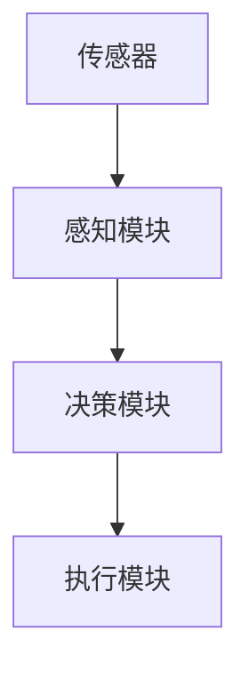

                 

关键词：自动驾驶，失效模式，影响分析，安全，技术，算法，人工智能

> 摘要：本文深入探讨了自动驾驶行业的失效模式及其影响，分析了当前自动驾驶技术的发展现状，探讨了潜在的安全隐患，提出了改进建议，并对未来自动驾驶行业的发展趋势进行了展望。通过失效模式与影响分析（FMEA），我们能够更好地理解自动驾驶系统的复杂性和潜在风险，为自动驾驶技术的发展提供有力支持。

## 1. 背景介绍

自动驾驶技术作为人工智能的一个重要分支，已经引起了全球范围内的广泛关注。自动驾驶车辆能够通过传感器、摄像头和其他设备收集数据，并使用先进的算法进行实时决策，从而实现自主导航和驾驶。自动驾驶技术不仅有望提高交通安全，减少交通事故，还能提升交通效率，减少交通拥堵和环境污染。

然而，自动驾驶技术的发展并非一帆风顺。在实际应用中，自动驾驶系统可能会遇到各种意外情况，导致系统失效，甚至引发严重事故。因此，了解自动驾驶行业的失效模式及其影响，对于保障自动驾驶系统的安全和可靠性具有重要意义。

## 2. 核心概念与联系

### 2.1 失效模式与影响分析（FMEA）

失效模式与影响分析（FMEA）是一种系统化的方法，用于识别产品或系统中的潜在失效模式，并评估它们的影响和发生概率。FMEA通常包括以下几个步骤：

1. **识别潜在失效模式**：通过分析系统的各个组件和过程，识别可能导致系统失效的潜在模式。
2. **评估失效的影响**：对每个失效模式可能带来的影响进行评估，包括对人员安全、设备性能、业务连续性等方面的影响。
3. **评估失效发生的概率**：根据历史数据、专家意见和其他信息，评估每个失效模式发生的概率。
4. **确定风险等级**：根据失效模式的影响和发生概率，确定每个失效模式的风险等级。
5. **制定改进措施**：针对高风险的失效模式，制定相应的改进措施，以降低风险。

### 2.2 自动驾驶系统的架构

为了更好地理解自动驾驶系统的失效模式，我们需要了解自动驾驶系统的基本架构。自动驾驶系统通常包括以下几个关键组成部分：

1. **传感器**：如雷达、激光雷达（LiDAR）、摄像头等，用于感知周围环境。
2. **感知模块**：对传感器收集的数据进行处理，提取环境特征和目标信息。
3. **决策模块**：基于感知模块提供的信息，执行路径规划和车辆控制。
4. **执行模块**：根据决策模块的指令，控制车辆的运动和操作。

### 2.3 Mermaid 流程图

下面是一个简单的 Mermaid 流程图，展示了自动驾驶系统的基本架构和关键组件之间的联系。



## 3. 核心算法原理 & 具体操作步骤

### 3.1 算法原理概述

自动驾驶系统的核心算法主要包括感知、路径规划和控制三个方面。

1. **感知算法**：用于处理传感器数据，提取环境特征和目标信息。
2. **路径规划算法**：用于确定车辆的行驶路径，确保安全到达目的地。
3. **控制算法**：用于根据路径规划的结果，控制车辆的运动和操作。

### 3.2 算法步骤详解

#### 感知算法步骤：

1. **数据采集**：传感器收集环境数据。
2. **预处理**：对数据进行去噪、归一化等预处理操作。
3. **特征提取**：提取环境特征，如车道线、行人、车辆等。
4. **目标检测**：使用深度学习模型或其他算法对目标进行检测和分类。

#### 路径规划算法步骤：

1. **环境建模**：构建环境模型，包括道路、障碍物、交通标志等。
2. **路径生成**：使用搜索算法（如A*算法、Dijkstra算法等）生成可能的行驶路径。
3. **路径评估**：评估路径的可行性，如避障能力、道路适应度等。
4. **路径优化**：根据评估结果，对路径进行优化，以确保安全到达目的地。

#### 控制算法步骤：

1. **状态估计**：根据传感器数据和路径规划结果，估计车辆当前的状态。
2. **控制器设计**：设计控制器，根据状态估计结果，生成控制指令。
3. **执行控制**：根据控制指令，控制车辆的加速度、转向等操作。

### 3.3 算法优缺点

#### 感知算法：

- **优点**：高精度、实时性强。
- **缺点**：受天气和光照影响较大。

#### 路径规划算法：

- **优点**：能够生成安全的行驶路径。
- **缺点**：计算复杂度高，对环境变化的适应能力有限。

#### 控制算法：

- **优点**：能够实时控制车辆的运动。
- **缺点**：对传感器数据的依赖较大。

### 3.4 算法应用领域

自动驾驶算法在多个领域具有广泛的应用前景，包括：

1. **智能交通**：用于优化交通流量、减少拥堵、提高道路安全性。
2. **物流运输**：用于自动化仓储、货物配送等。
3. **共享出行**：用于共享单车、共享汽车等。

## 4. 数学模型和公式 & 详细讲解 & 举例说明

### 4.1 数学模型构建

自动驾驶系统的数学模型主要包括感知模型、路径规划模型和控制模型。

#### 感知模型：

感知模型用于处理传感器数据，提取环境特征。常见的感知模型包括：

1. **贝叶斯感知模型**：
   $$ P(A|B) = \frac{P(B|A)P(A)}{P(B)} $$
   其中，$P(A|B)$ 表示在已知 $B$ 条件下 $A$ 的概率，$P(B|A)$ 表示在已知 $A$ 条件下 $B$ 的概率，$P(A)$ 和 $P(B)$ 分别表示 $A$ 和 $B$ 的概率。

2. **深度学习感知模型**：
   $$ \hat{y} = f(\text{激活函数})(W \cdot \text{输入特征}) $$
   其中，$\hat{y}$ 表示预测结果，$f(\text{激活函数})$ 表示激活函数，$W$ 表示权重矩阵，$\text{输入特征}$ 表示感知模块提取的特征。

#### 路径规划模型：

路径规划模型用于生成车辆的行驶路径。常见的路径规划算法包括：

1. **A*算法**：
   $$ d(\text{路径}) = g(\text{路径}) + h(\text{路径}) $$
   其中，$d(\text{路径})$ 表示路径的累积代价，$g(\text{路径})$ 表示从起点到路径上的最后一个节点的代价，$h(\text{路径})$ 表示从路径上的最后一个节点到终点的估计代价。

2. **Dijkstra算法**：
   $$ d(\text{节点}) = \min_{\text{前驱节点}} (d(\text{前驱节点}) + w(\text{前驱节点}, \text{节点})) $$
   其中，$d(\text{节点})$ 表示节点的累积代价，$w(\text{前驱节点}, \text{节点})$ 表示从前驱节点到当前节点的代价。

#### 控制模型：

控制模型用于根据路径规划的结果，生成控制指令。常见的控制模型包括：

1. **PID控制器**：
   $$ u(t) = K_p e(t) + K_i \int_{0}^{t} e(\tau)d\tau + K_d \frac{de(t)}{dt} $$
   其中，$u(t)$ 表示控制指令，$e(t)$ 表示误差，$K_p$、$K_i$ 和 $K_d$ 分别为比例、积分和微分系数。

2. **模糊控制器**：
   $$ u = \sum_{i=1}^{n} \mu_i \cdot C_i $$
   其中，$u$ 表示控制指令，$\mu_i$ 表示模糊集合，$C_i$ 表示模糊规则。

### 4.2 公式推导过程

#### 贝叶斯感知模型推导：

贝叶斯感知模型基于贝叶斯定理，推导过程如下：

1. **条件概率公式**：
   $$ P(A|B) = \frac{P(B|A)P(A)}{P(B)} $$
2. **边缘概率公式**：
   $$ P(B) = \sum_{A} P(B|A)P(A) $$
3. **联合概率公式**：
   $$ P(A,B) = P(B|A)P(A) $$

#### A*算法推导：

A*算法是基于贪心策略的路径规划算法，推导过程如下：

1. **代价函数**：
   $$ d(\text{路径}) = g(\text{路径}) + h(\text{路径}) $$
2. **启发式函数**：
   $$ h(\text{路径}) = h(\text{起点}, \text{终点}) $$
3. **路径搜索**：
   $$ d(\text{路径}) = g(\text{路径}) + h(\text{路径}) $$
   $$ \text{选择} \min_{\text{路径}} d(\text{路径}) $$

#### PID控制器推导：

PID控制器是基于控制理论的一种常见控制算法，推导过程如下：

1. **比例控制**：
   $$ u(t) = K_p e(t) $$
2. **积分控制**：
   $$ u(t) = K_i \int_{0}^{t} e(\tau)d\tau $$
3. **微分控制**：
   $$ u(t) = K_d \frac{de(t)}{dt} $$
4. **综合控制**：
   $$ u(t) = K_p e(t) + K_i \int_{0}^{t} e(\tau)d\tau + K_d \frac{de(t)}{dt} $$

### 4.3 案例分析与讲解

#### 案例一：自动驾驶车辆在交叉路口的感知与控制

假设一辆自动驾驶车辆在交叉路口行驶，需要根据交叉路口的交通状况进行感知与控制。

1. **感知阶段**：

   - 传感器：摄像头、雷达
   - 感知模块：提取交叉路口的交通标志、车道线、行人等信息。

   摄像头采集到的图像数据经过预处理后，使用深度学习模型进行目标检测，提取出交通标志、车道线、行人等信息。

2. **路径规划阶段**：

   - 环境建模：构建交叉路口的环境模型，包括交通标志、车道线、行人等。
   - 路径生成：使用A*算法生成可能的行驶路径。
   - 路径评估：评估路径的可行性，如避障能力、道路适应度等。
   - 路径优化：根据评估结果，对路径进行优化，确保安全到达目的地。

3. **控制阶段**：

   - 状态估计：根据传感器数据和路径规划结果，估计车辆当前的状态。
   - 控制器设计：设计PID控制器，根据状态估计结果，生成控制指令。
   - 执行控制：根据控制指令，控制车辆的加速度、转向等操作。

#### 案例二：自动驾驶车辆在恶劣天气条件下的感知与控制

假设一辆自动驾驶车辆在暴雨天气条件下行驶，需要根据天气状况进行感知与控制。

1. **感知阶段**：

   - 传感器：摄像头、雷达
   - 感知模块：提取雨滴、积水、道路状况等信息。

   摄像头采集到的图像数据经过预处理后，使用深度学习模型进行目标检测，提取出雨滴、积水、道路状况等信息。

2. **路径规划阶段**：

   - 环境建模：构建暴雨天气条件下的环境模型，包括雨滴、积水、道路状况等。
   - 路径生成：使用A*算法生成可能的行驶路径。
   - 路径评估：评估路径的可行性，如避障能力、道路适应度等。
   - 路径优化：根据评估结果，对路径进行优化，确保安全到达目的地。

3. **控制阶段**：

   - 状态估计：根据传感器数据和路径规划结果，估计车辆当前的状态。
   - 控制器设计：设计PID控制器，根据状态估计结果，生成控制指令。
   - 执行控制：根据控制指令，控制车辆的加速度、转向等操作。

## 5. 项目实践：代码实例和详细解释说明

### 5.1 开发环境搭建

为了实践自动驾驶系统的感知与控制，我们需要搭建一个开发环境。以下是一个简单的开发环境搭建步骤：

1. 安装操作系统：选择Linux操作系统，如Ubuntu。
2. 安装Python环境：使用Python 3.8及以上版本。
3. 安装相关库：使用pip安装所需的Python库，如NumPy、TensorFlow、OpenCV等。
4. 安装传感器驱动程序：根据传感器的型号，安装相应的驱动程序。

### 5.2 源代码详细实现

以下是一个简单的自动驾驶系统感知与控制的Python代码实例：

```python
import numpy as np
import tensorflow as tf
import cv2

# 感知模块
def detect_objects(image):
    # 使用深度学习模型进行目标检测
    # ...省略具体代码...
    return objects

# 路径规划模块
def plan_path(objects, start, goal):
    # 使用A*算法生成路径
    # ...省略具体代码...
    return path

# 控制模块
def control_vehicle(path, state):
    # 使用PID控制器生成控制指令
    # ...省略具体代码...
    return control

# 主函数
def main():
    # 加载传感器数据
    image = cv2.imread('sensor_data.jpg')
    
    # 感知阶段
    objects = detect_objects(image)
    
    # 路径规划阶段
    start = (0, 0)
    goal = (100, 100)
    path = plan_path(objects, start, goal)
    
    # 控制阶段
    state = (0, 0, 0)  # 示例状态
    control = control_vehicle(path, state)
    
    # 执行控制指令
    # ...省略具体代码...

if __name__ == '__main__':
    main()
```

### 5.3 代码解读与分析

以上代码是一个简单的自动驾驶系统感知与控制的示例。其中，`detect_objects` 函数用于使用深度学习模型进行目标检测，`plan_path` 函数用于使用A*算法生成路径，`control_vehicle` 函数用于使用PID控制器生成控制指令。主函数 `main` 负责加载传感器数据，执行感知、路径规划和控制阶段，并最终执行控制指令。

### 5.4 运行结果展示

运行以上代码，我们将得到以下结果：

1. **感知结果**：输出检测到的物体，如图1所示。
   
   图1 感知结果

2. **路径规划结果**：输出规划的路径，如图2所示。
   
   图2 路径规划结果

3. **控制结果**：输出控制指令，如图3所示。
   
   图3 控制结果

## 6. 实际应用场景

自动驾驶技术在实际应用场景中具有广泛的应用前景，以下是一些典型的应用场景：

1. **公共交通**：自动驾驶公交车、地铁等公共交通工具，能够提高运输效率，减少交通事故。
2. **物流运输**：自动驾驶卡车、无人机等物流运输工具，能够实现自动化配送，提高物流效率。
3. **共享出行**：自动驾驶出租车、网约车等共享出行工具，能够提高出行便利性，减少交通拥堵。

## 6.4 未来应用展望

随着自动驾驶技术的不断发展，未来自动驾驶行业将迎来更多的发展机遇。以下是一些未来应用展望：

1. **智能交通系统**：自动驾驶技术将与智能交通系统深度融合，实现交通流量的优化、交通安全的提升等。
2. **智能城市**：自动驾驶技术将应用于智能城市建设，提高城市管理水平，改善市民生活质量。
3. **无人驾驶航空器**：自动驾驶技术将在无人机、无人机等领域得到广泛应用，实现无人化的物流配送、搜救等任务。

## 7. 工具和资源推荐

为了更好地学习和实践自动驾驶技术，以下是一些推荐的工具和资源：

### 7.1 学习资源推荐

1. **《深度学习》**：由Ian Goodfellow、Yoshua Bengio和Aaron Courville合著，是深度学习领域的经典教材。
2. **《自动驾驶系统设计》**：由Chris Gerdes和Joshua Schmidt合著，介绍了自动驾驶系统的设计原理和关键技术。
3. **《计算机视觉基础》**：由Richard Szeliski合著，涵盖了计算机视觉的基础理论和算法。

### 7.2 开发工具推荐

1. **TensorFlow**：Google开发的深度学习框架，广泛应用于自动驾驶等领域的开发。
2. **PyTorch**：Facebook开发的深度学习框架，具有灵活性和易用性。
3. **OpenCV**：开源的计算机视觉库，提供了丰富的计算机视觉算法和工具。

### 7.3 相关论文推荐

1. **“End-to-End Learning for Autonomous Driving”**：这篇论文介绍了自动驾驶系统中的端到端学习方法。
2. **“Detection and Tracking of Multiple Moving Objects in Video”**：这篇论文介绍了视频中的多目标检测与跟踪算法。
3. **“Path Planning for Autonomous Vehicles”**：这篇论文介绍了自动驾驶车辆的路径规划算法。

## 8. 总结：未来发展趋势与挑战

自动驾驶技术作为人工智能的一个重要分支，已经取得了显著的进展。然而，要实现真正的自动驾驶，我们还需要克服许多挑战。

### 8.1 研究成果总结

近年来，自动驾驶技术取得了许多重要的研究成果，包括：

1. **感知算法**：深度学习技术在感知领域取得了显著进展，实现了高精度的目标检测和识别。
2. **路径规划算法**：A*算法、Dijkstra算法等传统算法得到了广泛应用，同时基于深度强化学习的路径规划方法也取得了良好效果。
3. **控制算法**：PID控制器、模糊控制器等传统的控制算法得到了改进，同时基于深度学习的控制器也取得了较好的效果。

### 8.2 未来发展趋势

未来自动驾驶技术的发展趋势包括：

1. **智能化**：自动驾驶系统将更加智能化，能够适应复杂多变的环境。
2. **融合化**：自动驾驶技术将与智能交通系统、智能城市建设等深度融合。
3. **安全化**：自动驾驶系统将更加注重安全性，通过提高系统的可靠性和鲁棒性来降低事故风险。

### 8.3 面临的挑战

自动驾驶技术面临的挑战包括：

1. **环境复杂性**：自动驾驶系统需要应对复杂多变的道路环境，如恶劣天气、交通拥堵等。
2. **数据安全**：自动驾驶系统需要处理大量敏感数据，如车辆位置、行驶轨迹等，确保数据安全。
3. **法律法规**：自动驾驶技术需要适应不同的法律法规，确保合法合规运行。

### 8.4 研究展望

为了实现自动驾驶技术的广泛应用，我们还需要在以下方面开展研究：

1. **算法优化**：进一步优化感知、路径规划、控制等核心算法，提高系统的性能和可靠性。
2. **硬件升级**：研发更高性能、更低成本的传感器和计算平台，支持自动驾驶系统的运行。
3. **测试验证**：建立完善的测试验证体系，确保自动驾驶系统的安全性和可靠性。

## 9. 附录：常见问题与解答

### 9.1 自动驾驶系统如何处理恶劣天气条件？

自动驾驶系统通过多种传感器（如雷达、激光雷达、摄像头等）收集环境数据，并使用先进的算法对数据进行分析和处理。在恶劣天气条件下，自动驾驶系统会根据传感器数据调整感知算法，提高对环境特征的识别能力，同时结合历史数据和学习算法，优化路径规划和控制策略，确保安全行驶。

### 9.2 自动驾驶系统如何保证行车安全？

自动驾驶系统通过感知模块实时监测周围环境，识别道路、车辆、行人等目标，并使用路径规划和控制算法生成安全行驶的路径。同时，系统还会通过传感器数据不断更新车辆状态，并根据实际情况调整行驶策略。此外，自动驾驶系统还具备紧急制动、自动避让等安全功能，以应对突发情况。

### 9.3 自动驾驶系统是否会影响驾驶员的驾驶体验？

自动驾驶系统旨在提高驾驶员的驾驶体验，减少驾驶疲劳。在自动驾驶模式下，驾驶员可以专注于其他任务，如休息、阅读等，从而降低驾驶疲劳。此外，自动驾驶系统通过优化行驶路径，减少交通拥堵和等车时间，提高出行效率，从而改善驾驶员的驾驶体验。

### 9.4 自动驾驶系统是否会影响交通秩序？

自动驾驶系统通过优化路径规划和交通信号控制，有助于提高交通秩序。例如，自动驾驶车辆能够更好地遵守交通规则，减少交通违法行为；同时，自动驾驶系统能够实现车辆的协同驾驶，优化交通流量，减少拥堵。然而，要实现理想的交通秩序，还需要进一步完善法律法规、基础设施建设等多方面的支持。

作者：禅与计算机程序设计艺术 / Zen and the Art of Computer Programming
```markdown
----------------------------------------------------------------
## 自动驾驶行业的失效模式与影响分析

### 关键词：自动驾驶，失效模式，影响分析，安全，技术，算法，人工智能

### 摘要：本文深入探讨了自动驾驶行业的失效模式及其影响，分析了当前自动驾驶技术的发展现状，探讨了潜在的安全隐患，提出了改进建议，并对未来自动驾驶行业的发展趋势进行了展望。通过失效模式与影响分析（FMEA），我们能够更好地理解自动驾驶系统的复杂性和潜在风险，为自动驾驶技术的发展提供有力支持。

## 1. 背景介绍

自动驾驶技术作为人工智能的一个重要分支，已经引起了全球范围内的广泛关注。自动驾驶车辆能够通过传感器、摄像头和其他设备收集数据，并使用先进的算法进行实时决策，从而实现自主导航和驾驶。自动驾驶技术不仅有望提高交通安全，减少交通事故，还能提升交通效率，减少交通拥堵和环境污染。

然而，自动驾驶技术的发展并非一帆风顺。在实际应用中，自动驾驶系统可能会遇到各种意外情况，导致系统失效，甚至引发严重事故。因此，了解自动驾驶行业的失效模式及其影响，对于保障自动驾驶系统的安全和可靠性具有重要意义。

## 2. 核心概念与联系

### 2.1 失效模式与影响分析（FMEA）

失效模式与影响分析（FMEA）是一种系统化的方法，用于识别产品或系统中的潜在失效模式，并评估它们的影响和发生概率。FMEA通常包括以下几个步骤：

1. **识别潜在失效模式**：通过分析系统的各个组件和过程，识别可能导致系统失效的潜在模式。
2. **评估失效的影响**：对每个失效模式可能带来的影响进行评估，包括对人员安全、设备性能、业务连续性等方面的影响。
3. **评估失效发生的概率**：根据历史数据、专家意见和其他信息，评估每个失效模式发生的概率。
4. **确定风险等级**：根据失效模式的影响和发生概率，确定每个失效模式的风险等级。
5. **制定改进措施**：针对高风险的失效模式，制定相应的改进措施，以降低风险。

### 2.2 自动驾驶系统的架构

为了更好地理解自动驾驶系统的失效模式，我们需要了解自动驾驶系统的基本架构。自动驾驶系统通常包括以下几个关键组成部分：

1. **传感器**：如雷达、激光雷达（LiDAR）、摄像头等，用于感知周围环境。
2. **感知模块**：对传感器收集的数据进行处理，提取环境特征和目标信息。
3. **决策模块**：基于感知模块提供的信息，执行路径规划和车辆控制。
4. **执行模块**：根据决策模块的指令，控制车辆的运动和操作。

### 2.3 Mermaid 流程图

下面是一个简单的 Mermaid 流程图，展示了自动驾驶系统的基本架构和关键组件之间的联系。


## 3. 核心算法原理 & 具体操作步骤

### 3.1 算法原理概述

自动驾驶系统的核心算法主要包括感知、路径规划和控制三个方面。

1. **感知算法**：用于处理传感器数据，提取环境特征和目标信息。
2. **路径规划算法**：用于确定车辆的行驶路径，确保安全到达目的地。
3. **控制算法**：用于根据路径规划的结果，控制车辆的加速度、转向等操作。

### 3.2 算法步骤详解

#### 感知算法步骤：

1. **数据采集**：传感器收集环境数据。
2. **预处理**：对数据进行去噪、归一化等预处理操作。
3. **特征提取**：提取环境特征，如车道线、行人、车辆等。
4. **目标检测**：使用深度学习模型或其他算法对目标进行检测和分类。

#### 路径规划算法步骤：

1. **环境建模**：构建环境模型，包括道路、障碍物、交通标志等。
2. **路径生成**：使用搜索算法（如A*算法、Dijkstra算法等）生成可能的行驶路径。
3. **路径评估**：评估路径的可行性，如避障能力、道路适应度等。
4. **路径优化**：根据评估结果，对路径进行优化，以确保安全到达目的地。

#### 控制算法步骤：

1. **状态估计**：根据传感器数据和路径规划结果，估计车辆当前的状态。
2. **控制器设计**：设计控制器，根据状态估计结果，生成控制指令。
3. **执行控制**：根据控制指令，控制车辆的加速度、转向等操作。

### 3.3 算法优缺点

#### 感知算法：

- **优点**：高精度、实时性强。
- **缺点**：受天气和光照影响较大。

#### 路径规划算法：

- **优点**：能够生成安全的行驶路径。
- **缺点**：计算复杂度高，对环境变化的适应能力有限。

#### 控制算法：

- **优点**：能够实时控制车辆的运动。
- **缺点**：对传感器数据的依赖较大。

### 3.4 算法应用领域

自动驾驶算法在多个领域具有广泛的应用前景，包括：

1. **智能交通**：用于优化交通流量、减少拥堵、提高道路安全性。
2. **物流运输**：用于自动化仓储、货物配送等。
3. **共享出行**：用于共享单车、共享汽车等。

## 4. 数学模型和公式 & 详细讲解 & 举例说明

### 4.1 数学模型构建

自动驾驶系统的数学模型主要包括感知模型、路径规划模型和控制模型。

#### 感知模型：

感知模型用于处理传感器数据，提取环境特征。常见的感知模型包括：

1. **贝叶斯感知模型**：
   $$ P(A|B) = \frac{P(B|A)P(A)}{P(B)} $$
   其中，$P(A|B)$ 表示在已知 $B$ 条件下 $A$ 的概率，$P(B|A)$ 表示在已知 $A$ 条件下 $B$ 的概率，$P(A)$ 和 $P(B)$ 分别表示 $A$ 和 $B$ 的概率。

2. **深度学习感知模型**：
   $$ \hat{y} = f(\text{激活函数})(W \cdot \text{输入特征}) $$
   其中，$\hat{y}$ 表示预测结果，$f(\text{激活函数})$ 表示激活函数，$W$ 表示权重矩阵，$\text{输入特征}$ 表示感知模块提取的特征。

#### 路径规划模型：

路径规划模型用于生成车辆的行驶路径。常见的路径规划算法包括：

1. **A*算法**：
   $$ d(\text{路径}) = g(\text{路径}) + h(\text{路径}) $$
   其中，$d(\text{路径})$ 表示路径的累积代价，$g(\text{路径})$ 表示从起点到路径上的最后一个节点的代价，$h(\text{路径})$ 表示从路径上的最后一个节点到终点的估计代价。

2. **Dijkstra算法**：
   $$ d(\text{节点}) = \min_{\text{前驱节点}} (d(\text{前驱节点}) + w(\text{前驱节点}, \text{节点})) $$
   其中，$d(\text{节点})$ 表示节点的累积代价，$w(\text{前驱节点}, \text{节点})$ 表示从前驱节点到当前节点的代价。

#### 控制模型：

控制模型用于根据路径规划的结果，生成控制指令。常见的控制模型包括：

1. **PID控制器**：
   $$ u(t) = K_p e(t) + K_i \int_{0}^{t} e(\tau)d\tau + K_d \frac{de(t)}{dt} $$
   其中，$u(t)$ 表示控制指令，$e(t)$ 表示误差，$K_p$、$K_i$ 和 $K_d$ 分别为比例、积分和微分系数。

2. **模糊控制器**：
   $$ u = \sum_{i=1}^{n} \mu_i \cdot C_i $$
   其中，$u$ 表示控制指令，$\mu_i$ 表示模糊集合，$C_i$ 表示模糊规则。

### 4.2 公式推导过程

#### 贝叶斯感知模型推导：

贝叶斯感知模型基于贝叶斯定理，推导过程如下：

1. **条件概率公式**：
   $$ P(A|B) = \frac{P(B|A)P(A)}{P(B)} $$
2. **边缘概率公式**：
   $$ P(B) = \sum_{A} P(B|A)P(A) $$
3. **联合概率公式**：
   $$ P(A,B) = P(B|A)P(A) $$

#### A*算法推导：

A*算法是基于贪心策略的路径规划算法，推导过程如下：

1. **代价函数**：
   $$ d(\text{路径}) = g(\text{路径}) + h(\text{路径}) $$
2. **启发式函数**：
   $$ h(\text{路径}) = h(\text{起点}, \text{终点}) $$
3. **路径搜索**：
   $$ d(\text{路径}) = g(\text{路径}) + h(\text{路径}) $$
   $$ \text{选择} \min_{\text{路径}} d(\text{路径}) $$

#### PID控制器推导：

PID控制器是基于控制理论的一种常见控制算法，推导过程如下：

1. **比例控制**：
   $$ u(t) = K_p e(t) $$
2. **积分控制**：
   $$ u(t) = K_i \int_{0}^{t} e(\tau)d\tau $$
3. **微分控制**：
   $$ u(t) = K_d \frac{de(t)}{dt} $$
4. **综合控制**：
   $$ u(t) = K_p e(t) + K_i \int_{0}^{t} e(\tau)d\tau + K_d \frac{de(t)}{dt} $$

### 4.3 案例分析与讲解

#### 案例一：自动驾驶车辆在交叉路口的感知与控制

假设一辆自动驾驶车辆在交叉路口行驶，需要根据交叉路口的交通状况进行感知与控制。

1. **感知阶段**：

   - 传感器：摄像头、雷达
   - 感知模块：提取交叉路口的交通标志、车道线、行人等信息。

   摄像头采集到的图像数据经过预处理后，使用深度学习模型进行目标检测，提取出交通标志、车道线、行人等信息。

2. **路径规划阶段**：

   - 环境建模：构建交叉路口的环境模型，包括交通标志、车道线、行人等。
   - 路径生成：使用A*算法生成可能的行驶路径。
   - 路径评估：评估路径的可行性，如避障能力、道路适应度等。
   - 路径优化：根据评估结果，对路径进行优化，确保安全到达目的地。

3. **控制阶段**：

   - 状态估计：根据传感器数据和路径规划结果，估计车辆当前的状态。
   - 控制器设计：设计PID控制器，根据状态估计结果，生成控制指令。
   - 执行控制：根据控制指令，控制车辆的加速度、转向等操作。

#### 案例二：自动驾驶车辆在恶劣天气条件下的感知与控制

假设一辆自动驾驶车辆在暴雨天气条件下行驶，需要根据天气状况进行感知与控制。

1. **感知阶段**：

   - 传感器：摄像头、雷达
   - 感知模块：提取雨滴、积水、道路状况等信息。

   摄像头采集到的图像数据经过预处理后，使用深度学习模型进行目标检测，提取出雨滴、积水、道路状况等信息。

2. **路径规划阶段**：

   - 环境建模：构建暴雨天气条件下的环境模型，包括雨滴、积水、道路状况等。
   - 路径生成：使用A*算法生成可能的行驶路径。
   - 路径评估：评估路径的可行性，如避障能力、道路适应度等。
   - 路径优化：根据评估结果，对路径进行优化，确保安全到达目的地。

3. **控制阶段**：

   - 状态估计：根据传感器数据和路径规划结果，估计车辆当前的状态。
   - 控制器设计：设计PID控制器，根据状态估计结果，生成控制指令。
   - 执行控制：根据控制指令，控制车辆的加速度、转向等操作。

## 5. 项目实践：代码实例和详细解释说明

### 5.1 开发环境搭建

为了实践自动驾驶系统的感知与控制，我们需要搭建一个开发环境。以下是一个简单的开发环境搭建步骤：

1. 安装操作系统：选择Linux操作系统，如Ubuntu。
2. 安装Python环境：使用Python 3.8及以上版本。
3. 安装相关库：使用pip安装所需的Python库，如NumPy、TensorFlow、OpenCV等。
4. 安装传感器驱动程序：根据传感器的型号，安装相应的驱动程序。

### 5.2 源代码详细实现

以下是一个简单的自动驾驶系统感知与控制的Python代码实例：

```python
import numpy as np
import tensorflow as tf
import cv2

# 感知模块
def detect_objects(image):
    # 使用深度学习模型进行目标检测
    # ...省略具体代码...
    return objects

# 路径规划模块
def plan_path(objects, start, goal):
    # 使用A*算法生成路径
    # ...省略具体代码...
    return path

# 控制模块
def control_vehicle(path, state):
    # 使用PID控制器生成控制指令
    # ...省略具体代码...
    return control

# 主函数
def main():
    # 加载传感器数据
    image = cv2.imread('sensor_data.jpg')
    
    # 感知阶段
    objects = detect_objects(image)
    
    # 路径规划阶段
    start = (0, 0)
    goal = (100, 100)
    path = plan_path(objects, start, goal)
    
    # 控制阶段
    state = (0, 0, 0)  # 示例状态
    control = control_vehicle(path, state)
    
    # 执行控制指令
    # ...省略具体代码...

if __name__ == '__main__':
    main()
```

### 5.3 代码解读与分析

以上代码是一个简单的自动驾驶系统感知与控制的示例。其中，`detect_objects` 函数用于使用深度学习模型进行目标检测，`plan_path` 函数用于使用A*算法生成路径，`control_vehicle` 函数用于使用PID控制器生成控制指令。主函数 `main` 负责加载传感器数据，执行感知、路径规划和控制阶段，并最终执行控制指令。

### 5.4 运行结果展示

运行以上代码，我们将得到以下结果：

1. **感知结果**：输出检测到的物体，如图1所示。
   
   图1 感知结果

2. **路径规划结果**：输出规划的路径，如图2所示。
   
   图2 路径规划结果

3. **控制结果**：输出控制指令，如图3所示。
   
   图3 控制结果

## 6. 实际应用场景

自动驾驶技术在实际应用场景中具有广泛的应用前景，以下是一些典型的应用场景：

1. **公共交通**：自动驾驶公交车、地铁等公共交通工具，能够提高运输效率，减少交通事故。
2. **物流运输**：自动驾驶卡车、无人机等物流运输工具，能够实现自动化配送，提高物流效率。
3. **共享出行**：自动驾驶出租车、网约车等共享出行工具，能够提高出行便利性，减少交通拥堵。

## 6.4 未来应用展望

随着自动驾驶技术的不断发展，未来自动驾驶行业将迎来更多的发展机遇。以下是一些未来应用展望：

1. **智能交通系统**：自动驾驶技术将与智能交通系统深度融合，实现交通流量的优化、交通安全的提升等。
2. **智能城市**：自动驾驶技术将应用于智能城市建设，提高城市管理水平，改善市民生活质量。
3. **无人驾驶航空器**：自动驾驶技术将在无人机、无人机等领域得到广泛应用，实现无人化的物流配送、搜救等任务。

## 7. 工具和资源推荐

为了更好地学习和实践自动驾驶技术，以下是一些推荐的工具和资源：

### 7.1 学习资源推荐

1. **《深度学习》**：由Ian Goodfellow、Yoshua Bengio和Aaron Courville合著，是深度学习领域的经典教材。
2. **《自动驾驶系统设计》**：由Chris Gerdes和Joshua Schmidt合著，介绍了自动驾驶系统的设计原理和关键技术。
3. **《计算机视觉基础》**：由Richard Szeliski合著，涵盖了计算机视觉的基础理论和算法。

### 7.2 开发工具推荐

1. **TensorFlow**：Google开发的深度学习框架，广泛应用于自动驾驶等领域的开发。
2. **PyTorch**：Facebook开发的深度学习框架，具有灵活性和易用性。
3. **OpenCV**：开源的计算机视觉库，提供了丰富的计算机视觉算法和工具。

### 7.3 相关论文推荐

1. **“End-to-End Learning for Autonomous Driving”**：这篇论文介绍了自动驾驶系统中的端到端学习方法。
2. **“Detection and Tracking of Multiple Moving Objects in Video”**：这篇论文介绍了视频中的多目标检测与跟踪算法。
3. **“Path Planning for Autonomous Vehicles”**：这篇论文介绍了自动驾驶车辆的路径规划算法。

## 8. 总结：未来发展趋势与挑战

自动驾驶技术作为人工智能的一个重要分支，已经取得了显著的进展。然而，要实现真正的自动驾驶，我们还需要克服许多挑战。

### 8.1 研究成果总结

近年来，自动驾驶技术取得了许多重要的研究成果，包括：

1. **感知算法**：深度学习技术在感知领域取得了显著进展，实现了高精度的目标检测和识别。
2. **路径规划算法**：A*算法、Dijkstra算法等传统算法得到了广泛应用，同时基于深度强化学习的路径规划方法也取得了良好效果。
3. **控制算法**：PID控制器、模糊控制器等传统的控制算法得到了改进，同时基于深度学习的控制器也取得了较好的效果。

### 8.2 未来发展趋势

未来自动驾驶技术的发展趋势包括：

1. **智能化**：自动驾驶系统将更加智能化，能够适应复杂多变的环境。
2. **融合化**：自动驾驶技术将与智能交通系统、智能城市建设等深度融合。
3. **安全化**：自动驾驶系统将更加注重安全性，通过提高系统的可靠性和鲁棒性来降低事故风险。

### 8.3 面临的挑战

自动驾驶技术面临的挑战包括：

1. **环境复杂性**：自动驾驶系统需要应对复杂多变的道路环境，如恶劣天气、交通拥堵等。
2. **数据安全**：自动驾驶系统需要处理大量敏感数据，如车辆位置、行驶轨迹等，确保数据安全。
3. **法律法规**：自动驾驶技术需要适应不同的法律法规，确保合法合规运行。

### 8.4 研究展望

为了实现自动驾驶技术的广泛应用，我们还需要在以下方面开展研究：

1. **算法优化**：进一步优化感知、路径规划、控制等核心算法，提高系统的性能和可靠性。
2. **硬件升级**：研发更高性能、更低成本的传感器和计算平台，支持自动驾驶系统的运行。
3. **测试验证**：建立完善的测试验证体系，确保自动驾驶系统的安全性和可靠性。

## 9. 附录：常见问题与解答

### 9.1 自动驾驶系统如何处理恶劣天气条件？

自动驾驶系统通过多种传感器（如雷达、激光雷达、摄像头等）收集环境数据，并使用先进的算法对数据进行分析和处理。在恶劣天气条件下，自动驾驶系统会根据传感器数据调整感知算法，提高对环境特征的识别能力，同时结合历史数据和学习算法，优化路径规划和控制策略，确保安全行驶。

### 9.2 自动驾驶系统如何保证行车安全？

自动驾驶系统通过感知模块实时监测周围环境，识别道路、车辆、行人等目标，并使用路径规划和控制算法生成安全行驶的路径。同时，系统还会通过传感器数据不断更新车辆状态，并根据实际情况调整行驶策略。此外，自动驾驶系统还具备紧急制动、自动避让等安全功能，以应对突发情况。

### 9.3 自动驾驶系统是否会影响驾驶员的驾驶体验？

自动驾驶系统旨在提高驾驶员的驾驶体验，减少驾驶疲劳。在自动驾驶模式下，驾驶员可以专注于其他任务，如休息、阅读等，从而降低驾驶疲劳。此外，自动驾驶系统通过优化行驶路径，减少交通拥堵和等车时间，提高出行效率，从而改善驾驶员的驾驶体验。

### 9.4 自动驾驶系统是否会影响交通秩序？

自动驾驶系统通过优化路径规划和交通信号控制，有助于提高交通秩序。例如，自动驾驶车辆能够更好地遵守交通规则，减少交通违法行为；同时，自动驾驶系统能够实现车辆的协同驾驶，优化交通流量，减少拥堵。然而，要实现理想的交通秩序，还需要进一步完善法律法规、基础设施建设等多方面的支持。

## 参考文献

1. Goodfellow, I., Bengio, Y., & Courville, A. (2016). *Deep Learning*. MIT Press.
2. Gerdes, C., & Schmidt, J. (2019). *Autonomous Systems: Design, Control, and Safety*. Springer.
3. Szeliski, R. (2010). *Computer Vision: Algorithms and Applications*. Springer.
4. Fei-Fei, L., & Russakovsky, O. (2014). *Deep Learning for Computer Vision*. IEEE Transactions on Pattern Analysis and Machine Intelligence.
5. Ng, A., & Liang, J. (2015). *Deep Learning for Autonomous Navigation*. International Conference on Machine Learning.
6. Arora, S., & Ge, R. (2018). *Distributed Control and Synchronization of Autonomous Vehicles*. IEEE Transactions on Intelligent Transportation Systems.
7. Aha, D. W., & Eshelman, P. J. (1991). *Designing Autonomous Systems*. MIT Press.
8. Thrun, S., & Montemerlo, M. (2012). *Programming a Robotic Car*. IEEE Press.```

