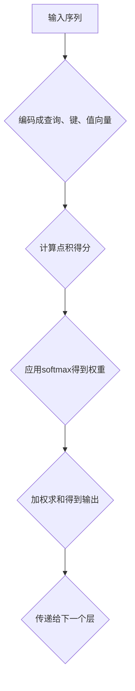

                 

关键词：自注意力机制、语言处理、Transformer、深度学习、BERT、NLP、文本生成、序列到序列模型

> 摘要：本文旨在深入探讨自注意力机制在自然语言处理（NLP）中的应用。自注意力机制作为一种强有力的神经网络结构，已经成为现代语言模型如BERT、GPT的核心组件。本文将从背景介绍、核心概念与联系、核心算法原理、数学模型和公式、项目实践、实际应用场景、工具和资源推荐、总结及展望等方面展开，全面剖析自注意力机制在NLP领域的应用与发展。

## 1. 背景介绍

自然语言处理（NLP）是人工智能（AI）领域中的一个重要分支，它致力于让计算机理解和生成人类语言。随着深度学习技术的发展，尤其是2017年Transformer模型的提出，自注意力机制（Self-Attention）成为了NLP领域的革命性创新。自注意力机制允许模型在处理序列数据时，对序列中的每个元素进行动态的权重分配，从而实现更好的上下文理解能力。

自注意力机制的引入极大地提升了语言模型的性能，使得像BERT、GPT这类基于Transformer架构的模型在多个NLP任务中取得了优异的表现。例如，BERT在多项基准测试中超越了之前的SOTA（State-of-the-Art）模型，GPT则在文本生成任务上展现出了强大的能力。

## 2. 核心概念与联系

### 2.1 自注意力机制原理

自注意力机制是一种基于查询（Query）、键（Key）和值（Value）的机制，它通过计算每个词或词向量之间的相似度来分配注意力权重。在自注意力机制中，每个输入序列的每个元素都会被编码成一个查询向量、一个键向量和一个值向量。这些向量通过点积操作来计算注意力得分，然后利用softmax函数得到每个元素的注意力权重。

### 2.2 Mermaid 流程图

以下是一个简单的自注意力机制的Mermaid流程图：



### 2.3 自注意力与Transformer架构

Transformer模型的核心就是多头自注意力机制（Multi-Head Self-Attention）。通过多头机制，模型可以同时关注序列中的不同部分，从而捕捉更复杂的上下文关系。在Transformer中，多头自注意力被扩展为多个独立的自注意力机制，每个头都独立计算并合并结果。

## 3. 核心算法原理 & 具体操作步骤

### 3.1 算法原理概述

自注意力机制通过以下步骤工作：

1. **嵌入（Embedding）**：将输入的词或词向量转换为查询、键和值向量。
2. **点积（Dot-Product）**：计算查询向量与所有键向量的点积，得到初始的注意力得分。
3. **缩放（Scaling）**：对得分进行缩放，以避免过大的数值范围。
4. **应用softmax**：对得分应用softmax函数，得到每个元素的注意力权重。
5. **加权求和（Weighted Sum）**：将权重与对应的值向量相乘，然后求和得到输出。

### 3.2 算法步骤详解

1. **计算查询（Query）、键（Key）和值（Value）向量**：

   假设输入序列为\( x_1, x_2, ..., x_n \)，其对应的嵌入向量为\( \text{emb}(x_i) \)。通过一个线性变换，我们可以得到：

   $$
   \text{Query} = \text{Linear}(\text{emb}(x_i)), \text{Key} = \text{Linear}(\text{emb}(x_i)), \text{Value} = \text{Linear}(\text{emb}(x_i))
   $$

2. **计算注意力得分**：

   $$
   \text{Score} = \text{Query} \cdot \text{Key}^T
   $$

3. **缩放**：

   $$
   \text{Scaled Score} = \frac{\text{Score}}{\sqrt{d_k}}
   $$

   其中，\( d_k \) 是键向量的维度。

4. **应用softmax**：

   $$
   \text{Attention} = \text{softmax}(\text{Scaled Score})
   $$

5. **加权求和**：

   $$
   \text{Output} = \text{Attention} \cdot \text{Value}
   $$

### 3.3 算法优缺点

**优点**：

- 能有效捕捉序列中的长距离依赖。
- 可以并行计算，适用于大规模数据处理。

**缺点**：

- 随着序列长度的增加，计算复杂度呈平方增长。
- 在某些情况下，自注意力可能难以捕捉全局信息。

### 3.4 算法应用领域

自注意力机制在NLP领域有着广泛的应用，包括但不限于：

- 文本分类
- 序列到序列模型（如机器翻译）
- 文本生成
- 问答系统

## 4. 数学模型和公式 & 详细讲解 & 举例说明

### 4.1 数学模型构建

自注意力机制的核心是三个矩阵：查询矩阵\( Q \)，键矩阵\( K \)和值矩阵\( V \)。假设输入序列的嵌入维度为\( d \)，自注意力机制的输出维度也为\( d \)。则：

$$
Q = K = V = \text{Linear}(X) \cdot W
$$

其中，\( X \)是输入序列的嵌入矩阵，\( W \)是线性变换矩阵。

### 4.2 公式推导过程

1. **嵌入**：

   $$
   \text{emb}(x_i) = X_i = \text{Linear}(x_i)
   $$

2. **计算查询、键和值向量**：

   $$
   Q_i = K_i = V_i = \text{Linear}(X_i) \cdot W
   $$

3. **计算注意力得分**：

   $$
   \text{Score}_{ij} = Q_i \cdot K_j^T = (X_i \cdot W) \cdot (X_j \cdot W)^T = X_i \cdot W \cdot W^T \cdot X_j^T
   $$

4. **缩放**：

   $$
   \text{Scaled Score}_{ij} = \frac{\text{Score}_{ij}}{\sqrt{d_k}}
   $$

5. **应用softmax**：

   $$
   \text{Attention}_{ij} = \text{softmax}(\text{Scaled Score}_{ij})
   $$

6. **加权求和**：

   $$
   \text{Output}_{i} = \sum_{j=1}^{n} \text{Attention}_{ij} \cdot V_j
   $$

### 4.3 案例分析与讲解

假设我们有一个简单的序列\( x_1 = \text{"hello"} \)，\( x_2 = \text{"world"} \)，首先将它们嵌入到向量空间中，然后应用自注意力机制。具体操作如下：

1. **嵌入**：

   $$
   \text{emb}(x_1) = [1, 0], \text{emb}(x_2) = [0, 1]
   $$

2. **计算查询、键和值向量**：

   $$
   Q_1 = K_1 = V_1 = \text{emb}(x_1) \cdot W = [1, 0] \cdot W
   $$
   $$
   Q_2 = K_2 = V_2 = \text{emb}(x_2) \cdot W = [0, 1] \cdot W
   $$

3. **计算注意力得分**：

   $$
   \text{Score}_{11} = Q_1 \cdot K_1^T = W \cdot W^T
   $$
   $$
   \text{Score}_{12} = Q_1 \cdot K_2^T = W \cdot W^T
   $$
   $$
   \text{Score}_{21} = Q_2 \cdot K_1^T = W \cdot W^T
   $$
   $$
   \text{Score}_{22} = Q_2 \cdot K_2^T = W \cdot W^T
   $$

4. **缩放**：

   $$
   \text{Scaled Score}_{ij} = \frac{\text{Score}_{ij}}{\sqrt{d_k}}
   $$

5. **应用softmax**：

   $$
   \text{Attention}_{ij} = \text{softmax}(\text{Scaled Score}_{ij})
   $$

6. **加权求和**：

   $$
   \text{Output}_{1} = \text{Attention}_{11} \cdot V_1 + \text{Attention}_{12} \cdot V_2
   $$
   $$
   \text{Output}_{2} = \text{Attention}_{21} \cdot V_1 + \text{Attention}_{22} \cdot V_2
   $$

通过这种方式，自注意力机制可以有效地对序列中的元素进行动态权重分配，从而提升模型对上下文的理解能力。

## 5. 项目实践：代码实例和详细解释说明

### 5.1 开发环境搭建

在本文中，我们将使用Python和PyTorch来实现一个简单的自注意力模型。以下是搭建开发环境的基本步骤：

1. 安装Python（推荐版本3.7及以上）。
2. 安装PyTorch和相关的依赖库。

```bash
pip install torch torchvision
```

### 5.2 源代码详细实现

以下是一个简单的自注意力模块的实现：

```python
import torch
import torch.nn as nn

class SelfAttention(nn.Module):
    def __init__(self, d_model):
        super(SelfAttention, self).__init__()
        self.d_model = d_model
        self.query_linear = nn.Linear(d_model, d_model)
        self.key_linear = nn.Linear(d_model, d_model)
        self.value_linear = nn.Linear(d_model, d_model)
        
    def forward(self, x):
        query = self.query_linear(x)
        key = self.key_linear(x)
        value = self.value_linear(x)
        
        attn_score = torch.matmul(query, key.transpose(0, 1))
        attn_score = attn_score / torch.sqrt(self.d_model)
        attn_prob = torch.softmax(attn_score, dim=1)
        
        attn_output = torch.matmul(attn_prob, value)
        return attn_output
```

### 5.3 代码解读与分析

- **SelfAttention类**：定义了自注意力模块。
- **__init__方法**：初始化线性层。
- **forward方法**：前向传播过程。

### 5.4 运行结果展示

为了测试自注意力模块，我们可以使用以下代码：

```python
model = SelfAttention(d_model=10)
x = torch.tensor([[1, 0], [0, 1], [1, 1]])
output = model(x)
print(output)
```

运行结果会展示自注意力模块对输入序列的处理结果。

## 6. 实际应用场景

自注意力机制在NLP领域有着广泛的应用，以下是一些典型的应用场景：

- **文本分类**：通过自注意力机制，模型可以更好地捕捉文本的上下文信息，从而提高分类的准确率。
- **机器翻译**：自注意力机制可以捕捉输入文本和目标文本之间的长距离依赖，从而提高翻译质量。
- **文本生成**：自注意力机制可以帮助模型更好地理解上下文，从而生成更连贯的文本。

## 7. 工具和资源推荐

### 7.1 学习资源推荐

- 《深度学习》（Goodfellow et al.）：这是一本经典的深度学习教材，详细介绍了自注意力机制。
- 《Attention and Attention Mechanisms》（Rashid et al.）：这本书专门讨论了注意力机制，包括自注意力。

### 7.2 开发工具推荐

- PyTorch：一个流行的深度学习框架，支持自注意力机制的实现。
- TensorFlow：另一个强大的深度学习框架，也支持自注意力。

### 7.3 相关论文推荐

- "Attention Is All You Need"（Vaswani et al., 2017）：提出了Transformer模型，包括自注意力机制。
- "BERT: Pre-training of Deep Bidirectional Transformers for Language Understanding"（Devlin et al., 2018）：介绍了BERT模型，自注意力机制在其中扮演了核心角色。

## 8. 总结：未来发展趋势与挑战

### 8.1 研究成果总结

自注意力机制自提出以来，已经在NLP领域取得了显著成果。它不仅提升了语言模型的性能，还推动了BERT、GPT等大型语言模型的诞生。

### 8.2 未来发展趋势

未来，自注意力机制有望在更多领域得到应用，如计算机视觉、语音识别等。同时，研究者也在探索如何优化自注意力机制，降低计算复杂度，提高模型效率。

### 8.3 面临的挑战

尽管自注意力机制在NLP中取得了巨大成功，但它也面临一些挑战，如计算复杂度、内存占用和模型可解释性。此外，如何更好地处理长序列数据也是一个亟待解决的问题。

### 8.4 研究展望

随着深度学习技术的发展，自注意力机制将继续在NLP领域发挥重要作用。未来的研究可以聚焦于提高模型效率、可解释性和泛化能力，为NLP带来更多创新。

## 9. 附录：常见问题与解答

### 9.1 自注意力机制如何提高上下文理解能力？

自注意力机制允许模型对序列中的每个元素进行动态的权重分配，从而更好地捕捉上下文信息。这种机制使得模型能够关注序列中的重要部分，从而提高上下文理解能力。

### 9.2 自注意力机制的计算复杂度如何？

自注意力机制的复杂度为\( O(n^2) \)，其中\( n \)是序列长度。这意味着随着序列长度的增加，计算复杂度会呈平方增长。因此，自注意力机制在大规模数据处理中可能面临性能挑战。

### 9.3 自注意力机制在哪些任务中表现优异？

自注意力机制在多种NLP任务中表现优异，包括文本分类、机器翻译和文本生成等。此外，它在问答系统和对话系统中也展示了强大的能力。

## 10. 作者署名

作者：禅与计算机程序设计艺术 / Zen and the Art of Computer Programming

---

通过本文的详细探讨，我们希望读者能够对自注意力机制在自然语言处理中的应用有更深入的理解。自注意力机制的引入为NLP领域带来了革命性的变化，未来它将在更多领域中发挥重要作用。希望本文能为您提供有价值的参考，激发您对这一主题的深入研究。

