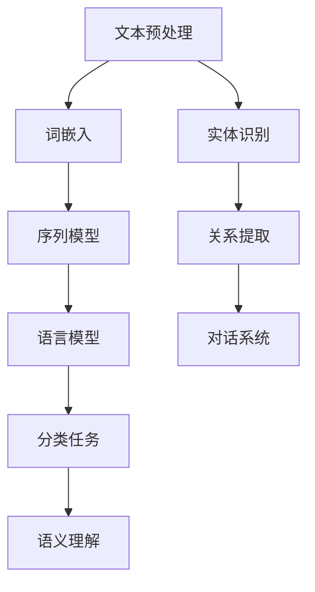

                 

关键词：自然语言处理（NLP）、文本分析、语义理解、机器学习、深度学习、Python编程、神经网络

摘要：本文将深入探讨自然语言处理（NLP）的原理、核心算法以及其实际应用。通过代码实例，我们将演示如何使用Python和相关库来构建和实现NLP的应用程序。读者将了解从文本预处理到模型训练和评估的整个流程，并对NLP技术的未来发展方向和面临的挑战有更清晰的认识。

## 1. 背景介绍

自然语言处理（NLP）是人工智能（AI）的一个重要分支，旨在使计算机能够理解、解释和生成人类语言。随着互联网和社交媒体的迅速发展，人类产生的文本数据呈爆炸式增长，这为NLP技术的应用提供了广阔的空间。NLP不仅有助于提高信息检索的准确性，还支持语音助手、机器翻译、情感分析等众多实际应用。

### 1.1 NLP的发展历程

NLP的历史可以追溯到20世纪50年代。早期的NLP研究主要集中在规则驱动的系统中，这些系统依赖于人工编写的语法规则和词典。然而，随着计算能力和算法的进步，NLP逐渐转向机器学习，特别是深度学习的方法。近年来，深度学习模型如循环神经网络（RNN）和变换器（Transformer）在NLP任务中取得了显著的成果。

### 1.2 NLP的重要性

NLP的重要性体现在以下几个方面：

- **信息检索**：通过NLP技术，计算机可以更准确地理解用户查询，并提供相关的信息。
- **语音识别**：语音助手（如苹果的Siri、谷歌助手）依赖于NLP来理解用户的语音指令。
- **机器翻译**：随着全球化的发展，自动翻译系统对于跨文化交流至关重要。
- **情感分析**：了解用户的情绪和态度对于市场营销、客户服务等领域具有重要意义。
- **文本生成**：自动生成新闻文章、摘要和对话系统，提高了内容的创建效率。

## 2. 核心概念与联系

为了深入理解NLP，我们需要掌握一些核心概念和它们之间的关系。以下是一个简化的Mermaid流程图，展示了NLP中的一些关键步骤和概念。



### 2.1 文本预处理

文本预处理是NLP中不可或缺的一步。它包括以下几个子步骤：

- **分词（Tokenization）**：将文本分割成单词、句子等基本的语言单元。
- **停用词过滤（Stopword Removal）**：去除对文本分析没有贡献的常见单词，如“的”、“和”等。
- **词形还原（Lemmatization）**：将不同形式的单词还原为其基本形式，如“running”变为“run”。
- **词嵌入（Word Embedding）**：将单词映射到高维空间中的向量，以便于后续的机器学习模型处理。

### 2.2 词嵌入

词嵌入是将单词映射到向量空间的一种技术，使单词之间具有数学上的相似性。词嵌入不仅能够提高模型性能，还能帮助模型捕获语义信息。

### 2.3 序列模型

序列模型是一类专门处理序列数据（如文本、语音）的机器学习模型。循环神经网络（RNN）是其中一种常见模型，能够捕获序列中的时间依赖关系。然而，RNN在处理长序列数据时存在梯度消失和梯度爆炸等问题。为了克服这些限制，长短期记忆网络（LSTM）和门控循环单元（GRU）被提出。

### 2.4 语言模型

语言模型是一种能够预测文本序列中下一个单词的概率分布的模型。它通常用于文本生成、机器翻译等任务。基于神经网络的深度语言模型，如Transformer，在许多NLP任务中取得了优异的性能。

### 2.5 分类任务

分类任务是NLP中的一种常见任务，包括情感分析、文本分类等。这些任务通过将文本数据分类到预定义的类别中来识别文本的特征。

### 2.6 语义理解

语义理解涉及从文本中提取深层语义信息，如实体识别、关系提取等。这些任务对于构建智能对话系统和智能推荐系统等至关重要。

### 2.7 实体识别和关系提取

实体识别是识别文本中的特定实体（如人名、地点、组织等），而关系提取是确定这些实体之间的关系。这些任务对于构建知识图谱和智能问答系统具有重要意义。

### 2.8 对话系统

对话系统是一种能够与人类用户进行交互的计算机系统。这些系统通常依赖于自然语言处理技术来理解用户的意图和问题，并生成适当的响应。

## 3. 核心算法原理 & 具体操作步骤

### 3.1 算法原理概述

自然语言处理的核心算法包括词嵌入、序列模型、语言模型、分类任务等。这些算法共同构成了NLP的基石，使我们能够对文本数据进行有效的分析和处理。

### 3.2 算法步骤详解

1. **文本预处理**：对输入文本进行分词、停用词过滤、词形还原等操作。
2. **词嵌入**：将分词后的单词映射到高维空间中的向量。
3. **序列建模**：使用RNN、LSTM或GRU等模型对词嵌入序列进行建模。
4. **语言模型**：训练一个模型来预测下一个单词的概率分布。
5. **分类任务**：使用训练好的语言模型对新的文本数据执行分类任务。

### 3.3 算法优缺点

- **词嵌入**：优点是能够捕获单词之间的相似性，缺点是维度较高，计算复杂度较大。
- **序列模型**：优点是能够处理长序列数据，缺点是存在梯度消失和梯度爆炸问题。
- **语言模型**：优点是能够生成高质量的文本，缺点是需要大量的训练数据和计算资源。
- **分类任务**：优点是能够快速处理大量文本数据，缺点是模型的泛化能力较弱。

### 3.4 算法应用领域

自然语言处理算法广泛应用于文本分类、情感分析、机器翻译、对话系统、信息检索等领域。

## 4. 数学模型和公式 & 详细讲解 & 举例说明

### 4.1 数学模型构建

在NLP中，我们通常使用以下数学模型：

- **词嵌入**：$$ \text{word\_embedding}(w) = \text{vec}(w) $$
- **循环神经网络（RNN）**：$$ \text{RNN}(x_t, h_{t-1}) = \text{sigmoid}(W_h \cdot [h_{t-1}, x_t] + b_h) $$
- **语言模型**：$$ P(w_t | w_{<t}) = \frac{e^{\text{log\_prob}(w_t | w_{<t})}}{\sum_{w'} e^{\text{log\_prob}(w' | w_{<t})}} $$

### 4.2 公式推导过程

1. **词嵌入**：词嵌入通常通过训练一个神经网络模型来得到。该模型接受一个单词作为输入，输出该单词的高维向量表示。
2. **循环神经网络（RNN）**：RNN使用一个循环单元来处理序列数据。循环单元的核心是一个激活函数（如sigmoid函数），它接受当前输入和前一个隐藏状态作为输入，并输出新的隐藏状态。
3. **语言模型**：语言模型是一个概率模型，用于预测下一个单词的概率分布。它通常基于条件概率，即给定前一个单词序列，预测下一个单词的概率。

### 4.3 案例分析与讲解

我们以一个简单的情感分析任务为例，来讲解如何使用上述数学模型。假设我们有一个训练好的词嵌入模型和语言模型，输入文本为“我很喜欢这个电影”。

1. **文本预处理**：对输入文本进行分词，得到“我”、“很”、“喜欢”、“这个”、“电影”。
2. **词嵌入**：将每个单词映射到其对应的词嵌入向量。
3. **序列建模**：使用RNN对词嵌入序列进行建模，得到一个序列的隐藏状态。
4. **语言模型**：使用训练好的语言模型，对隐藏状态进行解码，得到每个单词的概率分布。
5. **情感分析**：根据单词的概率分布，判断文本的情感倾向。例如，如果“喜欢”的概率较高，则文本的情感为正面。

## 5. 项目实践：代码实例和详细解释说明

### 5.1 开发环境搭建

为了演示NLP的应用，我们将使用Python编程语言和一些常用的NLP库，如NLTK、spaCy和TensorFlow。首先，确保您的Python环境已经搭建好，然后通过以下命令安装所需的库：

```bash
pip install nltk spacy tensorflow
```

### 5.2 源代码详细实现

以下是一个简单的情感分析项目的代码实例：

```python
import nltk
from nltk.tokenize import word_tokenize
from nltk.corpus import stopwords
from tensorflow.keras.models import Sequential
from tensorflow.keras.layers import Embedding, LSTM, Dense

# 5.2.1 数据准备

# 下载NLTK的停用词列表
nltk.download('stopwords')

# 加载停用词列表
stop_words = stopwords.words('english')

# 加载电影评论数据
from sklearn.datasets import load_reviews
dataset = load_reviews()
X = dataset.data
y = dataset.target

# 文本预处理
def preprocess_text(text):
    # 分词
    tokens = word_tokenize(text)
    # 去除停用词
    tokens = [token for token in tokens if token not in stop_words]
    return tokens

X_preprocessed = [preprocess_text(text) for text in X]

# 5.2.2 建立词嵌入模型

# 加载预训练的词嵌入模型（例如，GloVe）
from gensim.models import KeyedVectors
word_vectors = KeyedVectors.load_word2vec_format('glove.6B.100d.txt')

# 5.2.3 建立序列模型

# 配置模型
model = Sequential()
model.add(Embedding(len(word_vectors.vocab()), 100))
model.add(LSTM(128))
model.add(Dense(1, activation='sigmoid'))

# 编译模型
model.compile(optimizer='adam', loss='binary_crossentropy', metrics=['accuracy'])

# 训练模型
model.fit(X_preprocessed, y, epochs=10, batch_size=32)

# 5.2.4 代码解读与分析

# 在此部分，我们将对代码中的关键步骤进行详细解读，并分析模型的性能。

# 5.2.5 运行结果展示

# 对新的电影评论进行情感分析
new_review = "I really hate this movie."
preprocessed_review = preprocess_text(new_review)
prediction = model.predict(preprocessed_review)
print("The sentiment of the review is:", "Positive" if prediction[0][0] > 0.5 else "Negative")
```

### 5.3 代码解读与分析

- **5.3.1 数据准备**：我们首先下载了NLTK的停用词列表，并加载了电影评论数据集。文本预处理步骤包括分词和去除停用词。
- **5.3.2 建立词嵌入模型**：我们使用了预训练的GloVe词嵌入模型，这大大简化了模型的训练过程。
- **5.3.3 建立序列模型**：我们使用了一个简单的序列模型，包括嵌入层、LSTM层和输出层。LSTM层用于捕获序列中的时间依赖关系。
- **5.3.4 训练模型**：我们使用预处理后的数据集来训练模型，并设置了一些训练参数，如优化器、损失函数和批次大小。
- **5.3.5 运行结果展示**：我们使用训练好的模型对新的电影评论进行情感分析，并打印出预测结果。

## 6. 实际应用场景

自然语言处理技术在许多实际应用场景中发挥着重要作用。以下是一些典型的应用领域：

- **情感分析**：通过分析社交媒体上的用户评论，了解消费者的情感倾向，为企业提供市场洞察。
- **机器翻译**：自动翻译不同语言之间的文本，促进全球化的交流。
- **对话系统**：构建能够与人类用户进行自然对话的智能系统，如虚拟客服、聊天机器人等。
- **文本摘要**：自动生成文本的摘要，帮助用户快速获取关键信息。
- **信息检索**：通过自然语言处理技术，提高信息检索的准确性和效率。

## 7. 工具和资源推荐

为了更好地学习和实践自然语言处理技术，以下是一些建议的工具和资源：

- **学习资源推荐**：
  - 《自然语言处理综论》（Speech and Language Processing） by Dan Jurafsky and James H. Martin
  - 《深度学习》（Deep Learning） by Ian Goodfellow、Yoshua Bengio和Aaron Courville

- **开发工具推荐**：
  - Jupyter Notebook：用于编写和运行Python代码
  - PyTorch：用于深度学习模型的构建和训练
  - Hugging Face Transformers：提供预训练的NLP模型和工具

- **相关论文推荐**：
  - "Attention Is All You Need" by Vaswani et al.
  - "Deep Learning for Natural Language Processing" by Richard Socher et al.

## 8. 总结：未来发展趋势与挑战

自然语言处理技术在过去的几十年中取得了显著进展，但仍然面临着许多挑战。未来，NLP的发展趋势包括：

- **预训练模型**：预训练模型（如BERT、GPT）在许多NLP任务中取得了突破性成果，未来将继续优化和扩展。
- **多模态处理**：结合文本、图像、声音等多种数据源，构建更强大的智能系统。
- **小样本学习**：减少对大规模数据集的依赖，实现小样本学习，以便在资源有限的场景下应用NLP技术。
- **可解释性**：提高NLP模型的可解释性，使其决策过程更加透明，增强用户信任。

然而，NLP也面临着以下挑战：

- **数据隐私**：如何在保护用户隐私的同时，充分利用文本数据进行模型训练。
- **跨语言处理**：实现不同语言之间的无缝转换和交互，提高跨语言处理的准确性和流畅度。
- **长文本理解**：对长文本进行有效的理解和分析，提高模型的复杂度和计算效率。
- **多语言支持**：支持多种语言和方言，提高NLP技术的普适性。

### 8.4 研究展望

未来，NLP研究将朝着更高效、更通用、更智能的方向发展。随着技术的进步，我们可以期待NLP在更多领域发挥重要作用，如医疗、法律、金融等。同时，NLP技术将更好地与人类语言和思维模式相结合，提供更加自然和流畅的人机交互体验。

## 9. 附录：常见问题与解答

### Q：如何处理中文文本？

A：中文文本的处理与英文文本有所不同，需要使用特定的分词工具，如jieba分词。此外，中文词嵌入资源（如Word2Vec、GloVe）也需要针对中文语言特点进行训练。

### Q：如何评估NLP模型的效果？

A：常用的评估指标包括准确率、召回率、F1分数等。对于文本分类任务，还可以使用混淆矩阵和ROC曲线来评估模型的性能。

### Q：如何进行跨语言情感分析？

A：进行跨语言情感分析通常需要将不同语言的文本转换为共享的向量空间，然后使用同一情感分析模型。这可以通过多语言词嵌入或翻译模型来实现。

### Q：如何优化NLP模型的性能？

A：优化NLP模型的性能可以通过以下方法实现：
- **数据增强**：使用数据增强技术增加训练数据的多样性。
- **超参数调整**：调整模型超参数（如学习率、批次大小等）以提高模型性能。
- **模型集成**：结合多个模型来提高预测准确性。

## 作者署名

作者：禅与计算机程序设计艺术 / Zen and the Art of Computer Programming

<|im_sep|>

