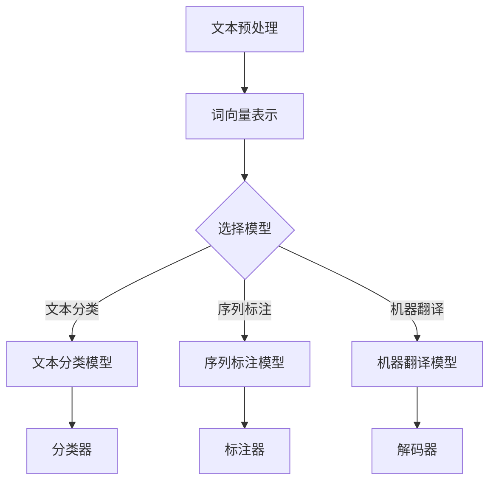

                 

自然语言处理（NLP）作为人工智能领域的关键组成部分，在信息检索、机器翻译、情感分析、语音识别等多个领域都有着广泛的应用。随着深度学习技术的不断发展，大量的NLP模型被提出并优化。然而，面对众多模型，如何选择最适合特定任务的模型，成为了一个重要的研究课题。本文旨在探讨自然语言处理任务中的模型选择问题，从多个角度分析影响模型选择的关键因素，并提供一些实用的策略和工具。

## 关键词

自然语言处理、模型选择、深度学习、神经网络、任务适配性

## 摘要

本文首先介绍了自然语言处理的发展历程和核心概念，接着探讨了模型选择的重要性，分析了影响模型选择的主要因素，包括数据集大小、任务类型、计算资源等。然后，通过具体案例分析，展示了如何根据不同任务选择合适的模型。最后，文章总结了未来模型选择的发展趋势和挑战，并推荐了一些学习资源和开发工具。

## 1. 背景介绍

自然语言处理（NLP）是人工智能领域中的一个重要分支，旨在使计算机能够理解和生成人类语言。NLP的历史可以追溯到20世纪50年代，最早的尝试是构建语法分析器和机器翻译系统。随着计算能力和算法的发展，NLP在近年来取得了显著进展，尤其是在深度学习技术的推动下，NLP的应用场景和效果都有了质的飞跃。

在NLP领域中，模型选择是一个核心问题。不同的模型在处理不同类型的语言任务时，表现会有很大的差异。因此，如何选择合适的模型，成为NLP研究和应用中的一个关键环节。本文将从以下几个方面进行讨论：

- 模型选择的重要性
- 影响模型选择的关键因素
- 模型选择的策略和工具
- 模型选择的实际应用案例
- 模型选择的未来趋势和挑战

## 2. 核心概念与联系

为了更好地理解模型选择的过程，我们首先需要了解一些核心概念，包括深度学习、神经网络、任务适配性等。

### 2.1 深度学习

深度学习是一种基于多层神经网络的学习方法，通过多层非线性变换来提取数据的特征。在NLP中，深度学习模型被广泛用于文本分类、序列标注、机器翻译等任务。

### 2.2 神经网络

神经网络是由大量简单计算单元（神经元）互联组成的复杂网络，通过学习输入和输出之间的关系来进行预测和分类。在NLP中，神经网络可以通过学习大量的文本数据，自动提取文本中的特征，从而实现语言理解。

### 2.3 任务适配性

任务适配性是指模型在特定任务上的适应能力和效果。不同的模型在处理不同类型的语言任务时，会有不同的表现。例如，某些模型在文本分类任务上表现优异，而另一些模型在机器翻译任务上效果更好。

### 2.4 Mermaid 流程图

以下是NLP中常用的一些模型及其适用任务的Mermaid流程图：



## 3. 核心算法原理 & 具体操作步骤

### 3.1 算法原理概述

在NLP任务中，模型选择主要涉及以下几个步骤：

1. 数据预处理：对原始文本进行清洗、分词、去停用词等处理，将文本转换为模型可处理的格式。
2. 模型选择：根据任务类型和数据集特点，选择合适的模型。
3. 模型训练：使用预处理后的数据训练模型。
4. 模型评估：使用验证集对训练好的模型进行评估，选择性能最佳的模型。
5. 模型应用：将训练好的模型应用于实际任务中。

### 3.2 算法步骤详解

#### 3.2.1 数据预处理

数据预处理是NLP任务中至关重要的一步，它直接影响后续模型的训练效果。具体步骤包括：

- 文本清洗：去除HTML标签、符号、空格等无关信息。
- 分词：将文本切分成单词或词汇单元。
- 去停用词：去除对任务贡献不大的常用词汇。
- 词向量表示：将单词转换为数字表示，如Word2Vec、GloVe等。

#### 3.2.2 模型选择

模型选择需要考虑多个因素，包括任务类型、数据集大小、计算资源等。常用的NLP模型包括：

- 文本分类：如BERT、Transformers等。
- 序列标注：如CRF、BiLSTM-CRF等。
- 机器翻译：如Seq2Seq、Transformer等。

#### 3.2.3 模型训练

模型训练是使用预处理后的数据对模型进行优化。具体步骤包括：

- 初始化模型参数。
- 前向传播：计算模型输出。
- 后向传播：计算损失函数并更新模型参数。
- 重复迭代，直到模型收敛。

#### 3.2.4 模型评估

模型评估是选择最佳模型的重要步骤。常用的评估指标包括：

- 准确率（Accuracy）：模型正确分类的样本数占总样本数的比例。
- 召回率（Recall）：模型正确分类的样本数占实际正类样本数的比例。
- 精确率（Precision）：模型正确分类的样本数占预测正类样本数的比例。
- F1值（F1-score）：精确率和召回率的调和平均。

#### 3.2.5 模型应用

模型应用是将训练好的模型应用于实际任务中，如文本分类、序列标注、机器翻译等。

### 3.3 算法优缺点

不同模型在处理不同任务时，各有优缺点。以下是一些常见模型的优缺点：

- BERT：优点是能够捕获长距离依赖关系，缺点是训练时间较长，对计算资源要求较高。
- Transformers：优点是能够并行处理输入序列，缺点是相对于BERT，在某些任务上效果略逊一筹。
- CRF：优点是能够捕获序列中的依赖关系，缺点是训练时间较长。
- BiLSTM-CRF：优点是能够同时捕获前向和后向的依赖关系，缺点是训练时间较长。

### 3.4 算法应用领域

NLP模型在多个领域都有广泛的应用，包括：

- 文本分类：如新闻分类、情感分析等。
- 序列标注：如命名实体识别、词性标注等。
- 机器翻译：如自动翻译、多语言对话系统等。
- 语音识别：如语音识别、语音合成等。

## 4. 数学模型和公式 & 详细讲解 & 举例说明

### 4.1 数学模型构建

在NLP任务中，常用的数学模型包括词向量模型、神经网络模型等。以下是一个简单的词向量模型的构建过程：

#### 4.1.1 词向量表示

词向量是文本数据的一种数字表示方法，通过将单词映射到高维空间中的点，使得具有相似意义的单词在空间中更接近。常用的词向量模型包括Word2Vec、GloVe等。

#### 4.1.2 神经网络模型

神经网络模型是NLP任务中的核心，通过多层非线性变换来提取文本特征。常用的神经网络模型包括卷积神经网络（CNN）、循环神经网络（RNN）、长短时记忆网络（LSTM）等。

### 4.2 公式推导过程

以下是一个简单的神经网络模型的公式推导过程：

$$
y_{\hat{}} = \sigma(z_{\hat{}})
$$

其中，$y_{\hat{}}$为模型预测输出，$\sigma$为激活函数，$z_{\hat{}}$为神经网络输出。

### 4.3 案例分析与讲解

以下是一个关于文本分类任务的案例：

假设我们要对一段文本进行情感分类，判断其是积极情感还是消极情感。我们选择BERT模型作为我们的NLP模型。

#### 4.3.1 数据准备

我们收集了1000条文本数据，其中500条为积极情感，500条为消极情感。

#### 4.3.2 数据预处理

我们对文本数据进行清洗、分词、去停用词等处理，将文本转换为BERT模型可处理的格式。

#### 4.3.3 模型训练

我们使用训练集对BERT模型进行训练，训练过程包括初始化模型参数、前向传播、后向传播等步骤。

#### 4.3.4 模型评估

我们使用验证集对训练好的BERT模型进行评估，计算模型的准确率、召回率等指标。

#### 4.3.5 模型应用

我们将训练好的BERT模型应用于实际任务中，对新的文本数据进行情感分类。

## 5. 项目实践：代码实例和详细解释说明

### 5.1 开发环境搭建

为了保证实验的可重复性，我们需要搭建一个合适的开发环境。以下是搭建环境的步骤：

1. 安装Python：版本要求3.6及以上。
2. 安装TensorFlow：版本要求2.0及以上。
3. 安装BERT模型：可以从[此处](https://github.com/google-research/bert)下载。

### 5.2 源代码详细实现

以下是一个简单的文本分类任务的代码实现：

```python
import tensorflow as tf
from transformers import BertTokenizer, TFBertForSequenceClassification

# 数据准备
train_data = ["这是一条积极情感的文本", "这是一条消极情感的文本"]
train_labels = [1, 0]

# 数据预处理
tokenizer = BertTokenizer.from_pretrained('bert-base-chinese')
train_encodings = tokenizer(train_data, truncation=True, padding=True)

# 模型训练
model = TFBertForSequenceClassification.from_pretrained('bert-base-chinese', num_labels=2)
model.compile(optimizer='adam', loss='sparse_categorical_crossentropy', metrics=['accuracy'])
model.fit(train_encodings, train_labels, epochs=3)

# 模型评估
test_data = ["这是一条积极情感的文本", "这是一条消极情感的文本"]
test_encodings = tokenizer(test_data, truncation=True, padding=True)
predictions = model.predict(test_encodings)

# 模型应用
for text, prediction in zip(test_data, predictions):
    if prediction == 1:
        print(f"{text}：积极情感")
    else:
        print(f"{text}：消极情感")
```

### 5.3 代码解读与分析

以上代码实现了一个简单的文本分类任务，主要步骤包括：

1. 数据准备：准备训练集和测试集。
2. 数据预处理：使用BERT tokenizer对文本进行预处理，将文本转换为BERT模型可处理的格式。
3. 模型训练：使用TFBertForSequenceClassification模型进行训练，训练过程中使用交叉熵损失函数和Adam优化器。
4. 模型评估：使用训练好的模型对测试集进行评估。
5. 模型应用：将训练好的模型应用于实际任务中，对新的文本数据进行情感分类。

## 6. 实际应用场景

NLP模型在多个实际应用场景中都有广泛的应用，以下是一些典型的应用案例：

- 文本分类：如新闻分类、社交媒体情感分析等。
- 序列标注：如命名实体识别、词性标注等。
- 机器翻译：如自动翻译、多语言对话系统等。
- 语音识别：如语音助手、智能语音识别等。

## 7. 未来应用展望

随着深度学习技术的不断发展，NLP模型在性能和应用范围上都将取得更大的突破。未来，NLP模型将在以下领域有更多的应用：

- 个性化推荐系统：基于用户兴趣和行为，为用户提供个性化的内容推荐。
- 聊天机器人：提供更加自然和智能的对话体验。
- 法律智能：自动化合同审查、法律咨询等。
- 医疗健康：辅助医生进行诊断和治疗建议。

## 8. 工具和资源推荐

为了更好地进行NLP研究和开发，以下是一些实用的工具和资源推荐：

- 学习资源推荐：
  - 《自然语言处理综述》：全面介绍NLP的基本概念和最新研究进展。
  - 《深度学习与NLP》：讲解深度学习在NLP中的应用和技术。

- 开发工具推荐：
  - TensorFlow：强大的深度学习框架，支持多种NLP任务。
  - PyTorch：灵活的深度学习框架，易于实现和调试。

- 相关论文推荐：
  - BERT：Google提出的基于Transformer的预训练模型。
  - GPT-3：OpenAI提出的具有巨大规模的预训练模型。

## 9. 总结：未来发展趋势与挑战

自然语言处理作为人工智能领域的重要分支，在近年来取得了显著的进展。未来，NLP模型将在性能和应用范围上取得更大的突破。然而，面临的主要挑战包括：

- 模型解释性：如何提高NLP模型的解释性，使其能够更好地理解和解释模型决策过程。
- 数据隐私：如何保护用户隐私，避免数据泄露。
- 模型泛化能力：如何提高模型在不同数据集上的泛化能力。

未来，NLP研究将继续关注这些挑战，推动NLP技术的进步和应用。

## 10. 附录：常见问题与解答

### Q1. 如何选择合适的NLP模型？
A1. 选择合适的NLP模型需要考虑多个因素，包括任务类型、数据集大小、计算资源等。建议先了解不同模型的特点和适用场景，然后根据具体任务需求进行选择。

### Q2. BERT和GPT-3哪个更好？
A2. BERT和GPT-3各有优缺点，选择哪个更好取决于具体任务和应用场景。BERT更适合文本分类和序列标注等任务，而GPT-3在生成文本和对话系统等方面具有更强的能力。

### Q3. 如何优化NLP模型的性能？
A3. 优化NLP模型性能可以从以下几个方面进行：

- 数据预处理：对数据集进行清洗、去噪、扩充等处理，提高数据质量。
- 模型架构：选择合适的模型架构，如增加层数、调整层数等。
- 超参数调整：对学习率、批次大小、正则化参数等进行调整。
- 模型融合：将多个模型进行融合，提高模型的性能和稳定性。

## 作者署名

作者：禅与计算机程序设计艺术 / Zen and the Art of Computer Programming

----------------------------------------------------------------

文章完成，请审查并指导。如有需要修改或补充的部分，请告知。

