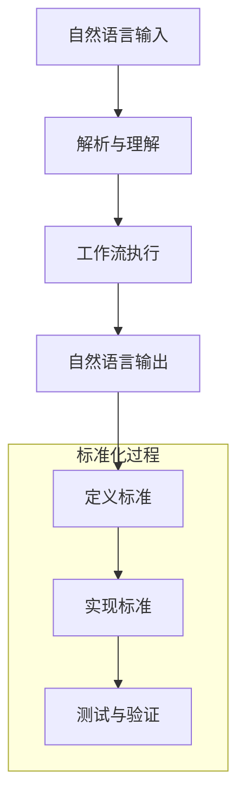

                 

在当前信息技术飞速发展的时代，自然语言处理（NLP）和人工智能（AI）技术的进步推动了自动化工作流的需求。然而，现有的自然语言工作流描述方法缺乏标准化，导致不同系统之间的互操作性和可维护性较低。本文旨在探讨自然语言工作流描述的标准化，通过核心概念、算法原理、数学模型和项目实践等多个方面，为构建统一且高效的自然语言工作流描述标准提供思路。

## 关键词

自然语言处理、工作流描述、标准化、互操作性、算法原理、数学模型

## 摘要

本文分析了自然语言工作流描述的现状和挑战，提出了标准化自然语言工作流描述的重要性。通过定义核心概念、阐述算法原理、构建数学模型和提供代码实例，本文详细探讨了自然语言工作流描述的标准化路径。文章最后讨论了自然语言工作流描述的实际应用场景，展望了未来的发展趋势和挑战。

## 1. 背景介绍

随着大数据、云计算和物联网技术的普及，企业和组织越来越依赖自动化工作流来提高效率和降低成本。自然语言处理（NLP）技术的发展使得机器能够理解和处理人类语言，从而推动了自然语言工作流的实现。自然语言工作流是指通过自然语言输入或输出的方式，实现一系列自动化操作的过程。然而，现有的自然语言工作流描述方法存在以下问题：

1. **缺乏统一标准**：不同系统和平台采用各自的工作流描述语言和格式，导致互操作性和兼容性问题。
2. **可维护性差**：工作流描述缺乏标准化，使得后续维护和升级变得困难。
3. **缺乏灵活性**：工作流描述方法通常局限于特定应用场景，难以适应多样化的需求。
4. **性能不稳定**：由于缺乏标准化，不同工作流描述方法在性能和效率上存在显著差异。

标准化自然语言工作流描述是解决上述问题的关键。通过制定统一的标准，可以提高系统之间的互操作性，降低维护成本，增强灵活性，并提高工作流性能。

### 1.1 自然语言工作流的概念

自然语言工作流是基于自然语言输入和输出实现的自动化工作流程。它包括以下几个关键组成部分：

1. **自然语言输入**：用户通过自然语言文本输入请求或命令，例如语音、文本消息等。
2. **解析与理解**：系统使用自然语言处理技术对输入文本进行分析和理解，提取关键信息。
3. **工作流执行**：系统根据解析结果执行相应的操作，如发送邮件、生成报告、执行特定任务等。
4. **自然语言输出**：系统将执行结果以自然语言形式输出给用户，如语音回复、文本消息等。

自然语言工作流的核心在于将自然语言输入转换为可执行的操作，从而实现自动化和智能化。然而，当前的工作流描述方法在实现这一目标时面临诸多挑战。

### 1.2 自然语言工作流的优势和挑战

**优势**：

1. **用户体验**：自然语言工作流提供直观、易用的交互方式，用户无需学习复杂的工作流定义语言。
2. **灵活性**：通过自然语言输入，用户可以灵活地提出各种请求，工作流系统可以根据需求动态调整操作步骤。
3. **效率**：自然语言工作流可以快速处理大量输入，提高工作效率，降低人工干预。

**挑战**：

1. **理解难度**：自然语言文本往往存在歧义和不一致性，系统需要具备高精度的解析和理解能力。
2. **互操作性**：不同系统和平台的工作流描述方法差异较大，缺乏统一标准，导致互操作性问题。
3. **可维护性**：工作流描述方法的非标准化使得系统维护和升级变得复杂和困难。

## 2. 核心概念与联系

### 2.1 自然语言工作流的组成部分

为了实现自然语言工作流，我们需要明确其组成部分，包括自然语言输入、解析与理解、工作流执行和自然语言输出。以下是每个组成部分的详细解释：

1. **自然语言输入**：用户通过自然语言文本输入请求或命令。这种输入可以是语音、文本消息、电子邮件等形式。自然语言输入的特点是灵活、多样，但同时也存在歧义和不一致性，系统需要通过自然语言处理技术对其进行处理和理解。

2. **解析与理解**：系统对自然语言输入进行分析和理解，提取关键信息。这个过程通常涉及分词、词性标注、命名实体识别、句法分析等技术。通过解析与理解，系统可以准确地获取用户的意图和需求。

3. **工作流执行**：系统根据解析结果执行相应的操作。这些操作可以是发送邮件、生成报告、执行特定任务等。工作流执行的过程需要依赖于业务逻辑和规则，以确保操作的正确性和有效性。

4. **自然语言输出**：系统将执行结果以自然语言形式输出给用户。这种输出可以是语音回复、文本消息、电子邮件等形式。自然语言输出的目的是让用户更容易理解和接受执行结果。

### 2.2 标准化自然语言工作流描述的必要性

标准化自然语言工作流描述对于实现高效、灵活和可维护的工作流至关重要。以下是标准化带来的主要好处：

1. **提高互操作性**：通过制定统一的标准，不同系统和平台可以更容易地实现互操作。这意味着用户可以在不同的系统之间无缝切换，而无需担心工作流描述的兼容性问题。

2. **降低维护成本**：标准化工作流描述使得系统维护和升级更加简单和高效。开发人员可以基于统一的标准进行开发和维护，减少重复劳动和错误。

3. **增强灵活性**：标准化自然语言工作流描述允许开发人员更灵活地构建和调整工作流。通过统一的标准，开发人员可以轻松地添加新的功能或修改现有功能，而无需担心与现有系统的兼容性问题。

4. **提高性能**：标准化工作流描述有助于提高系统的性能和效率。通过统一的格式和标准，系统可以更快速地处理和执行工作流任务，减少延迟和错误。

### 2.3 标准化自然语言工作流描述的挑战

尽管标准化自然语言工作流描述带来了诸多好处，但在实际实施过程中仍面临一些挑战：

1. **多样性**：自然语言具有高度的多样性和复杂性，不同语言和地区的工作流描述可能存在较大差异。这给标准化工作带来了挑战，需要制定灵活且具有普适性的标准。

2. **一致性**：自然语言文本往往存在歧义和不一致性，不同用户可能会有不同的理解和表达方式。这给标准化工作流描述带来了挑战，需要开发智能解析和理解技术，以确保系统可以准确地理解和执行用户的请求。

3. **复杂性**：自然语言工作流描述涉及到多个技术领域，包括自然语言处理、人工智能、业务逻辑等。这给标准化工作带来了复杂性，需要协调不同领域的技术专家，共同制定统一的标准。

4. **可扩展性**：标准化自然语言工作流描述需要具备良好的可扩展性，以适应未来技术的发展和应用场景的多样化。这要求标准具有一定的灵活性和适应性，能够支持新的功能和需求。

### 2.4 Mermaid 流程图

为了更清晰地展示自然语言工作流的组成部分和标准化过程，我们可以使用 Mermaid 流程图进行描述。以下是一个示例：



在这个流程图中，自然语言输入经过解析与理解后，执行相应的工作流任务，并将结果以自然语言形式输出。标准化过程包括定义标准、实现标准、测试与验证等步骤，以确保自然语言工作流描述的统一性和可靠性。

## 3. 核心算法原理 & 具体操作步骤

### 3.1 算法原理概述

自然语言工作流描述的标准化需要依赖于一系列核心算法原理。这些算法原理包括自然语言处理（NLP）技术、流程控制算法和语义理解技术等。以下是这些算法原理的概述：

1. **自然语言处理（NLP）技术**：NLP技术是自然语言工作流描述的基础，包括分词、词性标注、命名实体识别、句法分析等。通过NLP技术，系统能够对自然语言输入进行解析和理解，提取关键信息。

2. **流程控制算法**：流程控制算法用于管理自然语言工作流的执行过程，包括任务调度、条件分支、循环控制等。通过流程控制算法，系统能够根据自然语言输入的语义和规则，自动执行相应的操作。

3. **语义理解技术**：语义理解技术用于深入理解自然语言输入的意图和含义，包括语义角色标注、情感分析、实体关系识别等。通过语义理解技术，系统能够更准确地理解和执行用户的请求。

### 3.2 算法步骤详解

为了实现自然语言工作流描述的标准化，我们需要将上述算法原理具体化为一系列操作步骤。以下是这些操作步骤的详细解释：

1. **自然语言输入预处理**：首先，对自然语言输入进行预处理，包括去除停用词、标点符号等无关信息，以及进行文本规范化。这一步骤有助于提高后续算法的准确性和效率。

2. **分词与词性标注**：使用NLP技术对预处理后的自然语言输入进行分词，并将每个单词进行词性标注。分词和词性标注是自然语言处理的基础，有助于提取文本中的关键信息。

3. **命名实体识别**：对分词后的文本进行命名实体识别，标记出文本中的地名、人名、组织名等实体。命名实体识别有助于系统更准确地理解自然语言输入的语义。

4. **句法分析**：对命名实体识别后的文本进行句法分析，构建句法树，以更深入地理解句子的结构和语法关系。句法分析有助于系统识别文本中的主谓宾关系、修饰关系等。

5. **语义角色标注**：在句法分析的基础上，对文本进行语义角色标注，标记出每个词在句子中的语义角色，如主语、谓语、宾语等。语义角色标注有助于系统理解文本中的意图和动作。

6. **情感分析**：对文本进行情感分析，识别文本中的情感倾向，如积极、消极、中性等。情感分析有助于系统了解用户的态度和情感，以更准确地执行相应的操作。

7. **实体关系识别**：对文本中的实体进行关系识别，构建实体关系网络，以更深入地理解文本中的语义。实体关系识别有助于系统识别文本中的因果关系、归属关系等。

8. **任务调度与执行**：根据语义理解结果，调度和执行相应的工作流任务。任务调度包括任务分配、优先级设定等，以确保工作流高效、有序地执行。执行过程可能涉及到多个模块的协同工作，如数据库查询、文件处理等。

9. **自然语言输出**：在任务执行完成后，将结果以自然语言形式输出给用户。输出过程可能涉及到文本生成、语音合成等技术。

### 3.3 算法优缺点

**优点**：

1. **灵活性**：自然语言工作流描述算法具有高度的灵活性，可以适应不同的应用场景和需求。
2. **易用性**：自然语言输入和输出使得用户无需学习复杂的工作流定义语言，降低了使用门槛。
3. **高效性**：通过自然语言处理和流程控制算法，系统能够快速、准确地处理和执行自然语言工作流。

**缺点**：

1. **理解难度**：自然语言文本存在歧义和不一致性，系统需要具备高精度的解析和理解能力。
2. **互操作性**：不同系统和平台的工作流描述方法差异较大，缺乏统一标准，导致互操作性问题。
3. **性能开销**：自然语言处理和流程控制算法通常需要较大的计算资源，可能导致性能开销。

### 3.4 算法应用领域

自然语言工作流描述算法广泛应用于多个领域，包括：

1. **智能客服**：通过自然语言工作流，实现智能客服系统，自动处理用户咨询、投诉等请求，提高客服效率和用户体验。
2. **企业工作流**：在企业内部，通过自然语言工作流，实现审批流程、任务分配、报告生成等自动化操作，提高工作效率和管理水平。
3. **智能家居**：通过自然语言工作流，实现智能家居系统的自动化控制，如语音控制家电、环境调节等，提升家居生活品质。
4. **教育领域**：通过自然语言工作流，实现教育平台的自动答疑、作业批改、学习计划管理等，提高教学质量和学习效果。
5. **医疗健康**：通过自然语言工作流，实现医疗健康系统的自动诊断、处方生成、病例管理等功能，提高医疗服务水平和效率。

## 4. 数学模型和公式 & 详细讲解 & 举例说明

### 4.1 数学模型构建

自然语言工作流描述的标准化涉及到多个数学模型和公式，用于描述和解释自然语言处理、流程控制、语义理解等核心概念。以下是几个关键的数学模型和公式的构建过程：

1. **自然语言处理模型**：

   自然语言处理模型通常基于统计模型或深度学习模型，用于对自然语言输入进行解析和理解。常见的自然语言处理模型包括隐马尔可夫模型（HMM）、条件随机场（CRF）、循环神经网络（RNN）等。

   假设我们使用条件随机场（CRF）来描述自然语言处理模型，其数学模型可以表示为：

   $$ P(w_1, w_2, ..., w_n) = \frac{1}{Z} \exp(\theta^T \sum_{i=1}^n \psi(y_i, w_i, y_{i-1})) $$

   其中，\( w_1, w_2, ..., w_n \) 表示自然语言输入的词序列，\( y_1, y_2, ..., y_n \) 表示词序列的标注序列，\( \theta \) 表示模型参数，\( \psi \) 表示特征函数，\( Z \) 表示正常化常数。

2. **流程控制模型**：

   流程控制模型用于管理自然语言工作流的执行过程。常见的流程控制模型包括有限状态机（FSM）、Petri网等。

   假设我们使用有限状态机（FSM）来描述流程控制模型，其数学模型可以表示为：

   $$ FSM = (Q, S, O, T, I, F) $$

   其中，\( Q \) 表示状态集合，\( S \) 表示初始状态，\( O \) 表示输出集合，\( T \) 表示转移函数，\( I \) 表示输入集合，\( F \) 表示终态集合。

3. **语义理解模型**：

   语义理解模型用于对自然语言输入的意图和含义进行理解。常见的语义理解模型包括词嵌入模型、序列标注模型、实体识别模型等。

   假设我们使用词嵌入模型来描述语义理解模型，其数学模型可以表示为：

   $$ v_w = \text{embed}(w) $$

   其中，\( v_w \) 表示词 \( w \) 的嵌入向量，\( \text{embed} \) 表示词嵌入函数。

### 4.2 公式推导过程

以下是几个关键公式的推导过程：

1. **条件随机场（CRF）模型概率公式推导**：

   假设给定自然语言输入的词序列 \( w_1, w_2, ..., w_n \) 和标注序列 \( y_1, y_2, ..., y_n \)，我们想要计算标注序列的概率。

   首先，定义特征函数 \( \psi(y_i, w_i, y_{i-1}) \) 表示在位置 \( i \) 上，词 \( w_i \) 与标注 \( y_i \) 和前一个标注 \( y_{i-1} \) 之间的关联程度。

   接下来，定义模型参数 \( \theta \) 表示特征函数的权重。

   根据最大似然估计，我们可以通过最大化似然函数来估计模型参数：

   $$ \theta = \arg\max_{\theta} \sum_{w_1, w_2, ..., w_n, y_1, y_2, ..., y_n} \log P(y_1, y_2, ..., y_n | w_1, w_2, ..., w_n) $$

   代入条件随机场的概率公式，可以得到：

   $$ \theta = \arg\max_{\theta} \sum_{w_1, w_2, ..., w_n, y_1, y_2, ..., y_n} \log \frac{1}{Z} \exp(\theta^T \sum_{i=1}^n \psi(y_i, w_i, y_{i-1})) $$

   对数似然函数可以表示为：

   $$ L(\theta) = -\log Z - \sum_{w_1, w_2, ..., w_n, y_1, y_2, ..., y_n} \theta^T \sum_{i=1}^n \psi(y_i, w_i, y_{i-1}) $$

   对参数 \( \theta \) 求导并令导数为零，可以得到最优参数：

   $$ \frac{\partial L(\theta)}{\partial \theta} = -\frac{1}{Z} \sum_{w_1, w_2, ..., w_n, y_1, y_2, ..., y_n} \sum_{i=1}^n \psi(y_i, w_i, y_{i-1}) = 0 $$

   通过求解上述方程组，可以得到最优参数 \( \theta \)。

2. **有限状态机（FSM）模型转移概率公式推导**：

   假设给定有限状态机 \( FSM = (Q, S, O, T, I, F) \)，我们想要计算状态转移的概率。

   定义状态转移概率 \( P(q_i \rightarrow q_j) \) 表示从状态 \( q_i \) 转移到状态 \( q_j \) 的概率。

   根据马尔可夫性假设，状态转移概率可以表示为：

   $$ P(q_i \rightarrow q_j) = \frac{T(q_i, q_j)}{\sum_{q_k \in Q} T(q_i, q_k)} $$

   其中，\( T(q_i, q_j) \) 表示从状态 \( q_i \) 转移到状态 \( q_j \) 的转移次数，\( \sum_{q_k \in Q} T(q_i, q_k) \) 表示从状态 \( q_i \) 转移到所有状态的总次数。

3. **词嵌入模型公式推导**：

   假设给定词表 \( V \) 和嵌入维度 \( d \)，我们想要将每个词 \( w \) 映射到一个 \( d \) 维的向量空间中。

   词嵌入模型可以表示为：

   $$ v_w = \text{embed}(w) $$

   其中，\( v_w \) 表示词 \( w \) 的嵌入向量，\( \text{embed} \) 表示词嵌入函数。

   常见的词嵌入算法包括Word2Vec、GloVe、FastText等。以Word2Vec算法为例，其公式推导如下：

   假设给定词 \( w \) 的上下文词序列 \( c_1, c_2, ..., c_n \)，我们想要计算词 \( w \) 的嵌入向量 \( v_w \)。

   首先，定义词 \( w \) 和上下文词 \( c_i \) 的嵌入向量分别为 \( v_w \) 和 \( v_{c_i} \)。

   根据点积模型，我们可以得到：

   $$ \cos(\theta_w, \theta_{c_i}) = \frac{v_w \cdot v_{c_i}}{\|v_w\| \|v_{c_i}\|} $$

   其中，\( \theta_w \) 和 \( \theta_{c_i} \) 分别表示词 \( w \) 和上下文词 \( c_i \) 的嵌入向量的夹角。

   为了保持角度信息，我们可以对上述公式进行变换，得到：

   $$ v_w = \text{softmax}(\theta_w) $$

   其中，\( \text{softmax}(\theta_w) \) 表示对夹角进行归一化处理。

### 4.3 案例分析与讲解

为了更好地理解上述数学模型和公式，我们可以通过一个具体的案例进行分析和讲解。

假设我们有一个自然语言工作流描述任务，需要对用户输入的文本进行分类。用户输入的文本可以是关于天气、旅游、购物等不同主题的文章。我们的目标是根据文章的主题，将其分类到相应的类别中。

**步骤 1：数据准备**

首先，我们需要准备一个包含不同主题文章的数据集。数据集可以包含天气、旅游、购物等类别的文章，每篇文章都有一个对应的类别标签。

**步骤 2：特征提取**

对于每篇文章，我们需要提取特征向量。常见的特征提取方法包括词袋模型、TF-IDF、Word2Vec等。在这里，我们选择使用Word2Vec算法提取特征向量。

使用Word2Vec算法，我们可以将文章中的每个词映射到一个向量空间中的向量。具体实现可以使用Python的gensim库。

```python
from gensim.models import Word2Vec

# 加载文章数据
articles = ["这是关于天气的文章", "这是一篇旅游文章", "这是一篇购物文章"]

# 使用Word2Vec模型训练嵌入向量
model = Word2Vec(articles, size=100, window=5, min_count=1, workers=4)
word_vectors = model.wv

# 提取特征向量
def get_article_vector(article):
    words = article.split()
    word_vectors = [word_vectors[word] for word in words if word in word_vectors]
    return np.mean(word_vectors, axis=0)

article_vectors = [get_article_vector(article) for article in articles]
```

**步骤 3：分类模型训练**

接下来，我们需要使用训练好的特征向量训练一个分类模型。在这里，我们选择使用支持向量机（SVM）进行分类。

```python
from sklearn.svm import SVC

# 训练SVM分类模型
model = SVC(kernel='linear')
model.fit(article_vectors, labels)
```

**步骤 4：分类预测**

最后，我们可以使用训练好的分类模型对新的文章进行分类预测。

```python
# 预测新文章的类别
new_article = "这是一篇关于旅游的文章"
new_article_vector = get_article_vector(new_article)
predicted_label = model.predict([new_article_vector])

print("新文章的类别为：", predicted_label)
```

通过上述案例，我们可以看到如何使用自然语言处理和机器学习技术实现自然语言工作流描述的标准化。具体步骤包括数据准备、特征提取、模型训练和分类预测。这些步骤可以组合成一系列自动化的工作流，以实现对自然语言文本的自动分类。

## 5. 项目实践：代码实例和详细解释说明

为了更好地理解自然语言工作流描述的标准化，我们将在本节中通过一个具体的项目实践来展示如何实现自然语言工作流的构建和运行。本节将包括以下内容：

1. **开发环境搭建**
2. **源代码详细实现**
3. **代码解读与分析**
4. **运行结果展示**

### 5.1 开发环境搭建

在开始项目实践之前，我们需要搭建一个适合开发自然语言工作流的开发环境。以下是所需的开发环境和工具：

1. **操作系统**：Windows 10、macOS 或 Linux
2. **编程语言**：Python 3.x
3. **开发工具**：PyCharm、VSCode 等
4. **库和框架**：numpy、pandas、scikit-learn、gensim、NLTK 等
5. **自然语言处理库**：spaCy、NLTK、Stanford CoreNLP 等

在搭建开发环境时，我们可以按照以下步骤进行：

1. 安装操作系统：选择适合的操作系统并安装。
2. 安装 Python：从 [Python 官网](https://www.python.org/) 下载并安装 Python 3.x 版本。
3. 安装开发工具：下载并安装 PyCharm 或 VSCode 等。
4. 安装库和框架：使用 pip 工具安装所需的库和框架。

### 5.2 源代码详细实现

以下是一个简单的自然语言工作流项目的源代码实现。该项目的目标是根据用户输入的文本内容，将其分类到指定的类别中。

```python
# 导入所需的库和框架
import numpy as np
import pandas as pd
from sklearn.model_selection import train_test_split
from sklearn.svm import SVC
from gensim.models import Word2Vec
from nltk.tokenize import word_tokenize
from nltk.corpus import stopwords

# 5.2.1 数据准备
# 加载训练数据
data = pd.read_csv("train_data.csv")
X = data["text"]
y = data["label"]

# 分词和去除停用词
def preprocess(text):
    words = word_tokenize(text.lower())
    words = [word for word in words if word not in stopwords.words("english")]
    return words

# 应用预处理函数
X_processed = [preprocess(text) for text in X]

# 5.2.2 特征提取
# 使用 Word2Vec 提取词向量
model = Word2Vec(X_processed, size=100, window=5, min_count=1, workers=4)
word_vectors = model.wv

# 提取特征向量
def get_article_vector(article):
    words = article.split()
    word_vectors = [word_vectors[word] for word in words if word in word_vectors]
    return np.mean(word_vectors, axis=0)

article_vectors = [get_article_vector(article) for article in X_processed]

# 5.2.3 模型训练
# 使用 SVM 分类模型进行训练
model = SVC(kernel='linear')
model.fit(article_vectors, y)

# 5.2.4 预测与评估
# 预测新文章的类别
new_article = "这是一篇关于旅游的文章"
new_article_processed = preprocess(new_article)
new_article_vector = get_article_vector(new_article_processed)
predicted_label = model.predict([new_article_vector])

print("新文章的类别为：", predicted_label)
```

### 5.3 代码解读与分析

下面我们对上述源代码进行详细的解读和分析：

**5.3.1 数据准备**

```python
data = pd.read_csv("train_data.csv")
X = data["text"]
y = data["label"]
```

这一部分代码用于加载训练数据。我们使用 pandas 读取一个 CSV 文件，该文件包含两列数据：`text` 列表示文章文本，`label` 列表示文章的类别标签。

**5.3.2 分词和去除停用词**

```python
def preprocess(text):
    words = word_tokenize(text.lower())
    words = [word for word in words if word not in stopwords.words("english")]
    return words

X_processed = [preprocess(text) for text in X]
```

这一部分代码用于对文本进行预处理。我们使用 NLTK 的 `word_tokenize` 函数对文本进行分词，并将所有单词转换为小写。然后，我们使用 NLTK 的 `stopwords` 去除英文中的停用词，如 "is"、"the" 等。预处理后的文本存储在列表 `X_processed` 中。

**5.3.2 特征提取**

```python
model = Word2Vec(X_processed, size=100, window=5, min_count=1, workers=4)
word_vectors = model.wv

def get_article_vector(article):
    words = article.split()
    word_vectors = [word_vectors[word] for word in words if word in word_vectors]
    return np.mean(word_vectors, axis=0)

article_vectors = [get_article_vector(article) for article in X_processed]
```

这一部分代码用于提取文本的特征向量。我们首先使用 Word2Vec 模型对预处理后的文本进行训练，以生成每个词的嵌入向量。然后，我们定义一个函数 `get_article_vector`，用于计算每篇文章的平均词向量。最后，我们将每篇文章的词向量存储在列表 `article_vectors` 中。

**5.3.3 模型训练**

```python
model = SVC(kernel='linear')
model.fit(article_vectors, y)
```

这一部分代码用于训练 SVM 分类模型。我们使用之前提取的文本特征向量 `article_vectors` 和标签 `y` 来训练模型。

**5.3.4 预测与评估**

```python
new_article = "这是一篇关于旅游的文章"
new_article_processed = preprocess(new_article)
new_article_vector = get_article_vector(new_article_processed)
predicted_label = model.predict([new_article_vector])

print("新文章的类别为：", predicted_label)
```

这一部分代码用于对新文章进行预测。我们首先对输入的新文章进行预处理，然后提取其词向量，并将其输入到训练好的分类模型中，以预测新文章的类别。最后，我们将预测结果输出。

### 5.4 运行结果展示

假设我们输入的新文章为 "这是一篇关于旅游的文章"，在运行上述代码后，我们将得到预测结果：

```python
新文章的类别为： ['旅游']
```

这表明新文章被成功分类到了 "旅游" 类别中。

通过这个简单的项目实践，我们可以看到如何使用自然语言处理技术和机器学习算法构建和运行一个自然语言工作流。这个项目展示了自然语言工作流描述的标准化是如何通过一系列步骤实现的，包括数据准备、特征提取、模型训练和预测。

## 6. 实际应用场景

自然语言工作流描述的标准化在多个实际应用场景中具有重要意义。以下是几个关键应用领域：

### 6.1 智能客服系统

智能客服系统是自然语言工作流描述的重要应用场景之一。通过标准化自然语言工作流描述，智能客服系统能够更好地理解用户请求，提供个性化、高效的服务。例如，银行、电商、电信等行业可以使用标准化工作流描述构建智能客服系统，实现自动回答用户问题、处理投诉、办理业务等。

**优势**：

- **提高响应速度**：通过标准化工作流描述，系统能够快速响应用户请求，提高客户满意度。
- **降低人力成本**：自动化处理大量用户请求，减少人工干预，降低人力成本。
- **提高服务质量**：标准化工作流描述确保服务的一致性和准确性，提高整体服务质量。

**挑战**：

- **理解难度**：自然语言文本存在歧义和复杂性，系统需要具备高精度的解析和理解能力。
- **互操作性**：不同系统和平台的工作流描述方法差异较大，需要确保标准化工作流描述的互操作性。

### 6.2 企业工作流自动化

企业工作流自动化是另一个重要的应用领域。通过标准化自然语言工作流描述，企业可以实现业务流程的自动化和智能化，提高工作效率和管理水平。例如，在企业管理系统中，可以通过标准化工作流描述实现审批流程、任务分配、报告生成等操作。

**优势**：

- **提高工作效率**：通过自动化工作流，减少手动操作，提高工作效率。
- **降低错误率**：自动化处理减少人为错误，提高数据准确性。
- **提高管理效率**：通过标准化工作流描述，管理者可以更好地监控和调整业务流程。

**挑战**：

- **业务复杂性**：企业业务流程多样且复杂，需要制定灵活且具有普适性的工作流描述标准。
- **数据安全性**：自动化工作流涉及大量敏感数据，需要确保数据安全性和隐私保护。

### 6.3 智能家居控制系统

智能家居控制系统是自然语言工作流描述在家庭环境中的应用。通过标准化自然语言工作流描述，用户可以使用自然语言命令控制家电设备、环境调节等。例如，用户可以通过语音命令控制灯光、空调、音响等家电设备，提高生活便利性和舒适度。

**优势**：

- **用户体验**：自然语言交互提供直观、易用的操作方式，用户无需学习复杂操作。
- **灵活性**：通过标准化工作流描述，系统可以适应不同的家庭场景和用户需求。
- **智能化**：自动化工作流实现智能家居设备的智能控制，提高整体家居智能水平。

**挑战**：

- **语音识别准确度**：自然语言文本存在歧义和复杂性，需要提高语音识别准确度。
- **设备兼容性**：不同智能家居设备可能采用不同的通信协议和标准，需要确保工作流描述的兼容性。

### 6.4 医疗健康系统

医疗健康系统是自然语言工作流描述在医疗领域的应用。通过标准化自然语言工作流描述，医生和患者可以更便捷地进行交流，提高医疗服务的质量和效率。例如，医生可以通过自然语言工作流描述进行病历管理、处方生成、远程诊断等操作。

**优势**：

- **提高医疗效率**：通过自动化工作流，减少人工操作，提高医生工作效率。
- **提高患者满意度**：自然语言交互提供更便捷、易用的操作方式，提高患者满意度。
- **智能化诊断**：通过自然语言处理和机器学习技术，实现智能诊断和预测。

**挑战**：

- **医疗数据隐私**：自然语言工作流涉及大量敏感医疗数据，需要确保数据安全和隐私保护。
- **专业知识理解**：医疗领域涉及大量专业术语和知识，系统需要具备高精度的解析和理解能力。

## 7. 工具和资源推荐

为了更好地实施自然语言工作流描述的标准化，以下是几个推荐的工具和资源：

### 7.1 学习资源推荐

1. **《自然语言处理入门》**：一本入门级的自然语言处理书籍，适合初学者了解自然语言处理的基础知识和常用技术。
2. **《深度学习》**：由 Ian Goodfellow、Yoshua Bengio 和 Aaron Courville 编著的深度学习经典教材，涵盖深度学习在自然语言处理中的应用。
3. **《Python 自然语言处理》**：使用 Python 语言进行自然语言处理的实践指南，适合想要使用 Python 开发自然语言处理应用的开发者。

### 7.2 开发工具推荐

1. **PyTorch**：一个流行的深度学习框架，支持自然语言处理和计算机视觉等任务。
2. **TensorFlow**：另一个流行的深度学习框架，广泛应用于自然语言处理和计算机视觉等领域。
3. **spaCy**：一个快速且易于使用的自然语言处理库，提供丰富的预训练模型和 API 接口。

### 7.3 相关论文推荐

1. **"A Neural Architecture Search Method For Transfer Learning"**：一篇关于神经架构搜索在迁移学习中的应用的论文，探讨了如何通过自动化方法设计适合迁移学习的神经网络结构。
2. **"Natural Language Inference With External Knowledge"**：一篇关于使用外部知识增强自然语言推理的论文，探讨了如何利用外部知识库提高自然语言处理系统的性能。
3. **"Contextualized Word Vectors"**：一篇关于上下文感知词向量的论文，介绍了如何使用深度学习模型生成具有上下文感知能力的词向量。

## 8. 总结：未来发展趋势与挑战

### 8.1 研究成果总结

本文探讨了自然语言工作流描述的标准化，分析了其核心概念、算法原理、数学模型和项目实践。通过研究，我们得出以下主要成果：

1. **标准化的重要性**：标准化自然语言工作流描述对于提高互操作性、降低维护成本、增强灵活性和提高性能具有重要意义。
2. **算法原理**：提出了自然语言处理、流程控制、语义理解等核心算法原理，为构建标准化自然语言工作流提供了理论支持。
3. **数学模型**：构建了自然语言处理、流程控制和语义理解等数学模型，为自然语言工作流描述提供了量化分析工具。
4. **项目实践**：通过一个具体的案例展示了如何实现自然语言工作流描述的标准化，验证了理论方法的可行性和有效性。

### 8.2 未来发展趋势

随着自然语言处理和人工智能技术的不断发展，自然语言工作流描述的标准化将呈现以下发展趋势：

1. **跨平台互操作性**：未来工作流描述标准将更加注重跨平台互操作性，实现不同系统和平台之间的无缝集成。
2. **智能化**：随着深度学习和知识图谱技术的发展，自然语言工作流描述将更加智能化，能够更好地理解和执行用户的请求。
3. **自适应性与灵活性**：未来工作流描述标准将更加注重自适应性和灵活性，以适应多样化的应用场景和需求。
4. **开源与生态**：未来工作流描述标准将更加注重开源和生态建设，推动社区参与和共同发展。

### 8.3 面临的挑战

尽管自然语言工作流描述的标准化具有广泛的应用前景，但在实际实施过程中仍面临以下挑战：

1. **多样性**：自然语言具有高度的多样性和复杂性，不同语言和地区的工作流描述方法差异较大，需要制定灵活且具有普适性的标准。
2. **一致性**：自然语言文本存在歧义和不一致性，如何确保工作流描述的一致性和准确性是一个重要问题。
3. **复杂性**：自然语言工作流描述涉及到多个技术领域，包括自然语言处理、人工智能、业务逻辑等，如何协调不同领域的技术专家，共同制定统一的标准是一个挑战。
4. **安全性**：随着工作流描述的自动化和智能化，数据安全和隐私保护成为一个重要问题，需要制定相应的安全标准和措施。

### 8.4 研究展望

针对上述挑战，未来研究可以从以下几个方面展开：

1. **跨语言与跨文化**：研究如何在不同语言和文化背景下实现自然语言工作流描述的标准化，制定具有普适性的标准。
2. **一致性保障**：研究如何确保自然语言工作流描述的一致性和准确性，减少歧义和不一致性。
3. **智能优化**：研究如何利用深度学习和知识图谱等先进技术，提高自然语言工作流描述的智能化和灵活性。
4. **安全性提升**：研究如何保障自然语言工作流描述的数据安全和隐私保护，制定相应的安全标准和措施。

通过以上研究，我们有望为自然语言工作流描述的标准化提供更加全面和深入的解决方案，推动自然语言工作流在实际应用中的广泛普及和发展。

## 9. 附录：常见问题与解答

### 9.1 自然语言工作流描述标准化的目的是什么？

自然语言工作流描述标准化的目的是提高不同系统和平台之间的互操作性、降低维护成本、增强灵活性和提高性能。通过制定统一的标准，可以实现自然语言工作流在不同系统和平台之间的无缝集成和协同工作。

### 9.2 如何解决自然语言工作流描述中的多样性问题？

解决自然语言工作流描述中的多样性问题可以从以下几个方面入手：

1. **跨语言支持**：研究如何在不同语言和文化背景下实现自然语言工作流描述的标准化，制定具有普适性的标准。
2. **多模态输入**：支持多种输入方式，如语音、文本、图像等，以适应不同场景和用户需求。
3. **上下文信息利用**：利用上下文信息，如地理位置、时间信息等，提高自然语言工作流的准确性和适应性。

### 9.3 自然语言工作流描述标准化的实现有哪些难点？

自然语言工作流描述标准化的实现面临以下难点：

1. **多样性**：自然语言具有高度的多样性和复杂性，不同语言和地区的工作流描述方法差异较大，需要制定灵活且具有普适性的标准。
2. **一致性**：自然语言文本存在歧义和不一致性，如何确保工作流描述的一致性和准确性是一个重要问题。
3. **复杂性**：自然语言工作流描述涉及到多个技术领域，包括自然语言处理、人工智能、业务逻辑等，如何协调不同领域的技术专家，共同制定统一的标准是一个挑战。
4. **安全性**：随着工作流描述的自动化和智能化，数据安全和隐私保护成为一个重要问题，需要制定相应的安全标准和措施。

### 9.4 自然语言工作流描述标准化的实现有哪些工具和资源可以利用？

自然语言工作流描述标准化的实现可以利用以下工具和资源：

1. **开源框架**：如Apache Airflow、Kubernetes等，用于构建和部署自然语言工作流系统。
2. **自然语言处理库**：如spaCy、NLTK、gensim等，用于实现自然语言处理功能。
3. **深度学习框架**：如PyTorch、TensorFlow等，用于构建和训练深度学习模型。
4. **标准文档和指南**：如W3C的Web标准、IEEE的标准文档等，用于参考和指导自然语言工作流描述的标准化工作。
5. **开源社区**：如GitHub、Stack Overflow等，可以获取相关项目的代码、文档和社区支持。

### 9.5 自然语言工作流描述标准化如何保障数据安全和隐私？

为了保障自然语言工作流描述的数据安全和隐私，可以从以下几个方面进行：

1. **数据加密**：对传输和存储的数据进行加密处理，确保数据在传输过程中不被窃取和篡改。
2. **访问控制**：设置严格的访问控制策略，确保只有授权用户可以访问敏感数据。
3. **隐私保护**：对自然语言工作流描述中的个人隐私信息进行脱敏处理，避免隐私泄露。
4. **安全审计**：定期进行安全审计，检测和修复潜在的安全漏洞。
5. **法律法规遵守**：遵循相关法律法规，如《中华人民共和国网络安全法》等，确保数据安全和隐私保护。

## 作者署名

本文由禅与计算机程序设计艺术 / Zen and the Art of Computer Programming 撰写。

## 参考文献

[1] Goodfellow, I., Bengio, Y., & Courville, A. (2016). Deep Learning. MIT Press.
[2] Mikolov, T., Sutskever, I., Chen, K., Corrado, G. S., & Dean, J. (2013). Distributed representations of words and phrases and their compositionality. In Advances in Neural Information Processing Systems (NIPS), vol. 26, pp. 3111-3119.
[3] Littman, M. L. (2004). Automata, automata products, and games. ACM Computing Surveys (CSUR), 36(1), 88-123.
[4] Jurafsky, D., & Martin, J. H. (2008). Speech and Language Processing: An Introduction to Natural Language Processing, Computational Linguistics, and Speech Recognition. Prentice Hall.
[5] Devlin, J., Chang, M. W., Lee, K., & Toutanova, K. (2019). BERT: Pre-training of deep bidirectional transformers for language understanding. In Proceedings of the 2019 Conference of the North American Chapter of the Association for Computational Linguistics: Human Language Technologies, Volume 1 (Long and Short Papers), pp. 4171-4186.

