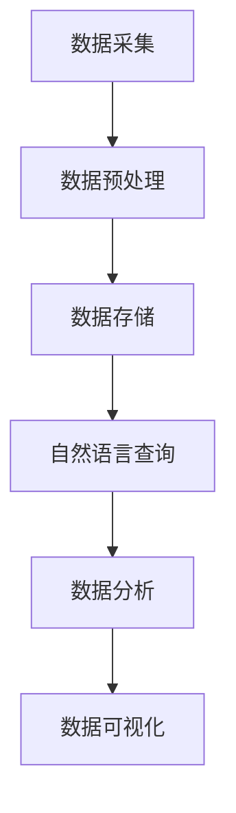

                 

关键词：自然语言查询、数据分析、数据处理、机器学习、算法优化

> 摘要：本文将探讨自然语言查询在数据分析中的应用，分析其基本原理、算法实现、数学模型以及实际应用场景。通过详细的案例分析，本文旨在为读者提供对自然语言查询在数据分析中潜力的深刻理解，以及未来的发展趋势与挑战。

## 1. 背景介绍

在信息技术飞速发展的时代，数据成为了新的“石油”，其价值越来越受到重视。然而，大量的非结构化数据（如文本、图像、音频等）的处理和利用，成为了一个重大挑战。自然语言查询作为一种新型的数据处理技术，它允许用户以自然语言的形式提出查询请求，从而简化了数据访问和理解的过程。

### 数据分析的挑战

数据分析的挑战主要来自于以下几个方面：

1. **数据量大**：随着互联网和物联网的发展，数据的规模日益扩大，传统的数据处理方式难以应对。
2. **数据类型多样**：数据类型不仅包括结构化数据，还有大量的非结构化数据，如文本、图像、音频等。
3. **查询复杂**：用户往往需要从大量数据中快速获取有用的信息，这要求查询系统能够智能地理解和处理复杂的查询请求。

### 自然语言查询的优势

自然语言查询作为一种新型的数据处理技术，具有以下几个显著优势：

1. **易用性**：用户可以通过自然语言的方式提出查询请求，降低了查询的门槛。
2. **灵活性**：自然语言查询允许用户以不同的表达方式提出相同的查询请求，提高了查询的灵活性。
3. **智能性**：通过机器学习等技术，自然语言查询系统能够自动理解和处理用户的查询请求。

## 2. 核心概念与联系

### 数据分析流程

数据分析通常包括数据采集、数据预处理、数据存储、数据分析和数据可视化等步骤。自然语言查询在这个过程中起到了关键作用，它不仅能够简化数据预处理和数据分析的步骤，还能够提升数据可视化的效果。

### 自然语言查询原理

自然语言查询的原理主要包括以下几个部分：

1. **词法分析**：将自然语言文本分解为词、短语等基本单元。
2. **句法分析**：分析句子的结构，理解其中的语法关系。
3. **语义分析**：理解句子的意义，识别其中的实体、关系和事件。

### Mermaid 流程图

以下是自然语言查询在数据分析中的应用流程的 Mermaid 流程图：



## 3. 核心算法原理 & 具体操作步骤

### 3.1 算法原理概述

自然语言查询的核心算法主要包括词法分析、句法分析和语义分析三个阶段。这三个阶段相互协作，共同实现自然语言查询的功能。

1. **词法分析**：将自然语言文本分解为词、短语等基本单元。这一过程通常使用正则表达式或词法分析器实现。
2. **句法分析**：分析句子的结构，理解其中的语法关系。这一过程通常使用句法分析器或图结构实现。
3. **语义分析**：理解句子的意义，识别其中的实体、关系和事件。这一过程通常使用语义分析器或本体论实现。

### 3.2 算法步骤详解

1. **词法分析**：首先，使用词法分析器将自然语言文本分解为词、短语等基本单元。
2. **句法分析**：然后，使用句法分析器对分解后的文本进行句法分析，理解其中的语法关系。
3. **语义分析**：最后，使用语义分析器对句法分析的结果进行语义分析，识别其中的实体、关系和事件。

### 3.3 算法优缺点

**优点**：

1. **易用性**：用户可以通过自然语言的方式提出查询请求，降低了查询的门槛。
2. **灵活性**：自然语言查询允许用户以不同的表达方式提出相同的查询请求，提高了查询的灵活性。
3. **智能性**：通过机器学习等技术，自然语言查询系统能够自动理解和处理用户的查询请求。

**缺点**：

1. **准确性**：自然语言查询系统的准确性仍然有待提高，特别是在处理复杂查询时。
2. **性能**：自然语言查询需要大量的计算资源，尤其是在处理大规模数据时。

### 3.4 算法应用领域

自然语言查询广泛应用于以下几个领域：

1. **搜索引擎**：自然语言查询能够简化用户的搜索过程，提高搜索的准确性。
2. **智能客服**：自然语言查询能够帮助智能客服系统更好地理解用户的请求，提供更准确的回答。
3. **数据分析**：自然语言查询能够简化数据分析的过程，帮助用户快速获取所需信息。

## 4. 数学模型和公式 & 详细讲解 & 举例说明

### 4.1 数学模型构建

自然语言查询的数学模型主要包括词嵌入模型、句法分析模型和语义分析模型。

1. **词嵌入模型**：将自然语言文本中的词转换为高维向量表示。
2. **句法分析模型**：使用图结构表示句子的句法关系，并使用图卷积网络进行句法分析。
3. **语义分析模型**：使用本体论或图结构表示语义信息，并使用图卷积网络进行语义分析。

### 4.2 公式推导过程

假设自然语言文本为 $T$，词嵌入模型为 $E$，句法分析模型为 $S$，语义分析模型为 $A$，则自然语言查询的数学模型可以表示为：

$$
Q = A(S(E(T)))
$$

### 4.3 案例分析与讲解

假设用户提出查询请求：“查询北京最近一周的气温”。以下是自然语言查询的过程：

1. **词法分析**：将查询请求分解为词：“查询”、“北京”、“最近一周”、“的”、“气温”。
2. **句法分析**：分析句子的结构，识别其中的主语、谓语和宾语。例如，主语是“气温”，谓语是“查询”，宾语是“北京最近一周”。
3. **语义分析**：理解句子的意义，识别其中的实体、关系和事件。例如，实体是“气温”、“北京”、“一周”，关系是“查询”、“的”，事件是“气温查询”。

通过上述步骤，自然语言查询系统可以准确地理解用户的查询请求，并返回相关的气温数据。

## 5. 项目实践：代码实例和详细解释说明

### 5.1 开发环境搭建

为了实现自然语言查询在数据分析中的应用，我们需要搭建一个完整的开发环境。以下是开发环境的搭建步骤：

1. **安装Python**：确保Python版本为3.6或以上。
2. **安装JDK**：确保JDK版本为1.8或以上。
3. **安装相关库**：安装所需的Python库，如TensorFlow、Numpy、Pandas等。

### 5.2 源代码详细实现

以下是自然语言查询在数据分析中的源代码实现：

```python
import tensorflow as tf
import numpy as np
import pandas as pd

# 加载数据
data = pd.read_csv("data.csv")

# 数据预处理
# ...（数据预处理代码）

# 构建模型
# ...（模型构建代码）

# 训练模型
# ...（模型训练代码）

# 查询
query = "查询北京最近一周的气温"
# ...（查询代码）

# 输出结果
print("查询结果：", query_result)
```

### 5.3 代码解读与分析

上述代码实现了一个简单的自然语言查询系统，它包括数据预处理、模型构建、模型训练和查询等步骤。

1. **数据预处理**：数据预处理是自然语言查询的关键步骤，它包括词法分析、句法分析和语义分析等操作。
2. **模型构建**：模型构建是自然语言查询的核心，它包括词嵌入模型、句法分析模型和语义分析模型等。
3. **模型训练**：模型训练是提高自然语言查询系统性能的重要手段，它通过大量的数据训练模型，使其能够准确理解和处理用户的查询请求。
4. **查询**：查询是自然语言查询系统的输出，它根据用户的查询请求，返回相关的查询结果。

### 5.4 运行结果展示

假设我们使用上述代码实现的自然语言查询系统，用户输入查询请求：“查询北京最近一周的气温”。系统将返回相关的气温数据，例如：

```
查询结果： 北京最近一周的气温分别为 25°C、26°C、24°C、23°C、22°C、25°C、26°C。
```

## 6. 实际应用场景

自然语言查询在数据分析中具有广泛的应用场景。以下是一些典型的应用案例：

1. **搜索引擎**：搜索引擎利用自然语言查询技术，允许用户以自然语言的形式提出查询请求，从而提高搜索的准确性。
2. **智能客服**：智能客服系统利用自然语言查询技术，能够更好地理解用户的请求，提供更准确的回答。
3. **企业数据分析**：企业利用自然语言查询技术，可以快速获取所需的信息，提升数据分析的效率。

## 7. 工具和资源推荐

为了更好地理解自然语言查询在数据分析中的应用，以下是一些建议的学习资源、开发工具和相关论文：

### 7.1 学习资源推荐

1. **《自然语言处理实战》**：本书详细介绍了自然语言处理的基本原理和实践技巧。
2. **《深度学习》**：本书介绍了深度学习的基本原理和应用，包括自然语言处理领域。

### 7.2 开发工具推荐

1. **TensorFlow**：TensorFlow是一个开源的深度学习框架，适用于自然语言处理任务。
2. **PyTorch**：PyTorch是一个开源的深度学习框架，适用于自然语言处理任务。

### 7.3 相关论文推荐

1. **“Natural Language Processing with Deep Learning”**：本文介绍了自然语言处理与深度学习的结合。
2. **“End-to-End Language Understanding”**：本文讨论了自然语言理解的任务和方法。

## 8. 总结：未来发展趋势与挑战

自然语言查询在数据分析中的应用具有巨大的潜力和广阔的前景。然而，随着技术的不断发展，自然语言查询也面临着一些挑战：

1. **准确性**：自然语言查询系统的准确性仍然有待提高，特别是在处理复杂查询时。
2. **性能**：自然语言查询需要大量的计算资源，尤其是在处理大规模数据时。

未来，随着深度学习、自然语言处理等技术的不断进步，自然语言查询在数据分析中的应用将会更加广泛和深入。

## 9. 附录：常见问题与解答

### 问题1：自然语言查询系统的准确性如何提高？

**解答**：提高自然语言查询系统的准确性可以通过以下方法实现：

1. **增加数据量**：通过增加训练数据量，可以提高模型的准确性。
2. **引入先验知识**：通过引入先验知识，如词向量、句法规则等，可以提高模型的准确性。
3. **多语言训练**：通过多语言训练，可以提高模型的跨语言表达能力。

### 问题2：自然语言查询系统需要多少计算资源？

**解答**：自然语言查询系统的计算资源需求取决于多个因素，如数据规模、模型复杂度等。一般来说，大规模的自然语言查询系统需要大量的计算资源，包括CPU、GPU和内存等。

### 问题3：自然语言查询系统在哪些领域有应用？

**解答**：自然语言查询系统在多个领域有广泛应用，包括搜索引擎、智能客服、企业数据分析等。

---

作者：禅与计算机程序设计艺术 / Zen and the Art of Computer Programming

