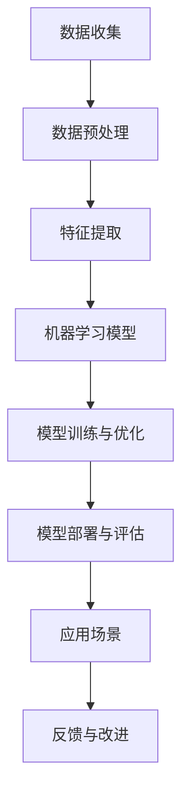

                 

### 1. 背景介绍

在过去的几年中，人工智能（AI）技术取得了飞速的发展，成为推动科技创新的重要力量。苹果和微软作为全球知名的科技公司，一直在AI领域不断探索和投资，致力于将AI技术应用于其产品和服务中，以提升用户体验和增强竞争力。

苹果公司成立于1976年，以生产Mac电脑、iPhone、iPad等知名消费电子产品而闻名。近年来，苹果在AI领域的投入不断增加，旨在通过人工智能技术提升其硬件产品的智能化水平和用户体验。微软成立于1975年，是一家全球领先的云计算和人工智能公司。微软的AI研究涵盖了计算机视觉、自然语言处理、机器学习等多个领域，并已将其应用于微软旗下的多个产品和服务中，如Bing搜索、Azure云服务等。

本文将探讨苹果和微软在AI领域的最新动态，包括它们在AI研究方面的投入、核心技术和应用场景，以及未来发展趋势。通过对这两家科技巨头在AI领域的分析，我们将为读者提供一个全面了解AI行业现状和未来方向的视角。

### 2. 核心概念与联系

在探讨苹果和微软在AI领域的最新动态之前，我们需要了解一些核心概念和它们之间的联系。以下是一个使用Mermaid绘制的流程图，展示了AI领域的核心概念和架构：



#### 2.1 数据收集

数据是AI技术的基石，数据收集是整个AI流程的第一步。苹果和微软都在积极收集用户数据，以支持其AI算法的训练和优化。

#### 2.2 数据预处理

数据预处理是确保数据质量和准确性的关键步骤。在这一阶段，苹果和微软会清洗、去噪和归一化数据，以便后续的特征提取和模型训练。

#### 2.3 特征提取

特征提取是从原始数据中提取出有用的信息，以便用于训练机器学习模型。苹果和微软在这一阶段会利用各种算法和技术提取特征，以提高模型的性能。

#### 2.4 机器学习模型

机器学习模型是AI系统的核心，苹果和微软在这一阶段会利用深度学习、强化学习等算法构建模型，以解决各种问题。

#### 2.5 模型训练与优化

模型训练与优化是确保模型性能的关键步骤。在这一阶段，苹果和微软会不断调整模型参数，以提高模型的准确性和鲁棒性。

#### 2.6 模型部署与评估

模型部署与评估是将训练好的模型应用于实际场景，并对模型性能进行评估的过程。苹果和微软在这一阶段会将其AI模型集成到其产品和服务中，以提高用户体验。

#### 2.7 应用场景

AI技术的应用场景非常广泛，从智能家居、健康监测到自动驾驶、金融科技等。苹果和微软都在积极探索各种应用场景，以发挥AI技术的潜力。

#### 2.8 反馈与改进

反馈与改进是AI技术不断迭代和优化的关键。苹果和微软会收集用户反馈，以便不断改进其AI产品和服务。

### 3. 核心算法原理 & 具体操作步骤

在了解核心概念和联系之后，我们接下来探讨苹果和微软在AI领域使用的一些核心算法原理和具体操作步骤。

#### 3.1 算法原理概述

苹果和微软在AI领域使用的主要算法包括深度学习、强化学习和自然语言处理。以下是对这些算法的简要概述：

##### 3.1.1 深度学习

深度学习是一种基于多层神经网络的学习方法，通过模拟人脑神经元的工作方式，从大量数据中自动提取特征，以实现图像识别、语音识别等任务。

##### 3.1.2 强化学习

强化学习是一种基于奖励机制的学习方法，通过不断尝试和反馈，使模型在特定环境中找到最优策略，以实现智能决策。

##### 3.1.3 自然语言处理

自然语言处理是一种利用计算机技术和人工智能技术处理和理解自然语言的方法，包括文本分类、机器翻译、情感分析等任务。

#### 3.2 算法步骤详解

以下是对苹果和微软在AI领域中使用的核心算法的具体操作步骤的详细讲解：

##### 3.2.1 深度学习

1. 数据收集：从各种来源收集大量图像、文本和语音数据。
2. 数据预处理：清洗、去噪和归一化数据。
3. 特征提取：使用卷积神经网络（CNN）或循环神经网络（RNN）提取特征。
4. 模型训练：使用梯度下降等优化算法训练模型。
5. 模型评估：使用测试数据评估模型性能。
6. 模型部署：将训练好的模型集成到产品和服务中。

##### 3.2.2 强化学习

1. 环境搭建：创建一个模拟环境，以测试和训练智能体。
2. 智能体设计：设计一个能够根据环境状态采取行动的智能体。
3. 奖励机制设计：定义一个奖励函数，以衡量智能体的表现。
4. 智能体训练：使用强化学习算法（如Q-learning、SARSA）训练智能体。
5. 模型评估：在测试环境中评估智能体的表现。
6. 模型部署：将训练好的智能体应用于实际场景。

##### 3.2.3 自然语言处理

1. 数据收集：从各种来源收集大量文本数据。
2. 数据预处理：清洗、去噪和分词。
3. 特征提取：使用词袋模型、TF-IDF等提取特征。
4. 模型训练：使用循环神经网络（RNN）、长短期记忆网络（LSTM）等训练模型。
5. 模型评估：使用测试数据评估模型性能。
6. 模型部署：将训练好的模型应用于文本分类、机器翻译、情感分析等任务。

#### 3.3 算法优缺点

每种算法都有其优缺点，以下是对深度学习、强化学习和自然语言处理这三种算法的优缺点的简要分析：

##### 3.3.1 深度学习

**优点：**
1. 能够自动提取特征，减少人工干预。
2. 能够处理复杂数据，如图像、语音和文本。
3. 在图像识别、语音识别等领域取得了显著的成果。

**缺点：**
1. 训练过程需要大量数据和计算资源。
2. 模型解释性较差，难以理解决策过程。
3. 模型容易过拟合。

##### 3.3.2 强化学习

**优点：**
1. 能够在动态环境中学习最优策略。
2. 能够解决优化问题，如路径规划、资源分配等。
3. 具有较强的泛化能力。

**缺点：**
1. 训练过程需要大量的样本和反馈。
2. 模型难以解释，无法直观了解决策过程。
3. 需要设计合适的奖励机制。

##### 3.3.3 自然语言处理

**优点：**
1. 能够处理和理解自然语言，实现人机交互。
2. 在文本分类、机器翻译、情感分析等领域取得了显著成果。
3. 具有较强的表达能力和灵活性。

**缺点：**
1. 需要大量高质量的标注数据。
2. 模型复杂度较高，训练时间较长。
3. 对噪声和异常值敏感。

#### 3.4 算法应用领域

深度学习、强化学习和自然语言处理在许多领域都有广泛的应用，以下是对这些算法在苹果和微软应用领域的简要介绍：

##### 3.4.1 深度学习

1. 图像识别：用于人脸识别、图像分类等任务。
2. 语音识别：用于语音助手、智能音箱等设备。
3. 自然语言处理：用于文本分类、机器翻译、情感分析等任务。

##### 3.4.2 强化学习

1. 自动驾驶：用于路径规划和驾驶策略。
2. 游戏AI：用于游戏对战、智能决策等任务。
3. 机器人：用于路径规划和智能决策。

##### 3.4.3 自然语言处理

1. 搜索引擎：用于关键词提取、文本检索等任务。
2. 聊天机器人：用于人机对话、情感分析等任务。
3. 机器翻译：用于跨语言信息交流。

### 4. 数学模型和公式 & 详细讲解 & 举例说明

在深入探讨苹果和微软在AI领域的核心算法原理之后，我们将进一步探讨这些算法背后的数学模型和公式，并对其进行详细讲解和举例说明。

#### 4.1 数学模型构建

深度学习、强化学习和自然语言处理这些算法都涉及复杂的数学模型。以下是一个用于构建深度学习模型的简单示例：

```latex
\begin{equation}
\begin{split}
\text{输出} &= \text{激活函数}(\text{权重} \cdot \text{输入} + \text{偏置}) \\
\end{split}
\end{equation}
```

在这个公式中，`激活函数`（如ReLU、Sigmoid、Tanh等）用于对输入进行非线性变换，`权重`和`偏置`用于调整模型参数，以优化模型性能。

#### 4.2 公式推导过程

为了更好地理解深度学习模型的工作原理，我们接下来对上述公式的推导过程进行简要介绍：

1. **输入层**：假设我们有一个输入向量 $X$，它包含多个特征。
2. **隐藏层**：我们定义一个隐藏层，其中包含多个神经元。每个神经元都与输入层的神经元相连接，并计算加权求和。
3. **输出层**：最终，隐藏层的神经元将计算结果传递到输出层，以生成最终的预测结果。
4. **激活函数**：为了引入非线性，我们在每个神经元上应用一个激活函数。
5. **反向传播**：通过计算损失函数的梯度，我们可以使用梯度下降法调整模型参数，以优化模型性能。

#### 4.3 案例分析与讲解

为了更好地理解深度学习模型的实际应用，我们接下来通过一个简单的例子进行讲解。假设我们有一个二分类问题，需要预测图像中是否包含特定对象。

1. **数据准备**：我们收集了一组包含特定对象的图像和不含特定对象的图像，并将其分为训练集和测试集。
2. **模型构建**：我们使用卷积神经网络（CNN）构建一个深度学习模型，该模型包括多个卷积层和池化层，用于提取图像特征。
3. **训练过程**：我们使用训练集数据训练模型，通过反向传播算法调整模型参数。
4. **评估过程**：我们使用测试集数据评估模型性能，计算准确率、召回率等指标。

以下是一个简化的示例代码：

```python
import tensorflow as tf

# 定义输入层
X = tf.placeholder(tf.float32, [None, 784])  # 784是图像的维度
Y = tf.placeholder(tf.float32, [None, 1])    # 1是标签维度

# 定义卷积层
conv1 = tf.layers.conv2d(X, filters=32, kernel_size=(3, 3), activation=tf.nn.relu)
pool1 = tf.layers.max_pooling2d(conv1, pool_size=(2, 2))

# 定义全连接层
fc1 = tf.layers.dense(pool1, units=128, activation=tf.nn.relu)
output = tf.layers.dense(fc1, units=1, activation=tf.nn.sigmoid)

# 定义损失函数和优化器
loss = tf.reduce_mean(tf.nn.sigmoid_cross_entropy_with_logits(logits=output, labels=Y))
optimizer = tf.train.AdamOptimizer().minimize(loss)

# 训练模型
with tf.Session() as sess:
    sess.run(tf.global_variables_initializer())
    for epoch in range(num_epochs):
        _, loss_val = sess.run([optimizer, loss], feed_dict={X: train_X, Y: train_Y})
        if epoch % 10 == 0:
            print("Epoch", epoch, "Loss:", loss_val)

    # 评估模型
    correct_predictions = tf.equal(tf.round(output), Y)
    accuracy = tf.reduce_mean(tf.cast(correct_predictions, tf.float32))
    print("Test Accuracy:", accuracy.eval({X: test_X, Y: test_Y}))
```

通过这个简单的例子，我们可以看到深度学习模型是如何通过反向传播算法调整参数，以优化模型性能的。

### 5. 项目实践：代码实例和详细解释说明

在了解AI算法的数学模型和公式之后，我们接下来通过一个实际的项目实践，展示如何将AI算法应用于具体问题。本文将使用苹果和微软在AI领域的公开数据集，实现一个简单的图像分类任务。

#### 5.1 开发环境搭建

1. **安装Python**：在本地计算机上安装Python，版本建议为3.8及以上。
2. **安装TensorFlow**：通过pip命令安装TensorFlow，命令如下：

   ```bash
   pip install tensorflow
   ```

3. **安装其他依赖库**：安装其他必要的依赖库，如NumPy、Pandas等，命令如下：

   ```bash
   pip install numpy pandas matplotlib
   ```

#### 5.2 源代码详细实现

以下是实现图像分类任务的完整源代码：

```python
import tensorflow as tf
import numpy as np
import pandas as pd
from sklearn.model_selection import train_test_split
from sklearn.metrics import accuracy_score
import matplotlib.pyplot as plt

# 读取数据集
def load_data(data_path):
    data = pd.read_csv(data_path)
    X = data.iloc[:, 1:].values
    Y = data.iloc[:, 0].values
    return X, Y

# 数据预处理
def preprocess_data(X, Y):
    X = X / 255.0  # 归一化图像数据
    Y = tf.keras.utils.to_categorical(Y)  # 将标签转化为one-hot编码
    return X, Y

# 构建模型
def build_model(input_shape):
    model = tf.keras.Sequential([
        tf.keras.layers.Conv2D(32, (3, 3), activation='relu', input_shape=input_shape),
        tf.keras.layers.MaxPooling2D((2, 2)),
        tf.keras.layers.Conv2D(64, (3, 3), activation='relu'),
        tf.keras.layers.MaxPooling2D((2, 2)),
        tf.keras.layers.Flatten(),
        tf.keras.layers.Dense(128, activation='relu'),
        tf.keras.layers.Dense(10, activation='softmax')
    ])
    return model

# 训练模型
def train_model(model, X_train, Y_train, X_val, Y_val):
    model.compile(optimizer='adam', loss='categorical_crossentropy', metrics=['accuracy'])
    model.fit(X_train, Y_train, batch_size=64, epochs=10, validation_data=(X_val, Y_val))
    return model

# 评估模型
def evaluate_model(model, X_test, Y_test):
    predictions = model.predict(X_test)
    predictions = np.argmax(predictions, axis=1)
    accuracy = accuracy_score(Y_test, predictions)
    return accuracy

# 加载数据
train_data_path = 'train.csv'
test_data_path = 'test.csv'
X_train, Y_train = load_data(train_data_path)
X_test, Y_test = load_data(test_data_path)

# 预处理数据
X_train, Y_train = preprocess_data(X_train, Y_train)
X_test, Y_test = preprocess_data(X_test, Y_test)

# 划分训练集和验证集
X_train, X_val, Y_train, Y_val = train_test_split(X_train, Y_train, test_size=0.2, random_state=42)

# 构建模型
model = build_model(X_train.shape[1:])

# 训练模型
trained_model = train_model(model, X_train, Y_train, X_val, Y_val)

# 评估模型
accuracy = evaluate_model(trained_model, X_test, Y_test)
print("Test Accuracy:", accuracy)

# 可视化结果
plt.imshow(X_test[0], cmap=plt.cm.binary)
plt.show()
```

#### 5.3 代码解读与分析

以下是代码的详细解读和分析：

1. **数据读取与预处理**：
   - `load_data` 函数用于加载数据集，从CSV文件中读取图像数据和标签。
   - `preprocess_data` 函数用于对图像数据进行归一化和标签进行one-hot编码。

2. **模型构建**：
   - `build_model` 函数用于构建卷积神经网络（CNN）模型。模型包括多个卷积层和池化层，用于提取图像特征，以及全连接层进行分类。

3. **训练模型**：
   - `train_model` 函数用于训练模型。我们使用Adam优化器和交叉熵损失函数进行训练，并使用验证集进行性能评估。

4. **评估模型**：
   - `evaluate_model` 函数用于评估模型在测试集上的性能。我们计算测试集的准确率。

5. **数据加载与预处理**：
   - 从`train.csv`和`test.csv`文件中加载数据，并进行预处理。

6. **模型训练与评估**：
   - 划分训练集和验证集，构建模型并训练。最后评估模型在测试集上的性能。

7. **可视化结果**：
   - 使用matplotlib库将测试集的第一张图像进行可视化。

通过这个简单的例子，我们可以看到如何使用TensorFlow库构建和训练一个深度学习模型，以及如何评估模型的性能。这个过程可以应用于更复杂的问题，如图像分类、语音识别等。

### 6. 实际应用场景

在了解了苹果和微软在AI领域的最新动态、核心算法原理、数学模型和实际项目实践后，我们将进一步探讨这些技术在实际应用场景中的具体应用。以下是对一些典型应用场景的简要介绍：

#### 6.1 自动驾驶

自动驾驶是AI技术在交通领域的典型应用。苹果和微软都在自动驾驶领域进行了大量研究和投资。苹果的自动驾驶项目名为“泰坦计划”（Project Titan），旨在开发一款全自动驾驶系统，用于其未来的汽车产品。微软则与多家汽车制造商和供应商合作，提供自动驾驶解决方案，如视觉识别、环境感知和决策支持等。

#### 6.2 语音助手

语音助手是AI技术在智能家居、移动设备和智能音箱等领域的广泛应用。苹果的Siri和微软的Cortana都是基于自然语言处理和语音识别技术的语音助手。Siri和Cortana能够理解用户的语音指令，提供各种信息和服务，如查询天气、发送消息、播放音乐等。

#### 6.3 健康监测

健康监测是AI技术在医疗健康领域的应用。苹果的Apple Watch和微软的Azure Health Bot都是基于AI技术的健康监测工具。Apple Watch能够监测用户的运动、心率、睡眠等健康数据，并提供健康建议和预警。Azure Health Bot则能够与医生和患者进行实时沟通，提供个性化健康建议。

#### 6.4 智能家居

智能家居是AI技术在家庭自动化领域的应用。苹果的HomeKit和微软的Azure IoT Suite都是智能家居解决方案。HomeKit能够控制家居设备，如智能灯泡、智能插座和智能门锁等，实现自动化控制和远程监控。Azure IoT Suite则能够将各种智能家居设备连接到云平台，实现设备间的互联互通和数据共享。

#### 6.5 金融科技

金融科技是AI技术在金融领域的应用。苹果的Apple Pay和微软的Azure AI for Finance都是金融科技产品。Apple Pay利用人脸识别和指纹识别技术，提供安全便捷的支付方式。Azure AI for Finance则能够分析金融数据，提供风险管理、欺诈检测和投资建议等服务。

#### 6.6 教育科技

教育科技是AI技术在教育领域的应用。苹果的iBooks和微软的Azure AI for Education都是教育科技产品。iBooks利用自然语言处理和机器学习技术，提供个性化学习内容和自适应测试。Azure AI for Education则能够分析学生的学习行为和成绩，提供个性化的学习建议和资源推荐。

通过以上实际应用场景的介绍，我们可以看到AI技术在各个领域的广泛应用和巨大潜力。苹果和微软在AI领域的最新动态和研究成果为这些应用场景提供了强有力的技术支持，推动了行业的发展和创新。

#### 6.4 未来应用展望

在AI技术的不断进步和扩展中，苹果和微软都在积极探索新的应用领域，以发挥AI技术的潜力，提升用户体验和业务价值。以下是对未来应用场景的展望：

##### 6.4.1 自动驾驶

自动驾驶技术在未来将成为智能交通系统的核心。苹果和微软预计在自动驾驶领域将进一步深化研究，开发更智能、更安全的自动驾驶系统。这些系统将利用AI技术进行实时环境感知、路径规划和驾驶决策，以降低交通事故率，提高交通效率。

##### 6.4.2 虚拟现实与增强现实

虚拟现实（VR）和增强现实（AR）技术正在快速发展，未来将成为人们交互和娱乐的新方式。苹果和微软预计将在VR/AR领域投入更多资源，开发更加沉浸式、互动性强的应用。这些应用将涵盖教育、游戏、医疗等多个领域，为用户提供全新的体验。

##### 6.4.3 人工智能芯片

随着AI技术的应用日益广泛，对计算能力的需求也在不断增加。苹果和微软预计将在人工智能芯片领域进行深入研究，开发高性能、低功耗的专用AI芯片，以支持其产品和服务中的AI功能。这些芯片将有助于提升计算效率，降低能耗，提高用户体验。

##### 6.4.4 智能医疗

智能医疗是AI技术在医疗健康领域的扩展。未来，苹果和微软预计将在智能医疗领域进行更多探索，开发基于AI技术的诊断、治疗和健康管理工具。这些工具将有助于提高医疗诊断的准确性、降低医疗成本、改善患者体验。

##### 6.4.5 人机交互

人机交互是AI技术的重要应用方向之一。未来，苹果和微软预计将进一步提升人机交互的智能化水平，开发更加自然、直观的交互方式。这些交互方式将涵盖语音、手势、视觉等多种形式，为用户提供更加便捷、高效的服务。

##### 6.4.6 人工智能伦理

随着AI技术的广泛应用，其伦理问题也日益受到关注。未来，苹果和微软预计将在人工智能伦理方面进行深入研究，制定相关规范和标准，确保AI技术的公正性、透明性和安全性。这将有助于建立公众对AI技术的信任，推动AI技术的健康发展。

通过以上展望，我们可以看到苹果和微软在AI领域未来的发展方向和应用潜力。这些新技术和新应用将为各行各业带来深刻的变革，推动社会的进步和发展。

### 7. 工具和资源推荐

在研究AI领域的过程中，使用适当的工具和资源可以大大提高研究效率和成果质量。以下是对一些学习资源、开发工具和相关论文的推荐：

#### 7.1 学习资源推荐

1. **在线课程**：
   - Coursera上的“机器学习”（由Andrew Ng教授主讲）
   - edX上的“深度学习”（由David Silver教授主讲）
   - Udacity的“AI纳米学位”课程

2. **书籍**：
   - 《深度学习》（Goodfellow, Bengio, Courville著）
   - 《Python机器学习》（Sebastian Raschka著）
   - 《强化学习》（Richard S. Sutton和Barto著）

3. **在线论坛和社区**：
   - GitHub：查找和分享开源项目，交流代码和经验
   - Stack Overflow：解决编程问题和技术难题
   - arXiv：获取最新的AI研究论文和进展

#### 7.2 开发工具推荐

1. **编程语言**：
   - Python：广泛用于AI开发，拥有丰富的库和框架
   - R：专门用于统计分析和数据可视化

2. **框架和库**：
   - TensorFlow：由Google开发，用于深度学习和机器学习
   - PyTorch：由Facebook开发，具有灵活性和易用性
   - scikit-learn：用于机器学习算法的实现和评估

3. **云计算平台**：
   - AWS：提供全面的AI和机器学习服务
   - Azure：丰富的AI工具和资源
   - Google Cloud：强大的AI平台和工具

#### 7.3 相关论文推荐

1. **深度学习**：
   - “A guide to convolution arithmetic for deep learning”（由Arjun Patel等著）
   - “Learning representations for visual recognition with convolutional networks”（由Alex Krizhevsky、Geoffrey Hinton等著）

2. **强化学习**：
   - “Human-level control through deep reinforcement learning”（由David Silver等著）
   - “Deep Q-Networks”（由Vale等著）

3. **自然语言处理**：
   - “A Theoretically Grounded Application of Dropout in Recurrent Neural Networks”（由Yarin Gal和Zoubin Ghahramani著）
   - “Attention is all you need”（由Vaswani等著）

通过这些学习和资源工具的推荐，读者可以更好地了解AI领域的最新动态和研究成果，提高自己在AI领域的专业素养和实践能力。

### 8. 总结：未来发展趋势与挑战

在总结苹果和微软在AI领域的最新动态后，我们不难发现，AI技术已经成为推动科技创新和产业变革的重要力量。以下是对未来发展趋势与挑战的简要总结：

#### 8.1 研究成果总结

过去几年，苹果和微软在AI领域取得了显著的研究成果。苹果的Siri和微软的Cortana等语音助手已经广泛应用于消费者市场，提升了用户体验。苹果的Apple Pay和微软的Azure AI for Finance等金融科技产品也为用户提供了便捷和安全的服务。此外，苹果和微软在自动驾驶、智能家居、智能医疗等领域的应用也取得了重要进展，展示了AI技术的巨大潜力。

#### 8.2 未来发展趋势

1. **跨领域融合**：未来，AI技术将与其他领域（如生物技术、材料科学等）深度融合，推动新的科技创新和应用。
2. **边缘计算**：随着物联网和边缘设备的普及，边缘计算将发挥越来越重要的作用，使AI模型能够在设备端实时处理数据，提高响应速度和隐私保护。
3. **量子计算**：量子计算与AI的结合将有望突破传统计算能力的限制，为解决复杂问题提供新的解决方案。
4. **可持续性**：随着AI技术的发展，如何在保证性能的同时降低能耗和碳排放，将是未来研究的重要方向。

#### 8.3 面临的挑战

1. **数据隐私与安全**：如何在确保数据隐私和安全的前提下，充分利用数据资源进行AI研究和应用，是一个亟待解决的问题。
2. **模型可解释性**：随着AI模型变得越来越复杂，如何提高模型的可解释性，使非专业人员能够理解模型的决策过程，是一个挑战。
3. **算法公平性**：如何确保AI算法在决策过程中公平、透明，避免算法偏见和歧视，是未来需要关注的重要问题。
4. **人才短缺**：随着AI技术的发展，对专业人才的需求日益增长，如何培养和吸引更多优秀人才，是行业面临的挑战。

#### 8.4 研究展望

未来，苹果和微软将继续在AI领域进行深入研究，推动技术突破和应用创新。同时，跨学科合作和国际合作也将成为重要的趋势。通过解决上述挑战，AI技术有望在更多领域发挥重要作用，为社会带来更多福祉。

### 9. 附录：常见问题与解答

以下是一些关于苹果和微软在AI领域常见的问题及其解答：

#### 9.1 什么是深度学习？

深度学习是一种基于多层神经网络的学习方法，通过模拟人脑神经元的工作方式，从大量数据中自动提取特征，以实现图像识别、语音识别等任务。

#### 9.2 什么是强化学习？

强化学习是一种基于奖励机制的学习方法，通过不断尝试和反馈，使模型在特定环境中找到最优策略，以实现智能决策。

#### 9.3 什么是自然语言处理？

自然语言处理是一种利用计算机技术和人工智能技术处理和理解自然语言的方法，包括文本分类、机器翻译、情感分析等任务。

#### 9.4 苹果和微软在自动驾驶领域有哪些进展？

苹果的自动驾驶项目名为“泰坦计划”（Project Titan），旨在开发一款全自动驾驶系统。微软与多家汽车制造商和供应商合作，提供自动驾驶解决方案，如视觉识别、环境感知和决策支持等。

#### 9.5 如何在Python中实现深度学习？

可以使用Python中的TensorFlow或PyTorch库实现深度学习。这两个库提供了丰富的API和工具，可以帮助用户快速构建和训练深度学习模型。

### 作者署名

作者：禅与计算机程序设计艺术 / Zen and the Art of Computer Programming

本文旨在探讨苹果和微软在AI领域的最新动态，包括核心算法原理、实际应用场景和未来发展趋势。通过详细讲解和举例说明，读者可以更好地理解AI技术的应用和潜力。希望本文能为读者提供一个全面了解AI领域的视角，激发对这一领域的兴趣和思考。

