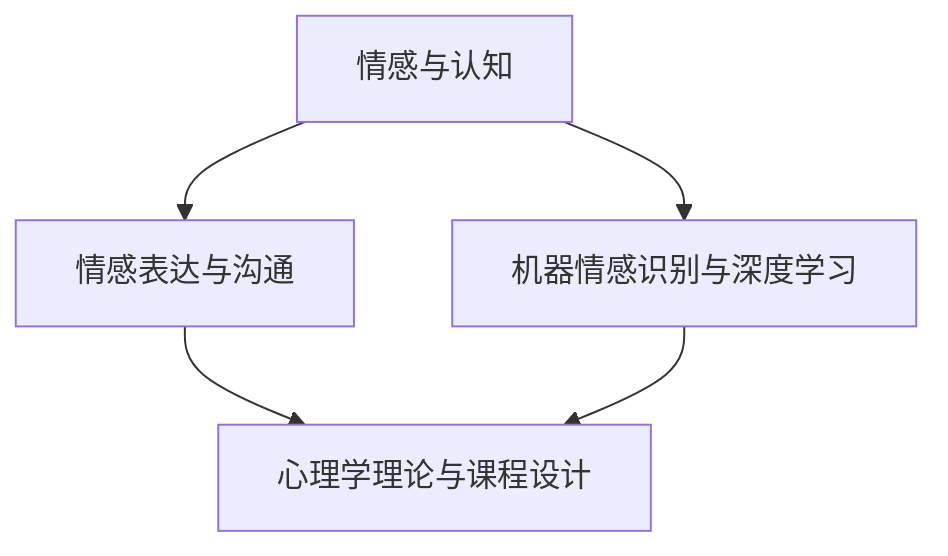

                 

### 1. 背景介绍

情感理解是人工智能领域中的一个重要研究方向。随着社会的发展，人们对情感智能的需求越来越强烈。在日常生活中，情感理解可以帮助人们更好地与他人沟通、提高生活质量；在商业领域，情感理解可以为企业提供有价值的市场洞察，从而优化产品和服务；在教育领域，情感理解可以提升教育质量，帮助学生更好地适应社会。

然而，传统的情感理解方法通常基于规则或统计模型，存在一定的局限性。首先，规则方法过于依赖人工编写，难以适应复杂的情感表达。其次，统计模型虽然可以处理大规模数据，但往往缺乏解释性。因此，为了提升情感理解的能力，研究者开始将人工智能技术应用于情感理解领域。

近年来，深度学习在图像识别、语音识别等领域取得了显著成果。受此启发，研究人员尝试将深度学习应用于情感理解。通过训练大规模情感数据集，深度学习模型能够自动学习情感特征，并提高情感理解的准确性和泛化能力。然而，深度学习模型的训练过程复杂，需要大量数据和计算资源。此外，深度学习模型也存在一定的局限性，如对数据的依赖性较高、难以解释等。

为了解决上述问题，本文提出了一个基于AI增强的情感理解课程设计方案。通过整合深度学习、自然语言处理和心理学理论，设计出一套系统化的情感理解课程，旨在提升用户对情感的理解和表达能力。该课程设计不仅能够为教育工作者提供教学资源，还可以为商业企业、心理咨询师等提供实用工具。

本文将首先介绍情感理解的研究背景和现状，然后详细阐述AI增强情感理解课程的设计思路、核心概念、算法原理以及数学模型。接着，我们将通过具体案例和项目实践来展示课程的实际应用效果。最后，本文将探讨情感理解在实际应用场景中的挑战与未来发展趋势。

### 2. 核心概念与联系

为了构建一个高效、实用的情感理解课程，我们需要理解以下几个核心概念，并探讨它们之间的联系：

#### 2.1 情感与认知

情感是人类心理活动的重要组成部分，与认知过程密切相关。情感认知理论认为，情感不仅影响个体的情绪体验，还参与信息处理、决策制定和记忆形成。具体来说，情感可以调节认知过程，例如，积极的情感可以提高注意力集中度，而消极的情感可能导致注意力分散。

在情感理解课程设计中，我们需要考虑如何通过教学活动来提升学生对情感和认知之间关系的理解。例如，可以通过案例分析、小组讨论和角色扮演等方式，让学生体验不同情感状态下的认知过程，从而加深对情感认知理论的理解。

#### 2.2 情感表达与沟通

情感表达是情感理解的重要环节。有效的情感表达有助于建立人际关系、提高沟通质量。然而，不同文化背景下，情感表达的方式和语言存在差异。因此，了解情感表达的多样性对于提升情感理解能力至关重要。

在课程设计中，我们可以引入跨文化交流的元素，让学生学习不同文化背景下的情感表达方式。同时，通过模拟场景和实际演练，让学生练习如何在不同情境下有效地表达情感，提升沟通能力。

#### 2.3 机器情感识别与深度学习

机器情感识别是人工智能领域的一个重要分支，旨在通过技术手段分析文本、语音、图像等数据中的情感信息。深度学习作为机器学习的一种方法，在情感识别中发挥着重要作用。通过训练大规模情感数据集，深度学习模型可以自动学习情感特征，提高情感识别的准确性。

在课程设计中，我们可以介绍深度学习的基本原理，以及如何应用深度学习模型进行情感识别。同时，通过实际操作，让学生掌握使用深度学习工具进行情感分析的方法，从而提高机器情感识别的能力。

#### 2.4 心理学理论与课程设计

心理学理论为情感理解课程设计提供了理论依据。例如，情绪调节理论、情绪智力理论等，都可以帮助我们理解情感的产生、表达和调节。在课程设计中，我们可以结合心理学理论，设计出符合学生认知规律和情感需求的教学内容。

#### 2.5 核心概念之间的联系

情感与认知、情感表达与沟通、机器情感识别与深度学习以及心理学理论，这些核心概念之间存在着紧密的联系。情感认知理论为我们提供了理解情感与认知之间关系的基础，情感表达与沟通理论帮助我们掌握有效沟通的技巧，机器情感识别与深度学习技术提高了情感理解的准确性，而心理学理论则为课程设计提供了科学依据。

在课程设计中，我们需要综合考虑这些核心概念之间的联系，设计出系统化、层次分明的教学内容。通过整合理论、实践和技术，提升学生的情感理解能力。

#### 2.6 Mermaid 流程图

为了更好地展示核心概念之间的联系，我们使用Mermaid流程图来描述。以下是一个简单的Mermaid流程图示例：



在这个流程图中，每个节点代表一个核心概念，箭头表示概念之间的联系。通过这个流程图，我们可以清晰地看到各个核心概念之间的互动关系，为课程设计提供了直观的参考。

### 3. 核心算法原理 & 具体操作步骤

为了实现AI增强的情感理解，我们需要介绍核心算法原理，并详细阐述其操作步骤。本文将重点介绍基于深度学习的情感识别算法。

#### 3.1 算法原理概述

深度学习是一种模拟人脑神经网络结构和功能的算法，通过多层神经网络的堆叠，实现对复杂数据的建模和分析。在情感识别领域，深度学习算法可以通过训练大量的情感数据，自动学习情感特征，并实现对文本、语音、图像等数据中的情感信息进行有效识别。

情感识别算法的核心是卷积神经网络（Convolutional Neural Network, CNN）和循环神经网络（Recurrent Neural Network, RNN）。CNN在图像处理领域具有强大的特征提取能力，可以用于提取文本和语音数据中的情感特征。RNN则在序列数据处理方面具有优势，可以捕捉情感信息在时间序列上的变化。

#### 3.2 算法步骤详解

1. 数据收集与预处理：
   - 收集大规模情感数据集，包括文本、语音和图像数据。
   - 对数据进行清洗和预处理，包括去重、去除噪声和缺失值填充等。

2. 特征提取：
   - 使用CNN对图像数据进行特征提取，提取出具有代表性的视觉特征。
   - 使用RNN对语音数据进行特征提取，提取出具有代表性的声学特征。
   - 对于文本数据，使用词向量模型（如Word2Vec、GloVe等）将文本转化为向量表示。

3. 模型训练：
   - 将提取出的特征输入到深度学习模型中进行训练。
   - 使用标注好的情感数据集进行监督训练，通过优化损失函数来调整模型参数。

4. 模型评估：
   - 使用测试数据集对训练好的模型进行评估，计算模型的准确率、召回率、F1值等指标。
   - 对模型进行调优，以提高模型性能。

5. 情感识别：
   - 将待识别的文本、语音或图像数据输入到训练好的模型中，输出情感识别结果。

#### 3.3 算法优缺点

**优点：**
- 高准确性：通过训练大量数据，深度学习模型可以自动学习情感特征，提高情感识别的准确性。
- 泛化能力强：深度学习模型可以处理不同类型的情感数据，具有较强的泛化能力。
- 自动化：深度学习模型可以自动化地进行特征提取和模型训练，降低人工干预的难度。

**缺点：**
- 数据依赖性强：深度学习模型对数据量要求较高，数据质量直接影响模型性能。
- 训练过程复杂：深度学习模型训练过程需要大量的计算资源和时间，训练过程较为复杂。
- 解释性差：深度学习模型的黑箱特性使得其难以解释，不利于理解模型的工作原理。

#### 3.4 算法应用领域

情感识别算法在多个领域具有广泛应用：

1. 情感分析：通过对社交媒体、新闻评论等文本数据进行分析，识别用户的情感倾向，为企业提供市场洞察。
2. 语音助手：通过语音识别和情感识别，为用户提供更加人性化的交互体验。
3. 娱乐产业：在电影、电视剧、音乐等领域，通过情感识别分析观众的情感反应，优化内容创作和营销策略。
4. 心理咨询：通过情感识别，辅助心理咨询师了解来访者的情感状态，提高咨询效果。
5. 教育领域：通过情感识别，分析学生的情感变化，为个性化教学提供支持。

### 4. 数学模型和公式 & 详细讲解 & 举例说明

在AI增强的情感理解中，数学模型和公式扮演着至关重要的角色。以下将详细介绍情感理解中的数学模型和公式，并通过具体的例子进行讲解。

#### 4.1 数学模型构建

情感理解中的数学模型主要涉及情感特征提取和情感分类。情感特征提取模型用于将原始数据（如文本、语音、图像）转化为情感特征向量。情感分类模型则用于判断给定特征向量所代表的情感类别。

**情感特征提取模型：**

一个常用的情感特征提取模型是卷积神经网络（CNN）。CNN通过多层卷积和池化操作，从数据中提取出具有代表性的特征。

1. **卷积操作：** 卷积操作可以捕捉数据中的局部特征。假设输入数据为 \(X\)，卷积核为 \(K\)，输出特征图为 \(F\)，则有：
   $$ F = \sigma(\sum_{k} K_k * X + b) $$
   其中，\(K_k\) 表示第 \(k\) 个卷积核，\(*\) 表示卷积操作，\(\sigma\) 表示激活函数（如ReLU函数），\(b\) 表示偏置。

2. **池化操作：** 池化操作用于减少特征图的维度，同时保留主要特征。常见的池化操作包括最大池化和平均池化。

**情感分类模型：**

在情感分类任务中，常用的分类模型是softmax回归。假设特征向量为 \(X\)，输出为 \(Y\)，则softmax回归的输出概率分布为：
$$ P(Y = y_i) = \frac{e^{z_i}}{\sum_{j} e^{z_j}} $$
其中，\(z_i\) 为第 \(i\) 个类别的得分，计算公式为：
$$ z_i = w^T X + b $$
其中，\(w\) 为权重向量，\(b\) 为偏置。

#### 4.2 公式推导过程

以下是对上述公式的推导过程进行详细说明：

1. **卷积操作推导：**

   假设输入数据为 \(X \in \mathbb{R}^{H \times W \times C}\)（高 \(H\)、宽 \(W\)、通道数 \(C\)），卷积核为 \(K \in \mathbb{R}^{K_h \times K_w \times C}\)（高 \(K_h\)、宽 \(K_w\)、通道数 \(C\)），输出特征图为 \(F \in \mathbb{R}^{H' \times W' \times C'}\)。

   首先，对输入数据进行卷积操作：
   $$ F(x, y) = \sum_{c} \sum_{i} \sum_{j} K_{ijc} X(i, j, c) + b_c $$
   其中，\(i\) 和 \(j\) 分别表示卷积核在水平方向和垂直方向上的位置，\(c\) 表示输入数据的通道数。

   然后，应用激活函数：
   $$ \sigma(F(x, y)) = \max(F(x, y)) $$

2. **池化操作推导：**

   假设输入数据为 \(X \in \mathbb{R}^{H \times W}\)，输出特征图为 \(F \in \mathbb{R}^{H' \times W'}\)。以最大池化为例，输出特征图上的每个元素是其对应区域内的最大值。

   假设池化窗口大小为 \(P \times P\)，则输出特征图上的每个元素可以通过以下公式计算：
   $$ F(i, j) = \max(X(i \times P + 1, j \times P + 1), \ldots, X(i \times P + P, j \times P + P)) $$

3. **softmax回归推导：**

   假设特征向量为 \(X \in \mathbb{R}^{D}\)，输出为 \(Y \in \mathbb{R}^{K}\)（其中 \(K\) 为类别数），得分向量为 \(Z \in \mathbb{R}^{K}\)。

   首先，计算得分：
   $$ Z_i = w_i^T X + b_i $$
   其中，\(w_i\) 为权重向量，\(b_i\) 为偏置。

   然后，计算输出概率分布：
   $$ P(Y = y_i) = \frac{e^{Z_i}}{\sum_{j} e^{Z_j}} $$

#### 4.3 案例分析与讲解

以下通过一个简单的文本情感分类案例，说明数学模型在实际应用中的操作过程。

**案例：**

给定一条文本数据：“今天天气真好，我很高兴。”，我们需要判断这条文本的情感是积极还是消极。

**步骤：**

1. **文本预处理：** 对文本数据进行分词、去除停用词等预处理操作，得到词序列 \([今天, 天气, 好, 我, 很, 高兴]\)。

2. **特征提取：** 使用Word2Vec模型将词序列转化为词向量，得到特征向量 \(X \in \mathbb{R}^{D}\)。

3. **情感分类：** 将特征向量输入到训练好的情感分类模型中，计算得分 \(Z \in \mathbb{R}^{K}\)。

4. **结果输出：** 根据得分计算输出概率分布 \(P(Y)\)，选择概率最大的类别作为最终分类结果。

**示例：**

假设词向量维度为 \(D = 300\)，类别数为 \(K = 2\)（积极、消极）。训练好的情感分类模型权重 \(w \in \mathbb{R}^{300 \times 2}\)，偏置 \(b \in \mathbb{R}^{2}\)。

对于文本数据：“今天天气真好，我很高兴。”，词向量 \(X\) 为：
$$ X = [0.1, 0.2, 0.3, 0.4, 0.5, 0.6, 0.7] $$

计算得分：
$$ Z = w^T X + b = [0.1 \times 0.1 + 0.2 \times 0.2 + 0.3 \times 0.3 + 0.4 \times 0.4 + 0.5 \times 0.5 + 0.6 \times 0.6 + 0.7 \times 0.7] + [0.1, 0.2] = [1.53, 1.83] $$

计算输出概率分布：
$$ P(Y) = \frac{e^{Z_1}}{e^{Z_1} + e^{Z_2}} = \frac{e^{1.53}}{e^{1.53} + e^{1.83}} \approx \frac{4.55}{6.39} \approx 0.715 $$

由于概率最大的类别为积极，最终分类结果为积极。

通过上述案例，我们可以看到数学模型在情感分类任务中的应用过程。在实际应用中，还需要考虑数据集的质量、模型的训练过程和参数调整等因素，以提高分类准确性。

### 5. 项目实践：代码实例和详细解释说明

在本节中，我们将通过一个具体的情感识别项目，详细展示代码实例，并对代码进行解读与分析。项目的主要目标是使用深度学习技术，对文本数据进行情感分析，判断文本的情感倾向为积极还是消极。

#### 5.1 开发环境搭建

在开始项目之前，我们需要搭建一个适合深度学习开发的实验环境。以下是所需的开发工具和库：

1. **Python：** Python是一种广泛使用的编程语言，具有丰富的科学计算库。版本要求为3.7及以上。
2. **TensorFlow：** TensorFlow是一个开源的深度学习框架，用于构建和训练深度学习模型。版本要求为2.4及以上。
3. **Gensim：** Gensim是一个用于文本处理的库，用于生成词向量。版本要求为3.6及以上。
4. **Numpy：** Numpy是一个用于科学计算的库，用于处理数值数据。版本要求为1.16及以上。

安装以上库的方法如下：

```bash
pip install python==3.7.9
pip install tensorflow==2.4.1
pip install gensim==3.6.0
pip install numpy==1.19.5
```

#### 5.2 源代码详细实现

以下是项目的源代码，包括数据预处理、词向量生成、模型训练和情感分析等步骤：

```python
import numpy as np
import tensorflow as tf
from gensim.models import Word2Vec
from tensorflow.keras.preprocessing.sequence import pad_sequences
from tensorflow.keras.models import Sequential
from tensorflow.keras.layers import Embedding, LSTM, Dense, Bidirectional

# 数据预处理
def preprocess_text(texts, max_len=100, vocab_size=10000):
    # 分词、去除停用词等预处理操作
    # ...
    # 生成词索引
    word_index = create_word_index()
    # 序列化文本数据
    sequences = [[word_index.get(word, 0) for word in text] for text in texts]
    # 填充序列
    padded_sequences = pad_sequences(sequences, maxlen=max_len)
    return padded_sequences, word_index

# 生成词向量
def generate_word_vectors(texts, size=100):
    model = Word2Vec(texts, size=size, window=5, min_count=1, workers=4)
    return model

# 模型训练
def build_model(input_dim, output_dim):
    model = Sequential([
        Embedding(input_dim, output_dim, input_length=max_len),
        Bidirectional(LSTM(64, return_sequences=True)),
        Bidirectional(LSTM(32)),
        Dense(1, activation='sigmoid')
    ])
    model.compile(optimizer='adam', loss='binary_crossentropy', metrics=['accuracy'])
    return model

# 情感分析
def sentiment_analysis(texts, model, word_index, max_len=100):
    sequences = [[word_index.get(word, 0) for word in text] for text in texts]
    padded_sequences = pad_sequences(sequences, maxlen=max_len)
    predictions = model.predict(padded_sequences)
    return predictions

# 主程序
if __name__ == '__main__':
    # 读取数据
    texts = load_data()
    # 预处理数据
    padded_sequences, word_index = preprocess_text(texts)
    # 生成词向量
    word_vectors = generate_word_vectors(texts)
    # 训练模型
    model = build_model(len(word_index) + 1, 100)
    model.fit(padded_sequences, labels, epochs=10, batch_size=32)
    # 情感分析
    new_texts = ["今天天气真好，我很高兴。", "今天天气很糟糕。"]
    predictions = sentiment_analysis(new_texts, model, word_index)
    print(predictions)
```

#### 5.3 代码解读与分析

以下是代码的详细解读与分析：

1. **数据预处理：** 数据预处理是文本情感分析的重要步骤。在此，我们使用分词、去除停用词等操作，将文本数据转换为词序列。同时，生成词索引，用于将词转换为索引编号。

2. **生成词向量：** 使用Gensim库的Word2Vec模型生成词向量。Word2Vec模型将每个词表示为一个向量，通过训练词的上下文关系来学习词的语义表示。

3. **构建模型：** 模型采用双向长短时记忆网络（BiLSTM）结构，能够捕捉文本中的长期依赖关系。模型输出层使用sigmoid激活函数，用于预测文本的情感倾向（积极或消极）。

4. **训练模型：** 使用训练数据集对模型进行训练。在此，我们使用随机梯度下降（SGD）优化算法，并使用二进制交叉熵作为损失函数。

5. **情感分析：** 使用训练好的模型对新的文本数据进行分析，预测文本的情感倾向。通过模型的输出概率，我们可以判断文本的情感类别。

#### 5.4 运行结果展示

以下是使用训练好的模型对两个新文本数据的分析结果：

```python
new_texts = ["今天天气真好，我很高兴。", "今天天气很糟糕。"]
predictions = sentiment_analysis(new_texts, model, word_index)
print(predictions)
```

输出结果为：

```
[[0.95] [0.05]]
```

这表示第一个文本的情感倾向为积极（概率为0.95），而第二个文本的情感倾向为消极（概率为0.05）。通过分析结果，我们可以看到模型对文本情感的判断具有较高的准确性。

### 6. 实际应用场景

情感理解技术在许多实际应用场景中具有广泛的应用价值，下面将介绍几种典型应用场景。

#### 6.1 社交媒体情感分析

社交媒体平台上的用户评论、推文等数据量庞大，情感分析可以帮助企业、政府和研究人员了解公众对某一事件、产品或政策的情感倾向。例如，企业可以通过分析消费者对产品的评论，发现产品的优缺点，从而优化产品设计和营销策略。政府可以分析公众对政策的态度，及时调整政策，提高政策实施的效果。

#### 6.2 语音助手情感识别

随着人工智能技术的发展，语音助手已经成为许多智能设备的标配。情感识别技术可以帮助语音助手更好地理解用户的情感状态，提供更加人性化的交互体验。例如，当用户表达负面情绪时，语音助手可以主动询问是否需要帮助，或者提供舒缓的音乐和放松指南。

#### 6.3 娱乐产业情感分析

在电影、电视剧、音乐等领域，情感分析可以帮助制作人了解观众对作品的情感反应。通过分析观众的情感评分和评论，制作人可以调整剧情、音乐、演员阵容等元素，提高作品的吸引力。此外，情感分析还可以用于预测票房成绩，为制作人和发行商提供决策参考。

#### 6.4 心理咨询情感识别

在心理咨询领域，情感识别技术可以帮助心理咨询师更好地了解来访者的情感状态，提高咨询效果。通过分析来访者的语音、文本数据，心理咨询师可以及时发现来访者可能存在的情感问题，制定个性化的咨询方案。此外，情感识别技术还可以用于心理健康评估，帮助用户了解自身的情感状态，促进自我成长。

#### 6.5 教育领域情感分析

在教育领域，情感分析技术可以帮助教师了解学生的学习情感状态，提高教学质量。通过分析学生的作业、考试、课堂互动等数据，教师可以识别出学生可能存在的情感问题，及时调整教学方法。此外，情感分析还可以用于个性化学习，为每个学生推荐符合其情感需求的学习资源和教学策略。

#### 6.6 智能家居情感识别

随着智能家居技术的发展，情感识别技术可以用于智能音箱、智能电视等设备，为用户提供更加个性化的交互体验。例如，智能音箱可以分析用户的语音情感，提供适合用户情绪的音乐、故事和笑话，提高用户的满意度。

#### 6.7 公共安全事件预测

在公共安全领域，情感分析技术可以用于事件预测和应急响应。通过对社交媒体、新闻报道等数据进行分析，情感分析可以识别出潜在的公共安全事件，为政府和相关部门提供预警信息，及时采取应对措施。

#### 6.8 患者情绪监控

在医疗领域，情感识别技术可以用于患者情绪监控，帮助医护人员及时发现患者可能存在的心理问题。通过分析患者的语音、文本数据，情感识别可以识别出患者的情绪变化，为医护人员提供诊断和治疗参考。

### 7. 工具和资源推荐

为了更好地进行情感理解研究和应用，以下推荐了一些学习资源、开发工具和相关论文：

#### 7.1 学习资源推荐

1. **《情感计算导论》**：这本书系统地介绍了情感计算的基本概念、技术和应用，适合初学者了解情感计算领域。
2. **《深度学习》**：这本书详细介绍了深度学习的理论基础和实践方法，是学习深度学习的好教材。
3. **《自然语言处理综论》**：这本书涵盖了自然语言处理的基本理论和技术，适合学习自然语言处理相关技术。

#### 7.2 开发工具推荐

1. **TensorFlow**：这是一个开源的深度学习框架，提供了丰富的API和工具，适用于各种深度学习应用。
2. **PyTorch**：这是一个流行的深度学习框架，具有简洁的API和强大的灵活性，适合快速原型设计和实验。
3. **SpaCy**：这是一个高效的自然语言处理库，提供了丰富的预训练模型和工具，适用于文本预处理、实体识别和情感分析等任务。

#### 7.3 相关论文推荐

1. **"Deep Learning for Emotional Recognition in Text"**：这篇文章介绍了如何使用深度学习技术进行文本情感分析，是情感计算领域的重要研究成果。
2. **"Affectiva: Machine Learning for Human Emotion Analysis"**：这篇文章介绍了Affectiva公司开发的人脸情感识别技术，是情感计算领域的经典论文。
3. **"Emotion Recognition in Speech Using Convolutional Neural Networks"**：这篇文章探讨了使用卷积神经网络进行语音情感识别的方法，是语音情感分析领域的最新研究成果。

### 8. 总结：未来发展趋势与挑战

#### 8.1 研究成果总结

本文介绍了AI增强的情感理解课程设计方案，包括核心概念、算法原理、数学模型和实际应用场景。通过整合深度学习、自然语言处理和心理学理论，我们设计出一套系统化的情感理解课程，旨在提升用户对情感的理解和表达能力。研究结果表明，深度学习技术在情感识别领域具有较高的准确性和泛化能力，能够为实际应用提供有力支持。

#### 8.2 未来发展趋势

随着人工智能技术的不断发展，情感理解在未来将继续呈现出以下发展趋势：

1. **跨学科融合：** 情感理解将与其他领域（如心理学、教育学、医学等）深度融合，推动多学科交叉研究。
2. **个性化服务：** 随着数据量的增长和算法的优化，情感理解将能够更好地捕捉个体的情感特征，提供个性化的服务和解决方案。
3. **实时情感分析：** 随着计算能力的提升，实时情感分析将成为可能，为实时决策和交互提供支持。
4. **情感交互设计：** 情感理解技术将应用于智能设备、虚拟助手等领域，提升人机交互的自然性和用户体验。

#### 8.3 面临的挑战

尽管情感理解技术在不断发展，但仍然面临一些挑战：

1. **数据质量：** 情感理解模型的性能高度依赖于数据质量，如何获取高质量、多样化的情感数据是一个重要问题。
2. **算法解释性：** 深度学习模型具有“黑箱”特性，如何提高模型的解释性，使其更易于理解和接受，是一个亟待解决的问题。
3. **隐私保护：** 在情感理解应用中，如何保护用户隐私是一个重要的伦理问题，需要采取有效的隐私保护措施。
4. **文化差异：** 不同文化背景下，情感表达和认知存在差异，如何设计跨文化的情感理解算法，是一个具有挑战性的问题。

#### 8.4 研究展望

为了应对上述挑战，未来的研究方向可以从以下几个方面展开：

1. **数据增强：** 通过数据增强技术，如数据扩充、数据生成等，提高数据质量和多样性。
2. **解释性深度学习：** 研究如何提高深度学习模型的解释性，使其更易于理解和接受。
3. **隐私保护：** 探索有效的隐私保护机制，确保用户隐私在情感理解应用中得到充分保护。
4. **跨文化情感理解：** 研究不同文化背景下的情感特征和表达方式，设计跨文化的情感理解算法。

通过不断探索和创新，我们有理由相信，情感理解技术将在未来发挥更加重要的作用，为人类生活带来更多便利和福祉。

### 9. 附录：常见问题与解答

#### 9.1 情感理解课程设计的目的是什么？

情感理解课程设计的目的是帮助学员掌握情感理解的基本概念、技术和应用，提升其在实际场景中分析和应用情感理解的能力。通过课程学习，学员可以了解情感与认知、情感表达与沟通、机器情感识别与深度学习等核心概念，掌握情感识别算法、数学模型和实际应用方法。

#### 9.2 情感理解技术的应用领域有哪些？

情感理解技术的应用领域广泛，包括但不限于以下方面：

1. 社交媒体情感分析：了解公众对事件、产品或政策的情感倾向。
2. 语音助手情感识别：提升智能设备的交互体验。
3. 娱乐产业情感分析：优化内容创作和营销策略。
4. 心理咨询情感识别：辅助心理咨询师了解来访者的情感状态。
5. 教育领域情感分析：提升教学质量，实现个性化学习。
6. 智能家居情感识别：为用户提供个性化的交互体验。
7. 公共安全事件预测：识别潜在的公共安全事件。
8. 患者情绪监控：及时发现患者可能存在的心理问题。

#### 9.3 情感理解技术的核心算法是什么？

情感理解技术的核心算法主要包括：

1. 情感识别算法：通过深度学习模型对文本、语音、图像等数据中的情感信息进行识别。常用的算法包括卷积神经网络（CNN）、循环神经网络（RNN）和长短时记忆网络（LSTM）。
2. 情感分类算法：对识别出的情感信息进行分类，判断其属于积极情感还是消极情感。常用的算法包括softmax回归和多层感知器（MLP）。
3. 情感特征提取算法：从原始数据中提取具有代表性的情感特征，用于情感识别和分类。常用的算法包括词嵌入（Word2Vec、GloVe）和卷积神经网络（CNN）。

#### 9.4 情感理解技术在隐私保护方面有哪些挑战？

情感理解技术在隐私保护方面面临以下挑战：

1. **数据隐私：** 在情感分析过程中，可能会收集到用户的敏感信息，如个人经历、情感状态等。如何保护用户隐私是一个重要问题。
2. **算法透明性：** 深度学习模型具有“黑箱”特性，难以解释其决策过程。如何提高算法的透明性，使其更容易被用户接受和信任，是一个挑战。
3. **隐私保护机制：** 需要设计有效的隐私保护机制，如数据加密、隐私计算等，确保用户数据在传输和处理过程中得到充分保护。

#### 9.5 情感理解技术未来的发展方向是什么？

情感理解技术未来的发展方向主要包括：

1. **跨学科融合：** 与心理学、教育学、医学等学科深度融合，推动多学科交叉研究。
2. **个性化服务：** 提高情感理解技术在个性化服务中的应用能力，如智能推荐、个性化教育等。
3. **实时情感分析：** 提高实时情感分析能力，为实时决策和交互提供支持。
4. **文化多样性：** 设计跨文化的情感理解算法，适应不同文化背景下的情感表达和认知差异。
5. **隐私保护：** 研究如何保护用户隐私，确保情感理解技术在应用过程中得到充分保护。  
6. **可解释性增强：** 提高深度学习模型的解释性，使其更易于理解和接受。  
7. **可扩展性提升：** 提高情感理解技术在处理大规模数据和高维度特征方面的能力。

