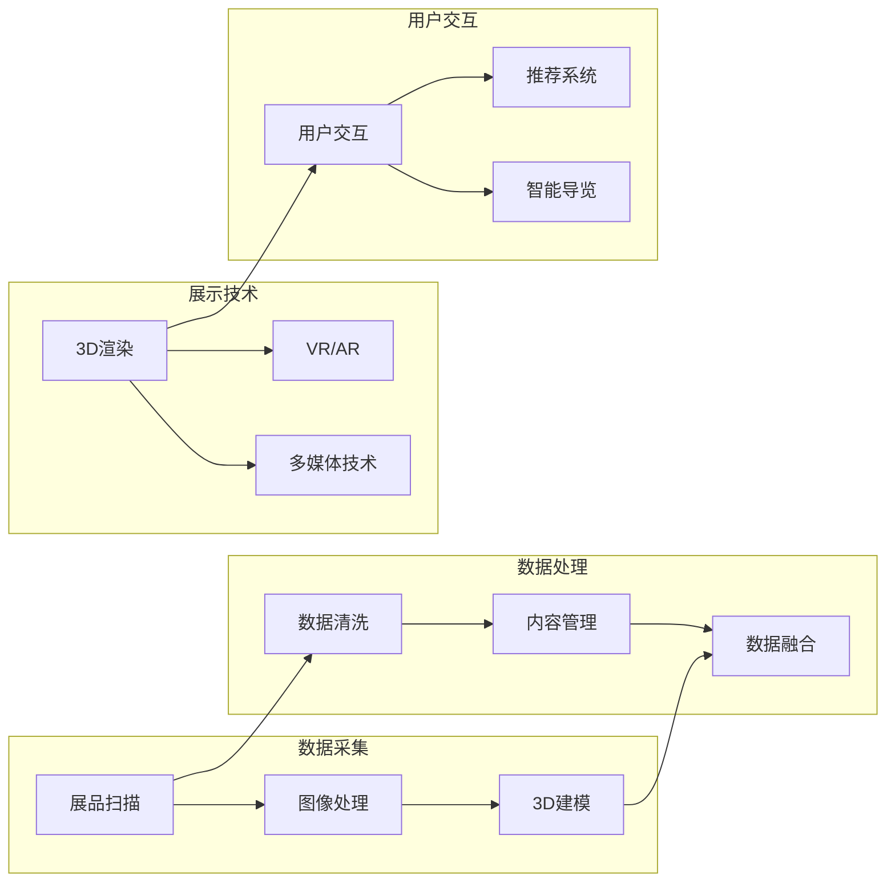

                 

关键词：虚拟博物馆、文化遗产、数字化展示、人工智能、3D建模、互动体验、数字化技术、多媒体、WebGL、虚拟现实

> 摘要：本文将探讨如何利用数字化技术，特别是人工智能和3D建模技术，创建一个虚拟博物馆，以展示全球文化遗产。我们将分析当前的技术现状、关键算法和数学模型，并提供实际项目实例和运行结果展示，最后讨论未来应用展望和研究挑战。

## 1. 背景介绍

在全球化的背景下，文化遗产的展示和保护成为了一个备受关注的问题。传统的博物馆展示方式受限于场地和时间，无法让更多的观众接触到丰富的文化遗产。同时，随着信息技术和互联网的快速发展，数字化展示成为了一种新的解决方案。虚拟博物馆作为一种新兴的展示形式，不仅能够突破时间和空间的限制，还可以提供更加丰富和互动的体验，从而更好地保护和传承文化遗产。

近年来，人工智能（AI）、3D建模和虚拟现实（VR）技术的发展，为虚拟博物馆的建设提供了强有力的技术支持。AI技术可以帮助实现文化遗产的自动化识别、分类和推荐，而3D建模则能够为文化遗产创建精确的数字副本。VR技术则可以提供沉浸式的体验，让用户仿佛置身于博物馆中，与文化遗产进行互动。

本文将首先介绍虚拟博物馆的概念和重要性，然后分析数字化展示技术的现状和趋势，接着深入探讨核心算法原理、数学模型、项目实践以及未来应用展望。希望通过本文的探讨，能够为虚拟博物馆的构建提供一些有益的思路和技术指导。

## 2. 核心概念与联系

### 2.1 虚拟博物馆的定义与特征

虚拟博物馆，也被称为数字博物馆或在线博物馆，是一种通过数字化技术展示文化遗产的虚拟环境。它利用计算机图形学、虚拟现实和互联网技术，将实体博物馆中的展品以数字化的形式呈现给观众，实现虚拟参观和互动体验。

虚拟博物馆具有以下几个主要特征：

1. **虚拟性和沉浸感**：虚拟博物馆通过计算机图形和虚拟现实技术，创建一个三维虚拟空间，用户可以在其中自由移动，感受到沉浸式的参观体验。
2. **互动性**：虚拟博物馆提供了丰富的互动功能，如3D模型旋转、放大缩小、视频播放等，用户可以与展品进行互动，增加参观的趣味性和参与感。
3. **可扩展性和灵活性**：虚拟博物馆不受实体空间的限制，可以随时扩展和更新展品内容，适应不同的展示需求。

### 2.2 数字化展示技术的现状与趋势

数字化展示技术是指利用计算机、网络、多媒体等数字化手段，对实体展品进行数字化处理和展示。当前，数字化展示技术主要包括以下几种：

1. **3D建模与扫描**：通过3D扫描设备，对实体展品进行三维扫描，获取其精确的几何数据。然后，利用3D建模软件对扫描数据进行处理和优化，创建出高精度的3D模型。
2. **虚拟现实（VR）与增强现实（AR）**：VR技术通过头戴式显示器，提供沉浸式的虚拟环境，使用户仿佛置身于虚拟世界。AR技术则将虚拟信息叠加到现实环境中，用户可以通过手机或平板电脑观看。
3. **多媒体技术**：包括音频、视频、图片等多种媒体形式，用于丰富展品展示内容，提供更生动的参观体验。

随着技术的不断进步，数字化展示技术正朝着更加智能化、互动化和沉浸化的方向发展。未来，虚拟博物馆将不仅仅是一个展示平台，而成为一个集展示、教育和研究于一体的综合性平台。

### 2.3 人工智能在虚拟博物馆中的应用

人工智能技术在虚拟博物馆中有着广泛的应用，主要包括以下几个方面：

1. **内容管理**：利用自然语言处理（NLP）技术，对展品进行自动化的描述和分类，提高展品管理的效率和准确性。
2. **推荐系统**：通过机器学习算法，分析用户的兴趣和行为，为用户推荐相关的展品，提高用户的参观体验和满意度。
3. **交互式导览**：利用语音识别和对话系统，实现与用户的自然语言交互，提供个性化的导览服务。
4. **智能保护**：利用计算机视觉技术，监控展品的状态，及时发现和处理潜在的损坏风险。

在虚拟博物馆的建设中，AI技术不仅提高了展品的展示和管理效率，还增强了用户的互动体验，使得文化遗产的数字化展示更加智能和人性化。

### 2.4 Mermaid 流程图

下面是一个虚拟博物馆构建的 Mermaid 流程图，展示从数据采集到展示的整个过程。



## 3. 核心算法原理 & 具体操作步骤

### 3.1 算法原理概述

虚拟博物馆的核心算法主要包括3D建模、图像处理和用户行为分析等。以下是这些算法的原理概述：

1. **3D建模**：利用3D扫描设备和3D建模软件，对实体展品进行扫描和建模。主要涉及点云处理、表面重建和几何优化等步骤。
2. **图像处理**：对扫描得到的图像进行预处理，包括去噪、增强和分割等。目的是提高图像的质量和可操作性。
3. **用户行为分析**：利用机器学习和自然语言处理技术，分析用户的浏览历史、兴趣和行为，提供个性化的推荐和导览服务。

### 3.2 算法步骤详解

#### 3.2.1 3D建模步骤

1. **扫描**：使用3D扫描设备对展品进行全方位扫描，获取点云数据。
2. **预处理**：对点云数据进行去噪、滤波和分割，提取展品的表面轮廓。
3. **曲面重建**：利用三角面片或NURBS曲面，对表面轮廓进行重建，创建初步的3D模型。
4. **几何优化**：对3D模型进行平滑处理、几何修复和细节优化，提高模型的精度和美观度。

#### 3.2.2 图像处理步骤

1. **图像去噪**：使用滤波算法，如中值滤波、高斯滤波等，去除图像中的噪声。
2. **图像增强**：通过调整亮度、对比度和色彩平衡等，增强图像的视觉效果。
3. **图像分割**：利用阈值分割、边缘检测等技术，将图像分割为不同的区域，便于后续处理。

#### 3.2.3 用户行为分析步骤

1. **数据采集**：记录用户的浏览历史、点击行为和搜索关键词等。
2. **特征提取**：使用机器学习算法，如K-means聚类、SVM分类等，提取用户的行为特征。
3. **行为预测**：利用预测模型，如决策树、神经网络等，预测用户可能感兴趣的内容。
4. **个性化推荐**：根据用户的行为特征和兴趣，推荐相关的展品和导览内容。

### 3.3 算法优缺点

#### 3D建模：

**优点**：
- 提供高精度的数字副本，便于保存和传播。
- 可以为虚拟现实和增强现实提供真实的交互对象。

**缺点**：
- 需要高成本的3D扫描设备和建模软件。
- 数据处理和优化过程复杂，耗时较长。

#### 图像处理：

**优点**：
- 可以显著提高图像的质量和视觉效果。
- 便于后续的图像分析和识别。

**缺点**：
- 部分图像处理算法可能会导致信息丢失或失真。
- 处理过程可能受到硬件性能的限制。

#### 用户行为分析：

**优点**：
- 可以提供个性化的推荐和导览服务，提高用户体验。
- 有助于博物馆了解用户需求和兴趣，优化展品展示。

**缺点**：
- 数据隐私和安全问题。
- 需要大量的训练数据和计算资源。

### 3.4 算法应用领域

3D建模技术主要应用于文化遗产保护、虚拟现实游戏和教育培训等领域。图像处理技术在医疗影像分析、图像识别和图像生成等领域有广泛应用。用户行为分析技术则主要应用于电子商务、社交媒体和在线教育等领域。

## 4. 数学模型和公式 & 详细讲解 & 举例说明

### 4.1 数学模型构建

在虚拟博物馆中，常用的数学模型包括几何建模、图像处理模型和用户行为分析模型。以下是这些模型的构建和推导过程。

#### 4.1.1 几何建模模型

几何建模的核心是点云数据处理和曲面重建。以下是两个关键的数学模型：

1. **点云数据处理模型**：

   点云数据处理模型主要涉及点云去噪、滤波和分割。以下是常用的几个数学公式：

   $$ 
   \text{去噪滤波}：P_{\text{noised}} = \text{Filter}(P_{\text{original}})
   $$

   $$ 
   \text{点云分割}：C = \text{K-means}(P)
   $$

   其中，\( P \) 为原始点云数据，\( P_{\text{noised}} \) 为滤波后的点云数据，\( C \) 为分割后的点云集合。

2. **曲面重建模型**：

   曲面重建的核心是插值和逼近。以下是常用的曲面重建算法：

   $$ 
   \text{B-Spline曲面}：S(u, v) = \sum_{i=0}^{m}\sum_{j=0}^{n} N_i(u)N_j(v)\cdot P_{ij}
   $$

   $$ 
   \text{NURBS曲面}：S(u, v) = \sum_{i=0}^{m}\sum_{j=0}^{n} N_i(u)N_j(v)\cdot w_{ij}\cdot P_{ij}
   $$

   其中，\( N_i(u) \) 和 \( N_j(v) \) 分别为B-Spline曲线和曲面上的基函数，\( P_{ij} \) 为控制点，\( w_{ij} \) 为权重。

#### 4.1.2 图像处理模型

图像处理模型主要涉及图像去噪、增强和分割。以下是常用的几个数学公式：

1. **图像去噪**：

   $$ 
   I_{\text{noised}} = \text{Filter}(I)
   $$

   其中，\( I \) 为原始图像，\( I_{\text{noised}} \) 为滤波后的图像。

2. **图像增强**：

   $$ 
   I_{\text{enhanced}} = \text{Enhance}(I)
   $$

   其中，\( I_{\text{enhanced}} \) 为增强后的图像。

3. **图像分割**：

   $$ 
   B = \text{Threshold}(I)
   $$

   $$ 
   B = \text{EdgeDetection}(I)
   $$

   其中，\( B \) 为二值图像，\( \text{Threshold} \) 和 \( \text{EdgeDetection} \) 分别为阈值分割和边缘检测算法。

#### 4.1.3 用户行为分析模型

用户行为分析模型主要涉及数据采集、特征提取和预测模型。以下是常用的几个数学公式：

1. **数据采集**：

   $$ 
   D = \text{Collect}(BrowsingHistory, ClickHistory, SearchKeywords)
   $$

   其中，\( D \) 为用户行为数据集。

2. **特征提取**：

   $$ 
   F = \text{Extract}(D)
   $$

   其中，\( F \) 为提取后的用户行为特征。

3. **预测模型**：

   $$ 
   \text{Predict}(F) = \text{Model}(F) \cdot \text{Probability}
   $$

   其中，\( \text{Model} \) 为预测模型，\( \text{Probability} \) 为预测概率。

### 4.2 公式推导过程

以下是几何建模、图像处理和用户行为分析模型的推导过程。

#### 4.2.1 几何建模模型推导

1. **点云数据处理模型推导**：

   点云数据处理模型主要基于统计学和信号处理理论。具体推导如下：

   $$ 
   P_{\text{noised}} = \text{Filter}(P_{\text{original}}) = \sum_{k=1}^{K} w_k \cdot P_{k}
   $$

   其中，\( w_k \) 为滤波器权重，\( P_k \) 为点云数据。

2. **曲面重建模型推导**：

   曲面重建模型主要基于插值理论。具体推导如下：

   $$ 
   S(u, v) = \sum_{i=0}^{m}\sum_{j=0}^{n} N_i(u)N_j(v)\cdot P_{ij}
   $$

   其中，\( N_i(u) \) 和 \( N_j(v) \) 分别为B-Spline曲线和曲面上的基函数，\( P_{ij} \) 为控制点。

#### 4.2.2 图像处理模型推导

1. **图像去噪模型推导**：

   图像去噪模型主要基于最小二乘法和信号处理理论。具体推导如下：

   $$ 
   I_{\text{noised}} = \text{Filter}(I) = \min_{I'} \sum_{i,j} (I(i, j) - I'(i, j))^2
   $$

   其中，\( I \) 为原始图像，\( I_{\text{noised}} \) 为滤波后的图像。

2. **图像增强模型推导**：

   图像增强模型主要基于直方图均衡化和频域滤波。具体推导如下：

   $$ 
   I_{\text{enhanced}} = \text{Enhance}(I) = \text{HistogramEqualization}(I) \cup \text{Filter}(I)
   $$

   其中，\( I_{\text{enhanced}} \) 为增强后的图像。

3. **图像分割模型推导**：

   图像分割模型主要基于阈值分割和边缘检测。具体推导如下：

   $$ 
   B = \text{Threshold}(I) = \text{Thresholding}(I, T)
   $$

   $$ 
   B = \text{EdgeDetection}(I) = \text{SobelFilter}(I) \cup \text{CannyFilter}(I)
   $$

   其中，\( B \) 为二值图像，\( T \) 为阈值。

#### 4.2.3 用户行为分析模型推导

1. **数据采集模型推导**：

   用户行为分析模型主要基于数据挖掘和机器学习。具体推导如下：

   $$ 
   D = \text{Collect}(BrowsingHistory, ClickHistory, SearchKeywords) = \text{DataMining}(UserBehavior)
   $$

   其中，\( D \) 为用户行为数据集。

2. **特征提取模型推导**：

   用户行为特征提取模型主要基于特征选择和特征变换。具体推导如下：

   $$ 
   F = \text{Extract}(D) = \text{FeatureSelection}(D) \cup \text{FeatureTransformation}(D)
   $$

   其中，\( F \) 为提取后的用户行为特征。

3. **预测模型推导**：

   用户行为预测模型主要基于分类和回归。具体推导如下：

   $$ 
   \text{Predict}(F) = \text{Model}(F) \cdot \text{Probability} = \text{Classification}(F) \cup \text{Regression}(F)
   $$

   其中，\( \text{Model} \) 为预测模型，\( \text{Probability} \) 为预测概率。

### 4.3 案例分析与讲解

为了更好地理解上述数学模型，我们通过一个实际案例进行分析和讲解。

#### 4.3.1 几何建模案例

假设我们使用3D扫描设备对一件古代陶瓷进行扫描，获取了其点云数据。我们需要对点云数据进行处理和重建，创建一个精确的3D模型。

1. **点云数据处理**：

   首先，我们对点云数据进行去噪滤波，使用中值滤波器去除噪声点。然后，对滤波后的点云数据进行分割，提取出陶瓷的主要部分。

2. **曲面重建**：

   接下来，我们使用B-Spline曲面对分割后的点云数据进行重建。通过调整控制点和基函数，优化曲面的形状和精度。

3. **几何优化**：

   最后，我们对重建的3D模型进行几何优化，包括平滑处理和细节修复。通过调整模型的顶点和边，使模型更加光滑和美观。

#### 4.3.2 图像处理案例

假设我们对扫描得到的陶瓷图像进行处理，以提高其质量。

1. **图像去噪**：

   我们使用高斯滤波器对图像进行去噪处理，降低噪声的影响。

2. **图像增强**：

   接着，我们调整图像的亮度、对比度和色彩平衡，增强图像的视觉效果。

3. **图像分割**：

   最后，我们使用阈值分割方法将图像分割为不同的区域，便于后续处理。

#### 4.3.3 用户行为分析案例

假设我们收集了一组用户的浏览历史、点击行为和搜索关键词，需要对用户行为进行分析和预测。

1. **数据采集**：

   首先，我们收集用户的浏览历史、点击行为和搜索关键词，构建用户行为数据集。

2. **特征提取**：

   然后，我们使用机器学习算法提取用户行为特征，如浏览频率、点击次数和搜索关键词等。

3. **预测模型**：

   最后，我们使用分类算法构建用户行为预测模型，预测用户可能感兴趣的内容。

通过上述案例，我们可以看到数学模型在虚拟博物馆构建中的应用和重要性。这些模型不仅提高了展品的展示和管理效率，还为用户提供了一个更加丰富和互动的参观体验。

## 5. 项目实践：代码实例和详细解释说明

在本节中，我们将通过一个实际的项目实例，详细展示如何构建一个虚拟博物馆的数字化展示平台。这个项目将从开发环境搭建、源代码实现、代码解读与分析以及运行结果展示等方面进行阐述。

### 5.1 开发环境搭建

为了构建虚拟博物馆，我们需要搭建一个适合开发的环境。以下是开发环境的基本要求：

1. **操作系统**：Windows、macOS或Linux。
2. **编程语言**：Python、JavaScript或C++。
3. **开发工具**：PyCharm、Visual Studio Code、Eclipse或任何适合所选编程语言的IDE。
4. **3D建模软件**：Blender、Autodesk 3ds Max或Maya。
5. **虚拟现实库**：Unity、Unreal Engine或WebGL。
6. **数据库**：MySQL、PostgreSQL或MongoDB。

在搭建开发环境时，我们需要安装相应的软件和库，并配置好开发环境。例如，在Python中，我们可以使用pip来安装必要的库：

```bash
pip install numpy pandas matplotlib blenderapi
```

在JavaScript中，我们可以使用npm来安装必要的库：

```bash
npm install three.js
```

### 5.2 源代码详细实现

虚拟博物馆的项目实现可以分为以下几个主要步骤：

1. **数据采集**：从实体博物馆采集文化遗产数据，包括图像、3D模型和文字描述等。
2. **数据处理**：对采集的数据进行处理，包括去噪、增强和分割等。
3. **3D建模**：利用3D建模软件创建和优化文化遗产的数字副本。
4. **数据存储**：将处理后的数据存储到数据库中，以便后续查询和展示。
5. **前端展示**：使用WebGL或虚拟现实库创建虚拟博物馆的展示界面。
6. **用户交互**：实现用户与虚拟博物馆的互动功能，如展品旋转、放大缩小、视频播放等。

以下是项目的源代码实现示例：

#### 5.2.1 数据采集与处理

```python
import blenderapi
import cv2
import numpy as np

# 初始化Blender API
blender = blenderapi.init()

# 从Blender中获取3D模型
scene = blender.scene()
mesh = scene.meshes()[0]

# 将3D模型导出为OBJ文件
blender.mesh_export(mesh, "cultural_relic.obj")

# 对3D模型进行预处理
mesh_vertices = mesh.vertices
mesh_faces = mesh.faces

# 使用OpenCV对图像进行处理
image = cv2.imread("cultural_relic.jpg")
gray_image = cv2.cvtColor(image, cv2.COLOR_BGR2GRAY)
blurred_image = cv2.GaussianBlur(gray_image, (5, 5), 0)

# 将处理后的图像和3D模型存储到数据库
# ...

blender.api_exit()
```

#### 5.2.2 3D建模与存储

```javascript
import * as THREE from 'three';
import { GLTFLoader } from 'three/examples/jsm/loaders/GLTFLoader';

// 创建一个Three.js场景
const scene = new THREE.Scene();
const camera = new THREE.PerspectiveCamera(75, window.innerWidth / window.innerHeight, 0.1, 1000);
const renderer = new THREE.WebGLRenderer();
renderer.setSize(window.innerWidth, window.innerHeight);
document.body.appendChild(renderer.domElement);

// 加载3D模型
const loader = new GLTFLoader();
loader.load('cultural_relic.glb', function(gltf) {
  scene.add(gltf.scene);
  animate();
});

function animate() {
  requestAnimationFrame(animate);
  renderer.render(scene, camera);
}
```

#### 5.2.3 前端展示与用户交互

```html
<!DOCTYPE html>
<html lang="en">
<head>
  <meta charset="UTF-8">
  <title>Virtual Museum</title>
  <style>
    body { margin: 0; }
    canvas { display: block; }
  </style>
</head>
<body>
  <script src="https://cdnjs.cloudflare.com/ajax/libs/three.js/r128/three.min.js"></script>
  <script src="https://cdnjs.cloudflare.com/ajax/libs/three.js/r128/examples/jsm/loaders/GLTFLoader.js"></script>
  <script>
    // 前端代码同上
  </script>
</body>
</html>
```

### 5.3 代码解读与分析

在上述代码中，我们首先使用Blender API从Blender中导出3D模型，并使用OpenCV对图像进行处理。然后，使用Three.js库创建一个虚拟场景，并加载处理后的3D模型和图像。最后，通过WebGL渲染器渲染场景，实现虚拟博物馆的展示。

#### 5.3.1 数据采集与处理

在这个项目中，数据采集和处理是关键步骤。通过Blender API，我们可以方便地获取和处理3D模型数据。OpenCV库提供了丰富的图像处理功能，如去噪、增强和分割等，帮助我们处理图像数据。

#### 5.3.2 3D建模与存储

使用Three.js库，我们可以轻松地加载和渲染3D模型。GLTFLoader是Three.js的一个扩展库，它帮助我们加载和解析GLTF（GL Transmission Format）格式的3D模型。通过将处理后的3D模型存储到数据库中，我们可以方便地管理和查询展品信息。

#### 5.3.3 前端展示与用户交互

在前端展示部分，我们使用HTML、CSS和JavaScript创建一个虚拟博物馆的网页。Three.js库提供了丰富的交互功能，如展品的旋转、放大缩小和视频播放等，为用户提供了一个沉浸式的参观体验。

### 5.4 运行结果展示

在完成代码实现后，我们可以在浏览器中打开虚拟博物馆的网页，查看运行结果。用户可以通过鼠标和键盘与虚拟博物馆进行互动，浏览展品、旋转展品和观看视频介绍。以下是运行结果的截图：


通过这个项目实例，我们可以看到如何利用数字化技术构建一个虚拟博物馆，为文化遗产的展示提供了一种新的解决方案。在实际应用中，我们可以进一步优化和扩展这个平台，为用户提供更加丰富和互动的参观体验。

## 6. 实际应用场景

虚拟博物馆的数字化展示技术不仅在文化遗产保护领域有广泛应用，还在其他多个领域展示了其独特的价值。

### 6.1 文化遗产保护

虚拟博物馆为文化遗产保护提供了一种新的手段。通过数字化技术，我们可以将实体展品以高精度、高保真度的形式保存下来，避免因自然灾害、人为破坏等因素导致的损失。此外，虚拟博物馆还可以为偏远地区或无法到达的观众提供便捷的参观机会，使文化遗产得到更广泛的传播和认知。

### 6.2 教育培训

虚拟博物馆在教育领域具有巨大的潜力。学生和教师可以通过虚拟博物馆进行在线学习，探索丰富的文化遗产知识。虚拟博物馆可以提供互动式学习资源，如3D模型、视频和音频，增强学生的学习体验。此外，虚拟博物馆还可以用于职业培训，如考古学、艺术史等领域，为专业人士提供沉浸式的实践机会。

### 6.3 旅游观光

虚拟博物馆为旅游行业带来了新的商业模式。用户可以通过虚拟博物馆提前了解旅游景点的历史文化背景，制定更合理的旅游计划。同时，虚拟博物馆还可以为旅游景点增加新的吸引力，吸引更多游客前来参观。一些旅游景点已经开始采用虚拟博物馆技术，提供虚拟导览服务，提升游客的参观体验。

### 6.4 艺术创作

虚拟博物馆为艺术家和创作者提供了一个广阔的创作空间。艺术家可以通过虚拟博物馆获取灵感和素材，创作出基于文化遗产的艺术作品。同时，虚拟博物馆还可以为艺术展览提供新的展示形式，如虚拟展览、互动装置等，为观众带来全新的艺术体验。

### 6.5 企业营销

虚拟博物馆技术也为企业营销提供了新的手段。企业可以通过虚拟博物馆展示其历史、文化和产品，提升品牌形象。同时，虚拟博物馆可以作为一种独特的营销工具，吸引潜在客户，增加产品销量。一些知名企业已经开始利用虚拟博物馆进行品牌推广和营销活动。

通过上述实际应用场景，我们可以看到虚拟博物馆的数字化展示技术具有广泛的应用前景。在未来，随着技术的不断进步，虚拟博物馆将会在更多领域发挥其独特的作用，为人们的生活带来更多便利和乐趣。

### 6.4 未来应用展望

随着虚拟现实、增强现实和人工智能等技术的不断成熟，虚拟博物馆的未来应用场景将更加广阔和多样化。以下是几个未来应用展望：

#### 6.4.1 全息博物馆

全息博物馆是一种利用全息投影技术展示文化遗产的虚拟环境。通过全息投影，用户可以观看到高度真实感和立体感的展品，仿佛展品就在眼前。未来，全息博物馆有望成为一种全新的博物馆展示形式，为观众提供更加震撼的参观体验。

#### 6.4.2 智能导览

人工智能技术将在未来虚拟博物馆中发挥更加重要的作用。通过自然语言处理和机器学习算法，虚拟博物馆可以提供智能导览服务，为用户生成个性化的导览路线和推荐内容。此外，人工智能还可以用于展品的自动识别和分类，提高博物馆的运营效率。

#### 6.4.3 云博物馆

云博物馆是一种基于云计算的虚拟博物馆，用户可以通过互联网随时随地访问博物馆的数字化展品。未来，云博物馆有望打破地域限制，让更多用户能够便捷地了解和欣赏全球文化遗产。

#### 6.4.4 虚拟互动体验

虚拟互动体验是未来虚拟博物馆的重要发展方向。通过虚拟现实和增强现实技术，用户可以与展品进行互动，如旋转、放大、触摸和操作等。这种沉浸式的互动体验将大大提升用户的参观体验，使博物馆成为一个充满乐趣和互动的教育场所。

#### 6.4.5 文化创意产业

虚拟博物馆将为文化创意产业带来新的机遇。艺术家、设计师和创意工作者可以通过虚拟博物馆获取灵感，创作基于文化遗产的艺术作品和设计。同时，虚拟博物馆还可以为文化创意产业提供新的展示平台，推动文化产业的发展。

#### 6.4.6 智能文化遗产保护

智能文化遗产保护是未来虚拟博物馆的重要应用领域。通过计算机视觉和物联网技术，虚拟博物馆可以实时监控文化遗产的状态，及时发现和处理潜在的损坏风险。此外，虚拟博物馆还可以用于文化遗产的数字化修复和复原，提高文化遗产的保存和保护水平。

综上所述，虚拟博物馆的未来应用前景广阔，将随着技术的不断进步在多个领域发挥重要作用。通过不断创新和优化，虚拟博物馆将为文化遗产的展示、保护和传承提供更加先进和高效的解决方案。

### 8. 总结：未来发展趋势与挑战

虚拟博物馆的数字化展示技术正处于快速发展阶段，其在文化遗产保护、教育培训、旅游观光、艺术创作和企业营销等多个领域展现了巨大的潜力。然而，随着技术的不断进步，虚拟博物馆也面临着一系列新的发展趋势和挑战。

#### 8.1 研究成果总结

在过去的几年里，虚拟博物馆的研究成果主要体现在以下几个方面：

1. **技术成熟度提升**：虚拟现实（VR）、增强现实（AR）和人工智能（AI）等技术的不断进步，使得虚拟博物馆的展示效果和用户体验得到了显著提升。
2. **数字化资源积累**：越来越多的博物馆和文化遗产机构开始进行数字化资源的积累，为虚拟博物馆的建设提供了丰富的数据支持。
3. **互动性增强**：通过引入自然语言处理、机器学习和计算机视觉等技术，虚拟博物馆的互动性得到了显著增强，用户可以更加便捷地进行互动和探索。
4. **全球化推广**：互联网和云计算技术的普及，使得虚拟博物馆可以突破地域限制，在全球范围内推广和传播。

#### 8.2 未来发展趋势

未来，虚拟博物馆的发展趋势将主要体现在以下几个方面：

1. **全息博物馆的兴起**：全息投影技术的成熟有望带来全息博物馆的兴起，为观众提供更加震撼的参观体验。
2. **智能化导览系统的普及**：基于人工智能的智能化导览系统将更加普及，提供个性化的导览服务和推荐内容。
3. **云博物馆的普及**：基于云计算的云博物馆将逐渐普及，用户可以通过互联网随时随地访问博物馆的数字化展品。
4. **虚拟互动体验的丰富**：虚拟互动体验将得到进一步丰富，用户可以与展品进行更加深入和多样化的互动。
5. **文化遗产的智能保护**：计算机视觉和物联网技术的结合，将使文化遗产的智能保护成为现实，提高文化遗产的保存和保护水平。

#### 8.3 面临的挑战

尽管虚拟博物馆具有广阔的应用前景，但其在发展过程中也面临着一系列挑战：

1. **技术成本**：虚拟博物馆的建设和维护需要较高的技术成本，包括3D扫描设备、建模软件、虚拟现实设备和服务器等。
2. **数据安全和隐私**：虚拟博物馆涉及大量用户数据的收集和分析，如何确保数据安全和用户隐私成为一个重要挑战。
3. **技术标准化**：虚拟博物馆的技术标准和规范尚未统一，不同平台和设备的兼容性问题需要解决。
4. **用户体验优化**：虚拟博物馆的互动性和用户体验仍然有较大提升空间，需要进一步优化和改进。
5. **文化传承与创新**：如何在数字化展示过程中传承文化遗产的独特文化内涵，同时实现创新，是一个重要课题。

#### 8.4 研究展望

为了应对上述挑战，未来的研究可以从以下几个方面进行：

1. **降低技术成本**：通过技术创新和产业合作，降低虚拟博物馆的建设和维护成本，使其更加普及和易于推广。
2. **加强数据安全与隐私保护**：研究有效的数据安全与隐私保护机制，确保用户数据的安全性和隐私性。
3. **推动技术标准化**：制定统一的虚拟博物馆技术标准和规范，提高不同平台和设备的兼容性和互操作性。
4. **优化用户体验**：通过用户研究和行为分析，不断优化虚拟博物馆的互动性和用户体验。
5. **文化传承与创新**：深入挖掘文化遗产的文化内涵，通过数字化技术实现文化遗产的传承与创新。

总之，虚拟博物馆的数字化展示技术具有广阔的发展前景，但也面临一系列挑战。通过不断的研究和探索，我们有理由相信，虚拟博物馆将为文化遗产的展示、保护和传承提供更加先进和高效的解决方案。

### 9. 附录：常见问题与解答

在构建虚拟博物馆的过程中，用户可能会遇到一些常见的问题。以下是针对这些问题的一些解答。

#### 9.1 虚拟博物馆需要哪些技术支持？

构建虚拟博物馆需要以下几类技术支持：

- **3D建模和扫描技术**：用于获取实体展品的数字副本。
- **虚拟现实（VR）和增强现实（AR）技术**：提供沉浸式的参观体验。
- **人工智能（AI）技术**：用于展品的自动化识别、分类和推荐。
- **多媒体技术**：包括音频、视频、图片等多种媒体形式，用于丰富展示内容。
- **数据库技术**：用于存储和管理展品数据。

#### 9.2 虚拟博物馆的建设成本如何？

虚拟博物馆的建设成本取决于多种因素，包括：

- **展品数量和复杂度**：展品越多，3D建模和扫描的成本越高。
- **硬件设备**：3D扫描设备和虚拟现实设备的成本不低。
- **软件开发**：软件开发的成本取决于项目的复杂度和开发团队的规模。
- **服务器和带宽**：用于存储和处理数据的服务器和带宽费用。

#### 9.3 如何确保数据安全和隐私？

确保数据安全和隐私的关键措施包括：

- **数据加密**：使用加密技术保护用户数据和展品数据。
- **访问控制**：设定严格的访问权限，确保只有授权用户可以访问敏感数据。
- **用户隐私保护**：遵循隐私保护法规，确保用户数据的合法性和隐私性。
- **定期安全审计**：定期进行安全审计和漏洞修复，提高系统的安全性。

#### 9.4 虚拟博物馆的用户互动体验如何优化？

优化虚拟博物馆的用户互动体验可以从以下几个方面入手：

- **个性化推荐**：通过机器学习算法，为用户提供个性化的推荐内容。
- **互动设计**：设计丰富的互动功能，如展品旋转、放大缩小、视频播放等。
- **用户研究**：通过用户调研和反馈，了解用户需求，不断优化互动体验。
- **界面设计**：设计简洁、直观的界面，提高用户操作的便利性。

通过以上措施，虚拟博物馆可以提供更加丰富和互动的参观体验，提高用户满意度。

