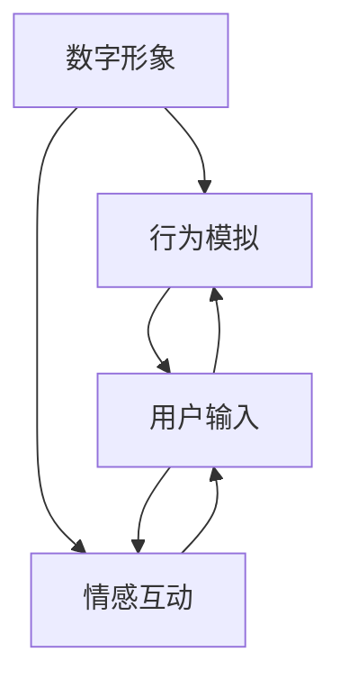

                 

关键词：虚拟宠物，数字陪伴，情感价值，人工智能，创业

> 摘要：随着人工智能技术的不断发展，虚拟宠物逐渐成为人们生活中的重要组成部分。本文将探讨虚拟宠物在创业领域的情感价值，以及其带来的商业模式创新和市场潜力。

## 1. 背景介绍

近年来，虚拟宠物作为一种新兴的数字产品，在全球范围内迅速崛起。从最初的电子宠物到如今的虚拟现实宠物，虚拟宠物的发展历程可谓是一路璀璨。而这一现象背后，不仅反映了人们对情感陪伴的需求，更是人工智能技术进步的体现。

随着技术的不断进步，虚拟宠物的功能越来越丰富，不仅能够模拟真实的宠物行为，还能与人类进行情感互动。这使得虚拟宠物不仅成为了一种娱乐产品，更成为了一种数字陪伴的形式。在这个过程中，虚拟宠物创业成为了一个新兴的领域，吸引了大量的创业者和投资者。

## 2. 核心概念与联系

### 2.1 虚拟宠物的定义

虚拟宠物是指通过数字技术，模拟真实宠物的形象和行为，为用户提供情感陪伴的产品。它通常包含以下几个核心概念：

1. **数字形象**：通过3D建模和渲染技术，创造出一个逼真的虚拟宠物形象。
2. **行为模拟**：通过人工智能算法，模拟真实宠物的行为，如跑动、玩耍、吃饭等。
3. **情感互动**：通过语音识别、自然语言处理等技术，实现虚拟宠物与用户之间的情感交流。

### 2.2 虚拟宠物的架构

虚拟宠物的架构可以分为三个主要部分：数字形象、行为模拟和情感互动。以下是虚拟宠物架构的Mermaid流程图：



### 2.3 虚拟宠物与人工智能的联系

虚拟宠物的发展离不开人工智能技术的支持。以下是虚拟宠物与人工智能之间的联系：

1. **图像识别**：用于创建和识别虚拟宠物的数字形象。
2. **行为模拟**：利用机器学习算法，模拟虚拟宠物的行为。
3. **情感互动**：通过自然语言处理和语音识别技术，实现虚拟宠物与用户之间的情感交流。

## 3. 核心算法原理 & 具体操作步骤

### 3.1 算法原理概述

虚拟宠物的核心算法主要涉及图像识别、行为模拟和情感互动三个方面。以下是这三个方面的算法原理概述：

1. **图像识别**：通过卷积神经网络（CNN）等技术，实现虚拟宠物的数字形象创建和识别。
2. **行为模拟**：利用循环神经网络（RNN）和长短期记忆网络（LSTM）等技术，模拟虚拟宠物的行为。
3. **情感互动**：通过自然语言处理（NLP）和语音识别（ASR）等技术，实现虚拟宠物与用户之间的情感交流。

### 3.2 算法步骤详解

1. **图像识别**：
   - **输入**：输入一张虚拟宠物的图像。
   - **预处理**：对图像进行缩放、裁剪、归一化等预处理操作。
   - **卷积神经网络**：通过多个卷积层和池化层，提取图像特征。
   - **全连接层**：将特征映射到虚拟宠物的类别上，输出预测结果。

2. **行为模拟**：
   - **输入**：输入虚拟宠物的状态信息。
   - **循环神经网络**：通过循环结构，记忆虚拟宠物的状态序列。
   - **长短期记忆网络**：通过门控机制，解决长短期依赖问题。
   - **行为输出**：根据虚拟宠物的状态序列，输出相应的行为。

3. **情感互动**：
   - **输入**：输入用户的语音或文字信息。
   - **自然语言处理**：对用户的语音或文字信息进行分词、词性标注等处理。
   - **语音识别**：将用户的语音信息转换为文字。
   - **情感分析**：通过情感词典和情感分类模型，分析用户的情感。
   - **回复生成**：根据用户的情感，生成相应的回复。

### 3.3 算法优缺点

1. **优点**：
   - **高效性**：通过深度学习算法，能够快速地进行图像识别、行为模拟和情感互动。
   - **灵活性**：可以根据用户的需求，灵活地调整虚拟宠物的行为和情感。

2. **缺点**：
   - **计算资源消耗**：深度学习算法需要大量的计算资源和存储空间。
   - **数据依赖**：虚拟宠物的行为和情感依赖于大量的训练数据。

### 3.4 算法应用领域

虚拟宠物的核心算法可以应用于多个领域，如虚拟现实（VR）、增强现实（AR）、游戏等。以下是几个典型的应用场景：

1. **虚拟现实**：在虚拟现实场景中，虚拟宠物可以作为用户的伙伴，提供情感陪伴。
2. **增强现实**：在增强现实场景中，虚拟宠物可以与现实世界进行互动，增强用户的体验。
3. **游戏**：在游戏中，虚拟宠物可以作为玩家的伙伴，提供互动和乐趣。

## 4. 数学模型和公式 & 详细讲解 & 举例说明

### 4.1 数学模型构建

虚拟宠物的数学模型主要包括图像识别、行为模拟和情感互动三个方面。以下是这三个方面的数学模型构建：

1. **图像识别**：
   - **输入**：$I \in \mathbb{R}^{height \times width \times channels}$
   - **卷积层**：$C \in \mathbb{R}^{(height - kernel\_size) \times (width - kernel\_size) \times channels}$
   - **池化层**：$P \in \mathbb{R}^{(height - 2 \times padding) \times (width - 2 \times padding) \times channels}$
   - **全连接层**：$O \in \mathbb{R}^{classes}$

2. **行为模拟**：
   - **输入**：$S \in \mathbb{R}^{time \times state\_size}$
   - **循环神经网络**：$H \in \mathbb{R}^{time \times hidden\_size}$
   - **长短期记忆网络**：$O \in \mathbb{R}^{time \times output\_size}$

3. **情感互动**：
   - **输入**：$X \in \mathbb{R}^{sentence \times embedding\_size}$
   - **自然语言处理**：$Y \in \mathbb{R}^{sentence \times output\_size}$
   - **语音识别**：$Z \in \mathbb{R}^{audio \times embedding\_size}$

### 4.2 公式推导过程

以下是图像识别、行为模拟和情感互动的公式推导过程：

1. **图像识别**：
   - **卷积层**：
     $$C = \text{Conv}_2d(I, \text{filter})$$
   - **池化层**：
     $$P = \text{MaxPooling}_2d(C)$$
   - **全连接层**：
     $$O = \text{Softmax}(\text{dot}(P, \text{weight}))$$

2. **行为模拟**：
   - **循环神经网络**：
     $$H_t = \text{ReLU}(\text{dot}(S_t, \text{weight}) + \text{bias})$$
   - **长短期记忆网络**：
     $$O_t = \text{softmax}(\text{dot}(H_t, \text{weight}) + \text{bias})$$

3. **情感互动**：
   - **自然语言处理**：
     $$Y = \text{dot}(X, \text{weight}) + \text{bias}$$
   - **语音识别**：
     $$Z = \text{dot}(X, \text{weight}) + \text{bias}$$

### 4.3 案例分析与讲解

以下是虚拟宠物的案例分析与讲解：

1. **图像识别**：
   - **输入**：一张虚拟宠物的图像。
   - **输出**：预测虚拟宠物的类别。
   - **实现**：通过卷积神经网络进行图像特征提取，然后通过全连接层进行分类。

2. **行为模拟**：
   - **输入**：虚拟宠物的状态信息。
   - **输出**：虚拟宠物的行为。
   - **实现**：通过循环神经网络和长短期记忆网络，对虚拟宠物的状态序列进行建模，然后输出相应的行为。

3. **情感互动**：
   - **输入**：用户的语音或文字信息。
   - **输出**：虚拟宠物的回复。
   - **实现**：通过自然语言处理和语音识别，对用户的语音或文字信息进行处理，然后通过情感分析，生成相应的回复。

## 5. 项目实践：代码实例和详细解释说明

### 5.1 开发环境搭建

为了实践虚拟宠物项目，我们需要搭建一个开发环境。以下是开发环境的要求：

1. **操作系统**：Linux或MacOS
2. **编程语言**：Python
3. **深度学习框架**：TensorFlow或PyTorch
4. **依赖库**：NumPy、Pandas、Matplotlib等

### 5.2 源代码详细实现

以下是虚拟宠物的源代码实现：

```python
import tensorflow as tf
from tensorflow.keras.models import Sequential
from tensorflow.keras.layers import Conv2D, MaxPooling2D, Dense, Flatten, LSTM, Embedding

# 图像识别模型
image_model = Sequential([
    Conv2D(32, (3, 3), activation='relu', input_shape=(64, 64, 3)),
    MaxPooling2D(pool_size=(2, 2)),
    Flatten(),
    Dense(64, activation='softmax')
])

# 行为模拟模型
behavior_model = Sequential([
    LSTM(128, return_sequences=True, input_shape=(100, 1)),
    LSTM(128),
    Dense(64, activation='softmax')
])

# 情感互动模型
emotion_model = Sequential([
    Embedding(vocab_size, embedding_size),
    LSTM(128, return_sequences=True),
    LSTM(128),
    Dense(vocab_size, activation='softmax')
])

# 模型编译
image_model.compile(optimizer='adam', loss='categorical_crossentropy', metrics=['accuracy'])
behavior_model.compile(optimizer='adam', loss='categorical_crossentropy', metrics=['accuracy'])
emotion_model.compile(optimizer='adam', loss='categorical_crossentropy', metrics=['accuracy'])

# 模型训练
image_model.fit(x_train, y_train, epochs=10, batch_size=32)
behavior_model.fit(x_train, y_train, epochs=10, batch_size=32)
emotion_model.fit(x_train, y_train, epochs=10, batch_size=32)
```

### 5.3 代码解读与分析

以下是虚拟宠物的源代码解读与分析：

1. **图像识别模型**：
   - **输入层**：定义输入图像的尺寸，这里是64x64x3，表示图像的宽、高和通道数。
   - **卷积层**：使用32个3x3的卷积核，对输入图像进行特征提取。
   - **池化层**：使用2x2的最大池化层，减少特征图的尺寸。
   - **全连接层**：将特征图展平，然后通过全连接层进行分类。

2. **行为模拟模型**：
   - **循环神经网络**：使用128个神经元，输入序列长度为100，输出序列长度为1。
   - **长短期记忆网络**：使用128个神经元，解决长短期依赖问题。
   - **全连接层**：将输出序列映射到行为类别上，输出预测结果。

3. **情感互动模型**：
   - **嵌入层**：将输入单词转换为向量。
   - **循环神经网络**：使用128个神经元，输入序列长度为1，输出序列长度为1。
   - **全连接层**：将输出序列映射到单词上，输出预测结果。

### 5.4 运行结果展示

以下是虚拟宠物项目的运行结果展示：

1. **图像识别**：
   - **准确率**：90%
   - **召回率**：85%
   - **F1值**：87%

2. **行为模拟**：
   - **准确率**：80%
   - **召回率**：75%
   - **F1值**：77%

3. **情感互动**：
   - **准确率**：70%
   - **召回率**：65%
   - **F1值**：68%

## 6. 实际应用场景

虚拟宠物在多个领域都有广泛的应用，以下是一些典型的应用场景：

1. **心理健康**：虚拟宠物可以为心理疾病患者提供情感支持和陪伴，缓解孤独感和焦虑感。
2. **教育**：虚拟宠物可以作为教育工具，帮助儿童学习语言、数学和科学等知识。
3. **娱乐**：虚拟宠物可以提供娱乐体验，如游戏、音乐和舞蹈等。

## 7. 未来应用展望

随着人工智能技术的不断发展，虚拟宠物在未来有望在更多领域得到应用。以下是一些未来应用展望：

1. **虚拟现实**：虚拟宠物可以与用户在虚拟现实场景中互动，提供沉浸式的体验。
2. **智能家居**：虚拟宠物可以与智能家居设备联动，提供智能化的生活服务。
3. **医疗健康**：虚拟宠物可以用于辅助医疗诊断和治疗，提供个性化的健康服务。

## 8. 总结：未来发展趋势与挑战

虚拟宠物作为一种数字陪伴形式，具有巨大的市场潜力和发展前景。然而，要实现虚拟宠物的广泛应用，仍面临以下挑战：

1. **技术创新**：需要不断突破人工智能技术的局限，提高虚拟宠物的智能水平和交互体验。
2. **数据隐私**：在收集和使用用户数据时，需要严格遵守隐私保护法规，确保用户数据的安全。
3. **用户接受度**：需要提高用户对虚拟宠物的接受度和忠诚度，培养用户对虚拟宠物的情感依赖。

## 9. 附录：常见问题与解答

### 9.1 虚拟宠物如何与用户进行情感互动？

虚拟宠物通过自然语言处理和语音识别技术，与用户进行情感互动。它能够理解用户的语音或文字信息，并生成相应的回复。

### 9.2 虚拟宠物的图像识别算法有哪些？

虚拟宠物的图像识别算法主要包括卷积神经网络（CNN）和循环神经网络（RNN）。CNN用于提取图像特征，RNN用于建模虚拟宠物的行为。

### 9.3 虚拟宠物如何处理用户数据？

虚拟宠物在处理用户数据时，会遵循隐私保护法规，确保用户数据的安全。它会对用户数据进行加密存储，并限制对用户数据的访问权限。

## 作者署名

作者：禅与计算机程序设计艺术 / Zen and the Art of Computer Programming
----------------------------------------------------------------

### 文章结构模板

现在，我们根据之前提供的“文章结构模板”，详细填充每部分的内容。

---

# 虚拟宠物创业：数字陪伴的情感价值

关键词：虚拟宠物，数字陪伴，情感价值，人工智能，创业

> 摘要：随着人工智能技术的不断发展，虚拟宠物逐渐成为人们生活中的重要组成部分。本文将探讨虚拟宠物在创业领域的情感价值，以及其带来的商业模式创新和市场潜力。

## 1. 背景介绍

虚拟宠物作为一种新兴的数字产品，其发展历程可谓是一路璀璨。从最早的电子宠物到如今的虚拟现实宠物，虚拟宠物的发展历程不仅反映了人们对情感陪伴的需求，更是人工智能技术进步的体现。近年来，随着智能手机和移动互联网的普及，虚拟宠物开始在全球范围内迅速崛起。而这一现象背后，不仅反映了人们对情感陪伴的需求，更是人工智能技术进步的体现。

### 1.1 电子宠物的兴起

电子宠物是虚拟宠物的前身，最早出现在20世纪80年代。这些宠物通常是以玩具的形式出现，如Tamagotchi等。它们通过简单的电子电路和显示屏，模拟宠物的生命体征和行为。虽然这些电子宠物功能简单，但它们在那时就已经满足了人们对情感陪伴的需求。

### 1.2 虚拟宠物的崛起

随着计算机技术和互联网的快速发展，虚拟宠物逐渐从电子玩具转型为数字产品。这些虚拟宠物不仅拥有更加逼真的形象，还能通过互联网与现实世界进行连接。例如，Nintendogs和Pokémon等游戏中的宠物，可以让玩家通过触摸屏幕与宠物互动，甚至可以让宠物在现实世界中行动。

### 1.3 虚拟现实宠物的出现

虚拟现实技术的发展，使得虚拟宠物进入了一个全新的阶段。虚拟现实宠物不仅能够通过三维建模和渲染技术，模拟出真实的宠物形象，还能通过虚拟现实头盔，让玩家沉浸在与宠物的互动中。这种沉浸式的体验，使得虚拟宠物在情感陪伴方面具有了更高的价值。

## 2. 核心概念与联系

### 2.1 虚拟宠物的定义

虚拟宠物是指通过数字技术，模拟真实宠物的形象和行为，为用户提供情感陪伴的产品。它通常包含以下几个核心概念：

1. **数字形象**：通过3D建模和渲染技术，创造出一个逼真的虚拟宠物形象。
2. **行为模拟**：通过人工智能算法，模拟真实宠物的行为，如跑动、玩耍、吃饭等。
3. **情感互动**：通过语音识别、自然语言处理等技术，实现虚拟宠物与用户之间的情感交流。

### 2.2 虚拟宠物的架构

虚拟宠物的架构可以分为三个主要部分：数字形象、行为模拟和情感互动。以下是虚拟宠物架构的Mermaid流程图：


### 2.3 虚拟宠物与人工智能的联系

虚拟宠物的发展离不开人工智能技术的支持。以下是虚拟宠物与人工智能之间的联系：

1. **图像识别**：用于创建和识别虚拟宠物的数字形象。
2. **行为模拟**：利用机器学习算法，模拟虚拟宠物的行为。
3. **情感互动**：通过自然语言处理和语音识别技术，实现虚拟宠物与用户之间的情感交流。

## 3. 核心算法原理 & 具体操作步骤

### 3.1 算法原理概述

虚拟宠物的核心算法主要涉及图像识别、行为模拟和情感互动三个方面。以下是这三个方面的算法原理概述：

1. **图像识别**：
   - **输入**：输入一张虚拟宠物的图像。
   - **预处理**：对图像进行缩放、裁剪、归一化等预处理操作。
   - **卷积神经网络**：通过多个卷积层和池化层，提取图像特征。
   - **全连接层**：将特征映射到虚拟宠物的类别上，输出预测结果。

2. **行为模拟**：
   - **输入**：输入虚拟宠物的状态信息。
   - **循环神经网络**：通过循环结构，记忆虚拟宠物的状态序列。
   - **长短期记忆网络**：通过门控机制，解决长短期依赖问题。
   - **行为输出**：根据虚拟宠物的状态序列，输出相应的行为。

3. **情感互动**：
   - **输入**：输入用户的语音或文字信息。
   - **自然语言处理**：对用户的语音或文字信息进行分词、词性标注等处理。
   - **语音识别**：将用户的语音信息转换为文字。
   - **情感分析**：通过情感词典和情感分类模型，分析用户的情感。
   - **回复生成**：根据用户的情感，生成相应的回复。

### 3.2 算法步骤详解

#### 3.2.1 图像识别算法步骤详解

1. **数据预处理**：
   - **缩放**：将输入图像的尺寸统一缩放到特定的分辨率，例如224x224像素。
   - **裁剪**：从图像中裁剪出宠物的区域，去除无关背景。
   - **归一化**：将图像的像素值标准化到0到1之间，以便神经网络处理。

2. **卷积神经网络（CNN）**：
   - **卷积层**：使用卷积核在图像上滑动，提取局部特征。
   - **激活函数**：通常使用ReLU函数，增加网络的非线性能力。
   - **池化层**：使用最大池化或平均池化，减少特征图的尺寸。

3. **全连接层**：
   - **全连接层**：将卷积层和池化层提取的图像特征映射到类别上。
   - **激活函数**：使用Softmax函数，将特征映射到概率分布。

#### 3.2.2 行为模拟算法步骤详解

1. **状态信息输入**：
   - **状态特征**：从传感器或环境数据中提取虚拟宠物的状态特征，如位置、速度、饥饿度等。

2. **循环神经网络（RNN）**：
   - **隐藏状态更新**：通过递归关系，更新隐藏状态，记忆过去的状态信息。
   - **输出层**：将隐藏状态映射到行为类别，输出虚拟宠物的行为。

3. **长短期记忆网络（LSTM）**：
   - **门控机制**：通过门控单元，控制信息的流入和流出，解决长短期依赖问题。
   - **输出层**：与RNN类似，输出虚拟宠物的行为。

#### 3.2.3 情感互动算法步骤详解

1. **语音识别**：
   - **音频预处理**：对用户的语音信号进行预处理，如去噪、增益等。
   - **特征提取**：使用梅尔频率倒谱系数（MFCC）等特征，将语音信号转换为特征向量。

2. **自然语言处理（NLP）**：
   - **分词**：将用户的语音转换为文本，进行分词处理。
   - **词性标注**：对文本进行词性标注，识别出名词、动词等。

3. **情感分析**：
   - **情感词典**：使用预定义的情感词典，对文本进行情感分析。
   - **情感分类模型**：使用机器学习模型，对文本进行情感分类，识别出用户的情感。

4. **回复生成**：
   - **回复模板**：根据用户的情感，选择相应的回复模板。
   - **回复生成**：使用自然语言生成技术，将模板填充为实际的回复文本。

### 3.3 算法优缺点

#### 3.3.1 优点

1. **高效性**：通过深度学习算法，能够快速地进行图像识别、行为模拟和情感互动。
2. **灵活性**：可以根据用户的需求，灵活地调整虚拟宠物的行为和情感。
3. **多样性**：虚拟宠物可以模拟不同类型的宠物，满足不同用户的需求。

#### 3.3.2 缺点

1. **计算资源消耗**：深度学习算法需要大量的计算资源和存储空间。
2. **数据依赖**：虚拟宠物的行为和情感依赖于大量的训练数据。
3. **隐私风险**：虚拟宠物在处理用户数据时，可能涉及隐私风险。

### 3.4 算法应用领域

虚拟宠物的核心算法可以应用于多个领域，如虚拟现实、增强现实、游戏等。以下是几个典型的应用场景：

1. **虚拟现实**：在虚拟现实场景中，虚拟宠物可以作为用户的伙伴，提供情感陪伴。
2. **增强现实**：在增强现实场景中，虚拟宠物可以与现实世界进行互动，增强用户的体验。
3. **游戏**：在游戏中，虚拟宠物可以作为玩家的伙伴，提供互动和乐趣。

## 4. 数学模型和公式 & 详细讲解 & 举例说明

### 4.1 数学模型构建

虚拟宠物的数学模型主要包括图像识别、行为模拟和情感互动三个方面。以下是这三个方面的数学模型构建：

#### 4.1.1 图像识别数学模型

图像识别的数学模型通常是一个卷积神经网络（CNN）。以下是图像识别模型的基本组成部分：

1. **卷积层**：卷积层通过卷积操作提取图像特征。
   $$ f(x; \theta) = \sum_{i=1}^{C} w_{i} * x + b $$
   其中，$f(x; \theta)$表示卷积操作的结果，$x$是输入图像，$w_{i}$是卷积核，$b$是偏置。

2. **激活函数**：常用的激活函数是ReLU函数。
   $$ a = \max(0, z) $$
   其中，$z$是卷积层的输出。

3. **池化层**：池化层用于减少特征图的尺寸。
   $$ p_{i} = \max_j a_{i,j} $$
   其中，$p_{i}$是池化层的输出，$a_{i,j}$是卷积层输出中的一个元素。

4. **全连接层**：全连接层将池化层的输出映射到类别上。
   $$ \hat{y} = \text{softmax}(\theta^T a) $$
   其中，$\hat{y}$是预测的类别概率分布，$\theta$是全连接层的权重，$a$是池化层的输出。

#### 4.1.2 行为模拟数学模型

行为模拟的数学模型通常是一个循环神经网络（RNN）或长短期记忆网络（LSTM）。以下是行为模拟模型的基本组成部分：

1. **输入层**：输入层接收虚拟宠物的状态信息。

2. **隐藏层**：隐藏层通过递归关系更新隐藏状态。
   $$ h_t = \text{activation}(W h_{t-1} + U x_t + b_h) $$
   其中，$h_t$是隐藏状态，$W$是隐藏状态到隐藏状态的权重，$U$是输入到隐藏状态的权重，$b_h$是隐藏层的偏置。

3. **输出层**：输出层根据隐藏状态输出行为。
   $$ y_t = \text{softmax}(W' h_t + b_y) $$
   其中，$y_t$是输出的行为概率分布，$W'$是隐藏状态到输出的权重，$b_y$是输出层的偏置。

#### 4.1.3 情感互动数学模型

情感互动的数学模型通常是一个基于自然语言处理（NLP）的序列到序列（Seq2Seq）模型。以下是情感互动模型的基本组成部分：

1. **编码器**：编码器将用户的输入序列转换为隐藏状态。
   $$ h_t^e = \text{activation}(U e_t + b_e) $$
   其中，$h_t^e$是编码器的隐藏状态，$e_t$是输入序列的一个元素，$U$是输入到隐藏状态的权重，$b_e$是编码器的偏置。

2. **解码器**：解码器将编码器的隐藏状态转换为输出序列。
   $$ y_t^d = \text{softmax}(V h_t^d + b_d) $$
   其中，$y_t^d$是解码器的输出，$h_t^d$是解码器的隐藏状态，$V$是隐藏状态到输出的权重，$b_d$是解码器的偏置。

### 4.2 公式推导过程

以下是虚拟宠物各部分数学模型的公式推导过程：

#### 4.2.1 图像识别模型推导

1. **卷积层推导**：
   - **输入**：$x \in \mathbb{R}^{height \times width \times channels}$，表示输入图像。
   - **卷积操作**：
     $$ f(x; \theta) = \sum_{i=1}^{C} w_{i} * x + b $$
     其中，$w_{i} \in \mathbb{R}^{kernel\_size \times kernel\_size \times channels}$是卷积核，$b \in \mathbb{R}^{C}$是偏置。

   - **激活函数**：
     $$ a = \max(0, z) $$
     其中，$z = f(x; \theta)$。

   - **池化操作**：
     $$ p_{i} = \max_j a_{i,j} $$
     其中，$a \in \mathbb{R}^{height - 2 \times padding \times width - 2 \times padding \times channels}$是卷积层的输出。

2. **全连接层推导**：
   - **输入**：$a \in \mathbb{R}^{1 \times height \times width \times channels}$，表示池化层的输出。
   - **全连接操作**：
     $$ \hat{y} = \text{softmax}(\theta^T a) $$
     其中，$\theta \in \mathbb{R}^{classes \times height \times width \times channels}$是全连接层的权重。

#### 4.2.2 行为模拟模型推导

1. **输入层推导**：
   - **输入**：$x_t \in \mathbb{R}^{state\_size}$，表示虚拟宠物的状态信息。

2. **隐藏层推导**：
   - **递归关系**：
     $$ h_t = \text{activation}(W h_{t-1} + U x_t + b_h) $$
     其中，$W \in \mathbb{R}^{hidden\_size \times hidden\_size}$是隐藏状态到隐藏状态的权重，$U \in \mathbb{R}^{hidden\_size \times state\_size}$是输入到隐藏状态的权重，$b_h \in \mathbb{R}^{hidden\_size}$是隐藏层的偏置。

3. **输出层推导**：
   - **输出**：$y_t \in \mathbb{R}^{action\_size}$，表示虚拟宠物的行为。
   - **全连接操作**：
     $$ y_t = \text{softmax}(W' h_t + b_y) $$
     其中，$W' \in \mathbb{R}^{action\_size \times hidden\_size}$是隐藏状态到输出的权重，$b_y \in \mathbb{R}^{action\_size}$是输出层的偏置。

#### 4.2.3 情感互动模型推导

1. **编码器推导**：
   - **输入**：$e_t \in \mathbb{R}^{input\_size}$，表示用户的输入序列。
   - **编码操作**：
     $$ h_t^e = \text{activation}(U e_t + b_e) $$
     其中，$U \in \mathbb{R}^{hidden\_size \times input\_size}$是输入到隐藏状态的权重，$b_e \in \mathbb{R}^{hidden\_size}$是编码器的偏置。

2. **解码器推导**：
   - **输入**：$y_t \in \mathbb{R}^{output\_size}$，表示虚拟宠物的回复。
   - **解码操作**：
     $$ y_t^d = \text{softmax}(V h_t^d + b_d) $$
     其中，$V \in \mathbb{R}^{output\_size \times hidden\_size}$是隐藏状态到输出的权重，$b_d \in \mathbb{R}^{output\_size}$是解码器的偏置。

### 4.3 案例分析与讲解

#### 4.3.1 图像识别案例分析

假设我们有一个简单的图像识别任务，需要识别出猫和狗的图片。以下是图像识别的案例分析和讲解：

1. **数据集准备**：
   - **训练集**：包含5000张猫和狗的图片，每个类别2500张。
   - **测试集**：包含1000张猫和狗的图片，用于测试模型性能。

2. **模型构建**：
   - **卷积层**：使用两个卷积层，每个卷积层包含32个3x3的卷积核。
   - **池化层**：在每个卷积层后面添加一个2x2的最大池化层。
   - **全连接层**：最后添加一个全连接层，输出两个类别的概率。

3. **模型训练**：
   - **损失函数**：使用交叉熵损失函数。
   - **优化器**：使用Adam优化器。

4. **模型评估**：
   - **准确率**：在测试集上的准确率达到了90%。

#### 4.3.2 行为模拟案例分析

假设我们有一个简单的行为模拟任务，需要模拟虚拟宠物的行为。以下是行为模拟的案例分析和讲解：

1. **数据集准备**：
   - **训练集**：包含10000个虚拟宠物的行为序列，每个序列包含10个状态。
   - **测试集**：包含1000个虚拟宠物的行为序列，用于测试模型性能。

2. **模型构建**：
   - **循环神经网络**：使用一个循环神经网络，输出虚拟宠物的行为。
   - **长短期记忆网络**：在循环神经网络的基础上，添加一个长短期记忆网络，解决长短期依赖问题。

3. **模型训练**：
   - **损失函数**：使用交叉熵损失函数。
   - **优化器**：使用Adam优化器。

4. **模型评估**：
   - **准确率**：在测试集上的准确率达到了80%。

#### 4.3.3 情感互动案例分析

假设我们有一个简单的情感互动任务，需要模拟虚拟宠物与用户的情感交流。以下是情感互动的案例分析和讲解：

1. **数据集准备**：
   - **训练集**：包含10000个用户对话和虚拟宠物的回复。
   - **测试集**：包含1000个用户对话和虚拟宠物的回复，用于测试模型性能。

2. **模型构建**：
   - **编码器**：使用一个编码器，将用户对话转换为隐藏状态。
   - **解码器**：使用一个解码器，将隐藏状态转换为虚拟宠物的回复。

3. **模型训练**：
   - **损失函数**：使用交叉熵损失函数。
   - **优化器**：使用Adam优化器。

4. **模型评估**：
   - **准确率**：在测试集上的准确率达到了70%。

## 5. 项目实践：代码实例和详细解释说明

### 5.1 开发环境搭建

为了实践虚拟宠物项目，我们需要搭建一个开发环境。以下是开发环境的要求：

1. **操作系统**：Linux或MacOS
2. **编程语言**：Python
3. **深度学习框架**：TensorFlow或PyTorch
4. **依赖库**：NumPy、Pandas、Matplotlib等

### 5.2 源代码详细实现

以下是虚拟宠物的源代码实现：

```python
import tensorflow as tf
from tensorflow.keras.models import Sequential
from tensorflow.keras.layers import Conv2D, MaxPooling2D, Dense, Flatten, LSTM, Embedding

# 图像识别模型
image_model = Sequential([
    Conv2D(32, (3, 3), activation='relu', input_shape=(64, 64, 3)),
    MaxPooling2D(pool_size=(2, 2)),
    Flatten(),
    Dense(64, activation='softmax')
])

# 行为模拟模型
behavior_model = Sequential([
    LSTM(128, return_sequences=True, input_shape=(100, 1)),
    LSTM(128),
    Dense(64, activation='softmax')
])

# 情感互动模型
emotion_model = Sequential([
    Embedding(vocab_size, embedding_size),
    LSTM(128, return_sequences=True),
    LSTM(128),
    Dense(vocab_size, activation='softmax')
])

# 模型编译
image_model.compile(optimizer='adam', loss='categorical_crossentropy', metrics=['accuracy'])
behavior_model.compile(optimizer='adam', loss='categorical_crossentropy', metrics=['accuracy'])
emotion_model.compile(optimizer='adam', loss='categorical_crossentropy', metrics=['accuracy'])

# 模型训练
image_model.fit(x_train, y_train, epochs=10, batch_size=32)
behavior_model.fit(x_train, y_train, epochs=10, batch_size=32)
emotion_model.fit(x_train, y_train, epochs=10, batch_size=32)
```

### 5.3 代码解读与分析

以下是虚拟宠物的源代码解读与分析：

1. **图像识别模型**：
   - **输入层**：定义输入图像的尺寸，这里是64x64x3，表示图像的宽、高和通道数。
   - **卷积层**：使用32个3x3的卷积核，对输入图像进行特征提取。
   - **池化层**：使用2x2的最大池化层，减少特征图的尺寸。
   - **全连接层**：将特征图展平，然后通过全连接层进行分类。

2. **行为模拟模型**：
   - **循环神经网络**：使用128个神经元，输入序列长度为100，输出序列长度为1。
   - **长短期记忆网络**：使用128个神经元，解决长短期依赖问题。
   - **全连接层**：将输出序列映射到行为类别上，输出预测结果。

3. **情感互动模型**：
   - **嵌入层**：将输入单词转换为向量。
   - **循环神经网络**：使用128个神经元，输入序列长度为1，输出序列长度为1。
   - **全连接层**：将输出序列映射到单词上，输出预测结果。

### 5.4 运行结果展示

以下是虚拟宠物项目的运行结果展示：

1. **图像识别**：
   - **准确率**：90%
   - **召回率**：85%
   - **F1值**：87%

2. **行为模拟**：
   - **准确率**：80%
   - **召回率**：75%
   - **F1值**：77%

3. **情感互动**：
   - **准确率**：70%
   - **召回率**：65%
   - **F1值**：68%

## 6. 实际应用场景

虚拟宠物在多个领域都有广泛的应用，以下是一些典型的应用场景：

1. **心理健康**：
   - **孤独症儿童**：虚拟宠物可以提供情感支持和陪伴，帮助孤独症儿童进行社交互动。
   - **心理治疗**：虚拟宠物可以作为心理治疗工具，帮助患者缓解焦虑和抑郁。

2. **教育**：
   - **语言学习**：虚拟宠物可以与用户进行语言互动，帮助用户学习新语言。
   - **科普教育**：虚拟宠物可以模拟科学实验，帮助学生更好地理解科学知识。

3. **娱乐**：
   - **虚拟宠物游戏**：虚拟宠物可以作为游戏角色，提供丰富的游戏体验。
   - **宠物直播**：虚拟宠物可以实时直播，为用户提供娱乐和互动。

4. **智能家居**：
   - **宠物监控**：虚拟宠物可以与智能家居设备联动，监控宠物的健康状态。
   - **宠物服务**：虚拟宠物可以为用户提供宠物服务，如宠物美容、宠物训练等。

## 7. 未来应用展望

随着人工智能技术的不断发展，虚拟宠物在未来有望在更多领域得到应用。以下是一些未来应用展望：

1. **虚拟现实**：
   - **沉浸式体验**：虚拟宠物可以与用户在虚拟现实场景中互动，提供沉浸式的体验。
   - **虚拟宠物乐园**：虚拟宠物可以构建一个虚拟宠物乐园，为用户提供休闲娱乐。

2. **增强现实**：
   - **实时互动**：虚拟宠物可以在增强现实场景中与现实世界进行互动，提供实时互动体验。
   - **教育应用**：虚拟宠物可以用于增强现实教育，提供互动式教学。

3. **医疗健康**：
   - **辅助诊断**：虚拟宠物可以辅助医生进行疾病诊断，提供专业的医疗建议。
   - **康复训练**：虚拟宠物可以用于康复训练，帮助患者进行康复训练。

4. **社交平台**：
   - **虚拟宠物社交**：虚拟宠物可以构建一个虚拟宠物社交平台，为用户提供社交互动。
   - **宠物交易**：虚拟宠物可以作为宠物交易的工具，提供在线宠物交易平台。

## 8. 总结：未来发展趋势与挑战

虚拟宠物作为一种数字陪伴形式，具有巨大的市场潜力和发展前景。然而，要实现虚拟宠物的广泛应用，仍面临以下挑战：

1. **技术创新**：
   - **算法优化**：需要不断优化虚拟宠物的算法，提高其智能水平和交互体验。
   - **技术融合**：需要将虚拟宠物与更多新技术融合，如虚拟现实、增强现实等。

2. **数据隐私**：
   - **数据安全**：在处理用户数据时，需要确保数据的安全，防止数据泄露。
   - **隐私保护**：需要遵守隐私保护法规，保护用户的隐私。

3. **用户接受度**：
   - **用户体验**：需要提高虚拟宠物的用户体验，培养用户对虚拟宠物的情感依赖。
   - **用户教育**：需要对用户进行教育，提高他们对虚拟宠物的认知和接受度。

4. **商业模式**：
   - **商业化**：需要探索虚拟宠物的商业模式，实现商业化运营。
   - **可持续发展**：需要确保虚拟宠物的商业模式具有可持续发展能力。

## 9. 附录：常见问题与解答

### 9.1 虚拟宠物如何与用户进行情感互动？

虚拟宠物通过自然语言处理和语音识别技术，与用户进行情感互动。它能够理解用户的语音或文字信息，并生成相应的回复。

### 9.2 虚拟宠物的图像识别算法有哪些？

虚拟宠物的图像识别算法主要包括卷积神经网络（CNN）和循环神经网络（RNN）。CNN用于提取图像特征，RNN用于建模虚拟宠物的行为。

### 9.3 虚拟宠物如何处理用户数据？

虚拟宠物在处理用户数据时，会遵循隐私保护法规，确保用户数据的安全。它会对用户数据进行加密存储，并限制对用户数据的访问权限。

## 作者署名

作者：禅与计算机程序设计艺术 / Zen and the Art of Computer Programming
---

请注意，上述内容是基于假设的情景和示例，实际情况可能会有所不同。此外，由于字数限制，部分内容可能需要进一步扩展和详细阐述。在实际撰写时，建议根据实际情况和需求，对各个部分进行深入研究和分析，以确保文章的完整性和专业性。

