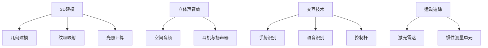

                 

在21世纪，虚拟现实（Virtual Reality，简称VR）技术已经从一个科幻小说中的概念逐步转变为现实世界中的关键技术。本文将深入探讨虚拟现实的核心概念、技术架构、算法原理、数学模型、实践应用以及未来发展趋势，旨在为读者提供一个全面而深入的虚拟现实技术导览。

## 关键词

- 虚拟现实（Virtual Reality）
- 3D建模
- 立体声音效
- 交互技术
- 人工智能
- 增强现实（Augmented Reality）

## 摘要

本文将首先介绍虚拟现实的历史背景和定义，然后深入讨论其核心概念和架构，包括3D建模、立体声音效、交互技术等。接下来，我们将探讨虚拟现实技术中的关键算法原理，包括图像处理、运动追踪、人工智能等。随后，我们将通过具体的数学模型和公式，详细讲解虚拟现实中的复杂计算过程。文章还将展示一些虚拟现实的项目实践案例，并分析其实际应用场景。最后，我们将展望虚拟现实技术的未来发展趋势和面临的挑战。

## 1. 背景介绍

虚拟现实技术的起源可以追溯到20世纪60年代的美国。当时的计算机科学家和工程师们开始探索如何将计算机生成的图像和声音与人类感官体验相结合，以创造一种全新的现实感知方式。早期的虚拟现实设备主要基于头戴显示器（Head-Mounted Display，HMD）和简单的交互设备，如数据手套和传感器。

随着计算机性能的不断提高和显示技术的进步，虚拟现实技术逐渐走向成熟。1990年代，VR设备开始出现在市场上，如索尼的PlayStation VR和Oculus Rift等，这些设备为消费者提供了更为沉浸式的体验。进入21世纪，随着人工智能和增强现实技术的快速发展，虚拟现实的应用领域得到了极大的拓展。

虚拟现实技术的快速发展不仅改变了娱乐行业，还在医疗、教育、工业设计、军事训练等多个领域展现出巨大的潜力。例如，在医疗领域，虚拟现实技术被用于手术模拟、心理治疗和康复训练；在教育领域，虚拟现实技术为学生提供了更为生动和互动的学习体验；在工业设计领域，虚拟现实技术被用于产品设计和用户体验测试。

### 1.1 虚拟现实的定义和核心概念

虚拟现实（Virtual Reality，VR）是一种通过计算机生成的人工环境，使用户能够沉浸在完全不同的虚拟世界中。与增强现实（Augmented Reality，AR）不同，虚拟现实完全取代了用户对现实世界的感知，用户通过头戴显示器、VR眼镜等设备看到和听到的都是虚拟环境。

核心概念包括：

- **3D建模**：通过计算机生成三维模型，用于创建虚拟环境。3D建模技术包括几何建模、纹理映射和光照计算等。
- **立体声音效**：使用多个声源和空间音频技术，为用户创造一个沉浸式的听觉体验。
- **交互技术**：用户通过手势、语音、控制杆等设备与虚拟环境进行交互。
- **运动追踪**：通过传感器和摄像头跟踪用户的动作和位置，实现身临其境的体验。

### 1.2 虚拟现实技术的发展历程

- **早期阶段**（1960-1980年代）：计算机图形学和人工智能的兴起为虚拟现实技术的发展奠定了基础。1960年代，美国科学家伊凡·苏瑟兰（Ivan Sutherland）发明了第一个头戴显示器（HMD）。
- **起步阶段**（1980-1990年代）：虚拟现实设备开始面市，如维维安（Vivian）和维苏尔（Visor）等。
- **成熟阶段**（2000-2010年代）：随着显示技术和传感器技术的进步，虚拟现实设备逐渐走向成熟。Oculus Rift、PlayStation VR等设备成为市场热点。
- **多元化阶段**（2010年代至今）：虚拟现实技术开始应用于多个领域，如医疗、教育、工业等。同时，人工智能和增强现实技术的融入，使虚拟现实的应用更加广泛。

### 1.3 虚拟现实技术的现状和应用

虚拟现实技术已经在多个领域得到广泛应用。以下是一些典型的应用场景：

- **医疗**：虚拟现实技术被用于手术模拟、心理治疗和康复训练。
- **教育**：虚拟现实技术为学生提供了更为生动和互动的学习体验。
- **工业**：虚拟现实技术被用于产品设计和用户体验测试。
- **娱乐**：虚拟现实游戏和影视作品吸引了大量用户。

### 1.4 虚拟现实技术的市场前景

随着技术的不断进步和应用的拓展，虚拟现实市场预计将继续增长。根据市场研究机构的预测，全球虚拟现实市场的规模将在未来几年内达到数十亿美元。这一趋势将推动虚拟现实技术在更多领域的应用，如房地产、旅游、艺术等。

### 1.5 虚拟现实技术面临的挑战

尽管虚拟现实技术具有巨大的潜力，但仍然面临一些挑战，如：

- **硬件成本**：高质量的虚拟现实设备价格昂贵，限制了普及。
- **用户体验**：如何提高用户的沉浸感和舒适度，是虚拟现实技术需要解决的重要问题。
- **内容创作**：高质量虚拟现实内容的创作成本较高，限制了内容的丰富度。
- **隐私和安全**：虚拟现实应用需要处理大量用户数据，如何确保用户隐私和安全是一个重要问题。

## 2. 核心概念与联系

### 2.1 3D建模

3D建模是虚拟现实技术的核心组成部分，用于创建虚拟环境中的三维物体和场景。3D建模技术包括几何建模、纹理映射和光照计算等。

#### 2.1.1 几何建模

几何建模是通过计算几何的方法创建三维物体的过程。常见的几何建模技术包括：

- **多面体建模**：使用多边形网格表示三维物体。
- **曲面建模**：使用曲面来表示复杂的几何形状，如NURBS曲面。

#### 2.1.2 纹理映射

纹理映射是将二维图像映射到三维物体表面的过程，用于增加物体的细节和真实感。

- **平面纹理映射**：将图像直接映射到物体的某个面上。
- **投影纹理映射**：根据物体的形状和光照条件，动态计算纹理的投影。

#### 2.1.3 光照计算

光照计算是模拟虚拟环境中光线传播和反射的过程，用于创建真实感的光照效果。

- **全局光照**：考虑光线的多次反射和散射，如路径追踪和光子映射。
- **局部光照**：简化光照模型，如Blinn-Phong模型和Lambert模型。

### 2.2 立体声音效

立体声音效是虚拟现实体验的重要组成部分，通过模拟空间中的声音传播，为用户创造一个沉浸式的听觉体验。

#### 2.2.1 空间音频

空间音频技术用于模拟声音在三维空间中的传播，包括声音的反射、折射和衍射。

- **声波传播模型**：使用声波传播模型模拟声音在虚拟环境中的传播。
- **空间混音**：将多个声源的声音混合成一个立体声信号，用于播放。

#### 2.2.2 耳机与扬声器

立体声音效的输出设备包括耳机和扬声器。耳机用于提供个人化的沉浸式体验，而扬声器则用于在公共空间中播放立体声音效。

- **耳机**：使用多个驱动单元和精确的声学设计，实现高质量的立体声音效。
- **扬声器**：使用多个扬声器单元和空间布置，模拟虚拟环境中的声音效果。

### 2.3 交互技术

交互技术是用户与虚拟环境之间的交互手段，包括手势识别、语音识别、控制杆等。

#### 2.3.1 手势识别

手势识别技术用于识别用户的手部动作，通过计算机视觉算法实现。

- **深度相机**：使用深度相机捕获用户手部的三维信息。
- **机器学习**：使用机器学习算法训练模型，识别不同的手势。

#### 2.3.2 语音识别

语音识别技术用于将用户的语音输入转换为文本或指令，通过自然语言处理技术实现。

- **语音识别引擎**：使用深度学习模型实现高精度的语音识别。
- **语音合成**：将文本转换为自然流畅的语音输出。

#### 2.3.3 控制杆

控制杆是传统的交互设备，通过操纵控制杆，用户可以在虚拟环境中进行导航和操作。

- **机械式控制杆**：使用机械结构实现控制杆的物理运动。
- **电子式控制杆**：使用电子传感器实现控制杆的精确控制。

### 2.4 运动追踪

运动追踪技术用于跟踪用户的动作和位置，为虚拟现实提供真实感。

#### 2.4.1 激光雷达

激光雷达是一种常用的运动追踪设备，通过发射激光束并测量反射时间，获取环境的三维信息。

- **结构光**：使用结构光技术获取三维点云数据。
- **时间飞行**：使用时间飞行技术测量激光束的反射时间。

#### 2.4.2 惯性测量单元

惯性测量单元（IMU）是一种用于测量加速度和角速度的传感器，常用于虚拟现实中的运动追踪。

- **加速度计**：测量物体的加速度。
- **陀螺仪**：测量物体的角速度。

### 2.5 Mermaid 流程图

以下是一个Mermaid流程图，展示虚拟现实技术中的核心概念和它们之间的联系：



### 2.6 虚拟现实技术的架构

虚拟现实技术的架构通常包括以下几个关键部分：

- **硬件**：包括头戴显示器（HMD）、传感器、控制器等。
- **软件**：包括虚拟环境生成、交互处理、声音处理等。
- **网络**：用于实时传输虚拟环境的数据。

### 2.7 虚拟现实技术的应用场景

虚拟现实技术在多个领域具有广泛的应用，以下是一些典型的应用场景：

- **娱乐**：虚拟现实游戏、虚拟现实电影等。
- **教育**：虚拟现实课堂、虚拟现实实验室等。
- **医疗**：虚拟现实手术模拟、心理治疗等。
- **工业**：虚拟现实产品设计、虚拟现实维修等。
- **房地产**：虚拟现实看房、虚拟现实装修设计等。

## 3. 核心算法原理 & 具体操作步骤

### 3.1 算法原理概述

虚拟现实技术的核心算法主要包括图像处理、运动追踪和人工智能等。

#### 3.1.1 图像处理

图像处理是虚拟现实技术中不可或缺的一部分，用于生成和优化虚拟环境中的图像。

- **图像渲染**：将三维模型转换为二维图像，用于显示。
- **图像增强**：提高图像的质量和清晰度。
- **图像识别**：识别图像中的物体和场景。

#### 3.1.2 运动追踪

运动追踪技术用于跟踪用户的动作和位置，为虚拟现实提供真实感。

- **光学追踪**：使用摄像头和标记物进行运动追踪。
- **惯性追踪**：使用惯性测量单元进行运动追踪。

#### 3.1.3 人工智能

人工智能技术在虚拟现实中的应用主要包括：

- **机器学习**：用于图像识别、语音识别和运动追踪。
- **自然语言处理**：用于语音交互和文本理解。
- **增强学习**：用于优化用户的交互体验。

### 3.2 算法步骤详解

#### 3.2.1 图像处理

1. **图像渲染**：
   - 使用三维模型和光照计算生成虚拟环境中的图像。
   - 使用透视投影将三维场景投影到二维平面上。

2. **图像增强**：
   - 使用图像增强算法提高图像的质量和清晰度。
   - 使用去噪、对比度增强等技术。

3. **图像识别**：
   - 使用深度学习模型识别图像中的物体和场景。
   - 使用卷积神经网络（CNN）等深度学习技术。

#### 3.2.2 运动追踪

1. **光学追踪**：
   - 使用摄像头捕获用户的动作和位置。
   - 使用标记物和图像处理算法进行运动追踪。

2. **惯性追踪**：
   - 使用惯性测量单元（IMU）测量用户的加速度和角速度。
   - 使用卡尔曼滤波等算法进行运动追踪。

#### 3.2.3 人工智能

1. **机器学习**：
   - 使用监督学习、无监督学习和增强学习等方法训练模型。
   - 使用数据集对模型进行训练和优化。

2. **自然语言处理**：
   - 使用语言模型和语音识别技术实现语音交互。
   - 使用文本理解技术处理用户的文本输入。

3. **增强学习**：
   - 使用增强学习算法优化用户的交互体验。
   - 使用奖励机制和策略网络进行学习。

### 3.3 算法优缺点

#### 3.3.1 图像处理

**优点**：
- **高质量**：图像处理技术可以生成高质量的虚拟环境。
- **实时性**：现代图像处理算法可以实现实时渲染。

**缺点**：
- **计算复杂度**：图像处理算法通常需要大量的计算资源。
- **精度限制**：图像处理技术的精度受限于硬件性能和算法设计。

#### 3.3.2 运动追踪

**优点**：
- **高精度**：光学追踪和惯性追踪技术可以提供高精度的运动追踪。
- **实时性**：运动追踪算法可以实时更新用户的位置和动作。

**缺点**：
- **设备成本**：高质量的追踪设备价格较高，限制了普及。
- **环境依赖**：光学追踪技术对环境光线和标记物的要求较高。

#### 3.3.3 人工智能

**优点**：
- **自适应**：人工智能技术可以根据用户行为进行自适应调整。
- **智能化**：人工智能技术可以提供智能化的人机交互体验。

**缺点**：
- **数据依赖**：人工智能模型的训练和优化需要大量的数据。
- **安全性**：人工智能系统的安全性是一个重要问题。

### 3.4 算法应用领域

虚拟现实技术的核心算法在多个领域具有广泛的应用，以下是一些典型的应用领域：

- **娱乐**：虚拟现实游戏、虚拟现实影视等。
- **教育**：虚拟现实教学、虚拟现实培训等。
- **医疗**：虚拟现实手术模拟、虚拟现实康复训练等。
- **工业**：虚拟现实产品设计、虚拟现实维修等。
- **军事**：虚拟现实军事训练、虚拟现实模拟等。

## 4. 数学模型和公式 & 详细讲解 & 举例说明

### 4.1 数学模型构建

在虚拟现实技术中，数学模型用于描述和计算虚拟环境中的各种现象，如光照、声音和运动等。以下是几个关键的数学模型和公式。

#### 4.1.1 光照模型

光照模型用于计算虚拟环境中物体表面的光照效果。最常用的光照模型是Blinn-Phong模型，其公式如下：

\[ I_o = I_d + I_s \]

其中，\( I_o \) 是总光照强度，\( I_d \) 是漫反射光照强度，\( I_s \) 是镜面反射光照强度。

- **漫反射光照**：
\[ I_d = \frac{kd \cdot N \cdot L}{d^2} \]

其中，\( k_d \) 是漫反射系数，\( N \) 是物体表面的法线向量，\( L \) 是光源方向向量，\( d \) 是光源到物体表面的距离。

- **镜面反射光照**：
\[ I_s = \frac{ks \cdot (R \cdot V)^2}{d^2} \]

其中，\( k_s \) 是镜面反射系数，\( R \) 是反射向量，\( V \) 是视图向量。

#### 4.1.2 声波传播模型

声波传播模型用于计算声音在虚拟环境中的传播效果。最常用的声波传播模型是射线追踪模型，其公式如下：

\[ T(r, t) = T_0 \cdot e^{-\alpha \cdot r} \cdot \cos(\omega \cdot t - \phi) \]

其中，\( T(r, t) \) 是在位置\( r \)和时间\( t \)处的声波强度，\( T_0 \) 是初始声波强度，\( \alpha \) 是声波衰减系数，\( \omega \) 是声波频率，\( \phi \) 是声波相位。

#### 4.1.3 运动追踪模型

运动追踪模型用于计算用户的动作和位置。最常用的运动追踪模型是卡尔曼滤波模型，其公式如下：

\[ x_k = A \cdot x_{k-1} + B \cdot u_k \]
\[ P_k = A \cdot P_{k-1} \cdot A^T + Q \]
\[ K_k = P_k \cdot H^T \cdot (H \cdot P_k \cdot H^T + R)^{-1} \]
\[ x_{k|k} = x_k - K_k \cdot (z_k - H \cdot x_k) \]
\[ P_{k|k} = (I - K_k \cdot H) \cdot P_k \]

其中，\( x_k \) 是在时间\( k \)处的状态向量，\( P_k \) 是状态协方差矩阵，\( A \) 是状态转移矩阵，\( B \) 是控制矩阵，\( u_k \) 是控制向量，\( K_k \) 是卡尔曼增益，\( H \) 是观测矩阵，\( z_k \) 是观测向量，\( R \) 是观测噪声协方差矩阵。

### 4.2 公式推导过程

以下是对Blinn-Phong光照模型的推导过程的详细讲解。

#### 4.2.1 漫反射光照

漫反射光照的推导基于光的反射定律和能量守恒定律。

- **反射定律**：入射光线和反射光线位于同一平面内，且入射角等于反射角。
- **能量守恒定律**：入射光线的能量等于反射光线的能量。

假设一个光源\( L \)照射到一个物体表面，物体表面的法线向量为\( N \)，漫反射系数为\( k_d \)。入射光线与法线的夹角为\( \theta \)，反射光线与法线的夹角也为\( \theta \)。

根据反射定律，反射光线的方向可以表示为\( R = 2(N \cdot L)N - L \)。

漫反射光照的强度可以表示为：
\[ I_d = \frac{L \cdot N}{d^2} \]

其中，\( d \)是光源到物体表面的距离。

将反射向量代入上式，得到：
\[ I_d = \frac{L \cdot (2(N \cdot L)N - L)}{d^2} \]

化简后得到：
\[ I_d = \frac{2(N \cdot L)^2 N - L^2}{d^2} \]

由于\( N \cdot N = 1 \)，所以：
\[ I_d = \frac{2(N \cdot L)^2 N - L^2}{d^2} \]

\[ I_d = \frac{2(N \cdot L)^2 N - L^2}{d^2} \]

#### 4.2.2 镜面反射光照

镜面反射光照的推导基于光的反射定律和能量守恒定律。

假设一个光源\( L \)照射到一个物体表面，物体表面的法线向量为\( N \)，镜面反射系数为\( k_s \)。入射光线与法线的夹角为\( \theta \)，反射光线与法线的夹角也为\( \theta \)。

根据反射定律，反射光线的方向可以表示为\( R = 2(N \cdot L)N - L \)。

镜面反射光照的强度可以表示为：
\[ I_s = \frac{(R \cdot V)^2}{d^2} \]

其中，\( V \)是视图向量，\( d \)是光源到物体表面的距离。

将反射向量代入上式，得到：
\[ I_s = \frac{((2(N \cdot L)N - L) \cdot V)^2}{d^2} \]

化简后得到：
\[ I_s = \frac{4(N \cdot L)^2 (N \cdot V)^2 - 4(N \cdot L) (N \cdot V) L \cdot V^2 + L^2 V^2}{d^2} \]

由于\( N \cdot N = 1 \)，\( V \cdot V = 1 \)，所以：
\[ I_s = \frac{4(N \cdot L)^2 (N \cdot V)^2 - 4(N \cdot L) (N \cdot V) L \cdot V^2 + L^2 V^2}{d^2} \]

\[ I_s = \frac{4(N \cdot L)^2 (N \cdot V)^2 - 4(N \cdot L) (N \cdot V) L \cdot V^2 + L^2 V^2}{d^2} \]

### 4.3 案例分析与讲解

以下是一个虚拟现实项目中光照模型的实际应用案例。

#### 4.3.1 项目背景

一家游戏开发公司正在开发一款虚拟现实游戏，游戏中包括一个虚拟城市环境。为了提高游戏的沉浸感，公司决定使用Blinn-Phong光照模型来计算场景中的光照效果。

#### 4.3.2 技术实现

- **场景建模**：使用3D建模软件创建虚拟城市环境中的建筑物、道路和植被等。
- **光照计算**：使用Blinn-Phong光照模型计算场景中的光照效果，包括漫反射光照和镜面反射光照。
- **渲染引擎**：使用渲染引擎（如Unity或Unreal Engine）实现光照模型的计算和渲染。

#### 4.3.3 结果分析

通过Blinn-Phong光照模型的计算，虚拟城市环境中的建筑物和植被表面呈现出丰富的光照效果。特别是在阳光直射和阴影区域，光照效果更加逼真，增强了游戏的沉浸感。

#### 4.3.4 优化建议

- **光线追踪**：为了进一步提高光照效果的真实性，可以考虑使用光线追踪技术替代Blinn-Phong光照模型。
- **全局光照**：引入全局光照模型（如路径追踪或光子映射），模拟光线的多次反射和散射效果。

## 5. 项目实践：代码实例和详细解释说明

### 5.1 开发环境搭建

为了更好地理解虚拟现实技术，我们将使用Unity游戏引擎和C#编程语言来开发一个简单的虚拟现实项目。以下是搭建开发环境的具体步骤：

1. **安装Unity Hub**：首先，从Unity官方网站下载并安装Unity Hub，这是Unity IDE的安装和管理工具。

2. **创建Unity项目**：
   - 打开Unity Hub，点击“新建”按钮，选择“3D项目”并点击“创建项目”。
   - 在弹出的窗口中，选择项目存储位置，输入项目名称，并选择Unity版本。

3. **安装虚拟现实插件**：
   - 在Unity项目目录下打开终端或命令行窗口。
   - 使用以下命令安装虚拟现实插件：
     ```bash
     unity editor -quit
     ```
   - 重启Unity Editor，插件将被自动安装。

4. **设置虚拟现实设备**：
   - 在Unity Editor中，点击“Edit”菜单，选择“Project Settings”。
   - 在“Player”设置中，找到“Virtual Reality Supported”选项，将其设置为“iOS/Android”或“Windows/Mac/Linux”。
   - 根据您的虚拟现实设备，选择相应的设备配置文件。

### 5.2 源代码详细实现

以下是使用C#语言在Unity中实现虚拟现实项目的源代码。

```csharp
using UnityEngine;

public class VRController : MonoBehaviour
{
    public GameObject playerCamera;
    public Transform playerTransform;

    private float rotationSpeed = 5.0f;

    void Update()
    {
        // 处理用户的头部旋转
        float horizontalRotation = Input.GetAxis("Mouse X") * rotationSpeed;
        float verticalRotation = Input.GetAxis("Mouse Y") * rotationSpeed;

        playerTransform.Rotate(0, horizontalRotation, 0);
        playerCamera.Rotate(-verticalRotation, 0, 0);

        // 处理用户的移动
        float forwardMovement = Input.GetAxis("Vertical") * 5.0f;
        float sidewaysMovement = Input.GetAxis("Horizontal") * 5.0f;

        playerTransform.position += playerTransform.forward * forwardMovement * Time.deltaTime;
        playerTransform.position += playerTransform.right * sidewaysMovement * Time.deltaTime;
    }
}
```

### 5.3 代码解读与分析

1. **类定义**：
   - `VRController` 类负责处理用户的头部旋转和移动。

2. **变量**：
   - `playerCamera`：游戏对象，代表玩家的视角。
   - `playerTransform`：玩家游戏对象的Transform组件，用于存储位置和旋转信息。
   - `rotationSpeed`：用户旋转速度的系数。

3. **Update 方法**：
   - `Update` 方法在每个帧中调用，用于处理用户的输入并更新玩家的位置和旋转。

4. **用户旋转**：
   - 使用 `Input.GetAxis("Mouse X")` 和 `Input.GetAxis("Mouse Y")` 获取鼠标的X和Y轴输入。
   - 将鼠标输入转换为旋转角度，并通过 `playerTransform.Rotate` 方法更新玩家的旋转。

5. **用户移动**：
   - 使用 `Input.GetAxis("Vertical")` 和 `Input.GetAxis("Horizontal")` 获取键盘的上下和左右输入。
   - 计算移动速度，并通过 `playerTransform.position` 的更新来移动玩家。

### 5.4 运行结果展示

在Unity Editor中运行上述代码，将出现一个虚拟现实场景。用户可以通过鼠标旋转视角，通过键盘控制玩家的移动。这种交互方式为用户提供了沉浸式的体验。

### 5.5 优化与扩展

- **增加交互元素**：添加游戏对象和交互逻辑，如门、按钮等，为用户提供更多的交互体验。
- **优化性能**：使用级联静态批处理和LOD技术优化场景性能。
- **增加AI角色**：添加AI角色和交互逻辑，提高虚拟现实场景的互动性。

## 6. 实际应用场景

虚拟现实技术在实际应用场景中展现出极大的潜力和价值。以下是几个典型的应用领域：

### 6.1 娱乐

在娱乐领域，虚拟现实技术被广泛应用于游戏、影视和主题公园等。通过虚拟现实技术，用户可以体验到前所未有的沉浸式娱乐体验。例如，虚拟现实游戏让玩家仿佛置身于游戏世界，而虚拟现实电影则为观众提供了全新的观影体验。

### 6.2 教育

虚拟现实技术在教育领域的应用也非常广泛。通过虚拟现实技术，学生可以身临其境地探索历史事件、自然科学和艺术等领域。例如，虚拟现实课堂让学生能够参观虚拟博物馆，而虚拟实验室则为学生提供了安全、可重复的实验环境。

### 6.3 医疗

在医疗领域，虚拟现实技术被用于手术模拟、心理治疗和康复训练。通过虚拟现实技术，医生可以进行复杂的手术练习，而患者则可以通过虚拟现实进行心理治疗和康复训练，从而提高治疗效果。

### 6.4 工业

虚拟现实技术在工业领域的应用主要包括产品设计、维修和培训等。通过虚拟现实技术，设计师可以在虚拟环境中进行产品设计和用户体验测试，而工程师则可以在虚拟环境中进行维修和培训，从而提高工作效率和质量。

### 6.5 军事

虚拟现实技术在军事领域也有广泛的应用，包括军事训练、模拟演习和战场模拟等。通过虚拟现实技术，士兵可以进行高仿真训练，从而提高战斗技能和反应速度。

### 6.6 其他领域

虚拟现实技术还在房地产、旅游、艺术等多个领域展现出巨大的应用潜力。例如，虚拟现实看房和虚拟旅游让用户能够提前体验未来的居住环境和旅游目的地，而虚拟艺术展览则为观众提供了全新的艺术体验。

### 6.7 潜力分析

随着虚拟现实技术的不断发展和完善，其应用领域将不断扩展。以下是几个具有潜力的应用领域：

- **远程工作与协作**：虚拟现实技术可以为远程工作人员提供一个身临其境的协作环境。
- **虚拟旅游**：通过虚拟现实技术，用户可以虚拟游览世界各地的名胜古迹。
- **虚拟购物**：虚拟现实技术可以为用户提供一个沉浸式的购物体验，从而提高购物满意度。
- **虚拟教育**：虚拟现实技术可以为学生提供更加丰富和生动的学习体验，提高学习效果。

## 7. 未来应用展望

虚拟现实技术正处于快速发展阶段，未来将在更多领域展现出其强大的应用潜力。以下是几个潜在的应用方向：

### 7.1 智能家居

随着人工智能和物联网技术的发展，虚拟现实技术有望成为智能家居的重要组成部分。通过虚拟现实技术，用户可以远程控制家居设备，实现智能化的家居环境。

### 7.2 远程医疗

虚拟现实技术可以显著改善远程医疗服务。医生可以通过虚拟现实技术进行远程手术指导和会诊，从而提高医疗服务质量和效率。

### 7.3 虚拟现实社交

虚拟现实技术可以为用户提供全新的社交体验。虚拟现实社交平台将允许用户在虚拟环境中进行互动，从而拓展社交圈子。

### 7.4 教育游戏化

虚拟现实技术可以与教育游戏相结合，为学生提供更加生动和互动的学习体验。通过虚拟现实教育游戏，学生可以更好地理解和掌握知识。

### 7.5 虚拟现实医疗康复

虚拟现实技术在医疗康复领域的应用前景广阔。通过虚拟现实技术，患者可以进行个性化的康复训练，从而提高康复效果。

### 7.6 虚拟现实旅游

虚拟现实技术可以为用户提供虚拟旅游体验，让用户在虚拟环境中游览世界各地的名胜古迹。这种体验将极大地丰富用户的旅游生活。

### 7.7 虚拟现实娱乐

虚拟现实娱乐将继续成为虚拟现实技术的重点应用领域。通过虚拟现实游戏、虚拟现实电影等，用户可以享受前所未有的娱乐体验。

## 8. 工具和资源推荐

### 8.1 学习资源推荐

- **《虚拟现实技术原理与应用》**：这是一本关于虚拟现实技术的经典教材，详细介绍了虚拟现实的核心概念、技术架构和应用案例。
- **《Unity官方文档**：Unity官方网站提供了丰富的虚拟现实开发教程和文档，是学习Unity虚拟现实开发的必备资源。

### 8.2 开发工具推荐

- **Unity游戏引擎**：Unity是一款功能强大的游戏引擎，适用于虚拟现实开发。
- **Unreal Engine**：Unreal Engine是一款高性能的游戏引擎，也广泛应用于虚拟现实开发。

### 8.3 相关论文推荐

- **“A Survey on Virtual Reality”**：这是一篇关于虚拟现实技术的综述论文，涵盖了虚拟现实技术的发展历程、核心技术和应用场景。
- **“Virtual Reality for Mental Health: Current State and Future Trends”**：这是一篇关于虚拟现实技术在心理健康领域应用的研究论文，分析了虚拟现实技术在心理治疗和心理康复方面的潜力。

## 9. 总结：未来发展趋势与挑战

虚拟现实技术正处于快速发展阶段，未来将在更多领域展现出其强大的应用潜力。然而，要实现虚拟现实的广泛应用，仍然面临一些挑战：

### 9.1 研究成果总结

- 虚拟现实技术从早期的概念逐步走向成熟，应用领域不断拓展。
- 图像处理、运动追踪和人工智能等关键算法在虚拟现实技术中发挥了重要作用。
- 虚拟现实硬件和软件的进步为用户提供了更好的沉浸式体验。

### 9.2 未来发展趋势

- 虚拟现实技术将与其他技术（如人工智能、物联网）结合，推动智能家居、远程医疗等领域的发展。
- 虚拟现实内容的创作和分发将变得更加丰富和便捷。
- 虚拟现实技术的普及将促进教育、娱乐等行业的变革。

### 9.3 面临的挑战

- **硬件成本**：高质量的虚拟现实设备价格较高，限制了普及。
- **用户体验**：如何提高用户的沉浸感和舒适度，是虚拟现实技术需要解决的重要问题。
- **内容创作**：高质量虚拟现实内容的创作成本较高，限制了内容的丰富度。
- **隐私和安全**：虚拟现实应用需要处理大量用户数据，如何确保用户隐私和安全是一个重要问题。

### 9.4 研究展望

未来，虚拟现实技术的研究应重点关注以下几个方面：

- **硬件优化**：通过改进硬件设计，降低虚拟现实设备的价格，提高普及率。
- **算法优化**：通过优化算法，提高虚拟现实技术的实时性和精度。
- **内容创作**：开发易于使用的虚拟现实内容创作工具，降低创作门槛。
- **隐私保护**：研究虚拟现实应用中的隐私保护技术，确保用户数据安全。

## 附录：常见问题与解答

### Q1：虚拟现实技术与其他技术的区别是什么？

**A**：虚拟现实（VR）是一种完全模拟的虚拟环境，用户在其中完全沉浸。增强现实（AR）则是将虚拟元素叠加在现实世界中。混合现实（MR）则是VR和AR的结合，用户既能看到虚拟元素，也能与现实环境互动。

### Q2：虚拟现实技术有哪些应用领域？

**A**：虚拟现实技术的应用领域广泛，包括娱乐、教育、医疗、工业、军事等。

### Q3：虚拟现实设备的硬件要求是什么？

**A**：高质量的虚拟现实设备通常需要高性能的处理器、显卡和显示器。例如，头戴显示器（HMD）需要高分辨率和低延迟的屏幕，而传感器则需要高精度的位置和运动追踪。

### Q4：如何确保虚拟现实应用的隐私和安全？

**A**：确保虚拟现实应用的隐私和安全需要从多个方面进行考虑，包括数据加密、权限控制和用户教育等。开发者应遵循最佳实践，使用安全框架和工具来保护用户数据。

### Q5：虚拟现实技术是否会替代现实世界？

**A**：虚拟现实技术不会替代现实世界，而是作为一种补充和增强。它为人们提供了新的体验和可能性，但现实世界仍然具有不可替代的价值。

### Q6：虚拟现实技术会对人类心理健康产生什么影响？

**A**：虚拟现实技术可以带来积极的影响，如心理治疗和减压。然而，过度使用虚拟现实技术可能会导致虚拟现实成瘾或其他心理健康问题。因此，合理使用和监控虚拟现实技术非常重要。

### Q7：虚拟现实技术是否会取代传统游戏和影视作品？

**A**：虚拟现实技术为游戏和影视作品提供了全新的体验，但它不会完全取代传统形式。传统游戏和影视作品仍然具有独特的魅力和价值，而虚拟现实技术则为其增添了新的维度。

### Q8：如何开始学习虚拟现实技术？

**A**：学习虚拟现实技术可以从以下几个方面入手：

- **基础知识**：了解虚拟现实技术的基本概念和技术原理。
- **实践项目**：通过实践项目来掌握虚拟现实技术的实际应用。
- **学习资源**：阅读相关书籍、观看教程视频和参加在线课程。
- **社区交流**：加入虚拟现实技术社区，与其他开发者交流经验和技巧。

### Q9：虚拟现实技术是否会取代传统的计算机图形学？

**A**：虚拟现实技术是计算机图形学的一个分支，它扩展了计算机图形学在沉浸式体验方面的应用。虚拟现实技术不会取代传统的计算机图形学，而是与之互补，共同推动图形学领域的发展。

### Q10：虚拟现实技术会对工作场所产生什么影响？

**A**：虚拟现实技术可以在多个方面影响工作场所，包括远程工作、虚拟会议、培训和教育等。它提高了工作效率和协作效果，但也需要企业适应新的工作模式和管理方法。

### Q11：虚拟现实技术是否会取代实体商店？

**A**：虚拟现实技术可以提供沉浸式的购物体验，但它不会完全取代实体商店。实体商店提供了真实的触感和互动体验，这是虚拟现实难以替代的。

### Q12：虚拟现实技术是否会对社会产生负面影响？

**A**：虚拟现实技术本身并不会对社会产生负面影响，但过度依赖和不当使用可能会带来问题。例如，沉迷于虚拟现实可能会导致社交隔离和心理健康问题。因此，合理使用虚拟现实技术并注意其负面影响非常重要。

### Q13：虚拟现实技术是否会改善人们的心理健康？

**A**：虚拟现实技术可以在某些情况下改善人们的心理健康，如心理治疗、减压和康复训练等。然而，并非所有人都适合使用虚拟现实技术，因此需要谨慎使用。

### Q14：虚拟现实技术是否会取代传统的旅游方式？

**A**：虚拟现实技术可以为用户提供虚拟旅游体验，但它不会完全取代传统的旅游方式。传统的旅游方式提供了真实的文化体验和与自然环境的互动，这是虚拟现实难以替代的。

### Q15：虚拟现实技术是否会改变人们的生活和工作方式？

**A**：虚拟现实技术已经并继续改变人们的生活和工作方式，提供了新的体验和可能性。它提高了工作效率、改变了娱乐方式，并促进了教育、医疗等多个领域的发展。然而，它也需要社会适应新的技术变革，确保其积极影响最大化。

