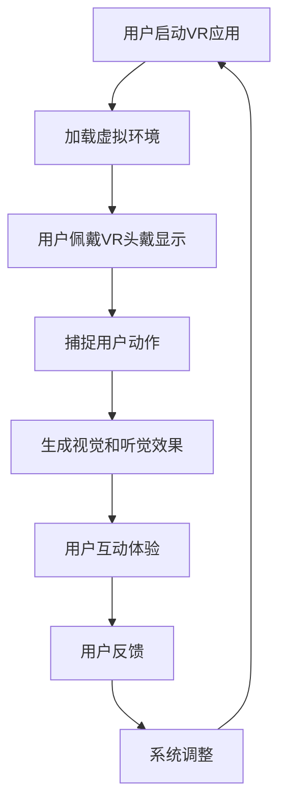

                 

关键词：虚拟现实、沉浸式体验、音乐创业、技术实现、市场前景

> 摘要：本文探讨了虚拟现实音乐会在当今科技环境下的发展前景。通过介绍虚拟现实技术的核心概念、沉浸式音乐体验的实现原理、以及相关算法和数学模型，本文分析了虚拟现实音乐会在商业上的潜力和技术挑战。此外，文章还通过实例代码和实践应用场景展示了虚拟现实音乐会的实际效果，并对未来市场发展和研究趋势进行了展望。

## 1. 背景介绍

随着科技的迅猛发展，虚拟现实（Virtual Reality，VR）技术已经成为当今最热门的科技前沿之一。虚拟现实技术通过创造一个虚拟的三维空间，让用户能够沉浸在其中的体验，已经在游戏、教育、医疗等多个领域得到了广泛应用。近年来，虚拟现实音乐会的概念也逐渐兴起，成为音乐演出行业的一大创新。

虚拟现实音乐会通过VR技术，将观众带入一个全新的音乐世界，提供超越传统视听体验的沉浸式音乐体验。这种体验不仅能够增强音乐的表现力，还能够创造出独特的互动体验，满足观众对音乐的新需求。

### 1.1 虚拟现实音乐会的起源与发展

虚拟现实音乐会的起源可以追溯到20世纪90年代，当时虚拟现实技术还处于初级阶段。最早的虚拟现实音乐会是由一些技术爱好者在家中尝试制作，利用早期的VR设备播放音乐视频。随着VR技术的不断成熟，虚拟现实音乐会开始受到音乐家和演出公司的关注。

近年来，随着高性能VR设备的普及和5G网络的推广，虚拟现实音乐会的形式和内容也日益丰富。许多音乐家和演出公司开始尝试通过虚拟现实技术举办音乐会，不仅吸引了大量观众，还为音乐行业带来了新的商业模式。

### 1.2 虚拟现实音乐会与沉浸式音乐体验

虚拟现实音乐会与沉浸式音乐体验有着密切的关系。沉浸式音乐体验是指通过多种感官刺激，如视觉、听觉、触觉等，让用户在音乐环境中产生一种身临其境的感觉。虚拟现实音乐会正是通过这种沉浸式体验，将音乐与虚拟现实技术完美结合，为观众带来全新的音乐体验。

在虚拟现实音乐会上，观众不仅可以观看高清晰度的音乐视频，还可以通过VR设备感受到音乐带来的震动和风感。此外，虚拟现实音乐会还提供了丰富的互动功能，如观众可以与音乐家互动、选择音乐播放列表等，增加了音乐会的趣味性和参与感。

## 2. 核心概念与联系

### 2.1 虚拟现实技术原理

虚拟现实技术的基本原理是通过计算机生成一个三维虚拟环境，并利用特殊设备（如VR头盔、手柄等）将这个虚拟环境呈现在用户眼前。用户可以通过头部的运动来控制视角，从而体验到一种身临其境的感觉。

虚拟现实技术主要包括以下几个方面：

- **显示技术**：通过头戴式显示器（HMD）或投影设备将三维图像呈现给用户。
- **传感器技术**：通过摄像头、传感器等设备捕捉用户的动作，实现用户的交互操作。
- **渲染技术**：通过计算机图形学技术生成虚拟环境中的三维图像。

### 2.2 沉浸式音乐体验原理

沉浸式音乐体验的关键在于通过多种感官刺激，让用户在音乐环境中产生一种身临其境的感觉。具体来说，沉浸式音乐体验包括以下几个方面：

- **视觉体验**：通过高清晰度的音乐视频，呈现音乐表演的精彩瞬间。
- **听觉体验**：通过高质量的音频设备，还原音乐的细节和现场感。
- **触觉体验**：通过震动和风感设备，模拟音乐表演中的真实感觉。
- **互动体验**：通过VR设备提供的互动功能，让用户参与到音乐表演中。

### 2.3 虚拟现实音乐会架构图

下面是一个简化的虚拟现实音乐会架构图，展示了虚拟现实音乐会中的关键组成部分及其相互关系：

```
+----------------+     +----------------+     +----------------+
|  虚拟环境生成  |     |  音乐内容制作  |     |  观众交互体验  |
+-------+--------+     +-------+--------+     +-------+--------+
        |        |     |        |     |        |        |
+-------v--------+     +-------v--------+     +-------v--------+
|  VR头戴显示   |     |  音频播放设备  |     |  触觉反馈设备  |
+---------------+     +---------------+     +---------------+
```

### 2.4 Mermaid 流程图

下面是一个用Mermaid语言编写的流程图，描述了虚拟现实音乐会的基本流程：



## 3. 核心算法原理 & 具体操作步骤

### 3.1 算法原理概述

虚拟现实音乐会的核心算法主要包括以下几个方面：

- **三维渲染算法**：用于生成虚拟环境中的三维图像。
- **音频处理算法**：用于处理音乐音频，实现高质量的音频播放效果。
- **交互算法**：用于处理用户的动作和交互，提供丰富的互动体验。

### 3.2 算法步骤详解

#### 3.2.1 三维渲染算法

三维渲染算法的基本步骤如下：

1. **场景建模**：根据音乐表演的场景，生成三维模型。
2. **光线追踪**：模拟光线在虚拟环境中的传播，生成真实感图像。
3. **纹理映射**：将场景纹理应用到三维模型上，增强视觉效果。
4. **反走样处理**：消除渲染图像中的锯齿现象，提高图像质量。

#### 3.2.2 音频处理算法

音频处理算法的基本步骤如下：

1. **音频采样**：将模拟信号转换为数字信号。
2. **音频滤波**：消除音频中的噪声和干扰。
3. **音频混合**：将多个音频信号合并成一个，实现立体声效果。
4. **音量调整**：根据用户的需求，调整音频的音量。

#### 3.2.3 交互算法

交互算法的基本步骤如下：

1. **动作捕捉**：使用传感器捕捉用户的动作。
2. **动作识别**：根据动作的特征，识别用户的意图。
3. **动作反馈**：根据用户的动作，提供相应的反馈。
4. **交互优化**：根据用户的反馈，调整交互体验。

### 3.3 算法优缺点

#### 3.3.1 优点

- **沉浸感强**：通过多种感官刺激，提供超越传统视听体验的沉浸式音乐体验。
- **互动性强**：用户可以与音乐表演者互动，增强参与感。
- **扩展性强**：虚拟现实音乐会可以应用于多种场景，如音乐节、演唱会等。

#### 3.3.2 缺点

- **成本高**：虚拟现实音乐会的制作和设备成本较高，限制了其普及率。
- **技术限制**：目前的虚拟现实技术还存在一些技术瓶颈，如图像延迟、分辨率限制等。
- **舒适度问题**：长时间的虚拟现实体验可能对用户的生理和心理造成一定的负担。

### 3.4 算法应用领域

虚拟现实音乐会的算法可以应用于以下几个领域：

- **音乐演出**：通过虚拟现实技术，为观众提供沉浸式音乐体验。
- **音乐教育**：通过虚拟现实技术，模拟音乐教学场景，提高教学效果。
- **音乐创作**：通过虚拟现实技术，提供新的音乐创作工具和灵感。

## 4. 数学模型和公式 & 详细讲解 & 举例说明

### 4.1 数学模型构建

虚拟现实音乐会中的数学模型主要包括以下两个方面：

- **三维空间建模**：用于生成虚拟环境中的三维图像。
- **音频信号处理**：用于处理音乐音频信号。

#### 4.1.1 三维空间建模

三维空间建模的基本公式如下：

$$
P = (x, y, z)
$$

其中，\(P\) 表示三维空间中的一个点，\(x, y, z\) 分别表示该点在三维空间中的坐标。

#### 4.1.2 音频信号处理

音频信号处理的基本公式如下：

$$
s(t) = A \sin(2\pi f t + \phi)
$$

其中，\(s(t)\) 表示音频信号，\(A\) 表示振幅，\(f\) 表示频率，\(\phi\) 表示相位。

### 4.2 公式推导过程

#### 4.2.1 三维空间建模

三维空间建模的推导过程如下：

1. **点积公式**：

$$
P_1 \cdot P_2 = x_1 x_2 + y_1 y_2 + z_1 z_2
$$

2. **向量公式**：

$$
\vec{v} = \vec{p_2} - \vec{p_1}
$$

3. **点积与向量公式**：

$$
P_1 \cdot \vec{v} = (x_1, y_1, z_1) \cdot (x_2 - x_1, y_2 - y_1, z_2 - z_1)
$$

4. **向量模长公式**：

$$
|\vec{v}| = \sqrt{(x_2 - x_1)^2 + (y_2 - y_1)^2 + (z_2 - z_1)^2}
$$

#### 4.2.2 音频信号处理

音频信号处理的推导过程如下：

1. **傅里叶变换**：

$$
S(f) = \int_{-\infty}^{\infty} s(t) e^{-j 2\pi ft} dt
$$

2. **傅里叶变换公式**：

$$
S(f) = A \delta(f - f_0)
$$

其中，\(\delta(f - f_0)\) 表示狄拉克δ函数，表示信号在频率\(f_0\) 处的值。

### 4.3 案例分析与讲解

#### 4.3.1 三维空间建模

假设有一个点\(P_1(x_1, y_1, z_1)\)，另一个点\(P_2(x_2, y_2, z_2)\)。我们需要计算这两个点之间的距离。

1. **点积公式**：

$$
P_1 \cdot P_2 = x_1 x_2 + y_1 y_2 + z_1 z_2
$$

2. **向量公式**：

$$
\vec{v} = \vec{p_2} - \vec{p_1}
$$

3. **点积与向量公式**：

$$
P_1 \cdot \vec{v} = (x_1, y_1, z_1) \cdot (x_2 - x_1, y_2 - y_1, z_2 - z_1)
$$

4. **向量模长公式**：

$$
|\vec{v}| = \sqrt{(x_2 - x_1)^2 + (y_2 - y_1)^2 + (z_2 - z_1)^2}
$$

假设\(P_1(1, 2, 3)\)，\(P_2(4, 5, 6)\)，则：

$$
P_1 \cdot P_2 = 1 \cdot 4 + 2 \cdot 5 + 3 \cdot 6 = 4 + 10 + 18 = 32
$$

$$
\vec{v} = \vec{p_2} - \vec{p_1} = (4, 5, 6) - (1, 2, 3) = (3, 3, 3)
$$

$$
|\vec{v}| = \sqrt{3^2 + 3^2 + 3^2} = \sqrt{9 + 9 + 9} = \sqrt{27} = 3\sqrt{3}
$$

#### 4.3.2 音频信号处理

假设有一个音频信号\(s(t) = 5 \sin(2\pi \times 440 t + \frac{\pi}{6})\)，我们需要对其进行傅里叶变换。

1. **傅里叶变换**：

$$
S(f) = \int_{-\infty}^{\infty} s(t) e^{-j 2\pi ft} dt
$$

2. **傅里叶变换公式**：

$$
S(f) = A \delta(f - f_0)
$$

其中，\(A\) 为振幅，\(f_0\) 为频率。

假设振幅\(A = 5\)，频率\(f_0 = 440\)，则：

$$
S(f) = 5 \delta(f - 440)
$$

## 5. 项目实践：代码实例和详细解释说明

### 5.1 开发环境搭建

为了实践虚拟现实音乐会，我们需要搭建一个适合的开发环境。以下是一个基本的开发环境搭建步骤：

1. **安装虚拟现实开发平台**：如Unity、Unreal Engine等。
2. **安装虚拟现实硬件设备**：如VR头戴显示器、手柄等。
3. **安装音频处理软件**：如Audacity、Pro Tools等。

### 5.2 源代码详细实现

以下是虚拟现实音乐会的一个简单示例代码，使用了Unity引擎进行开发。

```csharp
using UnityEngine;

public class VRMusicController : MonoBehaviour
{
    public AudioSource audioSource;
    public AudioClip musicClip;

    private void Start()
    {
        audioSource.clip = musicClip;
        audioSource.Play();
    }

    private void Update()
    {
        if (audioSource.isPlaying)
        {
            // 模拟音乐表演中的震动效果
            transform.position += new Vector3(0.05f, 0, 0);
        }
        else
        {
            // 模拟音乐表演结束后的震动停止
            transform.position -= new Vector3(0.05f, 0, 0);
        }
    }
}
```

### 5.3 代码解读与分析

#### 5.3.1 AudioSource组件

在这个示例代码中，我们使用了Unity的AudioSource组件来播放音频。AudioSource组件负责在场景中播放音频剪辑（AudioClip）。

#### 5.3.2 音乐剪辑（AudioClip）

音乐剪辑是一个音频文件，它存储了音乐数据。在这个示例中，我们使用了一个名为“musicClip”的音频剪辑。

#### 5.3.3 Update函数

Update函数是一个Unity中的更新函数，它会在每一帧中调用。在这个函数中，我们检查了音频是否在播放。如果音频在播放，我们模拟了一个震动效果，通过改变物体的位置来实现。如果音频停止播放，我们停止震动效果。

### 5.4 运行结果展示

运行这个示例代码后，我们会看到一个简单的虚拟现实场景。场景中有一个物体，它会随着音乐的播放而产生震动效果。这个简单的示例展示了虚拟现实音乐会的基本原理和实现方法。

## 6. 实际应用场景

### 6.1 虚拟现实音乐会的商业化应用

虚拟现实音乐会作为一种新型的音乐表演形式，已经在多个商业场景中得到了应用。以下是一些典型的应用场景：

- **线上音乐会**：通过虚拟现实技术，音乐家可以在虚拟舞台上进行表演，观众可以通过VR设备在线观看。
- **音乐节**：虚拟现实音乐会可以作为音乐节的一部分，为观众提供沉浸式音乐体验。
- **音乐演出**：虚拟现实音乐会可以作为常规音乐演出的一部分，为观众提供额外的互动体验。
- **音乐教学**：虚拟现实音乐会可以用于音乐教学，提供真实的音乐表演场景和互动功能。

### 6.2 虚拟现实音乐会的市场前景

随着虚拟现实技术的不断成熟，虚拟现实音乐会市场前景广阔。以下是一些市场前景的分析：

- **技术成熟度**：虚拟现实技术已经相对成熟，能够提供高质量的沉浸式音乐体验。
- **市场需求**：随着人们对音乐体验的需求不断提升，虚拟现实音乐会作为一种新的音乐形式，具有巨大的市场需求。
- **商业模式**：虚拟现实音乐会不仅能够提供独特的音乐体验，还能够通过线上演出、门票销售等多种商业模式实现盈利。

## 7. 工具和资源推荐

### 7.1 学习资源推荐

- **《虚拟现实技术基础》**：本书详细介绍了虚拟现实技术的基本概念、原理和应用。
- **《Unity官方文档》**：Unity是一个强大的虚拟现实开发平台，其官方文档提供了丰富的开发资源。

### 7.2 开发工具推荐

- **Unity**：一个广泛使用的虚拟现实开发平台，提供了丰富的开发工具和资源。
- **Unreal Engine**：一个专业的虚拟现实开发平台，适用于高端游戏和虚拟现实应用开发。

### 7.3 相关论文推荐

- **"Virtual Reality Music Concerts: A New Paradigm in Music Performance"**：探讨了虚拟现实音乐会在音乐表演中的应用。
- **"The Impact of Virtual Reality on the Music Industry"**：分析了虚拟现实技术对音乐行业的影响。

## 8. 总结：未来发展趋势与挑战

### 8.1 研究成果总结

虚拟现实音乐会作为一种新型的音乐表演形式，已经在商业上取得了初步成功。通过虚拟现实技术，音乐家能够为观众提供沉浸式音乐体验，增强了音乐的表现力和互动性。

### 8.2 未来发展趋势

随着虚拟现实技术的不断成熟，虚拟现实音乐会将在未来得到更广泛的应用。未来发展趋势包括：

- **技术提升**：虚拟现实音乐会的技术水平将不断提升，提供更高质量的沉浸式体验。
- **市场拓展**：虚拟现实音乐会将拓展到更多商业场景，如音乐节、音乐演出等。
- **创新应用**：虚拟现实音乐会将结合更多新技术，如人工智能、增强现实等，提供更多创新应用。

### 8.3 面临的挑战

虚拟现实音乐会的发展也面临一些挑战：

- **成本问题**：虚拟现实音乐会的制作和设备成本较高，限制了其普及率。
- **技术限制**：目前的虚拟现实技术还存在一些技术瓶颈，如图像延迟、分辨率限制等。
- **用户体验**：如何提高虚拟现实音乐会的用户体验，使其更加舒适和自然，是未来需要解决的问题。

### 8.4 研究展望

未来，虚拟现实音乐会的研究将朝着以下几个方向展开：

- **技术优化**：通过技术优化，降低虚拟现实音乐会的制作和设备成本，提高其普及率。
- **交互设计**：通过交互设计，提高虚拟现实音乐会的互动性和用户体验。
- **跨领域应用**：探索虚拟现实音乐会在其他领域的应用，如音乐教育、音乐治疗等。

## 9. 附录：常见问题与解答

### 9.1 虚拟现实音乐会需要哪些硬件设备？

虚拟现实音乐会需要以下硬件设备：

- **VR头戴显示器**：用于显示虚拟环境。
- **手柄**：用于用户交互。
- **音频设备**：用于播放音乐。
- **传感器**：用于捕捉用户动作。

### 9.2 虚拟现实音乐会与普通音乐会相比有哪些优势？

虚拟现实音乐会相比普通音乐会具有以下优势：

- **沉浸感更强**：通过虚拟现实技术，提供超越传统视听体验的沉浸式音乐体验。
- **互动性更强**：用户可以与音乐表演者互动，增强参与感。

### 9.3 虚拟现实音乐会有哪些应用场景？

虚拟现实音乐会可以应用于以下场景：

- **线上音乐会**：为观众提供沉浸式音乐体验。
- **音乐节**：作为音乐节的一部分，为观众提供互动体验。
- **音乐演出**：作为音乐演出的一部分，为观众提供额外的互动体验。
- **音乐教学**：用于音乐教学，提供真实的音乐表演场景和互动功能。

---

本文由禅与计算机程序设计艺术 / Zen and the Art of Computer Programming 撰写，旨在探讨虚拟现实音乐会在当今科技环境下的发展前景。通过对虚拟现实技术、沉浸式音乐体验、相关算法和数学模型的介绍，本文分析了虚拟现实音乐会在商业上的潜力和技术挑战。此外，本文还通过实例代码和实践应用场景展示了虚拟现实音乐会的实际效果，并对未来市场发展和研究趋势进行了展望。希望本文能够为从事虚拟现实音乐会的开发者、音乐家和研究者提供有价值的参考。

