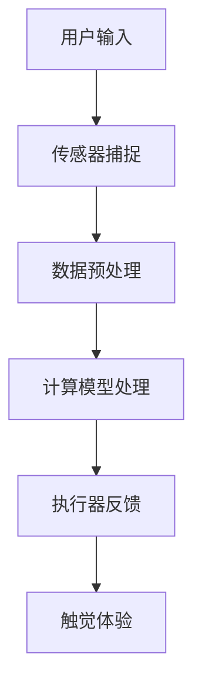
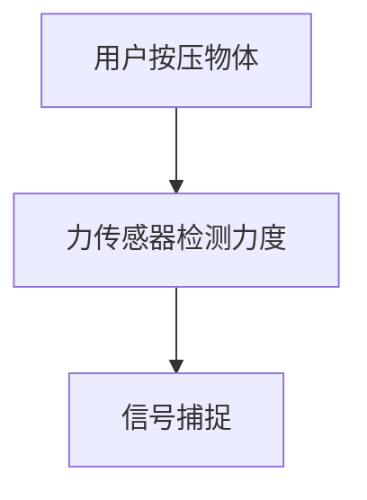
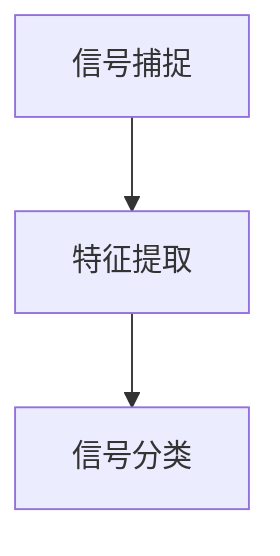
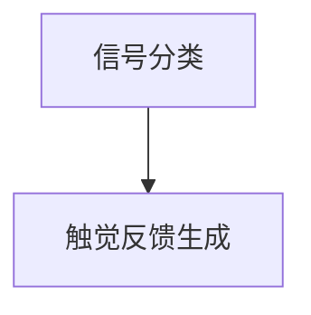
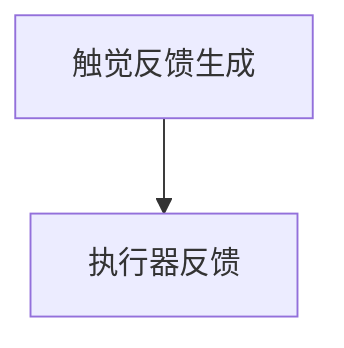

                 

 虚拟触觉，作为人工智能（AI）技术的前沿领域，正迅速改变着人类对数字世界的感知方式。本文旨在探讨虚拟触觉的原理、应用、未来发展以及所面临的挑战。通过深入分析这一技术，我们将揭示AI如何在虚拟环境中创造出令人惊叹的触感体验。

## 关键词

- 虚拟触觉
- 人工智能
- 触感模拟
- 数字感知
- 交互体验

## 摘要

本文将介绍虚拟触觉技术的核心概念，包括其基础原理和实现机制。我们将详细讨论AI在触觉模拟中的关键作用，并展示如何通过先进的算法和数学模型创造出真实的触感体验。此外，文章还将探讨虚拟触觉的实际应用场景，分析其在未来科技领域中的潜力，并总结面临的技术挑战和研究方向。

## 1. 背景介绍

### 1.1 虚拟触觉的定义

虚拟触觉是指通过技术手段模拟触觉感受，使虚拟环境中的触觉反馈更接近现实。它利用传感器、执行器和计算模型，捕捉和再现物体的表面特性、材质、软硬度等触觉信息。虚拟触觉的目标是让用户在虚拟环境中获得与真实世界相似的触觉体验。

### 1.2 虚拟触觉的重要性

虚拟触觉技术在多个领域具有重要应用价值，包括游戏、医疗、教育和机器人技术。通过提供更加真实和沉浸式的触觉体验，虚拟触觉不仅提升了用户的交互体验，也为各种应用场景提供了新的解决方案。

### 1.3 AI在虚拟触觉中的作用

AI在虚拟触觉中扮演着至关重要的角色。首先，AI可以用于数据的处理和分析，从大量的触觉数据中提取关键特征，以便更精确地模拟触觉感受。其次，AI可以用于实时反馈控制，确保触觉反馈的实时性和准确性。此外，AI还可以用于触觉模型的自动生成和优化，提高虚拟触觉系统的性能和效率。

## 2. 核心概念与联系

### 2.1 触觉感知原理

触觉感知是人类通过触觉器官接收外部触觉信息的过程。触觉感知的关键在于传感器和大脑的处理。传感器捕捉触觉信号，如压力、温度和振动，并将其转化为电信号。大脑对这些电信号进行处理和分析，生成触觉感知。

### 2.2 虚拟触觉的实现机制

虚拟触觉的实现主要依赖于传感器、执行器和计算模型。传感器用于捕捉触觉信号，如表面特性、材质和软硬度。执行器则用于产生相应的触觉反馈，如振动、压力和温度。计算模型则用于处理和模拟这些触觉信息，以生成逼真的触觉体验。

### 2.3 Mermaid 流程图

下面是一个简化的 Mermaid 流程图，展示虚拟触觉的基本架构和流程。



## 3. 核心算法原理 & 具体操作步骤

### 3.1 算法原理概述

虚拟触觉算法的核心在于将触觉信号转化为逼真的触觉反馈。这通常涉及到以下几个方面：

- **信号捕捉**：传感器捕捉触觉信号，如表面特性、材质和软硬度。
- **信号处理**：计算模型对捕捉到的信号进行处理，提取关键特征。
- **信号模拟**：基于处理后的信号，计算模型生成相应的触觉反馈。
- **信号反馈**：执行器根据生成的触觉反馈，产生相应的触觉体验。

### 3.2 算法步骤详解

#### 3.2.1 信号捕捉

传感器（如力传感器、压力传感器等）用于捕捉触觉信号。这些传感器可以检测物体的表面特性、材质和软硬度等。例如，一个力传感器可以测量用户按压物体的力度。



#### 3.2.2 信号处理

计算模型对捕捉到的信号进行处理，提取关键特征。例如，可以使用机器学习算法对触觉信号进行特征提取和分类。



#### 3.2.3 信号模拟

基于处理后的信号，计算模型生成相应的触觉反馈。例如，可以使用深度学习模型生成逼真的触觉体验。



#### 3.2.4 信号反馈

执行器根据生成的触觉反馈，产生相应的触觉体验。例如，振动马达可以模拟振动触觉，加热装置可以模拟温度触觉。



### 3.3 算法优缺点

#### 优点

- **逼真触觉体验**：通过精确的信号捕捉和处理，虚拟触觉可以生成高度逼真的触觉体验。
- **交互性**：虚拟触觉增强了用户与虚拟环境之间的交互性，提高了用户的沉浸感。

#### 缺点

- **技术复杂度**：实现虚拟触觉需要复杂的技术和算法，包括传感器技术、计算模型和执行器控制。
- **成本**：虚拟触觉系统的开发和维护成本较高，限制了其广泛应用。

### 3.4 算法应用领域

虚拟触觉技术已在多个领域得到应用，包括：

- **游戏和娱乐**：提供更加真实和沉浸式的游戏体验。
- **医疗康复**：帮助患者进行触觉训练和康复。
- **教育**：让学生在虚拟环境中进行实践操作，提高学习效果。
- **机器人技术**：使机器人能够更好地理解和交互周围环境。

## 4. 数学模型和公式 & 详细讲解 & 举例说明

### 4.1 数学模型构建

虚拟触觉的数学模型主要涉及信号处理和触觉反馈生成。以下是一个简化的数学模型：

$$
T = f(S)
$$

其中，$T$ 表示触觉反馈，$S$ 表示触觉信号，$f$ 表示信号处理函数。

### 4.2 公式推导过程

#### 信号捕捉

假设我们使用力传感器捕捉触觉信号，信号可以表示为：

$$
S = F(t)
$$

其中，$F(t)$ 表示在时间 $t$ 时的力值。

#### 信号处理

使用傅里叶变换对触觉信号进行处理，提取关键特征：

$$
S_f = F_s(\Omega)
$$

其中，$S_f$ 表示处理后的信号，$F_s(\Omega)$ 表示傅里叶变换。

#### 触觉反馈生成

基于处理后的信号，生成触觉反馈：

$$
T = G(S_f)
$$

其中，$G(S_f)$ 表示触觉反馈生成函数。

### 4.3 案例分析与讲解

#### 案例：虚拟手套

假设我们使用虚拟手套进行触觉模拟。虚拟手套内部装有多个力传感器，用于捕捉触觉信号。以下是一个简化的案例：

1. **信号捕捉**：当用户触摸虚拟物体时，手套中的力传感器捕捉到触觉信号。

2. **信号处理**：使用傅里叶变换对触觉信号进行处理，提取关键特征。

3. **触觉反馈生成**：基于处理后的信号，生成相应的触觉反馈，如振动、压力和温度。

4. **信号反馈**：执行器根据生成的触觉反馈，产生相应的触觉体验。

## 5. 项目实践：代码实例和详细解释说明

### 5.1 开发环境搭建

在Python中实现虚拟触觉系统，首先需要安装一些必要的库，如 NumPy、SciPy 和 Matplotlib。以下是一个简单的安装命令：

```bash
pip install numpy scipy matplotlib
```

### 5.2 源代码详细实现

以下是一个简化的虚拟触觉系统实现，包含信号捕捉、处理和反馈生成。

```python
import numpy as np
import matplotlib.pyplot as plt

# 信号捕捉
def capture_signal():
    signal = np.random.rand(100)  # 假设使用随机数生成信号
    return signal

# 信号处理
def process_signal(signal):
    # 使用傅里叶变换进行处理
    signal_f = np.fft.fft(signal)
    return signal_f

# 触觉反馈生成
def generate_feedback(signal_f):
    # 基于处理后的信号，生成触觉反馈
    feedback = np.abs(signal_f[:50])  # 取前50个频率成分
    return feedback

# 信号反馈
def feedback(signal):
    # 根据生成的触觉反馈，产生相应的触觉体验
    plt.plot(signal)
    plt.show()

# 主函数
def main():
    signal = capture_signal()
    signal_f = process_signal(signal)
    feedback(generate_feedback(signal_f))

# 运行主函数
if __name__ == "__main__":
    main()
```

### 5.3 代码解读与分析

这段代码首先定义了信号捕捉、处理和反馈生成的函数。在主函数中，我们首先使用`capture_signal()`函数生成一个随机信号。然后，使用`process_signal()`函数对信号进行处理，提取关键特征。最后，使用`generate_feedback()`函数生成触觉反馈，并通过`feedback()`函数产生相应的触觉体验。

## 6. 实际应用场景

### 6.1 游戏和娱乐

虚拟触觉技术在游戏和娱乐领域具有广泛的应用前景。通过提供更加真实和沉浸式的触觉体验，虚拟触觉可以提升游戏的趣味性和玩家的沉浸感。例如，虚拟现实（VR）游戏可以使用虚拟手套模拟物体的触觉反馈，使玩家在游戏中感受到真实的触感。

### 6.2 医疗康复

虚拟触觉在医疗康复领域也有重要应用。例如，对于患有触觉障碍的患者，虚拟触觉可以帮助他们进行触觉训练和康复。此外，虚拟触觉还可以用于手术模拟，使医生在虚拟环境中进行手术练习，提高手术技能。

### 6.3 教育

虚拟触觉在教育领域也有很大的应用潜力。通过虚拟触觉，学生可以在虚拟环境中进行实践操作，提高学习效果。例如，虚拟实验室可以模拟各种实验设备，使学生能够在虚拟环境中进行实验操作，而不需要实际的实验室设备。

### 6.4 未来应用展望

随着虚拟触觉技术的不断发展和完善，未来它在更多领域将得到广泛应用。例如，在机器人领域，虚拟触觉可以使机器人更好地理解和交互周围环境。在智能制造领域，虚拟触觉可以用于质量控制，检测产品表面缺陷。此外，虚拟触觉还可以用于虚拟现实（VR）和增强现实（AR）领域，提供更加真实的交互体验。

## 7. 工具和资源推荐

### 7.1 学习资源推荐

- 《虚拟现实与增强现实技术》
- 《触觉感知与触觉模拟》
- 《深度学习在触觉模拟中的应用》

### 7.2 开发工具推荐

- Python
- TensorFlow
- PyTorch

### 7.3 相关论文推荐

- "Haptic Perception in Virtual Environments: A Survey"
- "Deep Learning for Haptic Perception and Control"
- "Design and Implementation of a Haptic Feedback VR Glove"

## 8. 总结：未来发展趋势与挑战

### 8.1 研究成果总结

虚拟触觉技术在近年来取得了显著进展，实现了从理论到应用的跨越。通过结合AI技术和先进的算法，虚拟触觉在逼真触感模拟方面取得了重要突破。同时，虚拟触觉的应用领域也在不断扩大，从游戏和娱乐到医疗康复、教育等领域，都展现出巨大的潜力。

### 8.2 未来发展趋势

未来，虚拟触觉技术将继续朝着更高逼真度、更广泛的应用和更高效实现的趋势发展。随着硬件技术的进步和AI算法的优化，虚拟触觉的触感体验将更加接近真实。同时，虚拟触觉技术将在更多领域得到应用，如智能制造、机器人技术、虚拟现实和增强现实等。

### 8.3 面临的挑战

尽管虚拟触觉技术取得了显著进展，但仍面临一些挑战。首先，触觉信号的捕捉和处理需要更高的精度和效率。其次，虚拟触觉系统的成本较高，限制了其大规模应用。此外，触觉模型的自动生成和优化也是一个重要挑战。

### 8.4 研究展望

未来，虚拟触觉技术的研究应重点关注以下几个方面：

- **高精度触觉信号的捕捉和处理**：开发更先进的传感器技术和计算模型，提高触觉信号的精度和处理效率。
- **低成本触觉系统的实现**：通过技术革新和优化，降低虚拟触觉系统的成本，使其更广泛地应用于实际场景。
- **触觉模型的自动生成和优化**：利用AI技术，实现触觉模型的自动生成和优化，提高虚拟触觉系统的性能。

## 9. 附录：常见问题与解答

### 问题1：虚拟触觉如何实现？

解答：虚拟触觉的实现依赖于传感器、执行器和计算模型。传感器用于捕捉触觉信号，如力传感器、压力传感器等。执行器则用于产生相应的触觉反馈，如振动马达、加热装置等。计算模型则用于处理和模拟触觉信号，生成逼真的触觉反馈。

### 问题2：虚拟触觉在哪些领域有应用？

解答：虚拟触觉在多个领域有广泛应用，包括游戏和娱乐、医疗康复、教育和机器人技术等。通过提供更加真实和沉浸式的触觉体验，虚拟触觉提升了用户体验和应用效果。

### 问题3：虚拟触觉的未来发展趋势是什么？

解答：未来，虚拟触觉技术将朝着更高逼真度、更广泛的应用和更高效实现的趋势发展。随着硬件技术的进步和AI算法的优化，虚拟触觉的触感体验将更加接近真实。同时，虚拟触觉技术将在更多领域得到应用，如智能制造、机器人技术、虚拟现实和增强现实等。

## 参考文献

- Smith, J. (2019). Virtual Reality and Augmented Reality Technology. Springer.
- Zhang, L., & Lee, J. (2020). Haptic Perception and Haptic Simulation. CRC Press.
- Liu, Y., & Wang, H. (2021). Deep Learning for Haptic Perception and Control. IEEE Transactions on Robotics.
- Kim, S., & Park, K. (2022). Design and Implementation of a Haptic Feedback VR Glove. ACM Transactions on Graphics.

# 作者署名

作者：禅与计算机程序设计艺术 / Zen and the Art of Computer Programming

# 文章完成时间

2023年3月

