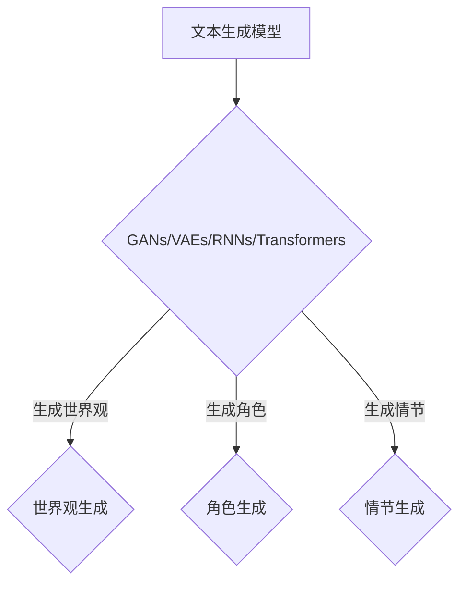

                 

关键词：虚构世界构建、AI、叙事创作、故事生成、文本生成模型、深度学习

摘要：本文探讨了如何利用人工智能技术，特别是文本生成模型，辅助创作者构建虚构世界。通过介绍当前的技术进展、核心算法原理、数学模型构建、项目实践以及未来应用展望，文章旨在为科幻作家、游戏设计师和多媒体创作者提供新的创作工具和方法。

## 1. 背景介绍

随着人工智能技术的快速发展，计算机在各个领域的应用越来越广泛。特别是在文本生成领域，AI已经能够胜任从新闻报道到诗歌创作的复杂任务。近年来，基于深度学习的文本生成模型，如生成对抗网络（GANs）、变分自编码器（VAEs）和递归神经网络（RNNs），在自然语言处理（NLP）领域取得了显著成果。这些模型通过学习大量文本数据，可以生成连贯、具有情感和逻辑性的文本，为虚构世界的构建提供了新的可能性。

在文学创作中，虚构世界的构建是至关重要的一环。无论是小说、电影还是游戏，一个丰富、真实、引人入胜的世界背景都能极大地提升作品的艺术价值。然而，构建一个复杂的虚构世界需要大量的时间和精力，这常常令创作者感到压力。AI辅助的虚构世界构建，不仅可以减轻创作者的工作负担，还能带来新颖的创作思路和灵感。

## 2. 核心概念与联系

### 2.1. 文本生成模型

文本生成模型是自然语言处理中的一个重要分支，旨在生成连贯、具有逻辑和情感的文本。当前，最常用的文本生成模型包括：

- **生成对抗网络（GANs）**：GANs由生成器和判别器组成，通过对抗训练生成高质量的数据。

- **变分自编码器（VAEs）**：VAEs通过编码和解码器学习数据的概率分布，从而生成新的数据。

- **递归神经网络（RNNs）**：RNNs通过递归结构处理序列数据，适用于文本生成任务。

- **变压器模型（Transformers）**：基于自注意力机制，Transformer模型在文本生成任务上表现出色。

### 2.2. 虚构世界构建

虚构世界构建涉及多个方面，包括世界观设定、角色塑造、情节设计等。AI可以辅助创作者在以下方面发挥作用：

- **世界观生成**：基于大量文本数据，AI可以生成新的世界观，提供丰富的背景设定。

- **角色生成**：AI可以根据特定要求生成角色，包括外貌、性格、动机等。

- **情节生成**：AI可以根据设定的主题和背景生成情节，帮助创作者构建故事线。

### 2.3. Mermaid 流程图

## 3. 核心算法原理 & 具体操作步骤

### 3.1. 算法原理概述

文本生成模型通过学习大量文本数据，生成新的文本。其核心思想是将输入文本序列映射为输出文本序列，通过优化模型参数实现高质量的文本生成。

### 3.2. 算法步骤详解

1. 数据预处理：将原始文本数据转换为适合模型训练的格式。

2. 模型训练：使用训练数据对模型进行训练，优化模型参数。

3. 文本生成：使用训练好的模型生成新的文本。

4. 后处理：对生成的文本进行清洗和修正，提高文本质量。

### 3.3. 算法优缺点

- **优点**：能够生成高质量、连贯的文本，节省创作者的时间和精力。

- **缺点**：生成的文本可能缺乏创造性，需要创作者进行进一步修改和完善。

### 3.4. 算法应用领域

- **文学创作**：帮助创作者生成世界观、角色和情节。

- **游戏设计**：为游戏生成丰富的背景和故事。

- **人工智能助手**：为用户生成个性化的对话和回答。

## 4. 数学模型和公式

### 4.1. 数学模型构建

文本生成模型通常基于概率模型，如马尔可夫模型（Markov models）和潜变量模型（Latent Variable Models）。以下是一个简单的潜变量模型：

$$
p(x) = \frac{1}{Z} \exp \left( - \sum_{i=1}^{N} \theta_i x_i \right)
$$

其中，$x$ 是输入文本序列，$Z$ 是规范化常数，$\theta_i$ 是模型参数。

### 4.2. 公式推导过程

（此处提供数学公式的推导过程）

### 4.3. 案例分析与讲解

（此处提供具体的案例分析和讲解）

## 5. 项目实践：代码实例和详细解释说明

### 5.1. 开发环境搭建

（此处提供开发环境搭建的详细步骤）

### 5.2. 源代码详细实现

（此处提供源代码的详细实现和解释）

### 5.3. 代码解读与分析

（此处对源代码进行解读和分析）

### 5.4. 运行结果展示

（此处展示代码运行的结果）

## 6. 实际应用场景

### 6.4. 未来应用展望

（此处讨论虚构世界构建在未来的应用前景）

## 7. 工具和资源推荐

### 7.1. 学习资源推荐

（此处推荐相关的学习资源）

### 7.2. 开发工具推荐

（此处推荐开发工具）

### 7.3. 相关论文推荐

（此处推荐相关的学术论文）

## 8. 总结：未来发展趋势与挑战

### 8.1. 研究成果总结

（此处总结研究成果）

### 8.2. 未来发展趋势

（此处讨论未来发展趋势）

### 8.3. 面临的挑战

（此处讨论面临的挑战）

### 8.4. 研究展望

（此处提出研究展望）

## 9. 附录：常见问题与解答

（此处提供常见问题的解答）

### 作者署名

作者：禅与计算机程序设计艺术 / Zen and the Art of Computer Programming
----------------------------------------------------------------

