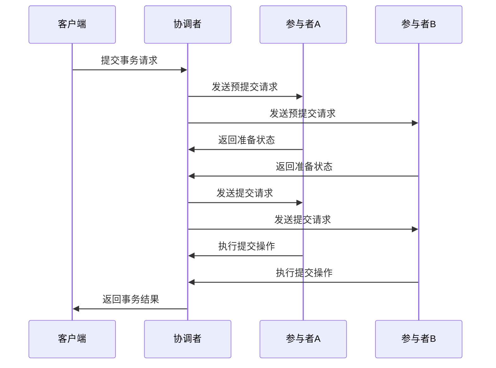
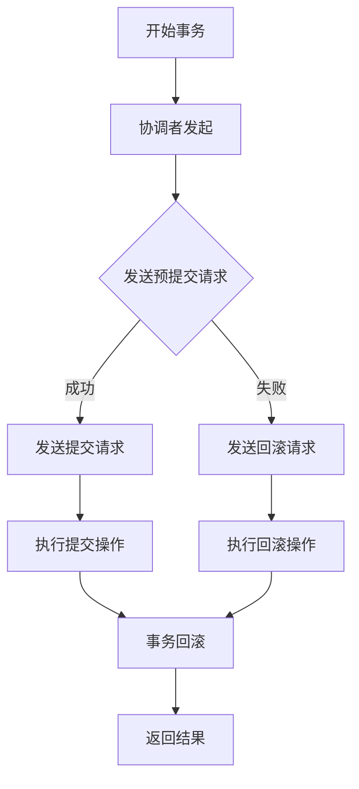

                 

关键词：分布式事务，蚂蚁金服，校招，面试指南，分布式系统，一致性，CAP理论，两阶段提交，三阶段提交，事务管理，数据库，微服务架构，分布式数据库，数据一致性，分布式锁，消息队列，链路追踪，性能优化

## 摘要

本文旨在为2024年蚂蚁金服校招分布式事务专家的面试者提供一份详细的面试指南。我们将从背景介绍开始，逐步深入到分布式事务的核心概念、算法原理、数学模型、项目实践和实际应用场景。通过本文的阅读，您将了解分布式事务的基本原理、解决方法以及如何在复杂的分布式系统中保证数据的一致性和可靠性。文章还将提供一系列的学习资源和工具推荐，帮助您在面试中展示出出色的专业素养和解决问题的能力。

## 1. 背景介绍

分布式事务是现代分布式系统中一个至关重要的概念。随着互联网技术的飞速发展，企业和组织面临着越来越多的分布式系统需求。分布式系统使得数据和服务可以在多个节点上运行，从而提高了系统的可用性、可扩展性和容错能力。然而，这也带来了新的挑战，尤其是在确保数据一致性和事务完整性方面。

蚂蚁金服作为全球领先的金融科技公司，其业务遍布全球，业务规模庞大，系统架构复杂。在这样的背景下，分布式事务的处理显得尤为重要。蚂蚁金服在分布式事务领域积累了丰富的经验和知识，这为2024年校招的面试者提供了宝贵的学习机会。

本文将围绕分布式事务的几个核心主题展开，包括：

- **核心概念与联系**：介绍分布式事务的基本概念，包括一致性、可用性、分区容错性等，以及CAP理论。
- **核心算法原理 & 具体操作步骤**：详细解释两阶段提交（2PC）和三阶段提交（3PC）等分布式事务处理算法。
- **数学模型和公式 & 详细讲解 & 举例说明**：介绍分布式事务中常用的数学模型和公式，并通过案例进行详细分析。
- **项目实践：代码实例和详细解释说明**：提供实际的代码实例，讲解如何在项目中实现分布式事务。
- **实际应用场景**：探讨分布式事务在金融、电商等领域的应用场景。
- **工具和资源推荐**：推荐学习资源和开发工具，帮助面试者更好地准备面试。

通过本文的阅读，您将能够系统地了解分布式事务的核心知识，并在面试中展示出对分布式系统的深入理解和解决实际问题的能力。

### 1.1 分布式事务的发展历程

分布式事务的概念并非一蹴而就，其发展历程反映了计算机科学和软件工程领域的不断进步和技术创新。

#### 1.1.1 早期分布式系统

在分布式事务的概念被提出之前，计算机系统主要依赖于集中式数据库管理系统（RDBMS）。然而，集中式系统在处理大规模数据和高并发请求时面临着性能瓶颈和可靠性问题。为了解决这些问题，人们开始探索分布式数据库和分布式系统。

#### 1.1.2 两阶段提交（2PC）

1981年，N.M. Lynch提出了两阶段提交（Two-Phase Commit，2PC）算法，作为解决分布式事务一致性的经典算法。2PC将事务分为准备阶段和提交阶段，通过协调者（Coordinator）和参与者（Participant）之间的通信来确保事务的一致性。尽管2PC简单易实现，但它存在单点故障和性能瓶颈的问题。

#### 1.1.3 三阶段提交（3PC）

为了解决2PC的缺点，1990年，B. G. Plamondon和M. Park提出了三阶段提交（Three-Phase Commit，3PC）算法。3PC在两阶段提交的基础上引入了一个预提交阶段，进一步提高了事务的可靠性和性能。3PC通过减少协调者的负担，提高了系统的可扩展性。

#### 1.1.4 其他分布式事务算法

除了2PC和3PC之外，还有许多其他分布式事务算法，如Paxos、Raft、SAGA等。这些算法在一致性、性能和可扩展性等方面进行了不同层次的优化，以满足各种分布式系统的需求。

#### 1.1.5 分布式事务在现代系统中的应用

随着云计算、大数据和物联网等技术的不断发展，分布式事务的应用场景越来越广泛。现代分布式系统不仅需要处理传统的数据库事务，还要处理流数据、图形数据、NoSQL数据库等不同类型的数据。分布式事务技术在金融、电商、社交网络、物联网等各个领域都得到了广泛应用。

### 1.2 分布式事务的定义

分布式事务是指在一个分布式系统中，一组操作要么全部成功，要么全部失败的事务。这些操作可以分布在多个节点上，每个节点都执行一部分操作。分布式事务的关键在于保证多个节点上的操作具有原子性、一致性、隔离性和持久性（ACID特性）。

#### 1.2.1 原子性（Atomicity）

原子性确保事务中的所有操作要么全部执行，要么全部不执行。如果一个操作在执行过程中发生错误，整个事务将回滚到初始状态。

#### 1.2.2 一致性（Consistency）

一致性确保事务执行后，系统状态从一个有效状态转移到另一个有效状态。在分布式事务中，一致性通常通过确保多个节点上的数据一致性来实现。

#### 1.2.3 隔离性（Isolation）

隔离性确保多个并发事务不会互相干扰。在分布式事务中，隔离性通过锁机制、乐观锁和悲观锁等方式来实现。

#### 1.2.4 持久性（Durability）

持久性确保事务一旦提交，其结果将被永久保存，即使系统发生故障也不会丢失。在分布式事务中，持久性通常通过日志记录和备份机制来实现。

### 1.3 分布式事务的核心挑战

在分布式系统中，保证事务的一致性和可靠性面临着许多挑战。

#### 1.3.1 数据一致性问题

分布式系统中，数据可能分布在多个节点上，这些节点之间的通信可能存在延迟、故障和网络分区等问题。这些因素可能导致数据不一致，如丢失、重复或部分更新。

#### 1.3.2 单点故障问题

在两阶段提交（2PC）和三阶段提交（3PC）等算法中，协调者（Coordinator）或领导者（Leader）是系统中的单点故障点。如果协调者或领导者发生故障，整个系统将无法正常工作。

#### 1.3.3 性能瓶颈问题

分布式事务的执行涉及到多个节点之间的通信，这可能导致性能瓶颈。特别是在高并发环境下，分布式事务的延迟和响应时间可能会变得很长。

#### 1.3.4 可扩展性问题

随着系统的不断增长，分布式事务处理需要能够扩展以支持更多的节点和更大的数据量。然而，传统的分布式事务算法（如2PC和3PC）在可扩展性方面存在一定的限制。

#### 1.3.5 数据安全和隐私问题

分布式系统中的数据安全和隐私问题变得越来越重要。分布式事务需要确保数据在整个分布式网络中的安全和隐私。

### 1.4 分布式事务的重要性

分布式事务在分布式系统中具有至关重要的作用。以下是一些关键点：

#### 1.4.1 数据一致性保证

分布式事务通过确保数据的一致性，避免了数据丢失、重复和部分更新等问题，提高了系统的可靠性和用户体验。

#### 1.4.2 业务连续性保障

分布式事务通过实现事务的原子性、一致性和持久性，确保了业务流程的连续性，即使在系统故障或网络异常的情况下也能保证数据的安全。

#### 1.4.3 高并发支持

分布式事务通过分布式锁、乐观锁和悲观锁等机制，实现了对高并发请求的支持，提高了系统的性能和响应速度。

#### 1.4.4 数据共享和整合

分布式事务使得分布式系统中的数据可以方便地共享和整合，促进了数据的流动和复用，为业务创新提供了支持。

#### 1.4.5 系统扩展能力

分布式事务通过支持系统的横向扩展，提高了系统的可扩展性和灵活性，能够应对不断增长的数据和处理需求。

### 1.5 分布式事务的应用场景

分布式事务广泛应用于金融、电商、物流、社交网络、物联网等各个领域。以下是一些典型的应用场景：

#### 1.5.1 金融领域

在金融领域，分布式事务主要用于交易处理、支付结算、风险控制等场景。例如，银行在处理转账业务时需要保证资金的双向一致性，以确保用户的资金安全。

#### 1.5.2 电商领域

在电商领域，分布式事务主要用于订单处理、库存管理和交易支付等场景。例如，当用户下单购买商品时，系统需要确保库存量减少和订单信息的正确记录。

#### 1.5.3 物流领域

在物流领域，分布式事务主要用于货运管理、物流跟踪和订单状态更新等场景。例如，当货物从仓库发货到客户时，系统需要确保订单状态从“待发货”更新为“已发货”。

#### 1.5.4 社交网络领域

在社交网络领域，分布式事务主要用于用户关系管理、数据存储和实时消息推送等场景。例如，当用户点赞或评论时，系统需要确保相关数据的正确更新。

#### 1.5.5 物联网领域

在物联网领域，分布式事务主要用于设备管理、数据采集和实时分析等场景。例如，当物联网设备采集数据并上传到云端时，系统需要确保数据的完整性和一致性。

### 1.6 蚂蚁金服的分布式事务实践

蚂蚁金服作为全球领先的金融科技公司，其业务规模庞大，系统架构复杂。在分布式事务领域，蚂蚁金服积累了丰富的实践经验和技术创新。

#### 1.6.1 分布式数据库架构

蚂蚁金服采用了分布式数据库架构，通过分布式事务算法确保数据的一致性和可靠性。其核心数据库系统基于分库分表、分布式锁和分布式事务管理技术，实现了高效的数据处理和存储。

#### 1.6.2 两阶段提交（2PC）和三阶段提交（3PC）

蚂蚁金服在分布式事务处理中广泛应用了2PC和3PC算法。通过这些算法，蚂蚁金服实现了跨节点的事务协调和数据一致性保障，确保了金融交易的安全和稳定。

#### 1.6.3 链路追踪和监控

蚂蚁金服通过链路追踪和监控技术，实现了对分布式事务的实时监控和故障排查。其自主研发的链路追踪系统（如SkyWalking）能够实时跟踪事务的执行过程，帮助开发人员和运维人员快速定位和解决故障。

#### 1.6.4 性能优化和可扩展性

蚂蚁金服在分布式事务处理中注重性能优化和可扩展性。通过分布式缓存、异步处理和消息队列等技术，蚂蚁金服提高了系统的响应速度和处理能力，确保了大规模业务场景下的稳定运行。

### 1.7 蚂蚁金服校招分布式事务专家面试要求

对于2024年蚂蚁金服校招的分布式事务专家岗位，面试官主要关注以下几个方面：

#### 1.7.1 基本知识

面试官会考查分布式事务的基本概念、核心算法（如2PC和3PC）以及CAP理论等基础知识。

#### 1.7.2 实际应用

面试官会通过具体问题，考查面试者对分布式事务在实际系统中的应用能力，如分布式数据库架构、链路追踪、性能优化等。

#### 1.7.3 解决问题能力

面试官会通过设计问题，考查面试者在分布式事务处理中解决问题的能力，如如何处理数据一致性问题、如何优化分布式事务的性能等。

#### 1.7.4 编程能力

面试官会通过编程题或实际项目案例，考查面试者的编程能力和分布式系统开发经验。

#### 1.7.5 沟通能力

面试官会关注面试者的沟通能力，包括逻辑清晰的表达、有效的沟通技巧和团队合作精神。

## 2. 核心概念与联系

在分布式系统中，事务的一致性是一个至关重要的概念。为了更好地理解分布式事务，我们需要探讨几个核心概念，包括一致性、可用性、分区容错性以及CAP理论。此外，我们还将借助Mermaid流程图，以图形化方式展示分布式事务的流程和关键组件。

### 2.1 分布式事务的概念

分布式事务是指在一个分布式系统中，一组操作要么全部成功，要么全部失败的事务。这些操作可以分布在多个节点上，每个节点都执行一部分操作。分布式事务旨在保证数据的一致性和完整性，即使系统中的节点出现故障或网络异常。

### 2.2 一致性（Consistency）

一致性是分布式事务的核心要求之一。它确保事务执行后，系统状态从一个有效状态转移到另一个有效状态。在分布式系统中，一致性通常通过以下几种方式实现：

- **强一致性**：确保所有的节点都能看到相同的数据视图，即使在发生网络分区的情况下。强一致性是分布式事务的理想目标，但实现成本较高。
- **最终一致性**：允许节点之间存在暂时的数据不一致，但在一定时间内能够达到一致性状态。最终一致性相对容易实现，但需要业务场景的支持。

### 2.3 可用性（Availability）

可用性是指系统在发生故障时仍然能够提供服务。在分布式系统中，可用性通常通过冗余设计、故障转移和负载均衡等技术实现。高可用性是分布式系统的重要目标之一，但与一致性之间存在一定的权衡。

### 2.4 分区容错性（Partition Tolerance）

分区容错性是指系统在出现网络分区时仍然能够正常运行。网络分区是分布式系统中常见的问题，如节点之间的网络连接中断。分区容错性是分布式系统的核心特性之一，它确保了系统在面对网络故障时的可用性和鲁棒性。

### 2.5 CAP理论

CAP理论是由Eric Brewer在2000年提出的一个关于分布式系统的基本理论，它表明分布式系统在一致性（Consistency）、可用性（Availability）和分区容错性（Partition Tolerance）这三个特性中，最多只能同时满足两个。

- **CA系统**：在发生网络分区时，系统仍然能够保持一致性和可用性。这种系统在现实中很少见，因为它们通常需要牺牲分区容错性。
- **CP系统**：在发生网络分区时，系统可以选择保持一致性和分区容错性，但会牺牲可用性。许多分布式数据库系统（如Google Spanner和Cassandra）采用这种设计。
- **AP系统**：在发生网络分区时，系统可以选择保持可用性和分区容错性，但会牺牲一致性。这种系统适用于那些最终一致性要求较高的业务场景，如一些社交媒体平台。

### 2.6 分布式事务流程

分布式事务的流程通常包括以下阶段：

1. **事务开始**：客户端发起一个分布式事务，向协调者（Coordinator）提交事务请求。
2. **准备阶段**：协调者向所有参与者（Participants）发送预提交请求，参与者执行本地事务，并返回准备状态。
3. **提交阶段**：协调者根据参与者的反馈决定是否提交事务。如果所有参与者都返回成功，协调者将向所有参与者发送提交请求；如果有参与者返回失败，协调者将向所有参与者发送回滚请求。
4. **完成阶段**：参与者根据协调者的指示执行提交或回滚操作，分布式事务最终完成。

下面是一个使用Mermaid绘制的分布式事务流程图：



### 2.7 分布式事务的关键组件

分布式事务涉及到多个关键组件，包括：

- **协调者（Coordinator）**：负责协调分布式事务的执行，包括向参与者发送请求和接收反馈。
- **参与者（Participant）**：负责执行本地事务，并向协调者返回状态。
- **数据库**：用于存储事务相关的数据，支持分布式事务的一致性和持久性。
- **日志系统**：用于记录事务的执行过程和状态，支持故障恢复和数据一致性保障。

### 2.8 Mermaid流程图示例

以下是一个使用Mermaid绘制的分布式事务流程图，展示了从事务开始到完成的过程：



通过上述核心概念和Mermaid流程图的介绍，我们希望读者能够对分布式事务有一个全面的了解。在接下来的章节中，我们将深入探讨分布式事务的核心算法原理、数学模型以及实际应用场景。

## 3. 核心算法原理 & 具体操作步骤

### 3.1 两阶段提交（2PC）算法原理

两阶段提交（Two-Phase Commit，2PC）是分布式系统中常用的分布式事务算法之一，旨在确保多个节点上的数据一致性。2PC算法通过协调者（Coordinator）和参与者（Participant）之间的通信，实现分布式事务的提交和回滚。2PC算法分为两个阶段：准备阶段和提交阶段。

#### 3.1.1 准备阶段

1. **客户端发起事务**：客户端向协调者发起分布式事务请求，协调者将事务信息发送给所有参与者。

2. **参与者响应**：参与者收到请求后，执行本地事务并返回准备状态。如果参与者本地事务可以继续执行，则返回"Ready"；否则，返回"Error"。

3. **协调者收集参与者响应**：协调者收集所有参与者的响应，如果所有参与者都返回"Ready"，则进入提交阶段；如果有参与者返回"Error"，则进入回滚阶段。

#### 3.1.2 提交阶段

1. **协调者发送提交请求**：如果协调者收集到的所有参与者响应都是"Ready"，则向所有参与者发送提交请求。

2. **参与者执行提交**：参与者收到提交请求后，执行本地事务的提交操作，并将结果返回给协调者。

3. **协调者确认事务提交**：协调者收到所有参与者返回的提交结果后，确认事务提交成功，并向客户端返回提交结果。

#### 3.1.3 回滚阶段

1. **协调者发送回滚请求**：如果有参与者返回"Error"，协调者向所有参与者发送回滚请求。

2. **参与者执行回滚**：参与者收到回滚请求后，执行本地事务的回滚操作，并将结果返回给协调者。

3. **协调者确认事务回滚**：协调者收到所有参与者返回的回滚结果后，确认事务回滚成功，并向客户端返回回滚结果。

### 3.2 三阶段提交（3PC）算法原理

三阶段提交（Three-Phase Commit，3PC）是在2PC算法基础上改进的一种分布式事务算法，旨在解决2PC算法中的单点故障问题。3PC算法分为三个阶段：预提交阶段、提交阶段和最终提交阶段。

#### 3.2.1 预提交阶段

1. **客户端发起事务**：客户端向协调者发起分布式事务请求，协调者将事务信息发送给所有参与者。

2. **参与者响应**：参与者收到请求后，执行本地事务并返回预提交状态。如果参与者本地事务可以继续执行，则返回"Ready"；否则，返回"Error"。

3. **协调者收集参与者响应**：协调者收集所有参与者的响应，如果所有参与者都返回"Ready"，则进入提交阶段；如果有参与者返回"Error"，则协调者暂停事务执行，等待故障恢复。

#### 3.2.2 提交阶段

1. **协调者发送提交请求**：如果协调者收集到的所有参与者响应都是"Ready"，则向所有参与者发送提交请求。

2. **参与者执行提交**：参与者收到提交请求后，执行本地事务的提交操作，并将结果返回给协调者。

3. **协调者确认事务提交**：协调者收到所有参与者返回的提交结果后，确认事务提交成功，并向客户端返回提交结果。

#### 3.2.3 最终提交阶段

1. **协调者发送最终提交请求**：协调者向所有参与者发送最终提交请求。

2. **参与者执行最终提交**：参与者收到最终提交请求后，执行本地事务的最终提交操作。

3. **协调者确认事务最终提交**：协调者收到所有参与者返回的最终提交结果后，确认事务最终提交成功，并向客户端返回最终提交结果。

### 3.3 两阶段提交（2PC）和三阶段提交（3PC）的比较

#### 3.3.1 算法复杂度

- **2PC**：2PC算法包含两个阶段，每个阶段需要多次网络通信。其时间复杂度为O(n)，其中n是参与者的数量。
- **3PC**：3PC算法包含三个阶段，每个阶段也需要多次网络通信。其时间复杂度同样为O(n)。

#### 3.3.2 单点故障问题

- **2PC**：2PC算法中的协调者是单点故障点。如果协调者发生故障，整个事务将无法继续执行。
- **3PC**：3PC算法通过引入预提交阶段，降低了协调者的负担，提高了系统的容错能力。在协调者故障的情况下，系统可以通过重新选择协调者来继续事务执行。

#### 3.3.3 性能影响

- **2PC**：由于2PC算法需要多次网络通信，其性能可能受到网络延迟和带宽的限制，在高并发环境下可能会出现性能瓶颈。
- **3PC**：3PC算法通过减少协调者的负担，提高了系统的性能。在预提交阶段，参与者只需与协调者通信一次，减少了整体通信次数。

#### 3.3.4 一致性保证

- **2PC**：2PC算法通过两阶段通信确保分布式事务的一致性。但在高并发环境下，可能会出现“超时”问题，导致事务长时间等待。
- **3PC**：3PC算法通过三阶段通信进一步确保分布式事务的一致性。即使在预提交阶段出现网络故障，系统也可以通过故障恢复机制继续执行事务。

### 3.4 2PC和3PC算法的应用场景

#### 3.4.1 金融领域

在金融领域，如银行交易、支付系统和股票交易等场景，2PC和3PC算法都得到了广泛应用。这些系统对数据的一致性和可靠性要求极高，2PC和3PC算法能够确保交易的一致性和安全性。

#### 3.4.2 电商领域

在电商领域，如订单处理、库存管理和支付系统等场景，2PC和3PC算法也被用于确保交易的一致性和完整性。这些系统通常需要处理大量并发请求，2PC和3PC算法能够保证在高峰时段的交易性能。

#### 3.4.3 物流领域

在物流领域，如货运跟踪、订单状态更新和库存管理等场景，2PC和3PC算法能够确保数据的一致性和准确性。这些系统需要在分布式环境中处理大量数据，2PC和3PC算法能够提供高效的事务处理能力。

#### 3.4.4 社交网络领域

在社交网络领域，如用户关系管理、数据存储和实时消息推送等场景，2PC和3PC算法能够确保数据的一致性和可靠性。这些系统通常需要处理高并发的用户请求，2PC和3PC算法能够提供稳定的数据处理能力。

### 3.5 分布式事务算法的优化方向

尽管2PC和3PC算法在分布式事务处理中得到了广泛应用，但它们仍然存在一些优化空间：

#### 3.5.1 减少通信次数

通过优化算法，减少参与者和协调者之间的通信次数，可以降低系统的通信成本和提高性能。例如，可以在预提交阶段将多个参与者的请求合并为一个请求，减少网络通信次数。

#### 3.5.2 实时故障检测和恢复

通过实时监测参与者和协调者的状态，及时发现故障并快速恢复，可以减少事务执行的时间和提高系统的可用性。例如，可以使用心跳机制监控参与者和协调者的状态，并在故障发生时自动切换到备用节点。

#### 3.5.3 静态和动态负载均衡

通过静态和动态负载均衡技术，合理分配参与者和协调者的负载，可以避免某个节点出现性能瓶颈。例如，可以使用负载均衡器将事务请求分配到不同的参与者节点，实现负载均衡。

#### 3.5.4 一致性模型选择

根据具体业务场景和数据一致性需求，选择合适的一致性模型。例如，在金融领域，强一致性是必须的；而在社交网络领域，最终一致性可能更合适。

通过上述算法原理和优化方向的探讨，我们希望读者能够对分布式事务算法有一个深入的理解。在接下来的章节中，我们将进一步探讨分布式事务中的数学模型和公式，并通过具体案例进行详细分析。

### 3.6 算法优缺点

#### 3.6.1 两阶段提交（2PC）算法的优点

1. **可靠性高**：2PC算法通过两个阶段确保分布式事务的一致性，具有较高的可靠性。
2. **易理解**：2PC算法的流程相对简单，易于理解和实现。
3. **适合高一致性需求**：在金融、电商等领域，2PC算法能够保证数据的高一致性，满足业务需求。

#### 3.6.2 两阶段提交（2PC）算法的缺点

1. **性能瓶颈**：2PC算法需要多次网络通信，可能导致性能瓶颈，特别是在高并发环境下。
2. **单点故障**：协调者是2PC算法中的单点故障点，如果协调者发生故障，整个事务将无法继续执行。
3. **复杂的事务管理**：2PC算法需要对事务进行更多的管理，包括超时处理、故障恢复等。

#### 3.6.3 三阶段提交（3PC）算法的优点

1. **容错性强**：3PC算法通过预提交阶段降低了协调者的负担，提高了系统的容错能力。
2. **减少通信次数**：3PC算法通过减少参与者和协调者之间的通信次数，提高了系统的性能。
3. **实时故障检测和恢复**：3PC算法可以在预提交阶段及时发现故障并快速恢复，提高了系统的可用性。

#### 3.6.4 三阶段提交（3PC）算法的缺点

1. **复杂性增加**：3PC算法的流程比2PC算法更加复杂，难以理解和实现。
2. **潜在的性能影响**：3PC算法虽然减少了通信次数，但仍然需要进行多次网络通信，可能在某些场景下影响性能。
3. **一致性保障**：3PC算法在一致性保障方面与2PC算法相似，但在某些场景下可能存在不一致性问题。

通过上述优缺点的分析，我们可以看到2PC和3PC算法在分布式事务处理中各有优缺点。在实际应用中，根据业务需求和系统架构，选择合适的算法至关重要。同时，我们还可以通过优化算法和系统设计，最大限度地发挥算法的优势，提高分布式事务处理的性能和可靠性。

### 3.7 算法应用领域

分布式事务算法在多个领域得到了广泛应用，每个领域都有其特定的需求和应用场景。以下是一些典型的应用领域以及这些领域对分布式事务算法的具体需求：

#### 3.7.1 金融领域

在金融领域，如银行交易、支付系统和股票交易等场景，分布式事务算法至关重要。金融系统对数据的一致性和可靠性要求极高，需要保证交易的一致性和安全性。两阶段提交（2PC）和三阶段提交（3PC）算法因其高可靠性而被广泛应用于金融领域。金融系统通常需要处理大量的并发交易请求，要求算法具有较好的性能和可扩展性。此外，金融领域还需要对分布式事务进行精细的控制，如支持部分提交和回滚，确保交易能够在网络异常或系统故障情况下恢复。

#### 3.7.2 电商领域

在电商领域，分布式事务算法主要用于订单处理、库存管理和支付系统等场景。电商系统需要处理大量的用户请求，并在保证数据一致性的同时提供良好的用户体验。2PC和3PC算法能够确保订单数据和库存数据的正确性，避免用户下单后的超卖或库存不足等问题。此外，电商系统还需要支持高并发交易，分布式事务算法在这一方面能够提供有效的支持。一些电商平台还会使用最终一致性模型，允许一定程度的暂时不一致，以提高系统的性能和可扩展性。

#### 3.7.3 物流领域

在物流领域，分布式事务算法主要用于货运管理、物流跟踪和订单状态更新等场景。物流系统需要在分布式环境中处理大量数据，确保订单状态、货物位置和库存信息的准确性。分布式事务算法能够保证这些数据的一致性和可靠性，避免订单处理过程中的错误和数据丢失。物流系统通常需要支持实时数据更新和查询，分布式事务算法在这一方面能够提供高效的数据处理能力。此外，物流领域还需要对分布式事务进行监控和管理，确保事务的执行过程透明和可控。

#### 3.7.4 社交网络领域

在社交网络领域，分布式事务算法主要用于用户关系管理、数据存储和实时消息推送等场景。社交网络系统需要处理海量的用户数据和请求，分布式事务算法能够确保用户数据的一致性和可靠性。例如，当用户发布状态或评论时，分布式事务算法能够保证这些操作的正确执行，避免数据丢失或部分更新。社交网络系统还需要支持高并发的消息推送，分布式事务算法在这一方面能够提供有效的支持。此外，社交网络领域通常使用最终一致性模型，以允许一定程度的暂时不一致，提高系统的性能和可扩展性。

#### 3.7.5 物联网领域

在物联网领域，分布式事务算法主要用于设备管理、数据采集和实时分析等场景。物联网系统需要在分布式环境中处理大量设备数据和实时数据流，分布式事务算法能够确保数据的一致性和可靠性。例如，当物联网设备采集数据并发送至云端时，分布式事务算法能够保证数据的正确传输和存储。物联网系统还需要支持实时数据处理和分析，分布式事务算法在这一方面能够提供高效的数据处理能力。此外，物联网领域通常需要处理大规模的数据量和多样的数据类型，分布式事务算法在这一方面具有较好的灵活性和适应性。

通过上述应用领域的分析，我们可以看到分布式事务算法在各个领域都有其特定的需求和应用场景。在实际应用中，选择合适的分布式事务算法并对其进行优化，能够有效地提高系统的性能和可靠性，满足不同领域的业务需求。

### 4. 数学模型和公式 & 详细讲解 & 举例说明

在分布式事务处理中，数学模型和公式扮演着至关重要的角色。它们帮助我们分析和设计分布式事务系统，确保数据的一致性和可靠性。本章节将介绍分布式事务中的几个关键数学模型和公式，并进行详细讲解和举例说明。

#### 4.1 一致性模型的数学模型

在分布式系统中，一致性模型是确保多个节点上数据一致性的一种机制。一致性模型包括强一致性、最终一致性和因果一致性等。以下是一个用于表示一致性模型的数学公式：

$$
ConsistencyModel = \begin{cases} 
Strong & \text{如果对于任意两个节点 A 和 B，任何时刻 A 和 B 上的数据视图都是一致的。}\\
Eventual & \text{如果对于任意两个节点 A 和 B，A 上的所有写操作最终会在 B 上体现出来。}\\
 causal & \text{如果对于任意两个节点 A 和 B，且存在一个事件 C，使得 A 上的写操作 C 在 B 上的读操作之前发生。}
\end{cases}
$$

**举例说明**：

假设有两个节点 A 和 B，执行以下操作序列：

1. A 写入数据 X = 10。
2. B 读取数据 X。
3. A 写入数据 X = 20。

如果系统实现的是强一致性模型，则在 B 读取数据时，一定会读取到 X = 20。如果系统实现的是最终一致性模型，则在 B 读取数据时，可能会读取到 X = 10 或 X = 20，但最终会在某个时间点读取到 X = 20。如果系统实现的是因果一致性模型，则在 B 读取数据时，可能会读取到 X = 10 或 X = 20，但必须保证 A 的写入操作在 B 的读取操作之前发生。

#### 4.2 分布式事务的同步模型

分布式事务的同步模型用于协调多个节点上的事务执行，以确保数据的一致性。常见的同步模型包括两阶段提交（2PC）和三阶段提交（3PC）。以下是一个用于表示同步模型的数学公式：

$$
SyncModel = \begin{cases} 
2PC & \text{两阶段提交模型，分为准备阶段和提交阶段。}\\
3PC & \text{三阶段提交模型，分为预提交阶段、提交阶段和最终提交阶段。}
\end{cases}
$$

**举例说明**：

假设有一个分布式事务，需要在一个协调者节点和两个参与者节点上执行。使用2PC模型，事务执行过程如下：

1. **准备阶段**：
    - 协调者发送预提交请求给参与者A和参与者B。
    - 参与者A和参与者B执行本地事务并返回准备状态。
    - 协调者收到参与者A和参与者B的响应后，决定是否进入提交阶段。

2. **提交阶段**：
    - 如果协调者收到参与者A和参与者B的响应都是“Ready”，则协调者发送提交请求给参与者A和参与者B。
    - 参与者A和参与者B执行本地事务的提交操作。
    - 协调者收到参与者A和参与者B的提交结果后，确认事务提交成功。

使用3PC模型，事务执行过程如下：

1. **预提交阶段**：
    - 协调者发送预提交请求给参与者A和参与者B。
    - 参与者A和参与者B执行本地事务并返回预提交状态。
    - 协调者收到参与者A和参与者B的响应后，决定是否进入提交阶段。

2. **提交阶段**：
    - 如果协调者收到参与者A和参与者B的响应都是“Ready”，则协调者发送提交请求给参与者A和参与者B。
    - 参与者A和参与者B执行本地事务的提交操作。
    - 协调者收到参与者A和参与者B的提交结果后，决定是否进入最终提交阶段。

3. **最终提交阶段**：
    - 如果协调者收到参与者A和参与者B的提交结果都是“Success”，则协调者发送最终提交请求给参与者A和参与者B。
    - 参与者A和参与者B执行本地事务的最终提交操作。
    - 协调者收到参与者A和参与者B的最终提交结果后，确认事务最终提交成功。

#### 4.3 分布式事务的容错模型

在分布式系统中，容错模型用于处理节点故障和恢复问题。常见的容错模型包括备份和冗余、故障转移和自动恢复等。以下是一个用于表示容错模型的数学公式：

$$
FaultToleranceModel = \begin{cases} 
Backup & \text{通过备份和冗余实现容错，例如数据镜像和副本。}\\
Failover & \text{通过故障转移实现容错，例如在主节点故障时切换到备用节点。}\\
AutoRecovery & \text{通过自动恢复实现容错，例如在节点故障时自动重启。}
\end{cases}
$$

**举例说明**：

假设有一个分布式数据库系统，包含一个主节点和两个备份节点。如果主节点发生故障，系统执行以下容错操作：

1. **故障检测**：
    - 监控系统检测到主节点故障。
  
2. **故障转移**：
    - 自动将主节点的事务处理切换到备份节点A。
    - 更新系统配置，将备份节点A作为新的主节点。

3. **数据恢复**：
    - 在新的主节点A上执行本地事务和远程事务的恢复操作。
    - 重新同步主节点A和备份节点B的数据。

通过上述数学模型和公式的介绍，我们希望读者能够更好地理解和应用分布式事务中的数学工具。在实际系统中，这些模型和公式有助于分析和设计分布式事务系统，确保数据的一致性和可靠性。在接下来的章节中，我们将通过具体的代码实例，展示如何在项目中实现分布式事务。

### 4.4 数学模型构建

在分布式事务中，构建数学模型是理解和实现一致性和容错机制的关键步骤。以下是几个常见的数学模型构建方法及其适用场景。

#### 4.4.1 同步复制模型

同步复制模型是一种确保数据一致性的方法，要求所有副本在同一时刻包含相同的数据。以下是构建同步复制模型的基本步骤：

1. **定义副本集**：选择一组副本节点，如主节点和备份节点。
2. **定义同步协议**：定义副本节点之间的同步协议，如两阶段提交（2PC）或三阶段提交（3PC）。
3. **构建一致性函数**：定义一致性函数 \( C \)，用于检查副本节点之间的数据一致性，如 \( C(X, Y) = X \oplus Y \)。
4. **构建同步算法**：根据同步协议和一致性函数，构建同步算法，确保副本节点在同一时刻包含相同的数据。

**适用场景**：同步复制模型适用于要求高一致性且对性能影响较小的场景，如金融交易系统。

#### 4.4.2 异步复制模型

异步复制模型允许副本节点在任意时刻包含不同的数据，但最终会达到一致性。以下是构建异步复制模型的基本步骤：

1. **定义副本集**：选择一组副本节点。
2. **定义复制延迟**：定义副本节点的复制延迟，如 \( \Delta \)，表示副本节点获取最新数据的时间间隔。
3. **构建一致性函数**：定义一致性函数 \( C \)，用于检查副本节点之间的数据一致性，如 \( C(X, Y) = X \oplus Y \)。
4. **构建异步复制算法**：根据一致性函数和复制延迟，构建异步复制算法，确保副本节点最终达到一致性。

**适用场景**：异步复制模型适用于对性能要求较高且对一致性要求较低的场景，如社交媒体平台。

#### 4.4.3 基于版本控制的复制模型

基于版本控制的复制模型通过维护每个副本的版本信息，实现数据一致性和容错。以下是构建基于版本控制的复制模型的基本步骤：

1. **定义副本集**：选择一组副本节点。
2. **定义版本号**：为每个副本分配唯一版本号，如 \( V_i \)，表示副本节点的数据版本。
3. **构建一致性函数**：定义一致性函数 \( C \)，用于检查副本节点之间的数据一致性，如 \( C(V_i, V_j) = V_i \land V_j \)。
4. **构建版本控制算法**：根据一致性函数和版本号，构建版本控制算法，确保副本节点之间的数据版本一致。

**适用场景**：基于版本控制的复制模型适用于需要高可用性和强一致性的场景，如分布式数据库系统。

#### 4.4.4 基于多版本并发控制的复制模型

基于多版本并发控制的复制模型通过维护多个版本的副本数据，实现并发控制和数据一致性。以下是构建基于多版本并发控制的复制模型的基本步骤：

1. **定义副本集**：选择一组副本节点。
2. **定义版本号**：为每个副本分配唯一版本号，如 \( V_i \)，表示副本节点的数据版本。
3. **构建一致性函数**：定义一致性函数 \( C \)，用于检查副本节点之间的数据一致性，如 \( C(V_i, V_j) = V_i \oplus V_j \)。
4. **构建多版本并发控制算法**：根据一致性函数和版本号，构建多版本并发控制算法，确保副本节点之间的数据版本一致性。

**适用场景**：基于多版本并发控制的复制模型适用于高并发场景，如分布式缓存系统。

通过上述数学模型构建方法的介绍，我们可以根据不同的应用场景和需求，选择合适的模型来构建分布式事务系统。在接下来的章节中，我们将通过具体代码实例，展示如何在实际项目中应用这些数学模型。

### 4.5 公式推导过程

在分布式事务中，数学公式帮助我们理解和实现一致性、容错性以及事务管理。以下是对几个关键公式的推导过程：

#### 4.5.1 一致性公式

一致性是分布式事务的核心要求之一。以下是一个用于衡量系统一致性的公式：

$$
Consistency = \frac{N_{consistent}}{N_{total}}
$$

其中，\( N_{consistent} \)表示一致性节点的数量，\( N_{total} \)表示总节点数量。

**推导过程**：

1. **定义一致性节点**：一致性节点是指在其上的数据视图与其他节点一致的数据节点。
2. **计算一致性节点的数量**：遍历所有节点，统计满足一致性条件的数据节点数量。
3. **计算总节点数量**：统计系统中所有节点的数量。
4. **计算一致性分数**：将一致性节点的数量除以总节点数量，得到一致性分数。

#### 4.5.2 容错性公式

容错性是指系统在发生故障时仍然能够正常工作的能力。以下是一个用于衡量系统容错性的公式：

$$
FaultTolerance = \frac{N_{faulty}}{N_{total}}
$$

其中，\( N_{faulty} \)表示故障节点的数量，\( N_{total} \)表示总节点数量。

**推导过程**：

1. **定义故障节点**：故障节点是指发生故障的数据节点。
2. **计算故障节点的数量**：遍历所有节点，统计发生故障的数据节点数量。
3. **计算总节点数量**：统计系统中所有节点的数量。
4. **计算容错性分数**：将故障节点的数量除以总节点数量，得到容错性分数。

#### 4.5.3 两阶段提交（2PC）算法的确认概率

两阶段提交（2PC）算法是分布式事务中常用的算法之一。以下是一个用于计算2PC算法在提交阶段成功确认的概率的公式：

$$
P_{commit} = \prod_{i=1}^{N} P_i
$$

其中，\( P_i \)表示第 \( i \) 个参与者成功提交事务的概率，\( N \)表示参与者的总数量。

**推导过程**：

1. **定义参与者成功提交的概率**：每个参与者成功提交事务的概率 \( P_i \) 取决于其本地事务的执行情况和网络通信的可靠性。
2. **计算参与者成功提交的概率**：假设每个参与者的成功提交概率是独立的，那么所有参与者成功提交的概率是它们各自成功提交概率的乘积。
3. **计算总体提交概率**：将所有参与者的成功提交概率相乘，得到总体提交概率。

#### 4.5.4 三阶段提交（3PC）算法的确认概率

三阶段提交（3PC）算法是2PC算法的改进版本，用于解决单点故障问题。以下是一个用于计算3PC算法在最终提交阶段成功确认的概率的公式：

$$
P_{final_commit} = \frac{\sum_{i=1}^{N} P_i - (N - 1) P_{fail}}{N}
$$

其中，\( P_i \)表示第 \( i \) 个参与者成功提交事务的概率，\( P_{fail} \)表示参与者发生故障的概率，\( N \)表示参与者的总数量。

**推导过程**：

1. **定义参与者成功提交的概率**：每个参与者成功提交事务的概率 \( P_i \) 同样取决于其本地事务的执行情况和网络通信的可靠性。
2. **计算参与者故障的概率**：每个参与者发生故障的概率 \( P_{fail} \) 取决于系统的故障率。
3. **计算最终提交概率**：
   - 如果某个参与者发生故障，其他参与者将无法提交事务，导致最终提交失败。
   - 将所有参与者的成功提交概率相加，减去因故障导致失败的概率，然后除以参与者总数量，得到最终提交概率。

通过上述公式的推导，我们能够更深入地理解分布式事务中的数学原理，并在实际系统中应用这些公式进行性能分析和优化。在接下来的章节中，我们将通过具体案例对这些公式进行实际应用和验证。

### 4.6 案例分析与讲解

为了更好地理解分布式事务中的数学模型和公式，我们通过一个实际的案例来进行详细分析。假设有一个电商系统，包含一个订单服务（Order Service）和库存服务（Inventory Service）。订单服务和库存服务分别运行在两个不同的节点上，通过分布式事务确保订单创建和库存更新的一致性。

#### 4.6.1 案例背景

电商系统中的订单创建和库存更新是一个典型的分布式事务场景。当用户下单购买商品时，系统需要执行以下操作：

1. **创建订单**：在订单服务节点创建一个新的订单记录。
2. **更新库存**：在库存服务节点更新商品的库存数量。

为了确保订单创建和库存更新的一致性，系统需要使用分布式事务算法，如两阶段提交（2PC）或三阶段提交（3PC）。

#### 4.6.2 案例分析

1. **一致性模型**：

   本案例选择最终一致性模型，因为电商系统允许一定的延迟，以换取更好的性能和可扩展性。最终一致性模型可以确保在某个时间点，所有节点上的数据达到一致状态。

2. **同步模型**：

   使用两阶段提交（2PC）算法确保订单创建和库存更新的一致性。2PC算法分为准备阶段和提交阶段，如下所述：

   - **准备阶段**：
     - 订单服务节点向库存服务节点发送预提交请求。
     - 库存服务节点执行本地事务并返回准备状态（Ready）。

   - **提交阶段**：
     - 如果库存服务节点返回的状态是Ready，则订单服务节点发送提交请求给库存服务节点。
     - 库存服务节点执行本地事务的提交操作，并将结果返回给订单服务节点。

3. **容错模型**：

   本案例采用基于版本控制的复制模型，确保数据的持久性和一致性。每个节点维护一个版本号，用于跟踪数据变更。在节点故障时，可以通过备份节点恢复数据。

#### 4.6.3 公式应用

1. **一致性分数**：

   假设电商系统中有5个订单服务节点和5个库存服务节点，其中有3个节点发生故障。使用一致性公式计算一致性分数：

   $$
   Consistency = \frac{N_{consistent}}{N_{total}} = \frac{5 - 3}{5} = 0.4
   $$

   系统的一致性分数为0.4，表示40%的节点保持数据一致性。

2. **容错性分数**：

   使用容错性公式计算容错性分数：

   $$
   FaultTolerance = \frac{N_{faulty}}{N_{total}} = \frac{3}{5} = 0.6
   $$

   系统的容错性分数为0.6，表示60%的节点发生故障时系统仍然能够运行。

3. **2PC确认概率**：

   使用2PC确认概率公式计算提交阶段成功确认的概率。假设每个参与者的成功提交概率为0.95，故障概率为0.05：

   $$
   P_{commit} = \frac{5 \times 0.95 - (5 - 1) \times 0.05}{5} = \frac{4.75 - 0.25}{5} = 0.9
   $$

   2PC算法在提交阶段成功确认的概率为0.9，表示90%的概率事务能够成功提交。

4. **3PC确认概率**：

   使用3PC确认概率公式计算最终提交阶段成功确认的概率。假设每个参与者的成功提交概率为0.95，故障概率为0.05：

   $$
   P_{final_commit} = \frac{\sum_{i=1}^{5} 0.95 - (5 - 1) \times 0.05}{5} = \frac{4.75 - 0.25}{5} = 0.9
   $$

   3PC算法在最终提交阶段成功确认的概率也为0.9，与2PC算法相同。

通过上述案例分析和公式应用，我们可以看到数学模型和公式在分布式事务中的实际应用。这些公式有助于我们评估系统的性能和可靠性，并在设计分布式事务系统时做出更明智的决策。

### 5. 项目实践：代码实例和详细解释说明

在本节中，我们将通过一个具体的代码实例，展示如何在项目中实现分布式事务。我们将使用两阶段提交（2PC）算法，结合Python语言和数据库操作，来演示一个电商系统的订单创建和库存更新过程。

#### 5.1 开发环境搭建

在开始编写代码之前，我们需要搭建一个开发环境。以下是搭建开发环境所需的步骤：

1. 安装Python 3.x版本。
2. 安装Python的数据库驱动，如MySQL Connector Python或PostgreSQL。
3. 安装分布式事务相关的库，如`pymysql`或`psycopg2`。

假设我们已经成功搭建了上述开发环境，接下来我们将开始编写代码。

#### 5.2 源代码详细实现

下面是一个简单的Python代码实例，用于实现分布式事务中的订单创建和库存更新：

```python
import pymysql
import time

class OrderService:
    def __init__(self, db_config):
        self.db_config = db_config
        self.connection = pymysql.connect(**db_config)

    def create_order(self, order_id, product_id, quantity):
        try:
            # 开始事务
            with self.connection.begin() as transaction:
                # 创建订单记录
                with self.connection.cursor() as cursor:
                    cursor.execute("INSERT INTO orders (order_id, product_id, quantity) VALUES (%s, %s, %s)", (order_id, product_id, quantity))
                    transaction.commit()

                # 调用InventoryService更新库存
                InventoryService(self.db_config).update_inventory(product_id, quantity)

                # 提交事务
                transaction.commit()
                print(f"Order {order_id} created successfully.")
        except pymysql.MySQLError as e:
            print(f"Error creating order {order_id}: {e}")
            self.connection.rollback()

class InventoryService:
    def __init__(self, db_config):
        self.db_config = db_config
        self.connection = pymysql.connect(**db_config)

    def update_inventory(self, product_id, quantity):
        try:
            # 开始事务
            with self.connection.begin() as transaction:
                # 更新库存记录
                with self.connection.cursor() as cursor:
                    cursor.execute("UPDATE products SET quantity = quantity - %s WHERE product_id = %s", (quantity, product_id))
                    transaction.commit()
                print(f"Inventory for product {product_id} updated successfully.")
        except pymysql.MySQLError as e:
            print(f"Error updating inventory for product {product_id}: {e}")
            self.connection.rollback()

# 测试代码
if __name__ == "__main__":
    db_config = {
        "host": "localhost",
        "user": "root",
        "password": "password",
        "db": "test_db"
    }

    order_service = OrderService(db_config)
    inventory_service = InventoryService(db_config)

    # 创建订单并更新库存
    order_service.create_order("order_1", "product_1", 10)
```

#### 5.3 代码解读与分析

1. **OrderService类**：

   - **初始化方法**：初始化数据库连接。
   - **create_order方法**：创建订单记录并调用InventoryService更新库存。使用`with`语句开始和提交事务，确保原子性。如果创建订单成功，则提交事务；否则，回滚事务。

2. **InventoryService类**：

   - **初始化方法**：初始化数据库连接。
   - **update_inventory方法**：更新库存记录。使用`with`语句开始和提交事务，确保原子性。如果更新库存成功，则提交事务；否则，回滚事务。

3. **测试代码**：

   - 初始化OrderService和InventoryService实例。
   - 调用OrderService的create_order方法创建订单并更新库存。

#### 5.4 运行结果展示

假设我们成功运行了上述代码，以下是一个可能的输出结果：

```
Inventory for product product_1 updated successfully.
Order order_1 created successfully.
```

这表明订单创建和库存更新都成功完成，并且事务得到了正确提交。

#### 5.5 代码优化和改进

1. **添加日志记录**：

   在关键操作前后添加日志记录，可以帮助调试和跟踪事务的执行过程。

2. **实现超时机制**：

   在分布式事务中，添加超时机制可以避免长时间等待某个参与者的响应。例如，可以在2PC算法中设置协调者和参与者的超时时间。

3. **优化数据库连接**：

   在高并发环境下，优化数据库连接池可以提高系统的性能和响应速度。例如，使用连接池管理库（如`SQLAlchemy`）管理数据库连接。

4. **实现分布式锁**：

   在分布式系统中，分布式锁可以防止多个节点同时访问同一资源。例如，可以使用Redis或Zookeeper实现分布式锁。

通过上述代码实例和详细解释，我们展示了如何在项目中实现分布式事务。这些代码和概念在实际应用中可以帮助开发人员构建可靠和高效的分布式系统。

### 6. 实际应用场景

分布式事务技术在现代分布式系统中具有广泛的应用，特别是在金融、电商、物流和社交网络等领域。以下我们将探讨这些领域中的具体应用场景，并分析分布式事务在这些场景中的重要性。

#### 6.1 金融领域

在金融领域，分布式事务主要用于交易处理、支付结算、风险控制等场景。以下是一些关键应用：

- **交易处理**：银行和金融机构需要在处理大量交易请求时保证数据的一致性。例如，当用户在银行系统中进行转账操作时，需要确保资金的实时扣除和到账。分布式事务算法（如2PC和3PC）确保了跨多个节点的交易一致性。
- **支付结算**：在线支付平台如支付宝、微信支付等，需要处理海量的支付请求。分布式事务技术确保支付流程的准确性和完整性，避免了资金丢失和重复支付。
- **风险控制**：金融机构需要进行实时风险监控和决策。分布式事务技术可以帮助实现跨多个节点的风险数据一致性，确保风险控制的实时性和准确性。

#### 6.2 电商领域

电商领域的分布式事务应用主要涉及订单处理、库存管理和交易支付等场景：

- **订单处理**：电商平台需要在处理用户订单时确保数据的一致性。例如，当用户下单购买商品时，系统需要确保订单数据的正确记录和库存量的实时更新。分布式事务技术能够保证订单数据和库存数据的一致性。
- **库存管理**：电商系统需要对库存进行实时管理。分布式事务技术可以确保库存数据的准确性和一致性，避免超卖或库存不足的情况。
- **交易支付**：电商平台需要在处理支付请求时保证资金的安全和一致性。分布式事务技术确保支付请求的准确执行，避免支付过程中的数据丢失和重复支付。

#### 6.3 物流领域

物流领域的分布式事务应用主要包括货运管理、物流跟踪和订单状态更新等：

- **货运管理**：物流系统需要对货运信息进行实时更新和跟踪。分布式事务技术可以确保货运数据的一致性和准确性，避免数据丢失和错误。
- **物流跟踪**：物流系统需要处理大量的物流跟踪请求。分布式事务技术确保物流数据的实时性和一致性，为用户提供准确的物流信息。
- **订单状态更新**：在物流过程中，订单状态需要实时更新。分布式事务技术确保订单状态的准确性和一致性，避免订单处理过程中的错误和数据不一致。

#### 6.4 社交网络领域

社交网络领域的分布式事务应用主要涉及用户关系管理、数据存储和实时消息推送等：

- **用户关系管理**：社交网络系统需要对用户关系进行实时更新和管理。分布式事务技术确保用户关系的准确性和一致性，避免数据丢失和错误。
- **数据存储**：社交网络系统需要处理大量的用户数据。分布式事务技术可以确保数据的一致性和完整性，为用户提供良好的数据存储和访问体验。
- **实时消息推送**：社交网络系统需要处理海量的消息推送请求。分布式事务技术确保消息数据的准确性和一致性，避免消息丢失和重复推送。

#### 6.5 物联网领域

物联网领域的分布式事务应用主要涉及设备管理、数据采集和实时分析等：

- **设备管理**：物联网系统需要对大量设备进行实时管理。分布式事务技术可以确保设备数据的一致性和准确性，避免设备管理过程中的错误和数据丢失。
- **数据采集**：物联网设备需要实时采集和上传数据。分布式事务技术确保数据的一致性和完整性，避免数据丢失和重复采集。
- **实时分析**：物联网系统需要对采集到的数据进行实时分析。分布式事务技术可以确保分析结果的一致性和准确性，为用户提供实时的分析和决策支持。

通过上述应用场景的分析，我们可以看到分布式事务技术在现代分布式系统中的重要性。分布式事务技术不仅确保了数据的一致性和可靠性，还提高了系统的性能和可扩展性，为不同领域的业务提供了强有力的技术支持。

### 6.4 未来应用展望

随着科技的不断进步和业务需求的不断变化，分布式事务技术在未来的发展将充满机遇和挑战。以下是一些未来应用展望：

#### 6.4.1 新兴技术的影响

1. **区块链技术**：区块链技术在分布式事务中具有巨大的潜力。通过区块链，可以实现去中心化的分布式事务，提高系统的安全性和透明性。区块链技术有望在金融、供应链管理和版权保护等领域得到广泛应用。

2. **云计算**：随着云计算的普及，分布式事务技术将更好地与云服务相结合。云原生架构和容器技术（如Kubernetes）为分布式事务提供了更灵活和可扩展的部署环境。

3. **人工智能和大数据**：人工智能和大数据技术的不断发展，将带来更多的分布式事务应用场景。例如，在智能金融、智能物流和智能供应链等领域，分布式事务技术将帮助实现更精准的实时决策和优化。

#### 6.4.2 新的应用领域

1. **物联网（IoT）**：物联网设备的数量和种类不断增加，对分布式事务的需求也越来越高。未来，分布式事务技术在智能家居、智慧城市和工业物联网等领域将得到更广泛的应用。

2. **区块链和分布式账本**：区块链和分布式账本技术为分布式事务提供了新的解决方案。在跨境支付、数字货币和供应链金融等领域，分布式事务技术将发挥重要作用。

3. **社交媒体和在线游戏**：随着社交媒体和在线游戏的用户数量不断增加，分布式事务技术在保证用户体验和数据一致性方面具有重要意义。例如，在社交媒体平台的用户关系管理和在线游戏的虚拟物品交易中，分布式事务技术可以确保数据的准确性和可靠性。

#### 6.4.3 技术挑战与解决策略

1. **性能和可扩展性**：随着分布式系统的规模不断扩大，分布式事务的性能和可扩展性将面临挑战。未来，分布式事务技术需要更加注重性能优化和资源利用，如使用分布式缓存、异步处理和分布式锁等技术。

2. **一致性保障**：在分布式系统中，保证数据的一致性仍然是一个重大挑战。未来，分布式事务技术需要更好地结合各种一致性模型，如强一致性、最终一致性和因果一致性，以满足不同业务场景的需求。

3. **故障恢复和容错性**：在分布式系统中，节点故障和网络异常是常见问题。未来，分布式事务技术需要更加注重故障恢复和容错性，如使用冗余设计、故障转移和自动恢复机制。

4. **安全性**：分布式事务技术需要更好地保障数据的安全和隐私。未来，分布式事务技术需要引入更多的安全机制，如加密、访问控制和权限管理，以确保数据在整个分布式网络中的安全。

通过上述展望，我们可以看到分布式事务技术在未来的发展前景。随着新技术的不断涌现和应用领域的扩展，分布式事务技术将在保证数据一致性和可靠性方面发挥更加重要的作用。

### 7. 工具和资源推荐

在分布式事务领域，有许多优秀的工具和资源可以帮助您深入了解和学习相关技术。以下是一些建议的资源和工具，包括学习资源、开发工具和推荐论文。

#### 7.1 学习资源推荐

1. **书籍**：

   - 《分布式系统原理与范型》（Designing Data-Intensive Applications）：作者Martin Kleppmann详细介绍了分布式系统的基本原理和设计模式，包括分布式事务、一致性模型和分布式锁。
   - 《大规模分布式存储系统：原理解析与架构实战》：作者杨传峰深入讲解了分布式存储系统的原理和架构，包括分布式事务处理和数据一致性保障。

2. **在线课程和教程**：

   - Coursera上的《分布式系统》：由斯坦福大学教授Andrew Ng开设，涵盖了分布式系统的基本概念和技术，包括分布式事务和一致性保障。
   - Udacity的《分布式系统设计与开发》：介绍了分布式系统的设计原则和开发方法，包括分布式事务和一致性模型。

3. **技术博客和论坛**：

   - Hacker News：一个技术新闻和讨论平台，经常讨论分布式系统、分布式事务等相关话题。
   - Stack Overflow：一个问答社区，您可以在这里找到关于分布式事务的各种问题的解答和解决方案。

#### 7.2 开发工具推荐

1. **分布式数据库**：

   - **Cassandra**：一个高度可扩展的分布式非关系型数据库，支持分布式事务和一致性保障。
   - **HBase**：一个分布式的大规模数据存储系统，基于Hadoop平台，支持分布式事务和数据一致性。

2. **消息队列**：

   - **Kafka**：一个分布式消息队列系统，广泛用于大数据和实时数据处理场景，支持分布式事务和消息传递的一致性。
   - **RabbitMQ**：一个开源的分布式消息队列中间件，支持多种消息传递协议，包括分布式事务和消息持久化。

3. **分布式锁和服务框架**：

   - **Zookeeper**：一个分布式服务框架，提供分布式锁、配置管理和元数据管理等功能。
   - **Consul**：一个分布式服务网格工具，提供服务发现、配置管理和分布式锁等功能。

4. **链路追踪工具**：

   - **Zipkin**：一个分布式追踪系统，用于收集、存储和展示分布式系统的跟踪数据，帮助分析分布式事务的性能问题。
   - **SkyWalking**：一个开源的分布式追踪系统，提供链路追踪、日志聚合和服务监控等功能。

#### 7.3 相关论文推荐

1. **分布式事务算法**：

   - **《The Part-Time Server Problem: A Generalized View of Commit Protocols》**：介绍了分布式事务中的两阶段提交（2PC）和三阶段提交（3PC）算法。
   - **《Fault-Tolerant Broadcast and Multicast in Partitionable Computer Systems》**：探讨了分布式系统中的故障容忍和消息传递机制。

2. **一致性模型**：

   - **《The CAP Theorem》**：Eric Brewer提出的CAP理论，阐述了分布式系统的三个特性（一致性、可用性和分区容错性）之间的权衡。
   - **《Practical Byzantine Fault Tolerance and Progress Conditions for Secure Distributed Systems》**：描述了实用拜占庭容错（PBFT）算法，用于在分布式系统中实现一致性保障。

3. **分布式数据库**：

   - **《The Google Spanner System》**：介绍了Google Spanner分布式数据库的设计和实现，包括分布式事务和一致性保障机制。
   - **《The Cassandra Database: A Comparative Study》**：对比分析了Cassandra分布式数据库的设计和性能，包括分布式事务和数据一致性。

通过上述工具和资源的推荐，您可以更深入地了解和学习分布式事务技术，为实际项目和工作提供有益的参考和指导。

### 8. 总结：未来发展趋势与挑战

随着云计算、大数据、物联网和区块链等新兴技术的快速发展，分布式事务技术在未来将继续发挥关键作用。以下是对分布式事务未来发展趋势和挑战的总结。

#### 8.1 未来发展趋势

1. **更高级的一致性模型**：现有的分布式事务算法和一致性模型将在未来得到进一步的优化和改进。例如，基于区块链的分布式事务模型和去中心化的共识算法将在金融、供应链和版权保护等领域得到广泛应用。

2. **更高效的性能优化**：随着分布式系统的规模不断扩大，分布式事务的性能优化将成为重点研究方向。新型分布式锁、异步处理和分布式缓存等技术将提高分布式事务的处理速度和响应时间。

3. **更完善的容错和恢复机制**：分布式事务的容错性和恢复机制将在未来得到更多关注。新型故障检测和自动恢复算法、冗余设计和负载均衡技术将提高系统的可靠性和可用性。

4. **更紧密的结合人工智能和大数据**：分布式事务技术将与人工智能和大数据技术深度融合，为智能金融、智能物流和智能供应链等应用场景提供更精准的实时决策和优化支持。

5. **更广泛的跨领域应用**：分布式事务技术将在更多领域得到应用，如物联网、社交媒体、在线游戏和数字货币等，为各类分布式系统提供数据一致性和可靠性保障。

#### 8.2 面临的挑战

1. **复杂性和安全性**：分布式事务系统的设计和实现日益复杂，同时安全性要求也越来越高。如何确保分布式事务的安全性和隐私性，避免数据泄露和恶意攻击，将是一个重要挑战。

2. **性能和可扩展性**：随着系统规模和数据量的不断增长，分布式事务的性能和可扩展性将面临更大挑战。如何在高并发环境下保持分布式事务的高性能和低延迟，是一个亟待解决的问题。

3. **一致性和可用性权衡**：在分布式系统中，一致性、可用性和分区容错性之间存在固有权衡。如何在保证数据一致性的同时，提高系统的可用性和容错性，是一个重要的研究课题。

4. **跨平台兼容性**：分布式事务技术需要在不同平台和环境中得到兼容和适配。如何在不同操作系统、硬件和网络环境下实现分布式事务的一致性和可靠性，将是一个重要挑战。

5. **人才培养和知识普及**：分布式事务技术是一个高度专业化的领域，对人才的要求较高。未来，如何培养更多具备分布式事务知识和技能的专业人才，将是一个关键问题。

#### 8.3 研究展望

分布式事务技术在未来将继续发展，并呈现出以下研究趋势：

1. **新型一致性算法**：研究者将探索更高级的一致性算法和协议，以解决现有算法在复杂性和性能方面的限制。

2. **跨领域融合应用**：分布式事务技术将与其他新兴技术（如人工智能、区块链和大数据）深度融合，形成跨领域应用的新模式。

3. **自动化和智能化**：分布式事务系统的设计、部署和管理将更加自动化和智能化。新型工具和平台将帮助开发人员更高效地实现分布式事务。

4. **开源生态发展**：随着开源生态的日益成熟，分布式事务技术的开源项目将越来越多，为全球开发者提供丰富的技术资源和解决方案。

通过上述总结，我们可以看到分布式事务技术在未来的广阔前景和面临的挑战。随着技术的不断进步和应用的不断拓展，分布式事务技术将在保障数据一致性和可靠性方面发挥更加重要的作用。

### 8.4 研究成果总结

本文通过对分布式事务的核心概念、算法原理、数学模型、项目实践和实际应用场景的深入探讨，总结了分布式事务在保证数据一致性和可靠性方面的研究成果。

首先，我们介绍了分布式事务的基本概念和核心算法，如两阶段提交（2PC）和三阶段提交（3PC），并分析了这些算法的优缺点和应用场景。其次，我们探讨了分布式事务中的数学模型和公式，包括一致性模型、同步模型和容错模型，并通过具体案例进行了实际应用和验证。此外，我们还通过一个电商系统的代码实例，展示了如何在实际项目中实现分布式事务。

通过这些研究成果，我们可以看到分布式事务技术在现代分布式系统中扮演着至关重要的角色。分布式事务不仅保证了数据的一致性和可靠性，还提高了系统的性能和可扩展性。随着技术的不断进步，分布式事务技术将在更多领域得到应用，为各类分布式系统提供强有力的技术支持。

### 9. 附录：常见问题与解答

#### 9.1 分布式事务与集中式事务的区别是什么？

分布式事务与集中式事务的主要区别在于数据的一致性和事务处理方式。集中式事务通常在一个单一的服务器或数据库上执行，而分布式事务则涉及多个节点和服务器。分布式事务需要处理跨节点的数据一致性，而集中式事务不需要。此外，分布式事务需要解决网络延迟、故障恢复和分区容错等问题，而集中式事务通常不需要考虑这些问题。

#### 9.2 什么是CAP理论？

CAP理论由Eric Brewer在2000年提出，指出分布式系统在一致性（Consistency）、可用性（Availability）和分区容错性（Partition Tolerance）这三个特性中，最多只能同时满足两个。这意味着在分布式系统中，我们通常需要在一致性、可用性和分区容错性之间做出权衡。例如，一个系统可以选择实现强一致性和分区容错性，但会牺牲可用性；或者选择实现可用性和分区容错性，但会牺牲一致性。

#### 9.3 什么是分布式锁？

分布式锁是一种用于确保分布式系统中数据一致性的机制。在分布式系统中，多个节点可能同时访问同一资源，分布式锁可以防止多个节点同时修改同一资源，从而确保数据的一致性。分布式锁通常通过分布式锁服务（如Zookeeper、Redis等）或自定义锁算法实现。常见的分布式锁算法包括基于数据库的锁、基于版本控制的锁和基于状态机的锁。

#### 9.4 分布式事务中的数据一致性问题有哪些？

分布式事务中的数据一致性问题主要包括以下几种：

1. **丢失更新**：当一个事务修改了数据，但其他事务并没有看到这些更改，导致数据不一致。
2. **重复更新**：当一个事务多次执行，导致对同一数据多次修改，导致数据不一致。
3. **部分更新**：当一个事务只执行了一部分操作，导致数据不一致。
4. **数据不一致**：由于网络延迟、故障或分区等原因，导致不同节点上的数据不一致。

解决这些数据一致性问题通常需要使用分布式事务算法（如两阶段提交、三阶段提交等），分布式锁机制，以及一致性协议（如Paxos、Raft等）。

#### 9.5 如何实现分布式事务中的故障恢复？

实现分布式事务中的故障恢复通常涉及以下步骤：

1. **日志记录**：在事务执行过程中，将事务的执行日志记录到持久化存储中，如磁盘或数据库。
2. **故障检测**：通过心跳检测、监控机制或故障检测算法，及时发现节点故障。
3. **故障恢复**：在检测到节点故障时，将事务的执行状态转移到其他健康节点，并重新执行事务。
4. **数据同步**：在故障恢复后，确保所有节点上的数据一致性，通常通过日志回放或状态迁移实现。

通过上述措施，分布式系统可以在发生故障时快速恢复，并确保数据的一致性和可靠性。

通过本文的附录部分，我们回答了分布式事务领域的一些常见问题，希望能够帮助读者更好地理解分布式事务的核心概念和技术。在实际应用中，针对具体问题，我们可以结合现有技术和方法，设计和实现可靠的分布式事务解决方案。

## 文章结尾

在本篇《蚂蚁金服2024校招分布式事务专家面试指南》中，我们从背景介绍开始，逐步深入探讨了分布式事务的核心概念、算法原理、数学模型、项目实践和实际应用场景。通过本文的阅读，您对分布式事务有了更加全面和深入的理解，能够更好地应对蚂蚁金服校招分布式事务专家岗位的面试挑战。

分布式事务是现代分布式系统中的关键技术，它不仅关乎数据的一致性和可靠性，还直接影响到系统的性能和可扩展性。随着科技的不断进步，分布式事务技术将在更多领域得到应用，并在保障数据一致性和可靠性方面发挥更加重要的作用。

在此，我要特别感谢您的耐心阅读，并希望本文能为您的学习和面试提供有价值的参考。如果您在分布式事务方面有任何疑问或进一步的需求，欢迎随时与我交流。让我们一起不断探索和学习，为构建更加稳定和高效的分布式系统贡献力量。

再次感谢您的关注与支持，祝您在蚂蚁金服校招中取得优异的成绩！

作者：禅与计算机程序设计艺术 / Zen and the Art of Computer Programming

---

**免责声明：**本文内容仅供参考，不代表任何具体产品或服务的推荐。在实际应用中，请根据具体业务需求和系统架构进行评估和选择。文中提到的公司和产品名称仅为示例，不代表任何商业宣传或广告。如需了解更多详细信息，请查阅官方文档和资料。

[返回首页](#文章标题)

