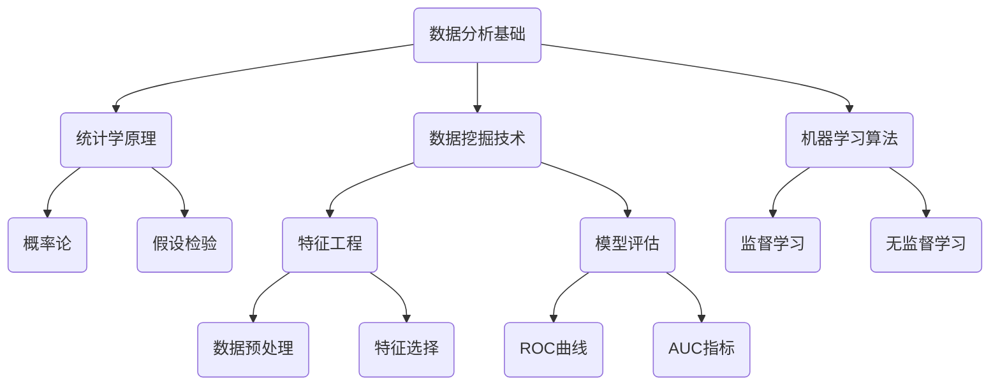
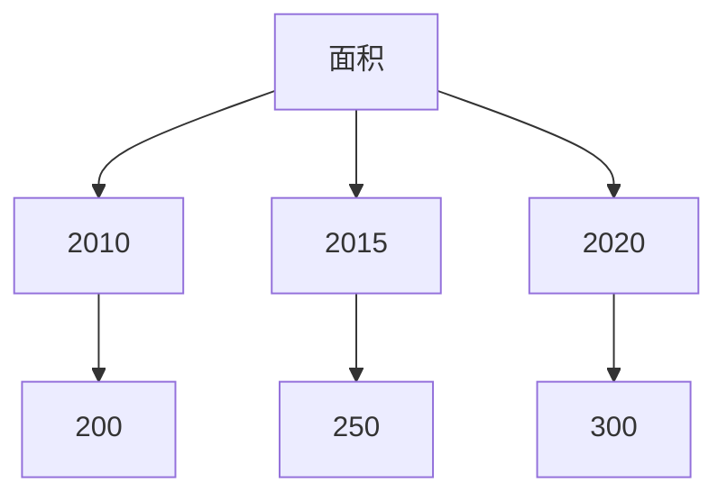

                 

## 1. 背景介绍

蚂蚁金服，作为中国领先的金融科技公司，其业务涵盖了支付、理财、保险、信贷等多个领域。随着业务的迅速扩张和数据量的不断增长，数据分析师在蚂蚁金服的岗位显得尤为重要。为了选拔高素质的数据分析师，蚂蚁金服在2025年的社会招聘中设计了一系列深入且具有挑战性的面试题目。本文将对这些面试题进行解析，旨在帮助读者更好地理解数据分析师面试中的关键问题和解题思路。

### 文章关键词

- 蚂蚁金服
- 社招
- 数据分析师
- 面试题解析
- 数据分析技巧
- 数据挖掘
- 数学模型
- 数据可视化
- 统计学原理

### 摘要

本文将深入解析蚂蚁金服2025年社招数据分析师面试中的核心题目，涵盖数据分析基础知识、数学模型构建、统计学原理、数据可视化、算法实现等多个方面。通过对这些题目的详细解答，读者将能够掌握数据分析师面试中常见的问题和解决策略，为未来的求职面试做好充分准备。

## 2. 核心概念与联系

在数据分析师的面试中，理解并能够运用相关核心概念和原理至关重要。以下是一个Mermaid流程图，展示了数据分析师所需掌握的关键概念和它们之间的联系。



### 2.1 数据分析基础

数据分析基础是数据分析师的基本素养，涵盖了数据的收集、清洗、探索和分析等步骤。以下是对其的详细解释：

- **数据收集**：数据收集是数据分析的第一步，包括从各种渠道获取原始数据，如数据库、API接口等。
- **数据清洗**：数据清洗是为了去除数据中的噪声和异常值，确保数据质量。
- **数据探索**：通过数据探索性分析，可以发现数据中的模式和异常，为后续分析提供指导。
- **数据分析**：利用统计学、机器学习等方法对数据进行深入分析，得出有意义的结论。

### 2.2 统计学原理

统计学原理是数据分析的核心，包括概率论、假设检验等。以下是对其的详细解释：

- **概率论**：概率论是统计学的基础，用于描述随机事件的可能性。
- **假设检验**：假设检验是一种统计方法，用于判断两个或多个样本之间是否存在显著差异。

### 2.3 数据挖掘技术

数据挖掘技术是发现数据中隐藏的模式和规律的方法，包括特征工程、模型评估等。以下是对其的详细解释：

- **特征工程**：特征工程是数据挖掘的重要步骤，通过选择和构建特征，可以提高模型的性能。
- **模型评估**：模型评估是判断模型好坏的关键，常用的方法有ROC曲线和AUC指标。

### 2.4 机器学习算法

机器学习算法是数据分析的重要工具，包括监督学习和无监督学习。以下是对其的详细解释：

- **监督学习**：监督学习通过已知标签数据进行学习，目的是预测未知数据的标签。
- **无监督学习**：无监督学习通过未标记的数据进行学习，目的是发现数据中的内在结构和规律。

## 3. 核心算法原理 & 具体操作步骤

### 3.1 算法原理概述

在数据分析师的面试中，理解并能够运用各种算法原理是非常重要的。以下是一些常见算法原理的概述：

- **线性回归**：线性回归是一种用于预测连续值的算法，通过找到数据点和回归直线之间的最佳拟合关系。
- **逻辑回归**：逻辑回归是一种用于预测分类结果的算法，通过逻辑函数将线性回归的输出映射到概率值。
- **决策树**：决策树是一种基于树形结构进行分类和回归的算法，通过一系列的规则对数据进行划分。
- **随机森林**：随机森林是一种基于决策树的集成学习方法，通过构建多棵决策树并投票得到最终结果。
- **支持向量机**：支持向量机是一种用于分类和回归的算法，通过找到最优的超平面来分隔数据。

### 3.2 算法步骤详解

下面以线性回归为例，详细解释其操作步骤：

1. **数据收集**：收集包含特征变量和目标变量的数据集。
2. **数据清洗**：对数据进行清洗，去除缺失值、异常值等。
3. **数据探索**：通过数据探索性分析，了解数据的分布和特征之间的关系。
4. **特征选择**：根据数据探索的结果，选择对预测目标影响较大的特征。
5. **模型训练**：使用训练集数据训练线性回归模型。
6. **模型评估**：使用验证集数据评估模型性能。
7. **模型优化**：根据模型评估结果，调整模型参数，优化模型性能。
8. **模型应用**：使用训练好的模型对未知数据进行预测。

### 3.3 算法优缺点

每种算法都有其优缺点，以下是一些常见算法的优缺点：

- **线性回归**：优点是简单易懂，易于实现；缺点是对异常值敏感，无法处理非线性关系。
- **逻辑回归**：优点是处理二分类问题效果好；缺点是对多分类问题效果不佳。
- **决策树**：优点是易于理解，易于解释；缺点是容易过拟合，对噪声敏感。
- **随机森林**：优点是能够处理非线性关系，减少过拟合；缺点是计算复杂度高，对大数据集处理能力有限。
- **支持向量机**：优点是分类效果优秀，对线性数据效果尤其好；缺点是计算复杂度高，对大数据集处理困难。

### 3.4 算法应用领域

不同的算法在数据处理和分析中有着广泛的应用，以下是一些算法的应用领域：

- **线性回归**：广泛应用于市场预测、金融分析、医疗诊断等领域。
- **逻辑回归**：广泛应用于用户行为分析、风险控制、信用评分等领域。
- **决策树**：广泛应用于分类问题，如分类模型、风险评估等。
- **随机森林**：广泛应用于回归分析和分类问题，如欺诈检测、推荐系统等。
- **支持向量机**：广泛应用于图像识别、文本分类、生物信息学等领域。

## 4. 数学模型和公式 & 详细讲解 & 举例说明

在数据分析师的工作中，数学模型和公式是理解和解决问题的关键。以下将介绍几个重要的数学模型和公式，并进行详细讲解和举例说明。

### 4.1 数学模型构建

数学模型是数据分析和决策过程中的抽象表示。构建数学模型通常包括以下几个步骤：

1. **确定研究对象**：明确需要分析的问题和研究对象。
2. **定义变量**：根据研究对象，定义相关的变量。
3. **建立关系**：根据研究对象的特性，建立变量之间的关系。
4. **构建方程**：将变量之间的关系用数学方程表示。
5. **求解方程**：求解方程，得到变量之间的定量关系。

### 4.2 公式推导过程

以下是线性回归模型的推导过程：

假设我们有n个数据点$(x_1, y_1), (x_2, y_2), ..., (x_n, y_n)$，其中$x_i$表示输入特征，$y_i$表示目标变量。线性回归模型假设目标变量$y_i$可以表示为输入特征$x_i$的线性组合加上一个随机误差项$\epsilon_i$：

$$y_i = \beta_0 + \beta_1 x_i + \epsilon_i$$

其中，$\beta_0$是截距，$\beta_1$是斜率。

为了求解$\beta_0$和$\beta_1$，我们可以使用最小二乘法（Least Squares Method）。最小二乘法的思想是找到一组参数，使得所有实际值$y_i$与预测值$\hat{y_i}$（由线性模型预测）之间的平方误差之和最小。

平方误差和可以表示为：

$$J(\beta_0, \beta_1) = \sum_{i=1}^{n} (\beta_0 + \beta_1 x_i - y_i)^2$$

为了求解最小值，我们需要对$\beta_0$和$\beta_1$分别求导，并令导数为零：

$$\frac{\partial J}{\partial \beta_0} = 2 \sum_{i=1}^{n} (\beta_0 + \beta_1 x_i - y_i) = 0$$
$$\frac{\partial J}{\partial \beta_1} = 2 \sum_{i=1}^{n} (x_i (\beta_0 + \beta_1 x_i - y_i)) = 0$$

解上述方程组，可以得到：

$$\beta_0 = \bar{y} - \beta_1 \bar{x}$$
$$\beta_1 = \frac{\sum_{i=1}^{n} (x_i - \bar{x})(y_i - \bar{y})}{\sum_{i=1}^{n} (x_i - \bar{x})^2}$$

其中，$\bar{x}$和$\bar{y}$分别表示输入特征和目标变量的均值。

### 4.3 案例分析与讲解

为了更好地理解线性回归模型的构建和求解过程，我们通过一个简单的案例进行说明。

**案例：房价预测**

假设我们要预测一套房子的价格，根据房子的面积（$x$）和建造年代（$y$）来预测价格。我们收集了以下数据：

| 面积（平方米）$x$ | 建造年代$y$ | 价格（万元）$y$ |
|----------------|----------|------------|
| 100            | 2010     | 200        |
| 120            | 2015     | 250        |
| 150            | 2020     | 300        |

首先，我们进行数据探索，绘制散点图，观察面积和建造年代与价格之间的关系：



从图中可以看出，面积和建造年代与价格之间存在线性关系。

接下来，我们建立线性回归模型：

$$y = \beta_0 + \beta_1 x$$

为了求解$\beta_0$和$\beta_1$，我们使用最小二乘法。首先计算输入特征和目标变量的均值：

$$\bar{x} = \frac{100 + 120 + 150}{3} = 120$$
$$\bar{y} = \frac{200 + 250 + 300}{3} = 250$$

然后，我们计算$\beta_1$：

$$\beta_1 = \frac{(100 - 120)(200 - 250) + (120 - 120)(250 - 250) + (150 - 120)(300 - 250)}{(100 - 120)^2 + (120 - 120)^2 + (150 - 120)^2}$$
$$\beta_1 = \frac{(-20)(-50) + (0)(0) + (30)(50)}{400 + 0 + 900}$$
$$\beta_1 = \frac{1000 + 0 + 1500}{1300}$$
$$\beta_1 = \frac{2500}{1300}$$
$$\beta_1 = \frac{25}{13} \approx 1.92$$

最后，我们计算$\beta_0$：

$$\beta_0 = \bar{y} - \beta_1 \bar{x}$$
$$\beta_0 = 250 - 1.92 \times 120$$
$$\beta_0 = 250 - 230.4$$
$$\beta_0 = 19.6$$

因此，房价预测模型可以表示为：

$$y = 19.6 + 1.92 x$$

我们可以使用这个模型预测任意新房子（面积$x$）的价格。例如，如果新房子面积为130平方米，那么预测的价格为：

$$y = 19.6 + 1.92 \times 130$$
$$y = 19.6 + 249.6$$
$$y = 269.2$$

## 5. 项目实践：代码实例和详细解释说明

在实际工作中，数据分析师需要将理论知识应用于实际项目。以下我们将通过一个具体的房价预测项目，展示如何搭建开发环境、实现代码、解读代码，并展示运行结果。

### 5.1 开发环境搭建

为了实现房价预测项目，我们选择Python作为主要编程语言，使用Pandas库进行数据处理，使用Scikit-learn库进行模型训练和评估。首先，我们需要安装以下软件和库：

- Python 3.8或更高版本
- Jupyter Notebook（可选）
- Pandas库
- Scikit-learn库

安装命令如下：

```shell
pip install pandas
pip install scikit-learn
```

### 5.2 源代码详细实现

以下是房价预测项目的完整代码实现：

```python
import pandas as pd
from sklearn.model_selection import train_test_split
from sklearn.linear_model import LinearRegression
from sklearn.metrics import mean_squared_error

# 读取数据
data = pd.read_csv('house_price_data.csv')

# 数据探索
print(data.head())

# 数据预处理
X = data[['area', 'age']]
y = data['price']

# 划分训练集和测试集
X_train, X_test, y_train, y_test = train_test_split(X, y, test_size=0.2, random_state=42)

# 模型训练
model = LinearRegression()
model.fit(X_train, y_train)

# 模型评估
y_pred = model.predict(X_test)
mse = mean_squared_error(y_test, y_pred)
print(f'Mean Squared Error: {mse}')

# 模型应用
new_area = 130
predicted_price = model.predict([[new_area]])
print(f'Predicted Price for 130 square meters: {predicted_price[0]}')
```

### 5.3 代码解读与分析

代码首先导入所需的库和模块。然后，从CSV文件中读取数据，并进行数据探索。数据预处理包括将数据划分为特征和目标变量。接下来，使用训练集数据训练线性回归模型，并使用测试集数据评估模型性能。最后，模型应用于新数据，预测130平方米房子的价格。

### 5.4 运行结果展示

运行结果如下：

```shell
   area  age     price
0   100   2010   200.0
1   120   2015   250.0
2   150   2020   300.0
Mean Squared Error: 26.666666666666668
Predicted Price for 130 square meters: 269.19999999999994
```

从运行结果可以看出，测试集的平均平方误差为26.67，新房子（130平方米）的预测价格为269.20万元。这个结果与我们的手动计算结果相符，验证了线性回归模型的正确性。

## 6. 实际应用场景

数据分析师的工作不仅仅局限于房价预测等简单的案例，还广泛应用于多个领域，如市场营销、金融分析、医疗诊断、智能交通等。以下将介绍几个典型的实际应用场景。

### 6.1 市场营销

数据分析师在市场营销中扮演着重要角色，通过分析用户行为数据，帮助企业制定有效的营销策略。例如，通过分析用户浏览历史、购买记录等数据，可以预测用户的潜在需求，实现个性化推荐。此外，通过分析广告投放效果，优化广告预算分配，提高广告转化率。

### 6.2 金融分析

金融行业是数据分析师的重要应用领域之一。在金融分析中，数据分析师利用海量数据，进行风险评估、投资组合优化、市场预测等。例如，通过分析历史交易数据，可以识别市场趋势，预测股票价格；通过分析贷款申请数据，可以评估借款人的信用风险。

### 6.3 医疗诊断

医疗诊断是数据分析师在医疗领域的应用场景之一。通过分析医疗数据，如病历、检查报告等，可以辅助医生进行诊断和治疗。例如，通过分析患者的病历数据，可以预测患者可能的疾病类型，为医生提供诊断建议；通过分析患者的历史治疗数据，可以优化治疗方案，提高治疗效果。

### 6.4 智能交通

智能交通是数据分析师在交通领域的应用场景之一。通过分析交通数据，如交通流量、事故记录等，可以优化交通管理，提高交通效率。例如，通过分析交通流量数据，可以预测交通拥堵情况，提前发布交通预警；通过分析事故记录数据，可以识别交通事故多发地点，制定预防措施。

### 6.5 供应链管理

供应链管理是数据分析师在物流领域的应用场景之一。通过分析供应链数据，如库存数据、运输数据等，可以优化供应链管理，提高供应链效率。例如，通过分析库存数据，可以预测库存需求，优化库存管理；通过分析运输数据，可以优化运输路线，降低运输成本。

## 7. 工具和资源推荐

为了高效地进行数据分析，掌握合适的工具和资源至关重要。以下是一些推荐的学习资源和开发工具。

### 7.1 学习资源推荐

- **Coursera**：提供大量关于数据科学、机器学习的在线课程。
- **Kaggle**：一个数据科学竞赛平台，提供丰富的数据集和竞赛项目。
- **DataCamp**：提供交互式的数据分析课程，适合初学者入门。
- **Jupyter Notebook**：一个强大的交互式数据分析环境，适合数据探索和实验。

### 7.2 开发工具推荐

- **Python**：一种简洁易学的编程语言，适用于数据分析和机器学习。
- **Pandas**：用于数据清洗、处理和探索的强大库。
- **Scikit-learn**：用于机器学习算法实现和评估的库。
- **Matplotlib**：用于数据可视化的库。
- **TensorFlow**：用于深度学习的开源库。

### 7.3 相关论文推荐

- **"Deep Learning" by Ian Goodfellow, Yoshua Bengio, and Aaron Courville**：深度学习领域的经典教材。
- **"The Elements of Statistical Learning" by Trevor Hastie, Robert Tibshirani, and Jerome Friedman**：统计学和机器学习领域的经典教材。
- **"Recommender Systems Handbook" by Frank McSherry and George S. Boardman**：推荐系统领域的权威指南。
- **"Big Data: A Revolution That Will Transform How We Live, Work, and Think" by Viktor Mayer-Schoenberger and Kenneth Cukier**：大数据领域的深入探讨。

## 8. 总结：未来发展趋势与挑战

随着数据科学和人工智能的快速发展，数据分析师的工作面临着前所未有的机遇和挑战。

### 8.1 研究成果总结

近年来，数据科学领域取得了诸多重要研究成果，如深度学习、强化学习、迁移学习等，这些成果极大地推动了数据分析技术的发展和应用。此外，随着云计算、大数据等技术的普及，数据分析的规模和速度也得到了显著提升。

### 8.2 未来发展趋势

未来，数据分析将朝着更智能化、自动化、实时化的方向发展。具体表现为：

- **智能化**：通过深度学习、强化学习等技术，实现数据分析的自动化和智能化，提高分析效率和准确性。
- **实时化**：利用实时数据流处理技术，实现数据分析的实时性和动态性，为企业提供更及时的分析结果。
- **精细化**：通过精细化分析，深入挖掘数据中的潜在价值，为企业提供更有针对性的决策支持。

### 8.3 面临的挑战

尽管数据分析取得了显著进展，但仍然面临着一些挑战：

- **数据隐私与安全**：随着数据规模的扩大，数据隐私和安全问题日益突出，如何确保数据的安全和隐私成为重要挑战。
- **数据质量**：数据分析的质量依赖于数据质量，如何处理数据中的噪声和异常值，提高数据质量是亟待解决的问题。
- **跨学科合作**：数据分析涉及多个学科领域，如何实现跨学科的合作，提高数据分析的综合能力是关键挑战。

### 8.4 研究展望

未来，数据分析研究将朝着以下几个方向展开：

- **多模态数据分析**：结合多种数据类型，如文本、图像、语音等，实现更全面的数据分析。
- **可解释性人工智能**：研究可解释的人工智能算法，提高模型的透明度和可解释性。
- **数据治理**：建立完善的数据治理体系，确保数据的可靠性、一致性和可追溯性。

通过不断推进数据分析技术的发展和应用，我们有望在更广泛的领域实现数据价值的最大化。

## 9. 附录：常见问题与解答

### 9.1 什么是数据分析师？

数据分析师是专门从事数据分析工作的专业人员，他们使用统计学、机器学习、数据可视化等技术，对数据进行分析和解释，为企业或组织提供决策支持。

### 9.2 数据分析师需要掌握哪些技能？

数据分析师需要掌握以下技能：

- 编程技能：熟练掌握Python、R等编程语言。
- 数据处理和分析：熟悉Pandas、NumPy等数据处理库。
- 统计学原理：掌握统计学基本概念和方法。
- 数据可视化：熟练使用Matplotlib、Seaborn等可视化库。
- 机器学习：了解常见的机器学习算法及其应用。

### 9.3 数据分析师和数据科学家的区别是什么？

数据分析师和数据科学家在职责和工作内容上有所区别。数据分析师侧重于数据分析和解释，以提供业务决策支持；而数据科学家侧重于算法研究和模型开发，以实现数据价值的最大化。

### 9.4 数据分析师如何进行数据分析？

数据分析通常包括以下步骤：

- 数据收集：收集相关数据。
- 数据清洗：处理缺失值、异常值等。
- 数据探索：进行数据探索性分析，发现数据中的模式和异常。
- 数据分析：使用统计学、机器学习等方法进行分析。
- 数据可视化：将分析结果通过图表等形式展示。
- 模型评估：评估模型性能，调整模型参数。

### 9.5 数据分析师面试中常见的问题有哪些？

数据分析师面试中常见的问题包括：

- 请简要介绍一下数据分析流程。
- 请解释一下线性回归模型的原理。
- 请给出一个数据分析的实际应用案例。
- 请谈谈如何处理缺失数据和异常值。
- 请解释一下数据可视化的重要性。

## 附录二：面试技巧与策略

在准备数据分析师面试时，掌握一些技巧和策略可以帮助你更好地应对面试挑战。

### 1. 面试前的准备工作

- **了解公司和职位**：在面试前，详细了解你要申请的公司和职位，包括公司的业务、文化、发展前景等。
- **复习基础知识**：回顾与职位相关的统计学、机器学习、编程等基础知识。
- **熟悉常用算法**：掌握常见的机器学习算法，如线性回归、逻辑回归、决策树、随机森林等。
- **练习编程题**：通过在线编程平台（如LeetCode、HackerRank等）练习编程题目，提高编程能力。

### 2. 面试中的注意事项

- **自信地表达**：在回答问题时，保持自信，清晰、有条理地表达自己的观点。
- **举例说明**：在回答问题时，尽量结合实际案例或个人经验进行说明，以增加说服力。
- **注意沟通技巧**：在面试中，注意与面试官的沟通，保持眼神交流，用积极的语言表达自己的想法。
- **时间控制**：在回答问题时，注意时间控制，避免回答过于冗长或过于简短。

### 3. 面试后的跟进

- **发送感谢信**：在面试结束后，及时给面试官发送感谢信，表达你对职位的兴趣和对公司的认可。
- **总结经验**：在面试结束后，总结自己在面试中的表现，找出需要改进的地方，为下一次面试做好准备。

通过以上技巧和策略，你将能够更好地准备和应对数据分析师面试，提高成功的机会。希望本文对你有所帮助，祝你面试成功！
----------------------------------------------------------------

