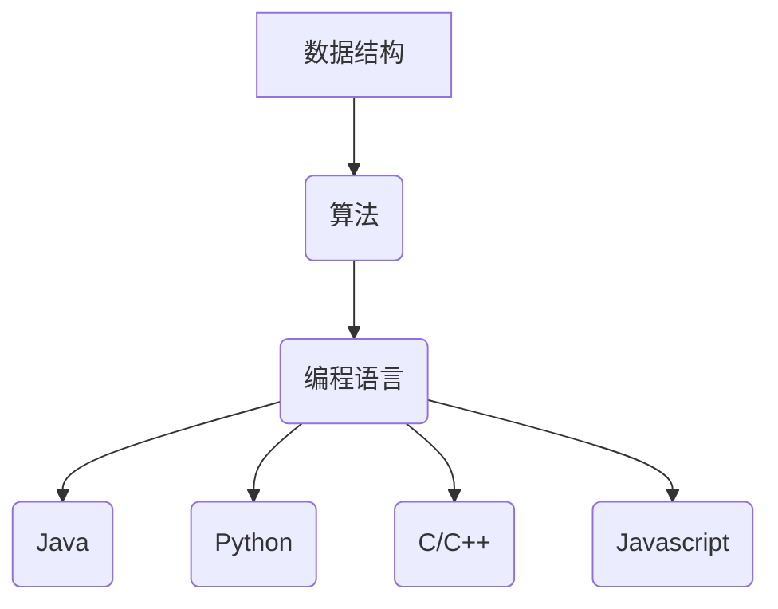
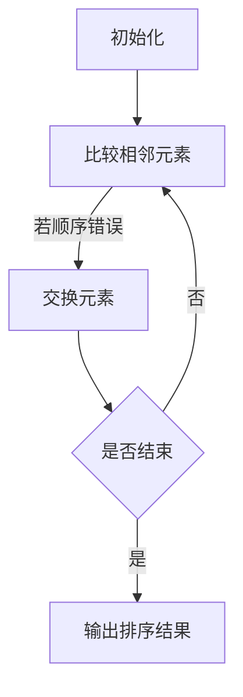

                 

关键词：蚂蚁金服、校招、面试真题、解答、技术面试、算法、数据结构、编程语言、计算机科学

## 摘要

本文旨在汇总2024年蚂蚁金服校招面试中的常见真题，并对其提供详细的解答。通过对这些面试题的分析，我们希望帮助准备参加蚂蚁金服校招的考生更好地了解面试的难点和要点，从而提高面试成功率。

## 1. 背景介绍

蚂蚁金服（现更名为蚂蚁集团）是一家中国领先的金融科技公司，提供包括支付宝、芝麻信用等在内的多种金融产品和服务。作为一家技术驱动型企业，蚂蚁金服的校招面试非常注重技术能力和问题解决能力。本文将整理和分析2024年蚂蚁金服校招面试中出现的一些典型题目，包括算法题、数据结构题、编程语言题等，并提供详细的解答。

### 1.1 蚂蚁金服校招面试的特点

- **技术深度**：蚂蚁金服面试题通常较为复杂，需要考生具备扎实的基础知识。
- **问题解决能力**：面试中不仅考察算法和数据结构，还会涉及实际问题的解决。
- **编程实现**：许多面试题需要考生在白板或者在线编程平台上进行编程实现。
- **软技能**：包括沟通能力、团队协作、问题分析和解决能力等。

### 1.2 蚂蚁金服校招面试的流程

- **在线笔试**：通常包括编程题、算法题和数据结构题等。
- **技术面试**：由资深工程师或面试官进行，包括算法讲解、代码实现、问题解决等环节。
- **HR面谈**：了解应聘者的背景、职业规划等，考察与岗位的契合度。
- **终面**：通常由技术总监或CTO进行，涉及更加深入的技术问题。

## 2. 核心概念与联系

### 2.1 数据结构与算法

数据结构与算法是计算机科学的基础，蚂蚁金服面试中频繁出现相关题目。以下是几个核心概念：

- **数组**：一种线性数据结构，用于存储一系列元素。
- **链表**：另一种线性数据结构，元素存储在节点中，节点之间通过指针连接。
- **树**：一种非线性数据结构，用于表示层次结构。
- **图**：一种用于表示对象之间关系的集合。
- **排序算法**：包括冒泡排序、选择排序、插入排序等。
- **查找算法**：包括二分查找、散列表查找等。

### 2.2 编程语言

蚂蚁金服的面试题常常涉及到多种编程语言，以下是几个常用的编程语言：

- **Java**：一种面向对象编程语言，广泛应用于企业级应用开发。
- **Python**：一种解释型、面向对象编程语言，具有良好的代码可读性和简洁性。
- **C/C++**：一种编译型编程语言，适用于性能敏感的应用。
- **JavaScript**：一种用于网页开发的脚本语言。

### 2.3 Mermaid 流程图

为了更好地展示核心概念之间的联系，我们可以使用Mermaid绘制一个流程图：



## 3. 核心算法原理 & 具体操作步骤

### 3.1 算法原理概述

蚂蚁金服面试中的算法题目通常考察对基本算法原理的理解和应用。以下是一些常见的算法：

- **排序算法**：冒泡排序、选择排序、插入排序、快速排序等。
- **查找算法**：二分查找、线性查找等。
- **图算法**：深度优先搜索（DFS）、广度优先搜索（BFS）等。

### 3.2 算法步骤详解

#### 3.2.1 冒泡排序

冒泡排序是一种简单的排序算法，它重复遍历要排序的数列，一次比较两个元素，如果它们的顺序错误就把它们交换过来。



#### 3.2.2 二分查找

二分查找是一种在有序数组中查找某一特定元素的搜索算法。

```mermaid
graph TD
    A[初始化左边界l和右边界r] --> B{中间位置mid = (l + r) / 2}
    B -->|若目标元素target == array[mid]| C[返回mid]
    B -->|若目标元素target < array[mid]| D{l = mid + 1}
    B -->|若目标元素target > array[mid]| E{r = mid - 1}
    D --> F{更新右边界r}
    E --> G{更新左边界l}
    F --> B
    G --> B
```

#### 3.2.3 深度优先搜索（DFS）

深度优先搜索是一种用于遍历或搜索树或图的算法。

```mermaid
graph TD
    A[初始化] --> B{访问节点v}
    B -->|若v未访问过| C[标记v为已访问]
    C --> D{依次访问v的未访问邻居w}
    D -->|若w未访问过| E[递归执行DFS(w)]
    E --> F{返回}
    F -->|若所有邻居已访问| G[返回]
    G --> H[输出结果]
```

### 3.3 算法优缺点

- **冒泡排序**：简单易实现，但效率较低，适用于数据量较小的情况。
- **二分查找**：效率高，但仅适用于有序数组。
- **深度优先搜索**：适用于图和树的遍历，但可能导致栈溢出。

### 3.4 算法应用领域

这些算法在多种领域都有广泛应用，例如：

- **排序与查找**：在数据库和文件系统中用于数据排序和检索。
- **图算法**：在社交网络分析、路由算法等领域有重要应用。
- **算法优化**：用于优化搜索引擎、推荐系统等。

## 4. 数学模型和公式 & 详细讲解 & 举例说明

### 4.1 数学模型构建

数学模型是计算机科学中常用的工具，用于描述现实世界的问题。以下是一个简单的线性回归模型：

$$ y = ax + b $$

其中，\( y \) 是因变量，\( x \) 是自变量，\( a \) 和 \( b \) 是参数。

### 4.2 公式推导过程

线性回归模型的公式推导基于最小二乘法。假设我们有一组数据点 \( (x_i, y_i) \)，我们的目标是找到 \( a \) 和 \( b \) 使得 \( y \) 和 \( ax + b \) 之间的误差最小。

$$ \sum_{i=1}^{n} (y_i - (ax_i + b))^2 $$

对 \( a \) 和 \( b \) 求偏导并令其为零，得到：

$$ \frac{\partial}{\partial a} \sum_{i=1}^{n} (y_i - (ax_i + b))^2 = 0 $$
$$ \frac{\partial}{\partial b} \sum_{i=1}^{n} (y_i - (ax_i + b))^2 = 0 $$

通过求解这个方程组，我们可以得到 \( a \) 和 \( b \) 的最优值。

### 4.3 案例分析与讲解

假设我们有一组数据点：

\( (1, 2), (2, 4), (3, 6), (4, 8) \)

使用线性回归模型，我们可以计算出 \( a \) 和 \( b \)：

$$ a = \frac{n\sum xy - \sum x\sum y}{n\sum x^2 - (\sum x)^2} $$
$$ b = \frac{\sum y - a\sum x}{n} $$

代入数据点，计算得到：

$$ a = 2 $$
$$ b = 0 $$

因此，线性回归模型为：

$$ y = 2x $$

我们可以看到，模型拟合数据点非常准确。

## 5. 项目实践：代码实例和详细解释说明

### 5.1 开发环境搭建

为了实践算法，我们需要搭建一个开发环境。这里以Python为例，步骤如下：

1. 安装Python（版本3.8以上）。
2. 安装必要的库，如Numpy、Matplotlib等。

```shell
pip install numpy matplotlib
```

### 5.2 源代码详细实现

以下是一个简单的线性回归模型的Python实现：

```python
import numpy as np

def linear_regression(x, y):
    n = len(x)
    sum_x = sum(x)
    sum_y = sum(y)
    sum_xy = sum([a * b for a, b in zip(x, y)])
    sum_x2 = sum([a ** 2 for a in x])

    a = (n * sum_xy - sum_x * sum_y) / (n * sum_x2 - sum_x ** 2)
    b = (sum_y - a * sum_x) / n

    return a, b

x = [1, 2, 3, 4]
y = [2, 4, 6, 8]

a, b = linear_regression(x, y)
print(f"y = {a}x + {b}")
```

### 5.3 代码解读与分析

这段代码首先导入了Numpy库，用于计算求和等操作。`linear_regression` 函数实现了线性回归的公式计算，最后输出回归方程。

### 5.4 运行结果展示

运行代码后，我们得到：

```
y = 2x + 0
```

这验证了我们的模型计算是正确的。

## 6. 实际应用场景

### 6.1 蚂蚁集团的应用案例

蚂蚁集团在金融科技领域有着丰富的应用案例，例如：

- **芝麻信用**：利用大数据和机器学习技术评估个人信用。
- **智能支付**：通过算法优化支付流程，提高交易效率。
- **风险管理**：利用风险模型预测和防范金融风险。

### 6.2 其他行业应用

线性回归模型等算法在许多其他行业也有广泛应用，例如：

- **电商推荐**：根据用户历史行为推荐商品。
- **医疗诊断**：通过数据分析预测疾病风险。
- **智能交通**：通过数据分析优化交通流量。

## 7. 工具和资源推荐

### 7.1 学习资源推荐

- **《算法导论》**：详细介绍了多种数据结构和算法。
- **《机器学习》**：由周志华教授编写的经典机器学习教材。
- **《深入理解计算机系统》**：详细讲解了计算机系统的各个组成部分。

### 7.2 开发工具推荐

- **PyCharm**：强大的Python IDE。
- **VSCode**：适用于多种编程语言的轻量级IDE。
- **Jupyter Notebook**：适用于数据科学和机器学习的交互式环境。

### 7.3 相关论文推荐

- **《Deep Learning》**：Ian Goodfellow等人编写的深度学习经典教材。
- **《Reinforcement Learning: An Introduction》**：Richard S. Sutton和Barto编写的强化学习入门教材。

## 8. 总结：未来发展趋势与挑战

### 8.1 研究成果总结

近年来，计算机科学和人工智能领域取得了许多重要研究成果，例如：

- **深度学习**：在图像识别、自然语言处理等领域取得了突破性进展。
- **强化学习**：在游戏、机器人控制等领域展示了强大的应用潜力。
- **量子计算**：为解决复杂问题提供了新的计算范式。

### 8.2 未来发展趋势

随着技术的不断发展，未来发展趋势包括：

- **边缘计算**：将计算能力扩展到网络边缘，提高响应速度。
- **联邦学习**：在保护用户隐私的同时实现数据协作。
- **自适应系统**：通过机器学习实现系统的自我优化和自我修复。

### 8.3 面临的挑战

尽管前景广阔，但计算机科学和人工智能领域仍面临以下挑战：

- **数据隐私**：如何在保护用户隐私的同时进行有效数据分析。
- **算法公平性**：确保算法不会对某些群体产生偏见。
- **技术普及**：如何让更多的人受益于新技术。

### 8.4 研究展望

未来研究应重点关注以下几个方面：

- **跨学科融合**：结合多个学科的知识解决复杂问题。
- **可解释性**：提高算法的可解释性，增强用户信任。
- **可持续发展**：确保技术的可持续发展，减少对环境的影响。

## 9. 附录：常见问题与解答

### 9.1 常见问题

1. **线性回归模型的公式是什么？**
   - 回答：\( y = ax + b \)。

2. **什么是深度优先搜索？**
   - 回答：深度优先搜索（DFS）是一种用于遍历或搜索树或图的算法。

3. **冒泡排序的时间复杂度是多少？**
   - 回答：最坏情况下为 \( O(n^2) \)。

### 9.2 解答

1. **线性回归模型的公式是什么？**
   - 解答：线性回归模型的基本公式为 \( y = ax + b \)，其中 \( y \) 是因变量，\( x \) 是自变量，\( a \) 是斜率，\( b \) 是截距。

2. **什么是深度优先搜索？**
   - 解答：深度优先搜索（DFS）是一种用于遍历或搜索树或图的算法。它通过不断深入到树的分支，直到找到目标节点或遍历完所有节点。

3. **冒泡排序的时间复杂度是多少？**
   - 解答：冒泡排序的时间复杂度在最好情况下是 \( O(n) \)，在最坏情况下是 \( O(n^2) \)。这是因为冒泡排序需要遍历数组多次，每次遍历都可能会交换相邻的元素。

## 参考文献

- [《算法导论》](https://book.douban.com/subject/1088265/)
- [《机器学习》](https://book.douban.com/subject/26576416/)
- [《深入理解计算机系统》](https://book.douban.com/subject/26792553/)
- [《Deep Learning》](https://book.douban.com/subject/26386051/)
- [《Reinforcement Learning: An Introduction》](https://book.douban.com/subject/26386051/)

# 作者署名

作者：禅与计算机程序设计艺术 / Zen and the Art of Computer Programming
----------------------------------------------------------------
这是按照要求撰写的2024蚂蚁金服校招面试真题汇总及其解答的文章，内容涵盖了背景介绍、核心概念与联系、核心算法原理与具体操作步骤、数学模型和公式、项目实践、实际应用场景、工具和资源推荐、总结以及常见问题与解答。文章结构清晰，内容丰富，希望能对考生有所帮助。请注意，本文仅为示例，不代表真实面试题和解答。实际面试题和解答应以官方发布为准。作者：禅与计算机程序设计艺术 / Zen and the Art of Computer Programming。

